# lyteboat 架构：从启动到一次请求

> **读者**：熟悉参考实现（lyteboat 的 Python 前身）、刚接触 dsh（DeepSeek Harness）的工程师。
>
> **路径约定**：不带前缀的路径相对仓库根目录。内核（lyteboat 拥有源码的 14 个 dsh 包，清单是 `dsh/kernel.json`）按 `dsh/` 下的路径引用；`dsh@rc.2:` 前缀指上游 tag `dsh-v0.1.7-rc.2`（`dsh.upstream.json`）的源码（`packages/<group>/<pkg>/src`、`vendor/*`），也就是 lyteboat 从 npm 安装、不拥有源码的那些包。参考实现只写文件路径。仓库里的代码按文件加符号名引用（函数、类、方法、常量；YAML 写行 id 或键），正文已经点名符号时只写文件，不写行号；`dsh@rc.2:` 的上游路径钉在 tag 上，保留行号。
>
> **例子怎么来的**：文中的运行结果（stdout、stderr、会话日志的事件顺序、模型收到的请求）都来自构建好的 CLI `node lyteboat/apps/cli/lib/bin.js`，模型是 `@lyteboat/testing/scripted-model` 的脚本化模型（`startScriptedModel`，环境变量由 `scriptedModelEnv` 给出），脚本回答 finance 的准入分类器、skill 路由器和循环请求，`DSH_TELEMETRY_DISABLED=1`，没有用真实 key。日志和请求里的模型是 `deepseek-official` / `deepseek-flash`：`lyteboat try` 用的是 dsh-base 的 `agent-default-model` 行配的默认模型（`dsh@rc.2:packages/bundle/base/cordis.patch.yml:82-86`），它在 `dsh-llm-deepseek` 的默认目录里（`dsh@rc.2:packages/llm/llm-deepseek/src/models.ts:7-14`）。会话 id、时间戳和耗时每次运行都不一样，文中省略或写成 `…`。怎样在测试里复现，见 [7.5](#75-复现本文的运行)。
>
> **命令的写法**：正文里的命令写成从仓库根目录跑、`--agents ./examples/agents`。带 `--agent` 时会话头的 `cwd` 是 `$LYTEBOAT_HOME/agent-workdirs/<id>`，和从哪个目录启动无关；skill 正文里的 `Base directory` 是 agents 根的绝对路径，随机器不同。实验用的 patch 文件放在仓库外的一个目录里，文中记作 `$SCRATCH`。

---

## 0. 一页纸总结

### 0.1 一句话

**lyteboat 是 dsh 的一个发行版：它拥有 dsh 内核 14 个包的源码（沿用上游包名），把参考实现的运行时能力（skill 路由、工具可见性、A2UI 卡片、会话状态、外部历史导入、循环前的准入）写成挂在 dsh 接缝上的 Cordis 插件，再用自己的启动器 `lyteboat` 把这些东西按 YAML 组合起来跑。**（`CLAUDE.md`「Repository layout」）同一层的宿主服务里有三个负责请求本身：旁路模型调用 `@lyteboat/aux-llm`、请求上下文 `@lyteboat/request-context`、循环前的准入 `@lyteboat/intake-guard`。

为什么要“拥有内核源码、保留包名”：npm 上的官方包和社区插件都按包名 `@deepseek-ai/dsh-tools` 这类名字去 import 内核；lyteboat 用 pnpm `overrides` 把这些名字全部指到 `dsh/` 下自己的副本（`pnpm-workspace.yaml`），于是整个依赖图里只有一份内核，而且是 lyteboat 的。插件不用改一行代码就跑在 lyteboat 的实现上。

### 0.2 三层包

| 层 | 在哪 | 有哪些 | 源码归谁 | 怎么改 |
|---|---|---|---|---|
| 内核 | `dsh/`（清单 `dsh/kernel.json`） | `dsh-llm`、`dsh-session`、`dsh-system-prompt`、`dsh-tools`、`dsh-skill`、`dsh-agent`、`dsh-agent-loop`、`dsh-session-projection`、`dsh-session-persistence`、`dsh-session-persistence-jsonl`、`dsh-compaction`、`dsh-compaction-basic`、`dsh-agent-loop-testkit`、`dsh-api-session-controller` | lyteboat（每个上游 tag 原样导入，再叠 lyteboat 的分类提交） | 只能用带 `Dist-Change:` trailer 的提交（`CLAUDE.md`「Architecture boundaries」的 “The kernel changes only by classified commits”） |
| 其余 dsh 包 | `node_modules`，从 npm 装 | `dsh-base`（bundle）、`dsh-app-boot`、`dsh-agent-preset-registry`、`dsh-llm-deepseek`、`dsh-user-approval`、`dsh-session-checkpoint-policy` 等 | 上游 | 不改源码，只用 patch 层改配置、增删行；版本被 `.pnpmfile.cjs` 钉在 `dsh.upstream.json` 的 `0.1.7-rc.2` |
| lyteboat 自己的包 | `lyteboat/<层>/<包>`；示例 agent 在旁边的 `examples/agents/<id>` | 见 README 的[项目结构](../README.md#项目结构) | lyteboat | 正常开发，层间只能向下依赖（`CLAUDE.md`「Architecture boundaries」） |

为什么 `dsh-llm` 和 `dsh-skill` 在内核里：包进内核的规则是“lyteboat 必须改它的实现”，或“它是每个 lyteboat 组合启动都离不开的能力”（`CLAUDE.md`「Architecture boundaries」的 “Promotion”）。模型访问、工具、skill、会话是每个 lyteboat 组合都依赖的能力，`dsh-llm` 和 `dsh-skill` 按后一条在内核里。但要分清“依赖”和“启动审计强制”：启动审计真正强制的只有 `agent-loop` 注入的服务（`llm`、`tools`、`sessions`、`systemPrompt`、`sessionProjections`、`agents`，`dsh/core/agent-loop/src/index.ts` `AgentLoop.inject`），禁掉 `llm` 行会 `StartupError` 并退出 1；`skill` 行缺失时 `lyteboat try "你好"` 仍能启动，只警告 3 行 pending，而带 `--agent finance` 时 finance 的 preset 会因为 `finance-agent` 等不到 `skills` 而失效、退出 1。完整实验见 [3.4](#34-启动保证哪些能力)。

### 0.3 一次请求经过哪些部件

以 `lyteboat try --agents ./examples/agents --agent finance --context '{"customer":"young-idle-cash"}' "看看我的资产"` 为例：

1. **启动器** `@lyteboat/cli` 把 profile `try` 组合成一棵 Cordis 插件树（dsh-base → `@lyteboat/host` → `@lyteboat/business-base` → `@lyteboat/try`；业务底座关掉了编码工具、沙箱与审批等行）。
2. **`@lyteboat/try`** 把 `examples/agents/finance` 声明成一个 preset，通过内核的 `agents.create` 建出一个 agent 实例，然后把任务交给 `ctx.intakeGuard.submit`：它先在循环之前准入这条请求——finance 的准入函数经 `ctx.auxLlm` 做一次旁路模型调用给请求分类（记成一条可忽略的 `lyteboat/aux-llm-call`），问的是自己的资产、客户 `young-idle-cash` 有已授权的持仓，结论是放行——再把 `ctx.requestContext.message(...)` 做成的人类消息 `followup` 进去，请求上下文、agent 的身份（id、版本、目录摘要）和准入结论都记在这条消息的 `source` 上。
3. **内核 driver**（`ReactLoopAgent`）跑一个 turn：inbox → `lyteboat/intake`（intake-guard 看到消息带的是放行结论）→ `lyteboat/pre-assemble`（skill-router 经 `ctx.auxLlm` 再做一次旁路调用，选中 `asset-overview`，也记成一条 `lyteboat/aux-llm-call`；tool-policy 让 `asset_overview` 可见）→ `systemPrompt.assemble` → `agent/pre-step`（skill-router 把 skill 正文作为 dsh 自己的 skill-invocation 消息加进这一步）→ `agent/request`（finance 把温度定成 0）→ `llm.stream`。
4. 模型调用 `asset_overview`：tools 运行时走 `tools/pre-execute` → `tools/execute` → `tools/post-execute`；工具按请求上下文读客户，用 `ctx.a2ui.renderCard` 渲染一张 `deferred` 卡，`render` 出给模型看的 digest，`presentationMeta`（`cardsPresentationMeta`）把卡放进 `meta.lyteboat.cards`，写进 `tool/result`。
5. **投影**把 `tool/result` 折叠进 `lyteboatCards`；下一个 step 模型读 digest 回答，在要放卡片的地方单独写一行 `[[card:asset_overview]]`。（工具还可以带 `stateDelta`，折叠进 `lyteboatState`、在下一步以 `lyteboat:state` 给模型看；finance 的工具不用它，[2.4](#24-lyteboat-怎么覆盖-dsh) 第 5 行的 `--plugin` 例子用它。）
6. `lyteboat try` 用 `ctx.a2ui.turnParts` 把这一轮排版打到 stdout：标记换成卡片，打成单独一行 `[card asset_overview]`，前后是回答的文字。
7. 每条事件都经 `Session.append` 进入会话日志，由 JSONL 后端写到 `$LYTEBOAT_HOME/sessions/.../session.v4.jsonl.zstd`。

同一个会话后来换了 skill（用 `--session-id` 续接、问“诊断一下我的配置”，见 [5.4](#54-日志怎么映射回模型看到的内容)），两次请求之间的工具集就变了：driver 在新的 `request/header` 之后追加一条 `developer/message`（`source.kind` 是 `tool-registry`，内容是 `tool-addition` / `tool-removal`，带 `headerSeq`）。dsh 默认的 `deepseek-flash` 路由声明了 `toolUpdate: addition-only`，所以工具变化不开新的请求序列：新出现的工具以 `defer_loading` 声明，由对话里的一个 `tool_addition` 块启用，见 [5.4](#54-日志怎么映射回模型看到的内容)。

### 0.4 给参考实现工程师的对照

| 参考实现 | lyteboat / dsh | 差别在哪 |
|---|---|---|
| `Lifecycle` Protocol：`init` / `install_routes` / `start` / `stop`（参考实现 `core/protocol/lifecycle.py`） | Cordis 插件：`apply(ctx, config)` 或 `Service` 子类；停止靠 `ctx.effect` 登记的 disposer | 没有显式的 start 阶段：插件声明 `inject`，依赖的服务到齐就激活，依赖消失就卸载 |
| `Bootstrap(plugins=[...])`（参考实现 `core/protocol/bootstrap.py`） | `boot()`（`dsh@rc.2:packages/boot/app-boot/src/index.ts:972`）+ profile 的 patch 层 | 组合写在 YAML 里（`cordis.patch.yml`），不是 Python 列表；用户可以用 `--patch` 覆盖任意一行 |
| `AppContext` | Cordis `Context` 上的服务：`ctx.llm`、`ctx.tools`、`ctx.sessions`… | 按名字发布、按名字注入 |
| `BaseAgent.build_tools()` / `build_llm()` / `build_skill_router()`（参考实现 `core/runtime/base_agent.py`） | agent 目录的 `agent.cordis.yml`，每行一个插件（`examples/agents/finance/agent.cordis.yml`） | 行在 agent 的 standing scope 里运行，只影响这个 agent 的会话 |
| Runner + `RunnerCallbacks` | 内核 `AgentLoop` / `ReactLoopAgent` + 事件（`lyteboat/intake`、`lyteboat/pre-assemble`、`tools/*`…） | 回调变成 waterfall 事件，谁都可以挂 |
| SessionManager + JSONL | `sessions`（dsh-session）+ `sessionPersistence`（dsh-session-persistence-jsonl，zstd 分帧） | 日志是唯一事实来源，模型请求由日志推导出来 |
| SkillRouter（`BaseAgent.build_skill_router()`，参考实现 `base_agent.py`） | `@lyteboat/skill-router` | 参考实现的路由 prompt 原样移植（`lyteboat/plugins/skill-router/src/router.ts`）；路由调用经 `@lyteboat/aux-llm`，完整的 prompt 和回答记在日志里的 `lyteboat/aux-llm-call`；选中的 skill 正文以 dsh 的 skill-invocation 消息进入对话 |
| `IntakeGuard` Protocol：进入 ReAct 循环前判断请求在不在受理范围（参考实现 `core/runtime/guard.py`） | `@lyteboat/intake-guard` + `@lyteboat/request-context` | agent 在自己的 scope 里注册准入函数；调用方（`lyteboat try`）把请求交给 `intakeGuard.submit`，它在 `followup` 之前准入，结论和请求上下文记在人类消息的 `source.lyteboatRequest` 上；`reply` 结论在循环的 `lyteboat/intake` 里直接回答，不发模型请求。见 [5.6](#56-带请求上下文的请求准入在循环之前) |
| `BaseAgent.build_compaction()`（参考实现 `base_agent.py`） | 内核包 `dsh-compaction` + `dsh-compaction-basic`，后者作为 `agent/pre-step` 监听运行（`dsh/compaction/compaction-basic/src/index.ts` `BasicCompactionEngine._registerAutomaticCompaction`） | 压缩不是 Runner 的一个配置项，而是 step 进入前的一层 waterfall；压缩过程写成 `compaction/start` / `compaction/summary` / `compaction/end` 进日志（`dsh/compaction/compaction-basic/src/region.ts` `compactSurfaceRegion`、`commitCompactionBody`） |
| Runner 里的重试 | npm `dsh-llm-retry`，监听 `agent/request-error`（`dsh@rc.2:packages/llm/llm-retry/src/index.ts:243`） | 失败的请求在日志里留一条 `assistant/attempt`，重试决定由插件给出 |
| `SessionHistoryMerger`（`base_agent.py`） | `@lyteboat/history-import` + dsh 的 session seed | 外部历史变成会话开头的“已关闭的 turn”，见 [5.8](#58-外部历史导入种子怎么进日志) |
| memory：`MemoryProvider` Protocol（参考实现 `core/protocol/memory_provider.py`）+ `MemoryWriteTool`（`core/tools/memory.py`，由同一文件的 `create_memory_tools` 创建） | dsh `0.1.7-rc.2` 的 `packages/` 下没有 memory 分组，lyteboat 的组合里也没有对应服务。最接近的机制：`dsh-agent-instructions` 在 `agent/pre-step` 把 AGENTS.md 类文件注入上下文（`dsh@rc.2:packages/context/agent-instructions/src/index.ts:315`；业务底座在 try、serve、eval 里关掉了它）；`dsh-session-reference` 做跨会话引用（`dsh@rc.2:packages/context/session-reference/src/index.ts:1-5`，只由 web 组合的 `dsh@rc.2:packages/bundle/web-app/cordis.patch.yml:75-76` 挂上）。社区有记忆插件，`@zzerx/dsh-plugin-memory` 0.3.1 是 G5 金丝雀之一（`dsh-compat/tests/canaries/canaries.yml`），但这些插件各自发布自己的服务名，没有公共 seam | 官方包里没有“长期记忆读写”这一层；社区插件能装，但没有公共接口，lyteboat 需要自己定义 seam（见 [04-reference-alignment.md](04-reference-alignment.md)） |

---

## 1. C4 结构，逐层递进

### 1.1 C1 系统上下文

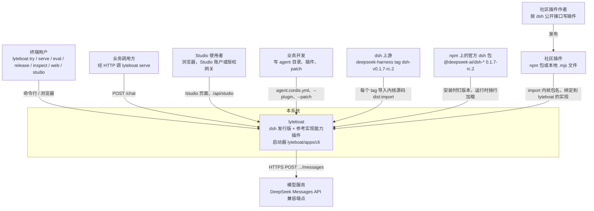

| 外部元素 | 是什么 | 和 lyteboat 的关系 | 依据 |
|---|---|---|---|
| 终端用户 | 跑 `lyteboat try "任务"`、`lyteboat serve`、`lyteboat eval`、`lyteboat release`、`lyteboat inspect`、`lyteboat web` 或 `lyteboat studio` 的人 | 通过命令行参数和浏览器交互；`lyteboat web` 的页面在浏览器里经 dsh 的连接调 `/api/lyteboat/<端点>`；`lyteboat studio account …` 从标准输入读口令建 Studio 账户 | `lyteboat/apps/cli/src/args.ts` `parseLyteboatArgs`，`lyteboat/plugins/web-pages/src/web-pages-endpoints.ts` `WEB_PAGES_METHOD_PREFIX`、`WEB_PAGES_ENDPOINTS`，`lyteboat/bundles/studio/src/startup.ts` `accountCommands` |
| 业务调用方 | 经 HTTP 调 `lyteboat serve` 的服务或前端 | `POST /chat` 发一条消息，拿回一个 JSON 或 enterprise 事件流；`GET /agents`、`GET /health` | `lyteboat/plugins/chat-api/src/index.ts` `ChatApiService` |
| Studio 使用者 | 在浏览器里打开 `lyteboat studio` 的人（admin、editor、viewer），用 Studio 自己的账户登录，或经授权网关进来 | 页面在 `/studio/`，数据经 `/api/studio`；只查看 agent、会话、运行指标和评测运行，写只有账户与角色、admin 的技能热修和 editor 及以上起的评测运行（[1.5](#15-studio-工作台另一个进程同一个-lyteboat_home)） | `lyteboat/plugins/studio-web/src/index.ts`，`lyteboat/plugins/studio-api/src/index.ts`，`lyteboat/plugins/studio-auth/src/index.ts` |
| 业务开发 | 写 `examples/agents/<id>` 目录、`--plugin` 文件、`--patch` 文件的人 | 业务逻辑只放在 agent 目录里，框架包不带业务词汇 | `CLAUDE.md`「Architecture boundaries」的 “Framework packages stay domain-neutral” |
| dsh 上游 | `deepseek-ai/deepseek-harness` 仓库 | lyteboat 每个 tag 导入一次内核源码，三方合并 lyteboat 的改动 | `dsh.upstream.json`，`CLAUDE.md`「Upstream sync (the distribution)」 |
| npm 官方包 | 除内核外的 `@deepseek-ai/dsh-*` | 原样使用，版本全钉在 `0.1.7-rc.2` | `.pnpmfile.cjs`，`pnpm-workspace.yaml` |
| 社区插件 | 按 dsh 接口写的第三方插件 | 不改代码即可跑在 lyteboat 上；要用 lyteboat 扩展时注入 `lyteboatDistro` | `dsh-compat/COMPAT.md` §4 |
| 模型服务 | DeepSeek Messages API 兼容端点 | `dsh-llm-deepseek` 适配器 POST 到 `messagesApiRoot(baseURL)/messages`：baseURL 不以 `/v1` 结尾时补上 `/v1`；baseURL 取行配置、否则取 `DEEPSEEK_BASE_URL`、否则取公开端点 `PUBLIC_BASE_URL`。本文的运行把它设成脚本化模型的 `http://127.0.0.1:<port>/v1`，请求就落在 `/v1/messages` | `dsh@rc.2:packages/llm/llm-deepseek/src/adapter.ts:120`，`messages-api.ts:14-17`，`config.ts:106,109,290` |

**为什么这样划边界**：lyteboat 同时对两边负责——对用户，它是一个能跑业务 agent 的 harness；对 dsh 生态，它承诺“协议、接口、行为与跟踪的 release 一致”（`dsh-compat/COMPAT.md`）。所以 C1 里 dsh 上游和社区插件都是一等的外部系统：前者决定 lyteboat 的内核从哪来，后者决定 lyteboat 的内核不能随便改。

### 1.2 C2 容器

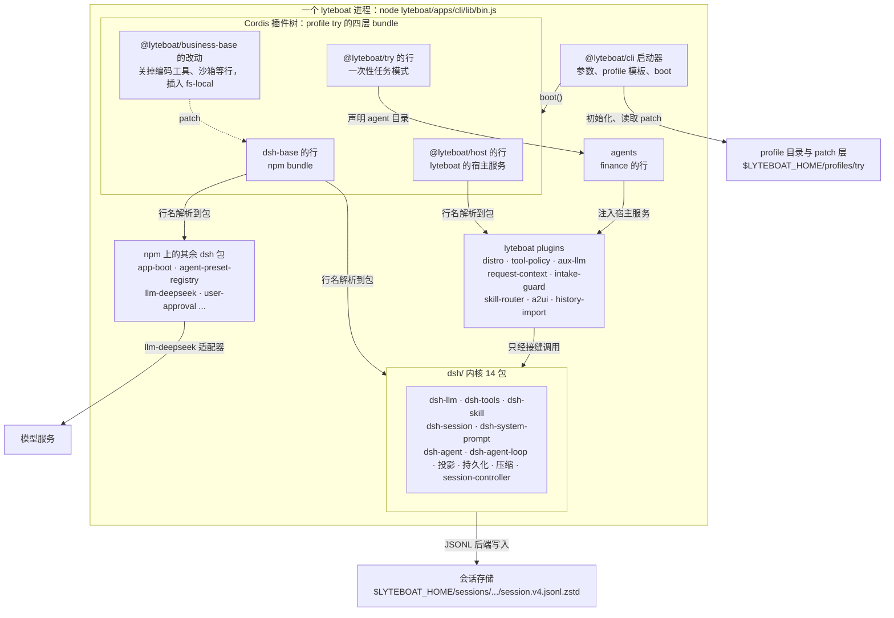

| 容器 | 路径 | 职责 | 运行时产物 |
|---|---|---|---|
| lyteboat 启动器 | `lyteboat/apps/cli`（`bin.ts`、`home.ts`、`cli.ts`、`args.ts`、`plugins.ts`、`profile-boot.ts`、`templates.ts`、`mode-runners.ts`、`fiber-state.ts`、`process-shutdown.ts`、`dump-config.ts`） | 解析启动器自己的参数，按模板初始化 profile，叠 patch 层，调用 dsh 的 `boot()`，处理退出信号 | `lyteboat/apps/cli/lib/bin.js` |
| profile 与 patch 层 | `$LYTEBOAT_HOME/profiles/<name>/`（`package.json` 的 `dsh.profile.bundles`、`cordis.yml`、`cordis.patch.yml`） | 决定这次启动由哪些 bundle 组成，以及用户层覆盖 | 首次运行时由 `initProfile` 写出 |
| bundle：dsh-base | npm `@deepseek-ai/dsh-base` 的 `cordis.patch.yml` | dsh 所有基于 base 的 profile 共享的行：llm、session、tools、skill、agent-loop、持久化、审批、沙箱… | 行 |
| bundle：`@lyteboat/host` | `lyteboat/bundles/host/cordis.patch.yml` | 每个 lyteboat profile 都带的宿主行：8 个 lyteboat 服务（distro、tool-policy、aux-llm、request-context、intake-guard、skill-router、a2ui、history-import，按这个顺序），关闭 session-log 附件，禁掉 `session-telemetry-otel` | 行 |
| bundle：`@lyteboat/business-base` | `lyteboat/bundles/business-base/cordis.patch.yml` | try、serve、eval、studio、inspect 五个 profile 都列的底座，只有一层 patch：关掉 dsh-base 的编码工具和只为它们服务的行、沙箱、审批与权限、spill、工作目录的 AGENTS.md、本机插件包清单、插件管理、会话标题的旁路请求，`fs` 改由 `dsh-fs-local` 提供；skill-filesystem 不读宿主的默认目录；系统提示不加宿主 persona 和 harness 身份段。业务 agent 因此只拿到它自己组合里声明的能力，外加 dsh-base 的 `skill` 工具 | 行的改动 |
| bundle：`@lyteboat/try` | `lyteboat/bundles/try/cordis.patch.yml` + `src/` | 一次性任务模式：解析任务和 `--agent`、`--agents`、`--history`、`--session-id`、`--context`、`--result`，声明 agent，新建或续接会话，经 `intakeGuard.submit` 在循环前准入并交出任务，驱动一个 turn，打印这一轮（卡片各占一行 `[card <area>]`；`--result json` 时是一个 JSON 对象），退出 | 行 + runner 代码 |
| bundle：`@lyteboat/serve` | `lyteboat/bundles/serve/cordis.patch.yml` + `src/` | 服务模式：解析 `--agents` 或 `--release`（发布锁）、`--host`、`--port`、`--auth`、`--secret-env`，经 agent-catalog 声明 `--agents` 里的全部 agent（或只声明发布锁里的 agent，按锁钉住；agent 声明的模型必须是进程的默认模型），挂上 dsh 的 session-controller（连同 workspace、connection、file-upload，不带 Web 界面）和 host-webserver，由 `@lyteboat/chat-api` 在上面提供 `/chat`；一条消息经 session-controller 进会话（会话的 cwd 是 agent 的工作目录），不像 try 那样由 runner 直接驱动 Agent | 行 + startup 代码 |
| bundle：`@lyteboat/eval` | `lyteboat/bundles/eval/cordis.patch.yml` + `src/` | 评测模式：解析 `--agents`、`--agent`、`--cases`、`--case`、`--run-id`、`--model`（`real` 或 `replay`）、`--from`，或 `compare <前> <后>`，或 `release`（发布闸门，通过就写 agent 的发布锁）；经 agent-catalog 只声明 `--agent` 这一个 agent，和 serve 一样挂上 session-controller（不带 Web 界面），由 `@lyteboat/eval-runner` 把每个用例的每一轮经 session-controller 送进一个新会话并逐轮检查，跑完按结果退出 | 行 + startup 代码 |
| bundle：`@lyteboat/web` | `lyteboat/bundles/web/cordis.patch.yml` + `src/` | `lyteboat web`：叠在 dsh-web-app 之上的浏览器界面。自己的 startup 行代替 dsh web 的（那一行不认识的参数一律报错），解析 `--agents`、`--agent` 和 dsh web 的 `--host`、`--port`、`--no-open`、`--trusted-host`，替它发布 `webStartup`；经 agent-catalog 声明 `--agents` 里的全部 agent（挂不上的只报告，根目录一变就重新声明），preset 注册表的默认 agent 取 `--agent`，否则取根目录里排第一的 id；关掉 dsh 的四个编码 preset，把 dsh web 挪进 preset 的 agent 层行按 dsh-base 的样子放回宿主；挂上 `@lyteboat/web-pages` 的 Host 面。不带业务底座：dsh web 自己的能力（编码工具、沙箱、审批）都在，会话不按 `/chat` 的方式跑 | 行 + startup 代码 |
| bundle：`@lyteboat/studio` | `lyteboat/bundles/studio/cordis.patch.yml` + `src/` | `lyteboat studio`：Studio 工作台。带业务底座，agent 的工具和技能按 serve 的样子挂上；解析 `--agents`、`--host`、`--port`、`--trusted-host`、`--gateway-secret-env`、`--admin`、`--anonymous-viewer`、`--trace-link`，或做一次 `account` 命令就退出；经 agent-catalog 声明 `--agents` 里的全部 agent（挂不上的在雷达上报告，根目录一变就重新声明），挂上 agent-inspector、session-index、运行指标读取器、评测记录、host-webserver 和 studio-auth、studio-api、studio-web。不挂 session-controller，不建也不续会话；关掉投影缓存，读会话不写回。见 [1.5](#15-studio-工作台另一个进程同一个-lyteboat_home) | 行 + startup 代码 |
| bundle：`@lyteboat/inspect` | `lyteboat/bundles/inspect/cordis.patch.yml` + `src/` | `lyteboat inspect`：带业务底座，按 try、serve、eval 的样子挂上 `--agent` 这一个 agent（agent-catalog 不严格，挂不上就报告原因、退出 1），用 agent-inspector 从它的常驻作用域读出工具、技能和每个技能的检查，用评测记录读它的用例文件，打成文字或一个 JSON 对象（`--result json`）后退出；不建 agent 实例，不调模型 | 行 + startup 代码 |
| 内核 | `dsh/`（14 包） | 服务 `llm`、`tools`、`skills`、`sessions`、`systemPrompt`、`sessionProjections`、`sessionPersistence`、`compaction`、`agents`、`agentLoop`，serve、eval、web 组合另挂 `sessionController`；driver 本身 | `dsh/*/*/lib/` |
| 其余 dsh 包 | `node_modules/@deepseek-ai/*` | 启动（app-boot）、preset 注册、模型适配、审批、沙箱、检查点、标题… | npm 发布物 |
| lyteboat plugins | `lyteboat/plugins/*` | 在 dsh 接缝上实现参考实现的能力 | `lib/`；`@lyteboat/web-pages` 另有浏览器面 `lib/client.js`，由 dsh web 的页面加载；`@lyteboat/studio-web` 另有 Vite 构建的页面 `lib/web/`，由它自己在 `/studio` 提供 |
| agents | `examples/agents/<id>/`（只有 `finance` 一个） | 业务 agent 的组合（`agent.cordis.yml`）与业务代码（`src/` → `lib/`） | 行 + skills + 模板 |
| 会话存储 | `$LYTEBOAT_HOME/sessions/<编码后的 cwd>/<session-id>/session.v4.jsonl.zstd` | 追加式事件日志，每次落盘一个 zstd 帧 | 文件 |
| 运行指标、评测运行、Studio 的文件 | `$LYTEBOAT_HOME/run-metrics/`、`$LYTEBOAT_HOME/evals/<运行 id>/`、`$LYTEBOAT_HOME/studio/` | serve 每轮写一行指标，`lyteboat eval` 写运行，Studio 写账户、角色、令牌密钥、审计日志和评测任务；Studio 读前两样和会话（[1.5](#15-studio-工作台另一个进程同一个-lyteboat_home)） | 文件 |
| 模型服务 | 外部 | 回答循环请求、旁路请求（路由、准入分类）；`lyteboat web` 里还有标题请求 | HTTP |

`lyteboat/core/contracts`（声明）和 `lyteboat/tooling/testing`（测试设施）不是运行时容器：前者只有类型、常量、声明合并和它所声明类型的 zod schema，后者只被测试依赖。

**为什么是这几个容器**：`lyteboat/` 下一个目录就是一层（`CLAUDE.md`「Repository layout」）。apps 只拥有进程，bundles 只做组合、不写行为，plugins 挂在接缝上，agents 放业务。新的运行模式（比如 SDK 入口）应该是一个新的 `lyteboat/bundles/<name>`，而不是在 `@lyteboat/try` 里加分支，服务模式 `@lyteboat/serve`、评测模式 `@lyteboat/eval`、浏览器界面 `@lyteboat/web`、Studio 工作台 `@lyteboat/studio`、inspect 模式 `@lyteboat/inspect` 都是这样加的。这让“换一种跑法”只是换 profile 的 bundle 列表（`lyteboat/apps/cli/src/templates.ts` 的 `LYTEBOAT_PROFILE_TEMPLATES` 里 `try`、`serve`、`eval`、`studio`、`inspect` 都是 dsh-base、`@lyteboat/host`、`@lyteboat/business-base`，只差最后一个 bundle；`web` 是 dsh-web-app 再加 `@lyteboat/web`，不带业务底座）。

### 1.3 C3 组件：服务、事件、投影

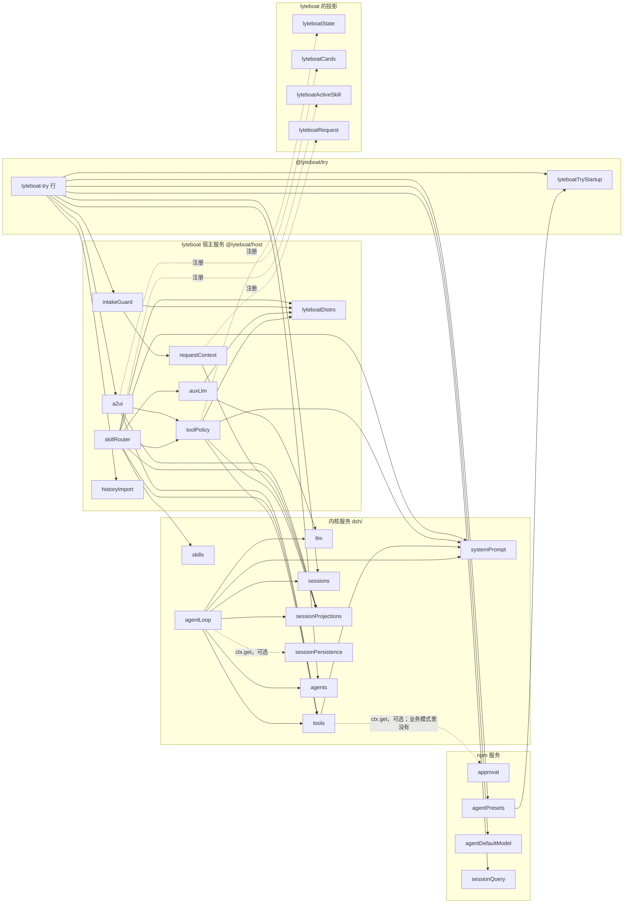

实线箭头 A → B 表示 A 注入 B（`static inject` 或行级 `inject`）；B 缺一个，A 就不激活，停在 PENDING。虚线表示可选访问（`ctx.get`）或注册关系。

| 组件 | 服务键 | 发布者（文件） | 它做什么 |
|---|---|---|---|
| 模型访问 | `llm` | `dsh/llm/llm/src/index.ts` `LlmRuntime` | 适配器注册表 + `llm/stream` waterfall；所有模型调用（循环、旁路调用、标题）都从这里走；把请求交给适配器之前按路由声明的 `toolUpdate` 投影工具更新（`index.ts` `LlmRuntime.adapterStream`） |
| 工具注册表与运行时 | `tools` | `dsh/core/tools/src/index.ts` `ToolRuntime` | 注册、可见性限制（`restrict`）、`tools/pre-execute`/`execute`/`post-execute`/`result` |
| skill 目录 | `skills` | `dsh/skill/skill/src/index.ts` `SkillRegistry` | skill provider 聚合，`snapshot` / `get` |
| 会话 | `sessions` | `dsh/core/session/src/index.ts` `SessionStore` | `Session` 的创建、`append`（带 lyteboat 的 `ignorable` 选项）、`flush`、`deriveMessages`、`toolHistory` |
| 系统提示 | `systemPrompt` | `dsh/core/system-prompt/src/index.ts` `SystemPrompt` | section、context、变量的注册与 `assemble` |
| 投影注册表 | `sessionProjections` | `dsh/session/session-projection/src/index.ts` `SessionProjectionRegistry` | 每次 append 后跑所有投影的 `apply` |
| 持久化 | `sessionPersistence` | 抽象基类 `dsh/session/session-persistence/src/index.ts` `SessionPersistence`，JSONL 实现 `dsh/session/session-persistence-jsonl` | 创建 / 追加 / 读取会话日志 |
| agent 注册表 | `agents` | `dsh/core/agent/src/index.ts` `AgentRegistry` | `create` / `resume`，工厂由 agent-loop 注入（`setFactory`） |
| driver 工厂 | `agentLoop` | `dsh/core/agent-loop/src/index.ts` `AgentLoop` | 创建并托管 `ReactLoopAgent`（作为 `agents` 的工厂）；turn / step 循环本身在 `ReactLoopAgent.turn` / `step`（`dsh/core/agent-loop/src/agent.ts`） |
| 审批 | `approval` | npm `dsh-user-approval` | dsh 的确认通道，`tools/pre-execute` 返回 `ask` 时用它。业务底座关掉了这一行，try、serve、eval 里没有它，lyteboat 也不用它；只有 `lyteboat web` 里有 |
| preset 注册表 | `agentPresets` | npm `dsh-agent-preset-registry`（`dsh@rc.2:packages/preset/agent-preset-registry/src/index.ts:51-71`） | 把 agent 目录的行挂到 standing scope，再绑定到每个 agent 实例 |
| 默认模型 | `agentDefaultModel` | npm `dsh-agent-default-model` | 给 runner 提供 provider/model 选择 |
| 会话查询 | `sessionQuery` | npm `dsh-session-query-sqlite` | runner 续接会话时读存下的 header 和事件 |
| 发行版标记 | `lyteboatDistro` | `lyteboat/plugins/distro/src/index.ts` `LyteboatDistroService` | 列出本构建携带的内核扩展（`agent-loop-intake`、`agent-loop-pre-assemble`、`session-append-ignorable`、`session-controller-prompt-source`）和内核导入自哪个 dsh release |
| 工具策略 | `toolPolicy` | `lyteboat/plugins/tool-policy/src/index.ts` `ToolPolicyService` | `always` / `auto` 可见性、一个 scope 里没有声明点名的继承工具是否可见（`declareInherited`，agent 行的 `inherited`）、state delta，`lyteboat:state` context |
| 旁路模型调用 | `auxLlm` | `lyteboat/plugins/aux-llm/src/index.ts` `AuxLlmService` | `generate({agent, purpose, system, prompt, maxTokens, timeoutMs, …})`：在自己的时限里经 `ctx.llm.stream` 发一次调用，结果（回答或失败原因）作为一条 `ignorable` 的 `lyteboat/aux-llm-call` 记进 agent 的会话 |
| 请求上下文 | `requestContext` | `lyteboat/plugins/request-context/src/index.ts` `RequestContextService` | `message(text, request)` 把请求 id、发起者、agent 的身份、上下文、准入结论放进人类消息的 `source.lyteboatRequest`；`requestOf` / `contextOf` 读回；`lyteboatRequest` 投影（`request-projection.ts` `lyteboatRequestProjectionDefinition`） |
| 准入 | `intakeGuard` | `lyteboat/plugins/intake-guard/src/index.ts` `IntakeGuardService` | agent 按 scope 注册准入函数（`register`）；调用方把每个请求交给 `submit(agent, {text, context?, requestId?, owner?, agent?}, signal)`，它先准入、再把记着请求和结论的人类消息 `followup` 进去；`lyteboat/intake` 监听把已记录的 `reply` 结论变成回复，没准入过的消息在这里补一次 |
| skill 路由 | `skillRouter` | `lyteboat/plugins/skill-router/src/index.ts` `SkillRouterService` | `off` / `full` / `dynamic` 三种加载模式，参考实现的 LLM 路由（经 `auxLlm`，输出预算 `maxTokens` 默认 200），把 skill 正文作为 dsh 的 skill-invocation 消息放进这一步，`lyteboatActiveSkill` 投影 |
| 卡片 | `a2ui` | `lyteboat/plugins/a2ui/src/index.ts` `A2uiService` | 参考实现的 A2UI 模板引擎；agent 自己的工具用 `renderCard(templates, area, raw, {agent})` 渲染卡、`cardsPresentationMeta(cards)` 放进结果的 meta（`cards-projection.ts`）、`cardMarker(area)` 写 digest 里的标记（`turn-parts.ts`）；`render_a2ui` 工具（校验用的默认组件目录是领域中立的 `DEFAULT_A2UI_COMPONENT_CATALOG`，`contract.ts`；参考客户端的完整目录只是测试夹具 `lyteboat/plugins/a2ui/tests/fixtures/reference-component-catalog.ts`）；卡片清单的 `emission_mode` 不是三种模式之一、或 `compute.js` 只有默认导出，加载时就报错（`loader.ts` `emissionModeOf`、`loadCompute`）；`lyteboatCards` 投影；`turnParts`（按 `[[card:<area>]]` 标记和发射模式给一轮排版）和 `liveTurn()`（同样的排版，边跑边给） |
| 历史导入 | `historyImport` | `lyteboat/plugins/history-import/src/index.ts` `HistoryImportService` | 把外部对话历史变成会话 seed |

**事件与投影**（完整列表见 [7.2](#72-事件一览表)）：

| 类别 | 名字 | 谁产生 | lyteboat 谁在用 |
|---|---|---|---|
| lyteboat 的内核扩展事件 | `lyteboat/intake`、`lyteboat/pre-assemble`（waterfall） | `ReactLoopAgent.preStep`（`dsh/core/agent-loop/src/agent.ts`） | intake-guard；tool-policy、skill-router（agent 行和 `--plugin` 行也能挂，比如 try bundle 的测试夹具 `tools.mjs`、CLI 测试夹具 `intake-gate.mjs`） |
| lyteboat 的内核扩展 API | `Session.append(type, data, { ignorable: true })`（`session-append-ignorable`） | 内核 dsh-session（`dsh/core/session/src/lyteboat/append-ignorable.ts`） | aux-llm |
| dsh 事件 | `agent/pre-step` | driver | skill-router（追加 skill 正文） |
| lyteboat 自己的日志记录 | `lyteboat/aux-llm-call`（`ignorable: true`） | aux-llm，每次旁路调用一条（路由、准入分类） | 人（审计）；eval 回放按录音里的它回答旁路调用；没有投影读它 |
| lyteboat 借用的 dsh 信封 | `tool/result.meta.lyteboat.{cards,stateDelta}`；skill-invocation 的 `user/message`（`source: {kind: 'skill-invocation', name, form: 'instructions'}`）；人类消息的 `source.lyteboatRequest`；回复的 `assistant/message.source.provider = 'lyteboat'` | 工具的 `presentationMeta`；skill-router；`intakeGuard.submit` 经 `requestContext.message`；driver 的 `appendLyteboatIntakeReply` | `lyteboatCards`、`lyteboatState`；`lyteboatActiveSkill`；`lyteboatRequest`、`lyteboatCards`、intake-guard；人、UI |
| lyteboat 的投影 | `lyteboatState`、`lyteboatCards`、`lyteboatActiveSkill`、`lyteboatRequest`（`stateVersion` 前三个是 1，`lyteboatRequest` 的 owner 换成类型化的 `{kind, id}` 之后是 3） | tool-policy、a2ui、skill-router、request-context 注册 | `lyteboat:state` context、`a2ui.turnParts`、`lyteboat web` 的 lyteboat 页签（dsh 的 `useProjection`，`lyteboat/plugins/web-pages/src/client/SessionTab.tsx` `SessionTab`）、工具读请求上下文 |

读 lyteboat 信封的三个投影（`lyteboatState`、`lyteboatCards`、`lyteboatRequest`）都按 contracts 的 zod schema 校验（`lyteboatResultMetaSchema`、`lyteboatRequestSchema`），信封不合 schema 就抛错并指出是哪个 seq：信封是 lyteboat 自己写的，读到坏的就是 bug（`lyteboat/plugins/tool-policy/src/state.ts` `lyteboatStateProjectionDefinition.apply`，`lyteboat/plugins/a2ui/src/cards-projection.ts` `preparedCardsOf`，`lyteboat/plugins/request-context/src/request-projection.ts` `lyteboatRequestProjectionDefinition.apply`）。

**为什么宿主服务 + agent 行两段式**：`toolPolicy`、`skillRouter` 这些服务在根 realm 里只有一份，监听所有 agent 的事件；每个 agent 自己的策略（路由模式、哪些工具归它）由 agent 行在自己的 scope 里声明，服务按 agent 的 scope 链去读（`ScopedLayers`）。所以 finance 的行 `lyteboat-skill-router`（`@lyteboat/skill-router/agent`）只写配置 `{mode: dynamic, historyWindow: 6, timeoutMs: 10000}`（`examples/agents/finance/agent.cordis.yml`），不发布服务；finance 的准入函数也是 agent 行在自己的 scope 里 `ctx.intakeGuard.register(...)` 进去的（`examples/agents/finance/src/agent.ts` `apply`）。agent 行禁止往根 realm 发布服务（`CLAUDE.md`「Architecture boundaries」的 “Composition is data”），dsh 的 preset 挂载会直接拒绝（`dsh@rc.2:packages/preset/agent-preset-registry/src/mount.ts:265-267`）。

上图和上面两张表是 try 组合。serve 另有 `chatApi` 和运行指标记录器，Studio 的服务和它们读写什么见 [1.5](#15-studio-工作台另一个进程同一个-lyteboat_home)。

### 1.4 C4 代码：关键类型与文件

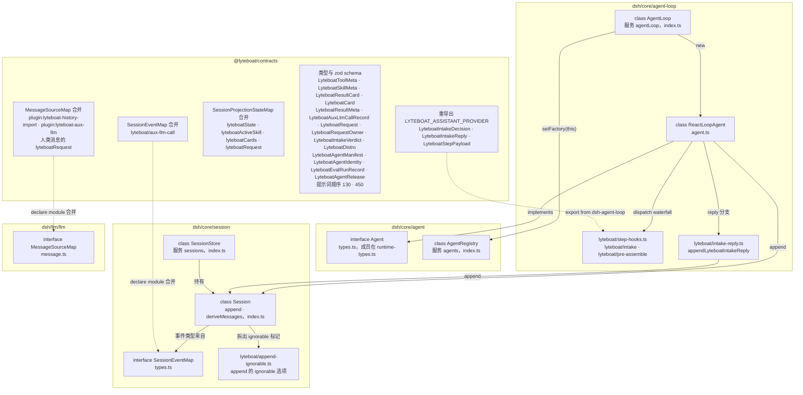

| 类型 / 文件 | 作用 | 要点 |
|---|---|---|
| `Agent`（`dsh/core/agent/src/types.ts`，成员由 `runtime-types.ts` 的 `declare module` 补上） | agent 实例接口 | `session`、`ctx`、`options`、`followup` / `steer` / `inject`、`whenIdle()` |
| `ReactLoopAgent`（`dsh/core/agent-loop/src/agent.ts`） | 唯一的 driver 实现 | 构造时 `createScope(loopCtx, this)` 造出 agent scope；`preStep`、`turn`、`step`；工具集变化时 `buildRequest` 追加 `tool-registry` 的 `developer/message` |
| lyteboat 在 `agent.ts` 里的 hunk | 扩展 `agent-loop-intake`、`agent-loop-pre-assemble` 的挂点 | 两行 import、`PreparedStep` 的 `reply` 分支类型、`preStep` 里两个 waterfall 的派发、`turn` 里的 reply 分支（写日志只调一次 `appendLyteboatIntakeReply`）、`step` 里第一次请求总是新请求序列 |
| `appendLyteboatIntakeReply`（`dsh/core/agent-loop/src/lyteboat/intake-reply.ts`） | reply 一步写进日志的内容 | 没有系统头就先放一个空的 `system/message`，再放领取的消息和 provider 为 `lyteboat` 的回答；step 的开和关留在 `agent.ts` |
| `LyteboatStepPayload` / `LyteboatIntakeDecision`（`dsh/core/agent-loop/src/lyteboat/step-hooks.ts` `LyteboatIntakeReply`、`LyteboatIntakeDecision`、`LyteboatStepPayload`） | 两个扩展事件的声明 | `lyteboat/intake` 返回 `{kind:'pass'}` 或 `{kind:'reply', plugin, content}`；`LYTEBOAT_ASSISTANT_PROVIDER = 'lyteboat'` |
| `Session`（`dsh/core/session/src/index.ts`） | 一个会话的事件日志 | `append` 是唯一写入口；`deriveMessages` 从带 `surfaceOp` 的事件推导出模型看到的消息；`toolHistory` 从 `request/header` 和 `developer/message` 折叠出工具声明的历史（`tool-history.ts`） |
| `lyteboatAppendOptions`（`dsh/core/session/src/lyteboat/append-ignorable.ts`） | 扩展 `session-append-ignorable` 的写路径 | `append` 的第三个参数对非 surface 类型可以是 `{ ignorable: true }`，信封上就写 `ignorable: true`；本构建认识的类型（含 surface 类型）要这个标记会被拒。上游文件里只多了 import / export、放宽的签名和两行钩子（`index.ts` `Session.append`） |
| `SessionEventMap`（`dsh/core/session/src/types.ts`） | 日志事件的类型表 | 可被 `declare module` 合并；持久化只认编译进来的类型（`known-event-types.ts`），不认识的类型只有带 `ignorable: true`（`types.ts`）才放行 |
| `@lyteboat/contracts`（`lyteboat/core/contracts/src/index.ts`） | lyteboat 唯一的共享声明处 | 事件（重导出）、`JsonValue` 及其 schema、`LyteboatDistro`、消息来源常量、提示词顺序 `LYTEBOAT_STATE_CONTEXT_ORDER` 130 和 `LYTEBOAT_SKILLS_SECTION_ORDER` 450、工具可见性与 `LyteboatToolMeta`、skill 元数据、卡片、state delta 与结果 meta、旁路调用记录、准入结论与请求的发起者、agent 的模型、清单 `LyteboatAgentManifest` 与身份 `LyteboatAgentIdentity`、评测运行记录 `LyteboatEvalRunRecord`（`run.json`）与运行 id 的形状 `LYTEBOAT_EVAL_RUN_ID_PATTERN`、用例 id 的形状 `LYTEBOAT_EVAL_CASE_ID_PATTERN`、发布锁 `LyteboatAgentRelease`（文件名 `LYTEBOAT_AGENT_RELEASE_FILE`，即 `agent.release.json`）、请求与它的折叠状态、调用方读到的一轮结局 `LyteboatTurnOutcome` 和从 `turn/end` 的原因推出它的 `LYTEBOAT_TURN_OUTCOME_OF_REASON`、运行指标的两种行 `LyteboatRunMetric`、`LyteboatRunHeartbeat`、当前 skill 的折叠状态、`MessageSourceMap` 合并、日志记录 `lyteboat/aux-llm-call`、投影键。每个 JSON 信封和文件都有同名的 zod schema（`lyteboatJsonValueSchema`、`lyteboatStateDeltaSchema`、`lyteboatResultCardSchema`、`lyteboatCardSchema`、`lyteboatResultMetaSchema`、`lyteboatRequestSchema`、`lyteboatAgentManifestSchema`、`lyteboatEvalRunRecordSchema`、`lyteboatAgentReleaseSchema`、`lyteboatRunMetricSchema`…）；清单和发布锁的 schema 是严格的，未知键报错。子路径 `@lyteboat/contracts/studio`（`src/studio.ts`）是 Studio API 的请求与回答类型，以及 studio-api 校验请求体用的 schema；`@lyteboat/contracts/cli`（`src/cli.ts`）是 `lyteboat inspect` 和 `lyteboat try --result json` 输出的类型与 schema，以及启动器和组合测试共用的模式 runner id 表 `LYTEBOAT_MODE_RUNNER_IDS` |
| `FIBER_STATE`（`lyteboat/apps/cli/src/fiber-state.ts`） | `FiberState` 的运行时值 | 发布版 cordis 用 `const enum`，esbuild/vitest 不内联，所以启动器自己写一份，`lyteboat/apps/cli/tests/fiber-state.spec.ts` 对照安装的 `fiber.d.ts` 核对 |

`lyteboat/intake` 的声明本身就是一个很好的“扩展一个 dsh 接缝”的例子（`dsh/core/agent-loop/src/lyteboat/step-hooks.ts` `declare module '@deepseek-ai/cordis'`，JSDoc 略去）：

```ts
declare module '@deepseek-ai/cordis' {
  interface Events {
    'lyteboat/intake'(this: Scoped<Agent>, payload: LyteboatStepPayload, next: () => Promise<LyteboatIntakeDecision>): Promise<LyteboatIntakeDecision>
    'lyteboat/pre-assemble'(this: Scoped<Agent>, payload: LyteboatStepPayload, next: () => Promise<void>): Promise<void>
  }
}
```

**为什么事件声明在内核、类型从 contracts 读**：内核不能 import 任何 `@lyteboat/*`（`CLAUDE.md`「Architecture boundaries」，由 `scripts/check-layers.ts` 检查），所以声明必须在内核里；lyteboat 的插件之间也不能互相 import 值，只能依赖 `@lyteboat/contracts`，于是 contracts 把内核里的类型重导出一遍（`lyteboat/core/contracts/src/index.ts`）。`ignorable` 选项同理：写路径在内核（`LyteboatAppendOptions` 从 `@deepseek-ai/dsh-session` 导出），用它的只有 aux-llm 一处（`lyteboat/plugins/aux-llm/src/index.ts` `AuxLlmService.generate`）。

**agent 的身份与发布锁落在哪**。它们没有新的服务和事件，是几个已有部件上的字段和检查：

| 部件 | 做什么 | 代码 |
|---|---|---|
| `@lyteboat/contracts` | 清单 `LyteboatAgentManifest`（`agent.yml`：`name`、`description`、`order`、`version`、`model`，未知键报错）、身份 `LyteboatAgentIdentity`（`id`、`version?`、`digest`）、`run.json` 的 `LyteboatEvalRunRecord`、发布锁 `LyteboatAgentRelease`（`agent.release.json`）；请求信封 `LyteboatRequest` 多一个可选的 `agent` | `lyteboat/core/contracts/src/index.ts` |
| `@lyteboat/agent-catalog` | 读清单、算目录摘要（`agent-digest.ts`）；`declare()` 按“清单与摘要 → 发布锁的钉 → 声明的模型 → `register`”的顺序检查，被拒的 agent 的代码不运行；条目带 `identity` 和逐文件哈希 `files`。配置 `pinnedAgents`（serve 的 `--release` 给）和 `enforceDeclaredModel`（serve、eval 打开，try、`lyteboat web` 不开） | `lyteboat/plugins/agent-catalog/src/index.ts` `Config`、`AgentCatalogService.declare` |
| 调用方 | try（经 `intakeGuard.submit` 的 `agent`）、`/chat`、eval 把条目的 `identity` 写进每条人类消息的 `source.lyteboatRequest.agent`；`lyteboat web` 不写 | `lyteboat/bundles/try/src/index.ts` `run`，`lyteboat/plugins/chat-api/src/index.ts` `ChatApiService.answer`，`lyteboat/plugins/eval-runner/src/index.ts` `EvalRunnerService.runCase` |
| `@lyteboat/eval-runner` | `run()` 把身份和录下的循环请求头里的模型写进 `run.json`；`release()` 走发布闸门（manifest → baseline → stamps → model → replay → version），通过就写锁 | `lyteboat/plugins/eval-runner/src/index.ts` `EvalRunnerService.run`、`EvalRunnerService.release`，`eval-release.ts` `releaseAgent` |
| `@lyteboat/serve` 的 startup 行 | `--release` 读锁；注入 `lyteboatDistro`，在任何读启动参数的行启动之前核对锁的 `dshBase`；把锁里的 agent 交给 agent-catalog 的 `include` 和 `pinnedAgents` | `lyteboat/bundles/serve/src/startup.ts` `inject`、`readReleaseLock`、`apply` |
| `@lyteboat/cli` | `lyteboat release` 就是 eval profile 加 `release` 子命令 | `lyteboat/apps/cli/src/args.ts` 的 `parseLyteboatArgs`（`release` 子命令） |

锁不覆盖框架代码（`lyteboat/` 下的插件和 bundle）：它管的是 agent 目录的内容、版本、模型、内核的 dsh 版本和基线证据，所以一个锁要用跑 `lyteboat release` 的同一个 lyteboat 构建去 serve。运维规则和锁不管的东西见 [02-distribution.md](02-distribution.md) §9.3，作者的步骤见 [03-agent-development.md](03-agent-development.md) §4.16。

### 1.5 Studio 工作台：另一个进程，同一个 `$LYTEBOAT_HOME`

`lyteboat studio` 是和 serve 并列的另一个进程。profile `studio` 是 dsh-base、`@lyteboat/host`、`@lyteboat/business-base`、`@lyteboat/studio`（`lyteboat/apps/cli/src/templates.ts` 的 `LYTEBOAT_PROFILE_TEMPLATES`）：带业务底座，所以 agent 的工具和技能按 serve 的样子挂上，雷达和工作台看到的就是 `/chat` 后面那一套。和 try 组合比，`@lyteboat/try` 插入的行换成 `@lyteboat/studio` 插入的行，另外禁掉 `session-projection-cache`（`lyteboat/bundles/studio/cordis.patch.yml`）。它不挂 session-controller 和 client connection，所以既没有 `/chat`，也没有 dsh 的会话通道 `/api/remote.mux`，不建、不续、不改会话。Studio 和 serve 共用的只是 `$LYTEBOAT_HOME` 下的文件：

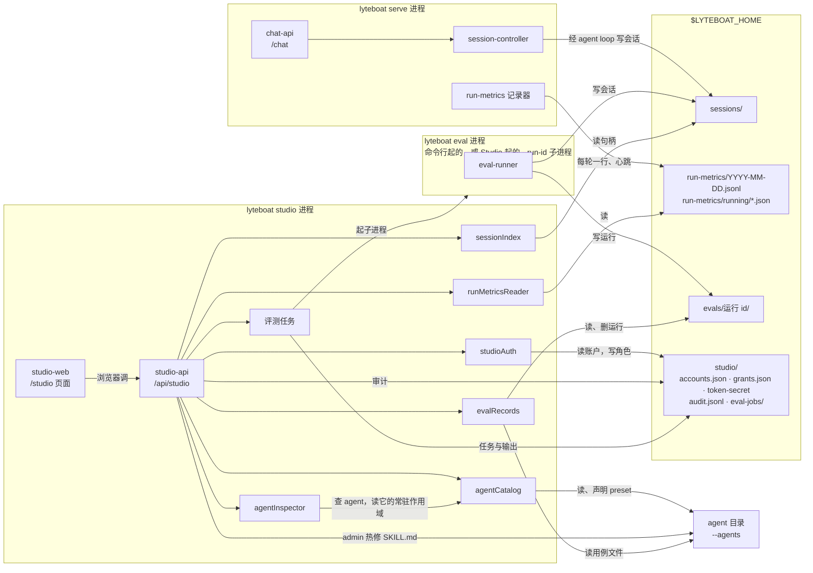

| 服务 | 发布者（行 → 包） | 读什么 | 写什么 |
|---|---|---|---|
| `lyteboatStudioStartup` | `lyteboat-studio-startup` → `@lyteboat/studio/startup` | 命令行；账户模式下看 `studio/accounts.json` 有没有账户，没有就按用法错误退出并给出 `lyteboat studio account add` 的写法；启动器的 `package.json`（版本和 bin，`launcherOf`） | 不发布时做一次 `account add \| set-password \| remove \| list`，写 `studio/accounts.json`、`grants.json` 后退出（`lyteboat/bundles/studio/src/startup.ts` `studioValuesOf`、`launcherOf`、`accountCommands`） |
| `agentCatalog` | `agent-catalog` → `@lyteboat/agent-catalog`（`strict: false`、`watch: true`） | `--agents` 下的 agent 目录 | 不写盘；声明 preset，不建工作目录 |
| `agentInspector` | `agent-inspector` → `@lyteboat/agent-inspector` | 每次调用租用 agent 的常驻作用域（`agentPresets.acquireScope`），读工具、技能、路由方式 | 不写，不建 agent 实例（`lyteboat/plugins/agent-inspector/src/index.ts`） |
| `sessionIndex` | `session-index` → `@lyteboat/session-index` | `sessionPersistence` 的读句柄：agent 工作目录下的会话，评测的（发起者 kind `system`）和请求指明别的 agent 的不算 | 不写；从不拿会话的写所有权（`lyteboat/plugins/session-index/src/index.ts`） |
| `runMetricsReader` | `run-metrics-reader` → `@lyteboat/run-metrics/reader` | `run-metrics/<UTC 日期>.jsonl`，以及 30 秒内写过的心跳 `running/<主机>-<pid>.json` | 不写（`lyteboat/plugins/run-metrics/src/reader.ts`） |
| `evalRecords` | `eval-records` → `@lyteboat/eval-runner/records` | `evals/<运行 id>/`（`run.json` 按 contracts 的 schema 读）、agent 目录里的用例文件 | 删除一次运行（`lyteboat/plugins/eval-runner/src/records.ts`） |
| `webServer` | `webserver` → dsh-host-webserver | — | 监听 `--host`、`--port`（默认 `127.0.0.1:8090`） |
| `studioAuth` | `studio-auth` → `@lyteboat/studio-auth` | `studio/accounts.json`、`grants.json`、`token-secret`；网关模式下的共享密钥（凭据引用） | 角色授予（`grants.json`）；第一次用到时生成 `token-secret`；网关模式下第一次出现的身份记为 viewer（`lyteboat/plugins/studio-auth/src/index.ts`） |
| 不发布服务 | `studio-api` → `@lyteboat/studio-api` | 上面这些服务和 `lyteboatDistro` | `studio/audit.jsonl`；admin 热修的 SKILL.md；`studio/eval-jobs/<运行 id>.json` 与 `.log`，并起 `lyteboat eval --run-id` 子进程（`lyteboat/plugins/studio-api/src/index.ts`） |
| 不发布服务 | `studio-web` → `@lyteboat/studio-web` | 自己的 `lib/web/` | 不写 |
| 不发布服务 | `lyteboat-studio` → `@lyteboat/studio` | `agentCatalog`、`webServer`、`studioAuth` | stdout 上的地址、登录方式和 agent 列表（`lyteboat/bundles/studio/src/index.ts` `apply`） |

**和 serve 共用 home，不共用进程。**
- 两个进程要用同一个 `LYTEBOAT_HOME`：Studio 的会话页、看板和评测界面读的都是这个 home 下 serve 和 `lyteboat eval` 留下的文件。运行指标只有 serve 写（`lyteboat/bundles/serve/cordis.patch.yml` 的 `run-metrics` 行），try 和 eval 不写，所以只跑 try 或 eval 时看板的性能视图是空的。
- serve 持有它正在跑的会话的写所有权；session-index 只拿读句柄，所以 Studio 可以和写这些会话的 serve 同时跑。投影缓存会在冷读时把投影写回会话的存储，studio 组合把它关掉（`lyteboat/bundles/studio/cordis.patch.yml` 的 `session-projection-cache` 行），读会话因此什么也不写。
- 运行中的消息靠心跳：serve 的记录器每 10 秒、每轮开始和结束时重写本进程的心跳文件，停下时删掉；读取器只认 30 秒内写过的，挂掉的进程不会一直算在运行中。
- Studio 起的评测运行是启动器 bin 的 `lyteboat eval --run-id` 子进程，在自己的进程组里（Studio 重启不会带走它），环境沿用 Studio 的，网关模式下去掉共享密钥所在的变量；同一 agent 同时一个、全局两个；停止发 SIGINT 给进程组；Studio 启动时还标着 running 的任务记为 interrupted，它的进程写完的运行照样列出（`lyteboat/plugins/studio-api/src/studio-eval-jobs.ts`）。
- `studio/` 目录建成 0700，下面的文件 0600（`lyteboat/plugins/studio-auth/src/studio-files.ts` `writeStudioJson`）。

**Studio 的写只有这几样**：账户与角色（运维的 `account` 命令、启动时的 `--admin`、网关模式下自动授予的 viewer，以及 admin 在 Users 页的授予和撤销；经 Studio 改不了自己的角色，最后一个 admin 降不了级）；admin 热修一个已有技能的 SKILL.md（`If-Match` 为读到的 sha256，按技能加载器的规则先校验，保存后重载 agent，加载器不认就还原；有发布锁的 agent 随后在雷达上偏离发布，`lyteboat/plugins/studio-api/src/studio-skill-hotfix.ts`）；editor 及以上起、停、删评测运行。经 `/api/studio` 做的改动都追加到 `studio/audit.jsonl`：失败的登录、授予与撤销、Reload、热修、评测的起停删（`lyteboat/plugins/studio-api/src/studio-audit.ts`）；`account` 命令、`--admin` 和网关的自动授予不经 API，不进审计日志。admin 的 Reload 只重新声明 agent，不写 agent 目录。

---

## 2. 生命周期与依赖注入

### 2.1 Cordis 的六个概念

| 概念 | 是什么 | 在 lyteboat 里的例子 |
|---|---|---|
| **Context** | 服务的容器。根 Context 在 `boot()` 里创建（`dsh@rc.2:packages/boot/app-boot/src/index.ts:979`），每个插件拿到一个继承父级的子 Context | `ctx.extend({ baseUrl })` 把 agent 目录作为 base URL 交给 preset 注册表（`lyteboat/plugins/agent-catalog/src/index.ts` `AgentCatalogService.declare`） |
| **plugin** | 一个导出 `name`、`inject`、`Config`、`apply(ctx, config)` 的模块 | `@lyteboat/try/startup`（`lyteboat/bundles/try/src/startup.ts`）、`finance-agent`（`examples/agents/finance/src/agent.ts`） |
| **Service** | `Service` 子类；构造函数里 `super(ctx, key)` 就把自己发布成 `ctx[key]`（`dsh@rc.2:vendor/cordis/src/service.ts:42-58`） | 所有内核服务和 lyteboat 宿主服务，比如 `ToolPolicyService`（`lyteboat/plugins/tool-policy/src/index.ts`） |
| **inject** | 声明依赖的服务名；**全部到齐才加载**（`dsh@rc.2:vendor/cordis/src/registry.ts:105-106`）。行级 `inject` 会合并进同一个集合（`dsh@rc.2:vendor/loader/src/index.ts:129-135`） | `AgentLoop.inject = ['agents','sessions','llm','tools','systemPrompt','sessionProjections']`（`dsh/core/agent-loop/src/index.ts`）；`@lyteboat/try` 的行级 `inject: [lyteboatTryStartup]`（`lyteboat/bundles/try/cordis.patch.yml`） |
| **fiber** | 插件实例的生命周期对象，状态见下图 | 启动审计打印的 `pending (waiting for service: X)` 就是 PENDING 状态 |
| **effect / disposer** | `ctx.effect(execute, label)`（`dsh@rc.2:vendor/cordis/src/fiber.ts:415`）登记副作用，卸载时逆序执行 disposer；`ctx.on` 和各注册表的 `register()` 都返回 disposer | `agent-catalog` 把每个 agent 的声明放进 effect（`lyteboat/plugins/agent-catalog/src/index.ts` `AgentCatalogService.declare`），声明随 `agent-catalog` 这个 fiber 一起消失，`reload()` 也是调这些 disposer 撤销声明（`index.ts`）；`AgentLoop` 用 effect 登记自己为工厂（`dsh/core/agent-loop/src/index.ts`） |

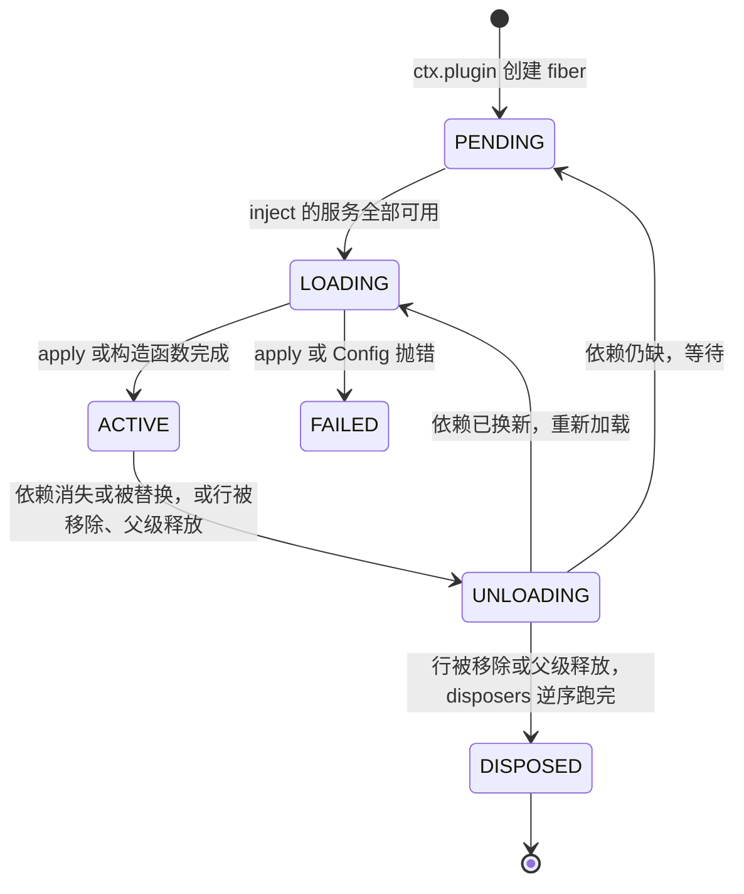

状态值 PENDING 0、LOADING 1、ACTIVE 2、FAILED 3、DISPOSED 4、UNLOADING 5（`dsh@rc.2:vendor/cordis/src/fiber.ts:147-154`，启动器的镜像在 `lyteboat/apps/cli/src/fiber-state.ts` `FIBER_STATE`）。fiber 不会从 ACTIVE 直接跳到 DISPOSED：释放时先把 `uid` 置空、epoch 设为 INACTIVE，在 UNLOADING 里跑 `_unload`（按登记的逆序调用 disposer），之后 `_getState()` 才报告 DISPOSED（`fiber.ts:265-297`、`574-579`、`675-696`）。一个 fiber 的 epoch 由它所依赖服务的 fiber uid 拼成（`fiber.ts:611-622`），epoch 变了就卸载再加载（`fiber.ts:625-639`）——**依赖是响应式的**。

**这和参考实现最大的不同**：参考实现的 `Bootstrap` 按列表顺序先逐个 `init`、再逐个 `start`，把 `start` 的返回值挂到 `ctx.{name}` 上，停止时逆序 `stop`（参考实现 `core/protocol/bootstrap.py`）——`ctx.{name}` 这一点和 Cordis 的 `super(ctx, key)` 很像；但 Cordis 里行的顺序没有加载语义，激活顺序完全由“服务什么时候可用”决定（dsh-base 的注释写明了：`dsh@rc.2:packages/bundle/base/cordis.patch.yml:12-13`）。一个 `--plugin` 探针可以验证：探针行排在所有层的最后、不注入任何服务，它 apply 的时候 `llm`、`toolPolicy`、`agentPresets` 都还没出现（[3.3](#33-启动时能看到的真实输出)）。

**可选依赖怎么写**：`inject` 永远是必需的。可选访问有两种写法：

- `ctx.get('x')`：拿一次，不响应变化。例：tools 运行时拿审批服务（`dsh/core/tools/src/index.ts` `ToolRuntime.serviceAsk`），agent-loop 拿 `sessionPersistence`（`dsh/core/agent-loop/src/index.ts` `AgentLoop.createStoredSession`），`lyteboat-try` 拿 `loader` 和 `appExit`（`lyteboat/bundles/try/src/index.ts` `run`、`apply`）。
- 嵌套 `ctx.inject(['x'], cb)`：一个子 fiber，`x` 到了才跑。例：preset 注册表对 `settings` 的用法（`dsh@rc.2:packages/preset/agent-preset-registry/src/index.ts:67`）。

**事件的四种派发方式**。参考实现的 `RunnerCallbacks` 是固定的回调槽位；dsh 里“回调”全是事件，谁都能挂，派发方式决定返回值和顺序的含义（`dsh@rc.2:vendor/cordis/src/events.ts`）：

| 方式 | 代码 | 顺序 | 返回值 | 能否否决 | 例子 |
|---|---|---|---|---|---|
| `emit` | `events.ts:194` | 同步依次调用，不等 Promise | 忽略 | 不能 | `agent/inbox/inserted`、`tools/result`、`session/event` |
| `parallel` | `events.ts:183` | 所有监听并发，等全部结束 | 忽略；有监听抛错就抛 `AggregateError` | 不能 | `session/flush`（`sessions.flush` 自己收集监听后 `Promise.allSettled`，语义相同，`dsh/core/session/src/index.ts`） |
| `serial` | `events.ts:204` | 依次 await | 第一个非空返回值就停下并返回它 | 能（返回非空即截断） | `agent/turn-stopping` |
| `waterfall` | `events.ts:234` | 洋葱式：先注册的在最外层，每层调 `next()` 进入里层 | 最外层的返回值 | 能（不调 `next()`，里层和默认行为都不执行） | `lyteboat/intake`、`lyteboat/pre-assemble`、`agent/pre-step`、`tools/pre-execute` |

**waterfall 监听的顺序就是注册顺序**（`events.ts:254-260`：默认 `push`，先注册的在最外层；监听时传 `prepend: true` 会 `unshift` 到最外层）。skill-router 注入了 `toolPolicy`，所以一定比 tool-policy 晚激活、晚注册监听，于是在 `lyteboat/pre-assemble` 里 tool-policy 在外层、skill-router 在里层。tool-policy 的代码注释写的“在 `next()` 之后对齐”（`lyteboat/plugins/tool-policy/src/index.ts` `ToolPolicyService`）依赖的就是这个顺序：里层（skill-router、agent 行、注入了 `toolPolicy` 的 `--plugin` 行，比如 `tools.mjs` 的 `inject = ['toolPolicy', 'lyteboatDistro']`，`lyteboat/bundles/try/tests/fixtures/plugins/tools.mjs`）都激活完工具之后，它最后算一次限制。注册得比 tool-policy 早、处在外层的监听也不影响结果：`activate()` 和 `clear()` 自己会立即 `reconcile`（`lyteboat/plugins/tool-policy/src/index.ts`）。`lyteboat/intake` 同理：intake-guard 是宿主行，比任何 agent 行都早注册，处在 agent 行挂的拒识门外层（`--plugin` 行的拒识门，比如 CLI 测试夹具 `lyteboat/apps/cli/tests/fixtures/plugins/intake-gate.mjs`，只注入 `lyteboatDistro`，可能比 intake-guard 先注册而在它外层）；它在 `next()` 之后才看结论（`lyteboat/plugins/intake-guard/src/index.ts` `IntakeGuardService`），所以不论哪种顺序，拒识门都先决定、它给的 reply 原样保留，准入只在本来会 pass 的第 1 个 step 上跑。

**想在整棵树起来之后跑一次代码怎么办**。参考实现的 `Lifecycle.start` 保证在所有 `init` 之后运行；Cordis 没有这个阶段，有两种替代：

- 注入启动器发布的 `appReady`，用 `appReady.onReady(listener)`：lyteboat 的启动器在 `boot()` 返回、根 fiber 是 ACTIVE、`loader` 还在时才 `commit()`（`lyteboat/apps/cli/src/profile-boot.ts` `createAppReady`、`runProfile`）。
- 像 `lyteboat-try` 那样 `await ctx.get('loader')?.await()`（`lyteboat/bundles/try/src/index.ts` `run`）：等 Loader 把当前能激活的行都处理完。`lyteboat-try` 的 `apply` 不等待这个 Promise（`index.ts`），所以不会拖住 `boot()`。

### 2.2 根 realm、standing scope 与 agent scope

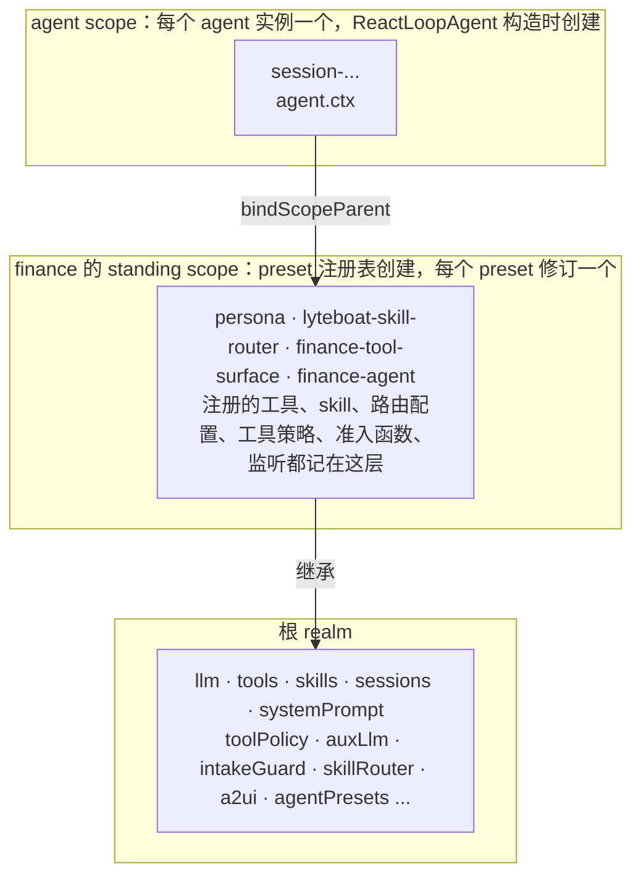

| 层 | 谁创建 | 生命周期 | 例子 |
|---|---|---|---|
| 根 realm | `boot()`；没有 `isolate` 的服务都发布在这里 | 进程 | `try` 组合的服务全在根 realm |
| standing scope | preset 注册表 `activate` 调 `createScope(owner, key)`（`dsh@rc.2:packages/preset/agent-preset-registry/src/index.ts:102-118`） | 一个 preset 修订（代码里叫 generation），声明撤销并且没有 agent 再绑定它时才释放（见下文） | finance 的行挂在这里，`auditRows` 看到它们都是 fiberState 2（ACTIVE） |
| agent scope | `ReactLoopAgent` 构造时 `createScope(loopCtx, this)`（`dsh/core/agent-loop/src/agent.ts`） | 一个 agent 实例 | setup 里 `presets.mount` 调 `bindScopeParent(agentKey, standingKey)`（registry `index.ts:241-250`），链变成 agent → standing → 全局 |

**为什么需要 scope**：同一个进程里可能有多个 agent（`lyteboat web`、`lyteboat serve` 都是）。`ScopedLayers` 类的注册表（tools、skills、toolPolicy、skillRouter、intakeGuard）读的是“全局层 + 这条 scope 链”，scoped 事件的投递规则在 `scopeTarget` 的过滤器里（`dsh@rc.2:packages/core/scope/src/index.ts:158-185`）：无 scope 标签的监听（比如根 realm 里的 `toolPolicy`）收到所有事件；带标签的监听只有在它的 scope 是派发 key 或其祖先时才收到——事件沿链往上流，不往下流。结果是：finance 行挂的 `agent/request` 监听（把温度定成 0）只听得到 finance 的 agent——finance 的循环请求带 `temperature: 0`，不带 agent 的 `lyteboat try` 没有这个字段；finance 注册的 `asset_overview`、它的工具策略和准入函数只对 finance 的 agent 生效；另一个 agent 完全不受影响。每个 agent 的运行期状态用 `WeakMap<Agent, …>` 存（`lyteboat/plugins/tool-policy/src/index.ts` `ToolPolicyService.agents`，`lyteboat/plugins/skill-router/src/index.ts` `SkillRouterService.agents`），agent 没了状态就没了；要跨进程留下来的事实（当前 skill、请求上下文）则由投影从日志折叠出来，见 [5.7](#57-为什么路由过的会话也能重开)。

**standing scope 什么时候释放**。preset 注册表给每次激活记一个 `Generation {scope, key, mount, users, retired}`（`dsh@rc.2:packages/preset/agent-preset-registry/src/index.ts:30-36`）：

- `users`：绑定在它上面的 agent 数。`mount` 时 `retain` 先临时 +1，`bind` / `join` 为这个 agent 再 +1，`mount` 结束把临时的 −1；agent 的 scope 释放时，`join` 登记的 effect 再 −1（`index.ts:208-266`）。
- `retired`：声明被撤销时置为 true（`register` 返回的 disposer，`index.ts:87-96`）。在 `lyteboat try` 里，这个 disposer 挂在 `agent-catalog` 的 `ctx.effect` 上（`lyteboat/plugins/agent-catalog/src/index.ts` `AgentCatalogService.declare`）；`reload()` 也调它（`index.ts`）。
- 只有 `retired && users === 0` 时 `collect` 才释放 standing scope（`index.ts:144-148`）。

所以 standing scope 可能比声明活得久（声明撤了、还有 agent 绑着），也可能比某个 agent 活得久（agent 没了、声明还在）。同一个 id 不能重复注册（`index.ts:83`）；声明被替换（先撤销再注册）会生成新的 generation，已经绑在旧 generation 上的 agent 不会自动迁移，只有 agent 自己再次 `mount` 时 `bind` 才把它 `rebind` 到新的（`index.ts:226-239`），旧 standing scope 要等最后一个 agent 解绑才释放。agent-catalog 的 `reload()`（`lyteboat web` 和 Studio 的 Reload、它们对根目录的监视、Studio 热修技能之后的重载都走这里）就是这样替换声明的：先撤销全部声明，再按根目录现在的内容重新注册（`lyteboat/plugins/agent-catalog/src/index.ts`），所以已经在跑的会话留在旧 generation 上、用它开始时的定义，新会话用新的。

**realm、isolate、group**。上面说的“根 realm”是服务键的命名空间：一个服务 `super(ctx, 'x')` 发布后，同一 realm 里的 `ctx.x` 都指向它。行上写 `isolate: {x: true}` 时，Loader 给这一行开一个本行私有的 realm（`LocalRealm`，`dsh@rc.2:vendor/loader/src/config/isolate.ts:48-57`），子行继承这张映射，所以 `x` 只在这一行及其子行里可见；写成 `isolate: {x: '<标签>'}` 则进入按标签共享的 realm（`GlobalRealm`，`isolate.ts:59-68`）。要让一个服务的提供者和它的消费者共享同一个私有 realm，就把它们包进一个 `cordis:group` 行（app-boot 把 `group` 注册为内置，`dsh@rc.2:packages/boot/app-boot/src/index.ts:558-563`）。例子在 web 的 standard preset 里：

```yaml
- id: planning
  name: cordis:group
  group: true
  isolate:
    planMode: true
  config:
    - id: plan-mode
      name: '@deepseek-ai/dsh-plan-mode'
```

（`dsh@rc.2:packages/bundle/web-app/presets/standard.patch.yml:42-49`）。`try` 组合里没有 `isolate` 行，所以服务全在根 realm；`web` 组合关掉了 dsh web 的四个 preset，带 `isolate` 的行随 preset 一起不加载，服务也全在根 realm（见 [3.3](#33-启动时能看到的真实输出)）。

### 2.3 dsh 与 lyteboat 的 DI 怎么交互

原则：**服务由谁发布、由谁注入，全写在代码的 `super(ctx, key)` 和 `inject` 里，跨包不 import 值**。lyteboat 的服务依赖 dsh 的服务；dsh 的服务不知道 lyteboat 的存在；agent 行同时注入两边。

每个服务由谁发布、在 try 组合里被谁注入，完整的表见 [7.1](#71-服务一览表)。三个例子：

**例子 1：一个 agent 行同时用内核服务和 lyteboat 服务**。`examples/agents/finance/src/agent.ts` `inject`：

```ts
export const inject = ['tools', 'toolPolicy', 'a2ui', 'skills', 'requestContext', 'intakeGuard', 'auxLlm']
```

`tools`、`skills` 来自内核，其余五个来自 `@lyteboat/host`。它在 apply 里挂一个 scoped 的 `dsh-skill-filesystem` 子插件，挂一个 `agent/request` 监听把温度定成 0，往 `intakeGuard` 注册准入函数、准入函数经 `auxLlm` 做分类、用 `a2ui.renderCard` 渲染未授权卡，然后通过 `ctx.toolPolicy.register(...)` 注册三个 `visibility: 'auto'` 的工具（`examples/agents/finance/src/tools/finance-tools.ts` `registerFinanceTools`）；工具执行时从请求上下文里读客户（`requestContext.contextOf`）。这个行在 finance 的 standing scope 里，所以注册的工具、skill、监听和准入函数都落在 finance 那一层。

**例子 2：行级 inject + 延迟求值的配置**。`lyteboat/bundles/try/cordis.patch.yml` 的 `agent-preset-registry` 行：

```yaml
- id: agent-preset-registry
  name: '@deepseek-ai/dsh-agent-preset-registry'
  inject: [lyteboatTryStartup]
  config:
    default: !!js ctx.lyteboatTryStartup.agent ?? 'none'
```

`!!js` 表达式在这一行自己的 Context 里求值（`dsh@rc.2:vendor/loader/src/index.ts:104-113`），而行级 `inject` 保证求值时 `ctx.lyteboatTryStartup` 已经存在。**为什么这样写**：preset 注册表是上游 npm 包，lyteboat 不改它的代码；只要在 patch 里给它加一个依赖，就能让它的默认 preset 取决于 lyteboat 解析的命令行。

**例子 3：服务缺了会怎样**。用 `--patch` 禁掉 `lyteboat-history-import`（patch 文件放在仓库外）：

```console
$ cat "$SCRATCH/no-lyteboat-history-import.yml"
- id: lyteboat-history-import
  disabled: true
$ node lyteboat/apps/cli/lib/bin.js try --patch "$SCRATCH/no-lyteboat-history-import.yml" hello
lyteboat: warning: 1 entry did not activate
lyteboat-try (@lyteboat/try): pending (waiting for service: historyImport)
lyteboat: startup failed: lyteboat-try did not activate (the entries above say why)
$ echo $?
1
```

没有发出任何模型请求。

`lyteboat-try` 静态注入了 `historyImport`（`lyteboat/bundles/try/src/index.ts` 的 `inject`，同一行还有 `agentDefaultModel`、`agents`、`agentPresets`、`agentCatalog`、`sessions`、`sessionQuery`、`sessionProjections`、`a2ui`、`intakeGuard`），于是停在 PENDING。启动审计只把 `agent-loop`、`webserver`、`headless-runner` 等 7 个 id 当作“必须激活”（`dsh@rc.2:packages/boot/app-boot/src/index.ts:746-754`），`lyteboat-try` 不在里面，所以 dsh 只打一条 warning；接着启动器自己检查 lyteboat 的模式 runner（`lyteboat-try`、`lyteboat-serve`、`lyteboat-eval`、`lyteboat-studio`、`lyteboat-inspect`，`lyteboat/apps/cli/src/mode-runners.ts` 的 `LYTEBOAT_MODE_RUNNER_IDS`），发现 `lyteboat-try` 没激活，就打最后一行并以 1 退出（`lyteboat/apps/cli/src/profile-boot.ts` `runProfile`），不让进程空挂着。见 [3.2](#32-逐步说明) 第 17 步。

### 2.4 lyteboat 怎么覆盖 dsh

| # | 机制 | 覆盖了什么 | 在哪 | 具体例子 |
|---|---|---|---|---|
| 1 | **同名接管**（pnpm `overrides`） | 内核 14 个包的实现 | `pnpm-workspace.yaml`；`.pnpmfile.cjs` 对内核名不钉版本 | `node_modules/@deepseek-ai/dsh-llm -> ../../dsh/llm/llm`；npm 包 `dsh-llm-deepseek` 在 `.pnpm` 里依赖的 `dsh-llm` 用 `readlink -f` 看也落到仓库的 `dsh/llm/llm`；`node_modules/.pnpm` 里没有任何 npm 版的 `dsh-llm` |
| 2 | **patch 层增删改行** | 组合：加行、禁行、换配置 | `lyteboat/bundles/*/cordis.patch.yml`（host、business-base、try、serve、eval、web、studio、inspect） | `@lyteboat/host` 把 `session-log-deepseek` 设为 `enabled: false`（`host/cordis.patch.yml`：这一行默认会把会话日志附到每个官方请求上）。关掉的只是会话日志：dsh-base 的 `plugin-package-inventory-deepseek` 行（`dsh@rc.2:packages/bundle/base/cordis.patch.yml:77-78`）会给每个官方请求附上 `dsh_plugin_packages`（已加载的插件包名和版本，含 `@lyteboat/agent-finance` 这类业务包），它由业务底座在列它的 profile 里关掉，由 `@lyteboat/web` 在 `lyteboat web` 里关掉，host bundle 注释里的“lyteboat sends the provider the model request only”（`host/cordis.patch.yml`）靠的是它们，见 [5.4](#54-日志怎么映射回模型看到的内容)。`@lyteboat/host` 还禁掉 dsh-base 的 `session-telemetry-otel` 行（`host/cordis.patch.yml`）：用户一给反馈它就会把会话日志前缀导出到上游收集端，而 lyteboat 的会话是业务对话，不管设没设 `DSH_TELEMETRY_DISABLED` 都不外发。`@lyteboat/business-base`（try、serve、eval、studio、inspect 五个 profile 在 host 之后列它）关掉这些行：编码工具和只为它们服务的行（bash、pwsh、jobs、文件工具、todo、goal、plan mode、子 agent、PTC 与 workflow、web 工具、MCP 资源），沙箱各行、`shell-env`、`subprocess`、`approval`、`permission`，`spill-local`、`spill-policy`，`agent-instructions`、`plugin-package-inventory-deepseek`、`plugin-manager`、`config-editor`、`settings`、`session-title-llm`；插入 `fs-local`（`dsh-fs-local`，会话控制器要 `fs`）；把 `skill-filesystem` 配成 `includeDefaultRoots: false`，把 `system-prompt` 配成 `personaPrefix: ''`、`includeHarnessIdentity: false`（`business-base/cordis.patch.yml`）。所以业务 agent 的模型请求里只有它自己的 persona、它声明的工具加 `skill`：没有沙箱和审批的 runtime context，没有工作目录的 AGENTS.md，没有插件包清单，也没有标题请求。`@lyteboat/try` 禁掉 `hmr`（`try/cordis.patch.yml`）、插入 4 行代替 dsh-headless；`@lyteboat/serve`、`@lyteboat/eval`、`@lyteboat/studio`、`@lyteboat/inspect` 也禁掉 `hmr`，`@lyteboat/studio` 还禁掉 `session-projection-cache`（`studio/cordis.patch.yml`），它读会话时不写回；`@lyteboat/web` 禁掉 dsh web 自己的 `web-startup` 行和它的四个编码 preset，把 dsh web 挪进 preset 的 agent 层行（`tool-skill`、`skill-filesystem`、`compaction-basic`、文件、shell 与子 agent 工具等）按 dsh-base 的样子放回宿主（shell 按平台，`tool-plugin-manager` 仍关），`agent-instructions` 照 dsh web 关着，另外禁掉 `plugin-package-inventory-deepseek`，`hmr` 留着（`web/cordis.patch.yml`）；`lyteboat web` 不带业务底座，沙箱、审批和编码工具都在 |
| 3 | **内核扩展** | driver 的行为：在组装提示词之前多派发两个 waterfall，reply 一步写进日志；`Session.append` 能给一条记录打上 `ignorable` 标记 | 事件：`dsh/core/agent-loop/src/agent.ts` `ReactLoopAgent.preStep`，声明在 `lyteboat/step-hooks.ts` `declare module '@deepseek-ai/cordis'`，reply 的日志在 `lyteboat/intake-reply.ts`（`agent.ts` 里只调用一次），登记在 `dsh-compat/contract/extensions.yml`；追加选项：`dsh/core/session/src/index.ts` `Session.append` 加 `lyteboat/append-ignorable.ts`，登记在 `extensions.yml` | 这三个扩展 `agent-loop-intake`、`agent-loop-pre-assemble`、`session-append-ignorable`（第四个扩展 `session-controller-prompt-source` 在 session-controller 里，见第 4 行），改内核的提交带 `Dist-Change: extend` 和 `Dist-Extension` trailer（`CLAUDE.md`「Architecture boundaries」，`pnpm run dist:delta -- --check` 检查）；每个扩展写明退出条件：前两个在上游出现能在组装前改写 step（或不发请求就回答 step）的事件时移除（`extensions.yml` 的 `exit`），第三个在上游给 `Session.append`（或别的写路径）一个设 `SessionEvent.ignorable` 的办法时移除 |
| 4 | **`lyteboatDistro` 标记服务** | 让第三方插件只在 lyteboat 上加载 | `lyteboat/plugins/distro/src/index.ts` `LyteboatDistroService`；扩展列表由 `scripts/dist/gen-distro-manifest.ts` 从 `extensions.yml` 和 `dsh.upstream.json` 生成到 `distro-manifest.ts` | `lyteboat/bundles/try/tests/fixtures/plugins/distro-aware.mjs` 声明 `inject: ['lyteboatDistro']`，输出 `lyteboat on dsh 0.1.7-rc.2: agent-loop-intake, agent-loop-pre-assemble, session-append-ignorable, session-controller-prompt-source`（`lyteboat/bundles/try/tests/distro.composite.ts` 断言这一行）；在官方 dsh 上它会停在 PENDING，不会去调一个不存在的扩展。仓库里用到 `agent-loop-intake`、`agent-loop-pre-assemble`、`session-append-ignorable` 的插件都注入它：`@lyteboat/tool-policy`、`@lyteboat/skill-router`、`@lyteboat/aux-llm`、`@lyteboat/intake-guard`（`lyteboat/plugins/tool-policy/src/index.ts`、`lyteboat/plugins/skill-router/src/index.ts`、`lyteboat/plugins/aux-llm/src/index.ts`、`lyteboat/plugins/intake-guard/src/index.ts`），测试夹具 `tools.mjs`、`intake-gate.mjs` 也一样；`@lyteboat/chat-api` 用 `session-controller-prompt-source`（`sessionController.prompt` 的 `sourceFields`）却不注入它，它只挂在 lyteboat 自己的 serve 组合里（`lyteboat/plugins/chat-api/src/index.ts`）；`@lyteboat/eval-runner` 同样经 `sourceFields` 用它而不注入它，只挂在 eval 组合里（`lyteboat/plugins/eval-runner/src/index.ts`）；`@lyteboat/web-pages` 也一样，只挂在 web 组合里（`lyteboat/plugins/web-pages/src/index.ts`） |
| 5 | **`--plugin` 行** | 往树里临时插一个本地 ESM 插件 | `lyteboat/apps/cli/src/plugins.ts` `pluginOverlay`；叠在所有文件 overlay 之上（`profile-boot.ts` `composeProfile`） | `lyteboat try --plugin lyteboat/bundles/try/tests/fixtures/plugins/tools.mjs "帮我调仓"`：注册 `lookup_assets`（always，带 `stateDelta`）和 `rebalance`（auto），并在 `lyteboat/pre-assemble` 里按用户文字激活 `rebalance`。用脚本化模型跑（不带 agent，三次循环请求）：`lookup_assets` 的 `tool/result` 带 `meta.lyteboat.stateDelta {"assets.total":1234,"assets.currency":"CNY"}`，下一步的 runtime context 只有一段 `lyteboat:state`（`{"assets":{"total":1234,"currency":"CNY"}}`）；随后 `tool/call rebalance {"target":"股债均衡"}` → `tool/result isError=false`（`已按“股债均衡”调仓`）。一个 `--plugin` 文件如果注入业务底座关掉的服务（`shell`、`subprocess`、`approval`、`sandboxPolicy` 等），在业务模式里一直 PENDING；本地试验时可以用 `--patch` 把那一行重新打开 |
| 6 | **用户 patch 层** | 某台机器、某次启动的配置 | profile 的 `cordis.patch.yml`、`$LYTEBOAT_HOME/cordis.patch.yml`、`--patch` 文件，按此顺序叠（`dsh@rc.2:packages/boot/app-boot/src/profile-context.ts:63-74`） | 上面 [2.3](#23-dsh-与-lyteboat-的-di-怎么交互) 的 `no-lyteboat-history-import.yml` |
| 7 | **自己的启动器** | dsh 的 CLI | `lyteboat/apps/cli`（改编自上游 `apps/cli/src/profile-boot.ts`，差异列在 `profile-boot.ts` 的文件头） | lyteboat 自己的模板表（`templates.ts` `LYTEBOAT_PROFILE_TEMPLATES`），profile 的 bundle 列表和模板不一致就报错（`profile-boot.ts` `ensureProfileInitialized`），dsh 跳过了模板里的 bundle 也报错（`checkSkippedProfileBundles`，`profile-boot.ts`），`LYTEBOAT_HOME` 强制写进 `DSH_HOME`，它下面的 `.agents` 写进 `DSH_AGENTS_HOME`（`home.ts` `installLyteboatHome`），用户的 `~/.dsh`、`~/.agents` 永远不被碰 |
| 8 | **peer 写法约定** | 让 dsh 的启动准入放行 lyteboat 的包 | `CLAUDE.md`「Coding conventions」的 “Tooling”，`scripts/upstream-pins.spec.ts` | `@lyteboat/try` 的内核 peer 写 `workspace:*`，非内核 dsh peer 写精确版本 `"@deepseek-ai/dsh-agent-default-model": "0.1.7-rc.2"`（`lyteboat/bundles/try/package.json`）。原因：启动准入读的是磁盘上的 manifest，pnpm 在那里不替换 `catalog:dsh`，准入拿字面的 `catalog:dsh` 去和运行的版本比（`dsh@rc.2:packages/boot/app-boot/src/plugin-compatibility.ts:61-88`，只有 `workspace:*` 一类被当作当前版本，76），匹配不上的 bundle 会被跳过、行会被禁用 |

看组合结果最直接的办法是 `config dump`，它会标出每一行来自哪个 bundle、被谁 patch 过：

```console
$ node lyteboat/apps/cli/lib/bin.js config dump --profile try
...
# == @deepseek-ai/dsh-base, patched by @lyteboat/try
- id: hmr
  name: '@deepseek-ai/dsh-hmr'
  disabled: true
  config:
    root: []
...
# == @deepseek-ai/dsh-base, patched by @lyteboat/host
- id: session-log-deepseek
  name: '@deepseek-ai/dsh-session-log-deepseek'
  config:
    enabled: false
...
# == @deepseek-ai/dsh-base, patched by @lyteboat/host
- id: session-telemetry-otel
  name: '@deepseek-ai/dsh-session-telemetry-otel'
  config:
    ...
  disabled: true
...
# == @lyteboat/host
- id: lyteboat-distro
  name: '@lyteboat/distro'
- id: lyteboat-tool-policy
  name: '@lyteboat/tool-policy'
- id: lyteboat-aux-llm
  name: '@lyteboat/aux-llm'
- id: lyteboat-request-context
  name: '@lyteboat/request-context'
- id: lyteboat-intake-guard
  name: '@lyteboat/intake-guard'
- id: lyteboat-skill-router
  name: '@lyteboat/skill-router'
- id: lyteboat-a2ui
  name: '@lyteboat/a2ui'
- id: lyteboat-history-import
  name: '@lyteboat/history-import'
# == @lyteboat/business-base
- id: fs-local
  name: '@deepseek-ai/dsh-fs-local'
# == @lyteboat/try
- id: lyteboat-try-startup
  name: '@lyteboat/try/startup'
- id: agent-catalog
  name: '@lyteboat/agent-catalog'
  inject:
    - lyteboatTryStartup
  config:
    roots: !!js ctx.lyteboatTryStartup.agentRoots
    include: !!js >-
      ctx.lyteboatTryStartup.agent === undefined ? [] :
      [ctx.lyteboatTryStartup.agent]
- id: agent-preset-registry
  name: '@deepseek-ai/dsh-agent-preset-registry'
  inject:
    - lyteboatTryStartup
  config:
    default: !!js ctx.lyteboatTryStartup.agent ?? 'none'
...
```

（`LYTEBOAT_HOME` 指向一个空目录时的输出；业务底座改过的行标着 `patched by @lyteboat/business-base`；`...` 是省略。）

**为什么覆盖手段按这个顺序选**：`CLAUDE.md`「Architecture boundaries」的 “Outside the kernel first” 规定先在内核外面做——能用 patch 配置就不写插件，能写插件就不改内核；非改内核不可时，改动要分类、要登记、要写退出条件，因为每一行内核改动都会让下一次上游同步更贵。上表 1–8 里只有第 3 项动了内核源码：旁路调用、请求上下文、准入都是插件，进内核的只有两个事件和“记录能被标成可忽略”这一个写路径选项；reply 写日志的逻辑放在 `lyteboat/` 子目录里，上游文件只留一次调用，同步时要解决的冲突更少。

---

## 3. 系统启动时序

以 `node lyteboat/apps/cli/lib/bin.js try --agents ./examples/agents --agent finance --context '{"customer":"young-idle-cash"}' "看看我的资产"` 为例，从进程启动到 agent 就绪、任务准入后交进 inbox。

### 3.1 时序图

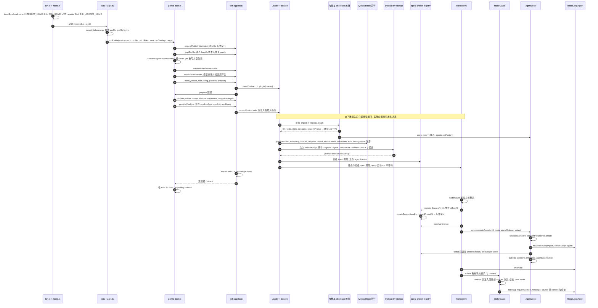

### 3.2 逐步说明

**A. 进程入口**

1. `lyteboat/apps/cli/src/bin.ts`：`home.ts` 是唯一的静态 import，先执行 `installLyteboatHome()`，再动态 import `cli.ts`。**为什么**：dsh 的 home 路径在每次调用时读 `DSH_HOME`，但必须保证任何 dsh 模块求值之前它已经是 lyteboat 的值。
2. `lyteboat/apps/cli/src/home.ts` `resolveLyteboatHome`、`installLyteboatHome`：解析 `LYTEBOAT_HOME`（默认 `~/.lyteboat`，空白视为未设置，`~` 展开），**无条件**写入 `DSH_HOME`，并把它下面的 `.agents` 写入 `DSH_AGENTS_HOME`（只有打开宿主默认技能目录的组合会读它，也就是 `lyteboat web`）。所以把 `DSH_HOME` 指到一个空目录、另设 `LYTEBOAT_HOME` 再跑 `try 你好`，那个目录里什么都没生成，`profiles/`、`sessions/`、`storages/` 都出现在 `LYTEBOAT_HOME` 下。
3. `lyteboat/apps/cli/src/cli.ts` `runCli`：`parseLyteboatArgs` 返回 `mode: 'profile'`，调 `runProfile`，同时传入 `loadLayeredEnv('lyteboat')`（`dsh@rc.2:packages/boot/app-boot/src/index.ts:234`，按“继承的环境 > 当前目录的 `.env` > `$LYTEBOAT_HOME/.env`”取值，不覆盖已继承的变量，返回冻结快照）和 `pluginOverlay(...)`。
4. `lyteboat/apps/cli/src/args.ts` `parseLyteboatArgs`：`try` 是透传命令（`passThrough`）。启动器只认 `--profile`（默认 `try`）、`--patch`、`--plugin`，其余 token 原样交给插件树。所以这里的 `args` 是 `--agents ./examples/agents --agent finance --context {"customer":"young-idle-cash"} 看看我的资产`。启动器参数必须写在前面（`args.ts`）。

**B. 组合 profile**（`lyteboat/apps/cli/src/profile-boot.ts`）

5. `runProfile` 先从环境装代理，再 `composeProfile`。
6. `prepareProfile('try')` → `ensureProfileInitialized`：`$LYTEBOAT_HOME/profiles/try/package.json` 不存在就按模板 `['@deepseek-ai/dsh-base','@lyteboat/host','@lyteboat/business-base','@lyteboat/try']`（`templates.ts` `LYTEBOAT_PROFILE_TEMPLATES.try`）调 `initProfile`（`dsh@rc.2:packages/boot/app-boot/src/profile.ts:243`）；存在但 bundle 列表和模板不一致就报错退出。**为什么要报错**：一个 bundle 列表不同的 profile 目录（比如模板改过之后留下的旧 profile 目录）照旧启动会组合出别的东西，报错时会说明怎么改：把 `dsh.profile.bundles` 改成模板的列表，或者把目录挪走让它重建（保留自己的 `cordis.patch.yml`）。
7. `loadProfile`（`profile.ts:703`）→ `loadProfileDirectory`（654）对每个 bundle 做**bundle 准入**：`evaluatePluginCompatibility`（`dsh@rc.2:packages/boot/app-boot/src/plugin-compatibility.ts:61-88`）把 bundle 的 `@deepseek-ai/dsh*` peer 和 dsh-app-boot 自己的版本比，`workspace:*` 视为当前版本（76 行），不匹配就跳过这个 bundle。lyteboat 随后用 `checkSkippedProfileBundles`（`profile-boot.ts`）检查：被跳过的 bundle 如果是这个 profile 的模板列出的，启动直接失败；其余的照 dsh 启动器的方式报告。
8. 根 `$LYTEBOAT_HOME/profiles/try/cordis.yml` 每次都重写成 `[]`（`profile-boot.ts` `PROFILE_ROOT_CONFIG`、`prepareProfile`）。**为什么**：整棵树只由 patch 层组成；Loader 的回写可能把组合后的行烤进根文件，下次启动就会重复。
9. `createRuntimeResolution`（`profile.ts:430`）从 `@lyteboat/cli` 的依赖和 peer 广度优先收集包，给后面的裸包名解析用。这就是 `lyteboat/apps/cli/package.json` 要列出所有 dsh 包的原因，也是 `CLAUDE.md`「Upstream sync (the distribution)」要求“启动器的依赖闭包必须是 dsh 自己 `apps/cli` 的超集”的原因。
10. overlay 顺序是 `[...--patch 文件, ...--plugin 行]`（`profile-boot.ts` `composeProfile`），`--plugin` 在最上面，用户文件盖不掉它。

**C. `boot()`**

11. 关闭流程：`createProcessShutdown`（最多等 5 秒，`lyteboat/apps/cli/src/process-shutdown.ts` `PROCESS_SHUTDOWN_TIMEOUT_MS`），SIGTERM 退出 0，SIGINT 退出 130（`profile-boot.ts` `runProfile`），`installFailLoud`。
12. 组装 `profileContext`（含 overlay 和 `DSH_TELEMETRY_DISABLED` 的原值），`readProfilePatches`（`dsh@rc.2:packages/boot/app-boot/src/profile-context.ts:63-74`）按顺序排好层：bundle 层（dsh-base → `@lyteboat/host` → `@lyteboat/business-base` → `@lyteboat/try`）→ profile 的 `cordis.patch.yml` → `$LYTEBOAT_HOME/cordis.patch.yml` → overlay；`DSH_TELEMETRY_DISABLED` 非空、组合里又有遥测行时再追加 `{id: 'session-telemetry-otel', disabled: true}`（`resolveTelemetryPatch`，52-55）。
13. `boot('lyteboat', rootConfig, patches, prepare)`（`dsh@rc.2:packages/boot/app-boot/src/index.ts:972-1038`）：`new Context()`（979），`baseUrl` 设为 profile 目录（994），发布 `dshHomePath`（995），`ctx.plugin(Loader)`（1001）。Loader 发布 `loader` 服务，并装上全局钩子：`internal/config`（每行在自己的 Context 里求 `!!js`）和 `internal/plugin`（合并行级 `inject`）（`dsh@rc.2:vendor/loader/src/index.ts:102-135`）。
14. `prepare(hostCtx)` 是 lyteboat 的闭包（`profile-boot.ts` `runProfile`）：provide `profileContext` 和 `launchEnvironment`；`plugin(PluginPackages, {resolution})` 装一个内存解析器，让 profile 里的裸行名按安装的依赖表解析；`provideCmdline` 发布 `cmdlineArgs`、`appExit`、`appReady`（`dsh@rc.2:packages/boot/cmdline/src/index.ts:84`）。
15. `mountRootInclude`（`index.ts:538`，调用在 1004）：先跑 `prepareProfilePatches`（`dsh@rc.2:packages/boot/app-boot/src/compatibility-preflight.ts:180-187`）——**行准入**，只在 `profileContext` 存在时生效：把所有层应用到 `[]`，按每行包的 manifest 检查 dsh peer，不匹配的行改成 `disabled: true` 并打印原因，结果合成一个 `{insert: rows}`。然后 Include 读 `[]`、应用 patch、逐行 import 并 `registry.plugin`。
16. `await loader.await()`（1010），然后 `auditStartupEntries`（1012，实现在 925）：必须激活的 id 只有 `agent-loop`、`webserver`、`modules`、`connection`、`headless-runner`、`acp`、`sdk-jsonrpc-server`（746-754），其它没激活的只 warning。
17. 回到 `runProfile`：先查 lyteboat 的模式 runner（`lyteboat-try`、`lyteboat-serve`、`lyteboat-eval`、`lyteboat-studio`、`lyteboat-inspect`）有没有激活（`inactiveModeRunner`，`lyteboat/apps/cli/src/mode-runners.ts`；runner 已经自己要求退出时不查，`profile-boot.ts`），没激活就打 `lyteboat: startup failed: <行 id> did not activate (the entries above say why)` 并以 1 退出，因为 dsh 的启动审计不认识它们；然后根 fiber 是 ACTIVE、`loader` 还在，就 `appReady.commit()`。`FIBER_STATE` 来自启动器自己的 `fiber-state.ts`。

**D. 行的激活**（顺序由服务可用性决定）

18. 内核行（都来自 dsh-base）：`llm`（`dsh@rc.2:packages/bundle/base/cordis.patch.yml:34-35`）、`session`（40-41）、`session-persistence-jsonl`（130-133，根目录 `dshHomePath('sessions')`）、`session-projection`（158-159）、`skill`（293-294）、`compaction-basic`（340-341）、`tools`（498-499）、`system-prompt`（503-506）、`agent-loop`（510-513，`agents: []`，所以它自己不建 agent）。`AgentLoop` 构造时注册 turnBoundary 和 inbox 两个投影、`ctx.agents.setFactory(this)`、加 `provider` / `model` / `cwd` 三个提示词变量（`dsh/core/agent-loop/src/index.ts`）。
19. `@lyteboat/host` 先改 dsh-base 的两行：`session-log-deepseek` 设 `enabled: false`，`session-telemetry-otel` 设 `disabled: true`（`lyteboat/bundles/host/cordis.patch.yml`）。然后插入 8 行（下面按书写顺序列出，真实激活顺序看依赖）：`lyteboatDistro` 和 `historyImport` 不注入任何服务，最先可用；`toolPolicy` 注入 tools、sessionProjections、systemPrompt、lyteboatDistro（`tool-policy/src/index.ts` `ToolPolicyService.inject`），注册 `lyteboatState` 投影和 `lyteboat:state` context，挂 `lyteboat/pre-assemble`（`next()` 之后）；`auxLlm` 注入 llm、lyteboatDistro（`aux-llm/src/index.ts` `AuxLlmService.inject`），不挂任何事件，行配置只有一个可选的 `reasoningEffort`；`requestContext` 注入 sessionProjections，注册 `lyteboatRequest` 投影（`request-context/src/index.ts` `RequestContextService`）；`intakeGuard` 注入 requestContext、lyteboatDistro，挂 `lyteboat/intake`（`next()` 之后，`intake-guard/src/index.ts` `IntakeGuardService`）；`skillRouter` 注入 skills、auxLlm、sessionProjections、systemPrompt、tools、toolPolicy、lyteboatDistro（`skill-router/src/index.ts` `SkillRouterService.inject`），所以一定在 `toolPolicy` 和 `auxLlm` 之后，注册 `lyteboatActiveSkill` 投影和 full 模式用的 `lyteboat:skills` section，挂 `lyteboat/pre-assemble`（`next()` 之前）和 `agent/pre-step`（`next()` 之后），默认 `mode: off`、路由调用的 `maxTokens` 200（`skill-router/src/index.ts` `DEFAULT_SETTINGS`）；`a2ui` 注入 tools、toolPolicy、sessionProjections（`a2ui/src/index.ts` `A2uiService.inject`），注册 `lyteboatCards` 投影。`@lyteboat/business-base` 接着关掉 dsh-base 的 42 行、插入 `fs-local`、改 `skill-filesystem` 和 `system-prompt` 两行的配置（[2.4](#24-lyteboat-怎么覆盖-dsh) 第 2 行），所以上面 18 条里的 dsh 行之外，编码工具、沙箱、审批、`permission` 这些行都不加载。
20. `@lyteboat/try` 的行（`lyteboat/bundles/try/cordis.patch.yml`）：
    - `lyteboat-try-startup` 注入 `cmdlineArgs`（`startup.ts` `inject`），用 commander 解析内层参数（`parseCmdline`，`dsh@rc.2:packages/boot/cmdline/src/index.ts:165`），`agentIds` 核对某个 `--agents` 根里有 `finance/agent.cordis.yml`（`startup.ts` `apply`），`--context` 读成一个 JSON 对象（内联或文件，`readContext`，`startup.ts`），provide `lyteboatTryStartup = {task, agent: 'finance', agentRoots, history, sessionId, context, result}`（`startup.ts` `apply`）。用法错误时 `program.error(...)`，`parseCmdline` 接住后调 `appExit(code)`，什么也不发布。
    - `agent-catalog` 的行级 inject 满足后读配置：`roots` 取 `--agents`，`include` 只取 `--agent` 这一个（`cordis.patch.yml`）；它静态注入 `agentPresets` 和 `agentDefaultModel`（`enforceDeclaredModel` 用），发布 `agentCatalog`，声明留到宿主树稳定之后（见 22）。
    - `agent-preset-registry` 的行级 inject 满足后发布 `agentPresets`。
    - `lyteboat-try` 静态注入 `agentDefaultModel`、`agents`、`agentPresets`、`agentCatalog`、`sessions`、`sessionQuery`、`sessionProjections`、`historyImport`、`a2ui`、`intakeGuard`（`lyteboat/bundles/try/src/index.ts` `inject`）；它的 `apply` 要求 `appExit` 存在，然后 `void run(...)`——**不等待**，所以 `boot()` 可以先返回。

**E. 创建 agent 并交出任务**（`lyteboat/bundles/try/src/index.ts` `run`）

21. `await ctx.get('loader')?.await()`：等宿主树稳定；读 `agentDefaultModel.currentSelection()`。
22. `agentCatalog.whenReady()` 等 agent 目录声明完。目录在宿主树稳定后声明（`lyteboat/plugins/agent-catalog/src/index.ts` `AgentCatalogService.declareAll`）：`locateAgents`（`agent-directory.ts`）在 `--agents` 根里找到 `finance`，`readAgentDefinition` 把 `agent.cordis.yml` 读成 `PresetDefinition`、把清单 `agent.yml` 读成版本和模型，`agentDigest`（`agent-digest.ts`）算出目录的摘要；发布锁钉住的 agent 先核对摘要和版本，`enforceDeclaredModel` 打开时再核对模型（`index.ts` `AgentCatalogService.pinProblem`、`AgentCatalogService.modelProblem`），这些都在 `register` 之前，被拒的 agent 的代码不会运行（try 两项都不查）；然后用 `ctx.extend({baseUrl: <agent 目录>/})` 拿到的 `agentPresets` 调 `register`，放在 `ctx.effect` 里，所以声明和 `agent-catalog` 这一行同生共死；再用 `resolve` 读注册表自己的诊断，挂不上就记为失败（`index.ts` `AgentCatalogService.declare`），严格模式下 `whenReady()` 列出每个失败的 agent 并拒绝。`register` → `activate`（registry `index.ts:91-129`）：`createScope` 造出 **standing scope**，`mountPreset`（`mount.ts:258-272`）先对 4 行做和 profile 一样的准入（`prepareProfileEntries`），挂上，`auditRows` 审计，`leakedServices` 检查有没有行往根 realm 发布服务。
23. `presets.resolve('finance')`；这次运行的工作目录取 agent 目录条目的 `workdir`，也就是 `$LYTEBOAT_HOME/agent-workdirs/finance`，不存在就建出来，条目的 `identity`（id、版本、摘要）留给请求用（不带 `--agent` 时是启动目录，没有 identity）；setup 闭包：`installModelSelection` + `presets.mount(agentCtx, 'finance')`。
24. 没带 `--session-id` 时 `agents.create({sessionId: 'session-<uuid>', meta: {cwd, agentPreset}, agentOptions: {provider, model}, setup})` → `AgentRegistry.create`（`dsh/core/agent/src/index.ts`）→ 工厂 `AgentLoop.createAgent`（`dsh/core/agent-loop/src/index.ts`）：
    1. `sessions.prepare(...)`；
    2. `createStoredSession` → `sessionPersistence.create(header)` 拿到写 handle；JSONL 后端是惰性落地的，文件在第一次落盘时连同 header 一起写出（`dsh/session/session-persistence-jsonl/src/index.ts`，见 5.2）；
    3. `setupAndPublish` → `prepare` 在 owner 的 effect 里 `new ReactLoopAgent(...)`，构造函数造出 **agent scope**（`agent.ts` `ReactLoopAgent`）；
    4. `setup(agent.ctx)`：`presets.mount` 做 retain / bind / join，`bindScopeParent(agentKey, standingKey)`（registry `index.ts:226-250`）；
    5. `appendUnstoredSuffix`，然后 `publish`：`sessions.enter`、`agents.enter`、`sessions.announce`、`agents.announce`（派发 `agent/created`）。

    带 `--session-id` 时换成 `resumeAgent`：用 `sessionQuery` 读出存下的 header 和事件，核对它跑在同一个 agent 下、不是子 agent 或 fork 出来的会话、记录的 cwd 就是这次的工作目录（`assertContinuable`，172-181；带 `--agent` 时是 agent 的工作目录，所以从哪个目录续都行），再 `agents.resume({resumeSessionId, agentOptions, setup})`。恢复出来的 `Session` 在构造时追加一条 `session/end-seed {}`，标出从存储里恢复的前缀到哪为止（`dsh/core/session/src/index.ts`）。续接的会话从日志里折叠出投影，所以当前 skill、请求上下文都还在（见 [5.7](#57-为什么路由过的会话也能重开)）。
25. dsh-permission-presets（`permission` 行）会在 `session/created` 时追加 `permission/preset`、`sandbox/mode`、`approval/policy` 三条（`dsh@rc.2:packages/interaction/permission-presets/src/index.ts:245`）。业务底座关掉了这一行，所以 try 的新会话日志从 `agent/inbox/spliced` 或准入的 `lyteboat/aux-llm-call` 开始。
26. `await agent.whenIdle()`，记下这一轮开始的位置 `firstSeq`。**准入在循环之前**：`intakeGuard.submit(agent, {text: '看看我的资产', context: config.context, owner: {kind: 'operator', id: 'cli'}, agent: identity}, signal)`。`submit`（`lyteboat/plugins/intake-guard/src/index.ts`）把空的上下文当作没给，准入函数看到的是这次给的上下文，没给就是会话里原有的（`requestContext.contextOf`）；判断的是 agent 的 scope 链上最近注册的准入函数（`admissionFor`）——finance 的经 `auxLlm` 分类，返回 `{decision: 'pass', verdict: 'asset'}`，`submit` 补上 `by: 'finance-admission'`；没注册准入函数的 agent，或不带 `--agent` 时，结论是 `undefined`。然后 `agent.followup(requestContext.message('看看我的资产', {requestId?, owner?, agent?, context?, intake?}))`：source 是 `{kind: 'user', lyteboatRequest: {...}}`（见 [5.6](#56-带请求上下文的请求准入在循环之前)）。`lyteboat try` 总是记下发起者，所以不带 agent 时 `lyteboatRequest` 里也有 `owner`；一条什么都不带的请求，`message` 生成的才是普通的 `createUserMessage({content: [{type:'text', text}], source: {kind: 'user'}})`（`lyteboat/plugins/request-context/src/index.ts`）。请求从这里开始，见第 4 节。
27. 回合结束后：`await agent.whenIdle()`；`sessions.flush`；`a2ui.turnParts(agent.session, firstSeq)` 排版这一轮，`renderTurn` 把每张卡写成单独一行 `[card <area>]`，打到 stdout（`--result json` 时改由 `tryResultOf` 打一个 JSON 对象：结局、正文、卡片、工具、技能、模型、会话 id）；会话 id 打到 stderr；`turn/end` 是 `completed` 就 `appExit(0)`，否则 1。

### 3.3 启动时能看到的真实输出

用 `--plugin` 挂一个探针跑上面的命令：探针不注入任何服务，只在 apply 时、宿主树稳定（`loader.await()` 返回）时和 `agent/created` 时读服务表、Loader 的行和 preset 注册表，再监听 `lyteboat/intake`。它看到的是：

- **激活顺序和行顺序无关**：`--plugin` 行排在所有 patch 层的最后，可它 apply 的时候（`fiber state=LOADING`）`llm`、`toolPolicy`、`agentPresets` 连同 `auxLlm`、`requestContext`、`intakeGuard` 一个都还没有；宿主树稳定之后它们才全部就位。
- **服务**：`try` 组合没有 `isolate` 行，根 realm 的服务就是全部服务；agent 创建之后服务没有多出来，finance 的行没有往根 realm 漏任何服务。`approval`、`sandbox`、`shell`、`jobs`、`goals` 这些服务不在其中：发布它们的行被业务底座关掉了。
- **行**：Loader 里的条目就是 `config dump --profile try` 的全部行，加上根 Include 这个载体和探针自己这一行。禁用的有：`tool-plugin-manager`、`skill-badge`、`tool-ralph`（dsh-base 自己禁的）、`hmr`（`@lyteboat/try` 禁的）、业务底座禁的那些行（`pwsh-sandbox`、`tool-pwsh` 在非 Windows 上本来就按平台禁用，`dsh@rc.2:packages/bundle/base/cordis.patch.yml:240-242,270-272`，业务底座把它们和 `bash-sandbox`、`tool-bash` 一起写成 `disabled: true`）、`session-telemetry-otel`（`@lyteboat/host` 禁的；`DSH_TELEMETRY_DISABLED` 非空时启动器还会再叠一层同样的禁用，`dsh@rc.2:packages/boot/app-boot/src/profile-context.ts:52-55`，`config dump` 自己拼层、不显示这一层，`lyteboat/apps/cli/src/dump-config.ts`）。
- **agent**：finance 的 standing scope 挂上的行全是 fiberState 2（ACTIVE），会话头的 `cwd` 是 finance 的工作目录，不是启动目录；agent 创建到第 1 个 step 的 `lyteboat/intake` 之间是循环前的准入（一次旁路分类）和 inbox；两个 step 各派发了一次 `lyteboat/intake`，都是 pass。模型请求是准入分类、路由和两次循环，没有标题请求。

挂上 `lyteboat/bundles/try/tests/fixtures/plugins/distro-aware.mjs`（它用拒识门直接回答，不需要模型）、不带 agent 跑 `try … 你好`：没有模型请求，第 1 个 step 的 `lyteboat/intake` 是 `reply`，stdout 是 `lyteboat on dsh 0.1.7-rc.2: agent-loop-intake, agent-loop-pre-assemble, session-append-ignorable, session-controller-prompt-source`（[2.4](#24-lyteboat-怎么覆盖-dsh) 第 4 行）。

**`lyteboat web` 的差别**：`web` profile 的模板是 `[dsh-base, @lyteboat/host, @deepseek-ai/dsh-web-app, @lyteboat/web]`（`templates.ts`），走同一个 `runProfile`。`hmr` 在这里是开的（dsh-base 里它的 `disabled` 表达式是 `!ctx.get('profileContext')`，`dsh@rc.2:packages/bundle/base/cordis.patch.yml:28-32`），会监视 patch 文件热重组；agent 目录另由 agent-catalog 自己监视：`watch: true` 时根目录下有文件变了，300 ms 内没有新的变化就 `reload()`（`lyteboat/plugins/agent-catalog/src/index.ts` `Config`、`AgentCatalogService.watchRoots`）。dsh web 自己的 `web-startup` 行遇到不认识的参数就报错，所以 `@lyteboat/web` 把它关掉，由 `lyteboat-web-startup` 解析 `--agents`（可重复）、`--agent` 和 dsh web 的 `--host`（不许 `0.0.0.0`）、`--port`、`--no-open`、`--trusted-host`，替它发布 dsh web 各行读的 `webStartup`，再发布 `lyteboatWebStartup`（`lyteboat/bundles/web/src/startup.ts` `apply`）；随后插入的行是 agent-catalog（声明每个根里的全部 agent，`strict: false`、`watch: true`）、`web-pages`、`lyteboat-web`，preset 注册表的 `default` 取 `lyteboatWebStartup.defaultAgent`，即 `--agent`，否则根目录里按 id 排第一的 agent（`lyteboat/bundles/web/cordis.patch.yml`，`startup.ts` `apply`）。dsh web 把 agent 层（`tool-skill`、`skill-filesystem`、`compaction-basic`、文件、shell、子 agent 等工具行）挪进它的四个编码 preset；`@lyteboat/web` 关掉这四个 preset，在宿主上按 dsh-base 的样子把这些行放回来：shell 按平台（非 Windows 上是 `tool-bash`，Windows 上是 `tool-pwsh`，照写 dsh-base 的表达式），`tool-plugin-manager` 仍然关着，所以 lyteboat 的 agent 跑在 dsh-base 的 agent 层上（`cordis.patch.yml`；dsh-base 的写法见 `dsh@rc.2:packages/bundle/base/cordis.patch.yml:266-272`）。`lyteboat web --agents ./examples/agents --no-open --port 0` 的 stdout 是 dsh web 的 `dsh web: http://127.0.0.1:<port>/?token=…` 和 `lyteboat-web` 行打的 `lyteboat web: agents finance`（`lyteboat/bundles/web/src/index.ts`）。除了 `config dump --profile web` 列出的行，dsh 的目录选择器还在运行时插入两行 `dsh-host-directory-picker-browse`、`dsh-client-ui-directory-picker-browse`。禁用的行：`@lyteboat/web` 禁的 `web-startup`、`preset-standard`、`preset-ptc`、`preset-minimal`、`preset-cordis`、`plugin-package-inventory-deepseek`；`@lyteboat/host` 禁的 `session-telemetry-otel`；dsh-base 禁的 `tool-plugin-manager`、`skill-badge`、`tool-ralph`，以及在非 Windows 上按平台禁的 `pwsh-sandbox`、`tool-pwsh`（`tool-pwsh` 的表达式由 `@lyteboat/web` 照 dsh-base 重写）；dsh-web-app 禁的 `agent-instructions`（`@lyteboat/web` 的 patch 也写 `disabled: true`，不再打开它）、`time-context`、`schedule`、`ui-schedule`、`ui-sidebar-browser`；启用的行全部 ACTIVE。带 `isolate` 的行只在那四个 preset 里，所以服务都在根 realm。lyteboat 的 8 个宿主服务都在，另有 `agentCatalog`、`webPages`、`lyteboatWebStartup`。**`lyteboat web` 不带业务底座**：dsh web 自己的能力（编码工具、沙箱、审批、会话标题）都在。web 组合测试的夹具 agent（只有一行 persona）用脚本化模型跑一轮，循环请求带着 dsh-base 的整套 agent 层工具（没有 `plugin_manager`，Linux 上也没有 `pwsh`）；同一个 agent 在 `lyteboat try` 下只有 `skill`。所以 `lyteboat web` 的会话不按 `/chat` 的方式跑；要按 `/chat` 的样子调试 agent，用 `lyteboat eval` 或 `lyteboat try --agent`（Studio 工作台不跑会话，见下面 `lyteboat studio` 的差别）。请求怎么进来和 serve 相同：lyteboat 页签调 `/api/lyteboat/session/send`，`@lyteboat/web-pages` 用 `ctx.sessionController.prompt`（`queue` 模式）把消息排进会话，请求 id、发起者 `{kind: 'operator', id: 'web'}`、上下文由 `ctx.requestContext.sourceFields(...)` 记在人类消息的 `source.lyteboatRequest` 上（`lyteboat/plugins/web-pages/src/index.ts` `WebPagesService.send`），不带 agent 的身份：`lyteboat web` 的 agent 目录会热重载，而已经在跑的会话用的是它开始时挂上的代码，此刻的摘要说明不了它；dsh 自己的输入框发的消息不带这些字段。两条路都不调 `intakeGuard.submit`，准入在循环里的 `lyteboat/intake` 补做。页签显示的激活 skill、请求、卡片、状态由 dsh 的 `useProjection` 从会话投影实时读出（`lyteboat/plugins/web-pages/src/client/SessionTab.tsx` `SessionTab`），不经 Host 面。

**`lyteboat serve` 的差别**：`serve` profile 的模板是 `[dsh-base, @lyteboat/host, @lyteboat/business-base, @lyteboat/serve]`（`templates.ts`），同样走 `runProfile`，`hmr` 被禁（`lyteboat/bundles/serve/cordis.patch.yml`）。`lyteboat-serve-startup` 解析 `--agents`（可重复）或 `--release`（发布锁，可重复，和 `--agents` 互斥，两者至少给一个）、`--host`（`127.0.0.1` 或 `0.0.0.0`）、`--port`、`--auth`（`none` 只能配 `127.0.0.1`，否则 `shared-secret`）、`--secret-env`，发布 `lyteboatServeStartup`（`lyteboat/bundles/serve/src/startup.ts` `command`、`apply`）。给了 `--release` 时它读每个锁（`readReleaseLock`）：锁所在的目录就是 agent 目录，目录名必须等于锁里的 id；锁记的 `dshBase` 必须等于本构建 `lyteboatDistro.dsh`，所以这一行多注入 `lyteboatDistro`，在任何读启动参数的行启动之前就拒掉换过内核的锁；然后把锁里的 agent 作为 `include`、把版本、摘要和逐文件哈希作为 `pinnedAgents` 交给 agent-catalog。随后的行是 agent-catalog（声明每个根里的全部 agent，或只声明发布锁里的 agent 并按锁钉住；`enforceDeclaredModel: true`，`cordis.patch.yml`）、agent-preset-registry（`default: none`）、workspace、connection、file-upload、session-controller、run-metrics（运行指标的记录器）、webserver、chat-api、lyteboat-serve（`cordis.patch.yml`）。进程不退出，`lyteboat-serve` 等 agent 目录声明完就打一行 `lyteboat serve: http://<host>:<port>/chat (agents: …)`，有 agent 挂不上就退出 1（`lyteboat/bundles/serve/src/index.ts` `apply`）。和 try 最大的不同在请求怎么进来：`/chat` 不直接驱动 Agent，而是经 dsh 的 session-controller（`ctx.sessionController.create` / `prompt`，`queue` 模式）把消息排进会话（新会话的 cwd 是 agent 的工作目录，`agentCatalog.get(id).workdir`；续聊只认同一个 `user` 发起者，`chat-session-owner.ts`），请求的 id、发起者（`{kind: 'user', id: <user_id>}`）、agent 的身份（`agent`：id、`agent.yml` 的版本、目录摘要，取自 `agentCatalog.get(id).identity`）、trace id、上下文由 `ctx.requestContext.sourceFields(...)` 经内核扩展 `session-controller-prompt-source` 记在人类消息的 `source.lyteboatRequest` 上（`lyteboat/plugins/chat-api/src/index.ts` `ChatApiService.answer`）；它不调 `intakeGuard.submit`，准入在循环里的 `lyteboat/intake` 补做。回答由 `ctx.a2ui.liveTurn()` 边跑边排版，写成一个 JSON 或 enterprise 事件流。每轮结束后，`@lyteboat/run-metrics` 往 `$LYTEBOAT_HOME/run-metrics/<UTC 日期>.jsonl` 追加一行 `LyteboatRunMetric`，并重写本进程运行中轮次的心跳文件；它只在内存里折叠会话事件，经异步队列写盘，写失败只记日志，不进模型请求也不进会话日志（`lyteboat/plugins/run-metrics/src/index.ts`）。Studio 的看板读这些文件（[1.5](#15-studio-工作台另一个进程同一个-lyteboat_home)）。

**`lyteboat eval` 的差别**：`eval` profile 的模板是 `[dsh-base, @lyteboat/host, @lyteboat/business-base, @lyteboat/eval]`（`templates.ts`），同样走 `runProfile`，`hmr` 被禁（`lyteboat/bundles/eval/cordis.patch.yml`）。`lyteboat-eval-startup` 解析 `--agents`（可重复，至少一个）、`--agent`、`--cases`（用例文件或目录，可重复，默认是 agent 目录的 `evals/`）、`--case`（只跑这些 id 的用例，可重复；用例文件里没有这个 id，运行就起不来）、`--run-id`（运行目录名，已存在就是用法错误；Studio 靠它起一个能跟踪的运行）、`--model`（`real` 或 `replay`）、`--from`（要回放的运行：它的目录，或 `$LYTEBOAT_HOME/evals` 下的运行 id），或者 `compare <前> <后>`，或者 `release --agents <目录> --agent <id>`（`lyteboat release` 是同一个 profile 加上这个子命令，`lyteboat/apps/cli/src/args.ts` `parseLyteboatArgs`），发布 `lyteboatEvalStartup`（`lyteboat/bundles/eval/src/startup.ts` `command`、`apply`）；随后的行是 agent-catalog（`include` 只有 `--agent` 这一个，`enforceDeclaredModel: true`）、agent-preset-registry（`default: none`）、workspace、connection、file-upload、session-controller、eval-runner、lyteboat-eval（`cordis.patch.yml`）；插件包清单、工作区 AGENTS.md 和会话标题的旁路请求（回放里没有它的录音）由业务底座关掉。请求走的路和 serve 相同：`ctx.evalRunner` 给每个用例用 `sessionController.create` 在 agent 的工作目录里开一个新会话，每一轮用 `prompt`（`queue` 模式）交进去，`sourceFields` 由 `ctx.requestContext.sourceFields(...)` 给出（发起者是 `{kind: 'system', id: 'eval'}`，和同一个 agent 的 `/chat` 会话靠它区分；同样带 agent 的身份），按 `rpcId` 认出回答它的那一轮、等到 `turn/end`，再从会话读出激活的 skill（`lyteboatActiveSkill`）、调用的工具、`ctx.a2ui.turnParts` 排出的卡片和正文、结局和循环的模型调用次数，逐项检查（`lyteboat/plugins/eval-runner/src/index.ts` `EvalRunnerService.runCase`，`eval-turn.ts` `observe`、`runEvalTurn`）；准入同样在循环里的 `lyteboat/intake` 补做。`--model real` 调模型，并把每个用例的会话录成 `sessions/<用例 id>/session.v4.jsonl`；`--model replay` 不经任何 provider：运行期间 `evalRunner` 在 `llm/stream` 上挂一个不调 `next()` 的监听，每个会话一建出来就按会话 id 绑到它那个用例的录音，循环调用按 `@deepseek-ai/dsh-llm-replay` 从录音推出的脚本作答，旁路调用（第一条消息的 `source.kind` 是 `plugin:lyteboat-aux-llm`）按录音里的 `lyteboat/aux-llm-call` 记录作答（`index.ts` `EvalRunnerService.run`，`eval-replay.ts` `EvalReplay`）。按会话 id 绑定而不按首次调用的顺序，是因为只经准入就答完的用例不发模型调用，会让后面的用例都错位到别的录音上。结果写到 `$LYTEBOAT_HOME/evals/<运行 id>/`（`run.json` 是 contracts 的 `LyteboatEvalRunRecord`：agent 的身份，以及录下的循环请求头里的模型，回放不写模型；`results.jsonl`、`sessions/`、`report.md`），进程按结果退出：0 全部通过，1 有检查失败（`compare` 时是有回归，`release` 时是发布闸门拒绝），2 跑不起来（`lyteboat/bundles/eval/src/index.ts` `apply`）。`release` 调 `ctx.evalRunner.release()`（`lyteboat/plugins/eval-runner/src/index.ts`，闸门在 `eval-release.ts` `releaseAgent`），见 [03-agent-development.md](03-agent-development.md) §4.16。

**`lyteboat studio` 的差别**：`studio` profile 的模板是 `[dsh-base, @lyteboat/host, @lyteboat/business-base, @lyteboat/studio]`（`templates.ts` 的 `LYTEBOAT_PROFILE_TEMPLATES`），同样走 `runProfile`，`hmr` 和投影缓存被禁（`lyteboat/bundles/studio/cordis.patch.yml` 的 `hmr`、`session-projection-cache` 行）。`lyteboat-studio-startup` 解析 `--agents`、`--host`、`--port`、`--trusted-host`、`--gateway-secret-env`、`--admin`、`--anonymous-viewer`、`--trace-link`，检查它们的组合（`0.0.0.0` 要配 `--trusted-host`，账户模式下没有账户就按用法错误退出并给出建第一个账户的命令），再发布 `lyteboatStudioStartup`，其中启动器的版本和 bin 由 `profileContext.installAnchor` 指向的 `package.json` 读出，Studio 起评测运行用这个 bin；`account add | set-password | remove | list` 则只做这一次改动，打一行结果，在任何一行监听之前 `appExit(0)`（`lyteboat/bundles/studio/src/startup.ts`）。`lyteboat-studio` 等 agent 目录声明完就在 stdout 打出地址、登录方式和 agent 列表，挂不上的 agent 各在 stderr 上打一行，其余照常服务；启动器的模式 runner 检查也包括它。它提供什么、读写什么、和 serve 怎样共用 `$LYTEBOAT_HOME`，见 [1.5](#15-studio-工作台另一个进程同一个-lyteboat_home)。

**`lyteboat inspect` 的差别**：`inspect` profile 的模板是 `[dsh-base, @lyteboat/host, @lyteboat/business-base, @lyteboat/inspect]`，`hmr` 被禁。`lyteboat-inspect-startup` 解析 `--agents`（可重复，至少一个）、`--agent`（必填）和 `--result`（`text` 或 `json`），根目录里没有这个 agent 或参数不对就以 2 退出（`lyteboat/bundles/inspect/src/startup.ts`）；随后的行是 agent-catalog（`include` 只有 `--agent`，`strict: false`）、agent-preset-registry（`default: none`）、agent-inspector、eval-records、lyteboat-inspect（`lyteboat/bundles/inspect/cordis.patch.yml`）。`lyteboat-inspect` 等 agent 目录声明完，用 `agentInspector` 从 agent 的常驻作用域读出工具（怎样到达模型）、技能和每个技能的确定性检查，用 `evalRecords` 读它的用例文件，打成文字或一个 JSON 对象（`@lyteboat/contracts/cli` 的 `LyteboatInspectResult`），挂上退出 0、挂不上退出 1（`lyteboat/bundles/inspect/src/index.ts`）。它不建 agent 实例，不调模型，也不挂 session-controller。

### 3.4 启动保证哪些能力

常见的问题是：llm、tools、skill、session、memory 是不是每次启动都一定初始化好了？在参考实现里答案由 `BaseAgent` 的 `build_*` 方法决定；在 dsh 里答案取决于“谁注入它”和“谁在启动审计的名单上”。

- 启动审计 `auditStartupEntries` 只对 7 个固定 id 强制“必须激活”（`dsh@rc.2:packages/boot/app-boot/src/index.ts:746-754`），`try` 组合里只有 `agent-loop` 在名单上。
- 所以硬保证的是 `AgentLoop.inject` 的 6 个服务：`agents`、`sessions`、`llm`、`tools`、`systemPrompt`、`sessionProjections`（`dsh/core/agent-loop/src/index.ts`）。缺一个，`agent-loop` 停在 PENDING，审计抛 `StartupError`。
- 其它服务缺了，依赖它的行停在 PENDING，启动只打 warning。

用 `--patch` 每次禁一行做实验（脚本化模型，patch 文件放在仓库外）：

```yaml
# $SCRATCH/no-skill.yml
- id: skill
  disabled: true
```

| 禁掉的行 | 参数 | 结果（stderr 摘录） | 退出码 | 原因 |
|---|---|---|---|---|
| `llm` | `try --patch $SCRATCH/no-llm.yml 你好` | `lyteboat: no agent factory registered (load an agent-loop plugin)`，然后 `lyteboat: fatal uncaught exception: StartupError: lyteboat: startup failed: 1 required plugin did not activate`，`Plugins waiting for services (9)`，第一行是 `agent-loop (required)  llm`，其余是连带等待的行，最后两行是 `lyteboat-aux-llm  llm` 和 `lyteboat-skill-router  auxLlm` | 1 | `agent-loop` 注入 `llm`；第一句来自 `lyteboat-try` 调 `agents.create` 时还没有工厂（`dsh/core/agent/src/index.ts` `NO_FACTORY_MESSAGE`） |
| `tools` | `try --patch $SCRATCH/no-tools.yml 你好` | 同样的 `StartupError`，`Plugins waiting for services (8)`，第一行 `agent-loop (required)  tools`，最后一行 `lyteboat-try  a2ui`：`lyteboat-try` 注入的 `a2ui` 在等 `tools`，所以这次它没走到 `agents.create`，也就没有第一句 | 1 | 同上 |
| `session` | `try --patch $SCRATCH/no-session.yml 你好` | 同样的 `StartupError`，`Plugins waiting for services (10)`，第一行 `agent-loop (required)  sessions`，最后一行 `lyteboat-try  sessions, sessionQuery` | 1 | 同上 |
| `skill` | `try --patch $SCRATCH/no-skill.yml 你好` | `lyteboat: warning: 3 entries did not activate`：`skill-filesystem`、`tool-skill`、`lyteboat-skill-router` 都是 `pending (waiting for service: skills)`；照常回答 | 0 | 没有被强制的行注入 `skills` |
| `skill` | `try --patch $SCRATCH/no-skill.yml --agents <abs>/examples/agents --agent finance --context '{"customer":"young-idle-cash"}' 看看我的资产` | 同样 3 行 warning，然后 `lyteboat: agent-catalog: 1 agent(s) failed:`，下面是 `finance: lyteboat-skill-router (@lyteboat/skill-router/agent): waiting for skillRouter` 和 `finance-agent (./lib/agent.js): waiting for skills`；没有发出任何模型请求 | 1 | finance 的 preset 挂载审计发现两行等不到服务，preset 标为 broken；agent-catalog 用注册表自己的诊断把 finance 记为失败，严格模式下 `whenReady()` 拒绝，`lyteboat-try` 打印原因并退出 1（`lyteboat/bundles/try/src/index.ts` `fail`、`apply`） |
| `session-persistence-jsonl` | `try --patch $SCRATCH/no-session-persistence-jsonl.yml 你好` | `session-checkpoint-policy (@deepseek-ai/dsh-session-checkpoint-policy): pending (waiting for service: sessionPersistence)`；照常回答，但 `$LYTEBOAT_HOME` 下**没有任何日志**（连 `sessions` 目录都没有） | 0 | `AgentLoop` 只用 `ctx.get('sessionPersistence')` 可选地取后端（`dsh/core/agent-loop/src/index.ts` `AgentLoop.createStoredSession`），没有就只在内存里 |
| `lyteboat-history-import` | 见 [2.3](#23-dsh-与-lyteboat-的-di-怎么交互) 例子 3 | `lyteboat-try (@lyteboat/try): pending (waiting for service: historyImport)`，然后 `lyteboat: startup failed: lyteboat-try did not activate (the entries above say why)` | 1 | `lyteboat-try` 静态注入 `historyImport`，不在 dsh 的审计名单上，由启动器自己的模式 runner 检查判失败 |
| memory | — | 没有可禁的行：dsh `0.1.7-rc.2` 的官方包里没有 memory 包，也没有 memory 服务；社区记忆插件各用各的服务名 | — | 见 [0.4](#04-给参考实现工程师的对照) |

结论：

- **硬保证**：`llm`、`tools`、`sessions`（连同 `systemPrompt`、`sessionProjections`、`agents`）。缺一个，进程直接失败退出，不会带病运行。
- **按 agent 保证**：`skills`。没人用时照常跑；某个 agent 的行注入了 `skills`，那个 agent 的 preset 就失效，`lyteboat try --agent` 退出 1。
- **不保证**：会话日志落盘。持久化后端缺了，`lyteboat try` 照样成功，只是没有日志。“日志是唯一事实来源”在这一点上是约定，不是启动检查。
- **由启动器兜底的**：`lyteboat-try` 静态注入的服务（`historyImport`、`a2ui`、`intakeGuard`、`agentPresets`、`sessionQuery` 等）缺了时它等不到服务，dsh 的审计不判失败，启动器的模式 runner 检查判失败、退出 1；`lyteboat-serve`、`lyteboat-eval`、`lyteboat-studio`、`lyteboat-inspect` 同样由它检查。
- **没有的**：memory。

---

## 4. 一次请求的流程

### 4.1 harness 收到任何一个请求时做什么

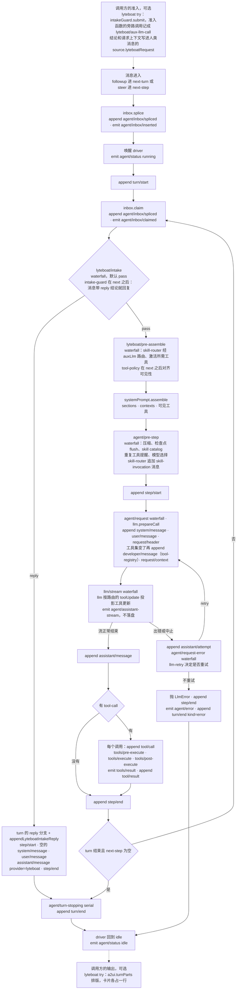

每一次 `Session.append` 都会触发 `session/event`，投影注册表在这时跑所有投影的 `apply`（`dsh/session/session-projection/src/index.ts` `SessionProjectionRegistry`、`SessionProjectionRegistry.drive`），JSONL 后端把事件放进写缓冲（`dsh/session/session-persistence-jsonl/src/storage.ts` `JsonlSessionHandle.enqueueLive`、`JsonlBackendTracker.install`）。图里没有画这两条线，因为它们挂在每一个 append 上。图里用虚线连着的两头（最上面的准入、最下面的输出）不是 driver 的事，是调用方的；`lyteboat try` 两头都做，`/chat`（`@lyteboat/chat-api`）只做输出：它用 `a2ui.liveTurn()` 边跑边排版，准入留给循环里的 `lyteboat/intake`。

| 阶段 | 事件 | 派发方式 | 代码 | lyteboat 在这里做什么 |
|---|---|---|---|---|
| S0 准入（调用方） | 不是事件：直接调 `ctx.intakeGuard.submit` | — | `lyteboat/bundles/try/src/index.ts` `run`；`lyteboat/plugins/intake-guard/src/index.ts` `IntakeGuardService.submit`、`IntakeGuardService.admit` | agent 自己 scope 链上最近的准入函数判断这条请求（finance 的经 `ctx.auxLlm` 分类一次，记成 `lyteboat/aux-llm-call`）；`submit` 再把带着结论和上下文的人类消息 `followup` 进去 |
| S1 入 inbox | `agent/inbox/inserted` | emit | `dsh/core/agent-loop/src/inbox.ts` `ReactLoopInbox.mutate` | — |
| S2 开 turn | — | — | `agent.ts` `ReactLoopAgent.turn` 追加 `turn/start` | — |
| S3 领取 | `agent/inbox/claimed` | emit | `inbox.ts` `ReactLoopInbox.claim` | — |
| S4 拒识门 | `lyteboat/intake` | waterfall | `agent.ts` `ReactLoopAgent.preStep` | intake-guard（宿主行，`next()` 之后）：人类消息带 `reply` 结论就回它的文字，没带结论的在第 1 个 step 补一次准入（`lyteboat/plugins/intake-guard/src/index.ts` `IntakeGuardService`、`IntakeGuardService.verdictFor`）；agent 行或 `--plugin` 行挂的拒识门可以不调 `next()`、直接返回 reply（CLI 测试夹具 `lyteboat/apps/cli/tests/fixtures/plugins/intake-gate.mjs` `apply`） |
| S5 组装前 | `lyteboat/pre-assemble` | waterfall | `agent.ts` `ReactLoopAgent.preStep` | skill-router 在 `next()` 前路由、激活工具、备好要注入的 skill 正文（`skill-router/src/index.ts` `SkillRouterService`、`SkillRouterService.prepare`）；agent 行或 `--plugin` 行可以在这里按用户文字激活工具（`lyteboat/bundles/try/tests/fixtures/plugins/tools.mjs` `apply`）；tool-policy 在 `next()` 后对齐（`tool-policy/src/index.ts` `ToolPolicyService`） |
| S6 组装 | `system-prompt/assemble` | waterfall | `agent.ts` `ReactLoopAgent.preStep`；`dsh/core/system-prompt/src/index.ts` `SystemPrompt.assemble` | lyteboat 不监听，只通过 `section` / `context` 注册内容 |
| S7 进入前 | `agent/pre-step` | waterfall | `agent.ts` `ReactLoopAgent.preStep` | skill-router 在 `next()` 之后把 skill-invocation 消息接在这一步的消息后面（`skill-router/src/index.ts` `SkillRouterService`）。try 组合里挂在这里的 dsh 监听：compaction-basic（压缩，`dsh/compaction/compaction-basic/src/index.ts` `BasicCompactionEngine._registerAutomaticCompaction`）、session-checkpoint-policy（flush）、tool-skill（skill catalog）、repeat-tool-reminder，以及 `lyteboat-try` 通过 `installModelSelection` 装的模型选择；agent-instructions（AGENTS.md 类指令，`dsh@rc.2:packages/context/agent-instructions/src/index.ts:315`）、plan-mode、goal-round-driver 这几个监听被业务底座关掉了；`lyteboat web` 里还有 plan-mode 与 goal-round-driver，agent-instructions 在那里也关着 |
| S8–S11 请求 | `agent/request`、`llm/stream` | waterfall | `agent.ts` `ReactLoopAgent.prepareRequest`、`ReactLoopAgent.step`；`dsh/llm/llm/src/index.ts` `LlmRuntime.streamWithRegistration` | finance-agent 在 `agent/request` 里把温度定成 0（`examples/agents/finance/src/agent.ts` `apply`） |
| S10′ 工具集变化 | 不是事件：`buildRequest` 追加 `developer/message` | — | `agent.ts` `ReactLoopAgent.buildRequest`；`dsh/llm/llm/src/index.ts` `LlmRuntime.adapterStream` | —（tool-policy、skill-router 改的是可见工具，driver 在两次请求之间比较 `request/header` 的工具名并记下增删） |
| S11′ 请求失败 | `agent/request-error` | waterfall，默认不重试 | `agent.ts` `ReactLoopAgent.step`（先追加 `assistant/attempt`） | — （llm-retry 在这里返回 `{kind: 'retry'}`，`dsh@rc.2:packages/llm/llm-retry/src/index.ts:243`） |
| S12 流 | `agent/assistant-stream` | emit，不持久化 | `agent.ts` `ReactLoopAgent.step` | `lyteboat try` 把推理打到 stderr（`lyteboat/bundles/try/src/index.ts` `streamReasoning`） |
| S13 工具 | `tools/pre-execute`、`tools/execute`、`tools/post-execute`、`tools/result` | waterfall ×3、emit | `dsh/core/tools/src/index.ts` `ToolRuntime.prepareExecution`、`ToolRuntime.dispatchScheduledExecution`、`ToolRuntime.postExecute`、`ToolRuntime.notifyResult` | 工具的 `presentationMeta` 带出 `meta.lyteboat.{cards,stateDelta}`；模型自己调 `skill` 工具加载的 skill 由 `lyteboatActiveSkill` 投影从这次调用的 `tool/call` 和成功的 `tool/result` 折叠出来（`skill-router/src/index.ts` `lyteboatActiveSkillProjectionDefinition.apply`），lyteboat 没有 `tools/result` 监听 |
| S14 结束 | `agent/turn-stopping` | serial | `agent.ts` `ReactLoopAgent.turn` | — |
| S15 输出（调用方） | 不是事件：`ctx.a2ui.turnParts` 或 `ctx.a2ui.liveTurn()` | — | `lyteboat/bundles/try/src/index.ts` `run`；`lyteboat/plugins/a2ui/src/index.ts` `A2uiService.turnParts`、`A2uiService.liveTurn`，`turn-parts.ts` `LyteboatTurnComposer` | 每一步的回答文字按写出的顺序保留（工具那一步写的文字在它的卡片前面）；`immediate` 卡片放在它的结果到达的位置；回答里的每个 `[[card:<area>]]` 换成那个区域还没出现的 `deferred` / `deferred_discard` 卡片；turn 完成时没放下的 `deferred` 卡片跟在最后，`deferred_discard` 丢掉；`lyteboat try` 把每张卡打成一行 `[card <area>]`，`/chat` 把卡片放进回答或事件流 |

**几个要点，每个都容易想错：**

- **`lyteboat/intake` 和 `lyteboat/pre-assemble` 每个 step 都派发**，不只是第一个。工具结果之后的 step 里 `messages` 是 `[]`，监听要能处理空数组；skill-router 看到没有用户文字就不路由（`skill-router/src/index.ts` `SkillRouterService.prepare`），intake-guard 只在第 1 个 step 管准入（`intake-guard/src/index.ts` `IntakeGuardService`）。
- **准入和拒识门都在路由之前**。reply 分支不组装提示词、不调模型，也就没有路由调用；finance 给未授权客户的回复只有一次旁路请求（准入分类），见 [5.6](#56-带请求上下文的请求准入在循环之前)。准入的结论记在人类消息上；没经 `submit` 就 `followup` 的消息（一个不做准入的客户端）会在 `lyteboat/intake` 里补一次准入，回复一样，但结论和卡片不进日志（`lyteboat/plugins/intake-guard/src/index.ts`）。
- **`lyteboat:state`（order 130，`LYTEBOAT_STATE_CONTEXT_ORDER`）是 runtime context，不是系统提示 section**。它渲染成一条 `source.kind = 'runtime-context'` 的 **user** 消息；业务模式里它是唯一的一段（业务底座关掉了 dsh 的 `sandbox:policy`（110）、`approval:policy`（115）），`lyteboat web` 里三段渲染在同一条消息里：快照消息由 `RuntimeContextProjection.project` 构造（`dsh/core/agent-loop/src/runtime-context.ts`），放在领取的用户消息之后则是 `agent/pre-step` 的默认决定 `messages: [...claimed, context]`（`dsh/core/agent-loop/src/agent.ts` `ReactLoopAgent.preStep`）。只有 full 模式的 `lyteboat:skills`（450，`LYTEBOAT_SKILLS_SECTION_ORDER`）是系统提示 section（`skill-router/src/index.ts` `SkillRouterService`）。
- **路由选中的 skill 不是 context，是一条消息**。skill 正文是一条 dsh 自己的 skill-invocation user 消息（`source: {kind: 'skill-invocation', name, form: 'instructions'}`，和用户手动调用 skill 时 dsh-tool-skill 写的是同一种），由 skill-router 在 `agent/pre-step` 的 `next()` 之后追加（`skill-router/src/index.ts` `invocationMessage`、`SkillRouterService`）。它只在切换了 skill、或者正文已经不在模型看得到的对话里（比如被压缩掉）时追加（`SkillRouterService.applyActive`），所以同一个 skill 的后续 step、续接的会话都不会重复注入；换 skill 时消息开头多一句 `Skill "<旧>" is no longer active; follow the skill below instead.`。
- **state delta 和卡片不是在 `tools/post-execute` 里加的**。它们在 dispatch 阶段由 `createSuccessResult` 调工具的 `presentationMeta` 产生，只对顶层调用生效（`dsh/core/tools/src/index.ts`），然后 agent-loop 原样写进 `tool/result.meta`（`dsh/core/agent-loop/src/tool-calls.ts` `appendToolResult`）。`meta.lyteboat.cards` 是数组，每张卡 `{surfaceId, area, emission, payload}`（`lyteboat/core/contracts/src/index.ts` `LyteboatResultCard`）。lyteboat 没有 `tools/post-execute` 监听。
- **投影只折叠追加的节点**。`lyteboatState`、`lyteboatCards`、`lyteboatActiveSkill`、`lyteboatRequest` 都先看 `surfaceOp === 'append'`（`tool-policy/src/state.ts` `lyteboatStateProjectionDefinition.apply`，`a2ui/src/cards-projection.ts` `lyteboatCardsProjectionDefinition.apply`，`skill-router/src/index.ts` `lyteboatActiveSkillProjectionDefinition.apply`，`request-context/src/request-projection.ts` `lyteboatRequestProjectionDefinition.apply`）：被替换的旧节点（压缩、agent 缩短一条旧的工具结果）保留原来的 meta，再算一次就会重复。
- **state 在下一个 step 才被模型看到**：`lyteboatState` 投影在 `tool/result` 追加时就更新了，但 runtime context 在下一次 `assemble` 时才重新渲染（[2.4](#24-lyteboat-怎么覆盖-dsh) 第 5 行的 `tools.mjs`：`tool/result` 带的 `stateDelta` 到下一步的 runtime context 才出现）。反过来，内容没变的 runtime context 不会再追加一次快照（`dsh/core/agent-loop/src/runtime-context.ts` `RuntimeContextProjection.project`）：finance 的工具不带 `stateDelta`，状态一直为空，业务模式里它的两步都没有 runtime-context 消息。
- **`step/start` 在 `system/message` 之前**：先 `step/start`（`agent.ts` `ReactLoopAgent.turn`），再 `prepareRequest`，然后才追加 `system/message` 和本 step 的 `user/message`，再是 `request/header`、工具集变化时的 `developer/message`，最后 `request/context`。
- **工具集在两次请求之间变了，driver 会记下来**。`buildRequest` 在写出新的 `request/header` 后，拿它和上一个 header 的工具名比，有增删就追加一条 `developer/message`：`source: {kind: 'tool-registry'}`，内容是 `tool-addition` / `tool-removal` 块，有新增时带 `headerSeq`（新工具的定义在那条 header 里，`dsh/core/session/src/types.ts` `SessionEventMap`）。它是 surface 事件，所以也进入推导出的对话。要不要因此开一个新的请求序列（新序列会以 `replace` 重写系统提示）由路由决定：路由声明了 `toolUpdate`（dsh-llm-deepseek 默认目录里的 `deepseek-flash` 是 `addition-only`，`dsh@rc.2:packages/llm/llm-deepseek/src/models.ts:13`）时工具变化不开新序列，没声明时才开（`agent.ts` `ReactLoopAgent.step`，判断工具是否变了在 `toolsChanged`）。发请求时 `dsh-llm` 用 `session.toolHistory()` 折叠出的工具历史投影：`addition-only` 路由上，声明里只留当前可见的工具，新出现的工具标 `deferLoading`（线上是 `defer_loading: true`），由对话里的 `tool-addition` 块（线上是 `tool_addition`）启用，`tool-removal` 块不发（`dsh/llm/llm/src/content.ts` `toolDeclarations`、`projectToolUpdates`）。续接换 skill 时的日志和线上请求见 [5.4](#54-日志怎么映射回模型看到的内容)。

### 4.2 finance 请求“看看我的资产”的时序

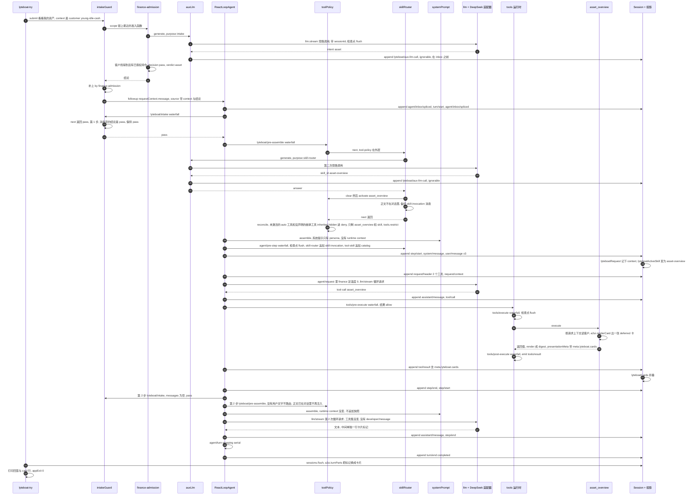

脚本化模型一共收到 4 个请求，顺序是：准入分类、路由、循环（2 个工具）、循环。第一次循环请求里只有 `asset_overview` 和 `skill`：业务底座之后 finance 从 dsh-base 只继承 `skill` 一个工具；finance 的 `finance-tool-surface` 行写的是 `inherited: hidden` 加 `skill: { visibility: always }`（`examples/agents/finance/agent.cordis.yml`），于是它继承的工具里凡是没有声明点名的都隐藏、永远不激活（`lyteboat/plugins/tool-policy/src/index.ts` `ToolPolicyService.reconcile`），在 `lyteboat web` 这类带着编码工具的组合里也一样，finance 自己的三个工具按 `auto` 注册（`examples/agents/finance/src/tools/finance-tools.ts` `registerFinanceTools`），只有被激活的 skill 的 `requiredTools` 会被放开（`examples/agents/finance/assets/skills/asset-overview/SKILL.md` 的 frontmatter：`metadata.lyteboat.requiredTools: [asset_overview]`），`allocation_diagnosis`、`lookup_knowledge` 留在 deny 里。系统提示就是 persona 的全文：persona 行配了 `complete: true`（`agent.cordis.yml`），替换掉 dsh 默认的整段系统提示；业务底座本来也不加宿主 persona 和 harness 身份段。没有标题请求：它来自 dsh 的 `session-title-llm` 行（包 `dsh-session-title-first-prompt-llm`，等第一条 `request/header` 写入、拿到主请求的路由后才启动，`dsh@rc.2:packages/session/session-title/src/index.ts:356-363,526-536`），业务底座关掉了它，`session-title` 行只写一个回退标题。finance 的 `asset_overview` 卡片清单写的是 `emission_mode: deferred`（`examples/agents/finance/assets/a2ui/asset_overview/manifest.yaml`），回答里单独一行写了 `[[card:asset_overview]]`（digest 里的这个标记由 `cardMarker('asset_overview')` 写出，`examples/agents/finance/src/tools/asset-overview-tool.ts` `defineAssetOverviewTool`），`turnParts` 就把卡片放在那里（`lyteboat/plugins/a2ui/src/turn-parts.ts` `LyteboatTurnComposer`），所以 stdout 是回答的第一句、一行 `[card asset_overview]`、回答的最后一句；没写 `emission_mode` 的卡片按 `immediate` 处理（`lyteboat/plugins/a2ui/src/engine.ts` `TemplateEngine.render`；写了但不是三种模式之一的，加载时就报错，`lyteboat/plugins/a2ui/src/loader.ts` `emissionModeOf`），比如 [5.6](#56-带请求上下文的请求准入在循环之前) 的 `unauthorized` 卡排在回答前面。

**为什么路由要在 `lyteboat/pre-assemble` 里做、而不能挂在 dsh 的 `agent/pre-step` 上**：`agent/pre-step` 在 `systemPrompt.assemble` 之后才派发（`agent.ts` `ReactLoopAgent.preStep`），那时提示词和可见工具已经定了；路由的结果（`requiredTools`）必须影响**这一步**的请求。这正是 `dsh-compat/contract/extensions.yml` 的 `agent-loop-pre-assemble` 条目 写的理由和退出条件。skill 正文则不同：它是这一步的一条消息，不属于组装的结果，所以 skill-router 在 `lyteboat/pre-assemble` 里把它备好，到 `agent/pre-step` 再接进这一步的消息，两步用的是同一个 agent 的状态（`skill-router/src/index.ts` `AgentSkillState`、`SkillRouterService.prepare`）。

---

## 5. 会话日志的时序

### 5.1 日志在哪、长什么样

- **路径**：`$LYTEBOAT_HOME/sessions/<编码后的 cwd>/session-<uuid>/session.v4.jsonl.zstd`，旁边一个锁文件 `session.lock`。日志路径由 `logPath` 拼出（`dsh/session/session-persistence-jsonl/src/format.ts`），锁文件名是 `LEASE_FILENAME`（`dsh/session/session-persistence-jsonl/src/lease.ts`）。根目录来自 dsh-base 的 `root: !!js dshHomePath('sessions')`（`dsh@rc.2:packages/bundle/base/cordis.patch.yml:130-133`），而 `dshHomePath` 读的是被 lyteboat 改写过的 `DSH_HOME`，所以日志总在 `$LYTEBOAT_HOME` 下。带 `--agent` 时，`<cwd>` 是 agent 的工作目录 `$LYTEBOAT_HOME/agent-workdirs/<id>`。
- **格式**：zstd 压缩，**每次落盘写一个 zstd 帧**；第一行是 header（会话 id 和时间每次不同，写成 `…`）：

```text
{"type":"session","version":4,"id":"session-…","createdAt":…,"cwd":"<LYTEBOAT_HOME>/agent-workdirs/finance","isSeeded":false,"delegationDepth":0,"agentPreset":"finance"}
```

- **读法**：`@lyteboat/testing/session-log` 的 `findSessionLogs(home)` / `readSessionLog(path)`（`lyteboat/tooling/testing/src/session-log.ts`）。它逐帧解压：JSONL 后端每批写一个 zstd 帧，而 Node 的 `zstdDecompressSync` 读完第一帧就停，所以要先用 `scanZstdFrames` 按结构找出每一帧，再逐帧解码（同文件的模块说明）。同一个包的 `@lyteboat/testing/session-reopen` 给出 `reopenRefusal(records)`：用 dsh 持久化层的 `validateStoredEvents` 判断这份日志能不能被重开（`lyteboat/tooling/testing/src/session-reopen.ts`）。
- **同时写的**：`$LYTEBOAT_HOME/storages/session_projcache/sessions/<id>.json`（投影缓存）。
- **谁还读它们**：Studio（`lyteboat studio`）是另一个进程，经 `@lyteboat/session-index` 用 `sessionPersistence` 的读句柄读同一个 home 下的这些日志，不拿写所有权；studio 组合关掉了投影缓存，读的时候不写回（[1.5](#15-studio-工作台另一个进程同一个-lyteboat_home)）。

下面几节的事件顺序，是在构建好的 CLI 上用脚本化模型跑 finance 得到的（命令见各节）。seq 从 0 数起；会话 id、时间和 surfaceId 每次运行都不一样。

### 5.2 追加与落盘的时序

事件什么时候**追加**（进内存日志）和什么时候**落盘**（写 zstd 帧）是两回事：

1. `Session.append`（`dsh/core/session/src/index.ts`）校验数据，推进内存日志，然后派发 `session/event`。
2. JSONL 后端的 tracker 收到 `session/event` 就 `enqueueLive`：拷一份进缓冲，挂一个 200 ms 的定时器（`dsh/session/session-persistence-jsonl/src/storage.ts`）。
3. `session/flush` 让缓冲立刻排空。按约定它只通过 `sessions.flush(session)` 派发（`dsh/core/session/src/index.ts` 的 `SessionStore.flush`）——这是 docstring 里写的约定（一个入口、一种写法，便于不变式检查），不是技术限制，代码并不阻止别人直接 `ctx.parallel('session/flush', …)`；`drainBuffered`（`storage.ts`）是单飞循环，写的过程中新到的事件进下一批。
4. 实际写：第一次落盘由 `materialize`（`dsh/session/session-persistence-jsonl/src/index.ts`）把 header 帧和第一批帧写进临时文件、fsync 后发布；之后每批追加一个 zstd 帧，`open(path,'a')` → `writeFile` → `sync()`，失败就截回原长度。

写入几乎都来自显式的 flush，或同一次排空的延续；200 ms 的定时器是兜底。显式 flush 的来源：

| 触发者 | 时机 | 代码 |
|---|---|---|
| `dsh-session-checkpoint-policy` | 任何带 `sessionId` 的 `llm/stream`（循环、旁路调用、`lyteboat web` 里的标题）开始前；顶层 `tools/execute` 执行工具体之前；每个 `agent/pre-step` | `dsh@rc.2:packages/session/session-checkpoint-policy/src/index.ts:63-83`；`@lyteboat/aux-llm` 的调用带着 agent 的 `sessionId`（`lyteboat/plugins/aux-llm/src/index.ts` 的 `AuxLlmService.generate`），所以准入分类和路由调用前也会 flush |
| `dsh-session-projection-cache` | 写检查点时调 `sessions.flush`：`session/created`、`turn/end` 以及事件数 / 时间阈值 | `dsh@rc.2:packages/session/session-projection-cache/src/index.ts:266,316-317,337-338`；dsh-base 的行配置 `dsh@rc.2:packages/bundle/base/cordis.patch.yml:182-186` |
| `@lyteboat/try` | `whenIdle` 之后 `await sessions.flush(agent.session)`；它通常紧跟投影缓存的 `turn/end` 检查点，并入同一次排空 | `lyteboat/bundles/try/src/index.ts` 的 `run` |
| 关闭 | `session/disposed` 时关闭 handle，先排空剩余 | `dsh/session/session-persistence-jsonl/src/storage.ts` |

`try --agents ./examples/agents --agent finance --context '{"customer":"young-idle-cash"}' 看看我的资产` 的日志：

| seq | 类型 | 关键字段 |
|---|---|---|
| 0 | `lyteboat/aux-llm-call` | **`ignorable: true`**；`purpose: intake`，完整的 system 和 prompt，`output` 是 `{"intent":"asset",…}`；**在 inbox 之前**，因为准入跑在 `followup` 之前 |
| 1–3 | `agent/inbox/spliced`、`turn/start`、`agent/inbox/spliced` | 插入（人类消息已经带着 `source.lyteboatRequest`）、`turn: 1`、driver 领取 |
| 4 | `lyteboat/aux-llm-call` | **`ignorable: true`**；`purpose: skill-router`，`output` 是 `{"skill_id":"asset-overview",…}` |
| 5–6 | `step/start`、`system/message` | turn 1 step 1；`surfaceOp: append`，系统提示就是 finance persona 的全文 |
| 7 | `user/message` | “看看我的资产”，**`source.lyteboatRequest`** 带发起者、agent 的身份、上下文和放行判定（5.3） |
| 8 | `user/message` | **`source: {kind: skill-invocation, name: asset-overview, form: instructions}`**，`<skill_content name="asset-overview">…` |
| 9 | `user/message` | `source.kind: skill-catalog` |
| 10–11 | `request/header`、`request/context` | `reason: initial`，2 个工具：`asset_overview`、`skill`；config 里有 `temperature: 0` |
| 12 | `session/title` | `source.kind: fallback`：业务底座关掉了标题的旁路请求，只写回退标题 |
| 13–16 | `assistant/message`、`tool/call`、`tool/result`、`step/end` | 模型调 `asset_overview`；`tool/result` 的正文是 digest，`meta.lyteboat.cards` 带 1 张卡（`area: asset_overview`，`emission: deferred`），没有 `stateDelta` |
| 17–20 | `step/start`、`assistant/message`、`step/end`、`turn/end` | turn 1 step 2：回答的中间单独一行 `[[card:asset_overview]]`；`reason: {kind: completed}` |

几个观察：会话开头没有 `permission/preset`、`sandbox/mode`、`approval/policy`（业务底座关掉了 `permission` 行）；两步都没有 runtime-context 消息（沙箱与审批两段关掉了，状态为空，内容没变的快照不追加，`dsh/core/agent-loop/src/runtime-context.ts`）；step 2 没有第二条 `request/header`（头没变、也没开新请求序列，`ReactLoopAgent.buildRequest`），也没有 `developer/message`（工具集没变）；`request/context` 只在值变化时追加；skill 正文只在 seq 8 出现一次，step 2 的 `lyteboat/pre-assemble` 看它已经在对话里，就不再注入。

### 5.3 lyteboat 的事实在日志的哪里

lyteboat 的事实都骑在 dsh 已有的信封上，唯一一种 lyteboat 自己的记录是可忽略的旁路调用审计：

| lyteboat 的事实 | 在日志的哪里 | 谁写的 | 谁读 |
|---|---|---|---|
| 卡片 | `tool/result.data.meta.lyteboat.cards`（数组） | finance 工具共用的 `presentationMeta`（`examples/agents/finance/src/tools/finance-tool-support.ts`，调 `cardsPresentationMeta`），卡片由 `ctx.a2ui.renderCard` 渲染（`examples/agents/finance/src/tools/asset-overview-tool.ts`） | `lyteboatCards` 投影（`lyteboat/plugins/a2ui/src/cards-projection.ts`）、`a2ui.turnParts`（`lyteboat/plugins/a2ui/src/index.ts`） |
| 状态增量 | `tool/result.data.meta.lyteboat.stateDelta`（finance 的工具不带；[2.4](#24-lyteboat-怎么覆盖-dsh) 第 5 行的 `tools.mjs` 带） | `toolPolicy.register` 包一层 `presentationMeta`（`lyteboat/plugins/tool-policy/src/index.ts` 的 `ToolPolicyService.register`） | `lyteboatState` 投影（`lyteboat/plugins/tool-policy/src/state.ts`），再由 `lyteboat:state` context 渲染 |
| 当前 skill | skill-invocation 的 `user/message`；模型自己调 `skill` 工具时是那次 `tool/call` 和成功的 `tool/result` | skill-router 在 `agent/pre-step` 追加；dsh 的工具运行时 | `lyteboatActiveSkill` 投影（`lyteboat/plugins/skill-router/src/index.ts`） |
| 旁路调用审计 | `lyteboat/aux-llm-call`，`ignorable: true` | aux-llm（`AuxLlmService.generate`） | 人；eval 的回放；没有投影读它，模型也看不到 |
| 请求上下文、发起者、agent 的身份、准入结论 | 人类消息的 `user/message.data.source.lyteboatRequest`（见 [5.6](#56-带请求上下文的请求准入在循环之前)） | `intakeGuard.submit` 经 `requestContext.message`（`lyteboat/plugins/intake-guard/src/index.ts`，`lyteboat/plugins/request-context/src/index.ts`） | `lyteboatRequest` 投影（`lyteboat/plugins/request-context/src/request-projection.ts`）、intake-guard、`lyteboatCards`（结论里的卡片） |
| 拒识 / 准入回复 | `assistant/message.message.source = {provider: 'lyteboat', model: <插件或准入函数名>}` | driver 调用的 `appendLyteboatIntakeReply`（`dsh/core/agent-loop/src/lyteboat/intake-reply.ts`） | 人、UI |

5.2 那次运行里，seq 7 的人类消息的 `source` 和 seq 15 的 `tool/result.meta`（卡片的组件裁掉了）：

```text
{"kind":"user","lyteboatRequest":{"owner":{"kind":"operator","id":"cli"},"agent":{"id":"finance","version":"1.0.0","digest":"sha256:…"},"context":{"customer":"young-idle-cash"},"intake":{"decision":"pass","verdict":"asset","by":"finance-admission"}}}
{"lyteboat":{"cards":[{"surfaceId":"asset_overview-session--…","area":"asset_overview","emission":"deferred","payload":{"event":"beginRendering","version":"1.0.0","surfaceId":"asset_overview-session--…","rootComponentId":"root-container","showType":"card","components":[…],"businessPayload":{…}}}]}}
```

### 5.4 日志怎么映射回模型看到的内容

**规则：模型看得到的，日志里都能还原**（`CLAUDE.md`「Architecture boundaries」的 “Model-visible ⟺ logged”，dsh 的规则）。driver 发请求时不是自己拼消息，而是追加 `request/header`（以及需要时的 `developer/message`、`request/context`）之后，直接用 `session.deriveMessages()` 当消息列表、用 `session.toolHistory()` 当工具历史（`ReactLoopAgent.buildRequest`，`dsh/core/agent-loop/src/agent.ts`）。`deriveMessages`（`dsh/core/session/src/index.ts` 的 `Session.deriveMessages`）只遍历带 `surfaceOp` 的事件；对 `tool/result` 只取 `data.message`；不认识且带 `ignorable` 的记录保留在日志里，但不碰 surface（`dsh/core/session/src/surface.ts`）。所以：

- `meta.lyteboat.cards` 和 `stateDelta` **永远不进对话记录**，模型看到的是工具 `render` 出来的 digest（finance 的 `render` 只取 digest：`[tool:asset_overview status=ok areas=asset_overview]`、【事实】…）。卡片只给 UI 和 `turnParts`；模型只知道卡片的名字（digest 里的 `areas=` 和【回答要点】里的标记）。
- 状态进模型的唯一路径是下一步的 `lyteboat:state` runtime context；finance 没有状态，这一段为空，不出现。
- skill 正文进模型的路径是那条 skill-invocation 消息，它本身就是 surface 事件。
- 请求上下文不进模型：它在人类消息的 `source` 上，模型收到的只是这条消息的文字。
- `lyteboat/aux-llm-call` 不进任何循环请求；它们记的是另外的请求。
- 工具集的变化是一条 `tool-registry` 的 `developer/message`，它也是 surface 事件；线上怎么表达它由路由的 `toolUpdate` 决定（见下）。

dsh 在测试里用一条不变式强制这件事：每个循环请求的 `messages` 必须等于派发时的 `deriveMessages()`，模型、工具等必须等于折叠后的 `request/header`（`dsh/core/agent-loop/src/invariant.ts`）。这条不变式挂在 `invariants` 服务上，`lyteboat try` 的组合里没有这个服务，它在单元测试 harness 和 G2 里生效（`CLAUDE.md`「Testing」）。工具更新的投影发生在这之后、交给适配器之前（`dsh/llm/llm/src/index.ts`），输入只有日志推导出的消息、header 里的工具和 `toolHistory`，所以线上请求仍然能从日志还原。离线核对的办法：用内核的 `Session.create(id, 回复前的事件).deriveMessages()` 重建每个循环请求，按路由的 `toolUpdate` 用 `dsh-llm` 的 `projectToolUpdates` 投影，再和模型收到的请求比较；旁路调用则拿 `lyteboat/aux-llm-call` 记下的 `system`、`prompt` 和收到的旁路请求比较。

DeepSeek 适配器在线上做了这几件事：

1. 把 surface 第 0 个节点（`system/message`）挪到 `system` 字段；
2. 把相邻的 user 角色节点合并成一条；
3. 把工具结果放成 user 消息里的 `tool_result` 块；
4. 按 `request/header` 的 config 写 `thinking`、`output_config`、`max_tokens`、`temperature`（温度来自 finance 的 `agent/request` 监听，不带 agent 时没有这个字段）。dsh-base 的 `plugin-package-inventory-deepseek` 行（`dsh@rc.2:packages/bundle/base/cordis.patch.yml:77-78`；`dsh@rc.2:packages/llm/plugin-package-inventory-deepseek/src/index.ts:1-6`）还会给每个官方请求附上 `dsh_plugin_packages`，一份已加载插件包的名字和版本（含 `@lyteboat/agent-finance` 这类业务包）。它**不进会话日志**，也不是模型可见的内容，所以不违反上面这条规则，但它会把 lyteboat 的插件组成随每个官方请求发给服务端，所以业务底座和 `@lyteboat/web` 都关掉了这一行；
5. 把 `tool-registry` 的 `developer/message` 写成一条 `role: system` 的消息，放在它前面那轮 user 之后，`tool-addition` / `tool-removal` 块写成 `tool_addition` / `tool_removal`，工具声明里 `deferLoading` 写成 `defer_loading: true`（`dsh@rc.2:packages/llm/llm-deepseek/src/serialize.ts:84-100,160-165`）；出现这类块时请求头里加上 beta 开关 `mid-conversation-tool-changes-2026-07-01`（`dsh@rc.2:packages/llm/llm-deepseek/src/adapter.ts:114-119`，`messages-api.ts:7`）。

**工具集变化的请求。** 用 `--session-id` 续接 5.2 的会话、问“诊断一下我的配置”（`try --agents ./examples/agents --agent finance --session-id session-… 诊断一下我的配置`），路由从 `asset-overview` 换到 `allocation-diagnosis`，可见工具从 `asset_overview, skill` 变成 `allocation_diagnosis, skill`，stdout 是两行 `[card allocation_diagnosis]`、`[card allocation_plan]` 夹在回答中间。续接的日志接在第一轮后面：

| 类型 | 关键字段 |
|---|---|
| `session/end-seed` | 续接标记：从存储里恢复的前缀到这里为止 |
| `lyteboat/aux-llm-call`、`agent/inbox/spliced`、`turn/start`、`agent/inbox/spliced`、`lyteboat/aux-llm-call` | 准入分类、`turn: 2`、路由（选中 `allocation-diagnosis`） |
| `step/start`、`user/message` | 人类消息的 `lyteboatRequest` 只带发起者、agent 的身份和放行判定：没传 `--context`，上下文沿用会话里的（5.6） |
| `user/message` | 新 skill 的 skill-invocation 消息，开头一句 `Skill "asset-overview" is no longer active; follow the skill below instead.` |
| `request/header` | `reason: resume`，工具 `allocation_diagnosis`、`skill` |
| `developer/message` | `source: {kind: tool-registry}`，内容是 `tool-addition allocation_diagnosis`、`tool-removal asset_overview`，`headerSeq` 指向上面那条 header |
| `assistant/message`、`tool/call`、`tool/result` …… `turn/end` | 调 `allocation_diagnosis`，结果带两张卡；`turn: 2`，`completed` |

- 新进程里的 loop 实例第一次发请求，header 的 `reason` 是 `resume`；工具名和日志里上一个 header 不同，于是紧跟着一条 `developer/message`：新增的工具定义在 `headerSeq` 那条 header 里（`ReactLoopAgent.buildRequest`）。系统提示没变，这一步没有新的 `system/message`。
- 路由是 `deepseek-flash`，声明了 `toolUpdate: addition-only`，所以工具变化**不开新的请求序列**：header 没有 `startsSeries`。
- 线上这一轮的第一次循环请求：`tools` 是 `skill` 和 `allocation_diagnosis`（后者带 `defer_loading: true`），`asset_overview` 不在声明里；`messages` 是第一轮的整段对话，然后是这一轮的 user（“诊断一下我的配置”、换 skill 的那句话、新 skill 的正文），最后一条是 `{"role":"system","content":[{"type":"tool_addition","tool":{"type":"tool_reference","name":"allocation_diagnosis"}}]}`。`tool-removal` 没有发出去：`addition-only` 的路由不能在历史里停用工具，停用靠声明列表里去掉它（`dsh/llm/llm/src/content.ts`）。

没有声明 `toolUpdate` 的路由上，同样的变化会开一个新的请求序列：`request/header` 带 `startsSeries: true`，系统提示以 `replace` 重写，工具声明按当前可见的直接给出，`developer/message` 照样记进日志、但不发给模型（`dsh/llm/llm/src/content.ts`）。这两种路由各有一个 G4 场景，拿 lyteboat 和官方 dsh 的日志逐条比较（`dsh-compat/tests/scenarios/scenarios.ts` 的 `tool-switch-addition-only`、`tool-switch-no-tool-update`）。

**旁路请求都能从日志还原。** 准入分类和路由请求各记为一条 `lyteboat/aux-llm-call`：`purpose`（`intake` / `skill-router`）、`route`、`system`（准入分类器的系统提示；参考实现的路由系统提示原文）、`prompt`（分类器是 `<conversation>`、`<latest>`；路由是 `<available_skills>`、`<conversation_history>`、`<current_active_skill>`、`<latest_user_input>`、`<rules>`、`<output_format>` 全文）、`maxTokens`、`temperature`、`output`（模型的原文）或 `failure`（`timeout`、`max-tokens` 或错误名，带消息）、`durationMs`（记录的类型是 `@lyteboat/contracts` 的 `LyteboatAuxLlmCallRecord`）。`lyteboat web` 里还有标题请求，dsh 把它完整记为 `session/title-llm-request`。host 行没给 aux-llm 配 `reasoningEffort` 时，旁路调用沿用这条路由的默认推理强度，DeepSeek 的思考也从 `maxTokens` 里扣；只有配置了推理强度，记录里才有 `reasoningEffort` 字段（`lyteboat/plugins/aux-llm/src/index.ts`）。答到 `maxTokens` 被截断算失败（`reason: max-tokens`），调用方按失败回退：路由保持当前 skill，finance 的准入放行。

另外，runtime-context 快照只在内容变化时追加（`dsh/core/agent-loop/src/runtime-context.ts`），追加了就在历史里累积：状态变了一次的会话，后面的循环请求里既有旧快照也有新的。“supersedes earlier snapshots”是写给模型看的说明，内核不会删旧快照。

### 5.5 准入直接回复的情况：`帮我写一首诗`

`try --agents ./examples/agents --agent finance --context '{"customer":"midlife-moderate"}' 帮我写一首诗` 的 stdout 是 `这个问题不在我的服务范围内。我可以帮您看看资产、诊断配置，或者讲讲理财常识。`，日志：

| seq | 类型 | 关键字段 |
|---|---|---|
| 0 | `lyteboat/aux-llm-call` | `ignorable: true`，`purpose: intake`，`output` 的 `intent` 是 `other` |
| 1–3 | `agent/inbox/spliced`、`turn/start`、`agent/inbox/spliced` | |
| 4–5 | `step/start`、`system/message` | reply 分支；`system/message` 的内容为空 |
| 6 | `user/message` | “帮我写一首诗”，`lyteboatRequest.intake` 是 `{decision: reply, verdict: out_of_scope, text: …, by: finance-admission}` |
| 7 | `assistant/message` | `source: {kind: model, provider: lyteboat, model: finance-admission}`，结论里的文字 |
| 8–10 | `step/end`、`session/title`（fallback）、`turn/end` | `reason: {kind: completed}` |

- **一个模型请求，而且在循环之外**：脚本化模型只收到准入分类。turn 里没有 `request/header`、`request/context`、路由、runtime-context、skill-invocation。
- **谁回的**：finance 的准入函数把分类 `other` 变成 `{decision: reply, verdict: out_of_scope, text}`（`examples/agents/finance/src/intake/finance-admission.ts` 的 `financeAdmission`），`intakeGuard.submit` 把它记在人类消息的 `source.lyteboatRequest.intake` 上；循环里的 `lyteboat/intake`，intake-guard 读到这个 `reply` 结论就用结论里的文字回复（`lyteboat/plugins/intake-guard/src/index.ts`），driver 按 reply 分支写日志，`model` 记的是准入函数名 `finance-admission`。
- **不经准入的拒识门也还在**：`lyteboat/intake` 这个内核扩展事件本身照旧可用，一个直接挂在上面、不调 `next()` 就返回 reply 的监听（agent 行或 `--plugin` 行）不做分类，零个模型请求。try bundle 的测试夹具 `distro-aware.mjs` 就是这样回答的（`lyteboat/bundles/try/tests/distro.composite.ts` 断言零个模型请求、日志能重开），CLI 测试夹具 `lyteboat/apps/cli/tests/fixtures/plugins/intake-gate.mjs` 也一样，内核测试 `dsh/core/agent-loop/tests/lyteboat/intake.spec.ts` 覆盖 reply 分支本身。这时人类消息的 source 上没有判定，回答的 `model` 是那个插件的名字。
- **为什么要写一个空的 `system/message`**：surface 的第 0 个节点保留给系统提示。reply 先放一个空头（`appendLyteboatIntakeReply`，`dsh/core/agent-loop/src/lyteboat/intake-reply.ts`），之后真正的模型 step 会**替换**它而不是追加在历史末尾；第一次请求总是被当作新请求序列（lyteboat 在 `ReactLoopAgent.step` 里的 hunk），所以不论路由怎么声明 `systemPromptUpdate`，空头一定被换掉。
- **turn 内没有持久化点**：准入分类的 `llm/stream` 触发检查点时，它的记录还没追加；reply 分支在 `agent/pre-step` 之前就返回，没有 `llm/stream`、没有 `tools/execute`，检查点策略在 turn 里一次都没触发。这一轮由投影缓存的 `turn/end` 检查点一次写下（`dsh@rc.2:packages/session/session-projection-cache/src/index.ts:316-317`），runner 的 `sessions.flush` 随后并入同一次排空。

### 5.6 带请求上下文的请求：准入在循环之前

finance 的客户由请求上下文指定（`context.customer`），它的准入函数在请求进入循环之前判断这条请求（`examples/agents/finance/src/intake/finance-admission.ts` 的 `financeAdmission`）：先经 `ctx.auxLlm` 做一次分类（资产 / 理财常识 / 寒暄 / 其他）。分类失败放行；其他回复服务范围（5.5）；常识和寒暄放行，不管上下文里有没有客户（结论 `{decision: pass, verdict: chat}` 这类）；只有问自己的资产才需要客户——上下文没指定、或指定的客户数据源里找不到（`FinanceCustomerSource.findCustomer`，`examples/agents/finance/src/data/finance-customer.ts`），就回复“暂时没能识别您的身份”；找到了，有已授权的持仓就放行（`verdict: asset`），持仓列表是空的就回复“未授权”卡片（卡片由 `a2ui.renderCard` 渲染；`examples/agents/finance/tests/finance.composite.ts` 覆盖没有客户和未知客户两种情况）。用一个没有任何持仓的客户（`examples/agents/finance/assets/sample-data/customers/none-authorized.json`，`holdings: []`）：

```console
$ node lyteboat/apps/cli/lib/bin.js try --agents ./examples/agents --agent finance --context '{"customer":"none-authorized"}' 看看我的资产
[card unauthorized]
您还没有授权任何账户，授权后我就能帮您看资产了。
```

stderr 另有一行 `lyteboat: session session-…`。脚本化模型只收到一个请求：准入分类。没有路由、没有循环请求。日志和 5.5 一样是 reply 分支（`lyteboat/aux-llm-call`、inbox、`turn/start`、`step/start`、空的 `system/message`、人类消息、`provider: lyteboat` 的回答、`step/end`、回退标题、`turn/end`），人类消息的 `source`（卡片的组件裁掉了）：

```text
{"kind":"user","lyteboatRequest":{"owner":{"kind":"operator","id":"cli"},"agent":{"id":"finance","version":"1.0.0","digest":"sha256:…"},"context":{"customer":"none-authorized"},"intake":{"decision":"reply","verdict":"unauthorized","text":"您还没有授权任何账户，授权后我就能帮您看资产了。","cards":[{"surfaceId":"unauthorized-session--…","area":"unauthorized","emission":"immediate","payload":{…}}],"by":"finance-admission"}}}
```

- **请求随消息落盘**：`lyteboat try` 把 `--context` 交给 `intakeGuard.submit`，准入结论、上下文、发起者和 agent 的身份由 `ctx.requestContext.message(...)` 放在人类消息的 `source` 上、紧挨 `kind: 'user'`（`lyteboat/plugins/request-context/src/index.ts` 的 `message`），所以 dsh 的消费者（tool-skill、标题、路由的历史）照旧把它当人类输入，日志里请求和它的原话在同一条记录上。持久化层接受这个字段；dsh 的 `MessageSourceMap` 由 contracts 合并声明，读回时按 `lyteboatRequestSchema` 校验（`lyteboatRequestOf`，`lyteboat/plugins/request-context/src/request-projection.ts`）。
- **上下文不给模型看**：它只在 source 上，`deriveMessages` 给模型的是消息内容；工具通过 `ctx.requestContext.contextOf(agent)` 读（finance 的每个工具都这样拿客户，`examples/agents/finance/src/agent.ts`）。`lyteboatRequest` 投影记住会话里最近一次带来的上下文，后面的请求不带就沿用，所以 `--session-id` 续接时不必再传：5.4 的续接就没带 `--context`，新的人类消息只带发起者、agent 的身份和 `intake`，准入和工具用的仍是 `young-idle-cash`（`allocation_diagnosis` 的 digest 里是“风险资产占 32.0%；按「100 减年龄」，28 岁的建议区间是 62%–82%”）。
- **reply 结论不调模型**：循环里的 `lyteboat/intake`，intake-guard 看到人类消息带着 `reply` 结论，就用结论里的文字回复，和 5.5 一样走 reply 分支；结论里的卡片由 `lyteboatCards` 从这条人类消息折叠（`cardsOfRequest`，`lyteboat/plugins/a2ui/src/cards-projection.ts`），`unauthorized` 卡的清单没写 `emission_mode`，按 `immediate` 处理，`turnParts` 把它排在回答前面，所以 stdout 是 `[card unauthorized]` 再接那句话。
- **准入的旁路调用也可忽略**：它和路由的记录是同一种 `lyteboat/aux-llm-call`，只是 `purpose` 不同。

放行的结论也会记下来（`decision: pass`，带 `verdict`，比如 `asset`、`education`、`chat`），随后照常路由、调模型：5.2 的 seq 7 就是这样。`lyteboat/bundles/try/tests/request.composite.ts` 和 `examples/agents/finance/tests/finance.composite.ts` 覆盖这条路。

### 5.7 为什么路由过的会话也能重开

dsh 的持久化层读日志时先过 `validateStoredEvents`（`dsh/session/session-persistence/src/storage-contract.ts`）：遇到编译进来的类型表（`dsh/core/session/src/known-event-types.ts`）之外的事件类型，除非事件带 `ignorable: true`，否则抛 `SessionFormatUnsupportedError`、拒绝整个日志——它可能是更新版本的 harness 写的，跳过一个必需事件会还原出错误的会话。路由过的会话能被 `lyteboat web`（dsh web 打开它）或续接重开，靠的是两条：

- **事实都骑在 dsh 认识的信封上**。路由选中的 skill 是一条 skill-invocation 的 `user/message`（dsh-tool-skill 在用户调用 skill 时写的同一种记录）；当前 skill 由 `lyteboatActiveSkill` 投影从这些消息和成功的 `skill` 工具调用折叠出来（`lyteboat/plugins/skill-router/src/index.ts`），所以重开或续接的会话拿回自己的 skill 和工具，正文已经不在模型视野里（比如被压缩）时再注入一次。卡片和状态在 `tool/result.meta`，请求上下文和准入结论在人类消息的 `source`，拒识和准入回复是普通的 assistant 消息，导入的历史是种子里的普通节点，工具集的变化是 dsh 自己的 `developer/message`。
- **lyteboat 唯一一种自己的记录是可忽略的**。`lyteboat/aux-llm-call` 由 aux-llm 经内核扩展 `session-append-ignorable` 追加（`Session.append(type, data, { ignorable: true })`，`lyteboatAppendOptions`，`dsh/core/session/src/lyteboat/append-ignorable.ts`，登记在 `dsh-compat/contract/extensions.yml` 的 `session-append-ignorable`），信封上带 `ignorable: true`；读的一方不认识这个类型就把它当不透明的元数据留着，不碰 surface（`dsh/core/session/src/surface.ts`）。这个标记只准用在纯信息性的记录上：读的一方跳过它，重建出的会话必须一样（`CLAUDE.md`「Architecture boundaries」的 “A new session event type is proven reopenable before it ships”）；本构建认识的类型（包括 surface 类型）要这个标记，`Session.append` 直接拒绝。上游的读路径和种子路径都认这个标记，缺的只是写路径，所以扩展只动 `Session.append`。

测试把这件事钉住了：`examples/agents/finance/tests/finance.composite.ts` 断言路由过的 finance 会话能过 dsh 的校验、唯一的 `lyteboat/*` 记录是两条可忽略的 `lyteboat/aux-llm-call`（`purpose` 依次是 `intake`、`skill-router`），同一文件还在新进程里续接并换 skill，断言工具以 `defer_loading` 声明、由一条 `tool_addition` 启用、日志里有那条 `tool-registry` 消息、续接后的日志仍能重开；`lyteboat/bundles/try/tests/history.composite.ts` 对导入历史的会话、`distro.composite.ts` 对拒识门的回复、`skill-router.composite.ts`、`tool-policy.composite.ts`、`a2ui.composite.ts` 对各自的日志都用 `reopenRefusal` 断言能重开；`lyteboat/bundles/try/tests/session.composite.ts` 覆盖 `lyteboat try --session-id <id>` 在原会话上接着跑：下一轮能推导出第一轮，skill 保持，也不再注入正文；内核测试 `dsh/session/session-persistence/tests/lyteboat/reopen-ignorable.spec.ts` 证明带标记的未知记录能读回、不带标记就被拒。这就是 `CLAUDE.md`「Architecture boundaries」要求“新事件类型先证明能重开再上线，优先折进已有信封”的原因。

### 5.8 外部历史导入：种子怎么进日志

参考实现用 `SessionHistoryMerger`（`base_agent.py`）把外部历史（调用方带来的上一段对话）并进会话；lyteboat 把它做成 dsh 的**会话种子**：在 agent 发布之前写进日志的一串已经关闭的 turn。模型从第一次请求起就能看到这些历史，因为 `deriveMessages` 本来就从日志里的 surface 事件推导消息。

```mermaid
flowchart LR
  arg["--history rounds.json<br/>lyteboat-try-startup 解析"] --> rf["historyImport.readFile<br/>parseHistoryRounds 清洗"]
  rf --> sd["historyImport.seed<br/>seedFromRounds 生成种子事件"]
  sd --> cr["agents.create<br/>seed · inheritedEventCount · isSeeded"]
  cr --> es["Session 构造函数<br/>追加 session/end-seed inherited"]
  es --> st["appendUnstoredSuffix<br/>发布前把种子交给持久化 handle"]
  st --> pub["publish"]
  pub --> adm["准入<br/>分类器的旁路调用记成 lyteboat/aux-llm-call"]
  adm --> task["followup 任务<br/>成为 turn 3"]
  task --> rep["第一个模型 step<br/>system/message 以 replace 换掉种子的空头<br/>request/header 带 startsSeries"]
```

在 finance 上导入 try bundle 测试夹具里的历史：

```console
$ node lyteboat/apps/cli/lib/bin.js try --agents ./examples/agents --agent finance --context '{"customer":"young-idle-cash"}' --history lyteboat/bundles/try/tests/fixtures/history/rounds.json 继续刚才的话题
这是您要的结果（FINANCE-OK）。
[card asset_overview]
还想了解什么可以接着问我。
```

（回答是脚本化模型写的。）stderr 是 `lyteboat: imported 2 history round(s) from rounds.json` 和会话 id 那一行。fixture 里有 6 条历史记录：两轮完整的问答被保留；第三轮“那具体怎么调”只有用户消息（半轮），最后一条缺 `traceId`，都被 `parseHistoryRounds` 丢掉（`lyteboat/plugins/history-import/src/round-history.ts`）。这句“继续刚才的话题”本身不提资产，脚本化模型按对话里的上一个话题把它归成 `asset`、路由到 `asset-overview`（准入分类器的系统提示也要求追问按上一个话题归类，`finance-admission.ts`）。模型请求依次是准入分类、路由和两次循环。日志如下（header 是 `"isSeeded":true`，`agentPreset` 是 `finance`）：

| seq | 类型 | 关键字段 |
|---|---|---|
| 0–6 | `turn/start` … `turn/end` | turn 1；seq 2 是空的 `system/message`（surface 第 0 个节点的占位）；seq 3 用户“帮我看看我的资产分布”，`source.kind: plugin:lyteboat-history-import`；seq 4 助手回答，`source: {provider: lyteboat, model: history-import}` |
| 7–12 | 同上 | turn 2：“稳健的比例是不是偏低” 和它的回答 |
| 13 | `session/end-seed` | `{inherited: true}`：继承前缀到这里为止 |
| 14 | `lyteboat/aux-llm-call` | `ignorable`，`purpose: intake`。分类器的 `<conversation>` 是导入的两轮、四行（“用户：…”“助手：…”）：`financeIntakePrompt` 把本会话的人类消息和导入的用户消息都当作“人说的话” |
| 15–17 | `agent/inbox/spliced`、`turn/start`、`agent/inbox/spliced` | **`turn: 3`**：driver 从种子里的已关闭 turn 往后数 |
| 18 | `lyteboat/aux-llm-call` | `ignorable`，`purpose: skill-router`；`<conversation_history>` 里是导入的两轮、四条消息 |
| 20 | `system/message` | `surfaceOp: {op: replace, startSeq: 2, endSeq: 2}`：真正的系统提示（finance 的 persona）替换了种子的空头 |
| 21 | `user/message` | “继续刚才的话题”，带 `lyteboatRequest`（发起者、agent 的身份、上下文和放行结论） |
| 24 | `request/header` | `reason: initial`，**`startsSeries: true`**，2 个工具：`asset_overview`、`skill` |
| 34 | `turn/end` | `turn: 3`，`completed` |

线上第一次循环请求的 `messages` 是 `user, assistant, user, assistant, user`：导入的两轮就是前四条消息。

**为什么这样做**：

- **种子只用 dsh 认识的节点**，形状和准入回复一样（空 system 头 + `surfaceOp: append` 的 user / assistant，`lyteboat/plugins/history-import/src/seed.ts` 的模块说明），所以这种会话能被 dsh 重开；`lyteboat/bundles/try/tests/history.composite.ts` 断言它含 `session/end-seed`、不含任何 `lyteboat/*` 事件、能过 `reopenRefusal`。
- **trace id 不进日志**，只作为 `SeedResult.imported` 返回（`seed.ts`）。
- **种子在发布之前落盘**：种子事件不经过 `session/event`，所以 `AgentLoop` 在 publish 前用 `appendUnstoredSuffix` 直接交给持久化 handle（`dsh/core/agent-loop/src/index.ts`）。
- **任务是 turn 3**：`lyteboat-try` 的注释写明了意图——种子是 driver 计数用的已关闭 turn，所以第一次请求就推导出导入的轮次（`lyteboat/bundles/try/src/index.ts` 的 `run`）。
- **第一次请求开新的请求序列**：seq 20 以 `replace` 改写了 surface（种子的空头），surface 的内容版本变了，所以 seq 24 的 `request/header` 虽然是 `initial`，也带 `startsSeries: true`（`ReactLoopAgent.step`；`history.composite.ts` 断言这一点）。
- **`--history` 只能开新会话**：它和 `--session-id` 一起给会被拒（`lyteboat/bundles/try/src/startup.ts`）。

---

## 6. 端到端例子回顾

把 `node lyteboat/apps/cli/lib/bin.js try --agents ./examples/agents --agent finance --context '{"customer":"young-idle-cash"}' "看看我的资产"` 从头到尾串一次：

| 时刻 | 发生了什么 | 关键代码 | 本文 |
|---|---|---|---|
| 进程启动 | `LYTEBOAT_HOME` 写进 `DSH_HOME`（它的 `.agents` 写进 `DSH_AGENTS_HOME`），启动器只拿走自己的参数 | `lyteboat/apps/cli/src/bin.ts`，`home.ts` 的 `installLyteboatHome`，`args.ts` 的 `parseLyteboatArgs` | 3.2 A |
| 组合 | profile `try` = dsh-base + `@lyteboat/host` + `@lyteboat/business-base` + `@lyteboat/try`，bundle 准入、行准入 | `lyteboat/apps/cli/src/profile-boot.ts` 的 `composeProfile`，`dsh@rc.2:packages/boot/app-boot/src/compatibility-preflight.ts:180-187` | 2.4、3.2 B–C |
| 激活 | 内核服务、8 个 lyteboat 宿主服务、`lyteboatTryStartup`、`agentPresets` 按依赖陆续可用；try 组合没有 `isolate` 行，服务都在根 realm | 四层 bundle 的 `cordis.patch.yml` | 2.1、3.2 D |
| agent 就绪 | finance 目录挂到 standing scope（各行 ACTIVE），`agents.create` 造出 agent scope 并绑到 standing scope | `lyteboat/plugins/agent-catalog/src/index.ts` 的 `declare`，`lyteboat/bundles/try/src/index.ts` 的 `run`，`dsh/core/agent-loop/src/index.ts` 的 `AgentLoop.createAgent` | 2.2、3.2 E |
| 准入 | `intakeGuard.submit`：finance 的准入函数经 `auxLlm` 分类（一条可忽略的 `lyteboat/aux-llm-call`），客户有已授权持仓，结论 `pass / asset`；`requestContext.message` 生成的人类消息 source 带发起者、agent 的身份、上下文和结论 | `lyteboat/plugins/intake-guard/src/index.ts` 的 `submit`，`finance-admission.ts` 的 `financeAdmission` | 3.2 E、5.6 |
| turn 开始 | `followup` → inbox → `turn/start` → 领取 | `ReactLoopAgent.followup`、`turn`，`dsh/core/agent-loop/src/inbox.ts` | 4.1 |
| 拒识门 | intake-guard 读到消息带的是 `pass` 结论，放行 | `lyteboat/plugins/intake-guard/src/index.ts` | 4.1 |
| 路由 | skill-router 经 `auxLlm` 旁路调用，选中 `asset-overview`，记一条可忽略的 `lyteboat/aux-llm-call`，放开 `asset_overview` | `lyteboat/plugins/skill-router/src/index.ts`，`AuxLlmService.generate` | 4.2、5.4 |
| 组装 | 系统提示就是 finance persona 的全文，没有 runtime context（业务底座关掉了 sandbox 与 approval 两段，状态为空），2 个工具 | `dsh/core/system-prompt/src/index.ts`，`dsh/core/agent-loop/src/runtime-context.ts`，`ReactLoopAgent.preStep` | 4.1 |
| 进入 step | `agent/pre-step`：skill-router 追加 skill-invocation 消息，`lyteboatActiveSkill` 变成 `asset-overview` | `lyteboat/plugins/skill-router/src/index.ts` | 4.1、5.2 |
| 第 1 次循环 | `agent/request` 定温度 0；模型调 `asset_overview`；工具按请求上下文读客户、用 `a2ui.renderCard` 出一张 `deferred` 卡，`tool/result.meta.lyteboat.cards`，给模型的是 digest | `examples/agents/finance/src/agent.ts`，`asset-overview-tool.ts`，`dsh/core/tools/src/index.ts`，`dsh/core/agent-loop/src/tool-calls.ts` | 4.2、5.3 |
| 投影 | `lyteboatCards` 收下卡片（finance 不带 `stateDelta`，`lyteboatState` 不变） | `lyteboat/plugins/a2ui/src/cards-projection.ts` | 5.3 |
| 第 2 次循环 | runtime context 没变、不追加快照，skill 正文已在对话里、不再注入，工具集没变、没有 `developer/message`；模型照 digest 回答，中间单独一行 `[[card:asset_overview]]` | `runtime-context.ts`，`ReactLoopAgent.buildRequest` | 4.1、5.2 |
| 收尾 | `turn/end completed`；投影缓存的 `turn/end` 检查点把这一轮落盘，runner 的 flush 随后并入；`turnParts` 把标记换成卡片，stdout 是回答第一句、一行 `[card asset_overview]`、回答最后一句，`appExit(0)` 释放根 fiber | `lyteboat/bundles/try/src/index.ts` 的 `run`，`lyteboat/plugins/a2ui/src/turn-parts.ts` 的 `LyteboatTurnComposer` | 4.2、5.2 |

这个例子覆盖了 lyteboat 除外部历史导入（[5.8](#58-外部历史导入种子怎么进日志)）、准入直接回复（[5.5](#55-准入直接回复的情况帮我写一首诗)、[5.6](#56-带请求上下文的请求准入在循环之前)）、`--session-id` 续接和换 skill 时的工具集变化（[5.4](#54-日志怎么映射回模型看到的内容)）和状态增量（[2.4](#24-lyteboat-怎么覆盖-dsh) 第 5 行的 `tools.mjs`）以外的全部机制：发行版内核（同名接管的 `dsh-agent-loop` 派发了两个扩展事件，`dsh-session` 写下两条可忽略记录）、patch 组合（`@lyteboat/host`、`@lyteboat/business-base` 和 `@lyteboat/try` 的行）、DI（agent 行同时注入内核与 lyteboat 服务）、scope（finance 的工具、工具策略、准入函数和温度监听只作用于 finance）、请求上下文与循环前准入（结论和上下文记在人类消息上）、日志即事实（卡片骑在 `tool/result.meta` 上，skill 是一条 dsh 的消息，旁路调用有审计，模型请求由日志推导）。

---

## 7. 附录

### 7.1 服务一览表

`try` 组合里与本文有关的服务（“lyteboat”指 `@lyteboat/*` 发布的服务）。最后一列的“静态注入者”是遍历 Loader 的所有行、读每行合并后的 `inject`（静态 + 行级）得到的，列的是根树里的**行 id**；finance 的 agent 行（`persona`、`lyteboat-skill-router`、`finance-tool-surface`、`finance-agent`）单独注明。`ctx.get` 的可选读取不在 `inject` 里，另外写出。

| 服务键 | 发布者（行 → 包） | 来源 | 静态注入者（根树行 id）；另有的读取方 |
|---|---|---|---|
| `loader` | `boot()` → cordis-plugin-loader | npm | include、typert-loader、agent-preset-registry；`lyteboat-try` 用 `ctx.get` |
| `dshHomePath` | `boot()`（`app-boot/src/index.ts:995`） | npm | `!!js` 表达式（jsonl 根目录、storage-json 根目录） |
| `profileContext`、`launchEnvironment` | lyteboat 的 `prepare`（`profile-boot.ts` `runProfile`） | lyteboat 启动器 | 没有静态注入者（注入它的 plugin-manager、config-editor、settings 被业务底座关掉了）；dsh-base 里的 `disabled` 表达式、行准入 |
| `pluginPackages` | `PluginPackages`（`profile-boot.ts` `runProfile`） | npm app-boot | 行准入读 manifest |
| `cmdlineArgs`、`appExit`、`appReady` | `provideCmdline`（`profile-boot.ts` `runProfile`） | npm dsh-cmdline | `lyteboat-try-startup`（`cmdlineArgs`）；`lyteboat-try`（`ctx.get('appExit')`） |
| `llm` | `llm` → dsh-llm | **内核** | llm-pi-ai、compaction-basic、session-checkpoint-policy、agent-loop、llm-deepseek、llm-deepseek-account、lyteboat-aux-llm |
| `tools` | `tools` → dsh-tools | 内核 | tool-skill、timeout-policy、session-checkpoint-policy、agent-loop、lyteboat-tool-policy、lyteboat-skill-router、lyteboat-a2ui；agent 行 finance-agent |
| `skills` | `skill` → dsh-skill | **内核** | skill-filesystem、tool-skill、lyteboat-skill-router；agent 行 finance-agent |
| `sessions` | `session` → dsh-session | 内核 | session-log-deepseek、session-title、session-query-sqlite、session-projection-cache、compaction-basic、session-checkpoint-policy、image-offload、agent-loop、lyteboat-try |
| `systemPrompt` | `system-prompt` → dsh-system-prompt | 内核 | tools、agent-loop、lyteboat-tool-policy、lyteboat-skill-router；agent 行 persona |
| `sessionProjections` | `session-projection` → dsh-session-projection | 内核 | session-title、llm-retry、session-projection-cache、token-meter、agent-loop、lyteboat-tool-policy、lyteboat-request-context、lyteboat-skill-router、lyteboat-a2ui、agent-preset-registry |
| `sessionPersistence` | `session-persistence-jsonl` → dsh-session-persistence-jsonl | 内核 | session-checkpoint-policy；AgentLoop 用 `ctx.get` / 嵌套 inject |
| `sessionQuery` | `session-query-sqlite` → dsh-session-query-sqlite | npm | lyteboat-try（续接会话时读存下的 header 和事件） |
| `compaction` | `compaction-basic` → dsh-compaction-basic | 内核 | command-compact |
| `agents` | `agent` → dsh-agent | 内核 | llm-retry、tool-skill、image-offload、agent-loop、lyteboat-try |
| `agentLoop` | `agent-loop` → dsh-agent-loop | 内核，带 lyteboat 的两个扩展 | 无静态注入者；它把自己注册成 `agents` 的工厂 |
| `agentDefaultModel` | `agent-default-model` | npm | agent-catalog（`enforceDeclaredModel` 拿它和 `agent.yml` 声明的模型比）、lyteboat-try |
| `agentPresets` | `agent-preset-registry`（`@lyteboat/try` 插入） | npm | agent-catalog、lyteboat-try |
| `agentCatalog` | `agent-catalog` → `@lyteboat/agent-catalog`（`@lyteboat/try` 插入） | lyteboat | lyteboat-try（取 agent 的工作目录和身份） |
| `lyteboatDistro` | `lyteboat-distro` → `@lyteboat/distro` | lyteboat | lyteboat-tool-policy、lyteboat-aux-llm、lyteboat-intake-guard、lyteboat-skill-router；第三方插件 |
| `toolPolicy` | `lyteboat-tool-policy` → `@lyteboat/tool-policy` | lyteboat | lyteboat-skill-router、lyteboat-a2ui；agent 行 finance-tool-surface、finance-agent |
| `auxLlm` | `lyteboat-aux-llm` → `@lyteboat/aux-llm` | lyteboat | lyteboat-skill-router；agent 行 finance-agent（准入分类） |
| `requestContext` | `lyteboat-request-context` → `@lyteboat/request-context` | lyteboat | lyteboat-intake-guard；agent 行 finance-agent |
| `intakeGuard` | `lyteboat-intake-guard` → `@lyteboat/intake-guard` | lyteboat | lyteboat-try；agent 行 finance-agent |
| `skillRouter` | `lyteboat-skill-router` → `@lyteboat/skill-router` | lyteboat | 根树里没有；agent 行 `lyteboat-skill-router`（`@lyteboat/skill-router/agent`，finance 的第 2 行） |
| `a2ui` | `lyteboat-a2ui` → `@lyteboat/a2ui` | lyteboat | lyteboat-try（用 `turnParts` 排版输出）；agent 行 finance-agent；其它 agent 可用 `@lyteboat/a2ui/agent` 行 |
| `historyImport` | `lyteboat-history-import` → `@lyteboat/history-import` | lyteboat | lyteboat-try |
| `lyteboatTryStartup` | `lyteboat-try-startup` → `@lyteboat/try/startup` | lyteboat | `agent-catalog` 行、`agent-preset-registry` 行、`lyteboat-try` 行（行级 inject） |

其余如 `fs`（业务底座插入的 `fs-local` 行）、`web`、`typert`、`tokenMeter`、`sessionTitle`、`deepseekLlmApiExtensions`、`storage*` 等由对应的行发布，供它们各自的工具和 provider 行使用。`approval`、`permissionPresets`、`sandbox`、`sandboxPolicy`、`shell`、`goals`、`jobs`、`settings` 不在 try 组合里：发布它们的行被业务底座关掉了，`lyteboat web` 里它们都在。

### 7.2 事件一览表

| 事件 | 派发方式 | 产生者（代码） | 消费者 | 伴随追加的日志事件 |
|---|---|---|---|---|
| `agent/inbox/inserted` | emit | inbox（`inbox.ts` `ReactLoopInbox.mutate`） | — | `agent/inbox/spliced`（插入） |
| `agent/status` | emit | driver（`agent.ts` `ReactLoopAgent.setPhase`） | compaction-basic、goal-round-driver、web 的 session-controller、schedule 等；`whenIdle` 不监听它，而是等 `activityDone`（`agent.ts`） | — |
| `agent/inbox/claimed` | emit | inbox（`inbox.ts` `ReactLoopInbox.claim`） | — | `agent/inbox/spliced`（领取，带 `removedCount`，`inbox.ts` `ReactLoopInbox.claim`，经 `mutate` 追加）；首个 step 之前已有 `turn/start`（`agent.ts`） |
| **`lyteboat/intake`** | waterfall，默认 `pass` | driver（`agent.ts` `ReactLoopAgent.preStep`） | intake-guard（宿主行，`next` 之后）；agent 行或 `--plugin` 行挂的拒识门（CLI 测试夹具 `intake-gate.mjs`、try bundle 测试夹具 `distro-aware.mjs`） | reply 时：`step/start`、空 `system/message`、`user/message`、`assistant/message`（provider `lyteboat`）、`step/end` |
| **`lyteboat/pre-assemble`** | waterfall | driver（`agent.ts` `ReactLoopAgent.preStep`） | tool-policy（`next` 之后）、skill-router（`next` 之前）、agent 行与 `--plugin` 行（比如 `tools.mjs`） | 本身不追加；dynamic 模式下路由的旁路调用追加 `lyteboat/aux-llm-call` |
| `llm/stream`（旁路） | waterfall | `ctx.auxLlm.generate` → `ctx.llm.stream`（`lyteboat/plugins/aux-llm/src/index.ts`）；调用方是 skill-router（`skill-router/src/index.ts` `SkillRouterService.decide`）和 finance 的准入函数（`examples/agents/finance/src/intake/finance-admission.ts` `financeAdmission`） | checkpoint-policy（flush）、适配器 | 调用结束后 `lyteboat/aux-llm-call`（`ignorable: true`，`aux-llm/src/index.ts` `AuxLlmService.generate`）；调用方自己取消时什么都不记 |
| `tools/change` | emit | tools：注册、注销工具或 restrict 改变时（`tools/src/index.ts`，由 `ToolRuntime.layers` 的变更回调派发） | — | — |
| `system-prompt/assemble` | waterfall | systemPrompt（`system-prompt/src/index.ts` `SystemPrompt.assemble`） | 无 lyteboat 监听 | — |
| `agent/pre-step` | waterfall，默认 enter + context | driver（`agent.ts` `ReactLoopAgent.preStep`） | compaction-basic、checkpoint-policy、tool-skill、repeat-tool-reminder、模型选择（`lyteboat web` 里还有 plan-mode、goal-round-driver）；**skill-router**（`next` 之后追加 skill-invocation 消息） | 可能触发 `session/flush`；压缩时追加 `compaction/*`；决定里的消息随后在 `step/start` 之后作为 `user/message` 追加 |
| `session/flush` | parallel 语义（经 `sessions.flush`） | `session/src/index.ts` `SessionStore.flush` | JSONL 后端、投影缓存 | 缓冲的事件落盘 |
| `agent/request` | waterfall | driver（`agent.ts` `ReactLoopAgent.prepareRequest`） | 模型选择；finance-agent（温度 0） | 随后 `system/message`、`user/message`×N、`request/header`、工具集变了再 `developer/message`（`tool-registry`，`agent.ts` `ReactLoopAgent.buildRequest`）、`request/context` |
| `llm/stream`（循环） | waterfall | driver（`agent.ts` `ReactLoopAgent.step`）→ llm（`llm/src/index.ts` `LlmRuntime.streamWithRegistration`） | checkpoint-policy、适配器 | — |
| `agent/assistant-stream` | emit，不持久化 | driver（`agent.ts` `ReactLoopAgent.step`） | `lyteboat try` 推理打印、web 历史流 | — |
| `agent/request-error` | waterfall | driver（`agent.ts` `ReactLoopAgent.step`） | llm-retry | `assistant/attempt` |
| `tools/pre-execute` | waterfall，默认 `allow` | tools（`tools/src/index.ts` `ToolRuntime.prepareExecution`） | **lyteboat 无** | 之前已追加 `tool/call` |
| `approval/request` | waterfall，默认 `unavailable` | user-approval（业务底座关掉了它，只在 `lyteboat web` 里） | — | `approval/asked`、`approval/decided` |
| `tools/execute` | waterfall | tools（`tools/src/index.ts` `ToolRuntime.dispatchScheduledExecution`） | checkpoint-policy、timeout | —（`meta.lyteboat.*` 在这里由 `presentationMeta` 算出） |
| `tools/post-execute` | waterfall，默认 `accept` | tools（`tools/src/index.ts` `ToolRuntime.postExecute`） | spill-policy、repeat-tool-reminder；**lyteboat 无** | — |
| `tools/result` | emit | tools（`tools/src/index.ts` `ToolRuntime.notifyResult`） | **lyteboat 无**（模型加载 skill 由 `lyteboatActiveSkill` 从日志折叠） | 随后 `tool/result` |
| `session/event` | emit，每次 append | `session/src/index.ts` `Session.append` | 投影注册表、JSONL 后端 | 每一条 |
| `agent/turn-stopping` | serial | driver（`agent.ts` `ReactLoopAgent.turn`） | — | 随后 `turn/end` |
| `agent/error` | emit | driver（`agent.ts` `ReactLoopAgent.throwError`） | — | `turn/end{kind: error}` |

### 7.3 术语表

| 术语 | 含义 |
|---|---|
| dsh | DeepSeek Harness，上游 agent 框架（`deepseek-ai/deepseek-harness`） |
| 内核（kernel） | lyteboat 拥有源码的 14 个 dsh 包，清单在 `dsh/kernel.json` |
| 发行版 | 拥有上游核心源码、保留上游名字、承诺兼容上游生态的衍生版本 |
| Cordis | dsh 用的 IoC 框架（`@deepseek-ai/cordis` 4.0.4） |
| 行（row / entry） | 插件树里的一项：`{id, name, config, inject?, disabled?}` |
| bundle | 一个带 `dsh.bundle.patch` 的包，提供一层 patch（dsh-base、dsh-web-app、`@lyteboat/host`、`@lyteboat/business-base`、`@lyteboat/try`、`@lyteboat/serve`、`@lyteboat/eval`、`@lyteboat/web`、`@lyteboat/studio`、`@lyteboat/inspect`） |
| profile | `$LYTEBOAT_HOME/profiles/<name>`，列出 bundle 并持有用户层 patch |
| patch 层 | 对行列表的增删改；按 id 定位，后写的赢，替换整行 `config` |
| 启动准入（bundle 准入、行准入） | 启动时按 manifest 的 dsh peer 检查 bundle 和行，不兼容的跳过或禁用（和下面的“准入”不是一回事） |
| 服务（service） | 发布在 Context 上的对象，按键名注入 |
| fiber | 插件实例的生命周期对象（PENDING / LOADING / ACTIVE / FAILED / UNLOADING / DISPOSED） |
| effect / disposer | 登记的副作用及其撤销函数，fiber 卸载时逆序执行 |
| realm | 服务键的命名空间；同一 realm 里 `ctx.x` 指向同一个服务 |
| 根 realm | 没有 `isolate` 的服务所在的全局命名空间 |
| isolate | 行上的选项，`{x: true}` 给这一行及其子行一个私有的 `x`，`{x: '<标签>'}` 进入按标签共享的 realm |
| group 行 | `name: cordis:group` 的行，把一组子行包在一起，常和 `isolate` 连用，让提供者和消费者共享私有 realm |
| generation | preset 注册表对一次 preset 激活的记录；`retired` 且 `users` 为 0 时释放它的 standing scope |
| standing scope | preset 注册表给一个 preset 修订创建的 scope，agent 行挂在这里 |
| agent scope | 每个 agent 实例一个，父级绑定到 standing scope |
| agent / agent 实例 | agent 是 `examples/agents/<id>` 这个定义；实例是 dsh 每个会话创建的运行时 `Agent` |
| preset | dsh-agent-preset-registry 对 agent 定义的叫法 |
| 清单（manifest） | agent 目录里可选的 `agent.yml`：展示字段、`version`、`model`；未知键加载时报错（取代了原来的 `preset.yml`） |
| agent 身份（identity） | `{id, version?, digest}`；`digest` 是 agent 目录内容的 sha256（不含顶层 `tests/`、`evals/`、`agent.release.json`），try、`/chat`、eval 记在每条人类消息的 `source.lyteboatRequest.agent` 上 |
| 发布锁（release lock） | `lyteboat release` 写的 `<agent>/agent.release.json`：agent 的 id、版本、摘要，模型，内核的 dsh 版本，逐文件哈希，基线；`lyteboat serve --release` 按它钉住 agent |
| Studio 工作台 | `lyteboat studio` 起的进程：`/studio` 下的页面和 `/api/studio`，只查看 agent、会话、运行指标和评测运行，不跑会话；角色 admin、editor、viewer（[1.5](#15-studio-工作台另一个进程同一个-lyteboat_home)） |
| 运行指标（run metric） | serve 的 `@lyteboat/run-metrics` 在每轮结束后写的一行 `LyteboatRunMetric`，按轮开始的 UTC 日期放在 `$LYTEBOAT_HOME/run-metrics/<日期>.jsonl`；运行中的轮次在同目录 `running/` 的心跳文件里；Studio 的看板读它们 |
| emit | 同步依次调用所有监听，不等 Promise，返回值被忽略，谁也不能否决（`dsh@rc.2:vendor/cordis/src/events.ts:194`） |
| parallel | 所有监听并发执行并等全部结束；有监听失败就抛 `AggregateError`（`events.ts:183`） |
| serial | 依次 await 每个监听，第一个返回非空值的截断后续并返回该值（`events.ts:204`） |
| waterfall | 监听按注册顺序层层包裹（先注册的在外层，`prepend: true` 的放到最外层），必须调 `next()`，否则里层和默认行为都不执行（`events.ts:234,254-260`） |
| surface | 日志中带 `surfaceOp` 的事件，`deriveMessages` 从它们推导模型消息 |
| runtime context | 以 user 消息形式注入的运行时快照（业务模式里只有 `lyteboat:state`；`lyteboat web` 里还有 dsh 的 `sandbox:policy`、`approval:policy`）；路由选中的 skill 不在这里 |
| skill-invocation 消息 | `source` 为 `{kind: 'skill-invocation', name, form: 'instructions'}` 的 user 消息，带一个 skill 的正文；dsh-tool-skill 在用户调用 skill 时写它，skill-router 在路由选中 skill 时也写它 |
| 请求序列（request series） | 一串可以前缀复用的模型请求；开新序列时系统提示以 `replace` 重写，`request/header` 带 `startsSeries: true`（`initial`、`resume`、`change` 都可以带），或者是一条 `reason: series` 的 header |
| tool-registry 消息 | `source` 为 `{kind: 'tool-registry'}` 的 `developer/message`，内容是 `tool-addition` / `tool-removal` 块，有新增时带 `headerSeq`；driver 在两次请求之间工具集变化时追加它 |
| `toolUpdate` | 路由声明的工具更新方式：`addition-only`（新工具以 `defer_loading` 声明、由对话里的 `tool_addition` 启用，停用靠从声明里去掉）或 `in-history`（增删都在对话里表达）；没声明的路由在工具变化时开新的请求序列 |
| 投影（projection） | 对日志事件的纯折叠，`apply(state, event)` 没变化时返回同一引用；lyteboat 的四个投影 `stateVersion` 是 1（`lyteboatRequest` 是 3），其中读 lyteboat 信封的三个在信封不合 schema 时抛错 |
| 信封（envelope） | dsh 已认识的日志字段，如 `tool/result.meta`、assistant 消息的 `source`、人类消息的 `source`（`lyteboatRequest`）、skill-invocation 消息 |
| 可忽略记录（ignorable） | 信封上带 `ignorable: true` 的记录；不认识它类型的读者把它当元数据留着、不解释。lyteboat 经扩展 `session-append-ignorable` 写，只用于纯信息性的记录（只有 `lyteboat/aux-llm-call`） |
| 旁路调用（side call） | 插件替 agent 发的、不属于循环请求的模型调用（路由、准入分类）；经 `ctx.auxLlm`，各自有时限，失败是一个结果而不是异常，每次记一条 `lyteboat/aux-llm-call` |
| 请求上下文（request context） | 调用方随请求带来的 JSON 对象（谁在问、从哪个渠道…）；记在人类消息的 `source.lyteboatRequest.context`，不给模型看，工具经 `ctx.requestContext.contextOf` 读；后面的请求不带就沿用 |
| 准入（admission） | 请求进入循环之前，agent 注册的准入函数给出的结论：`pass`（交给模型）或 `reply`（带文字和卡片直接回复，不调模型）；调用方经 `ctx.intakeGuard.submit` 触发，记在人类消息的 `source.lyteboatRequest.intake`；不经 `submit` 进来的消息（`/chat`、`lyteboat eval`、`lyteboat web`）在循环里的 `lyteboat/intake` 补做，结论不记 |
| 发射模式（emission mode） | 一张卡什么时候出现：`immediate` 结果一到就出；`deferred` 放在回答写 `[[card:<area>]]` 的地方，回答没写就在 turn 完成后跟在最后；`deferred_discard` 只放在标记处，没有标记就不出。卡片清单的 `emission_mode` 写了别的值，加载时就报错 |
| 扩展（extension） | lyteboat 对内核契约的新增，登记在 `dsh-compat/contract/extensions.yml`，带退出条件 |
| `lyteboatDistro` | 标记“这是 lyteboat”的服务，要用内核扩展的插件注入它（第三方插件，仓库里的 tool-policy、skill-router、aux-llm、intake-guard） |

### 7.4 已知的坑

| 现象 | 原因 | 依据 |
|---|---|---|
| 某个服务缺失时 dsh 只报 warning，退出靠启动器 | `lyteboat-try` 静态注入 `historyImport`、`a2ui`、`intakeGuard`、`agentPresets`、`sessionQuery` 等，但不在 dsh 启动审计的必需列表里；启动器在树稳定后检查 lyteboat 的模式 runner，没激活的打 `lyteboat: startup failed: <行 id> did not activate` 并退出 1。自己写的新模式 runner 要加进这个检查（`lyteboat/core/contracts/src/cli.ts` `LYTEBOAT_MODE_RUNNER_IDS`），否则缺服务时进程会空挂着 | 2.3 例子 3；`app-boot/src/index.ts:746-754`；`lyteboat/apps/cli/src/mode-runners.ts` `inactiveModeRunner` |
| 组合测试和启动器的行为不同 | `bootComposition` / `startComposition` 不提供 `profileContext`，所以没有行准入，plugin-manager、config-editor、settings、hmr 被禁（它们的 `disabled` 表达式是 `!ctx.get('profileContext')`），裸名按工作区根解析 | `lyteboat/tooling/testing/src/composition.ts` `startComposition`；`dsh@rc.2:packages/bundle/base/cordis.patch.yml:22,30,99,103`；`compatibility-preflight.ts:183` |
| `lyteboat web` 里的消息没有循环前的准入，判定不记 | lyteboat 页签和 dsh 自己的输入框都经 session-controller 把消息排进会话，调 `intakeGuard.submit` 的只有 `@lyteboat/try`；dsh 自己的输入框发的消息也不带请求上下文，工具读到的是会话里此前带来的那份 | 3.3 |
| `lyteboat web` 热重载的诊断前缀是 `dsh` | dsh-hmr 写死了 `'dsh'` | `dsh@rc.2:packages/boot/hmr/src/index.ts:219,229-230` |
| 直接回复的路径 turn 内没有持久化点 | reply 在 `agent/pre-step` 之前返回，检查点不触发；准入回复和拒识门的回复都一样 | 5.5、5.6 |
| 禁掉 `session-persistence-jsonl` 后 `lyteboat try` 成功却没有日志 | `AgentLoop` 只可选地 `ctx.get('sessionPersistence')`，没有后端就只在内存里 | 3.4 |
| `skill` 行缺失时带 `--agent finance` 退出 1 | finance 的 `finance-agent` 注入 `skills`，preset 挂载审计判 broken | 3.4 |
| 发给官方端点的请求带插件包清单 | dsh-base 的 `plugin-package-inventory-deepseek` 行附上 `dsh_plugin_packages`，旁路请求也带；`@lyteboat/host` 只关了会话日志附件和遥测导出，关掉这一行的是业务底座（try、serve、eval、studio、inspect）和 `@lyteboat/web` | 5.4；`dsh@rc.2:packages/bundle/base/cordis.patch.yml:77-78` |
| 旁路调用先思考，思考算在 `maxTokens` 里 | host 行不给 aux-llm 配 `reasoningEffort`（推理强度的 id 是适配器的词汇），旁路调用沿用路由的默认强度；finance 的准入分类和路由请求都带 `thinking: enabled`、`effort: high`、`max_tokens: 200`。被截断的回答按失败处理（`max-tokens`），路由保持当前 skill、finance 准入放行 | 5.4；`lyteboat/plugins/aux-llm/src/index.ts` `Config`、`AuxLlmService.generate` |
| Studio 看板的性能视图是空的 | 运行指标只有 serve 的记录器写，try 和 eval 不写；Studio 和 serve 用的不是同一个 `LYTEBOAT_HOME` 时也读不到 | 1.5；`lyteboat/bundles/serve/cordis.patch.yml` 的 `run-metrics` 行 |
| `lyteboat web` 里标题可能在 `turn/end` 之后才写入 | 标题请求是异步的，provider 给的标题可能排在 `turn/end` 之后，关闭时才落盘；业务模式不发标题请求，只写回退标题 | 所以测试的规范化直接丢掉 `session/title*`（`lyteboat/tooling/testing/src/session-log.ts` 的 `normalizeSessionLog`） |

### 7.5 复现本文的运行

**前提**：在 lyteboat 仓库根目录，依赖已装好并构建过（`pnpm install --frozen-lockfile && pnpm run build`，产出 `lyteboat/apps/cli/lib/bin.js` 和 `lyteboat/tooling/testing/lib/*.js`）。全程不需要真实 key，也不会碰你的 `~/.lyteboat`。

**进程内的组合测试**。它们用启动器同样的方式启动 try 组合（`LYTEBOAT_TRY_BUNDLES`）、用脚本化模型、对日志断言：

```console
pnpm run build
npx vitest run --project composite examples/agents/finance/tests/finance.composite.ts lyteboat/bundles/try/tests/history.composite.ts lyteboat/bundles/try/tests/request.composite.ts
```

这些测试用的都是 `@lyteboat/testing` 的公开入口：`bootComposition`、`LYTEBOAT_TRY_BUNDLES`、`printedSessionId`（`/composition`，`lyteboat/tooling/testing/src/composition.ts`）按启动器的方式在测试进程里启动组合（服务型的组合用同一子路径的 `startComposition`、`LYTEBOAT_SERVE_BUNDLES`，边跑边用 `/chat-client` 的 `postChat`、`streamChat` 调它；评测组合用 `LYTEBOAT_EVAL_BUNDLES`；`lyteboat web` 用 `LYTEBOAT_WEB_BUNDLES`；Studio 用 `LYTEBOAT_STUDIO_BUNDLES`；inspect 用 `LYTEBOAT_INSPECT_BUNDLES`），`createLyteboatScratch`（`/scratch`）给每个用例一个临时 home 和 workspace，`startScriptedModel`、`scriptedModelEnv`（`/scripted-model`）起脚本化模型，`findSessionLogs`、`readSessionLog`（`/session-log`）和 `reopenRefusal`（`/session-reopen`）读日志、判断能否重开；单元测试用包根的 `createLyteboatUnitHost`、`followUpAndWait`。

**在构建好的 CLI 上跑**。`lyteboat/apps/cli/tests/*.e2e.ts` 是现成的写法：`@lyteboat/testing/process` 的 `lyteboatLauncher` 起启动器进程，`scriptedModelEnv` 把 DeepSeek 的地址指向同一个测试进程里的脚本化模型（所以要用异步的 `spawn`，`spawnSync` 会让模型服务答不了请求；子进程也不能走 `HTTP_PROXY` 一类的代理，脚本化模型只听 `127.0.0.1`），`LYTEBOAT_HOME` 指向一个临时目录，跑完用 `@lyteboat/testing/session-log` 读出日志。脚本化模型按系统提示分辨请求用途，只认得标题和路由（`scripted-model.ts`），finance 的准入分类请求会被归成 `loop`，要按系统提示里的“准入分类器”认它（`examples/agents/finance/tests/support/finance-model.ts`）。
