# lyteboat 架构：从启动到一次请求

> **读者**：熟悉参考实现（lyteboat 的 Python 前身）、刚接触 dsh（DeepSeek Harness）的工程师。
>
> **描述的状态**：仓库 `8b09937`（`F2-6: @lyteboat/agent-finance — the request context names the customer; an admission ahead of the loop`）及其后的修正 `03f84b4`（finance 的准入先分类，问资产却没有可识别的客户时直接回复），跟踪 dsh `0.1.7-rc.1`（`dsh.upstream.json`，tag `dsh-v0.1.7-rc.1`，commit `46a7f68b`），内核 13 个包（`dsh/kernel.json`）。相对上一版（`3d29a07`）覆盖了 `CHANGELOG.md` 里的三个里程碑：V1（finance 智能体、`scripts/check-sensitive.ts`）；F1（路由过的会话能重开、`lyteboat run --session-id` 续接存下的会话、`@lyteboat/host` 关掉 `session-telemetry-otel`）；F2（内核扩展 `session-append-ignorable`，宿主服务 `@lyteboat/aux-llm`、`@lyteboat/request-context`、`@lyteboat/intake-guard`，一个工具结果带多张卡、按发射模式排版，finance 的循环前准入）。本文以仓库为准。
>
> **路径约定**：不带前缀的路径相对仓库根目录；`dsh@rc.1:` 前缀指上游 tag `dsh-v0.1.7-rc.1` 的源码（`packages/<group>/<pkg>/src`、`vendor/*`），也就是 lyteboat 从 npm 安装、没有接管的那些包的源码。`file:行号` 都对照过当前代码。
>
> **例子怎么来的**：文中的运行结果（stdout、stderr、会话日志、模型收到的请求、启动探针的输出）都来自当前构建的 CLI `node lyteboat/apps/cli/lib/bin.js`，由 [7.5](#75-复现本文的运行) 的 `repro.mjs` 启动：模型是 `@lyteboat/testing` 的脚本化模型（`lyteboat/tooling/testing/src/scripted-model.ts`），`DSH_TELEMETRY_DISABLED=1`，没有用真实 key。[5.4](#54-日志怎么映射回模型看到的内容) 的请求重建和旁路调用核对、[5.7](#57-为什么路由过的会话也能重开) 的重开检查是对这些日志的**离线分析**，用的是内核自己的 `Session.create` 和 `validateStoredEvents`。日志里的模型标识一律写成 `<model>`。
>
> **命令的写法**：为了好读，正文里的命令写成从仓库根目录跑、`--agents ./lyteboat/agents`。样本日志实际是 `repro.mjs` 在一个单独的临时 workspace 目录里跑的，`--agents` 给的是绝对路径（header 里的 `cwd` 显示为 `.../workspace`），所以 sessions 下的目录名、header 的 `cwd`、系统提示长度（含 cwd）和你从仓库根跑出来的会不一样。

---

## 0. 一页纸总结

### 0.1 一句话

**lyteboat 是 dsh 的一个发行版：它拥有 dsh 内核 13 个包的源码（沿用上游包名），把参考实现的运行时能力（skill 路由、工具可见性、A2UI 卡片、会话状态、外部历史导入）写成挂在 dsh 接缝上的 Cordis 插件，再用自己的启动器 `lyteboat` 把这些东西按 YAML 组合起来跑。**（`CLAUDE.md:3`）F2 又加了三个挂在同一层的宿主服务：旁路模型调用 `@lyteboat/aux-llm`、请求上下文 `@lyteboat/request-context`、循环前的准入 `@lyteboat/intake-guard`（`CLAUDE.md:28-30`）。

为什么要“拥有内核源码、保留包名”：npm 上的官方包和社区插件都按包名 `@deepseek-ai/dsh-tools` 这类名字去 import 内核；lyteboat 用 pnpm `overrides` 把这些名字全部指到 `dsh/` 下自己的副本（`pnpm-workspace.yaml:16-29`），于是整个依赖图里只有一份内核，而且是 lyteboat 的。插件不用改一行代码就跑在 lyteboat 的实现上。

### 0.2 三层包

| 层 | 在哪 | 有哪些 | 源码归谁 | 怎么改 |
|---|---|---|---|---|
| 内核 | `dsh/`（清单 `dsh/kernel.json:3-17`） | `dsh-llm`、`dsh-session`、`dsh-system-prompt`、`dsh-tools`、`dsh-skill`、`dsh-agent`、`dsh-agent-loop`、`dsh-session-projection`、`dsh-session-persistence`、`dsh-session-persistence-jsonl`、`dsh-compaction`、`dsh-compaction-basic`、`dsh-agent-loop-testkit` | lyteboat（每个上游 tag 原样导入，再叠 lyteboat 的分类提交） | 只能用带 `Dist-Change:` trailer 的提交（`CLAUDE.md:74`） |
| 其余 dsh 包 | `node_modules`，从 npm 装 | `dsh-base`（bundle）、`dsh-app-boot`、`dsh-agent-preset-registry`、`dsh-llm-deepseek`、`dsh-user-approval`、`dsh-session-checkpoint-policy` 等 | 上游 | 不改源码，只用 patch 层改配置、增删行；版本被 `.pnpmfile.cjs:7-22` 钉在 `0.1.7-rc.1` |
| lyteboat 自己的包 | `lyteboat/<层>/<包>` | `@lyteboat/cli`、`@lyteboat/host`、`@lyteboat/run`、`@lyteboat/distro`、`@lyteboat/tool-policy`、`@lyteboat/aux-llm`、`@lyteboat/request-context`、`@lyteboat/intake-guard`、`@lyteboat/skill-router`、`@lyteboat/a2ui`、`@lyteboat/history-import`、`@lyteboat/contracts`、`@lyteboat/cordis-compat`、`@lyteboat/agent-demo`、`@lyteboat/agent-finance`、`@lyteboat/testing` | lyteboat | 正常开发，层间只能向下依赖（`CLAUDE.md:51-65`） |

为什么 `dsh-llm` 和 `dsh-skill` 在内核里：包进内核的规则是“lyteboat 必须改它的实现”，或“它是每个 lyteboat 组合启动都离不开的能力”（`CLAUDE.md:77`）。模型访问、工具、skill、会话是每个 lyteboat 组合都依赖的能力，`dsh-llm` 和 `dsh-skill` 就是按后一条进来的（提交 `3d29a07`）。但要分清“依赖”和“启动审计强制”：启动审计真正强制的只有 `agent-loop` 注入的服务（`llm`、`tools`、`sessions`、`systemPrompt`、`sessionProjections`、`agents`，`dsh/core/agent-loop/src/index.ts:334`），禁掉 `llm` 行会 `StartupError` 并退出 1；`skill` 行缺失时 `lyteboat run "你好"` 仍能启动，只警告 3 行 pending，而带 `--agent demo` 时 demo 的 preset 会因为 `demo-tools` 等不到 `skills` 而失效、退出 1。完整实验见 [3.4](#34-启动保证哪些能力)。

### 0.3 一次请求经过哪些部件

以 `lyteboat run --agents ./lyteboat/agents --agent demo "看看资产"` 为例：

1. **启动器** `@lyteboat/cli` 把 profile `run` 组合成一棵 Cordis 插件树（dsh-base → `@lyteboat/host` → `@lyteboat/run`，共 103 行），启动完根 realm 里有 68 个服务。
2. **`@lyteboat/run`** 把 `lyteboat/agents/demo` 声明成一个 preset，通过内核的 `agents.create` 建出一个 agent 实例；先用 `ctx.intakeGuard.admit` 在循环之前准入这条任务（demo 没注册准入函数，所以没有结论），再把 `ctx.requestContext.message(...)` 做成的人类消息 `followup` 进去。
3. **内核 driver**（`ReactLoopAgent`）跑一个 turn：inbox → `lyteboat/intake`（intake-guard 和 demo 的拒识门都放行）→ `lyteboat/pre-assemble`（skill-router 经 `ctx.auxLlm` 做一次旁路模型调用选中 `asset-overview`，调用记成一条可忽略的 `lyteboat/aux-llm-call`；tool-policy 让 `asset_overview` 可见）→ `systemPrompt.assemble` → `agent/pre-step`（skill-router 把 skill 正文作为 dsh 自己的 skill-invocation 消息加进这一步）→ `llm.stream`。
4. 模型调用 `asset_overview`：tools 运行时走 `tools/pre-execute` → `tools/execute` → `tools/post-execute`，工具的 `presentationMeta` 产出 `meta.lyteboat.{cards,stateDelta}`，写进 `tool/result`。
5. **投影**把 `tool/result` 折叠成 `lyteboatState`、`lyteboatCards`；下一个 step 的 runtime context 里就出现了 `lyteboat:state`，模型据此回答。
6. `lyteboat run` 用 `ctx.a2ui.turnParts` 把这一轮排版打到 stdout：卡片是一行 `[card asset_overview]`，然后是回答。
7. 每条事件都经 `Session.append` 进入会话日志，由 JSONL 后端写到 `$LYTEBOAT_HOME/sessions/.../session.v4.jsonl.zstd`。

### 0.4 给参考实现工程师的对照

| 参考实现 | lyteboat / dsh | 差别在哪 |
|---|---|---|
| `Lifecycle` Protocol：`init` / `install_routes` / `start` / `stop`（参考实现 `core/protocol/lifecycle.py:9-31`） | Cordis 插件：`apply(ctx, config)` 或 `Service` 子类；停止靠 `ctx.effect` 登记的 disposer | 没有显式的 start 阶段：插件声明 `inject`，依赖的服务到齐就激活，依赖消失就卸载 |
| `Bootstrap(plugins=[...])`（参考实现 `core/protocol/bootstrap.py:21`） | `boot()`（`dsh@rc.1:packages/boot/app-boot/src/index.ts:970`）+ profile 的 patch 层 | 组合写在 YAML 里（`cordis.patch.yml`），不是 Python 列表；用户可以用 `--patch` 覆盖任意一行 |
| `AppContext` | Cordis `Context` 上的服务：`ctx.llm`、`ctx.tools`、`ctx.sessions`… | 按名字发布、按名字注入 |
| `BaseAgent.build_tools()` / `build_llm()` / `build_skill_router()`（参考实现 `core/runtime/base_agent.py:187-258`） | agent 目录的 `agent.cordis.yml`，每行一个插件（`lyteboat/agents/demo/agent.cordis.yml:5-24`） | 行在 agent 的 standing scope 里运行，只影响这个 agent 的会话 |
| Runner + `RunnerCallbacks` | 内核 `AgentLoop` / `ReactLoopAgent` + 事件（`lyteboat/intake`、`lyteboat/pre-assemble`、`tools/*`…） | 回调变成 waterfall 事件，谁都可以挂 |
| SessionManager + JSONL | `sessions`（dsh-session）+ `sessionPersistence`（dsh-session-persistence-jsonl，zstd 分帧） | 日志是唯一事实来源，模型请求由日志推导出来 |
| SkillRouter（`BaseAgent.build_skill_router()`，参考实现 `base_agent.py:213`） | `@lyteboat/skill-router` | 参考实现的路由 prompt 原样移植（`lyteboat/plugins/skill-router/src/router.ts`）；路由调用经 `@lyteboat/aux-llm`，完整的 prompt 和回答记在日志里的 `lyteboat/aux-llm-call`；选中的 skill 正文以 dsh 的 skill-invocation 消息进入对话 |
| `IntakeGuard` Protocol：进入 ReAct 循环前判断请求在不在受理范围（参考实现 `core/runtime/guard.py:25-33`） | `@lyteboat/intake-guard` + `@lyteboat/request-context` | agent 在自己的 scope 里注册准入函数；调用方（`lyteboat run`）在 `followup` 之前 `admit`，结论和请求上下文记在人类消息的 `source.lyteboatRequest` 上；`reply` 结论在循环的 `lyteboat/intake` 里直接回答，不发模型请求。见 [5.6](#56-带请求上下文的请求准入在循环之前) |
| `BaseAgent.build_compaction()`（参考实现 `base_agent.py:210`） | 内核包 `dsh-compaction` + `dsh-compaction-basic`，后者作为 `agent/pre-step` 监听运行（`dsh/compaction/compaction-basic/src/index.ts:158`） | 压缩不是 Runner 的一个配置项，而是 step 进入前的一层 waterfall；压缩过程写成 `compaction/start` / `compaction/summary` / `compaction/end` 进日志（`dsh/compaction/compaction-basic/src/region.ts:210,237,491`） |
| Runner 里的重试 | npm `dsh-llm-retry`，监听 `agent/request-error`（`dsh@rc.1:packages/llm/llm-retry/src/index.ts:243`） | 失败的请求在日志里留一条 `assistant/attempt`，重试决定由插件给出 |
| `SessionHistoryMerger`（`base_agent.py:222`） | `@lyteboat/history-import` + dsh 的 session seed | 外部历史变成会话开头的“已关闭的 turn”，见 [5.8](#58-外部历史导入种子怎么进日志) |
| memory：`MemoryProvider` Protocol（参考实现 `core/protocol/memory_provider.py:21-`）+ `MemoryWriteTool`（`core/tools/memory.py:40`，由 `create_memory_tools` 在 117 行创建） | dsh `0.1.7-rc.1` 的 `packages/` 下没有 memory 分组，run 组合里也没有对应服务。最接近的机制：`dsh-agent-instructions` 在 `agent/pre-step` 把 AGENTS.md 类文件注入上下文（`dsh@rc.1:packages/context/agent-instructions/src/index.ts:315`，在 run 组合里）；`dsh-session-reference` 做跨会话引用（`dsh@rc.1:packages/context/session-reference/src/index.ts:1-5`，只由 web 组合的 `dsh@rc.1:packages/bundle/web-app/cordis.patch.yml:75-76` 挂上）。社区有现成的记忆插件：npm 上有 40 多个 dsh 记忆插件，其中 `@zzerx/dsh-plugin-memory` 0.3.1 是 G5 金丝雀之一（`dsh-compat/tests/canaries/canaries.yml:28`），在官方树和 lyteboat 树上表现相同。但它们各自发布自己的服务名，没有公共 seam，而且多按全局或工作区分区，不按业务用户分区 | 官方包里没有“长期记忆读写”这一层；社区插件能装，但没有公共接口，lyteboat 需要自己定义 seam（见 [04-reference-alignment.md](04-reference-alignment.md) 1.5、3.4） |

---

## 1. C4 结构，逐层递进

### 1.1 C1 系统上下文

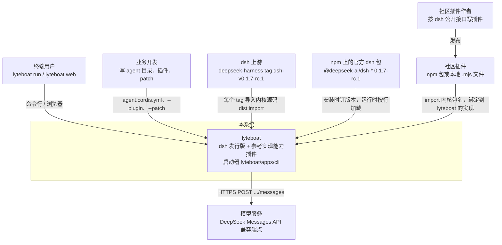

| 外部元素 | 是什么 | 和 lyteboat 的关系 | 依据 |
|---|---|---|---|
| 终端用户 | 跑 `lyteboat run "任务"` 或 `lyteboat web` 的人 | 通过命令行参数和浏览器交互 | `lyteboat/apps/cli/src/args.ts:109-129` |
| 业务开发 | 写 `lyteboat/agents/<id>` 目录、`--plugin` 文件、`--patch` 文件的人 | 业务逻辑只放在 agent 目录里，框架包不带业务词汇 | `CLAUDE.md:79` |
| dsh 上游 | `deepseek-ai/deepseek-harness` 仓库 | lyteboat 每个 tag 导入一次内核源码，三方合并 lyteboat 的改动 | `dsh.upstream.json`，`CLAUDE.md:195-196` |
| npm 官方包 | 除内核外的 `@deepseek-ai/dsh-*` | 原样使用，版本全钉在 `0.1.7-rc.1` | `.pnpmfile.cjs:7-22`，`pnpm-workspace.yaml:64-150` |
| 社区插件 | 按 dsh 接口写的第三方插件 | 不改代码即可跑在 lyteboat 上；要用 lyteboat 扩展时注入 `lyteboatDistro` | `dsh-compat/COMPAT.md:46` |
| 模型服务 | DeepSeek Messages API 兼容端点 | `dsh-llm-deepseek` 适配器 POST 到 `messagesApiRoot(baseURL)/messages`：baseURL 不以 `/v1` 结尾时补上 `/v1`；baseURL 来自 `DEEPSEEK_BASE_URL`，默认值是 `config.ts:115` 的公开端点。本文的运行把它设成脚本化模型的 `http://127.0.0.1:<port>/v1`，请求就落在 `/v1/messages` | `dsh@rc.1:packages/llm/llm-deepseek/src/adapter.ts:113`，`messages-api.ts:11-14`，`config.ts:115-118` |

**为什么这样划边界**：lyteboat 同时对两边负责——对用户，它是一个能跑业务 agent 的 harness；对 dsh 生态，它承诺“协议、接口、行为与跟踪的 release 一致”（`dsh-compat/COMPAT.md`）。所以 C1 里 dsh 上游和社区插件都是一等的外部系统：前者决定 lyteboat 的内核从哪来，后者决定 lyteboat 的内核不能随便改。

### 1.2 C2 容器

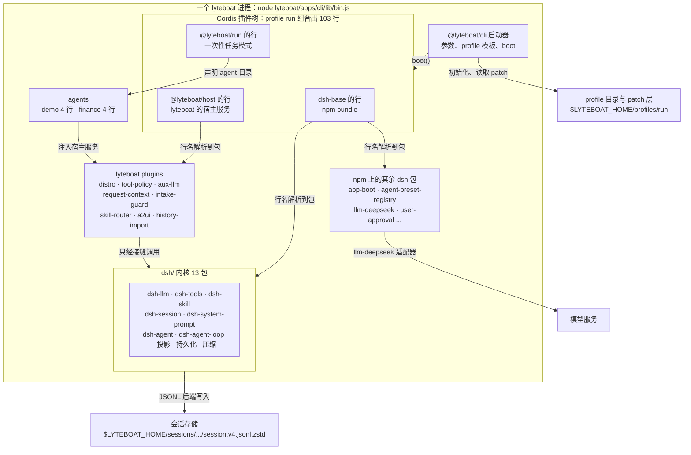

| 容器 | 路径 | 职责 | 运行时产物 |
|---|---|---|---|
| lyteboat 启动器 | `lyteboat/apps/cli`（`bin.ts`、`cli.ts`、`args.ts`、`profile-boot.ts`、`templates.ts`、`plugins.ts`） | 解析启动器自己的参数，按模板初始化 profile，叠 patch 层，调用 dsh 的 `boot()`，处理退出信号 | `lyteboat/apps/cli/lib/bin.js` |
| profile 与 patch 层 | `$LYTEBOAT_HOME/profiles/<name>/`（`package.json` 的 `dsh.profile.bundles`、`cordis.yml`、`cordis.patch.yml`） | 决定这次启动由哪些 bundle 组成，以及用户层覆盖 | 首次运行时由 `initProfile` 写出 |
| bundle：dsh-base | npm `@deepseek-ai/dsh-base` 的 `cordis.patch.yml` | dsh 所有基于 base 的 profile 共享的行：llm、session、tools、skill、agent-loop、持久化、审批、沙箱… | 行 |
| bundle：`@lyteboat/host` | `lyteboat/bundles/host/cordis.patch.yml` | 每个 lyteboat profile 都带的宿主行：8 个 lyteboat 服务（distro、tool-policy、aux-llm、request-context、intake-guard、skill-router、a2ui、history-import，按这个顺序），关闭 session-log 附件，禁掉 `session-telemetry-otel` | 行 |
| bundle：`@lyteboat/run` | `lyteboat/bundles/run/cordis.patch.yml` + `src/` | 一次性任务模式：解析任务和 `--agent`、`--agents`、`--history`、`--session-id`、`--context`，声明 agent，新建或续接会话，循环前准入，驱动一个 turn，打印这一轮（卡片各占一行 `[card <area>]`），退出 | 行 + runner 代码 |
| 内核 | `dsh/`（13 包） | 服务 `llm`、`tools`、`skills`、`sessions`、`systemPrompt`、`sessionProjections`、`sessionPersistence`、`compaction`、`agents`、`agentLoop`；driver 本身 | `dsh/*/*/lib/` |
| 其余 dsh 包 | `node_modules/@deepseek-ai/*` | 启动（app-boot）、preset 注册、模型适配、审批、沙箱、检查点、标题… | npm 发布物 |
| lyteboat plugins | `lyteboat/plugins/*` | 在 dsh 接缝上实现参考实现的能力 | `lib/` |
| agents | `lyteboat/agents/<id>/`（`demo`、`finance`） | 业务 agent 的组合（`agent.cordis.yml`）与业务代码（`src/` → `lib/`） | 行 + skills + 模板 |
| 会话存储 | `$LYTEBOAT_HOME/sessions/<编码后的 cwd>/<session-id>/session.v4.jsonl.zstd` | 追加式事件日志，每次落盘一个 zstd 帧 | 文件 |
| 模型服务 | 外部 | 回答循环请求、旁路请求（路由、准入分类）、标题请求 | HTTP |

**为什么是这几个容器**：`lyteboat/` 下一个目录就是一层（`CLAUDE.md:47`）。apps 只拥有进程，bundles 只做组合、不写行为，plugins 挂在接缝上，agents 放业务。新的运行模式（比如 SDK 入口）应该是一个新的 `lyteboat/bundles/<name>`，而不是在 `@lyteboat/run` 里加分支。这让“换一种跑法”只是换 profile 的 bundle 列表（`templates.ts:17-24` 里 `run` 和 `web` 只差最后一个 bundle）。

### 1.3 C3 组件：服务、事件、投影

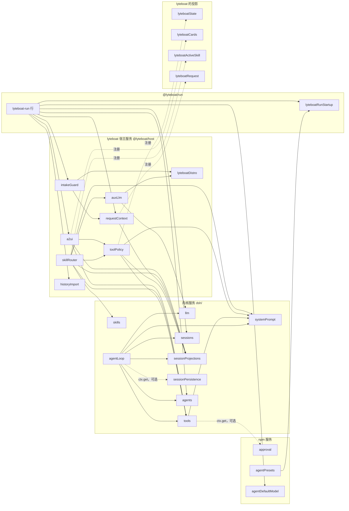

实线箭头 A → B 表示 A 注入 B（`static inject` 或行级 `inject`）；B 缺一个，A 就不激活，停在 PENDING。虚线表示可选访问（`ctx.get`）或注册关系。

| 组件 | 服务键 | 发布者（文件） | 它做什么 |
|---|---|---|---|
| 模型访问 | `llm` | `dsh/llm/llm/src/index.ts:346` | 适配器注册表 + `llm/stream` waterfall；所有模型调用（循环、旁路调用、标题）都从这里走 |
| 工具注册表与运行时 | `tools` | `dsh/core/tools/src/index.ts:848` | 注册、可见性限制（`restrict`）、`tools/pre-execute`/`execute`/`post-execute`/`result` |
| skill 目录 | `skills` | `dsh/skill/skill/src/index.ts:374` | skill provider 聚合，`snapshot` / `get` |
| 会话 | `sessions` | `dsh/core/session/src/index.ts:942` | `Session` 的创建、`append`（带 lyteboat 的 `ignorable` 选项）、`flush`、`deriveMessages` |
| 系统提示 | `systemPrompt` | `dsh/core/system-prompt/src/index.ts:422` | section、context、变量的注册与 `assemble` |
| 投影注册表 | `sessionProjections` | `dsh/session/session-projection/src/index.ts:208` | 每次 append 后跑所有投影的 `apply` |
| 持久化 | `sessionPersistence` | 抽象基类 `dsh/session/session-persistence/src/index.ts:140`，JSONL 实现 `dsh/session/session-persistence-jsonl` | 创建 / 追加 / 读取会话日志 |
| agent 注册表 | `agents` | `dsh/core/agent/src/index.ts:245-256` | `create`，工厂由 agent-loop 注入（`setFactory`） |
| driver 工厂 | `agentLoop` | `dsh/core/agent-loop/src/index.ts:333-375` | 创建并托管 `ReactLoopAgent`（作为 `agents` 的工厂）；turn / step 循环本身在 `ReactLoopAgent.turn` / `step`（`dsh/core/agent-loop/src/agent.ts:314-611`） |
| 审批 | `approval` | npm `dsh-user-approval` | `tools/pre-execute` 返回 `ask` 时的确认通道 |
| preset 注册表 | `agentPresets` | npm `dsh-agent-preset-registry`（`dsh@rc.1:packages/preset/agent-preset-registry/src/index.ts:51-72`） | 把 agent 目录的行挂到 standing scope，再绑定到每个 agent 实例 |
| 默认模型 | `agentDefaultModel` | npm `dsh-agent-default-model` | 给 runner 提供 provider/model 选择 |
| 发行版标记 | `lyteboatDistro` | `lyteboat/plugins/distro/src/index.ts:16-27` | 列出本构建携带的内核扩展（现在三个：`agent-loop-intake`、`agent-loop-pre-assemble`、`session-append-ignorable`） |
| 工具策略 | `toolPolicy` | `lyteboat/plugins/tool-policy/src/index.ts:99-132` | `always` / `auto` 可见性、确认、state delta，`lyteboat:state` context |
| 旁路模型调用 | `auxLlm` | `lyteboat/plugins/aux-llm/src/index.ts:94-158` | `generate({agent, purpose, system, prompt, maxTokens, timeoutMs, …})`：在自己的时限里经 `ctx.llm.stream` 发一次调用，结果（回答或失败原因）作为一条 `ignorable` 的 `lyteboat/aux-llm-call` 记进 agent 的会话 |
| 请求上下文 | `requestContext` | `lyteboat/plugins/request-context/src/index.ts:91-123` | `message(text, request)` 把请求 id、上下文、准入结论放进人类消息的 `source.lyteboatRequest`；`requestOf` / `contextOf` 读回；`lyteboatRequest` 投影 |
| 准入 | `intakeGuard` | `lyteboat/plugins/intake-guard/src/index.ts:59-124` | agent 按 scope 注册准入函数（`register`）；调用方在循环前 `admit`；`lyteboat/intake` 监听把已记录的 `reply` 结论变成回复，没准入过的消息在这里补一次 |
| skill 路由 | `skillRouter` | `lyteboat/plugins/skill-router/src/index.ts:210-245` | `off` / `full` / `dynamic` 三种加载模式，参考实现的 LLM 路由（经 `auxLlm`），把 skill 正文作为 dsh 的 skill-invocation 消息放进这一步，`lyteboatActiveSkill` 投影 |
| 卡片 | `a2ui` | `lyteboat/plugins/a2ui/src/index.ts:197-205` | 参考实现的 A2UI 模板引擎，`render_a2ui` 工具，`lyteboatCards` 投影，`turnParts`（按 `[[card:<area>]]` 标记和发射模式给一轮排版，242-262） |
| 历史导入 | `historyImport` | `lyteboat/plugins/history-import/src/index.ts:49-52` | 把外部对话历史变成会话 seed |

**事件与投影**（完整列表见 [7.2](#72-事件一览表)）：

| 类别 | 名字 | 谁产生 | lyteboat 谁在用 |
|---|---|---|---|
| lyteboat 的内核扩展事件 | `lyteboat/intake`、`lyteboat/pre-assemble`（waterfall） | `ReactLoopAgent.preStep`（`dsh/core/agent-loop/src/agent.ts:279-288`） | intake-guard、demo-hooks；tool-policy、skill-router、finance-agent |
| lyteboat 的内核扩展 API | `Session.append(type, data, { ignorable: true })`（`session-append-ignorable`） | 内核 dsh-session（`dsh/core/session/src/lyteboat/append-ignorable.ts`） | aux-llm |
| dsh 事件 | `agent/pre-step`、`tools/pre-execute` | driver、tools 运行时 | skill-router（追加 skill 正文）；tool-policy（确认） |
| lyteboat 自己的日志记录 | `lyteboat/aux-llm-call`（`ignorable: true`） | aux-llm，每次旁路调用一条（路由、准入分类） | 人（审计）；没有投影读它 |
| lyteboat 借用的 dsh 信封 | `tool/result.meta.lyteboat.{cards,stateDelta}`；skill-invocation 的 `user/message`（`source: {kind: 'skill-invocation', name, form: 'instructions'}`）；人类消息的 `source.lyteboatRequest`；回复的 `assistant/message.source.provider = 'lyteboat'` | 工具的 `presentationMeta`；skill-router；调用方经 `requestContext.message`；driver 的 `replyStep` | `lyteboatCards`、`lyteboatState`；`lyteboatActiveSkill`；`lyteboatRequest`、`lyteboatCards`、intake-guard；人、UI |
| lyteboat 的投影 | `lyteboatState`、`lyteboatCards`、`lyteboatActiveSkill`、`lyteboatRequest` | tool-policy、a2ui、skill-router、request-context 注册 | `lyteboat:state` context、`a2ui.turnParts`、web 客户端、工具读请求上下文 |

**为什么宿主服务 + agent 行两段式**：`toolPolicy`、`skillRouter` 这些服务在根 realm 里只有一份，监听所有 agent 的事件；每个 agent 自己的策略（路由模式、哪些工具归它）由 agent 行在自己的 scope 里声明，服务按 agent 的 scope 链去读（`ScopedLayers`）。所以 demo 的行 `lyteboat-skill-router`（`@lyteboat/skill-router/agent`）只写配置 `{mode: dynamic, historyWindow: 6, timeoutMs: 10000}`（`lyteboat/agents/demo/agent.cordis.yml:13-18`），不发布服务；finance 的准入函数也是 agent 行在自己的 scope 里 `ctx.intakeGuard.register(...)` 进去的（`lyteboat/agents/finance/src/agent.ts:52`）。agent 行禁止往根 realm 发布服务（`CLAUDE.md:78`），dsh 的 preset 挂载会直接拒绝（`dsh@rc.1:packages/preset/agent-preset-registry/src/mount.ts:265-267`）。

### 1.4 C4 代码：关键类型与文件

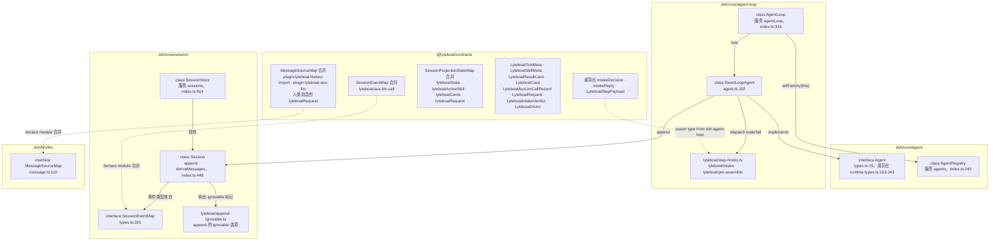

| 类型 / 文件 | 作用 | 要点 |
|---|---|---|
| `Agent`（`dsh/core/agent/src/types.ts:15`，成员由 `runtime-types.ts:163-243` 的 `declare module` 补上） | agent 实例接口 | `session`、`ctx`、`options`、`followup` / `steer` / `inject`、`whenIdle()` |
| `ReactLoopAgent`（`dsh/core/agent-loop/src/agent.ts:102`） | 唯一的 driver 实现 | 构造时 `createScope(loopCtx, this)` 造出 agent scope（`agent.ts:134`）；`preStep`（271-304）、`turn`（314-421）、`step`（461-611）、`replyStep`（438-459） |
| `LyteboatStepPayload` / `LyteboatIntakeDecision`（`dsh/core/agent-loop/src/lyteboat/step-hooks.ts:23-63`） | 两个扩展事件的声明 | `lyteboat/intake` 返回 `{kind:'pass'}` 或 `{kind:'reply', plugin, content}`；`LYTEBOAT_ASSISTANT_PROVIDER = 'lyteboat'`（16） |
| `Session`（`dsh/core/session/src/index.ts:448`） | 一个会话的事件日志 | `append`（724-778）是唯一写入口；`deriveMessages`（849）从带 `surfaceOp` 的事件推导出模型看到的消息 |
| `lyteboatAppendOptions`（`dsh/core/session/src/lyteboat/append-ignorable.ts:28-36`） | 扩展 `session-append-ignorable` 的写路径 | `append` 的第三个参数对非 surface 类型可以是 `{ ignorable: true }`，信封上就写 `ignorable: true`；本构建认识的类型（含 surface 类型）要这个标记会被拒（32-34）。上游文件里只多了 import / export、放宽的签名和两行钩子（`index.ts:24-25,37-38,727-731,754`） |
| `SessionEventMap`（`dsh/core/session/src/types.ts:281`） | 日志事件的类型表 | 可被 `declare module` 合并；持久化只认编译进来的类型（`known-event-types.ts`），不认识的类型只有带 `ignorable: true`（`types.ts:511`）才放行 |
| `@lyteboat/contracts`（`lyteboat/core/contracts/src/index.ts`） | lyteboat 唯一的共享声明处 | 事件（38-43 重导出）、`LyteboatDistro`（62-75）、`LyteboatToolMeta`（91-104）、卡片（115-134）、旁路调用记录（140-156）、准入结论与请求（158-194）、消息来源（204-213）、日志记录 `lyteboat/aux-llm-call`（215-223）、投影键（225-246） |
| `@lyteboat/cordis-compat`（`lyteboat/core/cordis-compat/src/index.ts:14-21`） | `FiberState` 的运行时值 | 发布版 cordis 用 `const enum`，esbuild/vitest 不内联，所以 lyteboat 自己写一份 |

`lyteboat/intake` 的声明本身就是一个很好的“扩展一个 dsh 接缝”的例子（`dsh/core/agent-loop/src/lyteboat/step-hooks.ts:44-63`）：

```ts
declare module '@deepseek-ai/cordis' {
  interface Events {
    'lyteboat/intake'(this: Scoped<Agent>, payload: LyteboatStepPayload, next: () => Promise<LyteboatIntakeDecision>): Promise<LyteboatIntakeDecision>
    'lyteboat/pre-assemble'(this: Scoped<Agent>, payload: LyteboatStepPayload, next: () => Promise<void>): Promise<void>
  }
}
```

**为什么事件声明在内核、类型从 contracts 读**：内核不能 import 任何 `@lyteboat/*`（`CLAUDE.md:67` 由 `scripts/check-layers.ts` 检查），所以声明必须在内核里；lyteboat 的插件之间也不能互相 import 值，只能依赖 `@lyteboat/contracts`，于是 contracts 把内核里的类型重导出一遍（`lyteboat/core/contracts/src/index.ts:30-43`）。`ignorable` 选项同理：写路径在内核（`LyteboatAppendOptions` 从 `@deepseek-ai/dsh-session` 导出），用它的只有 aux-llm 一处（`lyteboat/plugins/aux-llm/src/index.ts:131`）。

---

## 2. 生命周期与依赖注入

### 2.1 Cordis 的六个概念

| 概念 | 是什么 | 在 lyteboat 里的例子 |
|---|---|---|
| **Context** | 服务的容器。根 Context 在 `boot()` 里创建（`dsh@rc.1:packages/boot/app-boot/src/index.ts:977`），每个插件拿到一个继承父级的子 Context | `ctx.extend({ baseUrl })` 把 agent 目录作为 base URL 交给 preset 注册表（`lyteboat/bundles/run/src/index.ts:191`） |
| **plugin** | 一个导出 `name`、`inject`、`Config`、`apply(ctx, config)` 的模块 | `@lyteboat/run/startup`（`lyteboat/bundles/run/src/startup.ts:22-133`）、`demo-hooks`（`lyteboat/agents/demo/src/hooks.ts:10-27`） |
| **Service** | `Service` 子类；构造函数里 `super(ctx, key)` 就把自己发布成 `ctx[key]`（`dsh@rc.1:vendor/cordis/src/service.ts:42-58`） | 所有内核服务和 lyteboat 宿主服务，比如 `ToolPolicyService`（`lyteboat/plugins/tool-policy/src/index.ts:99-106`） |
| **inject** | 声明依赖的服务名；**全部到齐才加载**（`dsh@rc.1:vendor/cordis/src/registry.ts:105-106`）。行级 `inject` 会合并进同一个集合（`dsh@rc.1:vendor/loader/src/index.ts:129-135`） | `AgentLoop.inject = ['agents','sessions','llm','tools','systemPrompt','sessionProjections']`（`dsh/core/agent-loop/src/index.ts:334`）；`@lyteboat/run` 的行级 `inject: [lyteboatRunStartup]`（`lyteboat/bundles/run/cordis.patch.yml:27,33`） |
| **fiber** | 插件实例的生命周期对象，状态见下图 | 启动审计打印的 `pending (waiting for service: X)` 就是 PENDING 状态 |
| **effect / disposer** | `ctx.effect(execute, label)`（`dsh@rc.1:vendor/cordis/src/fiber.ts:415`）登记副作用，卸载时逆序执行 disposer；`ctx.on` 和各注册表的 `register()` 都返回 disposer | `lyteboat-run` 把 agent 声明放进 effect（`lyteboat/bundles/run/src/index.ts:193`），声明随 `lyteboat-run` 这个 fiber 一起消失；`AgentLoop` 用 effect 登记自己为工厂（`dsh/core/agent-loop/src/index.ts:372`） |

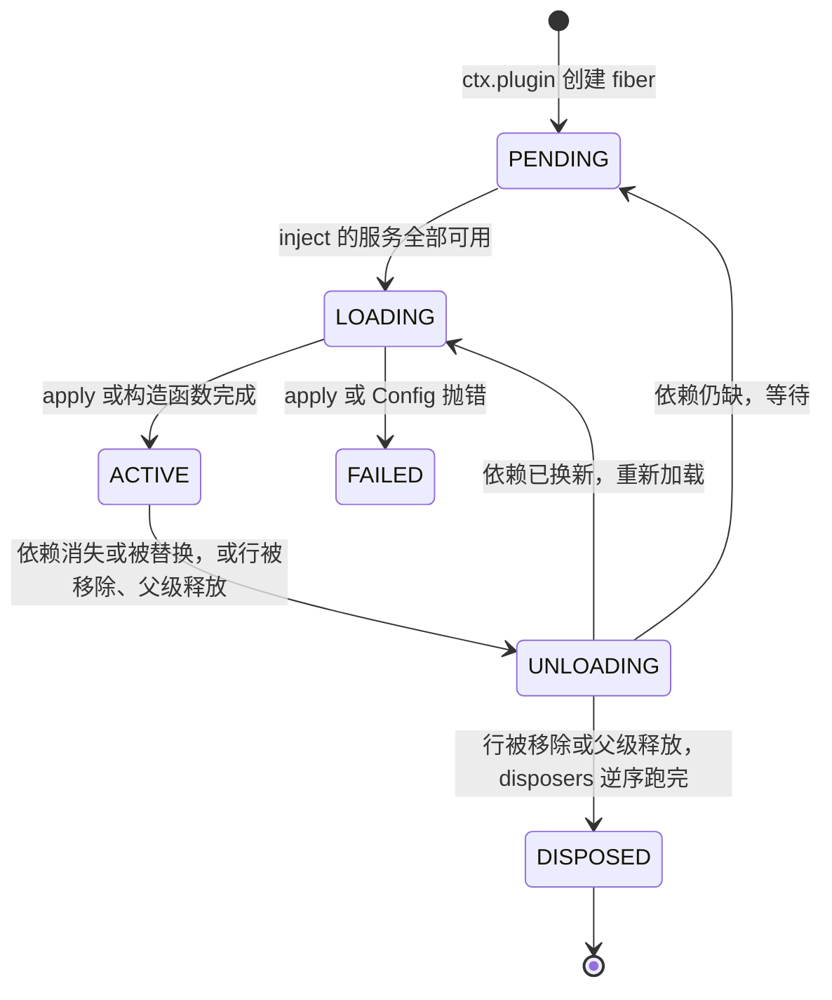

状态值 PENDING 0、LOADING 1、ACTIVE 2、FAILED 3、DISPOSED 4、UNLOADING 5（`dsh@rc.1:vendor/cordis/src/fiber.ts:147-154`，lyteboat 的镜像在 `lyteboat/core/cordis-compat/src/index.ts:14-21`）。fiber 不会从 ACTIVE 直接跳到 DISPOSED：释放时先把 `uid` 置空、epoch 设为 INACTIVE，在 UNLOADING 里跑 `_unload`（逆序执行 disposer），之后 `_getState()` 才报告 DISPOSED（`fiber.ts:264-290`、`574-579`、`666-676`）。一个 fiber 的 epoch 由它所依赖服务的 fiber uid 拼成（`fiber.ts:611-622`），epoch 变了就卸载再加载（`fiber.ts:624-638`）——**依赖是响应式的**。

**这和参考实现最大的不同**：参考实现的 `Bootstrap` 按列表顺序先逐个 `init`、再逐个 `start`，把 `start` 的返回值挂到 `ctx.{name}` 上，停止时逆序 `stop`（参考实现 `core/protocol/bootstrap.py:125-190`）——`ctx.{name}` 这一点和 Cordis 的 `super(ctx, key)` 很像；但 Cordis 里行的顺序没有加载语义，激活顺序完全由“服务什么时候可用”决定（dsh-base 的注释写明了：`dsh@rc.1:packages/bundle/base/cordis.patch.yml:12-13`）。我们用一个 `--plugin` 探针验证过：探针行排在所有层的最后、不注入任何服务，它 apply 的时候 `llm`、`toolPolicy`、`agentPresets` 都还没出现（[3.3](#33-启动时能看到的真实输出)）。

**可选依赖怎么写**：`inject` 永远是必需的。可选访问有两种写法：

- `ctx.get('x')`：拿一次，不响应变化。例：tools 运行时拿审批服务（`dsh/core/tools/src/index.ts:1730`），agent-loop 拿 `sessionPersistence`（`dsh/core/agent-loop/src/index.ts:683`），`lyteboat-run` 拿 `loader`、`agentPresets`、`sessionQuery`、`appExit`（`lyteboat/bundles/run/src/index.ts:257,269,230,332`）。
- 嵌套 `ctx.inject(['x'], cb)`：一个子 fiber，`x` 到了才跑。例：preset 注册表对 `settings` 的用法（`dsh@rc.1:packages/preset/agent-preset-registry/src/index.ts:68`）。

**事件的四种派发方式**。参考实现的 `RunnerCallbacks` 是固定的回调槽位；dsh 里“回调”全是事件，谁都能挂，派发方式决定返回值和顺序的含义（`dsh@rc.1:vendor/cordis/src/events.ts`）：

| 方式 | 代码 | 顺序 | 返回值 | 能否否决 | 例子 |
|---|---|---|---|---|---|
| `emit` | `events.ts:194` | 同步依次调用，不等 Promise | 忽略 | 不能 | `agent/inbox/inserted`、`tools/result`、`session/event` |
| `parallel` | `events.ts:183` | 所有监听并发，等全部结束 | 忽略；有监听抛错就抛 `AggregateError` | 不能 | `session/flush`（`sessions.flush` 自己收集监听后 `Promise.allSettled`，语义相同，`dsh/core/session/src/index.ts:1183-1200`） |
| `serial` | `events.ts:204` | 依次 await | 第一个非空返回值就停下并返回它 | 能（返回非空即截断） | `agent/turn-stopping` |
| `waterfall` | `events.ts:234` | 洋葱式：先注册的在最外层，每层调 `next()` 进入里层 | 最外层的返回值 | 能（不调 `next()`，里层和默认行为都不执行） | `lyteboat/intake`、`lyteboat/pre-assemble`、`agent/pre-step`、`tools/pre-execute` |

**waterfall 监听的顺序就是注册顺序**（`events.ts:254-260`：默认 `push`，先注册的在最外层；监听时传 `prepend: true` 会 `unshift` 到最外层）。skill-router 注入了 `toolPolicy`，所以一定比 tool-policy 晚激活、晚注册监听，于是在 `lyteboat/pre-assemble` 里 tool-policy 在外层、skill-router 在里层。tool-policy 的代码注释写的“在 `next()` 之后对齐”（`lyteboat/plugins/tool-policy/src/index.ts:117-123`）依赖的就是这个顺序：里层（skill-router、agent 行、注入了 `toolPolicy` 的 `--plugin` 行，比如 `tools.mjs` 的 `inject = ['toolPolicy']`，`lyteboat/bundles/run/tests/fixtures/plugins/tools.mjs:9`）都激活完工具之后，它最后算一次限制。不注入任何服务的 `--plugin` 行反而比 tool-policy 先 apply、先注册，处在最外层；但 `activate()` 和 `clear()` 自己会立即 `reconcile`（`lyteboat/plugins/tool-policy/src/index.ts:187-207`），所以可见性结果不变。`lyteboat/intake` 同理：intake-guard 是宿主行，比任何 agent 行都早注册，处在 demo-hooks 的外层；它在 `next()` 之后才看结论（`lyteboat/plugins/intake-guard/src/index.ts:67-75`），所以 agent 自己的拒识门先决定、它给的 reply 原样保留，准入只在本来会 pass 的第 1 个 step 上跑。

**想在整棵树起来之后跑一次代码怎么办**。参考实现的 `Lifecycle.start` 保证在所有 `init` 之后运行；Cordis 没有这个阶段，有两种替代：

- 注入启动器发布的 `appReady`，用 `appReady.onReady(listener)`：lyteboat 的启动器在 `boot()` 返回、根 fiber 是 ACTIVE、`loader` 还在时才 `commit()`（`lyteboat/apps/cli/src/profile-boot.ts:58-79`、`246-251`）。
- 像 `lyteboat-run` 那样 `await ctx.get('loader')?.await()`（`lyteboat/bundles/run/src/index.ts:257`）：等 Loader 把当前能激活的行都处理完。`lyteboat-run` 的 `apply` 不等待这个 Promise（`index.ts:337`），所以不会拖住 `boot()`。

### 2.2 根 realm、standing scope 与 agent scope

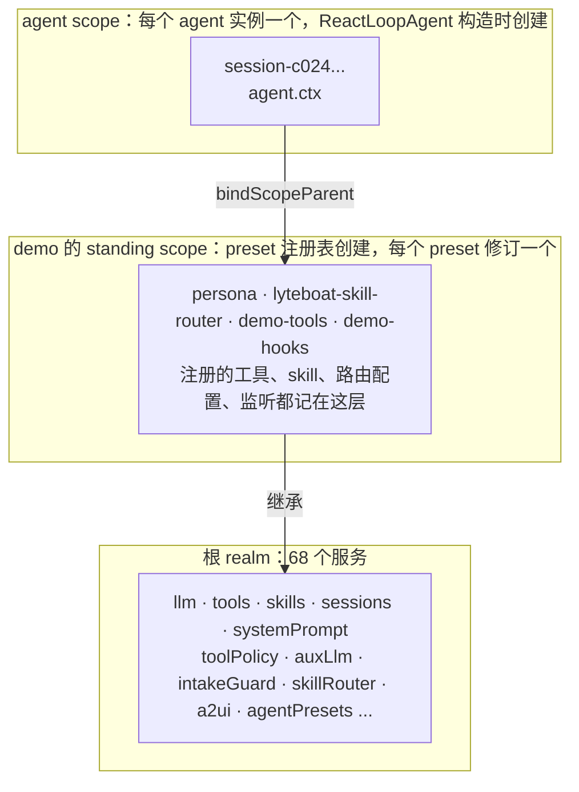

| 层 | 谁创建 | 生命周期 | 例子 |
|---|---|---|---|
| 根 realm | `boot()`；没有 `isolate` 的服务都发布在这里 | 进程 | `run` 组合下 68 个服务全在根 realm |
| standing scope | preset 注册表 `activate` 调 `createScope(owner, key)`（`dsh@rc.1:packages/preset/agent-preset-registry/src/index.ts:108-124`） | 一个 preset 修订（代码里叫 generation），声明撤销并且没有 agent 再绑定它时才释放（见下文） | demo 的 4 行挂在这里，`auditRows` 看到 4 行都是 fiberState 2 |
| agent scope | `ReactLoopAgent` 构造时 `createScope(loopCtx, this)`（`dsh/core/agent-loop/src/agent.ts:134`） | 一个 agent 实例 | setup 里 `presets.mount` 调 `bindScopeParent(agentKey, standingKey)`（registry `index.ts:248-257`），链变成 agent → standing → 全局 |

**为什么需要 scope**：同一个进程里可能有多个 agent（`lyteboat web` 就是）。`ScopedLayers` 类的注册表（tools、skills、toolPolicy、skillRouter、intakeGuard）读的是“全局层 + 这条 scope 链”，scoped 事件的投递规则在 `scopeTarget` 的过滤器里（`dsh@rc.1:packages/core/scope/src/index.ts:158-185`）：无 scope 标签的监听（比如根 realm 里的 `toolPolicy`）收到所有事件；带标签的监听只有在它的 scope 是派发 key 或其祖先时才收到——事件沿链往上流，不往下流。结果是：demo 的 `lyteboat/intake` 监听只听得到 demo 的 agent；demo 注册的 `asset_overview` 只在 demo 的 agent 里可见；另一个 agent 完全不受影响。每个 agent 的运行期状态用 `WeakMap<Agent, …>` 存（`lyteboat/plugins/tool-policy/src/index.ts:103`，`lyteboat/plugins/skill-router/src/index.ts:214`），agent 没了状态就没了；要跨进程留下来的事实（当前 skill、请求上下文）则由投影从日志折叠出来，见 [5.7](#57-为什么路由过的会话也能重开)。

**standing scope 什么时候释放**。preset 注册表给每次激活记一个 `Generation {scope, key, mount, users, retired}`（`dsh@rc.1:packages/preset/agent-preset-registry/src/index.ts:30-36`）：

- `users`：绑定在它上面的 agent 数。`mount` 时 `retain` 先临时 +1，`bind` / `join` 为这个 agent 再 +1，`mount` 结束把临时的 −1；agent 的 scope 释放时，`join` 登记的 effect 再 −1（`index.ts:215-273`）。
- `retired`：声明被撤销时置为 true（`register` 返回的 disposer，`index.ts:93-101`）。在 `lyteboat run` 里，这个 disposer 挂在 `lyteboat-run` 的 `ctx.effect` 上（`lyteboat/bundles/run/src/index.ts:193`）。
- 只有 `retired && users === 0` 时 `collect` 才释放 standing scope（`index.ts:150-154`）。

所以 standing scope 可能比声明活得久（声明撤了、还有 agent 绑着），也可能比某个 agent 活得久（agent 没了、声明还在）。同一个 id 不能重复注册（`index.ts:89`）；声明被替换（先撤销再注册）会生成新的 generation，已经绑在旧 generation 上的 agent 不会自动迁移，只有 agent 自己再次 `mount` 时 `bind` 才把它 `rebind` 到新的（`index.ts:233-246`），旧 standing scope 要等最后一个 agent 解绑才释放。

**realm、isolate、group**。上面说的“根 realm”是服务键的命名空间：一个服务 `super(ctx, 'x')` 发布后，同一 realm 里的 `ctx.x` 都指向它。行上写 `isolate: {x: true}` 时，Loader 给这一行开一个本行私有的 realm（`LocalRealm`，`dsh@rc.1:vendor/loader/src/config/isolate.ts:49-57`），子行继承这张映射，所以 `x` 只在这一行及其子行里可见；写成 `isolate: {x: '<标签>'}` 则进入按标签共享的 realm（`GlobalRealm`，`isolate.ts:60-68`）。要让一个服务的提供者和它的消费者共享同一个私有 realm，就把它们包进一个 `cordis:group` 行（app-boot 把 `group` 注册为内置，`dsh@rc.1:packages/boot/app-boot/src/index.ts:556-561`）。例子在 web 的 standard preset 里：

```yaml
- id: planning
  name: cordis:group
  group: true
  isolate:
    planMode: true
  config:
    - id: plan-mode
      name: '@deepseek-ai/dsh-plan-mode'
```

（`dsh@rc.1:packages/bundle/web-app/presets/standard.patch.yml:42-49`）。`run` 组合里没有 `isolate` 行，所以 68 个服务全在根 realm；`web` 组合里有，服务数要分开数（见 [3.3](#33-启动时能看到的真实输出)）。

### 2.3 dsh 与 lyteboat 的 DI 怎么交互

原则：**服务由谁发布、由谁注入，全写在代码的 `super(ctx, key)` 和 `inject` 里，跨包不 import 值**。lyteboat 的服务依赖 dsh 的服务；dsh 的服务不知道 lyteboat 的存在；agent 行同时注入两边。

| 服务 | 发布者 | 在 run 组合里的主要注入者（节选；完整列表见 [7.1](#71-服务一览表)） |
|---|---|---|
| `llm` | 内核 `llm` 行 | agent-loop、compaction-basic、llm-deepseek、session-title-llm、session-checkpoint-policy、**auxLlm**（skillRouter 不再直接注入 `llm`，经 auxLlm 调模型） |
| `tools` | 内核 `tools` 行 | agent-loop、各 tool-* 行、spill-policy、plan-mode、**toolPolicy**、**skillRouter**、**a2ui**、**demo-tools**、**finance-agent** |
| `skills` | 内核 `skill` 行 | skill-filesystem、tool-skill、**skillRouter**、**demo-tools**、**finance-agent** |
| `sessionProjections` | 内核 `session-projection` 行 | agent-loop、agent-preset-registry、token-meter、permission、session-projection-cache、**toolPolicy**、**requestContext**、**skillRouter**、**a2ui**、**demo-tools**、**finance-agent** |
| `systemPrompt` | 内核 `system-prompt` 行 | tools、agent-loop、persona、plan-mode、**toolPolicy**、**skillRouter** |
| `agents`、`sessions` | 内核 `agent`、`session` 行 | agent-loop；**lyteboat-run** |
| `lyteboatDistro` | `@lyteboat/host` 的 `lyteboat-distro` 行 | **auxLlm**（用 `session-append-ignorable`）、**intakeGuard**（用 `agent-loop-intake`）；第三方插件 |
| `toolPolicy` | `lyteboat-tool-policy` 行 | skillRouter、a2ui、`@lyteboat/tool-policy/agent` 行（finance 的 `finance-tool-surface`）、**demo-tools**、**finance-agent** |
| `auxLlm` | `lyteboat-aux-llm` 行 | skillRouter、**finance-agent**（准入分类） |
| `requestContext` | `lyteboat-request-context` 行 | intakeGuard、**lyteboat-run**、**finance-agent** |
| `intakeGuard` | `lyteboat-intake-guard` 行 | **lyteboat-run**、**finance-agent** |
| `a2ui`、`historyImport` | `lyteboat-a2ui`、`lyteboat-history-import` 行 | **lyteboat-run**；a2ui 还有 `@lyteboat/a2ui/agent` 行、demo-tools、finance-agent |
| `skillRouter` | `lyteboat-skill-router` 行 | `@lyteboat/skill-router/agent` 行（demo 和 finance 的第 2 行） |
| `lyteboatRunStartup` | `@lyteboat/run/startup` 行 | `agent-preset-registry` 行和 `lyteboat-run` 行（行级 `inject`） |

**例子 1：一个 agent 行同时用内核服务和 lyteboat 服务**。`lyteboat/agents/demo/src/tools.ts:22`：

```ts
export const inject = ['tools', 'toolPolicy', 'a2ui', 'skills', 'sessionProjections']
```

`tools`、`skills`、`sessionProjections` 来自内核，`toolPolicy`、`a2ui` 来自 `@lyteboat/host`。它在 apply 里挂一个 scoped 的 `dsh-skill-filesystem` 子插件（38 行），再通过 `ctx.toolPolicy.register(...)` 注册两个 `visibility: 'auto'` 的工具（40-110 行）。这个行在 demo 的 standing scope 里，所以注册的工具和 skill 都落在 demo 那一层。finance 的 agent 行注入得更多：`['tools', 'toolPolicy', 'a2ui', 'skills', 'sessionProjections', 'requestContext', 'intakeGuard', 'auxLlm']`（`lyteboat/agents/finance/src/agent.ts:31`），多出来的三个就是 F2 的宿主服务：它从请求上下文里读客户，往 `intakeGuard` 注册准入函数，准入函数再经 `auxLlm` 做分类。

**例子 2：行级 inject + 延迟求值的配置**。`lyteboat/bundles/run/cordis.patch.yml:25-29`：

```yaml
- id: agent-preset-registry
  name: '@deepseek-ai/dsh-agent-preset-registry'
  inject: [lyteboatRunStartup]
  config:
    default: !!js ctx.lyteboatRunStartup.preset ?? 'none'
```

`!!js` 表达式在这一行自己的 Context 里求值（`dsh@rc.1:vendor/loader/src/index.ts:104-113`），而行级 `inject` 保证求值时 `ctx.lyteboatRunStartup` 已经存在。**为什么这样写**：preset 注册表是上游 npm 包，lyteboat 不改它的代码；只要在 patch 里给它加一个依赖，就能让它的默认 preset 取决于 lyteboat 解析的命令行。

**例子 3：服务缺了会怎样**。用 `--patch` 禁掉 `lyteboat-history-import`（用 [7.5](#75-复现本文的运行) 的 `repro.mjs` 跑，patch 文件放在仓库外、传绝对路径）：

```console
$ cat /tmp/no-lyteboat-history-import.yml
- id: lyteboat-history-import
  disabled: true
$ node /tmp/repro.mjs run --patch /tmp/no-lyteboat-history-import.yml hello
exit=SIGKILL  20036 ms  requests=[]
stdout: 
stderr: lyteboat: warning: 1 entry did not activate
lyteboat-run (@lyteboat/run): pending (waiting for service: historyImport)
```

`lyteboat-run` 静态注入了 `historyImport`（`lyteboat/bundles/run/src/index.ts:47`，同一行还有 `a2ui`、`requestContext`、`intakeGuard`），于是停在 PENDING。启动审计只把 `agent-loop`、`webserver`、`headless-runner` 等 7 个 id 当作“必须激活”（`dsh@rc.1:packages/boot/app-boot/src/index.ts:744-752`），`lyteboat-run` 不在里面，所以只打一条 warning，进程随后一直挂着，直到 `repro.mjs` 20 秒后用 SIGKILL 杀掉它。见 [7.4](#74-已知的坑)。

### 2.4 lyteboat 怎么覆盖 dsh

| # | 机制 | 覆盖了什么 | 在哪 | 具体例子 |
|---|---|---|---|---|
| 1 | **同名接管**（pnpm `overrides`） | 内核 13 个包的实现 | `pnpm-workspace.yaml:16-29`；`.pnpmfile.cjs:7-22` 对内核名不钉版本 | `node_modules/@deepseek-ai/dsh-llm -> ../../dsh/llm/llm`；npm 包 `dsh-llm-deepseek` 在 `.pnpm` 里依赖的 `dsh-llm` 用 `readlink -f` 看也落到仓库的 `dsh/llm/llm`；store 里没有任何 npm 版的 `dsh-llm`（`3d29a07` 提交说明） |
| 2 | **patch 层增删改行** | 组合：加行、禁行、换配置 | `lyteboat/bundles/host/cordis.patch.yml`、`lyteboat/bundles/run/cordis.patch.yml` | `@lyteboat/host` 把 `session-log-deepseek` 设为 `enabled: false`（`host/cordis.patch.yml:10-12`，提交 `f2e4e00`：0.1.7 起它默认会把会话日志附到每个官方请求上）。关掉的只是会话日志：dsh-base 的 `plugin-package-inventory-deepseek` 行（`dsh@rc.1:packages/bundle/base/cordis.patch.yml:77-78`）仍然给每个官方请求附上 `dsh_plugin_packages`（已加载的插件包名和版本，含 `@lyteboat/run`、`@lyteboat/agent-demo`、`@lyteboat/skill-router`、`@lyteboat/aux-llm` 等），所以 host bundle 注释里的“lyteboat sends the provider the model request only”（`host/cordis.patch.yml:7-9`）要打这个折扣，见 [5.4](#54-日志怎么映射回模型看到的内容)。F1 起 `@lyteboat/host` 还禁掉 dsh-base 的 `session-telemetry-otel` 行（`host/cordis.patch.yml:14-19`，提交 `ab2c5ae`）：用户一给反馈它就会把会话日志前缀导出到上游收集端，而 lyteboat 的会话是业务对话，不管设没设 `DSH_TELEMETRY_DISABLED` 都不外发。`@lyteboat/run` 禁掉 `hmr`（`run/cordis.patch.yml:42-44`）、整体替换 `system-prompt` 和 `tools` 两行的配置（11-19）、插入 3 行代替 dsh-headless（21-40） |
| 3 | **内核扩展** | driver 的行为：在组装提示词之前多派发两个 waterfall；`Session.append` 能给一条记录打上 `ignorable` 标记 | 事件：`dsh/core/agent-loop/src/agent.ts:276-289`，声明在 `lyteboat/step-hooks.ts:44-63`，登记在 `dsh-compat/contract/extensions.yml:16-50`；追加选项：`dsh/core/session/src/index.ts:727-731,754` 加 `lyteboat/append-ignorable.ts`，登记在 `extensions.yml:51-68` | 提交 `92698ff`（D1-4，`lyteboat/intake`）、`4870926`（D1-5，`lyteboat/pre-assemble`）和 `c5a553f`（F2-1，`session-append-ignorable`），都带 `Dist-Change: extend` 和 `Dist-Extension` trailer；每个扩展写明退出条件：前两个在上游出现能在组装前改写 step 的事件时移除，第三个在上游给 `Session.append`（或别的写路径）一个设 `SessionEvent.ignorable` 的办法时移除 |
| 4 | **`lyteboatDistro` 标记服务** | 让第三方插件只在 lyteboat 上加载 | `lyteboat/plugins/distro/src/index.ts:16-27`；扩展列表由 `scripts/dist/gen-distro-manifest.ts` 生成到 `distro-manifest.ts` | `lyteboat/bundles/run/tests/fixtures/plugins/distro-aware.mjs` 声明 `inject: ['lyteboatDistro']`，实测输出 `lyteboat on dsh 0.1.7-rc.1: agent-loop-intake, agent-loop-pre-assemble, session-append-ignorable`；在官方 dsh 上它会停在 PENDING，不会去调一个不存在的扩展。仓库里 `@lyteboat/aux-llm`、`@lyteboat/intake-guard` 也注入它（`lyteboat/plugins/aux-llm/src/index.ts:96`、`lyteboat/plugins/intake-guard/src/index.ts:61`） |
| 5 | **`--plugin` 行** | 往树里临时插一个本地 ESM 插件 | `lyteboat/apps/cli/src/plugins.ts:52-59`；叠在所有文件 overlay 之上（`profile-boot.ts:168-170`） | `lyteboat run --plugin lyteboat/bundles/run/tests/fixtures/plugins/tools.mjs "帮我调仓"`：注册 `lookup_assets`（always）和 `rebalance`（auto + 需确认），并在 `lyteboat/pre-assemble` 里按用户文字激活 `rebalance`。实测日志（[7.5](#75-复现本文的运行) 的 run g）：`tool/call rebalance {"target":"股债均衡"}` → `approval/asked {reason: tool "rebalance" requires confirmation}` → `approval/decided {outcome: unavailable}` → `tool/result isError=true`——`lyteboat run` 没有组合审批应答者，默认结果 `unavailable` 按拒绝处理 |
| 6 | **用户 patch 层** | 某台机器、某次启动的配置 | profile 的 `cordis.patch.yml`、`$LYTEBOAT_HOME/cordis.patch.yml`、`--patch` 文件，按此顺序叠（`dsh@rc.1:packages/boot/app-boot/src/profile-context.ts:63-74`） | 上面 [2.3](#23-dsh-与-lyteboat-的-di-怎么交互) 的 `no-lyteboat-history-import.yml` |
| 7 | **自己的启动器** | dsh 的 CLI | `lyteboat/apps/cli`（改编自上游 `apps/cli/src/profile-boot.ts`，差异列在文件头 `profile-boot.ts:16-21`） | lyteboat 自己的模板表（`templates.ts:17-24`），bundle 列表漂移就报错（`profile-boot.ts:122-127`），`LYTEBOAT_HOME` 强制写进 `DSH_HOME`（`home.ts:47-50`），用户的 `~/.dsh` 永远不被碰 |
| 8 | **peer 写法约定** | 让 dsh 的启动准入放行 lyteboat 的包 | `CLAUDE.md:89`，`scripts/upstream-pins.spec.ts` | `@lyteboat/run` 的内核 peer 写 `workspace:*`，非内核 dsh peer 写精确版本 `"@deepseek-ai/dsh-agent-default-model": "0.1.7-rc.1"`（`lyteboat/bundles/run/package.json:46-53`）。原因见提交 `edbe7bb`：准入读磁盘上的 manifest，pnpm 不会替换 `catalog:dsh`，于是在 rc.1 上启动器跳过了 `@lyteboat/run`，还禁掉了 skill-router、a2ui、history-import 三行 |

看组合结果最直接的办法是 `config dump`，它会标出每一行来自哪个 bundle、被谁 patch 过：

```console
$ node lyteboat/apps/cli/lib/bin.js config dump --profile run
...
# == @deepseek-ai/dsh-base, patched by @lyteboat/run
- id: hmr
  name: '@deepseek-ai/dsh-hmr'
  disabled: true
  config:
    root: []
...
# == @deepseek-ai/dsh-base, patched by @lyteboat/host
- id: session-log-deepseek
  name: '@deepseek-ai/dsh-session-log-deepseek'
  config:
    enabled: false
...
# == @deepseek-ai/dsh-base, patched by @lyteboat/host
- id: session-telemetry-otel
  name: '@deepseek-ai/dsh-session-telemetry-otel'
  config:
    ...
  disabled: true
...
# == @lyteboat/host
- id: lyteboat-distro
  name: '@lyteboat/distro'
- id: lyteboat-tool-policy
  name: '@lyteboat/tool-policy'
- id: lyteboat-aux-llm
  name: '@lyteboat/aux-llm'
- id: lyteboat-request-context
  name: '@lyteboat/request-context'
- id: lyteboat-intake-guard
  name: '@lyteboat/intake-guard'
- id: lyteboat-skill-router
  name: '@lyteboat/skill-router'
- id: lyteboat-a2ui
  name: '@lyteboat/a2ui'
- id: lyteboat-history-import
  name: '@lyteboat/history-import'
# == @lyteboat/run
- id: lyteboat-run-startup
  name: '@lyteboat/run/startup'
...
```

（`LYTEBOAT_HOME` 指向一个空目录时的输出，共 103 行；`...` 是省略。）

**为什么覆盖手段按这个顺序选**：`CLAUDE.md:73` 规定“先在内核外面做”——能用 patch 配置就不写插件，能写插件就不改内核；非改内核不可时，改动要分类、要登记、要写退出条件，因为每一行内核改动都会让下一次上游同步更贵。上表 1–8 里只有第 3 项动了内核源码，而 F2 需要的三个新能力里也只有“记录能被标成可忽略”进了内核：旁路调用、请求上下文、准入都是插件。

---

## 3. 系统启动时序

以 `node lyteboat/apps/cli/lib/bin.js run --agents ./lyteboat/agents --agent demo "看看资产"` 为例，从进程启动到 agent 就绪、任务交进 inbox。

### 3.1 时序图

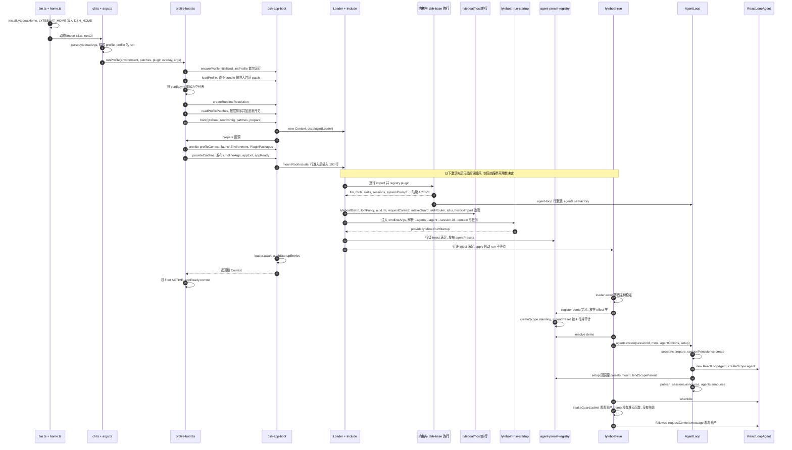

### 3.2 逐步说明

**A. 进程入口**

1. `lyteboat/apps/cli/src/bin.ts:8-12`：`home.ts` 是唯一的静态 import，先执行 `installLyteboatHome()`，再动态 import `cli.ts`。**为什么**：dsh 的 home 路径在每次调用时读 `DSH_HOME`，但必须保证任何 dsh 模块求值之前它已经是 lyteboat 的值。
2. `lyteboat/apps/cli/src/home.ts:34-50`：解析 `LYTEBOAT_HOME`（默认 `~/.lyteboat`，空白视为未设置，`~` 展开），**无条件**写入 `DSH_HOME`。实测：把 `DSH_HOME` 指到一个空目录再经 `repro.mjs` 跑 `run 你好`（脚本另设了 `LYTEBOAT_HOME`），那个目录里什么都没生成，`profiles/`、`sessions/`、`storages/` 都出现在 `LYTEBOAT_HOME` 下。
3. `lyteboat/apps/cli/src/cli.ts:37-49`：`parseLyteboatArgs` 返回 `mode: 'profile'`，调 `runProfile`，同时传入 `loadLayeredEnv('lyteboat')`（`dsh@rc.1:packages/boot/app-boot/src/index.ts:232`，读 `<cwd>/.env` 和 `$LYTEBOAT_HOME/.env`，只填未设置的变量，返回冻结快照）和 `pluginOverlay(...)`。
4. `lyteboat/apps/cli/src/args.ts:109-118`：`run` 是透传命令（`passThrough`，84-90）。启动器只认 `--profile`（默认 `run`）、`--patch`、`--plugin`，其余 token 原样交给插件树。所以这里的 `args` 是 `--agents ./lyteboat/agents --agent demo 看看资产`。启动器参数必须写在前面（`args.ts:4-10`）。

**B. 组合 profile**（`lyteboat/apps/cli/src/profile-boot.ts`）

5. `runProfile`（194-253）先从环境装代理（196-199），再 `composeProfile`（161-172）。
6. `prepareProfile('run')`（138-143）→ `ensureProfileInitialized`（114-128）：`$LYTEBOAT_HOME/profiles/run/package.json` 不存在就按模板 `['@deepseek-ai/dsh-base','@lyteboat/host','@lyteboat/run']`（`templates.ts:17-20`）调 `initProfile`（`dsh@rc.1:packages/boot/app-boot/src/profile.ts:219`）；存在但 bundle 列表和模板不一致就报错退出。**为什么要报错**：老版本 lyteboat 生成的 profile 可能少一个 bundle，悄悄照旧启动会缺服务。
7. `loadProfile`（`profile.ts:690`）→ `loadProfileDirectory`（642）对每个 bundle 做**bundle 准入**：`evaluatePluginCompatibility`（`dsh@rc.1:packages/boot/app-boot/src/plugin-compatibility.ts:61-88`）把 bundle 的 `@deepseek-ai/dsh*` peer 和 dsh-app-boot 自己的版本比，`workspace:*` 视为当前版本（76 行），不匹配就跳过这个 bundle 并在 stderr 说明。
8. 根 `$LYTEBOAT_HOME/profiles/run/cordis.yml` 每次都重写成 `[]`（`profile-boot.ts:94-98,141`）。**为什么**：整棵树只由 patch 层组成；Loader 的回写可能把组合后的行烤进根文件，下次启动就会重复。
9. `createRuntimeResolution`（`profile.ts:406`）从 `@lyteboat/cli` 的依赖和 peer 广度优先收集包，给后面的裸包名解析用。这就是 `lyteboat/apps/cli/package.json` 要列出所有 dsh 包的原因，也是 `CLAUDE.md:196` 要求“启动器的依赖闭包必须是 dsh 自己 `apps/cli` 的超集”的原因。
10. overlay 顺序是 `[...--patch 文件, ...--plugin 行]`（`profile-boot.ts:168-171`），`--plugin` 在最上面，用户文件盖不掉它。

**C. `boot()`**

11. 关闭流程：`createProcessShutdown`（最多 5 秒），SIGTERM 退出 0，SIGINT 退出 130（`profile-boot.ts:204-215`），`installFailLoud`（216-218）。
12. 组装 `profileContext`（223-233），`readProfilePatches`（`dsh@rc.1:packages/boot/app-boot/src/profile-context.ts:63-74`）按顺序排好层：bundle 层（dsh-base → `@lyteboat/host` → `@lyteboat/run`）→ profile 的 `cordis.patch.yml` → `$LYTEBOAT_HOME/cordis.patch.yml` → overlay；`DSH_TELEMETRY_DISABLED` 非空时再追加 `{id: 'session-telemetry-otel', disabled: true}`（52-55）。
13. `boot('lyteboat', rootConfig, patches, prepare)`（`dsh@rc.1:packages/boot/app-boot/src/index.ts:970-1036`）：`new Context()`（977），`baseUrl` 设为 profile 目录（992），发布 `dshHomePath`（993），`ctx.plugin(Loader)`（999）。Loader 发布 `loader` 服务，并装上全局钩子：`internal/config`（每行在自己的 Context 里求 `!!js`）和 `internal/plugin`（合并行级 `inject`）（`dsh@rc.1:vendor/loader/src/index.ts:102-135`）。
14. `prepare(hostCtx)` 是 lyteboat 的闭包（`profile-boot.ts:234-245`）：provide `profileContext` 和 `launchEnvironment`；`plugin(PluginPackages, {resolution})` 装一个内存解析器，让 profile 里的裸行名按安装的依赖表解析；`provideCmdline` 发布 `cmdlineArgs`、`appExit`、`appReady`（`dsh@rc.1:packages/boot/cmdline/src/index.ts:84`）。
15. `mountRootInclude`（`index.ts:536`，调用在 1002）：先跑 `prepareProfilePatches`（`dsh@rc.1:packages/boot/app-boot/src/compatibility-preflight.ts:180-187`）——**行准入**，只在 `profileContext` 存在时生效：把所有层应用到 `[]`，按每行包的 manifest 检查 dsh peer，不匹配的行改成 `disabled: true` 并打印原因，结果合成一个 `{insert: rows}`。然后 Include 读 `[]`、应用 patch、逐行 import 并 `registry.plugin`。
16. `await loader.await()`（1008），然后 `auditStartupEntries`（1010，实现在 923）：必须激活的 id 只有 `agent-loop`、`webserver`、`modules`、`connection`、`headless-runner`、`acp`、`sdk-jsonrpc-server`（744-752），其它没激活的只 warning。
17. 回到 `runProfile`：根 fiber 是 ACTIVE、`loader` 还在，就 `appReady.commit()`（`profile-boot.ts:246-251`）。`FIBER_STATE` 来自 `@lyteboat/cordis-compat`。

**D. 行的激活**（顺序由服务可用性决定）

18. 内核行（都来自 dsh-base）：`llm`（`dsh@rc.1:packages/bundle/base/cordis.patch.yml:34-35`）、`session`（40-41）、`session-persistence-jsonl`（130-133，根目录 `dshHomePath('sessions')`）、`session-projection`（158-159）、`skill`（293-294）、`compaction-basic`（340-341）、`tools`（498-499）、`system-prompt`（503-506）、`agent-loop`（510-513，`agents: []`，所以它自己不建 agent）。`AgentLoop` 构造时注册 turnBoundary 和 inbox 两个投影、`ctx.agents.setFactory(this)`、加 `provider` / `model` / `cwd` 三个提示词变量（`dsh/core/agent-loop/src/index.ts:357-375`）。
19. `@lyteboat/host` 先改 dsh-base 的两行：`session-log-deepseek` 设 `enabled: false`，`session-telemetry-otel` 设 `disabled: true`（`lyteboat/bundles/host/cordis.patch.yml:10-19`）。然后插入 8 行（21-48，下面按书写顺序列出，真实激活顺序看依赖）：`lyteboatDistro` 和 `historyImport` 不注入任何服务，最先可用；`toolPolicy` 注入 tools、sessionProjections、systemPrompt，注册 `lyteboatState` 投影和 `lyteboat:state` context，挂 `lyteboat/pre-assemble`（`next()` 之后）和 `tools/pre-execute`；`auxLlm` 注入 llm、lyteboatDistro（`aux-llm/src/index.ts:96`），不挂任何事件；`requestContext` 注入 sessionProjections，注册 `lyteboatRequest` 投影（`request-context/src/index.ts:92-97`）；`intakeGuard` 注入 requestContext、lyteboatDistro，挂 `lyteboat/intake`（`next()` 之后，`intake-guard/src/index.ts:61-76`）；`skillRouter` 注入 skills、auxLlm、sessionProjections、systemPrompt、tools、toolPolicy（`skill-router/src/index.ts:211`），所以一定在 `toolPolicy` 和 `auxLlm` 之后，注册 `lyteboatActiveSkill` 投影和 full 模式用的 `lyteboat:skills` section，挂 `lyteboat/pre-assemble`（`next()` 之前）和 `agent/pre-step`（`next()` 之后），默认 `mode: off`（`skill-router/src/index.ts:81`）；`a2ui` 注入 tools、toolPolicy、sessionProjections，注册 `lyteboatCards` 投影。
20. `@lyteboat/run` 的行（`lyteboat/bundles/run/cordis.patch.yml:21-40`）：
    - `lyteboat-run-startup` 注入 `cmdlineArgs`（`startup.ts:25`），用 commander 解析内层参数（`parseCmdline`，`dsh@rc.1:packages/boot/cmdline/src/index.ts:165`），`findAgentDirectory` 找第一个包含 `demo/agent.cordis.yml` 的 `--agents` 根（`agent-directory.ts:53-59`），`--context` 读成一个 JSON 对象（内联或文件，`readContext`，`startup.ts:59-72`），provide `lyteboatRunStartup = {task, preset: 'demo', agentDir, history, sessionId, context}`（`startup.ts:128-130`）。用法错误时调 `appExit(code)`，什么也不发布。
    - `agent-preset-registry` 的行级 inject 满足后发布 `agentPresets`。
    - `lyteboat-run` 静态注入 `agentDefaultModel`、`agents`、`sessions`、`historyImport`、`a2ui`、`requestContext`、`intakeGuard`（`lyteboat/bundles/run/src/index.ts:47`）；它的 `apply`（331-338）要求 `appExit` 存在，然后 `void run(...)`——**不等待**，所以 `boot()` 可以先返回。

**E. 创建 agent 并交出任务**（`lyteboat/bundles/run/src/index.ts:256-324`）

21. `await ctx.get('loader')?.await()`（257）：等宿主树稳定；读 `agentDefaultModel.currentSelection()`（268）。
22. `declareAgent`（188-194）：`readAgentDefinition`（`agent-directory.ts:94-100`）把 `agent.cordis.yml` 读成 `PresetDefinition`；用 `ctx.extend({baseUrl: <agentDir>/})` 拿到的 `agentPresets` 调 `register`，放在 `ctx.effect` 里，所以声明和 `lyteboat-run` 同生共死。`register` → `activate`（registry `index.ts:86-124`）：`createScope` 造出 **standing scope**，`mountPreset`（`mount.ts:258-272`）先对 4 行做和 profile 一样的准入（`prepareProfileEntries`），挂上，`auditRows` 审计，`leakedServices` 检查有没有行往根 realm 发布服务。
23. `presets.resolve('demo')`（274）；setup 闭包（276-280）：`installModelSelection` + `presets.mount(agentCtx, 'demo')`。
24. 没带 `--session-id` 时 `agents.create({sessionId: 'session-<uuid>', meta: {cwd, agentPreset}, agentOptions: {provider, model}, setup})`（293-299）→ `AgentRegistry.create`（`dsh/core/agent/src/index.ts:391`）→ 工厂 `AgentLoop.createAgent`（`dsh/core/agent-loop/src/index.ts:717-754`）：
    1. `sessions.prepare(...)`（718）；
    2. `createStoredSession` → `sessionPersistence.create(header)`（682-690）拿到写 handle；JSONL 后端是惰性落地的，文件在第一次落盘时连同 header 一起写出（`dsh/session/session-persistence-jsonl/src/index.ts:241,314-332`，见 5.2）；
    3. `setupAndPublish`（757-783）→ `prepare` 在 owner 的 effect 里 `new ReactLoopAgent(...)`（579），构造函数造出 **agent scope**（`agent.ts:134`）；
    4. `setup(agent.ctx)`（778）：`presets.mount` 做 retain / bind / join，`bindScopeParent(agentKey, standingKey)`（registry `index.ts:233-257`）；
    5. `appendUnstoredSuffix`（780），然后 `publish`（617-629）：`sessions.enter`、`agents.enter`、`sessions.announce`、`agents.announce`（派发 `agent/created`）。

    带 `--session-id` 时换成 `resumeAgent`（224-243）：用 `sessionQuery` 读出存下的 header 和事件，核对它跑在同一个 agent 下、记录的 cwd 就是当前目录（`assertContinuable`，206-215），再 `agents.resume({resumeSessionId, agentOptions, setup})`；续接的会话从日志里折叠出投影，所以当前 skill、请求上下文都还在（见 [5.7](#57-为什么路由过的会话也能重开)）。
25. dsh-permission-presets 在 `session/created` 时追加 `permission/preset`、`sandbox/mode`、`approval/policy` 三条（`dsh@rc.1:packages/interaction/permission-presets/src/index.ts:241`），这就是每个日志开头的 seq 0–2。
26. `await agent.whenIdle()`（300），记下这一轮开始的位置 `firstSeq`（301）。**准入在循环之前**：`ctx.intakeGuard.admit(agent, {text: '看看资产', context}, signal)`（307），`context` 是这次 `--context` 给的，没给就是会话里原有的（`requestContext.contextOf`）；demo 没注册准入函数，返回 `undefined`。然后 `agent.followup(requestContext.message('看看资产', {...}))`（308-311）：没有上下文也没有结论时，`message` 生成的就是普通的 `createUserMessage({content: [{type:'text', text: '看看资产'}], source: {kind: 'user'}})`（`lyteboat/plugins/request-context/src/index.ts:106-112`）；有上下文或结论时，source 是 `{kind: 'user', lyteboatRequest: {context?, intake?}}`（见 [5.6](#56-带请求上下文的请求准入在循环之前)）。请求从这里开始，见第 4 节。
27. 回合结束后：`sessions.flush`（316）；`a2ui.turnParts(agent.session, firstSeq)` 排版这一轮，`renderTurn`（120-127）把每张卡写成单独一行 `[card <area>]`，打到 stdout（318）；会话 id 打到 stderr（319）；`turn/end` 是 `completed` 就 `appExit(0)`，否则 1（323）。

### 3.3 启动时能看到的真实输出

用 `--plugin` 挂一个探针跑上面的命令（经 [7.5](#75-复现本文的运行) 的 `repro.mjs`，探针文件放在仓库外、传绝对路径）。探针不注入任何服务，只读服务表、Loader 的行和事件，往 stderr 打时间戳：

```console
$ node /tmp/repro.mjs run --plugin /tmp/probe.mjs --agents "$PWD/lyteboat/agents" --agent demo 看看资产
exit=0  1505 ms  requests=[router, loop, title, loop]
stdout: [card asset_overview]
您的资产总览已生成（DEMO-OK）。
stderr: [probe +0ms] apply: fiber state=LOADING entry=plugin:/tmp/probe agentPresets=false toolPolicy=false llm=false lyteboatRunStartup=false auxLlm=false requestContext=false intakeGuard=false
[probe +425ms] host loader settled: agentPresets=true toolPolicy=true llm=true lyteboatRunStartup=true auxLlm=true requestContext=true intakeGuard=true
[probe +425ms] services: root=68 all-realms=68
[probe +425ms] rows: 105 entries, disabled 7: tool-plugin-manager hmr session-telemetry-otel pwsh-sandbox tool-pwsh skill-badge tool-ralph
[probe +449ms] agent/created session-c024d5d6-fd2c-4939-acd1-b7ab93f6d884
[probe +449ms] preset demo broken=- rows=[{"entryId":"persona","moduleName":"@deepseek-ai/dsh-persona","enabled":true,"fiberState":2},{"entryId":"lyteboat-skill-router","moduleName":"@lyteboat/skill-router/agent","enabled":true,"fiberState":2},{"entryId":"demo-tools","moduleName":"./lib/tools.js","enabled":true,"fiberState":2},{"entryId":"demo-hooks","moduleName":"./lib/hooks.js","enabled":true,"fiberState":2}]
[probe +449ms] session header={"version":4,"id":"session-c024d5d6-fd2c-4939-acd1-b7ab93f6d884","createdAt":1790244280487,"cwd":".../workspace","isSeeded":false,"agentPreset":"demo"}
[probe +449ms] services after agent: root=68
[probe +456ms] lyteboat/intake step 1 -> pass
[probe +718ms] lyteboat/intake step 2 -> pass
lyteboat: session session-c024d5d6-fd2c-4939-acd1-b7ab93f6d884
```

（探针路径和 `cwd` 缩写了；`repro.mjs` 在 stderr 之后还会列出日志的每一条事件，这里省略。）读法：

- **激活顺序和行顺序无关**：`--plugin` 行排在所有 patch 层的最后，可它 apply 的时候（`fiber state=LOADING`）`llm`、`toolPolicy`、`agentPresets` 连同 F2 的三个宿主服务一个都还没有；约 400 ms 后宿主树稳定，它们才全部就位。
- **服务**：根 realm 68 个服务，把所有 realm 的服务存储项都算上也是 68——`run` 组合没有 `isolate` 行；agent 创建之后还是 68 个，demo 的 4 行没有往根 realm 漏任何服务。
- **行**：Loader 里 105 个条目，就是 `config dump --profile run` 的 103 行加上根 Include 这个载体和探针自己这一行。其中 7 行禁用：`tool-plugin-manager`、`pwsh-sandbox`、`tool-pwsh`、`skill-badge`、`tool-ralph`（dsh-base 自己禁的；pwsh 两行是在非 Windows 上按平台禁用，`dsh@rc.1:packages/bundle/base/cordis.patch.yml:240-242,270-272`，在 Windows 上换成 `bash-sandbox`、`tool-bash` 被禁，236、268 行）、`hmr`（`@lyteboat/run` 禁的）、`session-telemetry-otel`（`@lyteboat/host` 禁的；`DSH_TELEMETRY_DISABLED` 非空时启动器还会再叠一层同样的禁用，`dsh@rc.1:packages/boot/app-boot/src/profile-context.ts:52-55`，`config dump` 自己拼层、不显示这一层，`lyteboat/apps/cli/src/dump-config.ts:36-56`）。
- **agent**：demo 的 standing scope 挂了 4 行，全是 fiberState 2（ACTIVE）；两个 step 各派发了一次 `lyteboat/intake`，都是 pass。

探针的完整代码（存成 `/tmp/probe.mjs`）。`PROBE_VERBOSE=1` 时它还列出根 realm 的服务名、`isolate` realm 里的服务名，并逐行列出每一行合并后的 `inject`——[7.1](#71-服务一览表) 的“静态注入者”一列就是这样量出来的。它也是一个“`--plugin` 能做什么”的例子；读 preset 注册表的 `definitions` 用的是私有字段，只为观察：

```js
// A --plugin probe: apply-time state, when the host tree settles, service and row counts,
// every row's merged inject, and the agent's standing rows. It injects nothing.
export const name = 'lyteboat-probe'

const ISOLATE = Symbol.for('cordis.isolate')
const STATES = ['PENDING', 'LOADING', 'ACTIVE', 'FAILED', 'DISPOSED', 'UNLOADING']
const WATCH = ['agentPresets', 'toolPolicy', 'llm', 'lyteboatRunStartup', 'auxLlm', 'requestContext', 'intakeGuard']

export function apply(ctx) {
  const t0 = performance.now()
  const out = (s) => process.stderr.write(`[probe +${(performance.now() - t0).toFixed(0)}ms] ${s}\n`)
  const root = ctx.root
  const present = () => WATCH.map((n) => `${n}=${root.get(n) !== undefined}`).join(' ')
  const services = () => {
    const store = root.reflect.store
    const keys = Object.getOwnPropertySymbols(store)
    const rootIsolate = root[ISOLATE]
    const inRoot = keys.filter((k) => rootIsolate[store[k].name] === k).map((k) => store[k].name).sort()
    const elsewhere = keys.filter((k) => rootIsolate[store[k].name] !== k).map((k) => store[k].name).sort()
    return { total: keys.length, inRoot, elsewhere }
  }
  out(`apply: fiber state=${STATES[ctx.fiber.state]} entry=${ctx.fiber.entry?.options.id} ${present()}`)
  void (async () => {
    const loader = root.get('loader')
    await loader?.await()
    const s = services()
    out(`host loader settled: ${present()}`)
    out(`services: root=${s.inRoot.length} all-realms=${s.total}`)
    if (process.env.PROBE_VERBOSE === '1') out(`root services: ${s.inRoot.join(' ')}`)
    if (process.env.PROBE_VERBOSE === '1') out(`isolate-realm services: ${s.elsewhere.join(' ')}`)
    const entries = [...loader.entries()]
    const disabled = entries.filter((e) => e.disabled).map((e) => e.options.id)
    out(`rows: ${entries.length} entries, disabled ${disabled.length}: ${disabled.join(' ')}`)
    if (process.env.PROBE_VERBOSE === '1') {
      const injectors = {}
      for (const e of entries) {
        for (const name of Object.keys(e.fiber?.inject ?? {})) (injectors[name] ??= []).push(e.options.id)
      }
      for (const [svc, ids] of Object.entries(injectors).sort()) out(`inject ${svc}: ${ids.join(', ')}`)
      for (const e of entries.filter((x) => x.fiber !== undefined && x.fiber.state !== 2)) out(`not active: ${e.options.id} state=${STATES[e.fiber.state]}`)
    }
  })()
  ctx.on('agent/created', ({ agent }) => {
    out(`agent/created ${agent.id}`)
    const preset = agent.session.header.agentPreset
    const record = preset === undefined ? undefined : root.get('agentPresets')?.definitions.get(preset)
    if (record !== undefined) {
      const rows = [...record.generation.mount.tree.entries()].map((e) => ({ entryId: e.options.id, moduleName: e.options.name, enabled: !e.disabled, fiberState: e.fiber?.state }))
      out(`preset ${preset} broken=${record.broken ?? '-'} rows=${JSON.stringify(rows)}`)
      if (process.env.PROBE_VERBOSE === '1') {
        for (const e of record.generation.mount.tree.entries()) out(`agent row ${e.options.id} inject: ${Object.keys(e.fiber?.inject ?? {}).join(', ')}`)
      }
    }
    out(`session header=${JSON.stringify(agent.session.header)}`)
    out(`services after agent: root=${services().inRoot.length}`)
  })
  ctx.on('lyteboat/intake', async (payload, next) => { const d = await next(); out(`lyteboat/intake step ${payload.step} -> ${d.kind}`); return d })
}
```

同一个探针配合 `distro-aware.mjs`（它用拒识门直接回答，不需要模型）再跑一次，apply 时看到的同样是七个 `false`，stdout 是 `lyteboat on dsh 0.1.7-rc.1: agent-loop-intake, agent-loop-pre-assemble, session-append-ignorable`（[2.4](#24-lyteboat-怎么覆盖-dsh) 第 4 行），Loader 里多一个条目（106）。

**`lyteboat web` 的差别**：`web` profile 的模板是 `[dsh-base, @lyteboat/host, @deepseek-ai/dsh-web-app]`（`templates.ts:21-23`），走同一个 `runProfile`。`hmr` 在这里是开的（dsh-base 里它的 `disabled` 表达式是 `!ctx.get('profileContext')`，`dsh@rc.1:packages/bundle/base/cordis.patch.yml:28-32`），会监视 patch 文件热重组。用同一个探针跑 `node /tmp/repro.mjs web --plugin /tmp/probe.mjs --no-open --port 0`（`PROBE_VERBOSE=1`；web 进程不会自己退出，`repro.mjs` 20 秒后杀掉它）：`config dump --profile web` 顶层 185 行，探针数到 29 行禁用、根 realm 93 个服务；另有 `compaction`、`planMode`、`toolResultPruner`（各 3 个）、`workflowEngine`（2 个）、`terminals`（1 个）在 `isolate` 的私有 realm 里，把所有 realm 的服务存储项都算上是 105 个（`run` 组合没有 isolate 行，两种数法都是 68）。lyteboat 的 8 个宿主服务都在；但 web profile 提供的是 dsh-web-app 自带的 preset（standard、ptc、minimal、cordis），**不会加载 `lyteboat/agents/*`**——目前只有 `@lyteboat/run` 会声明 agent 目录，也只有它在循环前准入。

### 3.4 启动保证哪些能力

常见的问题是：llm、tools、skill、session、memory 是不是每次启动都一定初始化好了？在参考实现里答案由 `BaseAgent` 的 `build_*` 方法决定；在 dsh 里答案取决于“谁注入它”和“谁在启动审计的名单上”。

- 启动审计 `auditStartupEntries` 只对 7 个固定 id 强制“必须激活”（`dsh@rc.1:packages/boot/app-boot/src/index.ts:744-752`），`run` 组合里只有 `agent-loop` 在名单上。
- 所以硬保证的是 `AgentLoop.inject` 的 6 个服务：`agents`、`sessions`、`llm`、`tools`、`systemPrompt`、`sessionProjections`（`dsh/core/agent-loop/src/index.ts:334`）。缺一个，`agent-loop` 停在 PENDING，审计抛 `StartupError`。
- 其它服务缺了，依赖它的行停在 PENDING，启动只打 warning。

我们用 `--patch` 每次禁一行做了实验（patch 文件放在仓库外、传绝对路径；运行方式见 [7.5](#75-复现本文的运行) 的 `repro.mjs`）：

```yaml
# /tmp/no-skill.yml
- id: skill
  disabled: true
```

| 禁掉的行 | 参数 | 结果（stderr 摘录） | 退出码 | 原因 |
|---|---|---|---|---|
| `llm` | `run --patch /tmp/no-llm.yml 你好` | `lyteboat: no agent factory registered (load an agent-loop plugin)`，然后 `StartupError: lyteboat: startup failed: 1 required plugin did not activate`，`Plugins waiting for services (9)`，第一行是 `agent-loop (required)  llm`，其余是连带等待的行，最后两行是 `lyteboat-aux-llm  llm` 和 `lyteboat-skill-router  auxLlm` | 1 | `agent-loop` 注入 `llm`；第一句来自 `lyteboat-run` 调 `agents.create` 时还没有工厂（`dsh/core/agent/src/index.ts:206`） |
| `tools` | `run --patch /tmp/no-tools.yml 你好` | 同样的 `StartupError`，`Plugins waiting for services (23)`，第一行 `agent-loop (required)  tools`，最后一行 `lyteboat-run  a2ui`：`lyteboat-run` 注入的 `a2ui` 在等 `tools`，所以这次它没走到 `agents.create`，也就没有第一句 | 1 | 同上 |
| `session` | `run --patch /tmp/no-session.yml 你好` | 同样的 `StartupError`，`Plugins waiting for services (13)`，第一行 `agent-loop (required)  sessions` | 1 | 同上 |
| `skill` | `run --patch /tmp/no-skill.yml 你好` | `lyteboat: warning: 3 entries did not activate`：`skill-filesystem`、`tool-skill`、`lyteboat-skill-router` 都是 `pending (waiting for service: skills)`；照常回答 | 0 | 没有被强制的行注入 `skills` |
| `skill` | `run --patch /tmp/no-skill.yml --agents <abs>/lyteboat/agents --agent demo 看看资产` | 同样 3 行 warning，然后 `lyteboat: lyteboat-skill-router (@lyteboat/skill-router/agent): waiting for skillRouter` 和 `demo-tools (./lib/tools.js): waiting for skills` | 1 | demo 的 preset 挂载审计发现两行等不到服务，preset 标为 broken；`presets.mount` 抛 `agent-preset/invalid`（`dsh@rc.1:packages/preset/agent-preset-registry/src/index.ts:221-227`），`lyteboat-run` 打印原因并退出 1（`lyteboat/bundles/run/src/index.ts:245-248,337`） |
| `session-persistence-jsonl` | `run --patch /tmp/no-session-persistence-jsonl.yml 你好` | `session-checkpoint-policy ... pending (waiting for service: sessionPersistence)`；照常回答，但 `$LYTEBOAT_HOME/sessions` 下**没有任何日志** | 0 | `AgentLoop` 只用 `ctx.get('sessionPersistence')` 可选地取后端（`dsh/core/agent-loop/src/index.ts:682-690`），没有就只在内存里 |
| `lyteboat-history-import` | 见 [2.3](#23-dsh-与-lyteboat-的-di-怎么交互) 例子 3 | `lyteboat-run (@lyteboat/run): pending (waiting for service: historyImport)`，进程挂住 | 无（`repro.mjs` 20 秒后 SIGKILL） | `lyteboat-run` 静态注入 `historyImport`，但不在审计名单上 |
| memory | — | 没有可禁的行：dsh `0.1.7-rc.1` 的官方包里没有 memory 包，也没有 memory 服务；社区记忆插件各用各的服务名 | — | 见 [0.4](#04-给参考实现工程师的对照) |

结论：

- **硬保证**：`llm`、`tools`、`sessions`（连同 `systemPrompt`、`sessionProjections`、`agents`）。缺一个，进程直接失败退出，不会带病运行。
- **按 agent 保证**：`skills`。没人用时照常跑；某个 agent 的行注入了 `skills`，那个 agent 的 preset 就失效，`lyteboat run --agent` 退出 1。
- **不保证**：会话日志落盘。持久化后端缺了，`lyteboat run` 照样成功，只是没有日志。“日志是唯一事实来源”目前是约定，不是启动检查。
- **会挂住的**：`lyteboat-run` 静态注入的宿主服务（`historyImport`、`a2ui`、`requestContext`、`intakeGuard`）缺了时它等不到服务，也不会被审计判失败，见 [7.4](#74-已知的坑)。
- **没有的**：memory。

---

## 4. 一次请求的流程

### 4.1 harness 收到任何一个请求时做什么

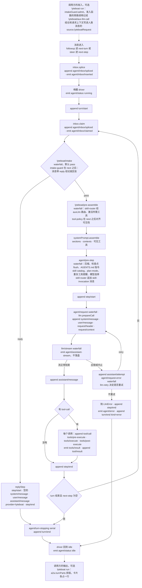

每一次 `Session.append` 都会触发 `session/event`，投影注册表在这时跑所有投影的 `apply`（`dsh/session/session-projection/src/index.ts:220-221,657`），JSONL 后端把事件放进写缓冲（`dsh/session/session-persistence-jsonl/src/storage.ts:274-282,535`）。图里没有画这两条线，因为它们挂在每一个 append 上。图里用虚线连着的两头（最上面的准入、最下面的输出）不是 driver 的事，是调用方的；`lyteboat run` 是目前唯一这样做的调用方。

| 阶段 | 事件 | 派发方式 | 代码 | lyteboat 在这里做什么 |
|---|---|---|---|---|
| S0 准入（调用方） | 不是事件：直接调 `ctx.intakeGuard.admit` | — | `lyteboat/bundles/run/src/index.ts:306-311`；`lyteboat/plugins/intake-guard/src/index.ts:107-113` | agent 自己 scope 链上最近的准入函数判断这条请求（finance 的经 `ctx.auxLlm` 分类一次，记成 `lyteboat/aux-llm-call`）；结论和上下文随人类消息一起 `followup` |
| S1 入 inbox | `agent/inbox/inserted` | emit | `dsh/core/agent-loop/src/inbox.ts:235-240` | — |
| S2 开 turn | — | — | `agent.ts:323` 追加 `turn/start` | — |
| S3 领取 | `agent/inbox/claimed` | emit | `inbox.ts:109-112` | — |
| S4 拒识门 | `lyteboat/intake` | waterfall | `agent.ts:279-284` | intake-guard（宿主行，`next()` 之后）：人类消息带 `reply` 结论就回它的文字，没带结论的在第 1 个 step 补一次准入（`lyteboat/plugins/intake-guard/src/index.ts:69-75,116-123`）；demo-hooks 命中“炒股 / 股票…”就返回 reply（`lyteboat/agents/demo/src/hooks.ts:12-26`） |
| S5 组装前 | `lyteboat/pre-assemble` | waterfall | `agent.ts:285-288` | skill-router 在 `next()` 前路由、激活工具、备好要注入的 skill 正文（`skill-router/src/index.ts:229-235,291-307`）；finance-agent 在 `next()` 前把前几轮的 digest 压成事实（`lyteboat/agents/finance/src/agent.ts:47-51`）；tool-policy 在 `next()` 后对齐（`tool-policy/src/index.ts:117-123`） |
| S6 组装 | `system-prompt/assemble` | waterfall | `agent.ts:290`；`dsh/core/system-prompt/src/index.ts:558,626` | lyteboat 不监听，只通过 `section` / `context` 注册内容 |
| S7 进入前 | `agent/pre-step` | waterfall | `agent.ts:294-300` | skill-router 在 `next()` 之后把 skill-invocation 消息接在这一步的消息后面（`skill-router/src/index.ts:236-244`）。run 组合里挂在这里的 dsh 监听：compaction-basic（压缩，`dsh/compaction/compaction-basic/src/index.ts:158`）、session-checkpoint-policy（flush）、agent-instructions（AGENTS.md 类指令，`dsh@rc.1:packages/context/agent-instructions/src/index.ts:315`）、tool-skill（skill catalog）、plan-mode、repeat-tool-reminder、goal-round-driver，以及 `lyteboat-run` 通过 `installModelSelection` 装的模型选择 |
| S8–S11 请求 | `agent/request`、`llm/stream` | waterfall | `agent.ts:643,503`；`dsh/llm/llm/src/index.ts:73,1122` | finance-agent 在 `agent/request` 里把温度定成 0（`lyteboat/agents/finance/src/agent.ts:46`）；demo 不监听 |
| S11′ 请求失败 | `agent/request-error` | waterfall，默认不重试 | `agent.ts:555-575`（先追加 `assistant/attempt`） | — （llm-retry 在这里返回 `{kind: 'retry'}`，`dsh@rc.1:packages/llm/llm-retry/src/index.ts:243`） |
| S12 流 | `agent/assistant-stream` | emit，不持久化 | `agent.ts:499` | `lyteboat run` 把推理打到 stderr（`lyteboat/bundles/run/src/index.ts:130-178`） |
| S13 工具 | `tools/pre-execute`、`tools/execute`、`tools/post-execute`、`tools/result` | waterfall ×3、emit | `dsh/core/tools/src/index.ts:1505,1605,1781,1703` | tool-policy 对需确认的工具返回 `ask`（124-131）；工具的 `presentationMeta` 带出 `meta.lyteboat.{cards,stateDelta}`；模型自己调 `skill` 工具加载的 skill 由 `lyteboatActiveSkill` 投影从这次调用的 `tool/call` 和成功的 `tool/result` 折叠出来（`skill-router/src/index.ts:152-163`），lyteboat 没有 `tools/result` 监听 |
| S14 结束 | `agent/turn-stopping` | serial | `agent.ts:385` | — |
| S15 输出（调用方） | 不是事件：`ctx.a2ui.turnParts` | — | `lyteboat/bundles/run/src/index.ts:316-319`；`lyteboat/plugins/a2ui/src/index.ts:242-262`，`turn-parts.ts:35-64` | `immediate` 卡片在前；回答里的每个 `[[card:<area>]]` 换成那个区域还没出现的 `deferred` / `deferred_discard` 卡片；turn 完成时没放下的 `deferred` 卡片跟在最后，`deferred_discard` 丢掉；`lyteboat run` 把每张卡打成一行 `[card <area>]` |

**几个要点，每个都容易想错：**

- **`lyteboat/intake` 和 `lyteboat/pre-assemble` 每个 step 都派发**，不只是第一个。工具结果之后的 step 里 `messages` 是 `[]`，监听要能处理空数组；skill-router 看到没有用户文字就不路由（`skill-router/src/index.ts:304-305`），intake-guard 只在第 1 个 step 管准入（`intake-guard/src/index.ts:71`）。
- **准入和拒识门都在路由之前**。reply 分支不组装提示词、不调模型，也就没有路由调用；finance 给未授权客户的回复只有一次旁路请求（准入分类），见 [5.6](#56-带请求上下文的请求准入在循环之前)。准入的结论记在人类消息上；没先 `admit` 就 `followup` 的消息（一个不做准入的客户端）会在 `lyteboat/intake` 里补一次准入，回复一样，但结论和卡片不进日志（`lyteboat/plugins/intake-guard/src/index.ts:8-11`）。
- **`lyteboat:state`（order 130）是 runtime context，不是系统提示 section**。它和 dsh 的 `sandbox:policy`（110）、`approval:policy`（115）一起渲染成一条 `source.kind = 'runtime-context'` 的 **user** 消息：快照消息由 `RuntimeContextProjection.project` 构造（`dsh/core/agent-loop/src/runtime-context.ts:152-163`），放在领取的用户消息之后则是 `agent/pre-step` 的默认决定 `messages: [...claimed, context]`（`dsh/core/agent-loop/src/agent.ts:293-299`）。只有 full 模式的 `lyteboat:skills`（450）是系统提示 section（`skill-router/src/index.ts:220-228`）。
- **路由选中的 skill 不是 context，是一条消息**。F1 起没有 `lyteboat:skill` 这个 runtime context 了：skill 正文是一条 dsh 自己的 skill-invocation user 消息（`source: {kind: 'skill-invocation', name, form: 'instructions'}`，和用户手动调用 skill 时 dsh-tool-skill 写的是同一种），由 skill-router 在 `agent/pre-step` 的 `next()` 之后追加（`skill-router/src/index.ts:183-190,236-244`）。它只在切换了 skill、或者正文已经不在模型看得到的对话里（比如被压缩掉）时追加（402-406），所以同一个 skill 的后续 step、续接的会话都不会重复注入；换 skill 时消息开头多一句 `Skill "<旧>" is no longer active; follow the skill below instead.`。
- **state delta 和卡片不是在 `tools/post-execute` 里加的**。它们在 dispatch 阶段由 `createSuccessResult` 调工具的 `presentationMeta` 产生，只对顶层调用生效（`dsh/core/tools/src/index.ts:1843`），然后 agent-loop 原样写进 `tool/result.meta`（`dsh/core/agent-loop/src/tool-calls.ts:282-289`）。`meta.lyteboat.cards` 是数组，每张卡 `{surfaceId, area, emission, payload}`（`lyteboat/core/contracts/src/index.ts:120-129`）。lyteboat 没有 `tools/post-execute` 监听。
- **投影只折叠追加的节点**。`lyteboatState`、`lyteboatCards`、`lyteboatActiveSkill`、`lyteboatRequest` 都先看 `surfaceOp === 'append'`（`tool-policy/src/state.ts:88`，`a2ui/src/index.ts:143`，`skill-router/src/index.ts:149,160`，`request-context/src/index.ts:81`）：被替换的旧节点（压缩、finance 把前几轮的 digest 压成事实）保留原来的 meta，再算一次就会重复。
- **state 在下一个 step 才被模型看到**：`lyteboatState` 投影在 `tool/result` 追加时就更新了，但 runtime context 在下一次 `assemble` 时才重新渲染。
- **`step/start` 在 `system/message` 之前**：先 `step/start`（`agent.ts:371`），再 `prepareRequest`，然后才追加 `system/message` 和本 step 的 `user/message`（476-490），最后 `request/header`（683-694）。

### 4.2 demo 请求“看看资产”的时序

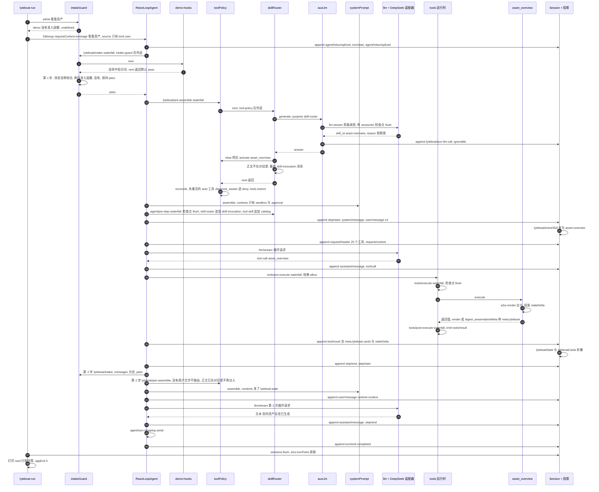

脚本化模型一共收到 4 个请求，顺序是：路由、循环（25 个工具）、标题、循环。第一次循环请求里有 `asset_overview`、没有 `diagnose_assets`——因为只有被激活的 skill 的 `requiredTools` 会被放开（`lyteboat/agents/demo/skills/asset-overview/SKILL.md` 的 frontmatter：`metadata.lyteboat.requiredTools: [asset_overview]`）。标题请求来自 dsh 的 `session-title` 和 `session-title-llm` 行（包 `dsh-session-title-first-prompt-llm`），它们等第一条 `request/header` 写入、拿到主请求的路由后才启动（`dsh@rc.1:packages/session/session-title/src/index.ts:356-363,526-536`），和 lyteboat 无关。demo 的卡片清单没写 `emission_mode`，按 `immediate` 处理（`lyteboat/plugins/a2ui/src/engine.ts:108`），所以 stdout 是先一行 `[card asset_overview]`、再是回答。

**为什么路由要在 `lyteboat/pre-assemble` 里做、而不能挂在 dsh 的 `agent/pre-step` 上**：`agent/pre-step` 在 `systemPrompt.assemble` 之后才派发（`agent.ts:290-300`），那时提示词和可见工具已经定了；路由的结果（`requiredTools`）必须影响**这一步**的请求。这正是 `extensions.yml:40-48` 写的理由和退出条件。skill 正文则不同：它是这一步的一条消息，不属于组装的结果，所以 skill-router 在 `lyteboat/pre-assemble` 里把它备好，到 `agent/pre-step` 再接进这一步的消息，两步用的是同一个 agent 的状态（`skill-router/src/index.ts:192-199,291-307`）。

---

## 5. 会话日志的时序

### 5.1 日志在哪、长什么样

- **路径**：`$LYTEBOAT_HOME/sessions/<编码后的 cwd>/session-<uuid>/session.v4.jsonl.zstd`，旁边一个锁文件 `session.lock`。日志路径由 `logPath` 拼出（`dsh/session/session-persistence-jsonl/src/format.ts:298-305`），锁文件名是 `LEASE_FILENAME`（`dsh/session/session-persistence-jsonl/src/lease.ts:40`）。根目录来自 dsh-base 的 `root: !!js dshHomePath('sessions')`（`dsh@rc.1:packages/bundle/base/cordis.patch.yml:130-133`），而 `dshHomePath` 读的是被 lyteboat 改写过的 `DSH_HOME`，所以日志总在 `$LYTEBOAT_HOME` 下。
- **格式**：zstd 压缩，**每次落盘写一个 zstd 帧**；第一行是 header（run a）：

```json
{"type":"session","version":4,"id":"session-c452302e-1585-475d-b33d-a0b4a2a0772d","createdAt":1790243327248,"cwd":".../workspace","isSeeded":false,"delegationDepth":0,"agentPreset":"demo"}
```

- **读法**：`@lyteboat/testing/session-log` 的 `findSessionLogs(home)` / `readSessionLog(path)`（`lyteboat/tooling/testing/src/session-log.ts:113-134`）。它逐帧解压：JSONL 后端每批写一个 zstd 帧，而 Node 的 `zstdDecompressSync` 读完第一帧就停，所以要先用 `scanZstdFrames` 按结构找出每一帧，再逐帧解码（模块说明 `session-log.ts:8-10`，实现 `38-106`）。
- **同时写的**：`$LYTEBOAT_HOME/storages/session_projcache/sessions/<id>.json`（投影缓存）。

本节和下面几节的样本日志来自 [7.5](#75-复现本文的运行) 的运行 a–f：a 是 demo 的“看看资产”，b 是 demo 的拒识“帮我炒股”，c 是 demo 的寒暄“你好”，d 是不带 agent 的“你好”，e 是外部历史导入，f 是 finance 带请求上下文的“看看我的资产”。

### 5.2 追加与落盘的时序

事件什么时候**追加**（进内存日志）和什么时候**落盘**（写 zstd 帧）是两回事：

1. `Session.append`（`dsh/core/session/src/index.ts:724-778`）校验数据，推进内存日志，然后派发 `session/event`。
2. JSONL 后端的 tracker 收到 `session/event` 就 `enqueueLive`：拷一份进缓冲，挂一个 200 ms 的定时器（`storage.ts:36,274-282`）。
3. `session/flush` 让缓冲立刻排空。按约定它只通过 `sessions.flush(session)` 派发（`dsh/core/session/src/index.ts:1183-1200`）——这是 docstring 里写的约定（1170-1182：一个入口、一种写法，便于不变式检查），不是技术限制，代码并不阻止别人直接 `ctx.parallel('session/flush', …)`；`drainBuffered`（`storage.ts:294`）是单飞循环，写的过程中新到的事件进下一批。
4. 实际写：第一次落盘由 `materialize`（`dsh/session/session-persistence-jsonl/src/index.ts:1176`）把 header 帧和第一批帧写进临时文件、fsync 后发布；之后每批追加一个 zstd 帧，`open(path,'a')` → `writeFile` → `sync()`，失败就截回原长度（1357）。

哪次 flush 写出了哪一帧，是用一个 `--plugin` 探针量出来的：它监听 `session/flush`，打印调用时的日志长度和调用栈上的包（`probe-flush.mjs`，[7.5](#75-复现本文的运行) 末尾）。用 run a 的同一条命令再跑一次，它记下 10 次 flush，这次的日志也是同样的 11 帧，一一对上：

```text
[flush] +4 ms  log length 3  via dsh-session-projection-cache
[flush] +63 ms  log length 6  via dsh-session-checkpoint-policy < lyteboat/plugins/aux-llm
[flush] +114 ms  log length 7  via dsh-session-checkpoint-policy < dsh-agent-instructions
[flush] +134 ms  log length 15  via dsh-session-checkpoint-policy < dsh/core/agent-loop
[flush] +138 ms  log length 17  via dsh-session-checkpoint-policy < dsh-session-title-llm
[flush] +168 ms  log length 19  via dsh-session-checkpoint-policy < dsh-tool-call-timeout-policy
[flush] +210 ms  log length 22  via dsh-session-checkpoint-policy < dsh-agent-instructions
[flush] +227 ms  log length 24  via dsh-session-checkpoint-policy < dsh/core/agent-loop
[flush] +240 ms  log length 27  via dsh-session-projection-cache
[flush] +242 ms  log length 27  via lyteboat/bundles/run
```

（`via` 是调用栈上第一个、第二个包：checkpoint-policy 分别挂在旁路调用的 `llm/stream`、`agent/pre-step` 链、循环的 `llm/stream`、标题的 `llm/stream`、`tools/execute` 链上。）**每一次写入都来自显式 flush 或同一次排空的延续，没有一次是那个 200 ms 定时器触发的**：

| 触发者 | 时机 | 代码 |
|---|---|---|
| `dsh-session-checkpoint-policy` | 任何带 `sessionId` 的 `llm/stream`（循环、旁路调用、标题）开始前；顶层 `tools/execute` 执行工具体之前；每个 `agent/pre-step` | `dsh@rc.1:packages/session/session-checkpoint-policy/src/index.ts:63-83`；`@lyteboat/aux-llm` 的调用带着 agent 的 `sessionId`（`lyteboat/plugins/aux-llm/src/index.ts:144`），所以路由调用前也会 flush |
| `dsh-session-projection-cache` | 写检查点时调 `sessions.flush`：`session/created`、`turn/end` 以及事件数 / 时间阈值 | `dsh@rc.1:packages/session/session-projection-cache/src/index.ts:266,316-317,337-338`；dsh-base 的行配置 `cordis.patch.yml:182-186` |
| `@lyteboat/run` | `whenIdle` 之后 `await sessions.flush(agent.session)`。这次它比投影缓存的 `turn/end` 检查点晚 2 ms，并入同一次排空，没有单独写出帧 | `lyteboat/bundles/run/src/index.ts:316` |
| 关闭 | `session/disposed` 时关闭 handle，先排空剩余 | `storage.ts:548` |

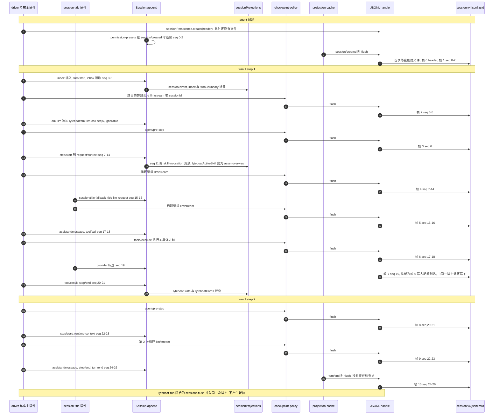

run a 的完整事件表（时间是相对 seq 0 的毫秒数，帧号来自逐帧解码）：

| seq | +ms | 类型 | 关键字段 | 帧 |
|---|---|---|---|---|
| 0 | 0 | `permission/preset` | `preset: workspace-write` | 1 |
| 1 | 2 | `sandbox/mode` | `mode: workspace-write` | 1 |
| 2 | 3 | `approval/policy` | `policy: ask` | 1 |
| 3 | 6 | `agent/inbox/spliced` | `target: next-turn`，插入用户消息 | 2 |
| 4 | 8 | `turn/start` | `turn: 1` | 2 |
| 5 | 9 | `agent/inbox/spliced` | `removedCount: 1`（driver 领取） | 2 |
| 6 | 107 | `lyteboat/aux-llm-call` | **`ignorable: true`**；`purpose: skill-router`，完整的 system 和 prompt，`output: {"skill_id":"asset-overview","reason":"观察类"}`，`durationMs: 53` | 3 |
| 7 | 131 | `step/start` | turn 1 step 1 | 4 |
| 8 | 134 | `system/message` | `surfaceOp: append`，约 4.2k 字符（含 demo persona，随 cwd 长度变化） | 4 |
| 9 | 135 | `user/message` | `source.kind: user`，“看看资产” | 4 |
| 10 | 137 | `user/message` | runtime-context：`sandbox:policy`、`approval:policy` | 4 |
| 11 | 137 | `user/message` | **`source: {kind: skill-invocation, name: asset-overview, form: instructions}`**，`<skill_content name="asset-overview">…` | 4 |
| 12 | 137 | `user/message` | `source.kind: skill-catalog` | 4 |
| 13 | 139 | `request/header` | `reason: initial`，25 个工具，含 `asset_overview` | 4 |
| 14 | 140 | `request/context` | provider、`contextWindow`、`systemPromptUpdate: in-history` | 4 |
| 15 | 144 | `session/title` | `source.kind: fallback` | 5 |
| 16 | 146 | `session/title-llm-request` | 完整的标题请求 | 5 |
| 17 | 164 | `assistant/message` | `tool-call asset_overview`，`id: call-overview` | 6 |
| 18 | 165 | `tool/call` | `name: asset_overview`，`arguments: "{}"` | 6 |
| 19 | 170 | `session/title` | provider 生成的标题 | 7 |
| 20 | 203 | `tool/result` | `isError: false`，`meta.lyteboat.cards`（1 张，`area: asset_overview`，`emission: immediate`）+ `meta.lyteboat.stateDelta`，`sourceEventSeqs: [18]` | 8 |
| 21 | 203 | `step/end` | | 8 |
| 22 | 222 | `step/start` | turn 1 step 2 | 9 |
| 23 | 224 | `user/message` | runtime-context：`sandbox:policy`、`approval:policy`、**`lyteboat:state`** | 9 |
| 24 | 234 | `assistant/message` | “您的资产总览已生成（DEMO-OK）。” | 10 |
| 25 | 235 | `step/end` | | 10 |
| 26 | 235 | `turn/end` | `reason: {kind: completed}` | 10 |

几个观察：step 2 没有第二条 `request/header`（头没变、也没开新请求序列，`agent.ts:683-694`）；`request/context` 只在值变化时追加（705-711）；路由调用本身 53 ms（`durationMs`），seq 5 到 seq 6 之间的 98 ms 还包括取 skill 快照和 flush；step 2 的 runtime context 里没有 skill，skill 正文只在 seq 11 出现一次，step 2 的 `lyteboat/pre-assemble` 看它已经在对话里，就不再注入。

### 5.3 真实 JSONL 片段（裁剪过）

```jsonl
{"type":"lyteboat/aux-llm-call","seq":6,"time":1790243327365,"data":{"purpose":"skill-router","route":{"provider":"deepseek-official","model":"<model>"},"system":"你是一个 skill 路由器。根据用户对话上下文，从可用 skill 列表中选择最匹配的一个。\n仅输出严格 JSON：{\"skill_id\": \"<id 或 null>\", \"reason\": \"<≤30字>\"}，不要包含其它文本。","prompt":"<task>从可用 skill 列表中为用户当前输入选择最匹配的一个，或返回 null。</task>\n\n<available_skills>\n  - id: asset-diagnosis\n    description: …\n  - id: asset-overview\n    description: …\n</available_skills>\n\n<conversation_history>\n(empty)\n</conversation_history>\n\n<current_active_skill>none</current_active_skill>\n\n<latest_user_input>看看资产</latest_user_input>\n\n<rules>…</rules>\n\n<output_format>…</output_format>","maxTokens":200,"temperature":0,"output":"{\"skill_id\":\"asset-overview\",\"reason\":\"观察类\"}","durationMs":53},"ignorable":true}
{"type":"user/message","seq":10,"time":1790243327395,"data":{"content":[{"type":"text","text":"Current runtime context. This snapshot supersedes earlier runtime-context snapshots.\n\nCurr…(566)"}],"source":{"kind":"runtime-context","form":"snapshot","sections":[{"name":"sandbox:policy","text":"Current DSH file policy: workspace-write. …"},{"name":"approval:policy","text":"Approval policy: ask. …"}]},"role":"user","id":"0fef3648-…"},"surfaceOp":"append"}
{"type":"user/message","seq":11,"time":1790243327395,"data":{"content":[{"type":"text","text":"<skill_content name=\"asset-overview\">\n<skill_resources>\nBase directory for this skill: …(586)"}],"source":{"kind":"skill-invocation","name":"asset-overview","form":"instructions"},"role":"user","id":"3e4d1ac8-…"},"surfaceOp":"append"}
{"type":"request/header","seq":13,"time":1790243327397,"data":{"header":{"config":{"provider":"deepseek-official","model":"<model>","maxTokens":256000,"reasoningEffort":"high"},"adapterDefaults":{"reasoningEffort":true,"maxTokens":true},"tools":"<25 tools: asset_overview,bash,create_goal,…>"},"reason":"initial"}}
{"type":"assistant/message","seq":17,"time":1790243327422,"data":{"turn":1,"step":1,"message":{"role":"assistant","content":[{"type":"tool-call","id":"call-overview","name":"asset_overview","arguments":"{}"}],"source":{"kind":"model","provider":"deepseek-official","model":"<model>","replayState":{…}},"id":"d1972ee4-…"},"usage":{"inputTokens":3,"outputTokens":2,"totalTokens":5},"stream":"<6 stream frames>"},"surfaceOp":"append"}
{"type":"tool/call","seq":18,"time":1790243327423,"data":{"turn":1,"step":1,"callId":"call-overview","name":"asset_overview","arguments":"{}"}}
{"type":"tool/result","seq":20,"time":1790243327461,"data":{"turn":1,"step":1,"message":{"role":"tool","source":{"kind":"tool","callId":"call-overview"},"toolCallId":"call-overview","content":[{"type":"text","text":"status=ok · [卡片:资产/full] 总额300,000.00元（约30.00万元） · 保单4份 · 已授权3/3桶 · 卡后一句简短收尾（≤25字），不复述卡内数字"}],"isError":false,"id":"79f2b620-…"},"meta":{"lyteboat":{"cards":[{"surfaceId":"asset_overview-session--0d3a45","area":"asset_overview","emission":"immediate","payload":{"event":"beginRendering","version":"1.0.0","surfaceId":"asset_overview-session--0d3a45","rootComponentId":"root-container","showType":"card","hideVoteRecorder":true,"components":"<14 components>","businessPayload":{…}}}],"stateDelta":{"assets_view":{"total":"300000.00","buckets":{"日常":{"pct":15,…},"稳健":{"pct":58,…},"进取":{"pct":27,…}},"policy_count":4,"auth_state":"full",…},"assets_raw":{"accounts":[…3 accounts…]}}}}},"sourceEventSeqs":[18],"surfaceOp":"append"}
{"type":"user/message","seq":23,"time":1790243327482,"data":{"content":[{"type":"text","text":"Current runtime context. …(1386)"}],"source":{"kind":"runtime-context","form":"snapshot","sections":[…,{"name":"lyteboat:state","text":"Session state, accumulated from tool results (JSON):\n{\"assets_view\":{\"total\":\"300000.00\",…"}]},"role":"user","id":"…"},"surfaceOp":"append"}
{"type":"turn/end","seq":26,"time":1790243327493,"data":{"turn":1,"reason":{"kind":"completed"}}}
```

lyteboat 的事实都骑在 dsh 已有的信封上，唯一一种 lyteboat 自己的记录是可忽略的旁路调用审计：

| lyteboat 的事实 | 在日志的哪里 | 谁写的 | 谁读 |
|---|---|---|---|
| 卡片 | `tool/result.data.meta.lyteboat.cards`（数组） | demo 工具的 `presentationMeta`（`lyteboat/agents/demo/src/tools.ts:58-60`） | `lyteboatCards` 投影（`lyteboat/plugins/a2ui/src/index.ts:137-151`）、`a2ui.turnParts`（242-262） |
| 状态增量 | `tool/result.data.meta.lyteboat.stateDelta` | `toolPolicy.register` 包一层 `presentationMeta`（`lyteboat/plugins/tool-policy/src/index.ts:74-92`） | `lyteboatState` 投影（`lyteboat/plugins/tool-policy/src/state.ts:78-101`），再由 `lyteboat:state` context 渲染（`state.ts:104-107`） |
| 当前 skill | skill-invocation 的 `user/message`（seq 11）；模型自己调 `skill` 工具时是那次 `tool/call` 和成功的 `tool/result` | skill-router 在 `agent/pre-step` 追加（`skill-router/src/index.ts:236-244`）；dsh 的工具运行时 | `lyteboatActiveSkill` 投影（`skill-router/src/index.ts:141-170`） |
| 旁路调用审计 | `lyteboat/aux-llm-call`，`ignorable: true`（seq 6） | aux-llm（`lyteboat/plugins/aux-llm/src/index.ts:131`） | 人；没有投影读它，模型也看不到 |
| 请求上下文和准入结论 | 人类消息的 `user/message.data.source.lyteboatRequest`（见 [5.6](#56-带请求上下文的请求准入在循环之前)） | 调用方经 `requestContext.message`（`lyteboat/plugins/request-context/src/index.ts:106-112`） | `lyteboatRequest` 投影（76-88）、intake-guard、`lyteboatCards`（结论里的卡片） |
| 拒识 / 准入回复 | `assistant/message.message.source = {provider: 'lyteboat', model: <插件或准入函数名>}` | driver 的 `replyStep`（`agent.ts:450-458`） | 人、UI |

### 5.4 日志怎么映射回模型看到的内容

**规则：模型看得到的，日志里都能还原**（`CLAUDE.md:80`，dsh 的规则）。driver 发请求时不是自己拼消息，而是追加 `request/header` / `request/context` 之后，直接用 `session.deriveMessages()` 当消息列表（`agent.ts:716-729`）。`deriveMessages`（`dsh/core/session/src/index.ts:849`）只遍历带 `surfaceOp` 的事件；对 `tool/result` 只取 `data.message`（`dsh/core/session/src/surface.ts:150-151`）；不认识且带 `ignorable` 的记录保留在日志里，但不碰 surface（`surface.ts:311-312`）。所以：

- `meta.lyteboat.cards` 和 `stateDelta` **永远不进对话记录**，模型看到的是工具 `render` 出来的 digest（`lyteboat/agents/demo/src/tools.ts:57`：`status=ok · …`）。卡片只给 UI 和 `turnParts`。
- 状态进模型的唯一路径是下一步的 `lyteboat:state` runtime context（seq 23）。
- skill 正文进模型的路径是 seq 11 那条 skill-invocation 消息，它本身就是 surface 事件。
- `lyteboat/aux-llm-call`（seq 6）不进任何循环请求；它记的是另一个请求。

dsh 在测试里用一条不变式强制这件事：每个循环请求的 `messages` 必须等于派发时的 `deriveMessages()`，模型、工具等必须等于折叠后的 `request/header`（`dsh/core/agent-loop/src/invariant.ts:21-56`）。这条不变式挂在 `invariants` 服务上，`lyteboat run` 的组合里没有这个服务，它在单元测试 harness 和 G2 里生效（`CLAUDE.md:173-174`）。对 run a，我们离线用内核的 `Session.create(id, 回复前的事件)`（`dsh/core/session/src/index.ts:509`）`.deriveMessages()` 逐个重建循环请求，再和脚本化模型收到的请求比较（脚本是 [7.5](#75-复现本文的运行) 的 `check-log.mjs`）：

```text
loop #1: derived [system-prompt, user, runtime-context, skill-invocation, skill-catalog]
  system equal=true  blocks equal=true (4)  tools equal=true (25)
loop #2: derived [system-prompt, user, runtime-context, skill-invocation, skill-catalog, model, tool, runtime-context]
  system equal=true  blocks equal=true (7)  tools equal=true (25)
side #1 skill-router (seq 6, ignorable=true): system equal=true  prompt equal=true  output={"skill_id":"asset-overview","reason":"观察类"}
reopen: ok
```

| 请求 | 推导出的消息 | 线上请求 | 系统文本 | 各块文本 | 工具 vs `request/header` |
|---|---|---|---|---|---|
| 循环 #1 | system、user、runtime-context、skill-invocation、skill-catalog | `system` + 1 条 user（4 个 text 块），25 个工具 | 相同 | 相同（4 块） | 相同（seq 13） |
| 循环 #2 | 上面 + assistant(tool-call)、tool、runtime-context | 3 条消息：user(4 text)、assistant(tool_use)、user(tool_result + text) | 相同 | 相同（7 块） | 相同（seq 13） |

DeepSeek 适配器在线上做了四件事：

1. 把 surface 第 0 个节点（`system/message`）挪到 `system` 字段；
2. 把相邻的 user 角色节点合并成一条；
3. 把工具结果放成 user 消息里的 `tool_result` 块；
4. 按 `request/header` 的 config 写 `thinking`、`output_config`、`max_tokens`（实测循环请求里是 `{"type":"enabled"}`、`{"effort":"high"}`、`256000`），并由 dsh-base 的 `plugin-package-inventory-deepseek` 行附上 `dsh_plugin_packages`（`dsh@rc.1:packages/bundle/base/cordis.patch.yml:77-78`；`dsh@rc.1:packages/llm/plugin-package-inventory-deepseek/src/index.ts:1-29`）——这是一份已加载插件包的清单（`{"version":1,"packages":[…,{"name":"@lyteboat/a2ui","version":"0.0.1"},{"name":"@lyteboat/agent-demo","version":"0.0.1"},{"name":"@lyteboat/aux-llm","version":"0.0.1"},…]}`，这次 95 个包；旁路请求和标题请求也带），**不进会话日志**，也不是模型可见的内容，所以不违反上面这条规则，但它意味着 lyteboat 的插件组成会随每个官方请求发给服务端。

**两个旁路请求都能从日志还原**。标题请求被 dsh 完整记录为 `session/title-llm-request`（seq 16，含 system、messages、route、`maxTokens`）；路由请求记为 `lyteboat/aux-llm-call`（seq 6）：`purpose`、`route`、`system`（参考实现的路由系统提示原文）、`prompt`（`<available_skills>`、`<conversation_history>`、`<current_active_skill>`、`<latest_user_input>`、`<rules>`、`<output_format>` 全文）、`maxTokens`、`temperature`、`output`（模型的原文）或 `failure`（`timeout`、`max-tokens` 或错误名，带消息）、`durationMs`（记录的类型是 `lyteboat/core/contracts/src/index.ts:140-156`）。上面 `side #1` 那一行就是 `check-log.mjs` 把这条记录和脚本化模型收到的路由请求逐字比较的结果；finance 的准入分类（[5.6](#56-带请求上下文的请求准入在循环之前)）也是这样记的。线上的路由请求还带着 `thinking: {"type":"enabled"}`、`output_config: {"effort":"high"}`、`max_tokens: 200`、`temperature: 0`：host 行没给 aux-llm 配 `reasoningEffort`，旁路调用沿用这条路由的默认推理强度，思考也从 `maxTokens` 里扣（`lyteboat/plugins/aux-llm/src/index.ts:31-43`）；只有配置了推理强度，记录里才有 `reasoningEffort` 字段（87）。答到 `maxTokens` 被截断算失败（`reason: max-tokens`，121-123），调用方按失败回退：路由保持当前 skill，finance 的准入放行。

另外，runtime-context 快照会在历史里累积：循环 #2 里既有 step 1 的快照（seq 10）也有 step 2 的（seq 23）。“supersedes earlier snapshots”是写给模型看的说明，内核不会删旧快照。

### 5.5 拒识回复的情况：`帮我炒股`（run b）

```jsonl
{"type":"step/start","seq":6,"time":1790243328705,"data":{"turn":1,"step":1}}
{"type":"system/message","seq":7,"time":1790243328705,"data":{"turn":1,"step":1,"message":{"role":"system","content":[],"source":{"kind":"system-prompt"},"id":"6f49a5c5-…"}},"surfaceOp":"append"}
{"type":"user/message","seq":8,"time":1790243328707,"data":{"content":[{"type":"text","text":"帮我炒股"}],"source":{"kind":"user"},"role":"user","id":"1fd46fd5-…"},"surfaceOp":"append"}
{"type":"assistant/message","seq":9,"time":1790243328709,"data":{"turn":1,"step":1,"message":{"role":"assistant","content":[{"type":"text","text":"抱歉，我只负责资产配置相关的问题，不提供股票买卖建议。"}],"source":{"kind":"model","provider":"lyteboat","model":"demo-hooks"},"id":"49311a9a-…"},"stream":[]},"surfaceOp":"append"}
{"type":"step/end","seq":10,"time":1790243328709,"data":{"turn":1,"step":1}}
{"type":"session/title","seq":11,"time":1790243328710,"data":{"title":"帮我炒股","messageSeqs":[8],"source":{"kind":"fallback"}}}
{"type":"turn/end","seq":12,"time":1790243328711,"data":{"turn":1,"reason":{"kind":"completed"}}}
```

- **零个模型请求**：没有 `request/header`、`request/context`、`lyteboat/aux-llm-call`、runtime-context、skill-invocation，也没有标题 LLM 请求（标题插件要等到有 `request/header` 才启动）。`turn/start` 到 `turn/end` 共 8 ms。
- **谁回的**：demo-hooks 在 `lyteboat/intake` 里没调 `next()`，直接返回 reply；外层的 intake-guard 拿到 reply 原样返回（它只在结论是 pass 时才去准入），driver 按 reply 分支写日志，`model` 记的是 demo-hooks 的插件名。demo 没有注册准入函数，所以 `lyteboat run` 的 `admit` 返回空，人类消息的 source 只有 `kind: user`。
- **为什么要写一个空的 `system/message`**：surface 的第 0 个节点保留给系统提示。reply 先放一个空头（`agent.ts:439-445`），之后真正的模型 step 会**替换**它而不是追加在历史末尾；第一次请求总是被当作新请求序列，所以空头一定被换掉（`agent.ts:473-481`）。
- **落盘只有两次**：帧 0+1 是 header 和 seq 0–2（投影缓存的 `session/created` 检查点）；帧 2 一次写下 seq 3–12，由投影缓存的 `turn/end` 检查点触发（`dsh@rc.1:packages/session/session-projection-cache/src/index.ts:316-317`），runner 的 `sessions.flush`（`lyteboat/bundles/run/src/index.ts:316`）随后并入同一次排空。reply 分支在 `agent/pre-step` 之前就返回，没有 `llm/stream`、没有 `tools/execute`，检查点策略一次都没触发——**拒识路径在 turn 内部没有持久化点**。

### 5.6 带请求上下文的请求：准入在循环之前

finance 的客户由请求上下文指定（`context.customer`），它的准入函数在请求进入循环之前判断这条请求（`lyteboat/agents/finance/src/intake/finance-admission.ts:102-120`）：先经 `ctx.auxLlm` 做一次分类（资产 / 理财常识 / 寒暄 / 其他，106-108）。分类失败放行；其他回复服务范围；常识和寒暄放行，不管上下文里有没有客户；只有问自己的资产才需要客户——上下文没指定、或指定的客户数据源里找不到（`FinanceCustomerSource.findCustomer`，`lyteboat/agents/finance/src/data/finance-customer.ts:95`），就回复“暂时没能识别您的身份”；找到了，有已授权账户就放行，没有就回复“未授权”卡片（`finance.composite.ts:166-180` 覆盖没有客户和未知客户两种情况）。run f 用一个没有任何授权账户的客户（`lyteboat/agents/finance/fixtures/customers/none-authorized.json`）：

```console
$ node /tmp/repro.mjs run --agents "$PWD/lyteboat/agents" --agent finance --context '{"customer":"none-authorized"}' 看看我的资产
exit=0  1182 ms  requests=[intake]
stdout: [card unauthorized]
您还没有授权任何账户，授权后我就能帮您看资产了。
stderr: lyteboat: session session-a8b73790-daf7-4d43-abb9-de62b2e7fe80
```

脚本化模型只收到一个请求：准入分类（`repro.mjs` 按系统提示里的“准入分类器”认出它，答 `{"intent":"asset"}`）。没有路由、没有循环请求、没有标题请求。日志：

| seq | +ms | 类型 | 关键字段 | 帧 |
|---|---|---|---|---|
| 0–2 | 0–2 | `permission/preset`、`sandbox/mode`、`approval/policy` | | 1 |
| 3 | 67 | `lyteboat/aux-llm-call` | **`ignorable: true`**，`purpose: intake`，`output: {"intent":"asset","reason":"脚本"}`，`durationMs: 62`：**在 inbox 之前**，因为准入跑在 `followup` 之前 | 2 |
| 4–6 | 82–84 | `agent/inbox/spliced`、`turn/start`、`agent/inbox/spliced` | 插入的消息已经带着 `source.lyteboatRequest` | 2 |
| 7–8 | 88 | `step/start`、空的 `system/message` | reply 分支 | 2 |
| 9 | 89 | `user/message` | **`source: {kind: user, lyteboatRequest: {context, intake}}`** | 2 |
| 10 | 91 | `assistant/message` | `source: {provider: lyteboat, model: finance-admission}`，结论里的文字 | 2 |
| 11–13 | 92–93 | `step/end`、`session/title`（fallback）、`turn/end` | | 2 |

人类消息（seq 9，卡片的组件列表裁掉了）：

```jsonl
{"type":"user/message","seq":9,"time":1790243334083,"data":{"content":[{"type":"text","text":"看看我的资产"}],"source":{"kind":"user","lyteboatRequest":{"context":{"customer":"none-authorized"},"intake":{"decision":"reply","verdict":"unauthorized","text":"您还没有授权任何账户，授权后我就能帮您看资产了。","cards":[{"area":"unauthorized","surfaceId":"unauthorized-session--90b2a8","emission":"immediate","payload":{"event":"beginRendering","version":"1.0.0","surfaceId":"unauthorized-session--90b2a8","rootComponentId":"root-container","showType":"card","components":"<3 components>","businessPayload":{"authorize_link":"https://example.invalid/authorize"}}}],"by":"finance-admission"}}},"role":"user","id":"0dd1e418-…"},"surfaceOp":"append"}
```

- **请求随消息落盘**：`lyteboat run` 把 `--context` 和准入结论交给 `ctx.requestContext.message(...)`，它们放在人类消息的 `source` 上、紧挨 `kind: 'user'`（`lyteboat/plugins/request-context/src/index.ts:106-112`），所以 dsh 的消费者（tool-skill、标题、路由的历史）照旧把它当人类输入，日志里请求和它的原话在同一条记录上。持久化层接受这个字段；dsh 的 `MessageSourceMap` 由 contracts 合并声明（`lyteboat/core/contracts/src/index.ts:210-211`）。
- **上下文不给模型看**：它只在 source 上，`deriveMessages` 给模型的是消息内容；工具通过 `ctx.requestContext.contextOf(agent)` 读（finance 的每个工具都这样拿客户，`lyteboat/agents/finance/src/agent.ts:39-43`）。`lyteboatRequest` 投影记住会话里最近一次带来的上下文，后面的请求不带就沿用（`request-context/src/index.ts:76-88`），所以 `--session-id` 续接时不必再传。
- **reply 结论不调模型**：循环里的 `lyteboat/intake`，intake-guard 看到人类消息带着 `reply` 结论，就用结论里的文字回复（`lyteboat/plugins/intake-guard/src/index.ts:69-75,116-123`），和 5.5 一样走 reply 分支；结论里的卡片由 `lyteboatCards` 从这条人类消息折叠（`lyteboat/plugins/a2ui/src/index.ts:144`），`turnParts` 把这张 `immediate` 卡排在回答前面，所以 stdout 是 `[card unauthorized]` 再接那句话。
- **准入的旁路调用也可忽略**：seq 3 和 run a 的路由记录是同一种 `lyteboat/aux-llm-call`，只是 `purpose` 不同；`check-log.mjs` 对 run f 输出 `side #1 intake (seq 3, ignorable=true): system equal=true  prompt equal=true  output={"intent":"asset","reason":"脚本"}` 和 `reopen: ok`。
- **落盘同样只有两次**：帧 1 是 seq 0–2；准入分类的 `llm/stream` 触发检查点时 seq 3 还没追加，没有东西可写；帧 2 在 `turn/end` 时一次写下 seq 3–13。

放行的结论也会记下来（`decision: pass`，带 `verdict`，比如 `asset`、`education`、`chat`），随后照常路由、调模型；`lyteboat/bundles/run/tests/request.composite.ts:94` 和 `lyteboat/agents/finance/tests/finance.composite.ts:121-135` 覆盖这条路。

### 5.7 为什么路由过的会话也能重开

dsh 的持久化层读日志时先过 `validateStoredEvents`（`dsh/session/session-persistence/src/storage-contract.ts:69-80`）：遇到编译进来的类型表（`dsh/core/session/src/known-event-types.ts`）之外的事件类型，除非事件带 `ignorable: true`，否则抛 `SessionFormatUnsupportedError`、拒绝整个日志——它可能是更新版本的 harness 写的，跳过一个必需事件会还原出错误的会话。F1 之前 skill-router 往日志里写 `lyteboat/route-request`、`lyteboat/skill-routed` 两种自己的节点，路由过的会话因此不能被 `lyteboat web` 或续接重开。现在能重开，靠的是两条：

- **事实都骑在 dsh 认识的信封上**。路由选中的 skill 是一条 skill-invocation 的 `user/message`（dsh-tool-skill 在用户调用 skill 时写的同一种记录）；当前 skill 由 `lyteboatActiveSkill` 投影从这些消息和成功的 `skill` 工具调用折叠出来（`lyteboat/plugins/skill-router/src/index.ts:141-170`），所以重开或续接的会话拿回自己的 skill 和工具，正文已经不在模型视野里（比如被压缩）时再注入一次（402-406）。卡片和状态在 `tool/result.meta`，请求上下文和准入结论在人类消息的 `source`，拒识和准入回复是普通的 assistant 消息，导入的历史是种子里的普通节点。
- **lyteboat 唯一一种自己的记录是可忽略的**。`lyteboat/aux-llm-call` 由 aux-llm 经内核扩展 `session-append-ignorable` 追加（`Session.append(type, data, { ignorable: true })`，`dsh/core/session/src/lyteboat/append-ignorable.ts:28-36`，登记在 `dsh-compat/contract/extensions.yml:51-68`），信封上带 `ignorable: true`；读的一方不认识这个类型就把它当不透明的元数据留着，不碰 surface（`dsh/core/session/src/surface.ts:311-312`）。这个标记只准用在纯信息性的记录上：读的一方跳过它，重建出的会话必须一样（`CLAUDE.md:81`）；本构建认识的类型（包括 surface 类型）要这个标记，`Session.append` 直接拒绝（`append-ignorable.ts:32-34`）。上游的读路径和种子路径本来就认这个标记，缺的只是写路径，所以扩展只动了 `Session.append`（提交 `c5a553f`）。

对本文的六次运行，离线检查（[7.5](#75-复现本文的运行) 的 `check-log.mjs` 最后一行，用的是 dsh 持久化层自己的 `validateStoredEvents`）全部给出 `reopen: ok`：

| 运行 | lyteboat 自己的记录 | `check-log.mjs` 的重开结果 |
|---|---|---|
| a demo 路由到 `asset-overview` | `lyteboat/aux-llm-call`（seq 6，ignorable，路由） | `reopen: ok` |
| b demo 拒识 | 无 | `reopen: ok` |
| c demo 路由结果为 null 的“你好” | `lyteboat/aux-llm-call`（seq 6，ignorable，路由） | `reopen: ok` |
| d 无 agent | 无 | `reopen: ok` |
| e 历史导入 | 无 | `reopen: ok` |
| f finance 准入回复 | `lyteboat/aux-llm-call`（seq 3，ignorable，准入分类） | `reopen: ok` |

测试把这件事钉住了：`lyteboat/bundles/run/tests/reopen.composite.ts:109-115` 断言路由过的会话能过 dsh 的校验、唯一的 `lyteboat/*` 记录是可忽略的 `lyteboat/aux-llm-call`；内核测试 `dsh/session/session-persistence/tests/lyteboat/reopen-ignorable.spec.ts` 证明带标记的未知记录能读回、不带标记就被拒；`lyteboat/bundles/run/tests/session.composite.ts:59` 覆盖 `lyteboat run --session-id <id>` 在原会话上接着跑：下一轮能推导出第一轮，skill 保持，也不再注入正文。这就是 `CLAUDE.md:81` 要求“新事件类型先证明能重开再上线，优先折进已有信封”的原因。

### 5.8 外部历史导入：种子怎么进日志

参考实现用 `SessionHistoryMerger`（`base_agent.py:222`）把外部历史（调用方带来的上一段对话）并进会话；lyteboat 把它做成 dsh 的**会话种子**：在 agent 发布之前写进日志的一串已经关闭的 turn。模型从第一次请求起就能看到这些历史，因为 `deriveMessages` 本来就从日志里的 surface 事件推导消息。

```mermaid
flowchart LR
  arg["--history rounds.json<br/>lyteboat-run-startup 解析<br/>startup.ts:83,121-122"] --> rf["historyImport.readFile<br/>parseHistoryRounds 清洗<br/>round-history.ts:67-115"]
  rf --> sd["historyImport.seed<br/>seedFromRounds 生成 13 个事件<br/>seed.ts:39-77"]
  sd --> cr["agents.create<br/>seed · inheritedEventCount 13 · isSeeded<br/>run/src/index.ts:283-299"]
  cr --> es["Session 构造函数<br/>追加 session/end-seed inherited<br/>session/src/index.ts:617-621"]
  es --> st["appendUnstoredSuffix<br/>发布前把种子交给持久化 handle<br/>agent-loop/src/index.ts:692-709"]
  st --> pub["publish<br/>permission-presets 追加 seq 14-16"]
  pub --> task["准入后 followup 任务<br/>成为 turn 3"]
  task --> rep["第一个模型 step<br/>system/message 以 replace 换掉种子的空头"]
```

运行（run e，[7.5](#75-复现本文的运行) 的 `repro.mjs`，不带 `--agent`）：

```console
$ node /tmp/repro.mjs run --history "$PWD/lyteboat/bundles/run/tests/fixtures/history/rounds.json" 继续刚才的话题
exit=0  1254 ms  requests=[loop, title]
stdout: 您好（PLAIN-OK）。
stderr: lyteboat: imported 2 history round(s) from rounds.json
lyteboat: session session-fbd0d0bb-c786-4ebe-a990-276db3af5440
```

fixture 里有 6 条历史记录：两轮完整的问答被保留；第三轮“那具体怎么调”只有用户消息（半轮），最后一条缺 `traceId`，都被 `parseHistoryRounds` 丢掉（`lyteboat/plugins/history-import/src/round-history.ts:67-115`）。日志如下（header 是 `"isSeeded":true`，没有 `agentPreset`）：

| seq | 类型 | 关键字段 | 帧 |
|---|---|---|---|
| 0–6 | `turn/start` … `turn/end` | turn 1；seq 2 是空的 `system/message`（surface 第 0 个节点的占位）；seq 3 用户“帮我看看我的资产分布”，`source.kind: plugin:lyteboat-history-import`；seq 4 助手回答，`source: {provider: lyteboat, model: history-import}` | 1 |
| 7–12 | 同上 | turn 2：“稳健的比例是不是偏低” 和它的回答 | 1 |
| 13 | `session/end-seed` | `{inherited: true}`：继承前缀到这里为止 | 1 |
| 14–16 | `permission/preset`、`sandbox/mode`、`approval/policy` | 发布之后才追加 | 2 |
| 17–19 | `agent/inbox/spliced`、`turn/start`、`agent/inbox/spliced` | **`turn: 3`**：driver 从种子里的已关闭 turn 往后数 | 3 |
| 21 | `system/message` | `surfaceOp: {op: replace, startSeq: 2, endSeq: 2}`：真正的系统提示替换了种子的空头 | 4 |
| 22 | `user/message` | “继续刚才的话题” | 4 |
| 24 | `request/header` | `reason: initial`，24 个工具（没有 demo，所以没有 `asset_overview`） | 4 |
| 30 | `turn/end` | `turn: 3`，`completed` | 6 |

```jsonl
{"type":"system/message","seq":2,"time":1790243332619,"data":{"turn":1,"step":1,"message":{"role":"system","content":[],"source":{"kind":"system-prompt"},"id":"6a24e808-…"}},"surfaceOp":"append"}
{"type":"user/message","seq":3,"time":1790243332619,"data":{"content":[{"type":"text","text":"帮我看看我的资产分布"}],"source":{"kind":"plugin:lyteboat-history-import"},"role":"user","id":"30deb2a6-…"},"surfaceOp":"append"}
{"type":"assistant/message","seq":4,"time":1790243332619,"data":{"turn":1,"step":1,"message":{"role":"assistant","content":[{"type":"text","text":"您的总资产 293,828.93 元：日常 62%、稳健 13%、进取 25%。"}],"source":{"kind":"model","provider":"lyteboat","model":"history-import"},"id":"9b0fdd5d-…"},"stream":[]},"surfaceOp":"append"}
{"type":"session/end-seed","seq":13,"time":1790243332625,"data":{"inherited":true}}
{"type":"turn/start","seq":18,"time":1790243332661,"data":{"turn":3}}
{"type":"system/message","seq":21,"time":1790243332694,"data":{"turn":3,"step":1,"message":{"role":"system","content":[{"type":"text","text":"You are an AI agent powered by DeepSeek Harness.…(4170)"}],"source":{"kind":"system-prompt"},"id":"…"}},"surfaceOp":{"op":"replace","startSeq":2,"endSeq":2}}
```

`check-log.mjs` 对这份日志的输出：`loop #1: derived [system-prompt, plugin:lyteboat-history-import, model, plugin:lyteboat-history-import, model, user, runtime-context]`，系统文本、6 个文本块、24 个工具都和线上请求一致；线上的 `messages` 是 `user, assistant, user, assistant, user(2 个 text 块)`——导入的两轮就是前四条消息。最后一行 `reopen: ok`。

**为什么这样做**：

- **种子只用 dsh 认识的节点**，形状和拒识回复一样（空 system 头 + `surfaceOp: append` 的 user / assistant，`lyteboat/plugins/history-import/src/seed.ts:1-10`），所以这种会话能被 dsh 重开；`lyteboat/bundles/run/tests/reopen.composite.ts:102-107` 断言它含 `session/end-seed`、不含任何 `lyteboat/*` 事件。
- **trace id 不进日志**，只作为 `SeedResult.imported` 返回（`seed.ts:26-30`）。
- **种子在发布之前落盘**：种子事件不经过 `session/event`，所以 `AgentLoop` 在 publish 前用 `appendUnstoredSuffix` 直接交给持久化 handle（`dsh/core/agent-loop/src/index.ts:692-709`）；帧 1 里只有 seq 0–13，发布后的 seq 14–16 在帧 2。
- **任务是 turn 3**：`lyteboat-run` 的注释写明了意图——种子是 driver 计数用的已关闭 turn，所以第一次请求就推导出导入的轮次（`lyteboat/bundles/run/src/index.ts:281-282`）。
- **`--history` 只能开新会话**：它和 `--session-id` 一起给会被拒（`lyteboat/bundles/run/src/startup.ts:125`）。

---

## 6. 端到端例子回顾

把 `node lyteboat/apps/cli/lib/bin.js run --agents ./lyteboat/agents --agent demo "看看资产"` 从头到尾串一次（run a：`repro.mjs` 量的子进程总耗时 1379 ms，其中 turn 本身从 `turn/start` 到 `turn/end` 227 ms，其余主要是启动）：

| 时刻 | 发生了什么 | 关键代码 | 本文 |
|---|---|---|---|
| 进程启动 | `LYTEBOAT_HOME` 写进 `DSH_HOME`，启动器只拿走自己的参数 | `bin.ts:8-12`，`home.ts:47-50`，`args.ts:109-118` | 3.2 A |
| 组合 | profile `run` = dsh-base + `@lyteboat/host` + `@lyteboat/run`，bundle 准入、行准入，103 行 | `profile-boot.ts:161-172`，`compatibility-preflight.ts:180-187` | 2.4、3.2 B–C |
| 激活 | 内核服务、8 个 lyteboat 宿主服务、`lyteboatRunStartup`、`agentPresets` 按依赖陆续可用；根 realm 68 个服务 | `cordis.patch.yml` 三层 | 2.1、3.2 D |
| agent 就绪 | demo 目录挂到 standing scope（4 行 ACTIVE），`agents.create` 造出 agent scope 并绑到 standing scope，日志 seq 0–2 | `run/src/index.ts:188-194,276-299`，`agent-loop/src/index.ts:717-783` | 2.2、3.2 E |
| 准入 | `intakeGuard.admit`：demo 没注册准入函数，没有结论；`requestContext.message` 生成的人类消息 source 只有 `kind: user` | `run/src/index.ts:306-311` | 3.2 E、5.6 |
| turn 开始 | `followup` → inbox → `turn/start` → 领取 | `agent.ts:167-169,323`，`inbox.ts:109-112` | 4.1 |
| 拒识门 | intake-guard 在外层、demo-hooks 在里层，都放行 | `intake-guard/src/index.ts:69-75`，`hooks.ts:20-26` | 4.1 |
| 路由 | skill-router 经 `auxLlm` 旁路调用 53 ms，选中 `asset-overview`，记一条可忽略的 `lyteboat/aux-llm-call`，放开 `asset_overview` | `skill-router/src/index.ts:291-307,358-381`，`aux-llm/src/index.ts:108-133` | 4.2、5.4 |
| 组装 | 系统提示约 4.2k 字符（随 cwd 长度变化），runtime context 只有 sandbox 与 approval，25 个工具 | `system-prompt/src/index.ts:558`，`runtime-context.ts:152-163`，`agent.ts:293-299` | 4.1 |
| 进入 step | `agent/pre-step`：skill-router 追加 skill-invocation 消息，`lyteboatActiveSkill` 变成 `asset-overview` | `skill-router/src/index.ts:236-244` | 4.1、5.2 |
| 第 1 次循环 | 模型调 `asset_overview`；工具出卡、出 delta；`tool/result.meta.lyteboat.{cards,stateDelta}` | `tools.ts:40-76`，`tools/src/index.ts:1843`，`tool-calls.ts:282-289` | 4.2、5.3 |
| 投影 | `lyteboatCards` 收下卡片，`lyteboatState` 合并 delta | `a2ui/src/index.ts:137-151`，`state.ts:78-101` | 5.3 |
| 第 2 次循环 | runtime context 多了 `lyteboat:state`，skill 正文已在对话里、不再注入，模型据此回答“您的资产总览已生成（DEMO-OK）。” | `tool-policy/src/index.ts:108-116` | 4.1、5.2 |
| 收尾 | `turn/end completed`；投影缓存的 `turn/end` 检查点写下帧 10，runner 的 flush 随后并入；`turnParts` 排版后 stdout 先打一行 `[card asset_overview]` 再打回答，`appExit(0)` 释放根 fiber | `run/src/index.ts:316-323`，`profile-boot.ts:204-207` | 5.2 |

这个例子覆盖了 lyteboat 目前除外部历史导入（[5.8](#58-外部历史导入种子怎么进日志)）、带请求上下文的准入结论（[5.6](#56-带请求上下文的请求准入在循环之前)）和 `--session-id` 续接以外的全部机制：发行版内核（同名接管的 `dsh-agent-loop` 派发了两个扩展事件，`dsh-session` 写下一条可忽略记录）、patch 组合（`@lyteboat/host` 和 `@lyteboat/run` 的行）、DI（agent 行同时注入内核与 lyteboat 服务）、scope（demo 的工具和监听只作用于 demo）、日志即事实（卡片与状态骑在 `tool/result.meta` 上，skill 是一条 dsh 的消息，旁路调用有审计，模型请求由日志推导）。

---

## 7. 附录

### 7.1 服务一览表

`run` 组合下根 realm 的 68 个服务里与本文有关的部分（“lyteboat”指 `@lyteboat/*` 发布的服务）。最后一列的“静态注入者”是实测结果：用 [3.3](#33-启动时能看到的真实输出) 的探针（`PROBE_VERBOSE=1`）遍历 Loader 的所有行，读每行合并后的 `inject`（静态 + 行级），列的是根树里的**行 id**；demo 和 finance 的 agent 行（demo：`persona`、`lyteboat-skill-router`、`demo-tools`、`demo-hooks`；finance：`persona`、`lyteboat-skill-router`、`finance-tool-surface`、`finance-agent`）单独注明。`ctx.get` 的可选读取不在 `inject` 里，另外写出。

| 服务键 | 发布者（行 → 包） | 来源 | 静态注入者（根树行 id，实测）；另有的读取方 |
|---|---|---|---|
| `loader` | `boot()` → cordis-plugin-loader | npm | include、plugin-manager、typert-loader、plugin-package-inventory-deepseek、config-editor、agent-preset-registry；`lyteboat-run` 用 `ctx.get` |
| `dshHomePath` | `boot()`（`app-boot/src/index.ts:993`） | npm | `!!js` 表达式（jsonl 根目录、storage-json 根目录） |
| `profileContext`、`launchEnvironment` | lyteboat 的 `prepare`（`profile-boot.ts:236-237`） | lyteboat 启动器 | plugin-manager、config-editor、settings；dsh-base 里的 `disabled` 表达式、行准入 |
| `pluginPackages` | `PluginPackages`（`profile-boot.ts:239`） | npm app-boot | 行准入读 manifest |
| `cmdlineArgs`、`appExit`、`appReady` | `provideCmdline`（`profile-boot.ts:240-244`） | npm dsh-cmdline | `lyteboat-run-startup`（`cmdlineArgs`）；`lyteboat-run`（`ctx.get('appExit')`） |
| `llm` | `llm` → dsh-llm | **内核** | session-title-llm、llm-pi-ai、compaction-basic、session-checkpoint-policy、agent-loop、llm-deepseek、lyteboat-aux-llm |
| `tools` | `tools` → dsh-tools | 内核 | tool-bash、tool-jobs、tool-fs、tool-fs-search、tool-skill、plan-mode、tool-subagent-control、tool-subagent-list-agents、tool-subagent、tool-subagent-fork、tool-workflow、timeout-policy、spill-policy、session-checkpoint-policy、tool-todo、tool-goal、tool-web、mcp-resources、agent-loop、lyteboat-tool-policy、lyteboat-skill-router、lyteboat-a2ui；agent 行 demo-tools、finance-agent |
| `skills` | `skill` → dsh-skill | **内核** | skill-filesystem、tool-skill、lyteboat-skill-router；agent 行 demo-tools、finance-agent |
| `sessions` | `session` → dsh-session | 内核 | session-log-deepseek、session-title、session-title-llm、session-query-sqlite、session-projection-cache、permission、goal-round-driver、compaction-basic、session-checkpoint-policy、image-offload、agent-loop、lyteboat-run |
| `systemPrompt` | `system-prompt` → dsh-system-prompt | 内核 | tool-bash、tool-jobs、tool-fs、tool-fs-search、plan-mode、tool-subagent、tool-subagent-fork、tool-workflow、tool-goal、tool-web、tools、agent-loop、lyteboat-tool-policy、lyteboat-skill-router；agent 行 persona |
| `sessionProjections` | `session-projection` → dsh-session-projection | 内核 | session-title、llm-retry、session-projection-cache、sandbox-policy、permission、agent-instructions、goal、plan-mode、token-meter、tool-subagent、tool-subagent-fork、tool-todo、tool-goal、agent-loop、lyteboat-tool-policy、lyteboat-request-context、lyteboat-skill-router、lyteboat-a2ui、agent-preset-registry；agent 行 demo-tools、finance-agent |
| `sessionPersistence` | `session-persistence-jsonl` → dsh-session-persistence-jsonl | 内核 | session-checkpoint-policy；AgentLoop 用 `ctx.get` / 嵌套 inject |
| `sessionQuery` | `session-query-sqlite` → dsh-session-query-sqlite | npm | 无静态注入者；`lyteboat-run` 在 `--session-id` 时用 `ctx.get` 读存下的会话 |
| `compaction` | `compaction-basic` → dsh-compaction-basic | 内核 | command-compact |
| `agents` | `agent` → dsh-agent | 内核 | plugin-package-inventory-deepseek、llm-retry、tool-skill、goal、goal-round-driver、tool-subagent-list-agents、image-offload、tool-goal、agent-loop、lyteboat-run |
| `agentLoop` | `agent-loop` → dsh-agent-loop | 内核，带 lyteboat 的两个扩展 | 无静态注入者；它把自己注册成 `agents` 的工厂 |
| `approval` | `approval` → dsh-user-approval | npm | permission（dsh-permission-presets）；tools 运行时 `ctx.get`——tool-policy 的 `ask` 走到这里 |
| `agentDefaultModel` | `agent-default-model` | npm | `lyteboat-run` |
| `agentPresets` | `agent-preset-registry`（`@lyteboat/run` 插入） | npm | `lyteboat-run`（`ctx.get`） |
| `lyteboatDistro` | `lyteboat-distro` → `@lyteboat/distro` | lyteboat | lyteboat-aux-llm、lyteboat-intake-guard；第三方插件 |
| `toolPolicy` | `lyteboat-tool-policy` → `@lyteboat/tool-policy` | lyteboat | lyteboat-skill-router、lyteboat-a2ui；agent 行 demo-tools、finance-tool-surface、finance-agent |
| `auxLlm` | `lyteboat-aux-llm` → `@lyteboat/aux-llm` | lyteboat | lyteboat-skill-router；agent 行 finance-agent（准入分类） |
| `requestContext` | `lyteboat-request-context` → `@lyteboat/request-context` | lyteboat | lyteboat-intake-guard、lyteboat-run；agent 行 finance-agent |
| `intakeGuard` | `lyteboat-intake-guard` → `@lyteboat/intake-guard` | lyteboat | lyteboat-run；agent 行 finance-agent |
| `skillRouter` | `lyteboat-skill-router` → `@lyteboat/skill-router` | lyteboat | 根树里没有；agent 行 `lyteboat-skill-router`（`@lyteboat/skill-router/agent`，demo 和 finance 都有） |
| `a2ui` | `lyteboat-a2ui` → `@lyteboat/a2ui` | lyteboat | lyteboat-run（用 `turnParts` 排版输出）；agent 行 demo-tools、finance-agent；其它 agent 可用 `@lyteboat/a2ui/agent` 行 |
| `historyImport` | `lyteboat-history-import` → `@lyteboat/history-import` | lyteboat | `lyteboat-run` |
| `lyteboatRunStartup` | `lyteboat-run-startup` → `@lyteboat/run/startup` | lyteboat | `agent-preset-registry` 行、`lyteboat-run` 行（行级 inject） |

其余如 `permissionPresets`、`sandbox`、`sandboxPolicy`、`shell`、`fs`、`typert`、`tokenMeter`、`goals`、`jobs`、`settings`、`sessionTitle`、`storage*` 等由 dsh-base 对应的行发布，供它们各自的工具和 provider 行使用。

### 7.2 事件一览表

| 事件 | 派发方式 | 产生者（代码） | 消费者 | 伴随追加的日志事件 |
|---|---|---|---|---|
| `agent/inbox/inserted` | emit | inbox（`inbox.ts:240`） | — | `agent/inbox/spliced`（插入） |
| `agent/status` | emit | driver（`agent.ts:154`） | compaction-basic、goal-round-driver、web 的 session-controller、schedule 等；`whenIdle` 不监听它，而是等 `activityDone`（`agent.ts:241-246`） | — |
| `agent/inbox/claimed` | emit | inbox（`inbox.ts:112`） | — | `agent/inbox/spliced`（领取，带 `removedCount`，`inbox.ts:109-112`，经 `mutate` 在 235 行追加）；首个 step 之前已有 `turn/start`（`agent.ts:323`） |
| **`lyteboat/intake`** | waterfall，默认 `pass` | driver（`agent.ts:279-282`） | intake-guard（宿主行，`next` 之后）、demo-hooks（agent 行） | reply 时：`step/start`、空 `system/message`、`user/message`、`assistant/message`（provider `lyteboat`）、`step/end` |
| **`lyteboat/pre-assemble`** | waterfall | driver（`agent.ts:285-288`） | tool-policy（`next` 之后）、skill-router（`next` 之前）、finance-agent（`next` 之前）、agent 行与 `--plugin` 行 | 本身不追加；dynamic 模式下路由的旁路调用追加 `lyteboat/aux-llm-call` |
| `llm/stream`（旁路） | waterfall | `ctx.auxLlm.generate` → `ctx.llm.stream`（`lyteboat/plugins/aux-llm/src/index.ts:148`）；调用方是 skill-router（`skill-router/src/index.ts:367-377`）和 finance 的准入函数（`lyteboat/agents/finance/src/intake/finance-admission.ts:106-108`） | checkpoint-policy（flush）、适配器 | 调用结束后 `lyteboat/aux-llm-call`（`ignorable: true`，`aux-llm/src/index.ts:131`）；调用方自己取消时什么都不记 |
| `tools/change` | emit | tools：注册、注销工具或 restrict 改变时（`tools/src/index.ts:200`、`832-835`） | — | — |
| `system-prompt/assemble` | waterfall | systemPrompt（`system-prompt/src/index.ts:626`） | 无 lyteboat 监听 | — |
| `agent/pre-step` | waterfall，默认 enter + context | driver（`agent.ts:294-300`） | compaction-basic、checkpoint-policy、agent-instructions、tool-skill、plan-mode、repeat-tool-reminder、goal-round-driver、模型选择；**skill-router**（`next` 之后追加 skill-invocation 消息） | 可能触发 `session/flush`；压缩时追加 `compaction/*`；决定里的消息随后在 `step/start` 之后作为 `user/message` 追加 |
| `session/flush` | parallel 语义（经 `sessions.flush`） | `session/src/index.ts:1183-1200` | JSONL 后端、投影缓存 | 缓冲的事件落盘 |
| `agent/request` | waterfall | driver（`agent.ts:643`） | 模型选择；finance-agent（温度 0） | 随后 `system/message`、`user/message`×N、`request/header`、`request/context` |
| `llm/stream`（循环） | waterfall | driver（`agent.ts:503`）→ llm（`llm/src/index.ts:1122`） | checkpoint-policy、适配器 | — |
| `agent/assistant-stream` | emit，不持久化 | driver（`agent.ts:499`） | `lyteboat run` 推理打印、web 历史流 | — |
| `agent/request-error` | waterfall | driver（`agent.ts:561`） | llm-retry | `assistant/attempt` |
| `tools/pre-execute` | waterfall，默认 `allow` | tools（`tools/src/index.ts:1505`） | tool-policy（需确认时 `ask`） | 之前已追加 `tool/call` |
| `approval/request` | waterfall，默认 `unavailable` | user-approval | — | `approval/asked`、`approval/decided` |
| `tools/execute` | waterfall | tools（`tools/src/index.ts:1605`） | checkpoint-policy、timeout | —（`meta.lyteboat.*` 在这里由 `presentationMeta` 算出） |
| `tools/post-execute` | waterfall，默认 `accept` | tools（`tools/src/index.ts:1781`） | spill-policy、repeat-tool-reminder；**lyteboat 无** | — |
| `tools/result` | emit | tools（`tools/src/index.ts:1703`） | **lyteboat 无**（模型加载 skill 由 `lyteboatActiveSkill` 从日志折叠） | 随后 `tool/result` |
| `session/event` | emit，每次 append | `session/src/index.ts:761-770` | 投影注册表、JSONL 后端 | 每一条 |
| `agent/turn-stopping` | serial | driver（`agent.ts:356,385`） | — | 随后 `turn/end` |
| `agent/error` | emit | driver（`agent.ts:252`） | — | `turn/end{kind: error}` |

### 7.3 术语表

| 术语 | 含义 |
|---|---|
| dsh | DeepSeek Harness，上游 agent 框架（`deepseek-ai/deepseek-harness`） |
| 内核（kernel） | lyteboat 拥有源码的 13 个 dsh 包，清单在 `dsh/kernel.json` |
| 发行版 | 拥有上游核心源码、保留上游名字、承诺兼容上游生态的衍生版本 |
| Cordis | dsh 用的 IoC 框架（`@deepseek-ai/cordis` 4.0.4） |
| 行（row / entry） | 插件树里的一项：`{id, name, config, inject?, disabled?}` |
| bundle | 一个带 `dsh.bundle.patch` 的包，提供一层 patch（dsh-base、`@lyteboat/host`、`@lyteboat/run`） |
| profile | `$LYTEBOAT_HOME/profiles/<name>`，列出 bundle 并持有用户层 patch |
| patch 层 | 对行列表的增删改；按 id 定位，后写的赢，替换整行 `config` |
| 启动准入（bundle 准入、行准入） | 启动时按 manifest 的 dsh peer 检查 bundle 和行，不兼容的跳过或禁用（和下面的“准入”不是一回事） |
| 服务（service） | 发布在 Context 上的对象，按键名注入 |
| fiber | 插件实例的生命周期对象（PENDING / LOADING / ACTIVE / FAILED / UNLOADING / DISPOSED） |
| effect / disposer | 登记的副作用及其撤销函数，fiber 卸载时逆序执行 |
| realm | 服务键的命名空间；同一 realm 里 `ctx.x` 指向同一个服务 |
| 根 realm | 没有 `isolate` 的服务所在的全局命名空间 |
| isolate | 行上的选项，`{x: true}` 给这一行及其子行一个私有的 `x`，`{x: '<标签>'}` 进入按标签共享的 realm |
| group 行 | `name: cordis:group` 的行，把一组子行包在一起，常和 `isolate` 连用，让提供者和消费者共享私有 realm |
| generation | preset 注册表对一次 preset 激活的记录；`retired` 且 `users` 为 0 时释放它的 standing scope |
| standing scope | preset 注册表给一个 preset 修订创建的 scope，agent 行挂在这里 |
| agent scope | 每个 agent 实例一个，父级绑定到 standing scope |
| agent / agent 实例 | agent 是 `lyteboat/agents/<id>` 这个定义；实例是 dsh 每个会话创建的运行时 `Agent` |
| preset | dsh-agent-preset-registry 对 agent 定义的叫法 |
| emit | 同步依次调用所有监听，不等 Promise，返回值被忽略，谁也不能否决（`dsh@rc.1:vendor/cordis/src/events.ts:194`） |
| parallel | 所有监听并发执行并等全部结束；有监听失败就抛 `AggregateError`（`events.ts:183`） |
| serial | 依次 await 每个监听，第一个返回非空值的截断后续并返回该值（`events.ts:204`） |
| waterfall | 监听按注册顺序层层包裹（先注册的在外层，`prepend: true` 的放到最外层），必须调 `next()`，否则里层和默认行为都不执行（`events.ts:234,254-260`） |
| surface | 日志中带 `surfaceOp` 的事件，`deriveMessages` 从它们推导模型消息 |
| runtime context | 以 user 消息形式注入的运行时快照（`sandbox:policy`、`approval:policy`、`lyteboat:state`…）；路由选中的 skill 不在这里 |
| skill-invocation 消息 | `source` 为 `{kind: 'skill-invocation', name, form: 'instructions'}` 的 user 消息，带一个 skill 的正文；dsh-tool-skill 在用户调用 skill 时写它，skill-router 在路由选中 skill 时也写它 |
| 投影（projection） | 对日志事件的纯折叠，`apply(state, event)` 没变化时返回同一引用 |
| 信封（envelope） | dsh 已认识的日志字段，如 `tool/result.meta`、assistant 消息的 `source`、人类消息的 `source`（`lyteboatRequest`）、skill-invocation 消息 |
| 可忽略记录（ignorable） | 信封上带 `ignorable: true` 的记录；不认识它类型的读者把它当元数据留着、不解释。lyteboat 经扩展 `session-append-ignorable` 写，只用于纯信息性的记录（目前只有 `lyteboat/aux-llm-call`） |
| 旁路调用（side call） | 插件替 agent 发的、不属于循环请求的模型调用（路由、准入分类）；经 `ctx.auxLlm`，各自有时限，失败是一个结果而不是异常，每次记一条 `lyteboat/aux-llm-call` |
| 请求上下文（request context） | 调用方随请求带来的 JSON 对象（谁在问、从哪个渠道…）；记在人类消息的 `source.lyteboatRequest.context`，不给模型看，工具经 `ctx.requestContext.contextOf` 读；后面的请求不带就沿用 |
| 准入（admission） | 请求进入循环之前，agent 注册的准入函数给出的结论：`pass`（交给模型）或 `reply`（带文字和卡片直接回复，不调模型）；记在人类消息的 `source.lyteboatRequest.intake` |
| 发射模式（emission mode） | 一张卡什么时候出现：`immediate` 结果一到就出；`deferred` 放在回答写 `[[card:<area>]]` 的地方，回答没写就在 turn 完成后跟在最后；`deferred_discard` 只放在标记处，没有标记就不出 |
| 扩展（extension） | lyteboat 对内核契约的新增，登记在 `dsh-compat/contract/extensions.yml`，带退出条件 |
| `lyteboatDistro` | 标记“这是 lyteboat”的服务，要用内核扩展的插件注入它（第三方插件，仓库里的 aux-llm、intake-guard） |

### 7.4 已知的坑

| 现象 | 原因 | 依据 |
|---|---|---|
| 某个宿主服务缺失时 `lyteboat run` 挂住不退出 | `lyteboat-run` 静态注入 `historyImport`、`a2ui`、`requestContext`、`intakeGuard` 等，但不在启动审计的必需列表里，只打 warning | 2.3 例子 3；`app-boot/src/index.ts:744-752` |
| 组合测试和启动器的行为不同 | `bootComposition` 不提供 `profileContext`，所以没有行准入，plugin-manager、config-editor、settings、hmr 被禁，裸名按工作区根解析 | `lyteboat/tooling/testing/src/composition.ts:170-174`；`compatibility-preflight.ts:183` |
| `lyteboat web` 跑不了 `lyteboat/agents/*`，也没有循环前的准入 | 只有 `@lyteboat/run` 声明 agent 目录、调 `intakeGuard.admit` | 3.3 |
| 仓库里有的 lyteboat 插件监听 `lyteboat/*` 却没注入 `lyteboatDistro` | aux-llm、intake-guard 注入了；tool-policy 的 `lyteboat/pre-assemble` 监听和 demo-hooks 的 `lyteboat/intake` 监听都没有（skill-router、finance-agent 经 `auxLlm` / `intakeGuard` 间接依赖它）。`COMPAT.md` 只要求第三方插件注入 | `dsh-compat/COMPAT.md:46`；`lyteboat/plugins/tool-policy/src/index.ts:100` |
| `lyteboat web` 热重载的诊断前缀是 `dsh` | dsh-hmr 写死了 `'dsh'` | `dsh@rc.1:packages/boot/hmr/src/index.ts:229-230` |
| 拒识路径 turn 内没有持久化点 | reply 在 `agent/pre-step` 之前返回，检查点不触发；准入回复也一样 | 5.5、5.6 |
| 禁掉 `session-persistence-jsonl` 后 `lyteboat run` 成功却没有日志 | `AgentLoop` 只可选地 `ctx.get('sessionPersistence')`，没有后端就只在内存里 | 3.4 |
| `skill` 行缺失时带 `--agent demo` 退出 1 | demo 的 `demo-tools` 注入 `skills`，preset 挂载审计判 broken | 3.4 |
| 发给官方端点的请求带插件包清单 | dsh-base 的 `plugin-package-inventory-deepseek` 行附上 `dsh_plugin_packages`，旁路请求也带；`@lyteboat/host` 只关了会话日志附件和遥测导出 | 5.4；`dsh@rc.1:packages/bundle/base/cordis.patch.yml:77-78` |
| 旁路调用先思考，思考算在 `maxTokens` 里 | host 行不给 aux-llm 配 `reasoningEffort`（推理强度的 id 是适配器的词汇），旁路调用沿用路由的默认强度；run a 的路由请求是 `thinking: enabled`、`effort: high`、`max_tokens: 200`。被截断的回答按失败处理（`max-tokens`），路由保持当前 skill、finance 准入放行 | 5.4；`lyteboat/plugins/aux-llm/src/index.ts:31-43,121-123` |
| 标题可能在 `turn/end` 之后才写入 | 标题请求异步；寒暄（c）、无 agent（d）和历史导入（e）三次运行里 provider 标题排在 `turn/end` 之后，关闭时才落盘 | 所以测试的规范化直接丢掉 `session/title*`（`lyteboat/tooling/testing/src/session-log.ts:151,198`） |

### 7.5 复现本文的运行

**前提**：在 lyteboat 仓库根目录，依赖已装好并构建过（`pnpm run build`，产出 `lyteboat/apps/cli/lib/bin.js` 和 `lyteboat/tooling/testing/lib/*.js`）。全程不需要真实 key，也不会碰你的 `~/.lyteboat`。

**方式一：进程内的组合测试**。它启动同样的三个 bundle、用脚本化模型、对日志断言，最省事：

```console
pnpm run build
npx vitest run --project composite lyteboat/agents/demo/tests/demo.composite.ts lyteboat/agents/finance/tests/finance.composite.ts lyteboat/bundles/run/tests/reopen.composite.ts
```

**方式二：在构建好的 CLI 上跑，拿到真实日志**。脚本化模型只是一个库（`startScriptedModel`，`lyteboat/tooling/testing/src/scripted-model.ts:125`），没有命令行入口，所以要一个小脚本把它起起来、再用子进程跑 CLI。把下面的内容存成仓库外的任意文件，例如 `/tmp/repro.mjs`（本文的所有运行都是这个文件跑的）：

```js
// 在 lyteboat 仓库根目录运行（先 pnpm run build）：
//   node <本文件> run --agents "$PWD/lyteboat/agents" --agent demo 看看资产
// 脚本化模型 + 构建好的 CLI；LYTEBOAT_HOME 和工作区都在一个新的临时目录里（$TMPDIR 下）。
import { spawn } from 'node:child_process'
import { mkdirSync, mkdtempSync, writeFileSync } from 'node:fs'
import { tmpdir } from 'node:os'
import { join } from 'node:path'
import { pathToFileURL } from 'node:url'

const repo = process.cwd()
const lib = (file) => import(pathToFileURL(join(repo, 'lyteboat/tooling/testing/lib', file)).href)
const { startScriptedModel, withTitle } = await lib('scripted-model.js')
const { findSessionLogs, readSessionLog } = await lib('session-log.js')

// 旁路调用把用户这句话包在标签里：路由提示词用 <latest_user_input>，finance 的准入分类器用 <latest>。
const tagged = (r, tag) => new RegExp(`<${tag}>([\\s\\S]*?)</${tag}>`, 'u').exec(r.lastUser)?.[1] ?? ''
function script(r) {
  // 准入分类器：脚本化模型只按系统提示认出 title 和 router，分类器请求落在 loop 里，
  // 所以按系统提示里的“准入分类器”认（同 lyteboat/agents/finance/tests/finance.composite.ts:64）。
  if (r.systemText.includes('准入分类器')) {
    const latest = tagged(r, 'latest')
    const intent = /资产/u.test(latest) ? 'asset' : /你好/u.test(latest) ? 'chat' : 'other'
    return { text: JSON.stringify({ intent, reason: '脚本' }) }
  }
  // 路由按 <latest_user_input> 里的文字选 skill。
  if (r.purpose === 'router') {
    const pick = /资产/u.test(tagged(r, 'latest_user_input')) ? { skill_id: 'asset-overview', reason: '观察类' } : { skill_id: null, reason: '寒暄' }
    return { text: JSON.stringify(pick) }
  }
  // 循环请求里有 asset_overview（demo）或 rebalance（--plugin tools.mjs）且还没调过，就调一次，然后回答。
  if (r.toolNames.includes('asset_overview') && !r.calledTools.includes('asset_overview')) {
    return { toolCall: { name: 'asset_overview', arguments: {}, id: 'call-overview' } }
  }
  if (r.toolNames.includes('rebalance') && !r.calledTools.includes('rebalance')) {
    return { toolCall: { name: 'rebalance', arguments: { target: '股债均衡' }, id: 'call-rebalance' } }
  }
  return { text: r.calledTools.includes('asset_overview') ? '您的资产总览已生成（DEMO-OK）。' : r.calledTools.length > 0 ? '好的（TOOLS-OK）。' : '您好（PLAIN-OK）。' }
}

const model = await startScriptedModel(withTitle(script), { apiKey: 'mock-key' })
const out = mkdtempSync(join(tmpdir(), 'lyteboat-repro-'))
const home = join(out, 'lyteboat-home')
const workspace = join(out, 'workspace')
mkdirSync(workspace, { recursive: true })
const env = {
  ...process.env,
  LYTEBOAT_HOME: home,
  DSH_TELEMETRY_DISABLED: '1',
  DEEPSEEK_BASE_URL: `${model.baseURL}/v1`,
  DEEPSEEK_API_KEY: 'mock-key',
}
// 脚本化模型只听回环地址：子进程不能走代理。
for (const k of ['HTTP_PROXY', 'HTTPS_PROXY', 'ALL_PROXY', 'NO_PROXY', 'http_proxy', 'https_proxy', 'all_proxy', 'no_proxy']) delete env[k]
// 异步 spawn：模型服务器跑在本进程的事件循环里，spawnSync 会让它答不了请求。
const started = performance.now()
const child = spawn(process.execPath, [join(repo, 'lyteboat/apps/cli/lib/bin.js'), ...process.argv.slice(2)], { cwd: workspace, env })
let stdout = ''
let stderr = ''
child.stdout.on('data', (d) => { stdout += d })
child.stderr.on('data', (d) => { stderr += d })
// 挂住的组合（2.3 例子 3）20 秒后用 SIGKILL 杀掉：SIGTERM 会被启动器接住、按正常退出 0 处理。
const hang = setTimeout(() => child.kill('SIGKILL'), 20_000)
const code = await new Promise((resolve) => child.on('close', (c, s) => resolve(c ?? s)))
clearTimeout(hang)
const elapsed = Math.round(performance.now() - started)
await model.close()

const purpose = (r) => r.systemText.includes('准入分类器') ? 'intake' : r.purpose
console.log(`exit=${code}  ${elapsed} ms  requests=[${model.requests.map(purpose).join(', ')}]`)
console.log(`stdout: ${stdout.trim()}`)
if (stderr.trim() !== '') console.log(`stderr: ${stderr.trim()}`)
writeFileSync(join(out, 'requests.json'), JSON.stringify(model.requests, null, 1))
for (const log of findSessionLogs(home)) {
  console.log(`log: ${log}`)
  for (const rec of readSessionLog(log)) console.log(rec.type === 'session' ? `header ${JSON.stringify(rec)}` : `seq ${rec.seq} ${rec.type}${rec.ignorable === true ? ' (ignorable)' : ''}`)
}
console.log(`out: ${out}`)
```

在仓库根目录运行（`--agents` 要给绝对路径，因为子进程的 cwd 是临时 workspace）：

```console
$ node /tmp/repro.mjs run --agents "$PWD/lyteboat/agents" --agent demo 看看资产
exit=0  1379 ms  requests=[router, loop, title, loop]
stdout: [card asset_overview]
您的资产总览已生成（DEMO-OK）。
stderr: lyteboat: session session-c452302e-1585-475d-b33d-a0b4a2a0772d
log: /tmp/lyteboat-repro-XXXXXX/lyteboat-home/sessions/<编码后的 workspace 路径>/session-c452302e-1585-475d-b33d-a0b4a2a0772d/session.v4.jsonl.zstd
header {"type":"session","version":4,"id":"session-c452302e-1585-475d-b33d-a0b4a2a0772d","createdAt":1790243327248,"cwd":"/tmp/lyteboat-repro-XXXXXX/workspace","isSeeded":false,"delegationDepth":0,"agentPreset":"demo"}
seq 0 permission/preset
…
seq 6 lyteboat/aux-llm-call (ignorable)
…
seq 26 turn/end
out: /tmp/lyteboat-repro-XXXXXX
```

（本文的运行把 `TMPDIR` 指到一个工作用的临时目录，所以实际路径比 `/tmp/lyteboat-repro-XXXXXX` 长。）

脚本的要点和原因：

- 路由请求按 `<latest_user_input>` 里的文字回答；finance 的准入分类请求按 `<latest>` 里的文字回答。脚本化模型按系统提示分辨请求用途，只认得标题和路由（`scripted-model.ts:69-82`），准入分类器的请求被归成 `loop`，所以脚本和 finance 的组合测试一样，用系统提示里的“准入分类器”认它（`lyteboat/agents/finance/tests/finance.composite.ts:64`），输出里标成 `intake`。标题请求由 `withTitle` 固定回答（`scripted-model.ts:161-164`）。
- 循环请求：`asset_overview` 或 `rebalance`（2.4 第 5 行的 `tools.mjs`）可见、还没调过，就调一次；之后按调过什么回答。
- 必须用异步 `spawn`：模型服务器跑在父进程的事件循环里，`spawnSync` 会让它答不了请求。
- 子进程去掉 `HTTP_PROXY` 一类变量：脚本化模型只监听 `127.0.0.1`。
- `DEEPSEEK_BASE_URL` 带 `/v1`：适配器看到结尾已是 `/v1` 就不再补（`dsh@rc.1:packages/llm/llm-deepseek/src/messages-api.ts:11-14`），请求落在脚本化模型服务的 `/v1/messages`。
- 20 秒还没退出的子进程用 SIGKILL 杀掉（2.3 例子 3 的挂住就是这样结束的）：用 SIGTERM 的话，启动器会把它当正常停止、退出 0（`lyteboat/apps/cli/src/profile-boot.ts:213-214`）。
- `requests.json` 存下模型收到的每个请求体，供下一个脚本对照。

**离线分析日志**（[5.4](#54-日志怎么映射回模型看到的内容) 的请求重建和旁路调用核对、[5.7](#57-为什么路由过的会话也能重开) 的重开检查）。存成 `/tmp/check-log.mjs`，参数是上一步打印的 `out:` 目录：

```js
// 在 lyteboat 仓库根目录运行：node <本文件> <repro.mjs 打印的 out 目录>
// 1) 用内核的 Session.create(...).deriveMessages() 重建每个循环请求，和脚本化模型收到的请求比较；
// 2) 把每条 lyteboat/aux-llm-call 记录的 system、prompt 和模型收到的那次旁路请求比较；
// 3) 用 dsh 持久化层的 validateStoredEvents 检查这份日志能否被重开。
import { readFileSync } from 'node:fs'
import { join } from 'node:path'
import { pathToFileURL } from 'node:url'

const repo = process.cwd()
const load = (p) => import(pathToFileURL(join(repo, p)).href)
const { Session, SessionId, SESSION_FORMAT_VERSION } = await load('dsh/core/session/lib/index.js')
const { validateStoredEvents } = await load('dsh/session/session-persistence/lib/index.js')
const { findSessionLogs, readSessionLog } = await load('lyteboat/tooling/testing/lib/session-log.js')

const out = process.argv[2]
const [header, ...events] = readSessionLog(findSessionLogs(join(out, 'lyteboat-home'))[0])
const requests = JSON.parse(readFileSync(join(out, 'requests.json'), 'utf8'))
// 准入分类器的请求在脚本化模型那里算 loop（见 repro.mjs），这里按系统提示把它归回旁路调用。
const isIntake = (r) => r.systemText.includes('准入分类器')
const loops = requests.filter((r) => r.purpose === 'loop' && !isIntake(r))
const sides = requests.filter((r) => r.purpose === 'router' || isIntake(r))

const wireText = (b) => b.type === 'text' ? b.text : b.type === 'tool_use' ? `call:${b.name}` : b.type === 'tool_result' ? `result:${(b.content ?? []).map((c) => c.text).join('')}` : b.type
const logText = (b) => b.type === 'text' ? b.text : b.type === 'tool-call' ? `call:${b.name}` : b.type
// 每个模型回复（assistant/message，排除 provider=lyteboat 的回复）之前的日志前缀，就是那次请求派发时的会话。
const cuts = events.filter((e) => e.type === 'assistant/message' && e.data.message.source.provider !== 'lyteboat').map((e) => e.seq)
cuts.forEach((cut, i) => {
  const prefix = events.filter((e) => e.seq < cut)
  const derived = Session.create(header.id, prefix).deriveMessages()
  const wire = loops[i].body
  const system = derived.filter((m) => m.role === 'system').map((m) => m.content.map(logText).join('')).join('\n')
  const flat = derived.filter((m) => m.role !== 'system').flatMap((m) => m.role === 'tool' ? [`result:${m.content.map(logText).join('')}`] : m.content.map(logText))
  const tools = (prefix.findLast((e) => e.type === 'request/header')?.data.header.tools ?? []).map((t) => t.name).sort()
  console.log(`loop #${i + 1}: derived [${derived.map((m) => m.source?.kind ?? m.role).join(', ')}]`)
  console.log(`  system equal=${system === wire.system}  blocks equal=${JSON.stringify(flat) === JSON.stringify(wire.messages.flatMap((m) => m.content.map(wireText)))} (${flat.length})  tools equal=${JSON.stringify(tools) === JSON.stringify(loops[i].toolNames.toSorted())} (${tools.length})`)
})

// 旁路调用：日志里的 lyteboat/aux-llm-call 按顺序对应模型收到的旁路请求（路由、准入分类）。
events.filter((e) => e.type === 'lyteboat/aux-llm-call').forEach((e, i) => {
  const wire = sides[i].body
  const prompt = wire.messages.map((m) => m.content.map(wireText).join('')).join('\n')
  console.log(`side #${i + 1} ${e.data.purpose} (seq ${e.seq}, ignorable=${e.ignorable === true}): system equal=${e.data.system === wire.system}  prompt equal=${e.data.prompt === prompt}  output=${e.data.output ?? `failed: ${e.data.failure.reason}`}`)
})

try {
  validateStoredEvents({ id: SessionId(header.id), version: SESSION_FORMAT_VERSION, createdAt: header.createdAt, isSeeded: header.isSeeded }, structuredClone(events))
  console.log('reopen: ok')
} catch (error) {
  console.log(`reopen: refused: ${error.message}`)
}
```

```console
$ node /tmp/check-log.mjs /tmp/lyteboat-repro-XXXXXX
loop #1: derived [system-prompt, user, runtime-context, skill-invocation, skill-catalog]
  system equal=true  blocks equal=true (4)  tools equal=true (25)
loop #2: derived [system-prompt, user, runtime-context, skill-invocation, skill-catalog, model, tool, runtime-context]
  system equal=true  blocks equal=true (7)  tools equal=true (25)
side #1 skill-router (seq 6, ignorable=true): system equal=true  prompt equal=true  output={"skill_id":"asset-overview","reason":"观察类"}
reopen: ok
```

本文用到的运行（a–f 是正文的样本日志，g 是 2.4 第 5 行的 `--plugin` 例子；`<abs>` 是仓库根目录的绝对路径）：

| 标签 | `repro.mjs` 的参数 | 退出码 | 模型请求 | stdout | `check-log.mjs` 的重开结果 |
|---|---|---|---|---|---|
| a | `run --agents <abs>/lyteboat/agents --agent demo 看看资产` | 0 | 路由、循环、标题、循环 | `[card asset_overview]` 一行，然后 `您的资产总览已生成（DEMO-OK）。` | `reopen: ok` |
| b | `run --agents <abs>/lyteboat/agents --agent demo 帮我炒股` | 0 | 无 | `抱歉，我只负责资产配置相关的问题，不提供股票买卖建议。` | `reopen: ok` |
| c | `run --agents <abs>/lyteboat/agents --agent demo 你好` | 0 | 路由、循环、标题 | `您好（PLAIN-OK）。` | `reopen: ok` |
| d | `run 你好` | 0 | 循环、标题 | `您好（PLAIN-OK）。` | `reopen: ok` |
| e | `run --history <abs>/lyteboat/bundles/run/tests/fixtures/history/rounds.json 继续刚才的话题` | 0 | 循环、标题 | `您好（PLAIN-OK）。` | `reopen: ok` |
| f | `run --agents <abs>/lyteboat/agents --agent finance --context '{"customer":"none-authorized"}' 看看我的资产` | 0 | 准入分类 | `[card unauthorized]` 一行，然后 `您还没有授权任何账户，授权后我就能帮您看资产了。` | `reopen: ok` |
| g | `run --plugin <abs>/lyteboat/bundles/run/tests/fixtures/plugins/tools.mjs 帮我调仓` | 0 | 循环、标题、循环 | `好的（TOOLS-OK）。` | `reopen: ok` |

[3.3](#33-启动时能看到的真实输出) 的启动探针（`probe.mjs`）也是经 `repro.mjs` 用 `--plugin <绝对路径>` 挂上去的；[3.4](#34-启动保证哪些能力) 的禁行实验也用 `repro.mjs`：把 patch 文件写在仓库外（例如 `printf -- '- id: llm\n  disabled: true\n' > /tmp/no-llm.yml`），再 `node /tmp/repro.mjs run --patch /tmp/no-llm.yml 你好`。

[5.2](#52-追加与落盘的时序) 的 flush 记录来自下面这个探针，存成 `/tmp/probe-flush.mjs`，再 `node /tmp/repro.mjs run --plugin /tmp/probe-flush.mjs --agents "$PWD/lyteboat/agents" --agent demo 看看资产`：

```js
// A --plugin probe: every session/flush call, with the log length at the call and the packages on the call stack.
export const name = 'lyteboat-probe-flush'

const PACKAGE = [
  /node_modules\/@deepseek-ai\/((?:dsh|cordis)[a-z-]*)\//u,
  /\/((?:lyteboat|dsh)\/[a-z]+\/[a-z-]+)\/lib\//u,
]

function packagesOn(stack) {
  const seen = []
  for (const line of stack.split('\n').slice(2)) {
    const hit = PACKAGE.map((re) => re.exec(line)?.[1]).find((name) => name !== undefined)
    if (hit === undefined || hit === 'cordis' || hit === 'dsh/core/session' || seen.includes(hit)) continue
    seen.push(hit)
  }
  return seen.slice(0, 2)
}

export function apply(ctx) {
  let first
  ctx.on('session/event', (session, event) => { if (event.seq === 0) first = event.time })
  ctx.on('session/flush', (session) => {
    process.stderr.write(`[flush] +${Date.now() - (first ?? Date.now())} ms  log length ${session.seq}  via ${packagesOn(new Error().stack).join(' < ')}\n`)
  })
}
```
