# lyteboat 发行版：约定、规则、分支与验证

> **读者**：熟悉参考实现（Python 前身）、刚接触 dsh（DeepSeek Harness）的工程师。第一次读，先看 §0.7 的术语表。
>
> **描述的状态**：仓库分支 `c-willis/magical-mccarthy-q2grch`，`HEAD = 8b09937`（`F2-6: @lyteboat/agent-finance — the request context names the customer; an admission ahead of the loop`），代码与该提交一致。本文第一版写于 `3d29a07`（`dist(promote): dsh-llm and dsh-skill enter the kernel`）；这一版补上此后三个里程碑给发行版带来的变化：V1（金融智能体与敏感词检查，`4f9d04c`、`739865b`）、F1（路由过的会话能重开，`ab2c5ae`）、F2（内核扩展 `session-append-ignorable` 及其第一个使用者 `@lyteboat/aux-llm`，`c5a553f` 到 `8b09937`）。跟踪的上游仍是 `dsh-v0.1.7-rc.1`，上游提交 `46a7f68b`（`dsh.upstream.json:2-4`）。 之后的 `809e64d` 删掉了示例 agent `agents/demo`、把 `agents/finance` 精简到最小：这不碰内核和发行版机制，本文只相应改了包数、包列表和 `CLAUDE.md` 行号；标 **[实跑]** 的计数（如内核链接数）仍是 `8b09937` 上的。
>
> **路径写法**：不带前缀的路径相对仓库根。`up:` 开头的路径相对上游 checkout `/home/user/deepseek-ai/dsh-0.1.7-rc.1/`（该目录 `git rev-parse HEAD` 为 `46a7f68b…`，正是钉住的提交）。
>
> **数字出处**：标 **[实跑]** 的输出由实际执行得到：没有注明提交的，是这一版在 `8b09937` 上重跑的；注明了 `3d29a07` 等旧提交的，是第一版当时的记录，只在结论今天仍然成立时保留。环境是临时的 `LYTEBOAT_HOME`/`DSH_HOME`、`DSH_TELEMETRY_DISABLED=1` 和脚本化模型，没有用真实 key，也没有改动仓库；复现方法见 §6.13。`8b09937` 的全量闸门数字（`pnpm run test`、`pnpm run dsh-compat`）来自在该提交上的一次运行，不在提交信息里。其余数字来自提交信息，或来自发行版蓝图 v7 的验收记录（下文简称"蓝图 §N"），每处都注明出处。引用提交信息时省略了末尾的署名 trailer；引用项目改名（`b06f513`）之前的提交信息和命令输出时，旧名一律按现名写。

---

## 0. 一页纸总结

### 0.1 lyteboat 作为发行版承诺什么

- **内核归 lyteboat。** lyteboat 拥有 dsh 13 个核心包的源码，放在 `dsh/`，清单是 `dsh/kernel.json:3-17`。这些包保留上游发布时的 `@deepseek-ai/dsh-*` 包名。
- **其余原样。** 上游 0.1.7-rc.1 一共 307 个 dsh 包，内核之外的 294 个 lyteboat 都不改源码。lyteboat 工作区从 npm 实际安装其中 256 个（它的依赖闭包），全部是 `0.1.7-rc.1`（§0.4）。
- **承诺范围**（`dsh-compat/COMPAT.md:7`）：
  - 针对 `dsh.upstream.json` 钉住的版本（今天是 `0.1.7-rc.1`）。
  - 按该版本写的插件，从 lyteboat 内核看到的**协议、接口、行为**与官方包相同。
  - 唯一例外是 §4 登记的追加项。
  - 对内核之外的包，lyteboat 只承诺"不打补丁"。
  - 明确**不承诺**的东西见 §4.6。

### 0.2 为什么要这么重

lyteboat 同时要两样东西：

1. **能直接改内核。** 参考实现的实践（技能路由、工具可见性、会话状态……）要落到 harness 层，不能只在外面绕。
2. **生态照常跑。** 官方插件和社区插件不改一行就能跑在 lyteboat 上。

只满足第一条就是一个普通 fork，生态会分裂；只满足第二条，lyteboat 就只是 dsh 的使用者。

lyteboat 的解法照搬 Android 的 CDD/CTS：`COMPAT.md` 写"必须成立什么"，`scripts/dist/` 和 `dsh-compat/tests/` 证明它成立（`dsh-compat/COMPAT.md:3`）。

### 0.3 五根柱子与仓库落点

| 柱子（蓝图 §0） | 在仓库里是什么 | 本文 |
|---|---|---|
| 原样上游 + 显式差量 | 每个上游 tag 一个"导入提交"（带 `Dist-Import` trailer）；lyteboat 的改动是其上的提交，靠三方合并跟进 | §2 |
| 差量分类与生命周期 | 七类 `Dist-Change` + 每类必需的 trailer；`pnpm run dist:delta -- --check` 校验 | §3 |
| 稳定面清单 + 机器检查 | `dsh-compat/contract/dsh-0.1.7-rc.1/` 契约快照 + `extensions.yml` 登记表；每次 `pnpm run test`（本地与 CI）在构建之后跑 G1 比对（`package.json:15`） | §4 |
| 兼容性由测试定义 | 八道闸门：G1–G6、persistence、typert | §6 |
| 扩展点优先于补丁 | 上游文件只加几行 `// lyteboat:` 钩子，逻辑放在上游没有的 `src/lyteboat/` | §3.6 |

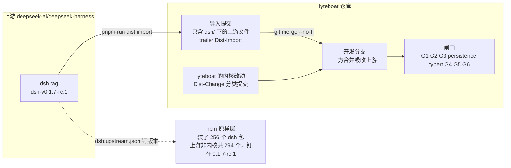

### 0.4 今天的数字

| 项 | 值 | 出处 |
|---|---|---|
| 内核包数 | 13 | `dsh/kernel.json:3-17` |
| 上游包总数 / 不在内核的 | 307 / 294 | `ls up:packages/*/*/package.json \| wc -l`（全部是 `@deepseek-ai/dsh-*`） |
| 工作区实际装的 npm dsh 包 | 256 个，全部 `0.1.7-rc.1` | **[实跑]** `ls node_modules/.pnpm \| grep '^@deepseek-ai+dsh' \| wc -l` |
| lyteboat 在内核上的差量 | agent-loop 和 session 两个包带着上游文件的改动：agent-loop 2 个文件 +88/−0，session 1 个 +9/−2；lyteboat 自有文件（`src/lyteboat/`、`tests/lyteboat/`）6 个 +341/−0：agent-loop 3 个 +210，session 2 个 +98，session-persistence 1 个测试 +33；碰内核的提交 `extend` 4 个、`build` 2 个 | **[实跑]** `node --import tsx scripts/dist/delta-report.ts` |
| 登记的扩展 | 3 个：`agent-loop-intake`、`agent-loop-pre-assemble`、`session-append-ignorable`，共 8 个契约键 | `dsh-compat/contract/extensions.yml:16-68` |
| G1 | `G1 contract vs dsh 0.1.7-rc.1: 19 registered difference(s), 0 failure(s)` | **[实跑]** `node --import tsx scripts/dist/contract-check.ts` |
| 最近一次全量闸门 | `pnpm run test` 153 文件 / 3009 通过 / 1 skip（其中 G1 19/0，G2 在内）；G4–G6 30/30 | `8b09937` 上的运行 |
| E1 落地时的内核闸门 | G2 中 session 与 persistence 的上游测试 1306 个通过；persistence 62 根 / 587 类型 / 0 差异 | `c5a553f` 提交信息 |
| G3、typert 的最近结果 | G3 183 包、931 测试文件，原样 tag 上通过 20698 个，lyteboat 内核上 0 回归；typert 0 失败。此后碰内核的提交（`b06f513`、`92c2f71`、`c5a553f`）都没有碰发布 Typert 文件的 dsh-llm（§5.4），它们的提交信息里也都没有这两道闸门 | `3d29a07` 提交信息 |

差量报告的提交表列出 6 个碰内核包目录的提交：`extend` 是 D1-4 `92698ff`、D1-5 `4870926`、项目改名 `b06f513`（两个 agent-loop 扩展的事件名与导出名随之改名，登记表的键跟着改）和 F2-1 `c5a553f`（§10）；`build` 是 `7dde6f9`（§3.5）和 `92c2f71`，两个都只改内核注释里登记表的路径。

### 0.5 最重要的五条规则

1. **内核外优先。** 新行为先做成 lyteboat 插件、seam provider 或 lyteboat 自有 seam；实在不行才改内核，而且内核只收 harness 级能力（`CLAUDE.md:72`）。
2. **内核只通过分类提交改变。** 碰 `dsh/<group>/<package>/` 的提交必须带 `Dist-Change` 和该类要求的 trailer（`CLAUDE.md:73`）。
3. **契约只增不减，而且要登记。** 删除必定失败；改动（只能是放宽）和追加都必须在 `extensions.yml` 登记，并由一个 `extend` 提交点名（`CLAUDE.md:74`；`scripts/dist/contract-check.ts:94-107`）。
4. **上游测试永不修改。** 环境差异只在测试装置里适配（`CLAUDE.md:75`）。
5. **历史不改写。** 同步用合并；不 force-push，不改写已推送的提交（`CLAUDE.md:183`、`:195`）。

### 0.6 与参考实现对照

| 话题 | 参考实现 | lyteboat |
|---|---|---|
| 引擎代码的归属 | 参考实现的 `core/` 是自己写的引擎，规则是 core 自包含（参考实现 `CLAUDE.md:38`） | 引擎是 dsh 的 13 个包。源码在 `dsh/`，但包名和契约属于上游；lyteboat 的改动都是登记过的差量 |
| 组件怎么接起来 | `Lifecycle` / `Plugin` 协议 + `AppContext`，由 `app.py` 组装（参考实现 `CLAUDE.md:39`、`:49-57`） | cordis 插件 + `ctx` 上的服务 + `inject`；组合是 YAML 数据（profile、bundle、patch），见 §0.7 |
| 版本号 | `pyproject.toml` 写 `x.y.z.n`；用 release commit 的短 SHA 作下次发版的边界（参考实现 `docs/RELEASING.md:14`、`:27`） | 仓库里保持上游版本号，打包时才盖 `+lyteboat.<commit>`；差量的边界是最近一次 `Dist-Import` 提交 |
| "兼容"指什么 | wheel 使用方看到的公开 API（发版说明里的 Breaking Changes） | 与同版本官方 dsh 在协议、接口、行为上一致，由 G1–G6 机器证明 |
| 分支 | 只推 `claude/*`（参考实现 `CLAUDE.md:140`） | 只推任务指定的分支（实践中是 `c-willis/*`），从不推 main、master、develop（`CLAUDE.md:183`） |
| 发版产物 | wheel + `RELEASE_NOTES.md` | 还没有：lyteboat 仓库没有 git tag；`CHANGELOG.md` 按里程碑记录交付了什么，开头就写明还没有发过版（`CHANGELOG.md:3`）；15 个 `@lyteboat/*` 包都是 `0.0.1` 且 `private: true`（见 §7.6） |

### 0.7 术语：正文直接用到的 dsh 词汇

| 词 | 意思 | lyteboat 里的例子 | 近似的参考实现概念 | 出处 |
|---|---|---|---|---|
| cordis 插件、服务、`inject` | cordis 是 dsh 底下的插件框架。插件是带 `apply(ctx)` 的对象或 `Service` 子类；服务在 `ctx` 上占一个稳定的键（`ctx.llm`、`ctx.sessions`）；`inject` 列出依赖的服务，服务不在，插件就停在等待状态 | `lyteboat/plugins/distro/src/index.ts:21` 的 `super(ctx, 'lyteboatDistro')` 发布服务；`distro-aware.mjs` 的 `export const inject = ['lyteboatDistro']` 依赖它（§4.4） | `Plugin(Lifecycle)` + `AppContext`，但依赖由框架按服务键解析，而不是组装根手工传递 | `up:docs/cordis-primer.md:9-11` |
| 事件与派发模式 | 服务用声明合并声明事件名，按 `emit`、`waterfall`、`parallel`、`serial`、`bail` 之一派发；**派发模式是事件公开契约的一部分** | 契约快照 `events.json` 为每个事件记下模式，G1 比对它（§4.1） | 回调 / hook 列表 | `up:docs/cordis-primer.md:12`、`:15-27` |
| waterfall 与 `next()` | 环绕式中间件：监听器收到 `(...args, next)`，调 `next()` 交给下一个，不调就短路后面所有监听器 | `dsh/core/agent-loop/src/agent.ts:279-282` 派发 `lyteboat/intake`，链尾的默认值是 `{ kind: 'pass' }`；lyteboat 规定 waterfall 监听器必须调 `next()`（`CLAUDE.md:82`） | 中间件链 | `up:docs/cordis-primer.md:29-35` |
| seam、provider | seam 是一个可替换的能力：一个服务定义（占 `ctx.<key>`）、一个或多个 provider、一个或多个消费方 | `ctx.llm` 由内核 `dsh-llm` 定义，npm 上的 `dsh-llm-deepseek` 是 provider（它对 `dsh-llm` 是 peer 依赖）；lyteboat 列出的 seam 见 `CLAUDE.md:62` | Protocol + 可替换实现（参考实现的 DIP 规则） | `up:docs/glossary.md:9` |
| profile、bundle、patch、行（row） | bundle 是作者分发的组合，profile 是用户用 `--profile <名字>` 启动的东西；patch 是一个 YAML 数组，里面是插件"行"（`id` + 包名 `name` + 可选 `config`/`disabled`），或按 `id` 覆盖已有行、用 `- insert:` 插入新行的操作。启动时按 bundle → profile → `$DSH_HOME` → `--patch` 的顺序叠加 | `lyteboat/bundles/host/cordis.patch.yml:10-24` 先按 `id` 覆盖 dsh-base 的 `session-log-deepseek` 行和 `session-telemetry-otel` 行（后者 `disabled: true`，F1 加的），再用 `- insert:` 插入从 `id: lyteboat-distro` 开始的 lyteboat 服务行；`config dump --profile run` 的输出里能看到 `# == @deepseek-ai/dsh-base, patched by @lyteboat/run` 这样的层标记（§2.4） | `app.py` 里的组装代码，只是这里变成了数据 | `up:docs/user/develop/basic/publish.md:16`、`:56`、`:119-125` |
| 预设（preset） | dsh 的 `dsh-agent-preset-registry` 对"一组插件行"的叫法；lyteboat 把业务 agent 目录声明成预设 | `lyteboat run --agents ./lyteboat/agents --agent finance` | 一个 agent 的定义 | `CLAUDE.md:204-205` |
| Typert Host face、Remote client | 上游生成器从 TypeScript 类型生成的运行时反射产物：包导出 `./typert`（Host face）和 `./remote`（Remote client），文件是 `lib/typert.*` | dsh-llm 的 `lib/typert.host.{js,d.ts}`、`lib/typert.remote-client.{js,d.ts}`（§5.4） | 无直接对应；类似按 schema 生成的客户端 | `up:packages/typert/generator/README.md:86`；`up:packages/typert/protocol/README.md:12` |
| 准入（admission） | rc.1 起 `dsh-app-boot` 在启动时读每一行所属包的磁盘清单，`@deepseek-ai/dsh*` peer 与运行版本不匹配就禁用该行 | 这条规则让 lyteboat 包的非内核 dsh peer 必须写精确版本（§8.2） | 无 | `up:packages/boot/app-boot/src/plugin-compatibility.ts:61-88` |
| 契约键 | 契约快照里一条 JSON 路径，用 `' › '` 连接 | `events › @deepseek-ai/dsh-agent-loop › lyteboat/intake` | 无 | `scripts/dist/contract-check.ts:27-28` |
| 内核、原样层、晋升 | lyteboat 拥有源码的 dsh 包；从 npm 原样安装的其余 dsh 包；把原样层的包收进内核 | 见 §1、§5 | — | `dsh/kernel.json`；`CLAUDE.md:76` |

---

## 1. 三层包与同名接管

### 1.1 三层

| 层 | 是什么 | 在哪里声明 | 怎么解析 | 怎么跟上游 |
|---|---|---|---|---|
| **内核** `dsh/` | lyteboat 拥有的 13 个 dsh 包，保留 `@deepseek-ai/dsh-*` 包名：`llm/llm`、`core/session`、`core/system-prompt`、`core/tools`、`skill/skill`、`core/agent`、`core/agent-loop`、`session/session-projection`、`session/session-persistence`、`session/session-persistence-jsonl`、`compaction/compaction`、`compaction/compaction-basic`、`test-support/agent-loop-testkit` | 权威清单是 `dsh/kernel.json`。`pnpm-workspace.yaml:16-29` 的 overrides 和根 `tsconfig.json` 的 references 是它的镜像；`scripts/upstream-pins.spec.ts:31-34` 核对 overrides 与清单一致 | overrides 把每个内核包名改写成 `workspace:*`；lyteboat 自己的清单也写 `workspace:*` | 每个 tag 一个导入提交，三方合并（§2） |
| **npm 原样层** | 上游其余 294 个 dsh 包都不改源码；工作区实际装其中 256 个：seam 与 provider、可选插件、基础设施、Web 产品等 | `pnpm-workspace.yaml:64-150` 的 `catalogs.dsh`（85 项）、`:151-156` 的 `catalogs.cordis`、`dsh.upstream.json` | `.pnpmfile.cjs:10-14` 把所有非内核的 `@deepseek-ai/dsh*` 依赖改写成 `dsh.upstream.json` 里的版本 | 改 catalog、版本钉文件和精确 peer（§8） |
| **lyteboat 层** `lyteboat/` | `@lyteboat/*`：`apps/cli`、`bundles/{host,run}`、`plugins/{distro,tool-policy,aux-llm,request-context,intake-guard,skill-router,a2ui,history-import}`、`core/{contracts,cordis-compat}`、`agents/finance`、`tooling/testing`，共 16 个（`CLAUDE.md:22-37`） | 工作区 glob `lyteboat/*/*`（`pnpm-workspace.yaml:7`） | `workspace:*` | 不适用 |

**一个包归哪一层，看什么？** 规则在 `CLAUDE.md:76`，满足任一条就进内核：

- lyteboat 第一次需要**改它的实现**。只是配置它，或用 provider 替换它，都不算。
- 它是**每个 lyteboat 组合启动都离不开的能力**。llm 和 skill 就是按这一条进来的，与 tools、sessions 并列。

原样层要定制时，只走配置、provider、bundle 与 patch 层或 lyteboat 插件，永远不改源码（蓝图 §4）。

### 1.2 同名接管：怎么让整张依赖图只有一份内核

同名接管靠四个机制配合。

**机制一：`overrides`**（`pnpm-workspace.yaml:12-32`）

```yaml
# Every kernel package resolves to its workspace copy, for lyteboat's packages and for
# every npm package that depends on it (dsh-base, the other dsh plugins, a community
# plugin), so the whole graph shares one instance: lyteboat's.
overrides:
  "@deepseek-ai/dsh-llm": "workspace:*"
  "@deepseek-ai/dsh-session": "workspace:*"
  # … 共 13 个内核包
  "rolldown": "1.1.1"
```

为什么必须是 override，而不是 lyteboat 自己在 dependencies 里写 `workspace:*`？因为引用内核的不只是 lyteboat 的包：

- dsh-base 的服务行按包名挂载，例如 `up:packages/bundle/base/cordis.patch.yml:34-35` 的 `name: '@deepseek-ai/dsh-llm'`。
- npm 上的包以 **peerDependencies** 声明内核包：`dsh-llm-deepseek` 对 `dsh-llm` 是 peer；`dsh-tool-skill` 对 `dsh-llm`、`dsh-skill`（以及 `dsh-agent`、`dsh-tools`）都是 peer（`node_modules/@deepseek-ai/<包>/package.json`）。
- 社区插件同样以 peer 形式依赖内核包。

只有 override 能改写整张图里每一处对这些名字的解析，peer 也不例外。

**机制二：`.pnpmfile.cjs` 钉其余一切**（`.pnpmfile.cjs:1-14`）

```js
// … The kernel packages (dsh/kernel.json)
// are left alone: pnpm-workspace.yaml overrides route them to the workspace, and
// this hook runs after the overrides, so pinning them would undo the route.
function pinned(name) {
  if (kernel.has(name)) return undefined
  if (name === '@deepseek-ai/dsh' || name.startsWith('@deepseek-ai/dsh-')) return upstream.dsh
  return upstream.cordis[name]
}
```

为什么需要这个钩子？上游发布的 dsh 包彼此之间用 caret 范围互相依赖。不钉的话，一次干净安装会漂到比 lyteboat 开发时更新的预发布版本（`.pnpmfile.cjs:1-4`）。

**机制三：公开提升**（`pnpm-workspace.yaml:34-42`）

`publicHoistPattern` 把 `@deepseek-ai/*` 和 `@lyteboat/*` 提升到根 `node_modules`。原因有两个：

- agent 目录（`lyteboat run --agents`）里的行用裸包名，从 agent 目录向上查找。
- 组合测试从仓库根解析行。

pnpm 的隔离布局下，只有提升到根的包才能被这两种查找找到。所有包都被机制二钉在同一个版本，所以提升不会产生版本冲突。

**机制四：`rolldown` 钉版本**（`pnpm-workspace.yaml:30-32`）

把打包器钉在上游 lockfile 的 `1.1.1`，未改动的内核包就能构建出与 npm 发布物逐字节相同的 bundle（蓝图 §16 第 8 条）。这是 G4 能做"两棵树只差内核"对照的前提（§6.7）。

**谁守着这些配置？** `scripts/upstream-pins.spec.ts` 属于 vitest 项目 `source`（`vitest.config.ts:25` 包含 `scripts/**/*.spec.ts`），`pnpm run test` 跑它，所以 CI 每次都跑。它断言：

- overrides 恰好路由内核（`:31-34`）；
- dsh catalog 不含任何内核包（`:36-38`）；
- 两个 catalog 与 `dsh.upstream.json` 一致（`:19-29`）；
- lyteboat 包的 dsh peer 规则成立（`:40-54`，见 §8.2）。

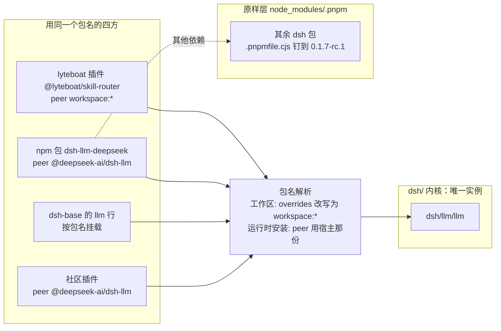

### 1.3 例子：证明只有一个实例

**[实跑]** 从仓库根执行：

```console
$ readlink node_modules/@deepseek-ai/dsh-llm node_modules/@deepseek-ai/dsh-skill node_modules/@deepseek-ai/dsh-agent-loop
../../dsh/llm/llm
../../dsh/skill/skill
../../dsh/core/agent-loop
$ ls node_modules/.pnpm | grep -cE '^@deepseek-ai\+dsh-(llm|session|system-prompt|tools|skill|agent|agent-loop|session-projection|session-persistence|session-persistence-jsonl|compaction|compaction-basic|agent-loop-testkit)@'
0
```

第二条命令输出 0，说明 store 里没有任何内核包的 npm 副本。

再把 `node_modules/`、`lyteboat/`、`dsh/` 下所有名为内核包名的符号链接都数一遍，看它们指向哪里。**[实跑]**：

```console
$ names=$(node -p "Object.keys(require('./dsh/kernel.json').packages).map(n => n.split('/')[1]).join(' ')")
$ for n in $names; do find node_modules lyteboat dsh -path "*/node_modules/@deepseek-ai/$n" -type l; done > /tmp/kernel-links.txt
$ wc -l < /tmp/kernel-links.txt
450
$ xargs -a /tmp/kernel-links.txt -n1 readlink -f | grep -vc "^$PWD/dsh/"
0
```

450 个链接，没有一个落在 `dsh/` 之外。

历史对照：

- 蓝图 §15.2 用另一种计数法，在 11 个内核包时记录为"344 个链接全部解析到 dsh/"。
- D1-3（`1c87683`）在首次导入后记录为 257 个。
- 第一版在 `3d29a07` 上数出 425 个。多出的 25 个里，21 个来自 V1–F2 新加的四个包（`aux-llm`、`request-context`、`intake-guard`、`agents/finance`）各自 `node_modules` 下的内核链接。

计数法不同，数字不能直接比；要比的是结论："零个落在 dsh/ 之外"。

**运行时装进来的插件也一样。** 直接证据是 G5：它用 `dsh plugin --profile headless add` 把 23 个社区插件分别装进官方树和 lyteboat 树的 headless profile，`dsh-compat/tests/canaries/g5.spec.ts:29-33` 的 `kernelCopiesInProfile` 列出 profile 自己的 store 里有没有内核包副本，`:70` 断言结果为空。上游文档说的是同一条解析规则，但它的上下文是用本地路径链接进来的插件（`dsh plugin add ./path`）：`up:docs/user/develop/basic/publish.md:103` 写"peers present in the running dsh's runtime resolution use the installation's copy"。所以对 npm 安装的插件，以 G5 的断言为准，文档只作补充。

### 1.4 三种插件怎么用上 lyteboat 的内核

| | 社区插件（不认识 lyteboat） | lyteboat 自己的插件 | 想用 lyteboat 扩展的第三方插件 |
|---|---|---|---|
| 怎么写 | 按官方 dsh 写，peer 依赖 `@deepseek-ai/*` | 工作区包，内核 peer 写 `workspace:*`；类型直接来自 `dsh/` 源码 | 同社区插件，另加 `inject: ['lyteboatDistro']`；agent-loop 两个扩展的类型从 `@lyteboat/contracts` 引，`session-append-ignorable` 的类型就在 lyteboat 内核 `@deepseek-ai/dsh-session` 的 `append` 签名上（§11.3） |
| 自动得到 lyteboat 的内部改进（fix、redesign、compat） | 是 | 是 | 是 |
| 能用追加能力（extend） | 不用，也不受影响 | 能 | 能 |
| 放到官方 dsh 上 | 照常工作 | 不能（本来就是 lyteboat 的一部分） | 停在 `pending (waiting for service: lyteboatDistro)`，不会半工作 |

出处：蓝图 §8 E6；`dsh-compat/COMPAT.md:46`；`b3aac4f` 提交信息。第三种插件的实跑例子见 §4.4。

---

## 2. 上游线与同步

### 2.1 导入提交：上游线上的每一个点

**规则**（`CLAUDE.md:194`）：

- 每个 tag 的内核是**一个导入提交**。
- 它的树里只有 `dsh/<dir>/`：
  - 文件逐字节来自 tag；
  - `package.json` 用 npm 发布的清单；
  - `tsconfig.json` 的 references 只保留内核内的包。
- 它的父提交是上一次导入，靠 `Dist-Import` trailer 找到。
- **没有分支指向它**；开发分支靠合并把它带进来。

**实现** 在 `scripts/dist/import-upstream.ts`：

| 做什么 | 代码位置 | 为什么 |
|---|---|---|
| `IMPORT_TRAILER = 'Dist-Import'`；`lastImport()` 用 `git log --grep=^Dist-Import: ` 找最近一次导入 | `:45-52` | 不需要分支名，就能在历史里找到上游线的末端 |
| 要求 checkout 的 `HEAD` 正好在一个 tag 上（`git describe --tags --exact-match HEAD`） | `:119` | 导入提交的标题和 `Dist-Import` 值就是这个 tag |
| 在 `$LYTEBOAT_DIST_CACHE` 下用 npm 装一棵该版本的原版树（`vanillaTree('import', …)`） | `:121-122`；`scripts/dist/trees.ts:123-129` | 发布清单只能从 registry 拿到，所以导入需要能访问 registry |
| `package.json` 取 npm 发布的清单 | `:82-84` | 上游源码里的 `workspace:` 范围要经过 `pnpm publish` 解析；不用发布清单，lyteboat 工作区装不上（蓝图 §16 第 2 条） |
| `tsconfig.json` 只留内核内的 references | `:54-63` | 指向原样层包的引用在 lyteboat 里没有源码可引 |
| 包若导出 `./typert` 或 `./remote`，拷入发布的 `lib/typert.*` | `:68-75` | 这些文件只能由上游全仓分析生成（§5.4） |
| 用 `git add --all --force` → `write-tree` → `commit-tree -p <lastImport>` 生成提交，不经工作区 | `:94-107` | `--force` 保证 lyteboat 的 `.gitignore` 不会漏掉 tag 里的文件（`:99`） |
| 提交信息写 `Dist-Import: <tag>` 与 `Dist-Upstream-Commit: <sha>`，之后可跟 `--trailer "Key: value"` 传入的额外 trailer | `:112-118`、`:127-140`（额外 trailer 在 `:138`） | 前者给下一次导入找父提交，后者记录精确的上游提交 |
| 与上次导入的树相同则打印 `nothing to merge` | `:142-145` | 上游这个 tag 没动内核时，不产生空合并 |
| 首次导入打印 `git merge --no-ff --allow-unrelated-histories <commit>`，之后打印 `git diff --stat <parent> <commit>` 和 `git merge --no-ff <commit>` | `:146-149` | 首次导入是根提交，与分支没有共同祖先 |

**真实的上游线。** **[实跑]** `git log -2 --format='%h  parents=%p  %s' --grep='^Dist-Import: '` 输出：

```text
33841ae  parents=bd9d657  dist(import): dsh-v0.1.7-rc.1 kernel
bd9d657  parents=93e1e1f  dist(import): dsh-v0.1.7-rc.1 kernel
```

`bd9d657` 的父提交 `93e1e1f` 是上游线的根，也就是 lyteboat 的首次导入，没有父提交。

| 导入提交 | tag | 父提交 | 包数 | 树中文件数 | 上游提交 | 由哪个合并带入 |
|---|---|---|---|---|---|---|
| `93e1e1f` | 首次导入 | 无（根提交） | 11 | 235 | `00102833` | `ddc5af4` D1-2（首次，`--allow-unrelated-histories`） |
| `bd9d657` | dsh-v0.1.7-rc.1 | `93e1e1f` | 11 | 235 | `46a7f68b` | `edbe7bb` `dist(sync): track dsh-v0.1.7-rc.1` |
| `33841ae` | dsh-v0.1.7-rc.1（**同一 tag 再导入**） | `bd9d657` | 13 | 278 | `46a7f68b` | `3d29a07` `dist(promote): …` |

文件数用 `git ls-tree -r --name-only <commit> | wc -l` 统计。

**怎么在历史里看到上游线。** 导入提交只作为合并提交的**第二个父提交**挂在历史里。所以沿第一父提交走的日志看不到它们，从合并的第二父提交出发才看得到。**[实跑]**：

```console
$ git log --first-parent --oneline --grep='^Dist-Import: ' 3d29a07
$ git log --oneline -2 3d29a07^2
33841ae dist(import): dsh-v0.1.7-rc.1 kernel
bd9d657 dist(import): dsh-v0.1.7-rc.1 kernel
```

第一条命令没有输出：开发分支自己的提交链上没有任何导入提交。第二条从 `3d29a07` 的第二父提交 `33841ae` 出发，走出的就是上游线，再往前是根提交 `93e1e1f`。

`33841ae` 的完整提交信息，也就是工具写出的模板：

```text
dist(import): dsh-v0.1.7-rc.1 kernel

The 13 kernel packages of deepseek-ai/deepseek-harness at dsh-v0.1.7-rc.1, as
scripts/dist/import-upstream.ts writes them: every file byte for byte, except
package.json (the manifest npm publishes for this version) and tsconfig.json
(references limited to kernel packages); a package with a Typert Host face or
Remote client also carries its published lib/typert.* files.

Dist-Import: dsh-v0.1.7-rc.1
Dist-Upstream-Commit: 46a7f68b0922371ce7144b668b90e377d8e799f4
```

**为什么没有 `upstream-dsh` 分支？** 蓝图 §4、§5 画了一个 `upstream-dsh` 分支，实际没建（蓝图 §16 第 1 条）：

- 推一个新分支需要额外授权；
- 靠 `Dist-Import` trailer 找父提交，三方合并的效果完全一样；
- rc.1 同步已经验证过这一点。

### 2.2 为什么是三方合并，而不是 rebase 或补丁文件

蓝图 §5 比较了三种方式：

| 方式 | 代表 | 代价 |
|---|---|---|
| rebase | OpenShift | 每次同步改写历史，违反"不 force-push" |
| 补丁文件 | Electron | 要一套导入导出工具，冲突发生在补丁文本上 |
| **合并（lyteboat 采用）** | git-buildpackage | 不改写历史；git 做三方合并（旧 tag、新 tag、lyteboat 分支）；冲突就在代码里 |

合并式的另一个好处：lyteboat 在内核上的全部差量，随时可以用 `git diff <最近导入> HEAD -- dsh/` 看到。

**[实跑]** `git diff --stat 33841ae HEAD -- dsh/` 的输出正好就是 lyteboat 携带的全部内容：

```text
 dsh/core/agent-loop/src/agent.ts                   |  85 +++++++++++++++++
 dsh/core/agent-loop/src/index.ts                   |   3 +
 dsh/core/agent-loop/src/lyteboat/step-hooks.ts     |  64 +++++++++++++
 dsh/core/agent-loop/tests/lyteboat/intake.spec.ts  | 103 +++++++++++++++++++++
 .../agent-loop/tests/lyteboat/pre-assemble.spec.ts |  43 +++++++++
 dsh/core/session/src/index.ts                      |  11 ++-
 dsh/core/session/src/lyteboat/append-ignorable.ts  |  40 ++++++++
 .../tests/lyteboat/append-ignorable.spec.ts        |  58 ++++++++++++
 dsh/kernel.json                                    |  18 ++++
 .../tests/lyteboat/reopen-ignorable.spec.ts        |  33 +++++++
 dsh/tsdown.config.ts                               |  21 +++++
 11 files changed, 477 insertions(+), 2 deletions(-)
```

其中 `dsh/kernel.json` 和 `dsh/tsdown.config.ts` 属于发行版自身，不在任何内核包目录里；其余 9 个文件分属 agent-loop、session、session-persistence 三个包（§0.4）。第一版在 `3d29a07` 上跑的是 `git diff --stat 33841ae 3d29a07 -- dsh/`，只有这 5 个 agent-loop 文件和这两个文件：7 个文件、+337/−0。

下图画的是提交历史。箭头表示时间顺序；虚线是"合并带入导入提交"。上游线没有分支名。晋升之后没有新的导入：`33841ae` 仍是上游线的末端，此后的内核改动（包括 F2 的 extend `c5a553f`）都是开发分支上的分类提交。

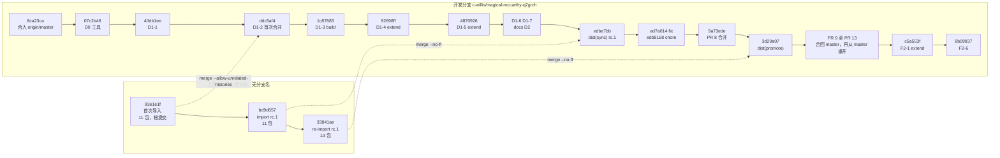

**对照：发行版模型之前是怎么同步的。** `5f804cd`（fork 时期对 `@lyteboat/agentic-loop` 的一次上游重同步）的做法是：

- 用 `scripts/sync-upstream.ts` 把上游的 src 和 tests 拷过来；
- "the lyteboat hunks in src/agent.ts were re-applied by hand from the diff"，也就是 lyteboat 的改动靠人手重放。

三方合并取代了人工重放。D1-6（`4a98679`）删掉了 `scripts/sync-upstream.ts`（−104 行）。

### 2.3 一次同步的完整步骤：以 dsh-v0.1.7-rc.1 为例

规则原文在 `CLAUDE.md:195`，目标是"一周一次同步，一次可以跨越期间所有 tag"。下表逐步对照 rc.1 那次同步：导入 `bd9d657`，合并 `edbe7bb`；蓝图 §15.4 有记录。这次同步带进 156 个上游提交，几乎都在内核之外。

**前置条件**（写在前面，因为不满足时工具会在中途失败）：

- 能访问 npm registry：`dist:snapshot` 和 `dist:import` 都会在 `$LYTEBOAT_DIST_CACHE`（默认 `~/.cache/lyteboat-dist`）下装一棵原版树（`scripts/dist/snapshot.ts:43`、`scripts/dist/import-upstream.ts:122`、`scripts/dist/trees.ts:123-129`）。
- 上游 checkout 的 `HEAD` 正好停在新 tag 上：`dist:import` 用 `git describe --tags --exact-match HEAD` 取 tag，不在 tag 上就失败（`import-upstream.ts:119`）。
- 第 7 步的 overlay 闸门另有要求：checkout 的 `HEAD` 等于 `dsh.upstream.json` 的 `commit`（`scripts/dist/overlay.ts:55`），而且在 checkout 里 `pnpm install` 过（见 §6.5）。所以第 5 步改完版本钉之后才能跑它们。

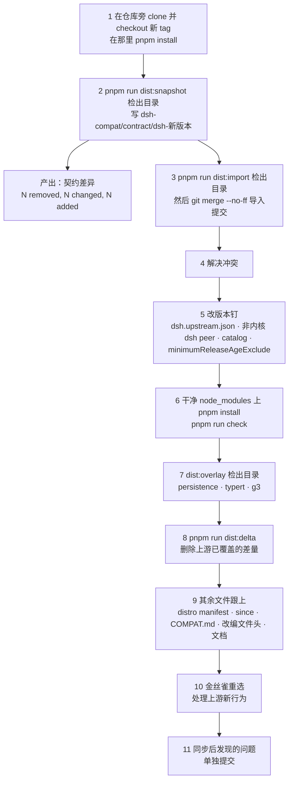

| 步 | 命令 | 产出 | rc.1 实际情况 |
|---|---|---|---|
| 1 | `git clone https://github.com/deepseek-ai/deepseek-harness /home/user/deepseek-ai/dsh-0.1.7-rc.1 && git -C /home/user/deepseek-ai/dsh-0.1.7-rc.1 checkout dsh-v0.1.7-rc.1 && (cd /home/user/deepseek-ai/dsh-0.1.7-rc.1 && pnpm install)` | 仓库旁的上游 checkout，`HEAD` 就在 tag 上 | `/home/user/deepseek-ai/dsh-0.1.7-rc.1`；overlay 闸门要用这棵装好依赖的树（约 2 GB，蓝图 §16 第 3 条） |
| 2 | `pnpm run dist:snapshot <checkout>` | `dsh-compat/contract/dsh-0.1.7-rc.1/` 五个文件；若钉住的版本已有快照且版本不同，外加一行差异 `contract <旧> → <新>: N removed, N changed, N added`（`scripts/dist/snapshot.ts:32`、`:51-52`） | 0 removed、0 changed、0 added，含持久化根；上游 `persistence-schema.json` 只有源码行号变了，摘要全同。旧快照随后删除，`contract/` 只保留 rc.1（`edbe7bb`） |
| 3 | `pnpm run dist:import <checkout>`，按它的提示 `git diff --stat …` 再 `git merge --no-ff <commit>` | 导入提交 `bd9d657`；合并提交 | 上游在内核里只改了 11 个 `package.json`（+167/−167：版本号和依赖排序，`git diff --stat 93e1e1f bd9d657`）；src/ 和 tests/ 一行没变；合并无冲突，两个 extend 原样保留 |
| 4 | 编辑冲突文件 | — | 无冲突。蓝图 §8 E2 回放过更大的一跳（0.1.5-alpha.2 → 0.1.7-rc.1）：唯一冲突是 agent-loop 的"首请求开新 series"改动碰上上游把 `replaceGeneration` 改名为 `contentGeneration`；另有一处 hunk 变空，按 drop 删掉 |
| 5 | 手工编辑 | `dsh.upstream.json`（版本、tag、commit，cordis 各包版本取自 tag 的 `vendor/*/package.json`）、非内核 dsh peer、catalog、`minimumReleaseAgeExclude` | dsh catalog 85 项；lockfile "only @deepseek-ai packages moved; 593 third-party entries are unchanged"；cordis、tsdown、rolldown 版本不变（`edbe7bb`） |
| 6 | `pnpm install`（见 §8.5 的 release-age 处理），`pnpm run check` | lint、test、dsh-compat 全绿 | `pnpm run test` 126 文件 / 2623 通过 / 1 上游 skip；G1 16/0；G2 91 文件 / 2491；G4 5/5、G5 23/23、G6 2/2 |
| 7 | `pnpm run dist:overlay <checkout> persistence`、`… typert`、`… g3` | 三行汇总（§6） | persistence 62 根 / 587 类型 / 0 差异；G3 171 包、893 测试文件，原样 tag 上通过 19890 个，lyteboat 内核上 0 回归（typert 闸门那时还没有，晋升时才加入） |
| 8 | `pnpm run dist:delta` | Markdown 差量表 | 没有可删的差量：两个 extend 的退出条件都不成立 |
| 9 | 手工编辑 | distro manifest 的 `DSH_BASE`、扩展的 `since`、`COMPAT.md`、改编文件头（`Adapted from deepseek-ai/deepseek-harness`，`CLAUDE.md:197`）、`THIRD_PARTY_NOTICES.md`、CLAUDE.md、README、版本测试 | 版本测试改为读 `dsh.upstream.json`，不再写死版本号（`edbe7bb`） |
| 10 | 见 §9.5 | 更新的 `canaries.yml` | 移除 2 个、补入 1 个：24 → 23，见 §2.4 问题二 |
| 11 | 独立提交 | `ad7a014`、`edb8168` | 见下 |

蓝图 §15.4 对这次同步的总结是："人工处理项：0 个合并冲突、0 条契约差异；1 个需要改约定的上游新行为；2 个金丝雀替换"。其中"2 个金丝雀替换"准确地说是移除 2 个、只补回 1 个（`edbe7bb` 正文："two of the 24 G5 canaries … 23 canaries"）。

### 2.4 rc.1 同步遇到的四个问题

**问题一：rc.1 新加的插件准入把 lyteboat 自己的行禁用了。**

- **上游改了什么。** rc.1 的 `dsh-app-boot` 在启动时逐行检查插件清单里的 `@deepseek-ai/dsh*` peer：
  - profile 行走 `prepareProfilePatches`（`up:packages/boot/app-boot/src/compatibility-preflight.ts:180-187`）；
  - 预设行走 `prepareProfileEntries`（同文件 `:74-84`）。

  peer 与运行版本不匹配时，该行被禁用并写 stderr `disabling profile plugin …`（`:82`），整个 bundle 则被跳过并写 `skipping profile bundle …`（`up:packages/boot/app-boot/src/profile.ts:667`）。
- **为什么打到 lyteboat。** 准入读的是**磁盘上的** `package.json`，而 pnpm 在磁盘上保留 `catalog:dsh` 原文，不做解析。结果 `edbe7bb` 记录：launcher 跳过了 `@lyteboat/run`，禁用了 skill-router、a2ui、history-import 三行。
- **修法。** lyteboat 包的非内核 dsh peer 写成跟踪版本的精确值，也就是一次 publish 本来就会写出的值；由 `scripts/upstream-pins.spec.ts:40-54` 守住。详见 §8.2。
- **验证。** 用构建好的 launcher 跑 `node lyteboat/apps/cli/lib/bin.js config dump --profile run`，看 **stderr**：里面不能有 `disabling profile plugin` 或 `skipping profile bundle`。准入禁用的信号只在 stderr 上。**[实跑]**（临时 `LYTEBOAT_HOME`/`DSH_HOME`）：退出码 0，stderr 为空，stdout 有 103 个 `- id:` 行（第一版在 `3d29a07` 上是 100 个，多出的是 F2 的 `lyteboat-aux-llm`、`lyteboat-request-context`、`lyteboat-intake-guard`）。注意 stdout 里本来就有 5 行写着 `disabled: true`：dsh-base 的 `tool-plugin-manager`、`skill-badge`、`tool-ralph`，`@lyteboat/run` 关掉的 `hmr`，以及 `@lyteboat/host` 关掉的 `session-telemetry-otel`（F1，`lyteboat/bundles/host/cordis.patch.yml:18-19`）；另有 7 行是 dsh-base 的 `disabled: !!js …` 条件表达式。它们都是配置，与准入无关。`edbe7bb` 正文说的"no row disabled"指的也是准入禁用。

**问题二：两个金丝雀在官方 rc.1 上就装不上。**

- `dsh-tavily-pool` 要求 `<0.1.6`，`dsh-usage-calendar` 要求 `0.1.1-rc.1`，rc.1 的 peer 检查在安装时拒绝了它们（蓝图 §15.4 第 6 步）。
- 金丝雀的前提是"在官方版本上能跑"，所以按同一排序重选：
  - appends 类往后取 6 个 rc.1 能装的候选，换上第一个干净的 `@longnb47/dsh-agent-gateway`；
  - projections 类样本里只剩 1 个没试过，它有行不激活，这一类没有补。
- 结果是移除 2 个、补入 1 个，24 → 23（`edbe7bb`；`dsh-compat/tests/canaries/canaries.yml:5-17`）。

**问题三：rc.1 发布不到一天，pnpm 11 拒绝安装。**

- rc.1 本身及它新依赖的 `@deepseek-ai/libreoffice-kit*@0.1.0` 一族 6 个包，都按精确版本列进 `minimumReleaseAgeExclude`（`pnpm-workspace.yaml:435-440`）。
- 从旧 lockfile 重新解析的那一次安装，要加 `--config.minimum-release-age=0`，见 §8.5。

**问题四：G4–G6 并行时互相删掉对方的安装树。**

- **症状。** 三个测试文件各自打包内核、安装同一棵树。树过期时，每个文件都删掉重装，一个 pnpm 的工作目录在另一个 pnpm 运行中被删掉（`ENOENT: uv_cwd`）。
- **为什么之前没发现。** 树有缓存时问题不出现；rc.1 同步用的是冷树，才暴露出来。
- **修法。** `ad7a014` 让 G4–G6 所在的 vitest 项目（当时叫 `conformance`，今天叫 `dsh-compat`，`vitest.config.ts:46`）逐个文件运行，`fileParallelism: false`（`vitest.config.ts:49-51`），单独成一个 `fix:` 提交。

---

## 3. 改动分类与提交约定

### 3.1 先问：能不能不碰内核

这是 §0.5 的第一条规则（`CLAUDE.md:72`），也是蓝图 §7 决策流程的第一问。

- 能在内核外做的，放 lyteboat 层。
- 内核只接 harness 级能力，从不接业务词汇（资产、人设、产品文案都在 `lyteboat/agents/*`，`CLAUDE.md:78`）。

改内核是一个设计决定：设计文档要写明为什么放不到外面，以及属于哪一类；动手前还要和用户确认（`CLAUDE.md:125`）。

V1、F1、F2 三个里程碑都是这条规则的实例。V1 的金融智能体没有改内核（`CHANGELOG.md` 的 V1 条目）。F1 让路由过的会话能重开，办法是把路由选中的技能正文改成 dsh 自己的 skill-invocation 消息，不再写 lyteboat 自己的节点（`ab2c5ae`）。F2 的请求上下文和准入搭在人类消息的 `source` 与已有的 `lyteboat/intake` 上（`200ec40` 正文："No kernel change: the verdict needs no room in the reply."），一个工具结果的多张卡片走 `meta.lyteboat.cards`（`ea8c45a`）。只有一件事在内核外做不到：让 `Session.append` 写 `ignorable` 标记。它是 F2 唯一的内核改动，§10 把它从头走一遍。

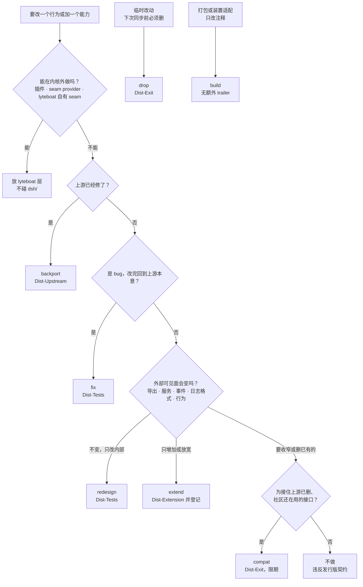

### 3.2 七类改动

机器可读的定义是 `scripts/dist/delta-report.ts:30-38` 的 `CHANGE_CLASSES`；含义和同步时的处理来自蓝图 §7。

| 类 | 含义 | 契约影响 | 同步时怎么处理 | 代码要求的 trailer | 惯例上还带 |
|---|---|---|---|---|---|
| `backport` | 提前拿来的上游修复 | 无 | 基线包含它之后变成空改动，删除 | `Dist-Upstream` | — |
| `fix` | lyteboat 修的内核 bug，行为回到上游本意 | 无 | 上游也修了就删 | `Dist-Tests`（先失败后通过的回归测试） | — |
| `extend` | 追加能力或扩展点 | 只增（含放宽签名），并在 `extensions.yml` 登记 | 保留，直到上游提供等价能力 | `Dist-Extension` | `Dist-Contract`、`Dist-Exit`、`Dist-Tests` |
| `redesign` | 内部重写：几行钩子加一个 `src/lyteboat/` 模块 | 无，由 G1–G6 证明 | 保留；上游对被替换逻辑的改动进入"移植队列" | `Dist-Tests` | — |
| `compat` | 为还在用的社区插件保留上游已删的接口 | 追加（旧接口） | 到期删除 | `Dist-Exit` | 在 `COMPAT.md` §5 与 `Dist-Exit` 写到期版本，即某个 dsh release（`COMPAT.md:50`） |
| `drop` | 临时改动（生成物、试验开关） | 无 | 下次同步前必须删除 | `Dist-Exit` | — |
| `build` | 打包与装置适配、内核里只改注释 | 无 | — | 无 | — |

两点背景：

- **`build` 是实践中加的第七类**（蓝图 §16 第 5 条）。适配工作几乎都在内核外（根配置、`dsh-compat/tests/upstream-harness`）。`dsh/` 里的 `build` 提交有两个，都只改内核注释里登记表的路径：§3.5 的 `7dde6f9`，以及目录改名为 `dsh-compat/` 时的 `92c2f71`。
- **`Dist-Extension` 也是实践中加的**，用来把 `extend` 提交连到登记表条目。

### 3.3 trailer：哪些是机器强制，哪些是惯例

`pnpm run dist:delta -- --check`（`scripts/dist/delta-report.ts:8-15`、`:64-86`）强制以下四条：

1. 第一次导入之后，每个碰内核包目录的**非合并**提交都带 `Dist-Change`，并且是已知类别（`:51` 用 `--no-merges`，`:73-75`）。导入提交本身跳过（`:70`）。
2. 该类别要求的 trailer 存在（`:77-78`）。
3. 每个 `Dist-Extension` 的 id 都在 `extensions.yml` 里（`:79-81`）。
4. `extensions.yml` 里每个 id 至少被一个提交点名（`:84`），所以不会有从未落地的登记。注意它读的范围是"第一次导入..HEAD"（`:143-145`），历史上那个 `extend` 提交永远在范围内；所以代码删掉之后留下的登记它拦不住，那由 G1 的 stale 规则拦住（`contract-check.ts:108-112`，§4.2）。

它**不检查**的：

- `Dist-Contract` 是否存在，`extend` 是否带 `Dist-Exit`。这两项是惯例（`CLAUDE.md:73`："wherever the contract or an exit condition is involved"）。
- **合并提交**。同步或晋升的合并提交里如果夹带了 `dsh/<pkg>/` 下的 lyteboat 改动，这个检查看不见。可以手工核对：先让 git 算出"干净合并"的树，再和实际的合并提交比。**[实跑]**：

  ```console
  $ T=$(git merge-tree --write-tree 9a73ede 33841ae | head -1)
  $ git diff --stat $T 3d29a07 | tail -1
   31 files changed, 2015 insertions(+), 667 deletions(-)
  $ git diff --stat $T 3d29a07 -- $(node -p "Object.values(require('./dsh/kernel.json').packages).map(d => 'dsh/' + d + '/').join(' ')")
  ```

  最后一条没有输出：晋升合并自己带的 31 个文件（路由、清单、快照、工具、文档，见 §5.2）全在内核包目录之外。对 `edbe7bb` 做同样的核对（父提交 `d6ec884`、`bd9d657`），合并自带 27 个文件，也都不在内核包目录里。**[实跑]** 对 `3d29a07..HEAD` 里的 9 个合并提交（PR #7、#9–#13 的六个合并，以及 `f0892cf`、`5701641`、`f1fc862` 三次把 master 合进分支）逐个做同样的核对，没有一个在内核包目录下带自己的改动。
- **浅克隆**。它打印 `delta report: no Dist-Import commit in this shallow clone's history; skipped (fetch more history to report)` 后以 0 退出（`:136-141`）。

**[实跑]** `node --import tsx scripts/dist/delta-report.ts --check`，退出码 0，无输出。

### 3.4 例 1：D1-4，一个 extend 提交

`92698ff` 的完整提交信息（省略署名 trailer）：

```text
D1-4: @deepseek-ai/dsh-agent-loop — extend: the lyteboat/intake gate

Replays the lyteboat driver fork's intake hunks on the kernel's own agent loop,
under its published name:

- src/lyteboat/step-hooks.ts (lyteboat-owned): the `lyteboat/intake` waterfall on cordis
  Events, LyteboatIntakeDecision / LyteboatIntakeReply / LyteboatStepPayload, and
  LYTEBOAT_ASSISTANT_PROVIDER; exported from the package root.
- src/agent.ts: preStep dispatches `lyteboat/intake` after the inbox claim and
  before systemPrompt.assemble; turn() runs a `reply` as one step without a
  request (sticky max-tokens kept); replyStep/hasSystemNode log the reply as an
  empty system head (when none exists), the claimed user messages, and an
  assistant message from provider `lyteboat`; step() starts a request series while
  the session has no request header, so that head (or a history seed's) is
  replaced on in-history routes too.

The declarations previously lived in @lyteboat/contracts; the kernel cannot
import lyteboat, so they move here and contracts will re-export them.

Accepted: G1 reports 14 registered differences (the event and the four
exports, member by member), 0 failures; dsh/core/agent-loop tests: 25 files,
425 tests passed (upstream's 24 files unchanged plus tests/lyteboat/intake.spec.ts).

Dist-Change: extend
Dist-Extension: agent-loop-intake
Dist-Contract: additive — event lyteboat/intake; exports LYTEBOAT_ASSISTANT_PROVIDER, LyteboatIntakeDecision, LyteboatIntakeReply, LyteboatStepPayload
Dist-Exit: upstream dispatches a pre-assembly waterfall that can answer a step without a model request
Dist-Upstream: none (deepseek-ai/deepseek-harness accepts no external pull requests)
Dist-Tests: dsh/core/agent-loop/tests/lyteboat/intake.spec.ts
```

改动文件（`git show --stat 92698ff`）：

```text
 contract/extensions.yml                       |  23 +++++-
 dsh/core/agent-loop/src/agent.ts              |  79 ++++++++++++++++++++
 dsh/core/agent-loop/src/lyteboat/step-hooks.ts    |  56 ++++++++++++++
 dsh/core/agent-loop/src/index.ts              |   3 +
 dsh/core/agent-loop/tests/lyteboat/intake.spec.ts | 103 ++++++++++++++++++++++++++
```

登记表后来在 PR #8 中挪到 `compatibility/contract/extensions.yml`，又随 `92c2f71` 的目录改名到了今天的 `dsh-compat/contract/extensions.yml`。注意这个提交没有碰 `lyteboat/core/contracts`：正文说 "contracts will re-export them"，再导出是 D1-6（`4a98679`）做的（§4.5）。

每个 trailer 回答一个同步时会被问到的问题：

| trailer | 回答的问题 | 谁读它 |
|---|---|---|
| `Dist-Change: extend` | 这是哪类改动，同步时怎么处理？ | `delta-report` 按类统计与校验 |
| `Dist-Extension: agent-loop-intake` | 它对应登记表里哪一条？ | `delta-report` 双向校验（§3.3 第 3、4 条） |
| `Dist-Contract: additive — …` | 契约上多了什么？ | 人；机器侧由 G1 按登记表比对 |
| `Dist-Exit: …` | 上游做了什么之后它就该删？ | 每次同步时的人，以及 `delta-report` 的 exit 列 |
| `Dist-Upstream: none (…)` | 回馈上游了吗？ | 人；dsh 不接受外部 PR，所以写明原因 |
| `Dist-Tests: …` | 什么测试证明它？ | 人；该测试跑在 G2 项目里 |

"Accepted:" 一段写明跑了什么、接受了什么结果，这是 `CLAUDE.md:188` 对提交正文的要求。

### 3.5 例 2：`7dde6f9`，一个 build 提交，以及为什么要拆出来

PR #8（`9fbfa13`）把 `contract/` 和 `conformance/` 合并成 `compatibility/`（`92c2f71` 后来把它改名为今天的 `dsh-compat/`），这是一个内核外的目录重构。但内核里有 4 行注释写着旧路径。如果顺手在 `9fbfa13` 里一起改，这个提交就成了"碰内核却没有分类"的提交，`delta-report --check` 会拒绝它。所以 `9fbfa13` 的正文写明："Four comments in the kernel name the registry too; they change in the next commit, which is a classified kernel commit."

下一个提交 `7dde6f9`：

```text
chore: @deepseek-ai/dsh-agent-loop — build: name the extension registry by its new path

The comments on lyteboat's pre-assembly hooks (the one lyteboat line in
src/index.ts, src/lyteboat/step-hooks.ts, and the two tests under tests/lyteboat/)
point at compatibility/contract/extensions.yml, where the registry moved
in the previous commit. Comments only: the contract, the bundles, and
upstream's files outside lyteboat's own lines are unchanged.

Dist-Change: build
```

```text
 dsh/core/agent-loop/src/lyteboat/step-hooks.ts          | 2 +-
 dsh/core/agent-loop/src/index.ts                    | 2 +-
 dsh/core/agent-loop/tests/lyteboat/intake.spec.ts       | 2 +-
 dsh/core/agent-loop/tests/lyteboat/pre-assemble.spec.ts | 2 +-
```

这次重构前后的验收数字完全相同：126 文件、2623 测试，G1 16/0，G4–G6 30/30（`9fbfa13`；蓝图 §15.5）。重构也有不动的部分：`dsh/` 留在顶层，因为它的深度必须与上游 `packages/` 一致，上游 `tsconfig.json` 的 `extends: ../../../tsconfig.base.json` 才能落到正确的编译选项上（蓝图 §16 第 15 条）。

### 3.6 钩子写法：上游文件只加几行

**[实跑]** `grep -n '// lyteboat' dsh/core/agent-loop/src/agent.ts` 找到 4 处（第 58、276、340、473 行），都以 `// lyteboat:` 开头。`preStep` 里的钩子（`dsh/core/agent-loop/src/agent.ts:276-288`）：

```ts
    // lyteboat: the intake gate and the pre-assembly hook run before the prompt is
    // assembled, so a reply spends no assembly and routing done here shapes
    // this very step's request. The official driver has neither event.
    const intake = await this.dispatch.waterfall(
      'lyteboat/intake', { messages: claimed, ...position, signal },
      (): Promise<LyteboatIntakeDecision> => Promise.resolve<LyteboatIntakeDecision>({ kind: 'pass' }),
    )
    signal.throwIfAborted()
    if (intake.kind === 'reply') return { kind: 'reply', messages: claimed, reply: intake }
    await this.dispatch.waterfall(
      'lyteboat/pre-assemble', { messages: claimed, ...position, signal },
      (): Promise<void> => Promise.resolve(),
    )
```

声明与类型放在 lyteboat 自有的 `dsh/core/agent-loop/src/lyteboat/step-hooks.ts`，事件在 `:55` 和 `:62`。`index.ts` 只多 3 行（`dsh/core/agent-loop/src/index.ts:243-245`：一行 `// lyteboat:` 注释、两行导出）。

F2 的 `session-append-ignorable` 在 dsh-session 上用的是同一种写法（§10 第 5 步）。**[实跑]** `git diff -U0 33841ae HEAD -- dsh/core/session/src/index.ts` 是 5 处改动、+9/−2：`:24-25` 两行导入；`:37-38` 一行 `// lyteboat:` 注释和 `LyteboatAppendOptions` 的类型导出；`:727-728` 一行 `// lyteboat:` 注释和放宽的签名；`:730-731` 先把尾参数交给 `lyteboatAppendOptions` 拆开，上游原来读 `opts[0]` 的那一行改读拆出来的 surface intent；`:754` 把标记摊进事件信封。判断逻辑都在上游没有的 `dsh/core/session/src/lyteboat/append-ignorable.ts`。

为什么这样写：

- `CLAUDE.md:73`："a smaller carried hunk is a cheaper sync"。git 的冲突只发生在上游和 lyteboat 都改过的同一段或相邻的行；lyteboat 在上游文件里只动这几行，冲突也就通常落在它们附近。
- `src/lyteboat/` 是上游不存在的目录，永远不会冲突。这是 Brave 的 `chromium_src` 手法在 TypeScript 里的样子（蓝图 §8 E3）。
- 蓝图 §8 E3 还画了一个 `redesign` 的样子：`system-prompt/src/index.ts` 里 3 行钩子加 `src/lyteboat/assembly.ts`。那只是示意，**尚未落地**。

### 3.7 提交标题的格式

| 形式 | 用在哪 | 真实例子 |
|---|---|---|
| `<里程碑步骤>: <包> — <交付什么>` | 里程碑工作（`CLAUDE.md:188`） | `D1-6: lyteboat/ — one agent loop: the kernel's; the driver fork and --driver are gone` |
| **内核提交**：`<里程碑步骤或 conventional 前缀>: <包名> — <类别>: <交付什么>` | 碰 `dsh/<group>/<pkg>/` 的提交；类别写在破折号后，与 `Dist-Change` 一致。这是仓库里观察到的写法，`CLAUDE.md:188` 没有单独规定；两个改名提交 `b06f513`、`92c2f71` 也碰了内核，标题却按整件改动写，没有带类别 | `D1-4: @deepseek-ai/dsh-agent-loop — extend: the lyteboat/intake gate`；`chore: @deepseek-ai/dsh-agent-loop — build: name the extension registry by its new path`；`F2-1: @deepseek-ai/dsh-session — extend: Session.append can mark a record ignorable` |
| `dist(import): <tag> kernel` | 导入提交（工具生成） | `dist(import): dsh-v0.1.7-rc.1 kernel` |
| `dist(sync): track <tag>` | 同步合并 | `dist(sync): track dsh-v0.1.7-rc.1` |
| `dist(promote): …` | 晋升合并 | `dist(promote): dsh-llm and dsh-skill enter the kernel` |
| `fix:` / `chore:` / `docs:` | 其他 | `fix: conformance — run the G4–G6 files one at a time` |

提交正文写明现在能跑什么、接受了什么结果。提交、PR、代码注释和文件里一律不出现模型标识（`CLAUDE.md:189`）。

---

## 4. 契约与扩展登记

### 4.1 契约快照里有什么

快照在 `dsh-compat/contract/dsh-0.1.7-rc.1/`。这是仓库里保留的唯一一份：同步 rc.1 时，旧快照在契约差异为零后删除（`edbe7bb`）。它对应 `COMPAT.md:15-20` 列出的稳定面，其中 `api.json` 覆盖两行（`:15` 的导出和 `:16` 的模块增广）。`:21` 那行（会话写出的 JSONL 文件本身）没有快照，由 G6 证明。

| 文件 | 内容 | 现在的规模 **[实跑]** | 比对者 |
|---|---|---|---|
| `api.json` | 每个包、每个导出子路径下的每个导出名及其归一化 `.d.ts` 声明（类与接口逐个成员）；每个包另有 `augmentations`，记 cordis `Context`/`Events` 之外的模块增广 | 13 个包，648 个导出名 | G1 |
| `services.json` | cordis `Context` 上的服务键及类型 | 11 个：`agents`、`agentLoop`、`configuredAgentIdentities`、`compaction`、`llm`、`sessions`、`sessionPersistence`、`sessionProjections`、`skills`、`systemPrompt`、`tools` | G1 |
| `events.json` | cordis 事件、派发模式（emit/serial/parallel/waterfall）、签名 | 29 个。11 包时是 26 个，晋升带来 `llm/stream`、`llm/adapters-updated`、`skills/change` | G1 |
| `config.json` | 每个入口和导出插件类的 `name`、`inject`、schemastery `Config` | 13 个包 | G1 |
| `persistence.json` | 上游 `docs/persistence-schema.json` 的指纹：`sha256`、`formatVersion`、根摘要、类型摘要 | formatVersion 2，62 个根，587 个类型摘要 | overlay `persistence` |

**为什么持久化只存指纹？** 完整 schema 有 2.2 MB，比对只需要摘要，完整文件留在上游（蓝图 §16 第 4 条）。

**快照怎么生成？** `pnpm run dist:snapshot <checkout>`（`scripts/dist/snapshot.ts:38-53`）的步骤：

1. 在仓库外新装一棵该版本的原版树（需要 registry）；
2. 对它跑 `contract-gen`；
3. 写入持久化指纹，读的是 checkout 里的 `docs/persistence-schema.json`；
4. 若钉住的版本已有快照，**而且与这次的版本不同**，打印两者差异（`:20-36`、`:51-52`）。同版本重写（例如晋升）什么差异也不打印。

晋升时快照扩展了 dsh-llm 和 dsh-skill 两节，其余不变（`3d29a07`）。此后快照没有再动：**[实跑]** 今天的 `api`、`services`、`events`、`config` 四个文件与 `3d29a07` 的逐字节相同，`persistence.json` 只有 `$comment` 里的项目名随改名变了。E1 带来的差异不进快照，由登记放行（§4.2）。

### 4.2 G1 的规则

实现在 `scripts/dist/contract-check.ts`。

- **比什么。** lyteboat 工作区构建出的契约，按键逐个与快照比对。键是把 JSON 路径用 `' › '` 连起来的扁平路径（`:28`、`:57-65`），例如 `events › @deepseek-ai/dsh-agent-loop › lyteboat/intake`。
- **规则：**
  - 上游有、lyteboat 没有的键 → 失败，**永远**（`:94`）。
  - 值变了的键，或只有 lyteboat 有的键 → 失败，除非某条登记列出了这个键或它的前缀（`:95-107`）。
  - 登记里列出、却已经没有差异的键 → 失败，报 `stale registration`（`:108-112`）。这条保证登记表不会比扩展活得更久。
- **输出。** `G1 contract vs dsh <v>: N registered difference(s), N failure(s)`（`:131`）。
- **什么时候跑。** `pnpm run build` 不跑它；`pnpm run test` 先构建，再跑 `contract:check`（`package.json:12`、`:15`）。

**[实跑]**：

```console
$ node --import tsx scripts/dist/contract-check.ts
G1 contract vs dsh 0.1.7-rc.1: 19 registered difference(s), 0 failure(s)
```

为什么登记了 8 个键（intake 5 个，`extensions.yml:26-30`；pre-assemble 1 个，`:44`；session-append-ignorable 2 个，`:60-61`），却有 19 个"登记差异"？登记用前缀匹配，而 G1 按成员逐个计数：D1-4 的一个事件和四个导出展开成 14 个差异（`92698ff` 正文），D1-5 的一个事件又贡献 2 个（`4870926` 正文："16 registered differences"），E1 贡献 3 个：`Session › append` 的声明变了，新导出的接口 `LyteboatAppendOptions` 展开成 `$declaration` 和成员 `ignorable` 两个追加（`c5a553f` 正文："G1 19 registered differences, 0 failures"；逐键列表见 §10 第 7 步）。

### 4.3 `extensions.yml` 逐字段

以现存的第一条为例（`dsh-compat/contract/extensions.yml:16-36`）：

```yaml
  - id: agent-loop-intake
    package: '@deepseek-ai/dsh-agent-loop'
    kind: event
    surface: >-
      The `lyteboat/intake` waterfall, dispatched after the inbox claim and before prompt assembly; a
      `reply` answers the claimed messages with an assistant message (source provider `lyteboat`) inside
      one step and no model request. …
    contract:
      - events › @deepseek-ai/dsh-agent-loop › lyteboat/intake
      - api › @deepseek-ai/dsh-agent-loop › exports › . › LYTEBOAT_ASSISTANT_PROVIDER
      - api › @deepseek-ai/dsh-agent-loop › exports › . › LyteboatIntakeDecision
      - api › @deepseek-ai/dsh-agent-loop › exports › . › LyteboatIntakeReply
      - api › @deepseek-ai/dsh-agent-loop › exports › . › LyteboatStepPayload
    since: lyteboat on dsh 0.1.7-rc.1 (carried from the lyteboat driver fork since M2)
    exit: >-
      Upstream dispatches a pre-assembly waterfall that can answer a step without a model request
      (agent/pre-step fires after assembly and cannot); then @lyteboat plugins listen to it instead.
    tests:
      - dsh/core/agent-loop/tests/lyteboat/intake.spec.ts
```

| 字段 | 含义 | 谁用它 | 为什么需要 |
|---|---|---|---|
| `id` | 扩展的唯一名，必填且不能重复（`contract-check.ts:42-55`） | `Dist-Extension` trailer、`delta-report`、`ctx.lyteboatDistro.has(id)` | 把代码、提交、登记、运行时四处连起来 |
| `package` | 扩展所在的内核包 | 差量报告、distro manifest | 同步时知道去哪个包看上游变化 |
| `kind` | `event` \| `api` \| `api-option` \| `service` \| `config`（`extensions.yml:12`）；今天用到 `event`（两条）和 `api-option`（`session-append-ignorable`，`:53`） | distro manifest | 第三方插件据此知道扩展的形状 |
| `surface` | 插件看到的是什么，人读 | `COMPAT.md` §4 的读者 | 契约键说不清行为语义 |
| `contract` | G1 放行的键（前缀匹配） | G1 | 精确划定"允许不同"的范围；多一个键都会失败 |
| `since` | 从哪个 lyteboat/dsh 版本开始 | distro manifest；同步时更新（`edbe7bb`） | 让使用方判断可用性 |
| `exit` | 让它变得多余的上游变化 | 同步时的人、差量报告 | 扩展默认是**临时**的；这是删除它的触发条件 |
| `tests` | 证明它的测试 | 人；这些测试跑在 G2 项目里 | 追加的行为也要有测试兜住 |

### 4.4 `lyteboatDistro`：把登记表带到运行时

- **为什么需要它。** 装好的构建里没有 `extensions.yml` 和 `dsh.upstream.json` 这两个文件。插件想知道自己是否跑在 lyteboat 上、某个扩展在不在，就需要运行时的事实。
- **怎么生成。** `scripts/dist/gen-distro-manifest.ts` 把两个文件编译成 `lyteboat/plugins/distro/src/distro-manifest.ts`：`DSH_BASE = '0.1.7-rc.1'`（`:6`）、`DISTRO_EXTENSIONS` 三条（`:9-13`）。
- **服务。** `@lyteboat/distro` 发布 `ctx.lyteboatDistro`，提供 `dsh`、`extensions`、`has(id)`（`lyteboat/plugins/distro/src/index.ts:16-27`）。
- **挂载位置。** host bundle 把 `lyteboat-distro` 行放在 lyteboat 所有服务行的第一个（`lyteboat/bundles/host/cordis.patch.yml:21-24`）。
- **防过期。** `pnpm run lint` 带 `--check` 跑一次生成器，产物过期就失败（`package.json:14`）。**[实跑]** 退出码 0。

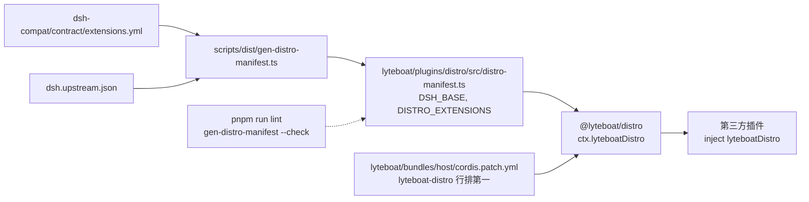

**例子：按第三方写法的插件。** 仓库里的 fixture `lyteboat/bundles/run/tests/fixtures/plugins/distro-aware.mjs`：

```js
export const name = 'example-distro-aware'
export const inject = ['lyteboatDistro']

export function apply(ctx) {
  ctx.on('lyteboat/intake', async () => ({
    kind: 'reply',
    plugin: name,
    content: [{ type: 'text', text: `lyteboat on dsh ${ctx.lyteboatDistro.dsh}: ${ctx.lyteboatDistro.extensions.map(extension => extension.id).join(', ')}` }],
  }))
}
```

**[实跑]** 用 §6.13 的脚本（起脚本化模型、临时 `LYTEBOAT_HOME`，再调用构建好的 launcher）：

```console
$ node /path/to/scripted-run.mjs run --plugin lyteboat/bundles/run/tests/fixtures/plugins/distro-aware.mjs "hello"
exit=0 requests=0 []
stdout: lyteboat on dsh 0.1.7-rc.1: agent-loop-intake, agent-loop-pre-assemble, session-append-ignorable
stderr: lyteboat: session session-3206c672-702b-4b9f-b29e-df6709b3d3e6
```

脚本化模型收到 **0** 次请求，因为 `lyteboat/intake` 的 `reply` 不发模型请求。作为对照，不带插件的 `run "hello"` 输出 `exit=0 requests=2 [loop,title]`：一次主循环请求，一次会话标题请求。stderr 那一行是 F1 加的：`lyteboat run` 每次都把会话 id 打到 stderr，供 `--session-id` 续写。

放到官方 dsh 上，同一个插件没有 `lyteboatDistro` 可注入，cordis 让它停在 `pending (waiting for service: lyteboatDistro)`，而不是调用一个不存在的事件（`b3aac4f` 正文；`dsh-compat/COMPAT.md:46`）。

有一点要注意：仓库内的插件大多监听 `lyteboat/*` 事件却**没有** inject `lyteboatDistro`：`@lyteboat/tool-policy`（`lyteboat/plugins/tool-policy/src/index.ts:120`）、`@lyteboat/skill-router`（`lyteboat/plugins/skill-router/src/index.ts:232`）。它们本来就只随 lyteboat 发布，这条要求只针对仓库外的第三方插件（`COMPAT.md:46`）。F2 新加的两个宿主服务照第三方的写法做了：`@lyteboat/aux-llm` 用 `session-append-ignorable`（`lyteboat/plugins/aux-llm/src/index.ts:95-96`），`@lyteboat/intake-guard` 用 `agent-loop-intake`（`lyteboat/plugins/intake-guard/src/index.ts:60-61`），都 inject 了它。skill-router 又 inject 了 `auxLlm`（`lyteboat/plugins/skill-router/src/index.ts:211`），所以放到官方 dsh 上，它也会跟着停在等待状态。

### 4.5 例子：`lyteboat/intake` 扩展的完整生命周期

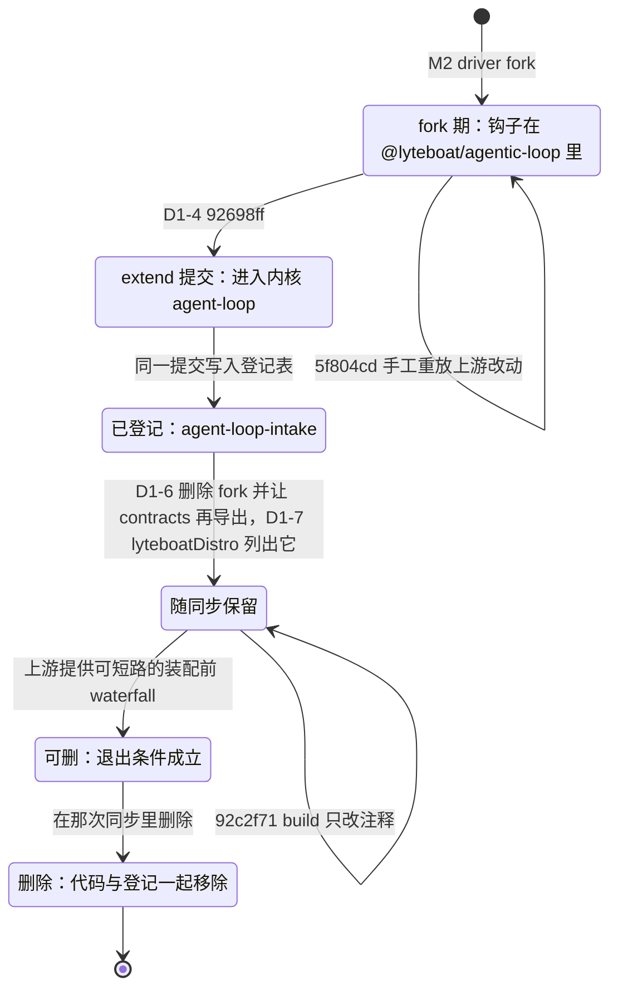

| 阶段 | 提交 | 发生了什么 | 哪个机制保证 |
|---|---|---|---|
| 诞生 | M1–M2 | 钩子最早在 lyteboat 自己 fork 的 agent-loop（`@lyteboat/runtime`，后改名 `@lyteboat/agentic-loop`）里，`since` 字段仍记着"carried from the lyteboat driver fork since M2" | — |
| 手工同步 | `5f804cd` | 升级上游时靠人手从 diff 重放 | 无；这正是发行版模型要消除的 |
| 进内核 | `92698ff` D1-4 | 同一提交里：钩子行 + `src/lyteboat/step-hooks.ts` + `tests/lyteboat/intake.spec.ts` + 登记条目。声明挪进内核；`@lyteboat/contracts` 的再导出在 D1-6 | `delta-report` 校验 trailer 与登记；G1 放行登记的键 |
| fork 退场 | `4a98679` D1-6 | fork 和 `--driver` 删除，只剩内核这一个 agent loop；`@lyteboat/contracts` 改为从内核再导出这些声明（正文："@lyteboat/contracts re-exports LYTEBOAT_ASSISTANT_PROVIDER, IntakeDecision, IntakeReply, and LyteboatStepPayload from the kernel"；今天在 `lyteboat/core/contracts/src/index.ts:30-43`，`LyteboatIntakeDecision` 以 `IntakeDecision` 的别名导出） | — |
| 运行时可见 | `b3aac4f` D1-7 | `ctx.lyteboatDistro.has('agent-loop-intake')` 为真 | `gen-distro-manifest --check` |
| 跨同步 | `edbe7bb` | rc.1 合并无冲突，扩展原样保留；`since` 更新 | 三方合并；G1 16/0；G2 |
| 路径变更 | `7dde6f9` | 注释改指新路径，归为 `build` 类 | `delta-report --check` |
| 改名 | `b06f513` | 项目改名：事件名和四个导出名换成今天的写法，登记条目的 id 不变、`contract` 键跟着改；归为 `extend`，`Dist-Contract` 写的是 "renamed extension surface — …" | `delta-report --check`；G1 16/0（`b06f513` 正文） |
| 路径变更 | `92c2f71` | 目录 `compatibility/` 改名为 `dsh-compat/`，内核注释里登记表的路径跟着改，归为 `build` 类 | `delta-report --check` |
| 退出（未来） | — | 上游一旦提供"装配前、可不发请求就回答一步"的 waterfall，lyteboat 插件改听上游事件；在那次同步里删掉钩子、`src/lyteboat/step-hooks.ts` 和登记条目 | 代码删了而登记还在：G1 的 stale 规则失败（`contract-check.ts:108-112`）；登记新写了却没有任何提交点名：`delta-report` 第 4 条失败 |

**第三条登记：`session-append-ignorable`。** 蓝图 §6.3 和 §8 E1 设计过它，第一版这里写的还是"计划中、尚未落地"。它在 F2 的第一步落地（`c5a553f`）：`Session.append` 能给本构建不认识的非 surface 类型写 `ignorable: true`，kind 为 `api-option`，登记在 `extensions.yml:51-68`。动机和计划不同：计划要解决的"路由过的会话打不开"，F1 已经在内核外解决了（§3.1）；它服务的是旁路模型调用的审计记录 `lyteboat/aux-llm-call`（`CLAUDE.md:79-80`）。§10 按时间顺序把它从头走一遍。

### 4.6 不承诺的东西

`COMPAT.md:52-58` 列出了 lyteboat **不**承诺与官方一致的五样东西。插件依赖它们，换到 lyteboat 上出了问题，不算 lyteboat 违约：

| 不承诺 | 为什么 | 例子 |
|---|---|---|
| 包内模块结构、`lib/` 下的文件名，以及任何从包的 `exports` 够不到的东西 | 契约只按 `exports` 生成（§4.1）；lyteboat 在包里加 `src/lyteboat/` 本来就改变了内部结构 | `dsh/core/agent-loop/src/lyteboat/step-hooks.ts`、`dsh/core/session/src/lyteboat/append-ignorable.ts` 在官方包里不存在 |
| 未导出的符号，私有或 `#private` 类成员 | 同上，G1 只比公开声明 | — |
| 性能特征、时序，以及派发模式本身不规定的事件顺序 | G4 的归一化专门去掉计时字段（§6.7） | `session-log.ts` 的 `TIMING_KEYS` 包括 `time`、`dt`、`delayMs` |
| 会话日志和 dsh 文档声明为持久的文件以外的缓存与文件 | 只有会话日志有 G6 证明 | — |
| 版本字符串 | lyteboat 打的包是 `<上游版本>+lyteboat.<commit>`；semver 忽略构建元数据，所以按上游版本写的 peer 范围照样匹配 | §8.1 |

---

## 5. 晋升进内核

### 5.1 规则，以及它为什么改过

`CLAUDE.md:76`（`3d29a07` 修订后）规定，npm 上的 dsh 包在以下任一情况下进入内核：

- lyteboat 第一次必须改它的实现；
- 它是每个 lyteboat 组合启动都需要的能力。

晋升要做五件事：

1. 加进 `dsh/kernel.json`、overrides 和根 `tsconfig.json` 的 references；
2. 把 lyteboat 对它的所有引用改成 `workspace:*`；
3. 重新导入 tag；
4. 从那个提交起，它受 G1–G3 管；
5. 如果它发布 Typert 文件，这些文件随导入一起进来（§5.4）。

蓝图 v7 §4 当时的判断是"llm 和 skill 暂留原样层：它本身就是 seam"。修订后的规则取代了这一判断，理由见 `3d29a07` 正文：模型访问、工具、技能、会话，是每个 lyteboat 组合启动都离不开的能力，现在都应该是 lyteboat 自己的源码。

### 5.2 llm 与 skill 的晋升，逐项

`3d29a07` 相对 PR #8 合并点 `9a73ede` 的改动，**[实跑]** `git diff 9a73ede 3d29a07 -- …`：

| 项 | 改了什么 | 例子 |
|---|---|---|
| 内核清单 | `dsh/kernel.json` 加两行 | `+    "@deepseek-ai/dsh-llm": "llm/llm",`、`+    "@deepseek-ai/dsh-skill": "skill/skill",` |
| 路由 | `pnpm-workspace.yaml` 的 overrides 加两行；dsh catalog 删掉这两项 | `+  "@deepseek-ai/dsh-llm": "workspace:*"`；`-    "@deepseek-ai/dsh-llm": "0.1.7-rc.1"`（catalogs.dsh 下） |
| 新工具依赖 | `dsh-typert-generator` 进 dsh catalog、根 devDependencies（`package.json:32`）和 `minimumReleaseAgeExclude` | 为 typert 闸门服务 |
| lyteboat 的引用 | peer、dependencies、devDependencies 全部改成 `workspace:*`，涉及 cli、run、contracts、a2ui、history-import、skill-router、tool-policy、testing 和根 `package.json:30` | `lyteboat/plugins/skill-router/package.json` 的 peer `"@deepseek-ai/dsh-llm": "0.1.7-rc.1"` → `"workspace:*"`，依赖 `"@deepseek-ai/dsh-skill": "catalog:dsh"` → `"workspace:*"` |
| TypeScript 工程引用 | 根 `tsconfig.json` 加 `./dsh/llm/llm`、`./dsh/skill/skill`；引用它们的 lyteboat 包也加上 | `lyteboat/bundles/run/tsconfig.json`、`lyteboat/plugins/skill-router/tsconfig.json` 等 |
| 导入 | `33841ae`：两个包逐字节进来；dsh-llm 的 4 个 Typert 文件（`lib/typert.host.{js,d.ts}`、`lib/typert.remote-client.{js,d.ts}`，`git ls-files dsh/llm/llm/lib`）；9 个原有内核包的 `tsconfig.json` 恢复对 llm 的引用 | 晋升前，`normalizedTsconfig` 把这些引用当作"非内核"删掉了（`git diff --stat bd9d657 33841ae -- 'dsh/*/*/tsconfig.json'` 列出这 9 个，外加两个新包）。加上新导入的 dsh-skill，现在 `grep -l 'llm/llm' dsh/*/*/tsconfig.json` 列出 10 个；`3d29a07` 正文写的"10 kernel packages"是这个总数 |
| 工具 | 新文件 `scripts/dist/typert.ts`；`import-upstream.ts`、`bundle-kernel.ts`、`overlay.ts` 加入 Typert 处理 | §5.4 |
| G2 装置 | 新增一条适配：标准装饰器先用 `ts.transpileModule` 降级，因为 dsh-llm 的源码用了 `@Remote` | `dsh-compat/tests/upstream-harness/README.md:14` |
| 契约 | rc.1 快照加上 dsh-llm、dsh-skill 两节，其余不变 | `api.json` +1024 行、`config.json` +52、`events.json` +16、`services.json` +6，全是增加 |
| 文档 | CLAUDE.md（布局、晋升规则、完成标准第 5 条、同步步骤、命令表）、README、`dsh-compat/README.md` 的闸门表 | 这几处今天在 `CLAUDE.md:21`、`:77`、`:155`、`:196`、`:239` |

在 lyteboat 包的清单里，peer 的写法随晋升经历了三个阶段：

| 时间点 | peer 写法 | 原因 |
|---|---|---|
| rc.1 之前 | `catalog:dsh` | 当时的惯例 |
| `edbe7bb` | `0.1.7-rc.1` | 应对准入（§8.2） |
| `3d29a07` | `workspace:*` | 它成了内核包 |

### 5.3 为什么晋升是一次"同 tag 再导入 + 合并"

- **为什么要再导入。** 新进内核的包也必须出现在上游线上；否则下一次同步时，它没有"旧 tag"一侧可比，三方合并就退化成两方覆盖。
- **怎么再导入。** 先在工作区里把新包加进 `dsh/kernel.json`（导入工具按工作区里的这个文件决定导入哪些包，`import-upstream.ts:66`、`scripts/dist/kernel.ts:34-37`），再对**同一个** tag 跑一次 `dist:import`。`lastImport()` 找到上一次 rc.1 导入 `bd9d657` 作父提交。
- **结果。** 新导入与父提交只差两个新包和恢复的 references：`git diff --stat bd9d657 33841ae` 为 52 个文件，+11376/−2。合并它就是一次普通的三方合并。
- **路由改动放在哪个提交。** 在 `3d29a07` 里，kernel.json、overrides、catalog、tsconfig、lyteboat 清单这些改动**就在 `dist(promote)` 这个合并提交本身**：`33841ae` 只含 `dsh/<dir>/`，而 `git diff 9a73ede 3d29a07` 包含它们（§3.3 用 `git merge-tree` 数出合并自带 31 个文件，都在内核包目录外）。为什么不先单独提交路由？因为路由和源码必须同时生效：只有路由没有源码，overrides 指向一个工作区里还不存在的包，安装解析不了；只有源码没有路由，npm 副本仍在 store 里，接管不成立。代价是这些改动躲过了 `delta-report --check`（它跳过合并提交），所以要用 §3.3 的办法手工核对，确认合并里没有夹带内核包目录下的改动。

**[实跑]** 晋升后的解析结果：`readlink node_modules/@deepseek-ai/dsh-llm` 为 `../../dsh/llm/llm`；store 里没有 `@deepseek-ai+dsh-llm@…` 或 `@deepseek-ai+dsh-skill@…` 目录（§1.3）。

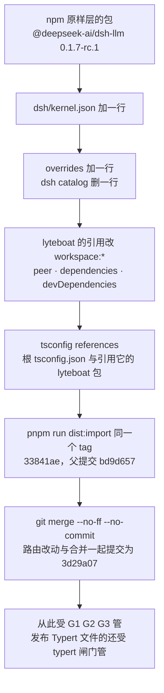

### 5.4 Typert 文件：为什么要随导入带进来，以及怎么保证它不过期

**为什么运行时需要它们**（`3d29a07` 正文）：

- `dsh-typert-loader` 会导入每个已挂载包的 `./typert`（`up:packages/typert/loader/src/index.ts:40`，`TYPERT_HOST_EXPORT = './typert'`）；
- `dsh-api-remotes` 导入 `@deepseek-ai/dsh-llm/remote`（`up:packages/api/remotes/src/client/index.ts:10`）。

**为什么 lyteboat 自己生成不了。** 上游的生成器要分析**整个上游 workspace**：Host face 还反映了其他包合并进 dsh-llm 类型里的声明。lyteboat 的工作区容纳不了这种分析。

**规则：**

1. 导入时拷入发布的 `lib/typert.*`（`scripts/dist/import-upstream.ts:68-75`，筛选逻辑在 `scripts/dist/typert.ts:26-30`）。
2. 每次 `pnpm run build` 都对发布 Typert 文件的包跑 `checkTypert`（`scripts/dist/bundle-kernel.ts:45-60`）：
   - 文件缺了就失败（`:49-50`）；
   - 在 `HEAD`（同步进行中还有 `MERGE_HEAD`）的历史里找最近一次导入提交；**一个都找不到就直接返回，不做任何比较**（`:51-54`）；
   - 找到时，接受条件是二选一：`src/` 和 Typert 文件都等于某个导入（`:55-56`）；或 `dsh/typert.json` 记录的摘要等于当前 `src/` 的摘要（`:57`，摘要算法在 `scripts/dist/typert.ts:37-47`）。
3. 两者都不满足时，构建抛错，并提示去跑 `dist:overlay … typert --write`（`bundle-kernel.ts:58-59`）。
4. `--write` 在上游 checkout 里用 lyteboat 的源码重新生成文件，并写入摘要（`scripts/dist/overlay.ts:249`）。

**这项校验在 CI 里是空的。** CI 用 `actions/checkout@v4` 且没有设 `fetch-depth`（`.github/workflows/ci.yml:26`），默认只取 1 层历史。浅克隆里 `lastImport('HEAD')` 找不到任何 `Dist-Import` 提交，于是第 2 条在 `:54` 直接返回。仓库自己也承认 CI 的默认 checkout 太浅（`delta-report.ts:19-21`）。所以这项校验只在本地完整克隆上生效；要让 CI 也生效，得给 checkout 加 `fetch-depth: 0`，而改 `.github/` 需要明确授权（`CLAUDE.md:187`）。

现状：

- 13 个内核包里只有 dsh-llm 发布 Typert 文件。dsh-skill 的 exports 只有 `.`、`./src/*`、`./package.json`。
- `dsh/typert.json` 目前**不存在**：llm 的源码与导入完全相同，还没有触发过 `--write`。`CLAUDE.md:21` 的布局里列出它，指的是 `--write` 之后才会出现的文件。

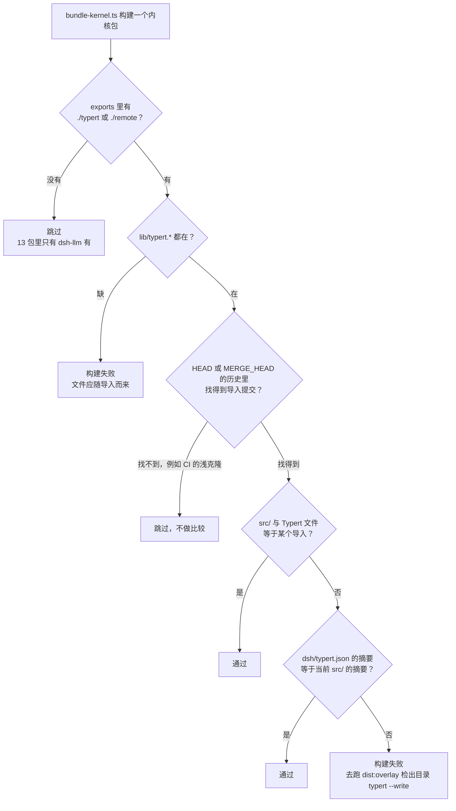

### 5.5 晋升的验收

`3d29a07` 正文记录的结果：

- lint、typecheck 通过。
- `pnpm run check`：
  - G1 16/0；
  - 140 文件、2932 测试通过，1 个上游 skip；
  - 其中 G2 为 105 文件、2800 测试，包括 dsh-llm 的 13 个、dsh-skill 的 1 个上游测试文件；
  - compatibility 30/30。
- persistence 62/587/0。
- typert 0 失败（上游生成器 workspace 模式，23 个 contributor）。
- G3：183 个依赖内核的包、931 个测试文件；原样 tag 上通过 20698 个，lyteboat 内核上 0 回归。
- 发布的 bundle 25 个里 23 个与 npm rc.1 逐字节相同。两个例外：
  - agent-loop，因为 lyteboat 的扩展；
  - JSONL 的 `worker.cjs`，因为它内联的非内核 dsh 包取自 npm 的 `lib/`，上游取自源码。
- 解析："No npm copy of either remains in the store; both names resolve to dsh/."

这 25 个文件是 21 个 bundle（13 个 `lib/index.js`、7 个 `lib/invariant.js`、JSONL 的 `lib/worker.cjs`）加 dsh-llm 的 4 个 Typert 文件。E1 之后 dsh-session 的 bundle 也不同了：**[实跑]** 把今天的构建与 `~/.cache/lyteboat-dist/vanilla-0.1.7-rc.1-dsh-compat` 里 npm 发布的同名文件逐个 `cmp`，25 个里 22 个相同，不同的是 agent-loop 与 session 的 `lib/index.js`（lyteboat 的扩展），以及 JSONL 的 `worker.cjs`（原因同上）。

---

## 6. 验证方法

### 6.1 总表

`dsh-compat/README.md:9-18` 是闸门表的原文。下表补上最新结果。

| 闸门 | 证明什么 | 在哪里 | 怎么跑 | 何时 | 最新结果 |
|---|---|---|---|---|---|
| **G1** 契约 | lyteboat 内核构建具有该版本的契约；每处差异都已登记 | `scripts/dist/contract-check.ts`、`dsh-compat/contract/` | `pnpm run test`（先构建再 `contract:check`）；单独：构建后 `pnpm run contract:check` | 每次改动，CI | 19 登记 / 0 失败（**[实跑]**） |
| **G2** 上游测试 | 上游的内核测试原样跑在 lyteboat 源码上并通过 | vitest 项目 `dsh`（`vitest.config.ts:28-40`）、`dsh-compat/tests/upstream-harness/` | `pnpm run test`；单独：`npx vitest run --project dsh` | 每次改动，CI | 107 个文件（**[实跑]** 按 `vitest.config.ts:35-36` 的 glob 和排除表静态计数；`3d29a07` 时 105 个，多出的是 E1 的两个 `tests/lyteboat/` 文件）。测试数最近一次单列是 `3d29a07` 的 2800 个、1 个上游 skip；E1 时 session 与 persistence 的上游测试 1306 个通过（`c5a553f`）；`8b09937` 上 `pnpm run test` 整体 153 文件 / 3009 通过 / 1 skip |
| **G3** 跨包 | 依赖内核的官方包，在 lyteboat 内核上仍通过它们自己的测试 | `scripts/dist/overlay.ts` 的 `g3`（`:169-199`） | `pnpm run dist:overlay <装好依赖的上游 checkout> g3 [--match <regex>]` | 每次同步 | 183 包、931 文件；原样 tag 上通过 20698 个，lyteboat 内核上 0 回归（`3d29a07`；此后的提交信息都没有记录 G3） |
| **persistence** | 上游从 lyteboat 源码推导出的持久化 schema 等于该版本的；`known-event-types.ts` 等于上游生成的 | `overlay.ts` 的 `persistence`（`:94-121`） | `pnpm run dist:overlay <checkout> persistence` | 每次同步；以及任何可能触及持久化类型的内核改动 | 62 根、587 类型、0 差异（`c5a553f`，E1 改了 `Session.append` 之后；第一版记的耗时约 30 秒） |
| **typert** | lyteboat 构建用的 `lib/typert.*` 等于上游生成器从 lyteboat 源码生成的 | `overlay.ts` 的 `typert`（`:214-256`）、`scripts/dist/typert.ts` | `pnpm run dist:overlay <checkout> typert [--write]` | 每次同步；以及任何改动发布 Typert 文件的内核包时 | 0 失败，23 个 contributor（`3d29a07`） |
| **G4** 日志等价 | 同一脚本化运行，官方版本与 lyteboat 写出相同的归一化会话日志 | `dsh-compat/tests/scenarios/` | `pnpm run dsh-compat` | 合入 lyteboat-next 前；每次同步 | 5/5 |
| **G5** 金丝雀 | 锁定版本的社区插件用 `dsh plugin --profile headless add` 安装后，在两边行为相同，且绑定到 lyteboat 内核 | `dsh-compat/tests/canaries/` | `pnpm run dsh-compat` | 同上 | 23/23 |
| **G6** 会话往返 | 一方写的会话，另一方续写的结果与写方自己续写的相同 | `dsh-compat/tests/roundtrip/g6.spec.ts` | `pnpm run dsh-compat` | 同上 | 2/2（G4–G6 合计 30 个测试；rc.1 时 3 分 57 秒，目录合并后 3 分 38 秒；晋升后与 `8b09937` 上都是 30/30） |

### 6.2 各闸门在什么时候跑

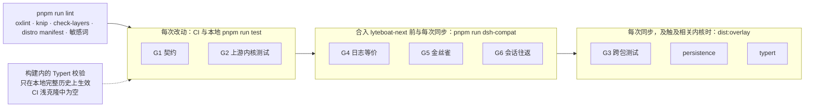

**CI 实际跑什么。** `.github/workflows/ci.yml`：Node 22 和 24 两个矩阵（`:24`），环境变量 `DSH_TELEMETRY_DISABLED: '1'`（`:11`），`actions/checkout@v4` 取默认的浅克隆（`:26`），依次运行：

1. `pnpm install --frozen-lockfile`
2. `pnpm run lint`
3. `pnpm run typecheck`
4. `pnpm run test`

（`:32-35`）。所以 G1、G2 在 CI 里；构建内的 Typert 校验虽然也在 `pnpm run test` 的构建步骤里执行，但在浅克隆上直接跳过（§5.4）；`pnpm run lint` 里的敏感词检查同样执行了，但 CI 不提供词表，它打印 skipped 就通过（§6.10）。其余闸门不在 CI（蓝图 §16 第 3 条）：

- `dist:delta --check`（浅克隆上同样会跳过，§3.3）；
- 三个 overlay 闸门，它们需要装好依赖的上游整仓（约 2 GB）；
- G4–G6，它们需要联网装树。

按规则 lyteboat 不改 `.github/`，所以定时 workflow 或 `fetch-depth: 0` 都需要另行授权。

### 6.3 G1：看一次失败长什么样

G1 的正常输出见 §4.2。失败时，每个问题各打一行（`contract-check.ts:125-129`）：

```text
G1 removed: <key>
G1 unregistered addition: <key>
  upstream: (absent)
  lyteboat:     <declaration>
G1 unregistered change: <key>
  upstream: <declaration>
  lyteboat:     <declaration>
G1 stale registration: <extension> lists <key>, which does not differ from upstream
```

举例：E1 给 `Session.append` 加了一个可选参数。假如没有登记，会发生什么？`Session` 类的每个成员在快照里是一个键，`append` 的键是 `api › @deepseek-ai/dsh-session › exports › . › Session › append`，快照里的值是：

```text
append<T extends SessionEventType>(type: T, data: SessionEventMap[T], ...opts: T extends SurfaceEventType ? [ opts: SurfaceIntent<T> ] : [ ]): SessionEvent<T>;
```

签名改了，G1 就为它打一行 `G1 unregistered change: api › @deepseek-ai/dsh-session › exports › . › Session › append`，下面是上游和 lyteboat 两边的声明；E1 新导出的 `LyteboatAppendOptions` 另打两行 `unregistered addition`，最后一行是 `… 16 registered difference(s), 3 failure(s)`。完整输出见 §10 第 7 步（**[实跑]**，把这条登记拿掉后重放 G1）。修法是在 `extensions.yml` 加条目，并用一个 `extend` 提交点名它。§10 把这个例子完整走了一遍。

### 6.4 G2：上游测试怎么原样跑

**原则**（`dsh-compat/tests/upstream-harness/README.md:3`、`:27`；`CLAUDE.md:75`）：

- 测试文件逐字节来自最近一次导入，仓库里没有任何东西修改它们。
- 环境差异只能在装置里加一行适配，并写进 README 的表格。
- 实在无法不改就跑的测试，就排除，写明理由，交给在上游仓库里运行的 overlay 闸门覆盖。

适配清单（README `:9-17`）：

| 适配 | 原因 |
|---|---|
| 内核包名与导出子路径解析到 `dsh/<dir>/src/…` | 测试既用相对路径、又用包名导入自己的包；只有一个模块实例，`instanceof` 和服务身份才成立 |
| 其余 `@deepseek-ai/*` 包由 vite 内联 | 让它们对内核包的导入也走同一条路径，而且其导出能被 `vi.spyOn` |
| cordis 的 `declare const enum` 补运行时对象（`FiberState`、`LoggerLevel`） | 发布的 cordis 构建把 enum 擦除了，而内核源码要读 `FiberState.*` |
| 两个垫片：`shims/live-config.ts`、`shims/pi-context.ts` | 有测试导入别的包的测试文件，或未导出的源码文件 |
| 标准装饰器先用 `ts.transpileModule` 降级 | 晋升带来的新适配：dsh-llm 用了 `@Remote`；上游的 vitest 也做同样的降级 |
| 每个测试文件在一个 `packages/` 链到 `dsh/` 的目录里运行 | 上游测试按 `packages/<group>/<package>/…` 找 fixture |
| `fast-check` 作为根 devDependency | 上游的性质测试从根清单导入它 |
| `test-invariants.ts` 在 `dsh/` 下找 companion | 上游的不变量宿主，其余不变 |

排除的 3 个文件见 `harness.ts:37-41`，由 `vitest.config.ts:36` 引用：

- `gen-tool-catalog.spec.ts`
- `gen-persistence-catalog.spec.ts`
- `verify-export-jsdoc.spec.ts`

它们测的都是上游的仓库脚本，不是内核包本身。

G2 的 glob 也收 lyteboat 自己放在内核包 `tests/lyteboat/` 下的测试：今天有 4 个文件，agent-loop 的 `intake.spec.ts`、`pre-assemble.spec.ts`，session 的 `append-ignorable.spec.ts`，session-persistence 的 `reopen-ignorable.spec.ts`（后两个是 E1 加的）。它们和上游测试跑在同一个装置、同一个不变量宿主下（`CLAUDE.md:173`）。

**G2 只收 `*.spec.ts`**（`vitest.config.ts:35`：`dsh/*/*/tests/**/*.spec.ts`）。内核包的 `tests/` 里另有 4 个非 spec 文件不在 G2 里，也没有列进 README 的排除清单：`dsh/core/agent-loop/tests/request-cache.e2e.ts`、`dsh/session/session-persistence-jsonl/tests/built-migration-worker.e2e.ts`、`lease.two-process.e2e.ts`、`catalog-migration.perf.ts`（**[实跑]** `find dsh -path '*/tests/*' \( -name '*.e2e.ts' -o -name '*.perf.ts' \)`）。

### 6.5 G3：跨包测试怎么判定"回归"

**先决条件与成本**（第一次跑之前要知道）：

- checkout 在 `dsh.upstream.json` 的 `commit` 上，并已在 checkout 里 `pnpm install`（约 2 GB）；
- 冷缓存一次约 16–20 分钟：蓝图 §16 第 3 条记"约 2 GB、16 分钟"，§15.2 记"新 tag 的基线 + 叠加一轮共 20 分钟"；
- 每次运行前后都会 reset 这个 checkout：`git checkout --force HEAD -- packages docs`，再 `git clean -fdq` 内核包目录（`overlay.ts:47-50`）。所以 checkout 的 `packages/` 和 `docs/` 里不要留任何自己的改动。

**步骤**（按 `overlay.ts:169-199` 的实际顺序）：

1. **列测试。** 找出所有依赖内核包的上游包的 `*.spec.ts`（`:124-145`，`--match` 按包目录过滤）。
2. **跑基线（若无缓存）。** 缓存文件是 `$LYTEBOAT_DIST_CACHE/g3-baseline-<钉住的 dsh 版本号>-<测试文件清单 sha256 的前 12 位>.json`（`:170-172`），跟 tag 名无关。没有缓存时，reset checkout，在原样树上跑一遍并写缓存（`:174-180`）。
3. **铺上 lyteboat 内核时才检查版本。** `applyOverlay` 这时才核对 `HEAD` 是否等于钉住的提交，不是就报 `… is at <head>; dsh.upstream.json pins <commit>` 退出（`:55`、`:181`）。然后把 lyteboat 的 `dsh/<dir>` 拷到 `packages/<dir>`（`package.json` 和 `tsconfig.json` 除外），删掉 lyteboat 删过的文件（`:52-72`）。
4. **再跑一遍，之后 reset**（`:182-187`）。

**这个顺序有一个坑。** checkout 不在钉住的提交上时，第 2 步已经在错误的树上跑完基线，并以钉住版本的名字缓存下来，第 3 步才报错。以后每次运行都会读这份错误的基线。所以跑 g3 之前先确认 `git -C <checkout> rev-parse HEAD` 等于 `dsh.upstream.json` 的 `commit`；已经跑错的，手动删掉 `$LYTEBOAT_DIST_CACHE/g3-baseline-*.json`。persistence 和 typert 没有这个问题，它们一上来就调用 `applyOverlay`（`:95`、`:221`）。

**什么算回归。** 在原样 tag 上通过、铺上 lyteboat 内核后不通过的测试（`:188-195`）。原样上就失败的不计入：rc.1 时有 395 个环境性失败和 39 个 skip（蓝图 §15.2）。

输出行（`:197`）：`G3 vs dsh <v>: <N> test files of kernel dependents, <N> passing on the pristine tag, <N> regression(s) on lyteboat's kernel`。

写第一版时（`3d29a07`），`~/.cache/lyteboat-dist` 里有 `g3-baseline-0.1.7-rc.1-9115d96742fc.json` 和 `g3-baseline-0.1.7-rc.1-ed99566f1d64.json` 两份基线。按 `overlay.ts:124-145`、`:172` 的算法对 rc.1 checkout 重算：11 个内核包时是 171 个包、893 个测试文件，哈希 `9115d96742fc`；13 个内核包时是 183 个包、931 个测试文件，哈希 `ed99566f1d64`（**[实跑]** 在 `8b09937` 上重算，结果相同）。晋升改变了"依赖内核的包"这个集合，所以换了一份基线；E1 没有改变内核包的集合，基线文件名不变。本次修订所在环境的缓存是新建的，里面只有 G4–G6 的安装树（§8.1），没有 G3 基线。

### 6.6 persistence 与 typert：在上游仓库里跑上游自己的生成器

两者的先决条件同 G3：checkout 在钉住的提交上、装好依赖（它们用 checkout 里的 `node_modules/.bin/tsx` 和上游的生成器，`overlay.ts:97`），运行前后 reset checkout。

**persistence**（`overlay.ts:94-121`）：

1. 铺上 lyteboat 内核后，运行上游自己的 `scripts/gen-persistence-catalog.ts`。
2. 用 G1 同样的比较逻辑，把重新生成的指纹与 `persistence.json` 比对；只接受登记表里以 `persistence ›` 开头的键（`:104`）。
3. 另外检查 `dsh/core/session/src/known-event-types.ts` 是否等于上游从 lyteboat 源码生成的版本（`:110-113`）。

为什么这个检查要紧：持久化层拒绝读取带有目录外事件类型的日志（`COMPAT.md:36`）。事件目录一旦漂移，会话就打不开。

**typert** 用上游的 `WorkspaceTypertGenerator` 做同样的事（`overlay.ts:36`、`:214-256`）。输出行是 `typert vs dsh <v>: <包名>; N failure(s)`（`:251`）。

### 6.7 G4：比什么，怎么比

**两棵树。** `scripts/dist/trees.ts` 在仓库外（`$LYTEBOAT_DIST_CACHE`，默认 `~/.cache/lyteboat-dist`，`:22`）装两棵树：

- **原版树**：npm 上的 rc.1；
- **lyteboat 树**：同一份清单，只是每个内核包换成 lyteboat 打的包（`0.1.7-rc.1+lyteboat.<commit>`）。

树必须在仓库外，否则 Node 向上查找会退回到工作区的 `node_modules`（`:1-11`）。因为两棵树只差内核，任何差异都是内核造成的（`dsh-compat/README.md:20`）。

**跑什么。** 两边都用官方 CLI `dsh headless` 对着上游的 `@deepseek-ai/dsh-llm-mock-server` 运行（`dsh-compat/tests/support/official-cli.ts:1-13`）。五个场景（`dsh-compat/tests/scenarios/scenarios.ts:12-24`），每个走内核的一条不同路径：

| 场景 | mock 序列 | 走的内核路径 |
|---|---|---|
| `answer` | `success` | 直接回答 |
| `tool-read` | `tool_call_success` → `success` | 工具往返（`read` README） |
| `reasoning` | `reasoning_success` | 推理块 |
| `retry` | `server_error` → `success` | 服务端错误后重试 |
| `max-tokens` | `max_tokens` | 截断的回答 |

**断言**（`dsh-compat/tests/scenarios/g4.spec.ts:31-35`）：退出码、模型请求数、stdout、归一化后的会话日志四项都相等。

**归一化做什么**（`lyteboat/tooling/testing/src/session-log.ts:150-167`）：

- 去掉计时字段（`TIMING_KEYS`：`time`、`time0`、`dt`、`createdAt`、`delayMs`）；
- 看起来像 epoch 毫秒的整数换成 `<epoch-ms>`；
- UUID 按首次出现编号；
- 工作区和 home 路径换成 `<cwd>`、`<home>`；
- 丢掉 `session/title*` 事件，因为它们落在依赖时序的位置；
- **保留 `seq`**，所以事件顺序必须一致。

### 6.8 G5：金丝雀怎么选

金丝雀不是挑热门插件，而是挑"最容易被内核改动打破"的用法（蓝图 §8 E4）。`dsh-compat/tests/canaries/canaries.yml:5-17` 记录了选法：

1. 从 600 个社区插件样本出发，每个风险类别最多取 6 个宿主侧候选，优先 peer 范围够得着 0.1.6/0.1.7 的。
2. 61 个候选先在**官方** rc.1 上安装并各跑一次：
   - 31 个干净运行：装上、所有行激活、回答、退出；
   - 另外 30 个在官方版本上本身就坏：一部分被 peer 检查拒装，一部分败在 0.1.7 自己的变化上（`ctx.settings.register` 被删、headless 里没有 `agentPresets`/`webServer`、typert 注册失败）；`dsh-pocket-console` 不会自己退出。
3. 从 31 个里按排序每类最多取 3 个。

为什么必须先在官方版本上跑通？金丝雀要证明的是"官方上能跑的，lyteboat 上也能跑"。在官方上就坏的插件，对 lyteboat 说明不了任何问题（`dsh-compat/README.md:24`）。这 30 个失败并没有浪费：它们是 compat 决策的输入。

结果是 23 个金丝雀，覆盖 9 个风险类别（`canaries.yml:19-42`）。每类最多 3 个；不满 3 个的有三类：step 只有 1 个（`dsh-plugin-heartbeat`，`:32`），projections 2 个（`:36-37`），tools 2 个（`:38-39`）。其余 6 类各 3 个：persistence-files、appends、prompt、tools-pre-execute、llm、session-host。`canaries.yml:16` 的注释只提到"projections has two"，不完整。

**断言**（`dsh-compat/tests/canaries/g5.spec.ts:66-72`）：

- 两边退出码为 0，stderr 里都没有 `did not activate`；
- lyteboat 这边的 profile 里没有任何内核包副本；
- stdout 相同，归一化日志相同。

**维护规则**（`dsh-compat/README.md:24`）：

- tracked release 变了就重选；
- 同步后在官方新版本上开始失败的金丝雀要替换；
- 只在 lyteboat 上失败的，就是 G5 失败。

### 6.9 G6：会话往返

`dsh-compat/tests/roundtrip/g6.spec.ts` 做两个方向，每个方向的流程是：

1. 一棵树写一个会话：工具往返后回答 `G6-FIRST`。
2. 把写方的 home 拷两份。
3. 两棵树分别用 `dsh headless --session-id` 续写同一个会话（`and now summarize`）。

断言（`:38-47`）：读方续写的归一化日志，等于写方自己续写的。这证明 lyteboat 写的 JSONL 能被官方版本原样续上，反过来也一样。

它的范围要看清：两棵树跑的都是官方 CLI `dsh headless`，装的都是官方包，只差内核（`g6.spec.ts:26-29`）。所以 G6 证明的是 lyteboat 的内核写出的会话互通。lyteboat 插件自己写的记录（今天只有 `lyteboat/aux-llm-call`）到了官方版本上会不会被跳过，不在 G6 里，见 §10 第 12 步。

### 6.10 lint 阶段的检查

`pnpm run lint`（`package.json:14`）依次运行：

- `oxlint`；
- `knip --include unlisted,unresolved`：每个导入都必须由该包声明的依赖解析；
- `scripts/check-layers.ts`：层间依赖方向。其中 `checkKernel`（`:112-131`）保证"no kernel package may name a lyteboat package"：内核的清单、源码、测试里都不能出现 `@lyteboat/*`；
- `gen-distro-manifest --check`；
- `scripts/check-sensitive.ts`（V1 加的）：部署方用环境变量 `LYTEBOAT_SENSITIVE_WORDS` 或 `LYTEBOAT_SENSITIVE_WORDS_FILE` 提供一份词表，词表本身从不进仓库；脚本扫描 git 跟踪或将要跟踪的每个文件的路径和内容（`pnpm-lock.yaml` 和上游的内核测试除外），有命中就失败；两个变量都没设时打印 `check-sensitive: skipped, …` 并通过（`scripts/check-sensitive.ts:1-13`、`:61-63`）。CI 的 workflow 只设了 `DSH_TELEMETRY_DISABLED`（`ci.yml:10-11`），所以这项检查在 CI 里总是跳过，只在设了词表的本地运行里生效。

**[实跑]** `check-layers.ts` 和 `gen-distro-manifest.ts --check` 都以 0 退出；设上词表后 `check-sensitive.ts` 报 0 个命中。

### 6.11 行为不变量对到哪道闸门

`COMPAT.md:29-40` 列出了 lyteboat 承诺的行为不变量，每条都由一个在 lyteboat 内核上运行的测试守着。下表把它们对到闸门和具体测试文件（文件都已核对存在）：

| 不变量 | 闸门 | 测试 |
|---|---|---|
| 进了模型请求的东西，都能从会话日志重建 | G2 | `dsh/core/agent-loop/tests/request-reconstruction.spec.ts`；不变量 companion `agent-loop-invariant`（`dsh/core/agent-loop/src/invariant.ts:14`） |
| 一步的请求在上一个请求后追加扩展；只有被接纳的一步要求时才开新的请求序列 | G2 | `request-reconstruction.spec.ts` |
| `tool/call` 在 `tools/pre-execute` 之前写入日志；管线各阶段各跑一次、按顺序 | G2 | `dsh/core/tools/tests/invariant.spec.ts`、`dsh/core/agent-loop/tests/tool-calls.spec.ts` |
| waterfall 事件（`agent/pre-step`、`agent/request`、`tools/pre-execute`…）在监听器不调 `next()` 时短路，并按监听器顺序看到改写后的 payload | G2 | `dsh/core/agent-loop/tests/interception.spec.ts` |
| 忽略某事件的投影返回同一个 state 引用 | G2 | `dsh/session/session-projection/tests/registry.spec.ts` |
| 持久化拒绝带有目录外事件类型的日志，除非该事件标了 `ignorable` | G2 + persistence | `dsh/session/session-persistence-jsonl/tests/`（如 `current-event-admission.spec.ts`）；E1 加的 `dsh/session/session-persistence/tests/lyteboat/reopen-ignorable.spec.ts`（同一条未知记录，带标记放行、不带标记拒绝）；overlay `persistence` |
| 同一脚本化模型、同一组插件，lyteboat 与官方写出的日志归一化后逐事件相同 | G4 | `dsh-compat/tests/scenarios/` |
| 在官方上能跑的锁定社区插件，在 lyteboat 上也能跑并写出相同日志 | G5 | `dsh-compat/tests/canaries/` |
| lyteboat 写的会话能在官方上打开，反之亦然 | G6 | `dsh-compat/tests/roundtrip/` |
| 依赖内核的官方包在 lyteboat 内核上仍通过自己的测试 | G3 | overlay `g3` |

这张表也是评审内核改动时的清单：改动碰到哪条不变量，就必须让对应的测试在 lyteboat 上跑过。

### 6.12 碰内核时的完成标准

`CLAUDE.md:154`：

1. `pnpm run test` 跑 G1、G2；
2. `pnpm run dsh-compat` 跑 G4–G6；
3. `pnpm run dist:delta -- --check` 通过；
4. 改动可能触及持久化类型时，跑 `pnpm run dist:overlay <checkout> persistence`；
5. 改动碰到发布 Typert 文件的包时，跑 `… typert`；
6. 扩展（如果有）已在 `extensions.yml` 登记，且 `pnpm run lint` 没有重新生成出过期的产物。

### 6.13 环境，以及怎么复现本文的 [实跑]

| 变量 | 作用 | 出处 |
|---|---|---|
| `LYTEBOAT_HOME` | lyteboat 的全部数据（profile、会话、存储），默认 `~/.lyteboat`；launcher 在任何 dsh 模块加载之前把它导出为 `DSH_HOME`，所以用户的 `~/.dsh` 不会被碰 | `CLAUDE.md:240` |
| `DSH_TELEMETRY_DISABLED=1` | 测试与 CI 必设 | `CLAUDE.md:240`；`ci.yml:11` |
| `LYTEBOAT_DIST_CACHE` | G3 基线、G4–G6 安装树、`dist:import`/`dist:snapshot` 的原版树的位置，默认 `~/.cache/lyteboat-dist` | `scripts/dist/trees.ts:22` |
| `DEEPSEEK_BASE_URL` + `DEEPSEEK_API_KEY` | 指向脚本化模型（`@lyteboat/testing/scripted-model`）做 lyteboat 的 e2e 或实跑；G4–G6 用上游的 `@deepseek-ai/dsh-llm-mock-server` | `CLAUDE.md:226`、`:178` |

**脚本化模型怎么接。** `startScriptedModel(script)`（`lyteboat/tooling/testing/src/scripted-model.ts:125`）在 `127.0.0.1` 的随机端口起一个 DeepSeek Messages 协议的服务器，按请求用途（loop / title / router）回答并记录每个请求；`withTitle`（`:162`）替你回答会话标题请求。要注意两点：

- 返回的 `baseURL` **本身不带 `/v1`**（`:58-59`），服务器只接路径以 `/v1/messages` 结尾的 POST（`:129`）。仓库里的测试一律把 `DEEPSEEK_BASE_URL` 设成 `` `${model.baseURL}/v1` ``，`DEEPSEEK_API_KEY` 设成 `mock-key`（例如 `lyteboat/bundles/run/tests/distro.composite.ts:29`；用上游 mock 的 `lyteboat/apps/cli/tests/intake.e2e.ts:39` 也是同样写法）。dsh-llm-deepseek 在 base URL 缺 `/v1` 时会自己补上（`up:packages/llm/llm-deepseek/src/messages-api.ts:11-14`），但照测试的写法最稳。
- 模型服务器和启动它的脚本在同一个进程里。用 `spawnSync` 调 launcher 会阻塞事件循环，服务器就答不了请求，launcher 会一直等；必须用异步的 `spawn`。

下面这个脚本放在仓库**外**任意位置，先 `pnpm run build`，再从仓库根运行。本文的 [实跑] 就是这样跑的：

```js
// scripted-run.mjs —— 从 lyteboat 仓库根运行：node /path/to/scripted-run.mjs run "hello"
import { spawn } from 'node:child_process'
import { mkdtempSync } from 'node:fs'
import { tmpdir } from 'node:os'
import { join } from 'node:path'
import { pathToFileURL } from 'node:url'

const repo = process.cwd()
const { startScriptedModel, withTitle } = await import(pathToFileURL(join(repo, 'lyteboat/tooling/testing/lib/scripted-model.js')).href)
const model = await startScriptedModel(withTitle(() => ({ text: 'scripted answer' })))
const home = mkdtempSync(join(tmpdir(), 'lyteboat-home-'))
// 用异步 spawn：模型服务器跑在本进程里，spawnSync 会阻塞事件循环，服务器就答不了请求。
const child = spawn(process.execPath, [join(repo, 'lyteboat/apps/cli/lib/bin.js'), ...process.argv.slice(2)], {
  cwd: repo,
  stdio: ['ignore', 'pipe', 'pipe'],
  env: {
    ...process.env,
    LYTEBOAT_HOME: home,
    DEEPSEEK_BASE_URL: `${model.baseURL}/v1`,
    DEEPSEEK_API_KEY: 'mock-key',
    DSH_TELEMETRY_DISABLED: '1',
  },
})
let stdout = ''
let stderr = ''
child.stdout.on('data', chunk => { stdout += chunk })
child.stderr.on('data', chunk => { stderr += chunk })
const code = await new Promise(resolve => child.on('close', resolve))
await model.close()
console.log(`exit=${code} requests=${model.requests.length} [${model.requests.map(r => r.purpose).join(',')}]`)
console.log(`stdout: ${stdout.trim()}`)
if (stderr.trim() !== '') console.log(`stderr: ${stderr.trim()}`)
```

**[实跑]** 两次输出（stderr 那一行是会话 id，每次不同）：

```console
$ node /path/to/scripted-run.mjs run "hello"
exit=0 requests=2 [loop,title]
stdout: scripted answer
stderr: lyteboat: session session-c4c2e0d1-2b99-41d8-ba4f-1fafeacfcb52
$ node /path/to/scripted-run.mjs run --plugin lyteboat/bundles/run/tests/fixtures/plugins/distro-aware.mjs "hello"
exit=0 requests=0 []
stdout: lyteboat on dsh 0.1.7-rc.1: agent-loop-intake, agent-loop-pre-assemble, session-append-ignorable
stderr: lyteboat: session session-3206c672-702b-4b9f-b29e-df6709b3d3e6
```

不需要模型的 [实跑]（`config dump`、`contract-check`、`delta-report`、准入实验）直接设临时 `LYTEBOAT_HOME`/`DSH_HOME` 和 `DSH_TELEMETRY_DISABLED=1` 运行即可，例如：

```sh
export LYTEBOAT_HOME=$(mktemp -d) DSH_HOME=$(mktemp -d) DSH_TELEMETRY_DISABLED=1
node lyteboat/apps/cli/lib/bin.js config dump --profile run > /tmp/dump.yml 2> /tmp/dump.err
```

---

## 7. 分支与发布通道

### 7.1 策略

`dsh-compat/COMPAT.md:60-63` §7 与 `CLAUDE.md:196` 规定了两条通道：

- **lyteboat-next**：一次同步合并该 tag 的导入，必须通过 G1–G6；按周批量进行，一次可跨多个 tag。
- **lyteboat-stable**：只从 dsh 的 release candidate（`-rc.N`）切出，之后只接受回移（backport）。

两处对 lyteboat-next 的说法不一样：`COMPAT.md:62` 写"follows every dsh tag"，`CLAUDE.md:196` 写"follows every sync"。结合同一句后半的"Syncs are batched weekly; one sync may cross several tags"，实际意思是"每次同步都进 lyteboat-next，而一次同步可以跨过多个 tag"，也就是不必每个 tag 各同步一次。本文按 `CLAUDE.md:196` 的说法写，并把不一致列进 §11.3。

为什么 lyteboat-stable 只从 rc 切？上游 2–5 天发一个 tag（蓝图 §0），预发布 tag 之间契约可能变动；rc 是上游自己宣布趋于稳定的点。这和 RHEL 冻结 kABI 基线是同一种做法（蓝图 §2）。

### 7.2 现实

远端分支 **[实跑]** `git ls-remote --heads origin`；PR 状态来自 GitHub（`lyteboat/lyteboat`）。本地 clone 已经 fetch 过：本地 `master` 和 `origin/master` 都在 `d298ad8`，PR #1、#3–#13 的合并提交本地都看得到。

| 远端分支 | 指向 | 是什么 |
|---|---|---|
| `c-willis/magical-mccarthy-q2grch` | `8b09937` | 开发分支。PR #13 之后从 master 重开，上面是 V1、F1、F2 的 9 个提交（`4f9d04c..8b09937`），之后是验收修正和本文所在的文档更新 |
| `master` | `d298ad8` | PR #13 的合并。D0 到晋升和本文第一版经 PR #9（`41ac218`）合入；许可证、README 重写、项目改名、`dsh-compat/` 改名经 PR #10–#13 合入 |
| `c-willis/focused-fermat-snb7vd` | `7dde6f9` | PR #8 的 head，已合入开发分支（`9a73ede`） |
| `c-willis/intelligent-allen-gvldpz` | `ed06014` | PR #7 的 head，已合入 master（`3a98227`） |
| `c-willis/eloquent-shannon-l3b0h6` | `1ee1721` | PR #10 的 head（MIT 许可证），已合入 master（`d8c5443`） |

第一版写的是两边互不包含：master 上没有 D0 以后的发行版工作，开发分支上也没有 PR #7 和之后的两次 README 提交。今天这两点都不成立了：

- **master 已有到 PR #13 为止的全部工作。** 开发分支先把 master 合了进来（`f0892cf`，它的提交信息列出了冲突和解法），PR #7 的改动（`git diff --stat 7a17fa6 3a98227` 为 31 个文件）和"参考实现不署名"的约定就在这次合并里处理掉；然后 PR #9 把开发分支合回 master。
- **开发分支只比 master 多，不比 master 少。** **[实跑]** `git merge-base master HEAD` 为 `d298ad8`，`git rev-list --count master..HEAD` 为 9，`git rev-list --count HEAD..master` 为 0。这 9 个提交就是 V1、F1、F2；它们和随后的验收修正、文档更新一起经一个 PR 合入 master：GitHub 上的 13 个 PR 都已关闭。
- **lyteboat-next 和 lyteboat-stable 都还不存在。** 蓝图 §15.3 的说法是："rc.1 已发、闸门全绿，条件具备；切分支需要你授权"。
- **上游线没有分支**，只能通过合并走到（§2.1）。

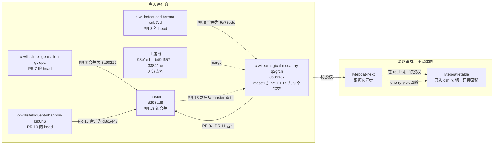

### 7.3 不改写历史

规则（`CLAUDE.md:183-187`）：

- 只在任务指定的分支上工作；
- 从不推 `main`、`master`、`develop`；
- 没有明确许可，不 force-push、不 rebase、不 amend 已推送的提交；获准的改写用 `--force-with-lease`；
- 分支的 PR 已经合并，就从 `origin/master` 重开（开发分支的第一父提交链上能看到这样的重开：V1 的第一个提交 `4f9d04c` 的父提交就是 PR #13 的合并 `d298ad8`，更早的 `3ce36a1`、`5ec88d6` 也都是 master 上的 PR 合并）；
- 没被要求就不建 PR；
- 没有明确指令，不改 `.github/`、`dsh.upstream.json`、`.pnpmfile.cjs`、`pnpm-workspace.yaml`、`.env*`，以及分类提交之外的 `dsh/`。

**真实例子：已推送的红提交不改写**（蓝图 §16 第 14 条）。D1-4 和 D1-5 推送时，有一个 fork 时代的端到端测试是红的：它断言"官方 driver 下 intake 不触发"，但从 D1-4 起那一行本身就解析到 lyteboat 内核了。修复方式是在 D1-6 删掉这个测试，而不是回头改写 D1-4、D1-5。

这条规则也是选择"合并式同步"的原因之一（§2.2）。

### 7.4 PR 流程（观察到的）

- 短期分支 `c-willis/<slug>` 开 PR，由人类维护者用 GitHub 的合并提交合入。**[实跑]** 本地 `git log --merges --oneline --all | grep 'pull request'` 列出 #1、#3–#13 的合并提交；#2 的状态来自 GitHub。
- 全部 13 个 PR：

| PR | head → base | 结果 |
|---|---|---|
| #1、#3、#4 | 开发分支 → master | 已合并 |
| #2 | `c-willis/m2-plugins` → `c-willis/m0-m1` | 关闭，未合并 |
| #5、#6、#7 | 各自的特性分支 → master | 已合并 |
| #8 | `c-willis/focused-fermat-snb7vd` → **开发分支** | 已合并（`9a73ede`，蓝图 §15.5） |
| #9、#11 | 开发分支 → master | 已合并（`41ac218`、`fe3ab17`） |
| #10 | `c-willis/eloquent-shannon-l3b0h6` → master | 已合并（`d8c5443`） |
| #12、#13 | `c-willis/awesome-curie-4848sq` → master | 已合并（`b2b800e`、`d298ad8`）；这个分支已不在远端 |

### 7.5 PR #8 作为非同步改动的范例

PR #8 本身不同步上游，但完整走了发行版纪律（§3.5）：

- 移动前后各跑一遍全量测试，数字完全相同；
- 内核里的注释改动拆成独立的 `Dist-Change: build` 提交；
- G4–G6 重新装树跑一遍；
- 生成物用 `--check` 确认一致。

### 7.6 待决事项

- **从 rc.1 切 lyteboat-stable。** 需要授权推新分支（蓝图 §16 结尾）。
- **`COMPAT.md:63` 已过时。** 它写"None exists yet: dsh has published no release candidate since lyteboat's first import"。rc.1 现在就是被跟踪的版本，这句话应该改成"条件具备、尚未切分支"。
- **私有 registry（蓝图 §13 X8）。** 原定"D2 之后再定"。打包盖章与按包名替换的机制，已由 G4–G6 的安装树验证过（§8.1）。
- **没有发版产物。** lyteboat 仓库没有 git tag；`CHANGELOG.md` 按里程碑记录交付内容，但开头就写着还没有发过版；15 个 `@lyteboat/*` 包都是 `version: 0.0.1`、`private: true`。发行版目前的"产物"是开发分支本身，加上 `packKernel` 在安装树里打的包。
- **V1、F1、F2 还没有合回 master**（§7.2）：开发分支上的 9 个提交没有 PR。第一版列在这里的"master 与开发分支互不包含"已经由 PR #9 解决。

---

## 8. 版本与依赖约定

### 8.1 `+lyteboat.<commit>`：只在打包时盖章

**怎么盖章。** `scripts/dist/trees.ts:149-175` 的 `packKernel()`：

1. 对每个内核包执行 `pnpm pack`；
2. 把 `version` 改写成 `<上游版本>+lyteboat.<git rev-parse --short=10 HEAD>`（`:150`、`:165`）；
3. 用 `tar --sort=name --mtime=@0 --owner=0 --group=0 --numeric-owner … | gzip -n` 重新打包（`:170`）。

为什么要可复现打包？注释写着（`:168-169`）："so an unchanged kernel packs to the same bytes and the trees built from it stay installed"。这里的"不变"只对同一个 `HEAD` 成立：版本号里带着提交的 sha（`:150`、`:165`），换一个提交，哪怕它没碰内核，打出的包也不同，树就会重装（§11.3）。

**[实跑]** 本次修订所在环境的 `~/.cache/lyteboat-dist/` 里只有一棵 lyteboat 安装树：

| 树（`~/.cache/lyteboat-dist/`） | `dsh-agent-loop` 的版本 |
|---|---|
| `lyteboat-0.1.7-rc.1-dsh-compat` | `0.1.7-rc.1+lyteboat.200ec4024e` |

注意：盖章取的是**打包时的 `HEAD`**，不是工作区状态（`:150`）。在未提交的改动上打包，版本号会带上一个提交的 sha。这棵树的包在 `packs/200ec4024e` 下，也就是打包时的 `HEAD` 是 `200ec40`；此后的 `d75d589`、`8b09937` 没有碰内核，但下一次跑 `pnpm run dsh-compat` 仍会按新的 `HEAD` 重新打包、重装。第一版记录的两棵树 `lyteboat-0.1.7-rc.1-conformance`（`edb8168d21`）和 `lyteboat-0.1.7-rc.1-compatibility`（`9a73ede2da`，PR #8 的合并点）不在这个环境里；`92c2f71` 之后树的名字是 `dsh-compat`。

**为什么仓库里保持上游版本号？** 如果把 `+lyteboat.N` 写进仓库里的 `package.json`，每次同步时每个内核包的 `version` 行都必然冲突（蓝图 §16 第 10 条）。蓝图 §6.2 画的 `"version": "0.1.7-rc.1+lyteboat.14"` 是被取代的旧方案。**[实跑]** `dsh/core/agent-loop/package.json:4` 与 `dsh/llm/llm/package.json:4` 都是 `"version": "0.1.7-rc.1"`。

**为什么盖章是安全的？** 这里有两种不同的版本检查，要分开看：

- **安装期的 peer 检查**（pnpm、npm 装一个 peer 依赖内核包的插件时）：比较的是 peer 范围和**内核包自己的版本**，也就是盖了章的版本。semver 比较时忽略构建元数据，所以按上游版本写的范围照常匹配（`COMPAT.md:58`）。下面的例子验证的就是这一种。
- **启动期的准入**（§8.2）：比较的不是内核包的版本，而是 `dsh-app-boot` 自己清单里的版本（`up:packages/boot/app-boot/src/plugin-compatibility.ts:44-49`、`:64`），与内核包的盖章无关。

**[实跑]** 用 `dsh-app-boot` 所带的 semver 包，检查一个盖了章的内核版本能不能满足常见的 peer 范围：

```console
$ node -e "const {createRequire}=require('module'); const r=createRequire(require('fs').realpathSync('node_modules/@deepseek-ai/dsh-app-boot/package.json')); const s=r('semver'); const v='0.1.7-rc.1+lyteboat.200ec4024e'; for (const x of ['0.1.7-rc.1','^0.1.7-rc.1','>=0.1.0-rc.6']) console.log(x, s.satisfies(v,x,{includePrerelease:true})); console.log('eq', s.eq(v,'0.1.7-rc.1'))"
0.1.7-rc.1 true
^0.1.7-rc.1 true
>=0.1.0-rc.6 true
eq true
```

### 8.2 dsh peer 写精确版本，以及原因

**约定**（`CLAUDE.md:88`；`README.md:205`）：

- dsh 和 cordis 包写成 `peerDependencies` 加 `devDependencies`，默认用 `catalog:dsh` / `catalog:cordis`。
- **例外：非内核的 dsh peer 写跟踪版本的精确值。**
- 内核 peer 写 `workspace:*`。

例子是 `lyteboat/tooling/testing/package.json`：

- peer `"@deepseek-ai/dsh-app-boot": "0.1.7-rc.1"`（`:40`）；
- devDependency `"@deepseek-ai/dsh-app-boot": "catalog:dsh"`（`:53`）；
- dsh-llm 在两处都是 `workspace:*`（`:43`、`:56`）。

`lyteboat/bundles/run/package.json:46-53` 也一样：唯一的非内核 dsh peer `dsh-agent-default-model` 写 `0.1.7-rc.1`，内核 peer 写 `workspace:*`。

**为什么。** rc.1 的准入逻辑在 `up:packages/boot/app-boot/src/plugin-compatibility.ts:61-88`：

- 对每个 `@deepseek-ai/dsh*` peer，`workspace:^|~|*` 视为当前运行版本（`:76`）；
- 其余范围用 `semver.satisfies(runtime, range, { includePrerelease: true })` 判定（`:77`）；
- 非法范围一律视为不兼容。

pnpm 不会在磁盘上的清单里解析 `catalog:`，所以 `catalog:dsh` 在准入看来就是一个非法范围。

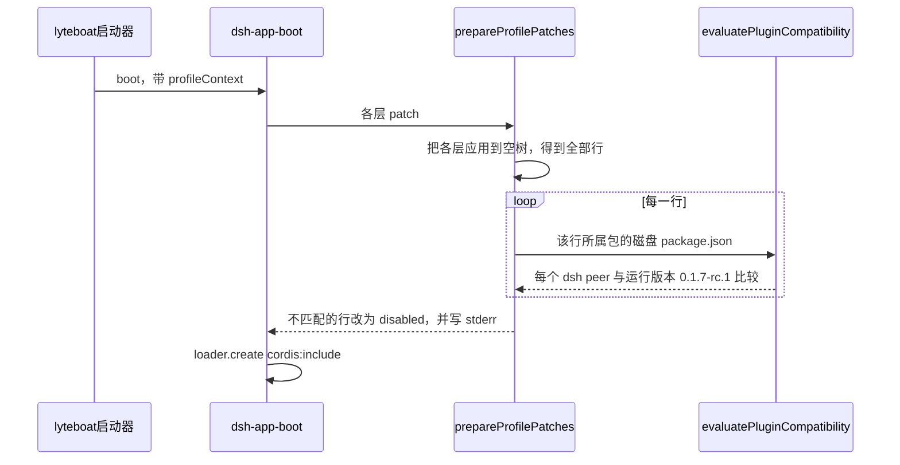

**[实跑]** 直接调用已安装的 `evaluatePluginCompatibility`（`@deepseek-ai/dsh-app-boot` 0.1.7-rc.1），对一个 peer 为 `@deepseek-ai/dsh-llm` 的清单试四种写法。从仓库根执行（`--input-type=module -e` 下相对路径按当前目录解析，不用在仓库里建文件）：

```console
$ node --input-type=module -e "
import { evaluatePluginCompatibility, getDshRuntimeVersion } from './node_modules/@deepseek-ai/dsh-app-boot/lib/index.js'
console.log('runtime', getDshRuntimeVersion())
for (const range of ['catalog:dsh', '0.1.7-rc.1', 'workspace:*', '0.1.6']) {
  const r = evaluatePluginCompatibility({ name: '@lyteboat/example', version: '0.0.0', peerDependencies: { '@deepseek-ai/dsh-llm': range } })
  console.log(range.padEnd(14), r === undefined ? 'admitted' : 'denied: ' + JSON.stringify(r.peers))
}"
runtime 0.1.7-rc.1
catalog:dsh    denied: {"@deepseek-ai/dsh-llm":"catalog:dsh"}
0.1.7-rc.1     admitted
workspace:*    admitted
0.1.6          denied: {"@deepseek-ai/dsh-llm":"0.1.6"}
```

`scripts/upstream-pins.spec.ts:40-54` 把这条约定变成测试：遍历 `lyteboat/*/*/package.json`，每个 dsh peer 必须是 `workspace:*`（内核）或 `dsh.upstream.json` 的版本（非内核）。

副作用：每次同步都要改这些 peer，所以同步步骤里专门有一项（`CLAUDE.md:195`）。

### 8.3 catalog

`pnpm-workspace.yaml` 里有三个 catalog：

| catalog | 行 | 内容 | 谁引用 |
|---|---|---|---|
| 默认 `catalog:` | `:57-62` | 多个工作区包共用的第三方包（schemastery、zod、commander、js-yaml） | `"zod": "catalog:"` |
| `catalogs.dsh` | `:65-150` | 85 个非内核 dsh 包，全部 `0.1.7-rc.1` | devDependencies 与依赖写 `catalog:dsh` |
| `catalogs.cordis` | `:151-156` | cordis、cordis-plugin-include/loader/timer、cosmokit | peer 与 devDependencies 写 `catalog:cordis` |

catalog 只管工作区包自己写的依赖；npm 包之间的传递依赖由 `.pnpmfile.cjs` 钉（`pnpm-workspace.yaml:54-56` 的注释）。

rc.1 同步时 dsh catalog 有 85 项。晋升删掉 llm、skill，又加了 `dsh-typert-generator`，变成 84 项；F1（`ab2c5ae`）为 `lyteboat run --session-id` 加了 `dsh-session-query`（`@lyteboat/run` 的依赖），现在又是 85 项。

### 8.4 `.pnpmfile.cjs`

全文 33 行，要点见 §1.2。

- 它是仓库里唯一的 CommonJS 文件，因为 pnpm 要求如此（`CLAUDE.md:89`）。
- G4–G6 的安装树有自己生成的 pnpmfile，做同样的钉版本，只是不钉被 override 的名字（`scripts/dist/trees.ts:58-81`）。
- 改这个文件需要明确指令（`CLAUDE.md:187`）。

### 8.5 `minimumReleaseAgeExclude`

**为什么有这个列表。** pnpm 11 拒绝安装发布不到一天的包。被钉的版本刚发布时，要按精确版本列进这个列表（`pnpm-workspace.yaml:158-159` 的注释："Drop the list once it has aged"）。

**现在的内容**，共 281 项（`pnpm-workspace.yaml:160-441`，**[实跑]** 用 `yaml` 解析后逐项归类）：

| 组成 | 项数 | 说明 |
|---|---|---|
| cordis 一族 | 6 | `dsh.upstream.json:6-13` 的 6 个版本 |
| `@deepseek-ai/schemastery@3.18.4` | 1 | `:441` |
| `@deepseek-ai/libreoffice-kit*@0.1.0` | 6 | `:435-440`，rc.1 新依赖它们 |
| 从 npm 解析的 dsh 包 | 256 | 正好是工作区装的那 256 个，包括晋升时为 typert 闸门加的 `dsh-typert-generator@0.1.7-rc.1`（`:413`） |
| 内核包名 | 12 | 例如 `dsh-agent-loop@0.1.7-rc.1`（`:171`）、`dsh-llm@0.1.7-rc.1`（`:313`）。13 个内核包里只有 `dsh-agent-loop-testkit` 不在列表里。这些名字经 overrides 解析到工作区、不从 registry 取，所以这 12 条已经不起作用（§11.3） |

**同步时的安装步骤**（`CLAUDE.md:195`）：

1. 删掉 `node_modules` 后运行 `pnpm install`。
2. 此时 lockfile 还指向上一个版本，而新列表已经不再豁免它。所以这一次重新解析的安装要加 `--config.minimum-release-age=0`。
3. 之后再用一次干净的 `pnpm install --frozen-lockfile`，证明提交进仓库的设置本身是够用的。

**历史。** 第一次用它是 `6b0cb3a`，正文写着"the list can go once the release has aged"。安装树直接设 `minimumReleaseAge: 0`（`scripts/dist/trees.ts:92-93`），因为树装的就是 lyteboat 钉住的版本，发布多久都一样。

---

## 9. 常见任务速查

所有命令都从仓库根执行。先设好环境：

```sh
export LYTEBOAT_HOME=$(mktemp -d) DSH_HOME=$(mktemp -d) DSH_TELEMETRY_DISABLED=1
```

### 9.1 同步一个新 tag

以 `<新版本>` 表示新 tag 的版本号（例如 `0.1.7-rc.2`），`<checkout>` 表示仓库旁的上游目录。前置条件见 §2.3：能访问 registry、checkout 正好停在 tag 上。

1. clone 并 checkout 新 tag，然后在那里装依赖：
   ```sh
   git clone https://github.com/deepseek-ai/deepseek-harness <checkout>   # 已有 clone 就改成 git -C <checkout> fetch --tags
   git -C <checkout> checkout dsh-v<新版本>
   (cd <checkout> && pnpm install)
   git -C <checkout> describe --tags --exact-match HEAD                   # 必须输出 dsh-v<新版本>
   ```
2. `pnpm run dist:snapshot <checkout>`，读 `contract <旧> → <新>: …` 那一行。有 removed 或 changed 就是需要人判断的契约变化：lyteboat 的消费者要在同一次同步里跟上（`CLAUDE.md:198`）。
3. `pnpm run dist:import <checkout>`。按提示先 `git diff --stat <上次导入> <新导入>` 看上游改了内核什么，再 `git merge --no-ff <新导入>`。若输出 `nothing to merge`，说明内核没变，跳到第 5 步。
4. 解决冲突。冲突出现在上游和 lyteboat 都改过的同一段或相邻的行；因为 lyteboat 在上游文件里只加几行 `// lyteboat:` 钩子（`CLAUDE.md:73`），冲突通常落在这些钩子附近（例如 `dsh/core/agent-loop/src/agent.ts:276-288`、`src/index.ts:243-245`，以及 `dsh/core/session/src/index.ts` 的 `:24-25`、`:37-38`、`:727-731`、`:754`）。`src/lyteboat/` 下的文件不会冲突。变成空改动的 hunk 按它的类别处理：backport 删掉，drop 删掉。
5. 改版本钉：
   - `dsh.upstream.json`：版本、tag、commit，以及取自 `<checkout>/vendor/*/package.json` 的 cordis 版本；
   - `lyteboat/*/*/package.json` 里的非内核 dsh peer；
   - `catalogs.dsh` / `catalogs.cordis`：上游删掉的包，换成 dsh 自己的 bundle 组合用的继任者（例子见 `6b0cb3a`：dsh-agent-presets 换成 agent-preset-registry + agent-preset）；
   - 保证 `lyteboat/apps/cli` 的依赖闭包是 dsh `apps/cli` 的超集；
   - `minimumReleaseAgeExclude`。
6. 重装并跑检查：
   ```sh
   rm -rf node_modules lyteboat/*/*/node_modules dsh/*/*/node_modules && pnpm install --config.minimum-release-age=0
   rm -rf node_modules lyteboat/*/*/node_modules dsh/*/*/node_modules && pnpm install --frozen-lockfile
   pnpm run check
   ```
7. 先确认 `git -C <checkout> rev-parse HEAD` 等于 `dsh.upstream.json` 的 `commit`（第 5 步改过的），再跑 `pnpm run dist:overlay <checkout> persistence`、`pnpm run dist:overlay <checkout> typert`、`pnpm run dist:overlay <checkout> g3`。g3 冷缓存约 16–20 分钟，而且会 reset checkout 的 `packages/` 和 `docs/`（§6.5）。
8. `pnpm run dist:delta`，删掉上游已覆盖的差量：已在基线里的 backport，退出条件已成立的 extend（连同登记条目）。
9. 重新生成 distro manifest（`node --import tsx scripts/dist/gen-distro-manifest.ts`），更新 `extensions.yml` 的 `since`、`COMPAT.md`、改编文件头、`THIRD_PARTY_NOTICES.md`、CLAUDE.md、README。
10. 金丝雀在官方新版本上坏了的，按 §9.5 替换。
11. 用构建好的 launcher 验证准入：`node lyteboat/apps/cli/lib/bin.js config dump --profile run 2> /tmp/dump.err`，`/tmp/dump.err` 里不能有 `disabling profile plugin` 或 `skipping profile bundle`。stdout 里按配置写着 `disabled: true` 的行（今天 5 行）与准入无关（§2.4）。
12. 提交标题写 `dist(sync): track dsh-v<新版本>`，正文列出每道闸门的数字（参照 `edbe7bb`）。合并提交不受 `delta-report --check` 检查，用 §3.3 的 `git merge-tree` 办法确认合并没有夹带内核包目录下的改动。

### 9.2 改一处内核（以 fix 为例）

1. 先按 §3.1 确认放不到内核外，在设计文档里写明理由和类别，并和用户确认（`CLAUDE.md:72`、`:126`）。
2. 在 `dsh/<group>/<pkg>/tests/lyteboat/` 写回归测试，确认它在改动前失败。测试只能用内核和上游自己的测试辅助，不能用 `@lyteboat/*`（`CLAUDE.md:173`）。
3. 改动尽量放 `src/lyteboat/`，上游文件里只留带 `// lyteboat:` 的几行钩子。
4. 如果改到了发布 Typert 文件的包（今天只有 dsh-llm）的 `src/`，跑 `pnpm run dist:overlay <checkout> typert --write`，把重新生成的 `lib/typert.*` 和 `dsh/typert.json` 一起提交。否则本地 `pnpm run build` 会失败（§5.4；CI 的浅克隆发现不了，所以这一步不能指望 CI）。
5. 跑门槛：`pnpm run lint && pnpm run typecheck && pnpm run test && pnpm run dsh-compat && pnpm run dist:delta -- --check`；可能触及持久化类型时再跑 `pnpm run dist:overlay <checkout> persistence`。改动碰到哪条行为不变量，对照 §6.11 确认对应测试在跑。
6. 提交，标题按 §3.7 的内核提交格式：

   ```text
   fix: @deepseek-ai/dsh-<pkg> — fix: <修了什么>

   <症状、原因、为什么回到上游本意；Accepted: 跑了什么、数字>

   Dist-Change: fix
   Dist-Tests: dsh/<group>/<pkg>/tests/lyteboat/<name>.spec.ts
   ```

7. 如果同一个提交还顺手改了内核外的文件（例如登记表路径），想想是否该像 `9fbfa13` / `7dde6f9` 那样拆开。

### 9.3 加一个扩展（extend）

完整的例子见 §10。

1. 在 `src/lyteboat/<name>.ts` 写声明与逻辑；上游文件只加派发或调用的钩子行，并从包根导出。参照 `dsh/core/agent-loop/src/lyteboat/step-hooks.ts` 和 `index.ts:243-245`，或 E1 的 `dsh/core/session/src/lyteboat/append-ignorable.ts` 和 `dsh/core/session/src/index.ts:37-38`。
2. 在 `tests/lyteboat/<name>.spec.ts` 写测试。
3. `pnpm run build && pnpm run contract:check`：G1 会列出 `unregistered addition` 或 `unregistered change`，这些键就是要登记的键。
4. 在 `dsh-compat/contract/extensions.yml` 加条目：`id`、`package`、`kind`、`surface`、`contract`（上一步的键或它们的前缀）、`since`、`exit`、`tests`。再跑 G1，应当变成 `N registered difference(s), 0 failure(s)`。
5. `node --import tsx scripts/dist/gen-distro-manifest.ts` 重新生成 distro manifest，`pnpm run lint` 确认不过期。
6. lyteboat 插件要用这个扩展的类型，从 `@lyteboat/contracts` 再导出（参照 `lyteboat/core/contracts/src/index.ts:30-43`）。扩展若只是放宽已有方法的签名，插件对着 lyteboat 内核的类型编译就能用上，可以不再导出：E1 就没有导出 `LyteboatAppendOptions`，`@lyteboat/aux-llm` 直接传字面量 `{ ignorable: true }`（§10 第 12 步；§11.3）。
7. 在 `COMPAT.md` §4 补一句人读说明（如需）。
8. 提交时带全六个 trailer（参照 §3.4 与 §10 第 10 步）：`Dist-Change: extend`、`Dist-Extension: <id>`、`Dist-Contract: additive — …`、`Dist-Exit: …`、`Dist-Upstream: …`、`Dist-Tests: …`。
9. 跑 §6.12 的全部门槛。

### 9.4 晋升一个包

1. 确认符合 `CLAUDE.md:76` 的两个条件之一，并在设计文档里写明。
2. `dsh/kernel.json` 加一行 `"<包名>": "<group>/<pkg>"`（目录与上游 `packages/` 下一致）。
3. `pnpm-workspace.yaml`：overrides 加 `"<包名>": "workspace:*"`，`catalogs.dsh` 删掉它。
4. 根 `tsconfig.json` 的 references 加 `./dsh/<group>/<pkg>`；引用它的 lyteboat 包的 `tsconfig.json` 也加上。
5. 把 lyteboat 各清单里对它的引用（peer、dependencies、devDependencies）都改成 `workspace:*`。`scripts/upstream-pins.spec.ts` 会检查 peer。
6. 以上改动**先不要提交**。`pnpm run dist:import <当前 tag 的 checkout>`：它按工作区里的 `dsh/kernel.json` 导入，得到同一 tag 的再导入，父提交是上一次导入。
7. `git merge --no-ff --no-commit <新导入>`，把第 2–5 步的改动（以及第 8–10 步的产物）一起加进暂存区，以 `dist(promote): …` 为标题提交，参照 `3d29a07`。为什么放进合并提交见 §5.3。提交后用 §3.3 的 `git merge-tree` 办法确认合并自带的改动都在内核包目录之外。
8. 若它导出 `./typert` 或 `./remote`，确认 `lib/typert.*` 随导入进来了，并跑 `pnpm run dist:overlay <checkout> typert`。
9. 用 `pnpm run dist:snapshot <checkout>` 重写快照。同版本重写时它不打印差异（`snapshot.ts:52`），所以用 `git diff --stat dsh-compat/contract/` 确认只多出新包的几节（`3d29a07` 的例子：`api.json` +1024、`config.json` +52、`events.json` +16、`services.json` +6，没有删除）。
10. 若 G2 需要新的环境适配，加进 `dsh-compat/tests/upstream-harness/README.md` 的表格。
11. `pnpm install` 后确认 store 里没有它的 npm 副本：`ls node_modules/.pnpm | grep '^@deepseek-ai+<名字>@'` 应为空。
12. 跑全部闸门，包括 G3（依赖内核的包集合变了，G3 会自动建一份新基线，§6.5）。

### 9.5 选金丝雀

1. 从社区样本里按风险类别挑候选。今天用的 9 类见 `canaries.yml:20-42`：直接读 JSONL（persistence-files）、往日志写事件（appends）、system prompt（prompt）、`tools/pre-execute`、step、`llm/stream`（llm）、投影（projections）、工具（tools）、宿主端碰 session（session-host）。蓝图 §8 E4 原本还有一类"Web 界面扩展（slots）"，但 G5 只跑 headless，这一类没有金丝雀（蓝图 §16 第 11 条）。
2. 每个候选先装进**官方**版本的树：`dsh plugin --profile headless add <名字>@<版本>`，再跑一次。只有装上、所有行激活、回答、自己退出的才合格。
3. 每类按排序最多取 3 个，写进 `dsh-compat/tests/canaries/canaries.yml`，并锁定版本。同时在文件头注释里记下选法、日期、版本，以及淘汰了哪些、为什么（参照 `:5-17`），不满 3 个的类别逐个写明。
4. `pnpm run dsh-compat` 跑 G5，确认两边 stdout、归一化日志相同，profile 里没有内核副本。
5. 同步后，某个金丝雀在官方新版本上坏了，就按同一排序往后取，替换掉它（例子：`edbe7bb` 换上 `@longnb47/dsh-agent-gateway`）。找不到干净候选时，这一类就少一个，并在注释里写明（例子：同一次同步里 projections 类没有补）。只在 lyteboat 上坏的是 G5 失败，要修 lyteboat，不能换掉金丝雀。

---

## 10. 串起来：一个 extend 从决定到下一次同步

前面各节讲的是分散的规则。本节用一个已经落地的改动，把它们按时间顺序串成一遍：蓝图 §8 E1 的 `session-append-ignorable`，也就是 F2 的第一步 `c5a553f`。第一版写这一节时它还是计划，命令和输出格式是按代码推算的；这一版写的是实际发生的经过，和计划不一样的地方逐条说明。

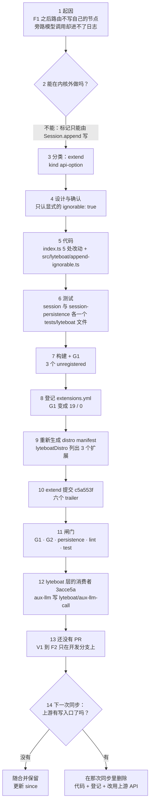

**1. 起因。** 计划里的起因是 skill-router 写的两种节点 `lyteboat/route-request`、`lyteboat/skill-routed`：dsh 的持久化层拒绝读取带有目录外事件类型、又没标 `ignorable` 的日志（`COMPAT.md:36`；`dsh/core/session/src/types.ts:502-511` 的 `ignorable?: true` 注释），所以路由过的会话在 resume 和 `lyteboat web` 里打不开。F1（`ab2c5ae`）先在内核外解决了这件事：路由选中的技能正文改成 dsh 自己的 skill-invocation 消息，即一条 `source` 为 `{ kind: 'skill-invocation', name, form: 'instructions' }` 的 `user/message`，在 `agent/pre-step` 追加进这一步（`lyteboat/plugins/skill-router/src/index.ts:182-190`、`:236-244`）；两种节点从 `@lyteboat/contracts` 删掉，`reopen.composite.ts` 里"路由会话被拒绝"的测试翻成了"能重开"。代价是路由这次旁路模型调用不再进会话日志，F1 之后只留一行 debug 日志（`ab2c5ae` 正文："the router call leaves a debug log line until side calls have an audited path"）。要把旁路调用记进日志，就得有一种 lyteboat 自有、又不妨碍重开的记录类型。这才是 E1 实际的起因（`c5a553f` 正文："This is the write path, for the side-call audit records lyteboat logs next."）。

**2. 能不能在内核外做（§3.1）。** 读路径早就接受标了 `ignorable: true` 的未知事件（`dsh/core/session/src/surface.ts:311-312`），缺的是写入口：按上游的签名，非 surface 类型的 `append` 没有第三个参数，信封上的字段全由 `append` 自己拼（`dsh/core/session/src/index.ts:748-755`，其中 `:754` 是 E1 加的）。`CLAUDE.md:79-80` 的首选仍是把事实折进已有的信封；可一次旁路调用的记录（用途、路由、提示词、回答或失败、耗时，`lyteboat/core/contracts/src/index.ts:139-156`）没有现成的信封可放，它又是纯信息性的：读者跳过它，重建出的会话不变。插件在外面拿不到写标记的入口，只能改内核。

**3. 分类。** 外部可见面只增加：`append` 多一个可选参数，不用它的调用方不受影响；另外多一个导出类型 `LyteboatAppendOptions`。按 §3.1 的决策树是 `extend`，kind 是 `api-option`（`extensions.yml:12`、`:53`）。

**4. 设计与确认。** 改的是内核的公开 API，按 `CLAUDE.md:125` 先写设计文档并和用户确认。设计里要回答两个具体问题：

- **标记放进哪个参数。** 上游签名是 `append(type, data, ...opts)`，`opts` 对 surface 类型是 `[opts: SurfaceIntent<T>]`，对其他类型是空元组。E1 只放宽后一半，改成 `[opts?: LyteboatAppendOptions]`（`dsh/core/session/src/index.ts:728`），surface 类型的签名不动。
- **什么才算"要标记"。** E1 的第一版实现在 G2 里打破了上游的 `dsh/core/session/tests/canonical-envelopes.spec.ts`：它的辅助函数 `appendEvent`（`:39-47`）对 `request/header` 这类非 surface 类型也传一个空对象 `{}` 作第三个参数，那一版把它当成了标记请求。定稿只认显式的 `ignorable: true`（`dsh/core/session/src/lyteboat/append-ignorable.ts:38-40`），其他尾参数原样交给上游代码（`:29-31`；`c5a553f` 正文："Any other trailing argument reaches upstream's code exactly as before"）。本构建认识的类型（surface 类型在内）要求标记一律拒绝，因为读者会跳过一个必需的事件（`:32-34`）。

**5. 代码。** 按 §3.6 的写法，`dsh/core/session/src/index.ts` 上 5 处改动、+9/−2（§3.6 逐处列出）：导入、类型导出、放宽的签名、把尾参数交给 `lyteboatAppendOptions` 拆开的两行、把标记摊进信封的一行。判断逻辑在上游没有的 `dsh/core/session/src/lyteboat/append-ignorable.ts`（40 行）：`lyteboatAppendOptions(type, options)` 返回上游要校验的 surface intent 和要摊进信封的字段（`:28-36`）。

**6. 测试。** 两个 lyteboat 自己的内核测试，只用内核和上游的测试辅助，不用 `@lyteboat/*`（`CLAUDE.md:173`）：

- `dsh/core/session/tests/lyteboat/append-ignorable.spec.ts`，4 个测试：未知类型带标记，信封上有 `ignorable: true`，surface 不变；不带标记的 append 写出的信封和上游完全一样，键只有 `data`、`seq`、`time`、`type`；已知类型要求标记被拒绝，日志不变；带标记的记录经 seed 路径（重开的日志走这条路径）读回。
- `dsh/session/session-persistence/tests/lyteboat/reopen-ignorable.spec.ts`，1 个测试：同一条未知记录，带标记时 `validateStoredEvents` 放行，不带标记时抛 `SessionFormatUnsupportedError`。这就是计划里"存盘，再用持久化层读回"的那一步。持久化层是另一个内核包，所以测试放在它自己的 `tests/lyteboat/` 下，`Dist-Tests` 也就列了两个文件。

两者都跑在 G2 项目里（§6.4）。

**7. 构建并跑 G1。** `pnpm run build && pnpm run contract:check`。登记之前 G1 会打出什么？**[实跑]** 用一个仓库外的脚本调用 `contract-check.ts` 导出的 `readExtensions`、`readSnapshot`、`flattenContract`、`compareContract`，先把 `session-append-ignorable` 这一条从读到的登记里去掉，再按它 `main` 的格式打印（`contract-check.ts:125-131`）：

```text
G1 unregistered addition: api › @deepseek-ai/dsh-session › exports › . › LyteboatAppendOptions › $declaration
  upstream: (absent)
  lyteboat:     "interface LyteboatAppendOptions { }"
G1 unregistered addition: api › @deepseek-ai/dsh-session › exports › . › LyteboatAppendOptions › ignorable
  upstream: (absent)
  lyteboat:     "readonly ignorable: true;"
G1 unregistered change: api › @deepseek-ai/dsh-session › exports › . › Session › append
  upstream: "append<T extends SessionEventType>(type: T, data: SessionEventMap[T], ...opts: T extends SurfaceEventType ? [ opts: SurfaceIntent<T> ] : [ ]): SessionEvent<T>;"
  lyteboat:     "append<T extends SessionEventType>(type: T, data: SessionEventMap[T], ...opts: T extends SurfaceEventType ? [ opts: SurfaceIntent<T> ] : [ opts?: LyteboatAppendOptions ]): SessionEvent<T>;"
G1 contract vs dsh 0.1.7-rc.1: 16 registered difference(s), 3 failure(s)
```

计划只预计了 `append` 那一行，外加"每个新导出名各一行 addition"。实际新导出的是一个接口，G1 按成员逐个成键，所以 `LyteboatAppendOptions` 占了两行：`$declaration` 和成员 `ignorable`。

**8. 登记。** `dsh-compat/contract/extensions.yml:51-68` 的第三条：

```yaml
  - id: session-append-ignorable
    package: '@deepseek-ai/dsh-session'
    kind: api-option
    surface: >-
      Session.append takes `{ ignorable: true }` for a non-surface event of a type this build does not
      know, and writes `ignorable: true` on its envelope, so a reader that does not know the type skips
      it instead of refusing the log (the read and seed paths already honour the marker). A type the
      build knows, surface types included, is refused. Exports LyteboatAppendOptions.
    contract:
      - api › @deepseek-ai/dsh-session › exports › . › Session › append
      - api › @deepseek-ai/dsh-session › exports › . › LyteboatAppendOptions
    since: lyteboat on dsh 0.1.7-rc.1
    exit: >-
      Upstream gives Session.append (or another write path) a way to set SessionEvent.ignorable; then
      @lyteboat plugins use it instead.
    tests:
      - dsh/core/session/tests/lyteboat/append-ignorable.spec.ts
      - dsh/session/session-persistence/tests/lyteboat/reopen-ignorable.spec.ts
```

再跑 G1：`19 registered difference(s), 0 failure(s)`（§4.2）。计划预期的是 17（原来的 16 加 1 个键）；实际是 19，因为 `LyteboatAppendOptions` 这一个前缀放行了两个键。

**9. 运行时可见。** `node --import tsx scripts/dist/gen-distro-manifest.ts` 让 `DISTRO_EXTENSIONS` 多了一条（`lyteboat/plugins/distro/src/distro-manifest.ts:12`），第三方插件可以用 `ctx.lyteboatDistro.has('session-append-ignorable')` 判断（§4.4）。同一个提交还改了两处断言扩展清单的测试：`lyteboat/bundles/run/tests/distro.composite.ts:32` 现在期待三个 id；`lyteboat/plugins/distro/tests/distro.spec.ts:22` 原来拿 `session-append-ignorable` 当"本构建没有的扩展"举例，换成了 `no-such-extension`。计划里"类型从 `@lyteboat/contracts` 再导出"这一步没有做：消费者直接传字面量 `{ ignorable: true }`，类型检查走的是内核 dsh-session 自己放宽后的签名（§9.3 第 6 步；§11.3）。

**10. 提交。** `c5a553f` 的完整提交信息（省略署名 trailer）：

```text
F2-1: @deepseek-ai/dsh-session — extend: Session.append can mark a record ignorable

dsh's persistence refuses a stored log with an event type outside its
compiled catalog unless the event carries `ignorable: true`; the read and
seed paths already honour the marker, but `Session.append` had no way to
write it, so a plugin could not log a record of its own type without making
its session unreadable. This is the write path, for the side-call audit
records lyteboat logs next.

- `append(type, data, { ignorable: true })` for a non-surface type writes
  `ignorable: true` on the envelope; the surface does not change, and a
  reader that does not know the type skips the record.
- A type this build knows (surface types included) asking for the marker
  is refused: a reader would skip a required event.
- Any other trailing argument reaches upstream's code exactly as before
  (upstream's own tests pass metadata objects through `append`), so an
  append without the marker writes the same envelope.
- The logic lives in src/lyteboat/append-ignorable.ts; the upstream file
  carries the widened signature, two hook lines, the import, and the
  export of LyteboatAppendOptions.
- Registered as `session-append-ignorable` (api-option) in
  dsh-compat/contract/extensions.yml; the @lyteboat/distro manifest lists
  it, and its test and the distro composite name three extensions.

Accepted: G1 19 registered differences, 0 failures; G2 (upstream session
and persistence tests) 1306 passed; persistence overlay gate against the
rc.1 checkout: 62 roots, 587 types, 0 differences, 0 failures; pnpm run
lint, pnpm run typecheck, pnpm run test (147 files, 2975 passed, 1
skipped).

Dist-Change: extend
Dist-Extension: session-append-ignorable
Dist-Contract: additive — Session.append takes an optional { ignorable: true } for a non-surface type (api-option); new export LyteboatAppendOptions
Dist-Exit: upstream gives Session.append (or another write path) a way to set SessionEvent.ignorable
Dist-Upstream: none (deepseek-ai/deepseek-harness accepts no external pull requests)
Dist-Tests: dsh/core/session/tests/lyteboat/append-ignorable.spec.ts, dsh/session/session-persistence/tests/lyteboat/reopen-ignorable.spec.ts
```

标题按 §3.7 的内核提交格式，里程碑步骤名是 `F2-1`，不是第一版示意的 `D3-1`；六个 trailer 齐全（§3.4）。`git show --stat c5a553f` 列出 8 个文件：内核里 4 个（第 5、6 步），另有登记表、distro manifest 和两个 distro 测试。登记条目和代码在**同一个**提交里，`delta-report --check` 的第 3、4 条（§3.3）双向核对它们。

**11. 闸门**（§6.12；数字来自上面的 Accepted 段）：

- G1 19/0；
- G2：session 与 persistence 的上游测试 1306 个通过。E1 碰的正是"持久化拒绝未标 ignorable 的目录外事件"这条不变量（§6.11），守着它的上游测试必须照常通过；E1 自己的 `reopen-ignorable.spec.ts` 把带标记、不带标记两种情况各测一次；
- persistence overlay：62 根、587 类型、0 差异。信封上的 `ignorable?: true` 字段本来就在上游类型里（`types.ts:511`），所以指纹不变，和计划的预期一致；
- `pnpm run lint`（distro manifest 不过期）、`pnpm run typecheck`、`pnpm run test`：147 文件、2975 通过、1 skip；
- typert 不用跑：dsh-session 不发布 Typert 文件（§5.4）。

Accepted 段里没有 `dist:delta -- --check` 和 G4–G6。**[实跑]** 在 `8b09937` 上 `--check` 退出码 0（§3.3）；G4–G6 在 `8b09937` 上 30/30（§0.4）。

**12. lyteboat 层的消费者（另外的提交，不碰内核）。** 计划里的消费者是 skill-router：给它的两种节点加标记，再把 `reopen.composite.ts` 里"路由会话被拒绝"的测试翻过来。F1 已经用别的办法把这两件事做完了（第 1 步），没有路由节点需要标记。实际的第一个消费者是紧接着的 `@lyteboat/aux-llm`（`3acce5a`）：

- 每次旁路模型调用追加一条 `lyteboat/aux-llm-call`，带 `{ ignorable: true }`（`lyteboat/plugins/aux-llm/src/index.ts:131`）；记录类型声明在 `@lyteboat/contracts`（`lyteboat/core/contracts/src/index.ts:139-156`、`:215-223`）。
- 它 inject `lyteboatDistro`（`lyteboat/plugins/aux-llm/src/index.ts:95-96`），放到官方 dsh 上不会加载，这正是 §4.4 给第三方插件的写法。
- skill-router 的路由调用改走 `ctx.auxLlm.generate`（`lyteboat/plugins/skill-router/src/index.ts:367-377`，purpose 是 `skill-router`），F1 丢掉的路由审计又回到了日志里。F2 最后一步的金融准入分类器也走它（`8b09937`）。
- 证明：`lyteboat/bundles/run/tests/reopen.composite.ts:109-115` 用 `lyteboat run` 跑一个路由会话，再用 dsh 自己的 `validateStoredEvents` 读回存下的日志：不拒绝，lyteboat 自有的记录恰好一条 `lyteboat/aux-llm-call`，而且标了 `ignorable`。

还差一项：蓝图 E1 计划的 G6 用例没有做，即"路由过的会话在 lyteboat 上能重开，官方 dsh 读它时跳过 lyteboat 的记录、其余完全一致"。G6 在两棵树上跑的都是官方 `dsh headless`，不装 lyteboat 的插件（§6.9），写不出这样的会话。今天能说明"官方的读者会跳过这条记录"的只有内核层的证据：两个 lyteboat 测试走的读路径，即 `validateStoredEvents` 对未知类型的检查（`dsh/session/session-persistence/src/storage-contract.ts:75`）和 seed 路径对未知 ignorable 记录的放行（`dsh/core/session/src/surface.ts:311-312`），在 lyteboat 内核里都是上游原样的代码：session-persistence 在差量报告里没有任何上游文件的改动（§0.4），dsh-session 的改动只在 `append` 上。

**13. PR。** 计划写的是"PR 的 base 是开发分支，和 PR #8 一样"。实际上 `c5a553f` 直接提交在开发分支上：PR #13 之后开发分支已经从 master 重开，V1、F1、F2 的 9 个提交都还没有开 PR（§7.2）。

**14. 下一次同步。** `pnpm run dist:delta` 的提交表里已经有这一行（**[实跑]**）：

```text
| c5a553f85c | 2026-09-24 | extend | session-append-ignorable | upstream gives Session.append (or another write path) a way to set SessionEvent.ignorable | F2-1: @deepseek-ai/dsh-session — extend: Session.append can mark a record ignorable |
```

exit 列就是 `Dist-Exit` 的内容。同步的人看上游这次有没有给 `append`（或别的写入口）加设置 `ignorable` 的办法：

- **没有**：三方合并照常保留它；上游改了 `append` 附近的代码，冲突会落在 `dsh/core/session/src/index.ts` 的那几处钩子上（§9.1 第 4 步）；更新 `since`。
- **有**：在那次同步里删掉钩子、`src/lyteboat/append-ignorable.ts`、两个 `tests/lyteboat/` 测试和登记条目，`@lyteboat/aux-llm` 改用上游 API（登记的 `exit` 写着 "then @lyteboat plugins use it instead"）。漏删登记会被 G1 的 stale 规则拦住；上游新签名和 lyteboat 的不一致时，G1 也会报出来。

---

## 11. 附录

### 11.1 命令表

| 目的 | 命令 | 出处 |
|---|---|---|
| 安装 | `pnpm install`（CI 用 `--frozen-lockfile`） | `CLAUDE.md:216` |
| 构建（`tsc -b` + 内核 tsdown 打包 + Typert 校验） | `pnpm run build` | `package.json:12` |
| lint（oxlint、knip、层检查、distro manifest、敏感词） | `pnpm run lint` | `package.json:14` |
| 类型检查（源码与测试） | `pnpm run typecheck` | `package.json:13` |
| 快速单测（不构建，不含 composite、e2e） | `pnpm run test:unit` | `package.json:17` |
| CI 跑的：构建 + G1 + lyteboat 测试 + G2 | `pnpm run test` | `package.json:15` |
| G4–G6 | `pnpm run dsh-compat` | `package.json:16` |
| 全部 | `pnpm run check` | `package.json:18` |
| 只跑 G1（构建后） | `pnpm run contract:check` | `package.json:23` |
| 只跑 G2 | `npx vitest run --project dsh` | `CLAUDE.md:233` |
| 差量报告 / 只检查 trailer | `pnpm run dist:delta` / `pnpm run dist:delta -- --check` | `CLAUDE.md:234` |
| 生成某 tag 的契约快照 | `pnpm run dist:snapshot <checkout>` | `CLAUDE.md:235` |
| 导入某 tag 的内核（然后 `git merge`） | `pnpm run dist:import <checkout>` | `CLAUDE.md:236` |
| persistence / G3 | `pnpm run dist:overlay <checkout> persistence` / `g3 [--match <regex>]` | `CLAUDE.md:237` |
| Typert 对照 / 重新生成 | `pnpm run dist:overlay <checkout> typert [--write]` | `CLAUDE.md:238` |
| 看组合后的插件树（也能验证准入） | `node lyteboat/apps/cli/lib/bin.js config dump --profile run` | `CLAUDE.md:231` |
| 用脚本化模型跑一次 launcher | `node /path/to/scripted-run.mjs run "hello"` | §6.13 |
| 列出上游线 | `git log --format='%h %p %s' --grep='^Dist-Import: '`，或 `git log --oneline <合并>^2` | §2.1 |
| 看 lyteboat 在内核上的全部差量 | `git diff <最近导入> HEAD -- dsh/` | §2.2 |
| 核对合并提交没有夹带内核改动 | `git merge-tree --write-tree <父1> <父2>`，再 `git diff --stat <树> <合并> -- <内核包目录>` | §3.3 |

### 11.2 目录表

| 路径 | 是什么 | 谁拥有 |
|---|---|---|
| `dsh/<group>/<pkg>/` | 内核包：上游文件 + lyteboat 的分类提交 | 上游文件归上游；`src/lyteboat/`、`tests/lyteboat/` 归 lyteboat |
| `dsh/kernel.json` | 内核清单的权威来源；overrides 与根 `tsconfig.json` 的 references 是它的镜像，`scripts/upstream-pins.spec.ts` 核对 overrides | 发行版 |
| `dsh/tsdown.config.ts` | 上游根目录的打包选项，给没有自己配置的内核包用（今天包括 dsh-llm） | 发行版 |
| `dsh/typert.json` | Typert 文件重新生成时的源码摘要（`--write` 之后才出现） | 发行版 |
| `lyteboat/{apps,bundles,plugins,core,agents,tooling}/` | lyteboat 自己的包 | lyteboat |
| `dsh-compat/COMPAT.md` | 给人读的承诺：稳定面、行为不变量、追加项、过渡接口、不承诺的、通道 | 发行版 |
| `dsh-compat/README.md` | 闸门总表、金丝雀规则、上游测试规则 | 发行版 |
| `dsh-compat/contract/dsh-0.1.7-rc.1/` | 契约快照：`api`、`services`、`events`、`config`、`persistence` | 生成，只随同步或晋升更新 |
| `dsh-compat/contract/extensions.yml` | 扩展登记表 | 发行版 |
| `dsh-compat/tests/upstream-harness/` | G2 的运行环境，本身不含测试 | 发行版 |
| `dsh-compat/tests/{scenarios,canaries,roundtrip,support}/` | G4、G5、G6 与共用支持 | 发行版 |
| `scripts/dist/` | `import-upstream`、`snapshot`、`contract-gen`、`contract-check`（G1）、`delta-report`、`overlay`（persistence、G3、typert）、`bundle-kernel`、`trees`、`typert`、`gen-distro-manifest`、`kernel` | 发行版 |
| `scripts/check-layers.ts`、`scripts/check-sensitive.ts`、`scripts/upstream-pins.spec.ts` | 分层检查；敏感词检查（V1）；版本钉与 peer 的守卫测试 | 发行版 |
| `dsh.upstream.json` | 跟踪的 dsh 版本、tag、commit、cordis 版本 | 同步时改 |
| `.pnpmfile.cjs` | 把非内核 dsh 与 cordis 包钉到 `dsh.upstream.json` | 需要明确指令才改 |
| `pnpm-workspace.yaml` | 工作区、overrides、提升、catalog、`minimumReleaseAgeExclude` | 需要明确指令才改 |
| `THIRD_PARTY_NOTICES.md` | 按 `Adapted from deepseek-ai/deepseek-harness` 文件头列出的改编文件 | 同步时更新 |
| `$LYTEBOAT_DIST_CACHE`（默认 `~/.cache/lyteboat-dist`，仓库外） | G4–G6 的安装树、内核打包、G3 基线、导入与快照用的原版树 | 工具生成 |

### 11.3 文档与现实的已知差异

| # | 某处写的 | 实际 | 影响 |
|---|---|---|---|
| 1 | `COMPAT.md:63`："None exists yet: dsh has published no release candidate since lyteboat's first import" | rc.1 就是被跟踪的版本；lyteboat-next 和 lyteboat-stable 都还没建，切分支需要授权 | 这句话需要更新 |
| 2 | 蓝图 §4、§5 画了 `upstream-dsh` 分支 | 没有分支；导入提交靠 `Dist-Import` trailer 串起来（蓝图 §16 第 1 条） | 无：三方合并效果相同 |
| 3 | 蓝图 §6.2 写仓库里 `package.json` 的版本是 `0.1.7-rc.1+lyteboat.14` | 仓库里保持上游版本号，打包时才盖 `+lyteboat.<10 位 sha>`（蓝图 §16 第 10 条） | 无：准入看 `dsh-app-boot` 的版本 |
| 4 | 蓝图 v7 §4 列 11 个内核包，说 llm、skill 暂留原样层 | 内核 13 包（`3d29a07`） | 以 `dsh/kernel.json` 为准 |
| 5 | 蓝图 §7 写 drop 要附"理由"，redesign 要附"上游测试全绿、日志等价" | 代码要求 drop 带 `Dist-Exit`，redesign 带 `Dist-Tests`；另有 `build` 类（`delta-report.ts:30-38`） | 以代码为准 |
| 6 | `CLAUDE.md:73` 说 `Dist-Contract`、`Dist-Exit` "wherever … involved" | 机器不检查这两项；`delta-report` 跳过合并提交 | 合并里夹带的内核改动逃过 trailer 检查；靠评审和 §3.3 的 `git merge-tree` 核对 |
| 7 | 蓝图 §12 写"CI 强制：提交尾部格式检查" | `ci.yml` 只跑 lint、typecheck、test；`dist:delta --check`、overlay 闸门和 G4–G6 都靠手动或同步时跑 | 需要授权改 `.github/` 才能补上 |
| 8 | `CLAUDE.md:21` 在布局里列出 `dsh/typert.json` | 文件还不存在，第一次 `typert --write` 后才会出现 | 符合预期 |
| 9 | 蓝图 §13 X6 说兼容范围包括 Web 客户端协议 | G5 只跑 headless，23 个金丝雀全是宿主侧；界面扩展没有对照（蓝图 §16 第 11 条） | Web 兼容性目前没有闸门 |
| 10 | 提交信息末尾的署名 trailer 带模型标识 | `CLAUDE.md:189` 禁止在文件里出现模型标识 | 在文档里引用提交时，必须省略这些 trailer（本文已省略） |
| 11 | `dsh/kernel.json:2` 的 `$comment`："nothing else in the repository lists the kernel" | overrides（`pnpm-workspace.yaml:16-29`）、根 `tsconfig.json` 的 references、`CLAUDE.md:15-17` 的布局、`minimumReleaseAgeExclude` 里的 12 个内核包名也都列出内核 | 晋升时这几处都要改（§9.4 第 2–4 步）；只有 overrides 有测试核对 |
| 12 | `dsh/tsdown.config.ts:6-8` 注释说上游 Typert 插件产出的文件"none of which the kernel packages publish" | dsh-llm 晋升后发布 `lib/typert.*`，而且就用这份根配置打包；文件随导入而来，不经这个插件 | 注释过时 |
| 13 | `pnpm-workspace.yaml:5` 写"core are declarations and the driver fork" | driver fork 在 D1-6（`4a98679`）已删除；`lyteboat/core/*` 只有 contracts 和 cordis-compat | 注释过时 |
| 14 | `extensions.yml:7` 的示例键是 `… › exports › . › IntakeDecision` | 内核的导出名是 `LyteboatIntakeDecision`（`extensions.yml:28`）；`IntakeDecision` 只是 `@lyteboat/contracts` 的再导出别名 | 照抄示例会写出一个永远 stale 的键 |
| 15 | `minimumReleaseAgeExclude` 里 12 个内核包名的条目 | 这些名字经 overrides 解析到工作区，不从 registry 取 | 条目已失效，可在下次整理列表时删掉 |
| 16 | `CLAUDE.md:217` 说 `pnpm run build` 就是"`tsc -b`" | 还跑 `scripts/dist/bundle-kernel.ts`（tsdown 打包 + Typert 校验，`package.json:12`） | 读者会低估构建的内容 |
| 17 | `COMPAT.md:11` 说稳定面"compared on every build by G1" | `pnpm run build` 不跑 G1；G1 在 `pnpm run test` 构建之后跑（`package.json:15`） | 只跑构建的人拿不到 G1 结果 |
| 18 | `bundle-kernel.ts` 的 Typert 校验看起来在 CI 的构建里 | CI 是浅克隆（`ci.yml:26`），找不到导入提交，校验在 `bundle-kernel.ts:54` 直接返回 | 改了 dsh-llm 源码却没重新生成 Typert 文件，CI 不会报错；需要 `fetch-depth: 0` |
| 19 | `COMPAT.md:62` 写 lyteboat-next "follows every dsh tag"，`CLAUDE.md:196` 写 "follows every sync" | 两处说法不一；结合"一次同步可跨多个 tag"，应以"每次同步"为准 | 需要统一措辞 |
| 20 | `COMPAT.md:27` 说上游的内核测试在 G2 下原样运行 | G2 只收 `*.spec.ts`（`vitest.config.ts:35`）；内核包里 4 个 `*.e2e.ts` / `*.perf.ts` 不在 G2，也没列进排除清单 | 这几个测试目前没有在 lyteboat 源码上跑 |
| 21 | `canaries.yml:16` 写"projections has two" | 不满 3 个的还有 step（1 个）和 tools（2 个） | 注释不完整 |
| 22 | `lyteboat/core/contracts/src/index.ts:9-11` 的模块注释说 "`Session.append` cannot set that mark" | E1 之后 `Session.append` 能写这个标记（`dsh/core/session/src/index.ts:727-731`）；同一段注释接着又说 `lyteboat/aux-llm-call` 经这个扩展以 ignorable 追加（`lyteboat/core/contracts/src/index.ts:15-18`） | 注释前后矛盾，E1 让前半句过时 |
| 23 | `COMPAT.md:46` 说想用扩展的第三方插件从 `@lyteboat/contracts` 引扩展的类型 | contracts 只再导出 agent-loop 两个扩展的声明（`lyteboat/core/contracts/src/index.ts:38-43`），没有 `LyteboatAppendOptions`；E1 放宽的是内核 `Session.append` 自己的签名 | 想用 E1 的第三方插件要对着 lyteboat 内核的 `@deepseek-ai/dsh-session` 类型编译，在 contracts 里找不到它 |
| 24 | `README.md:211`、`README.en.md:213` 说内核是导入加上两个登记的扩展（`lyteboat/intake`、`lyteboat/pre-assemble`） | `c5a553f` 之后是三个（§4.3） | README 的状态一节需要更新 |
| 25 | `scripts/dist/trees.ts:168-169` 的注释说内核不变就打出相同的字节，安装树不用重装 | 版本号里带着打包时 `HEAD` 的 sha（`:150`、`:165`）；换一个提交，哪怕没碰内核，包的字节也变，G4–G6 的树随之重装（§8.1） | 只对同一个 `HEAD` 上的重跑成立 |
| 26 | `CLAUDE.md:42` 的布局说 `scripts/` 里是 `check-layers.ts, upstream-pins.spec.ts` 和 `dist/` | V1 加了 `scripts/check-sensitive.ts`，`pnpm run lint` 的最后一步跑它（`package.json:14`） | 布局漏了一个脚本 |
| 27 | `pnpm run lint` 的敏感词检查看起来在 CI 里 | CI 没有设 `LYTEBOAT_SENSITIVE_WORDS` 或 `LYTEBOAT_SENSITIVE_WORDS_FILE`（`ci.yml:10-11`），脚本打印 skipped 就通过（`scripts/check-sensitive.ts:61-63`） | 检查只在设了词表的本地运行里生效；要在 CI 里生效，得改 `.github/`（需要授权）并提供词表 |
| 28 | 蓝图 §8 E1 计划一个 G6 用例：路由过的会话在官方 dsh 上重开，跳过 lyteboat 的记录 | 没有做。G6 在两棵树上跑的都是官方 `dsh headless`，不装 lyteboat 的插件（`dsh-compat/tests/roundtrip/g6.spec.ts:1-5`、`:26-29`） | 官方读者跳过 `lyteboat/aux-llm-call` 这件事，只有内核层的测试证明（§10 第 12 步） |
