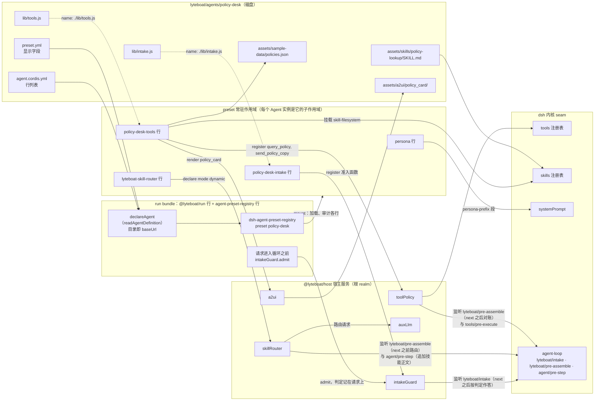
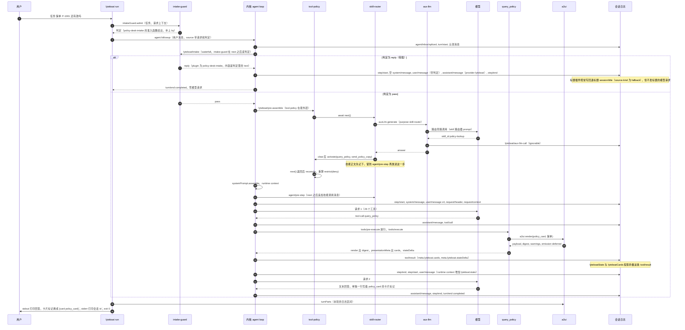
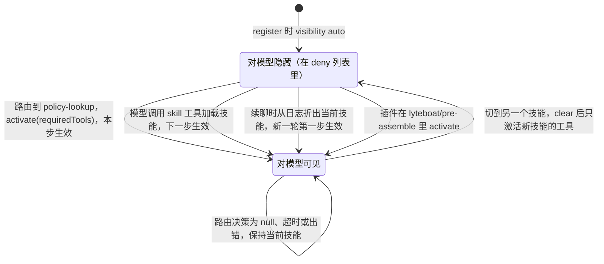

# 基于 lyteboat 开发业务 agent

> 适用版本：lyteboat `809e64d`（`refactor: one minimal example agent — finance keeps an overview, a diagnosis, and three concepts; demo removed`），跟踪 dsh `0.1.7-rc.1`，内核 13 个包（`dsh/kernel.json`）。本文覆盖到 F2 为止的能力：路由过的会话可以重开、用 `--session-id` 续聊（F1）；请求上下文、进入循环之前的准入、带审计的旁路模型调用、一个工具结果带多张卡并按标记排进回答（F2）。仓库里现在只有一个示例 agent：刻意做到最小的金融智能体 `lyteboat/agents/finance`（三个路由技能、三个工具、四张卡、进入循环之前的准入），文中提到的现成 agent 都指它。
> 读者：熟悉参考实现（Python 前身）、刚接触 dsh 的工程师。dsh / Cordis 的术语先看 §0.6，完整的架构与启动过程见 [01-architecture.md](01-architecture.md)。
> 本文贯穿全文的例子「保单查询助手」（agent id `policy-desk`）已在仓库的一份 git 副本（`git worktree`，HEAD `809e64d`）里按本文逐字落盘、构建并跑通：`pnpm run build`、`pnpm run lint`、`pnpm run typecheck`、`pnpm run test`（154 个测试文件：3004 个通过，1 个跳过）全部通过。文中的日志片段来自这些真实运行，模型标识一律写成 `<model>`。
> 路径若不加说明，都相对仓库根（注意仓库里还有一个同名子目录 `lyteboat/`，放 lyteboat 自己的各层包）。「上游」指 dsh 在 tag `dsh-v0.1.7-rc.1` 上的源码（`packages/<group>/<pkg>/src`），lyteboat 从 npm 安装的 dsh 包以它为准。

---

## 0. 一页纸总结

### 0.1 agent 就是一个目录

一个业务 agent 是 `lyteboat/agents/<id>/`，目录名就是 id（CLAUDE.md:205-206）。其中唯一必需的文件是 `agent.cordis.yml`。`lyteboat run --agents <根目录> --agent <id>` 读这个目录，把它登记给 dsh 的 `dsh-agent-preset-registry`（dsh 把它叫 preset），然后每个会话由 dsh 创建一个 `Agent` 实例并挂到这个 preset 上（`lyteboat/bundles/run/src/index.ts:188-194`、`:268-299`）。「preset」这个词在 lyteboat 里只指这套登记机制；一个 agent 定义可以有很多个运行时实例（CLAUDE.md:205）。

### 0.2 和参考实现的对应

参考实现的一个 agent 是 `agent.py` 里的 instructions / callbacks，加上 `skills/`、`tools/`、`capabilities/`。lyteboat 保留了同样的四层（参考实现 `docs/agent_design_principles.md` §1），只换了机制：

| 参考实现 | lyteboat 里写在哪 |
|---|---|
| L1 Agent：身份、红线、节奏 | `agent.cordis.yml` 里的 `persona` 行；硬拒识写成准入函数（`src/intake.ts` 用 `ctx.intakeGuard.register` 登记），请求进入循环之前就判定 |
| L2 Skill：`SKILL.md`，description 是路由信号 | `assets/skills/<name>/SKILL.md`，`metadata.lyteboat.requiredTools` 对应参考实现的 `required_tools` |
| L3 Tool：薄工具，digest 回传 | `src/tools.ts` 里 `ctx.toolPolicy.register(defineTool(...), meta)` |
| L4 Capability：纯代码、阈值、数据源 | `src/*.ts` 里的纯函数（例子里的 `src/policies.ts`） |
| `state_delta` | `ctx.toolPolicy.register(def, { stateDelta })` → 日志里的 `tool/result.meta.lyteboat.stateDelta` → `lyteboatState` 投影。参考实现的 `output_state_keys`（声明并校验状态键）在 lyteboat 里没有对应物：`LyteboatToolMeta` 只有 `visibility`、`group`、`requiresConfirmation`、`stateDelta` 四个字段（`lyteboat/core/contracts/src/index.ts:91-104`） |
| A2UI 模板卡 | `assets/a2ui/<card>/`，由 `ctx.a2ui.render(...)` 渲染；卡片随工具结果的 `meta.lyteboat.cards` 出去，一个结果可以带多张，回答里用 `[[card:<区域>]]` 标记放卡 |

### 0.3 框架替你做的事

每个 lyteboat profile 都带 `@lyteboat/host`，它在宿主平面发布这些服务（`lyteboat/bundles/host/cordis.patch.yml:21-48`）：`toolPolicy`（工具可见性、确认、状态增量）、`auxLlm`（旁路模型调用，每次在会话日志里留一条审计记录）、`requestContext`（请求上下文）、`intakeGuard`（准入）、`skillRouter`（参考实现的技能路由）、`a2ui`（参考实现的卡片模板引擎，以及一轮回答里卡片的排布）、`historyImport`（外部历史导入）。内核的 agent loop 在每一步组装 prompt 之前多派发两个 waterfall 事件：`lyteboat/intake`（拒识，直接回复且不请求模型）和 `lyteboat/pre-assemble`（路由技能、激活工具，并在同一步生效）（`dsh/core/agent-loop/src/agent.ts:277-289`）。你只写业务。

和「一次请求」有关的三件事也由框架做：

- **请求上下文。** `lyteboat run --context <json|文件>` 把一个 JSON 对象（谁在问、从哪个渠道来……）随请求记在人类消息的 `source.lyteboatRequest.context` 上（`lyteboat/bundles/run/src/startup.ts:59-72`，`lyteboat/bundles/run/src/index.ts:304-311`）。`lyteboatRequest` 投影保存会话的上下文：后面的请求不带上下文，就沿用上一次的（`lyteboat/plugins/request-context/src/index.ts:76-88`）。上下文只落日志、不发给模型，工具用 `ctx.requestContext.contextOf(exec.agent)` 读；凭据不要放进去（同文件 :11-13、:118-121）。
- **准入。** agent 用 `ctx.intakeGuard.register({ name, admit })` 登记一个准入函数。`lyteboat run` 在请求进入循环之前调用它，把判定（`decision: 'pass' | 'reply'`、`verdict`、`text`、`cards`）记在同一条人类消息的 `source.lyteboatRequest.intake` 上；判定是 `reply` 时，循环里直接用 `text` 作答，不请求模型（§2.11）。
- **旁路调用。** agent 自己要问模型一个小问题（例如给请求分类）时，用 `ctx.auxLlm.generate({ agent, purpose, system, prompt, maxTokens, timeoutMs, signal })`：它默认用 agent 的模型，带自己的超时，并在会话日志里追加一条标为可忽略的 `lyteboat/aux-llm-call` 记录（`lyteboat/plugins/aux-llm/src/index.ts:108-133`）。失败是返回值，不是异常，由调用方决定怎么退路。skill-router 的路由请求也走它；金融智能体的准入分类是现成的例子（`lyteboat/agents/finance/src/intake/finance-admission.ts:102-120`）。

agent 行要用哪个宿主服务，就在 `inject` 里写它的名字（`toolPolicy`、`a2ui`、`skills`、`requestContext`、`intakeGuard`、`auxLlm`……），在 `src` 里写一行 `import type {} from '<包名>'` 把服务的类型并进 `Context`，在 `package.json` 的 `peerDependencies` 和 `devDependencies` 里各写一次 `"<包名>": "workspace:*"`，在 `tsconfig.json` 的 `references` 里加上它的目录。金融智能体三者都用，照它写即可：`lyteboat/agents/finance/src/agent.ts:16-20`、`:27`，以及同目录的 `package.json`、`tsconfig.json`。服务名、包名和目录的对应见 §7.8。

用户点名的五种基础能力在 run 组合里都是现成的，agent 不需要自己初始化：

| 能力 | 谁提供 | agent 里怎么用 |
|---|---|---|
| llm | 内核 `@deepseek-ai/dsh-llm`（`dsh/llm/llm`），服务 `ctx.llm`；loop 用哪个模型由 `agentDefaultModel` 决定（§4.12） | agent 一般不直接调模型；要问模型时走旁路调用 `ctx.auxLlm.generate`（上面第三条），它再用 `ctx.llm.stream` 发出（`lyteboat/plugins/aux-llm/src/index.ts:148`）。skill-router 的路由请求就是这样一次旁路调用（`lyteboat/plugins/skill-router/src/index.ts:367-377`） |
| tool | 内核 `@deepseek-ai/dsh-tools`（`ctx.tools`）+ lyteboat 的 `ctx.toolPolicy` | `ctx.toolPolicy.register(defineTool(...), meta)`（§2.10） |
| skill | 内核 `@deepseek-ai/dsh-skill`（`ctx.skills`）+ npm 上的 `dsh-skill-filesystem` provider + lyteboat 的 `ctx.skillRouter` | `assets/skills/<name>/SKILL.md`，在自己的行里挂 skill-filesystem（§2.6、§2.10） |
| session | 内核 `dsh-session`、`dsh-session-persistence*`、`dsh-session-projection` | 工具里用 `exec.agent.session`；日志落在 `$LYTEBOAT_HOME/sessions/…`（§3.2）；`lyteboat run --session-id <id>` 在已存的会话上续聊（§4.10） |
| memory | 只有会话内的：`lyteboatState`（工具状态增量折成的投影，每步作为 `lyteboat:state` 发给模型，§4.8）、`lyteboatRequest`（请求上下文，不发给模型），加上会话历史本身 | 没有跨会话记忆。dsh 0.1.7-rc.1 的 `packages/` 下没有 memory 包；最接近的是 session-query（`session_search` 工具，用 SQLite FTS 检索历史会话），但 dsh-base 把它配成 `path: ':memory:'`、`openAt: never`（`node_modules/@deepseek-ai/dsh-base/cordis.patch.yml:149-153`），run 组合给模型的 24 个工具里也没有 `session_search`。另外，`dsh-agent-instructions` 会把 `$LYTEBOAT_HOME/AGENTS.md` 和项目里的 AGENTS.md/CLAUDE.md 注入第一次请求，这是人写的静态说明，不会自动学习。社区有现成的记忆插件：npm 上有 40 多个 dsh 记忆插件，其中 `@zzerx/dsh-plugin-memory` 0.3.1 是 G5 金丝雀之一（`dsh-compat/tests/canaries/canaries.yml:28`），在官方树和 lyteboat 树上表现相同。但它们各自发布自己的服务名，没有公共 seam，而且多按全局或工作区分区，不按业务用户分区；可以在自己的 agent 行里挂一个试用，但要先确认它的分区方式和写入内容符合业务要求 |

五个能力的包都在 `dsh/kernel.json` 里（llm、skill 在 `3d29a07` 晋升进内核，CLAUDE.md:76），所以任何 lyteboat 组合都一定带着它们。

### 0.4 现在 agent 能在哪里跑

只有两处会加载 agent 目录：`lyteboat run`，以及 composite 测试里的 `bootComposition`（§2.15）。`lyteboat run` 是一次性的：一个任务、一轮；这一轮打到 stdout（回答原文，每张卡片各占一行 `[card <区域>]`），会话 id 打到 stderr（`lyteboat: session <id>`），然后退出（`lyteboat/bundles/run/src/index.ts:300-323`）。

- **没有参考实现那种 FastAPI 式的服务模式。** 能通过 HTTP 访问的只有 `lyteboat web`（dsh-web-app），但它的 profile 里没有 `@lyteboat/run`，不读 agent 目录（`lyteboat/apps/cli/src/templates.ts:21-23`）。
- **多轮靠续会话。** 下一次运行加上 `--session-id <上次打出的 id>`，就在同一个会话上接着聊：dsh 的持久化层重开日志，新的一轮能看到前面的轮次，路由过的技能、它的工具、会话状态和请求上下文都还在（§4.10）。
- **也可以导入外部历史。** 用 `--history <file>` 把外部系统的几轮对话导入成一个新会话的已结束轮次，再跑一轮，例如 `node lyteboat/apps/cli/lib/bin.js run --agents ./lyteboat/agents --agent finance --context '{"customer":"young-idle-cash"}' --history lyteboat/bundles/run/tests/fixtures/history/rounds.json "继续刚才的话题"`（CLAUDE.md:230，`lyteboat/bundles/run/src/index.ts:281-288`）。`--history` 只能开新会话，不能和 `--session-id` 一起用（`lyteboat/bundles/run/src/startup.ts:124`）。
- **路由过的会话现在能重开。** 但 `lyteboat web` 不读 agent 目录（第一条），要在 agent 自己的组合下接着聊，目前只有 `lyteboat run --session-id`。

### 0.5 五步走

1. **建包**：`lyteboat/agents/<id>/` 下写 `package.json`、`tsconfig.json`，在根 `tsconfig.json` 加引用，在 `README.md` 和 `README.en.md` 的包表里各加一行，然后从干净的 `node_modules` 重新 `pnpm install`。
2. **写组合**：`agent.cordis.yml`（persona、路由、你自己的行）和可选的 `preset.yml`。
3. **写业务**：`SKILL.md`、`src/`（L4 纯函数、工具行、准入行）、`assets/a2ui/` 卡片模板。
4. **构建并试跑**：`pnpm run build`，然后在 CLI 上用脚本模型跑一遍，读会话日志。
5. **测试与验收**：单元测试、composite 测试、e2e 冒烟，跑 `pnpm run lint`、`pnpm run typecheck`、`pnpm run test`。

### 0.6 术语速查

完整的术语表在 [01-architecture.md §7.3](01-architecture.md#73-术语表)，Cordis 的依赖注入在 [01-architecture.md §2](01-architecture.md#2-生命周期与依赖注入)。本文用到的：

| 术语 | 意思 | 例子 |
|---|---|---|
| 行（row） | Cordis 插件树里的一项：`{ id, name, config }` | `agent.cordis.yml` 的每一项 |
| `!!js` | 行配置里的 YAML 标签，值是加载时求值的 JS 表达式 | `task: !!js ctx.lyteboatRunStartup.task`（`lyteboat/bundles/run/cordis.patch.yml:35`） |
| patch / bundle | patch 是对行列表的增删改；bundle 是带一层 patch 的包 | `@lyteboat/host` 的 `cordis.patch.yml` 插入八个宿主行，并关掉 dsh-base 的 `session-telemetry-otel` 行 |
| profile | 按顺序列出的 bundle 层 | `run` = dsh-base + `@lyteboat/host` + `@lyteboat/run`（`lyteboat/apps/cli/src/templates.ts:18-20`） |
| 服务 / seam | 发布在 Context 上、按名字注入的对象；dsh 的扩展点都是服务 | `ctx.tools`、`ctx.skills`、`ctx.llm`、`ctx.systemPrompt`（CLAUDE.md:62） |
| 根 realm | 宿主行发布服务的全局命名空间 | `toolPolicy`、`a2ui`、`intakeGuard` 在这里 |
| standing scope | preset 注册表给一个 preset 修订创建的作用域，agent 行挂在这里；每个 Agent 实例是它的子作用域 | `policy-desk-tools` 行 |
| waterfall | 洋葱式派发的事件：先注册的监听在外层，每层调 `next()` 进入里层 | `lyteboat/intake`、`lyteboat/pre-assemble`、dsh 的 `agent/pre-step` |
| 投影（projection） | 对会话日志事件的纯折叠 | `lyteboatState`、`lyteboatCards`、`lyteboatActiveSkill`、`lyteboatRequest` |
| runtime context | 每步以 user 消息形式追加的运行时快照，只在文本变化时追加 | `lyteboat:state` |
| 技能调用消息（skill-invocation） | dsh 自己的一种 user 消息，`source` 为 `{ kind: 'skill-invocation', name, form: 'instructions' }`，正文是 `<skill_content name="…">`。dsh-tool-skill 用它记下用户点名的技能；lyteboat 的路由器也用它把路由到的技能正文放进这一步 | §3.2 的 seq 11 |
| 请求上下文（request context） | 调用方随请求传入的 JSON 对象，记在人类消息的 `source.lyteboatRequest.context` 上，不发给模型 | `lyteboat run --context '{"channel":"app"}' …` |
| 准入（admission） | 请求进入循环之前的判定：`pass` 交给模型，`reply` 不请求模型直接作答；判定记在人类消息的 `source.lyteboatRequest.intake` 上 | `policy-desk-intake` 行登记的函数（§2.11） |
| 旁路调用（side call） | 插件替 agent 向模型发的、不进入 loop 请求的调用；每次记一条 `lyteboat/aux-llm-call` | 路由请求（§3.2 的 seq 6） |
| 可忽略记录（ignorable） | 带 `ignorable: true` 的日志记录：不认识它类型的读者（包括官方 dsh）跳过它，会话照样能重开 | `lyteboat/aux-llm-call` |

---

## 1. agent 的组成

### 1.1 目录结构

仓库里现成的参照是 `lyteboat/agents/finance`（金融智能体，刻意做到最小的示例 agent）。本文新建的 `policy-desk` 完成后长这样：

```
lyteboat/agents/policy-desk/
├── package.json              包身份、exports、files、依赖
├── tsconfig.json             src → lib，references 列出每个引用的工作区包
├── agent.cordis.yml          必需：Cordis 行列表 = preset 的 plugins
├── preset.yml                可选：显示名 name / description / order
├── assets/                   运行时读的非代码文件，与 src/、lib/ 同级
│   ├── skills/
│   │   └── policy-lookup/SKILL.md   技能：frontmatter + 正文
│   ├── a2ui/
│   │   └── policy_card/      一张卡一个目录
│   │       ├── template.json     设计稿：components + rootComponentId
│   │       ├── manifest.yaml     出卡模式，以及每个 {"path": k} 的取值规则
│   │       └── compute.js        computed 函数 + digest 钩子
│   └── sample-data/policies.json 运行时读的业务数据（示例保单簿）
├── src/                      TypeScript 源码，编译到 lib/（lib 被 gitignore）
│   ├── policies.ts           L4：纯函数
│   ├── tools.ts              行：注册工具、挂载技能目录
│   └── intake.ts             行：登记准入函数
└── tests/
    ├── policies.spec.ts      单元测试（纯逻辑 + 卡片契约）
    ├── intake.spec.ts        单元测试（准入判定）
    └── policy-desk.composite.ts   组合测试（进程内启动 run 组合 + 脚本模型）
```

另外还有一个文件在 agent 目录外：`lyteboat/apps/cli/tests/policy-desk-smoke.e2e.ts`，它在构建好的 `lyteboat` 可执行文件上做一次冒烟（CLAUDE.md:174）。

### 1.2 这些文件在运行时变成什么



为什么是这个形状：

- **目录就是 `baseUrl`。** `@lyteboat/run` 的 `declareAgent` 先用 `readAgentDefinition` 读出行和显示字段，再以目录的 `file:` URL 作为 `baseUrl` 登记（`lyteboat/bundles/run/src/index.ts:188-194`）。所以 `./lib/tools.js` 这样的相对行名、行配置里的相对路径，都相对 agent 目录解析。preset 注册表本身是 run patch 插入的另一个 dsh 行，不属于 `@lyteboat/run`（`lyteboat/bundles/run/cordis.patch.yml:25-29`）。
- **所有行跑在 preset 的常驻作用域里。** registry 的 `mount()` 把每个 Agent 实例挂成这个常驻 mount 的子作用域，同一 preset 修订版的所有实例共用一次 mount（上游 `packages/preset/agent-preset-registry/src/mount.ts:1`、`src/index.ts:264`）。所以你的行只影响本 agent 的会话，也所以按实例的状态必须按 `Agent` 分键（CLAUDE.md:81）。
- **宿主服务在根 realm，agent 行只向它们「声明」。** 宿主行发布服务；agent 行只做声明（`@lyteboat/*/agent`）或注册工具、监听器、准入函数，绝不向根 realm 发布服务（CLAUDE.md:77）。mount 时发现泄漏的服务会直接失败：`Preset services require isolate realms: …`（上游 `mount.ts:265-267`）。
- **准入在循环之外。** `@lyteboat/run` 把任务交给 Agent 之前，先用 `ctx.intakeGuard.admit` 问这个 agent 登记的准入函数（作用域最近的那个），判定和任务一起写进同一条人类消息（`lyteboat/bundles/run/src/index.ts:304-311`，`lyteboat/plugins/intake-guard/src/index.ts:91-113`）。循环里 intake-guard 只按记录作答；一条没有经过准入就进来的消息（调用方没有先调 `admit`），它在循环里补做一次，回复相同，只是判定和判定里的卡片不记在请求上（同文件 :1-13、:115-123）。

### 1.3 每个文件、每个字段

**`agent.cordis.yml`（必需）。** 一个 Cordis 行列表，每行是 `id`、`name`、`config`，允许 `!!js` 标签。`@lyteboat/run` 用 `entryListSchema` 读它，只检查「是不是列表」，原样交给 registry 作为 preset 的 `plugins`，每一行由 registry 校验（`lyteboat/bundles/run/src/agent-directory.ts:94-100`）。目录里有这个文件才算 agent（`agent-directory.ts:23`、`:28-30`）。

可用的行：

| `name` | 作用 | 配置 |
|---|---|---|
| `@deepseek-ai/dsh-persona` | 本 agent 的 persona，遮住部署级 persona | `prefix`（必填，模板）、`suffix`（省略即清空部署级后缀）、`complete`、`includeRuntimeContext`（上游 `packages/preset/persona/src/index.ts:30-54`）。它只能挂在作用域里，挂到全局会和 prompt 注册表冲突（同文件 :1-13） |
| `@lyteboat/skill-router/agent` | 打开 / 调整技能路由 | `mode`（`off`/`full`/`dynamic`）、`historyWindow`、`timeoutMs`、`provider`+`model`（必须成对，否则抛错）（`lyteboat/plugins/skill-router/src/agent.ts:24-47`、`src/index.ts:90-96`）。宿主默认 `mode: off`（`src/index.ts:77-88`） |
| `@lyteboat/tool-policy/agent` | 给别的行注册的工具（例如 dsh 官方工具）声明策略 | `tools: { <name>: { visibility?, group?, requiresConfirmation? } }`，未知键直接抛错；`stateDelta` 只能在代码里声明（`lyteboat/plugins/tool-policy/src/agent.ts:25-71`）。用法见 §4.11 |
| `@lyteboat/a2ui/agent` | 注册通用的 `render_a2ui` 工具 | `templates`（必填，相对组合文件目录）、`stateKeys`、`terminalCards`、`cardDescriptions`、`name`、`visibility`、`group`、`validation`、`components`（`lyteboat/plugins/a2ui/src/agent.ts:30-82`） |
| `./lib/<x>.js` | 你自己的代码行：注册工具、监听事件、登记准入函数 | 导出 `name`、可选的 `inject`、`Config`，以及 `apply(ctx, config)` |

**`preset.yml`（可选）。** 只用于显示：`name`（字符串）、`description`（字符串）、`order`（有限数）。文件不是映射、或字段类型不对，直接抛错（`agent-directory.ts:69-83`）。

**`package.json`。** 逐字段说明见 §2.2。要点：`exports` 只放测试要 import 的子路径，第一个键是 `@lyteboat/source` 条件（CLAUDE.md:48）；行不导出，因为 loader 按路径加载 `lib/`；依赖的写法照金融智能体，§2.2 讲它和 CLAUDE.md:88 字面规则的差别。

**`tsconfig.json`。** 继承 `../../tsconfig.base.json`（即 `lyteboat/tsconfig.base.json`：strict、`exactOptionalPropertyTypes`、`customConditions: ['@lyteboat/source']`），`rootDir: src`、`outDir: lib`；`references` 列出每个 import 的工作区包，内核包也要列（CLAUDE.md:48）。从 npm 装的 dsh 包（例如 `dsh-skill-filesystem`）不列。

**`assets/skills/<name>/SKILL.md`。** frontmatter 的 `name`（必填，连字符小写，`/^[a-z0-9]+(?:-[a-z0-9]+)*$/`，`dsh/skill/skill/src/index.ts:21`）、`description`（必填；路由器对每个候选技能只看到 id 和 description，`lyteboat/plugins/skill-router/src/router.ts:35`）、可选的 `whenToUse` / `disable-model-invocation` / `user-invocable`（上游 `packages/skill/skill-filesystem/src/index.ts:834`、`:1001-1005`），以及 lyteboat 的 `metadata.lyteboat`：`group`、`requiredTools`、`version`、`tags`（`lyteboat/core/contracts/src/index.ts:107-113`）。

**`assets/a2ui/<card>/`。** `template.json` 必需，`manifest.yaml`、`business_hierarchy.yaml`、`compute.js` 可选（`lyteboat/plugins/a2ui/src/loader.ts:41`、`:108-162`）。manifest 的出卡模式和三种取值见 §2.9。

**`assets/sample-data/`。** agent 运行时读的业务数据和示例输入。

**为什么这三样放在 `assets/`。** `assets/` 与 `src/`、`lib/` 同级。tsc 只把 `.ts` 编译进 `lib/`，不拷贝其他文件；代码从包根按同一个相对路径去找，测试时跑的是 `src/agent.ts`、运行时跑的是 `lib/agent.js`，往上一级都是包根，所以两边找到的是同一个目录，不需要构建步骤。`package.json` 的 `files` 写 `assets` 一项即可。

**`src/` → `lib/`。** 行的代码和业务逻辑。行名写 `./lib/x.js`，因为 loader 在 Node 里直接 import 编译产物（CLAUDE.md:210）。部署输入（数据源、persona 选择等）在边缘从 `Config` 或环境变量读，并写进 `package.json` 的 `description`（CLAUDE.md:210）。每个请求各不相同的输入（例如用户是谁）不是部署输入，走请求上下文（§0.3）。

**`tests/`。** `*.spec.ts` 测纯逻辑，`*.composite.ts` 测组合（§5）。

### 1.4 `lyteboat run --agents … --agent <id> "任务"` 时发生了什么

1. `run` profile 依次加载 `@deepseek-ai/dsh-base`、`@lyteboat/host`、`@lyteboat/run` 三层（`lyteboat/apps/cli/src/templates.ts:18-20`）。
2. `@lyteboat/host` 关掉 dsh-base 的 `session-telemetry-otel` 行，在宿主平面依次插入 `@lyteboat/distro`、`@lyteboat/tool-policy`、`@lyteboat/aux-llm`、`@lyteboat/request-context`、`@lyteboat/intake-guard`、`@lyteboat/skill-router`、`@lyteboat/a2ui`、`@lyteboat/history-import`（`lyteboat/bundles/host/cordis.patch.yml:14-48`）。同一 waterfall 上的监听顺序由注册先后决定，先注册的在外层（上游 `vendor/cordis/src/events.ts:234-260`）。skill-router 注入了 `toolPolicy`，所以晚于 tool-policy 激活、在它里面；agent 行要等 Agent 创建时才挂载，注册得更晚，在最里层。所以一个 agent 行自己的 `lyteboat/intake` 监听在 intake-guard 里面，先于它作出判定（§2.11）。
3. `@lyteboat/run/startup` 解析参数。没有任务、`--agents` 目录不存在、`--agent` 和 `--agents` 只给了一个、id 找不到、`--session-id` 为空或和 `--history` 同给、`--context` 不是 JSON 对象，都按用法错误退出，找不到 id 时列出可用 id（`lyteboat/bundles/run/src/startup.ts:102-132`）。
4. runner 读目录、登记 preset（`lyteboat/bundles/run/src/index.ts:188-194`、`:271-275`），按 `agentDefaultModel` 的当前选择创建 Agent，给了 `--session-id` 时改为从日志恢复那个会话（`:268`、`:290-299`），在 `setup` 里 `presets.mount(agentCtx, id)`（`:276-280`）。上游 `mountPreset` 加载各行、审计、拒绝失败的行和泄漏到根 realm 的服务（`mount.ts:258-272`）。
5. runner 先用 `intakeGuard.admit` 对任务做准入，再把任务连同请求上下文和判定写成一条用户消息 `followup` 进去，等到空闲，`sessions.flush`；然后用 `a2ui.turnParts` 把这一轮排成回答加卡片打到 stdout，把 `lyteboat: session <id>` 打到 stderr；只有本轮以 `completed` 结束才退出 0（`index.ts:300-323`）。

---

## 2. 从零开始：保单查询助手 `policy-desk`

它要做三件事：

- 用户问某张保单时，路由到技能 `policy-lookup`，调用 `query_policy`：查保单簿，把保单摘要作为**状态增量**写进会话，并通过 **A2UI 渲染一张保单卡**；模型只看到卡片的 digest，回答里写 `[[card:policy_card]]` 决定卡片放在哪。
- 用户要电子保单时，调用 `send_policy_copy`。这个工具声明了 `requiresConfirmation`，要经过审批通道。
- 用户要荐股时，**准入函数**在请求进入循环之前就给出固定回复，不经过路由器，也不请求模型。

下面每个代码块都是完整文件，照抄即可。

### 2.0 前提

在 **git clone** 出来的仓库里工作。`pnpm run build` 打包内核时要跑 `git rev-parse`（`scripts/dist/bundle-kernel.ts:52`），没有 `.git` 的源码包构建不了。

```sh
node --version        # 22.19+ 或 24
corepack enable       # 用 package.json 里钉住的 pnpm 11.7
pnpm install
pnpm run build        # tsc -b，再打包内核；产出每个包的 lib/
```

先确认仓库里的示例 agent（金融智能体）能跑（需要真实 key；没有 key 就跳过，§2.13 有脚本模型的跑法）。它要求请求上下文指明客户，`young-idle-cash` 是它的一个示例客户（`lyteboat/agents/finance/assets/sample-data/customers/`）：

```sh
DEEPSEEK_API_KEY=<你的 key> node lyteboat/apps/cli/lib/bin.js run --agents ./lyteboat/agents --agent finance --context '{"customer":"young-idle-cash"}' "看看我的资产"
```

### 2.1 建目录

```bash
mkdir -p lyteboat/agents/policy-desk/{src,tests,assets/sample-data,assets/skills/policy-lookup,assets/a2ui/policy_card}
```

`pnpm-workspace.yaml` 已经用 `lyteboat/*/*` 收录每个包（`pnpm-workspace.yaml:7`），不用改它（CLAUDE.md:187 也不允许无授权改它）。

### 2.2 `package.json`

`lyteboat/agents/policy-desk/package.json`：

```json
{
  "name": "@lyteboat/agent-policy-desk",
  "version": "0.0.1",
  "private": true,
  "license": "MIT",
  "description": "lyteboat's policy-desk agent: one routed skill that looks a policy up (state delta + policy card) and sends an e-policy copy behind confirmation, and an admission that answers stock-trading requests before the loop. Deployment input: LYTEBOAT_POLICY_DESK_BOOK, the policy book JSON (defaults to assets/sample-data/policies.json)",
  "type": "module",
  "exports": {
    "./policies": {
      "@lyteboat/source": "./src/policies.ts",
      "types": "./lib/policies.d.ts",
      "default": "./lib/policies.js"
    },
    "./intake": {
      "@lyteboat/source": "./src/intake.ts",
      "types": "./lib/intake.d.ts",
      "default": "./lib/intake.js"
    }
  },
  "files": ["lib", "preset.yml", "agent.cordis.yml", "assets"],
  "dependencies": {
    "@lyteboat/contracts": "workspace:*",
    "@deepseek-ai/dsh-skill-filesystem": "catalog:dsh",
    "@deepseek-ai/dsh-tools": "workspace:*"
  },
  "peerDependencies": {
    "@lyteboat/a2ui": "workspace:*",
    "@lyteboat/intake-guard": "workspace:*",
    "@lyteboat/tool-policy": "workspace:*",
    "@deepseek-ai/cordis": "catalog:cordis"
  },
  "devDependencies": {
    "@lyteboat/a2ui": "workspace:*",
    "@lyteboat/host": "workspace:*",
    "@lyteboat/intake-guard": "workspace:*",
    "@lyteboat/run": "workspace:*",
    "@lyteboat/testing": "workspace:*",
    "@lyteboat/tool-policy": "workspace:*",
    "@deepseek-ai/cordis": "catalog:cordis"
  }
}
```

| 字段 | 为什么这样写 |
|---|---|
| `name` | `@lyteboat/agent-<id>`，名字带归属（CLAUDE.md:90） |
| `license` | 和仓库里其他包一样是 `MIT` |
| `description` | 写明部署输入 `LYTEBOAT_POLICY_DESK_BOOK`（CLAUDE.md:210） |
| `exports["./policies"]`、`exports["./intake"]` | 只导出单元测试要 import 的子路径。第一个键 `@lyteboat/source` 指向 `src`，所以 vitest 的 `source` 项目和 typecheck 读本包的源码；Node 和 CLI 走 `default`，读 `lib/`（CLAUDE.md:48，`vitest.config.ts:4-11`） |
| `files` | 发布时需要的全部运行时文件：`lib`、两个 yml、`assets` |
| `dependencies` | 照金融智能体（`lyteboat/agents/finance/package.json:31-37`，它另有本例用不到的 `zod` 和 `dsh-llm`）：代码里当库用的包。`@deepseek-ai/dsh-tools` 提供纯函数 `defineTool`（内核包，所以是 `workspace:*`）；`@deepseek-ai/dsh-skill-filesystem` 由本行自己 `ctx.plugin` 挂载（npm 包，`catalog:dsh`）；`@lyteboat/contracts` 只提供类型 |
| `peerDependencies` | 作为**服务**注入、只 import 类型的包：`@lyteboat/tool-policy`、`@lyteboat/a2ui`、`@lyteboat/intake-guard`，以及 cordis。peer 表示「用宿主树里那一份」。用到 `requestContext`、`auxLlm` 时照同样的写法加 `@lyteboat/request-context`、`@lyteboat/aux-llm`（金融智能体的 `package.json`） |
| `devDependencies` | composite 测试要启动的 bundle（`@lyteboat/host`、`@lyteboat/run`）和 `@lyteboat/testing`，peer 再列一遍。agent 只能经 devDependencies 依赖 `bundles` 和 `tooling`（`scripts/check-layers.ts:22-41`） |

**这套分法是金融智能体的做法，不是 CLAUDE.md 的字面规则。** CLAUDE.md:88 说 dsh 和 cordis 包写成 `peerDependencies`（外加 `devDependencies`）。现有的包并不一致：金融智能体把 `dsh-tools`、`dsh-skill-filesystem` 放在 `dependencies`；`@lyteboat/tool-policy` 把 `dsh-scope` 放在 `dependencies`，却把 `dsh-tools` 放在 peer（`lyteboat/plugins/tool-policy/package.json:21-34`）。两种写法 knip、check-layers、upstream-pins 都接受。写 dsh peer 时有一条硬约束：内核包写 `workspace:*`，非内核 dsh 包写跟踪版本的精确号 `0.1.7-rc.1`，不能写 `catalog:dsh`。原因是 dsh 启动准入从磁盘上的 manifest 读一行的 dsh peer，而 pnpm 不会解析那里的 `catalog:`（CLAUDE.md:88，`scripts/upstream-pins.spec.ts:40-54`）。本例照金融智能体写，没有非内核的 dsh peer；把 `dsh-skill-filesystem` 改成 peer 的变体本文没有验证过。

### 2.3 `tsconfig.json`、根引用、README、重装依赖

`lyteboat/agents/policy-desk/tsconfig.json`：

```json
{
  "extends": "../../tsconfig.base.json",
  "compilerOptions": {
    "rootDir": "src",
    "outDir": "lib"
  },
  "include": ["src"],
  "references": [
    { "path": "../../../dsh/core/tools" },
    { "path": "../../core/contracts" },
    { "path": "../../plugins/tool-policy" },
    { "path": "../../plugins/a2ui" },
    { "path": "../../plugins/intake-guard" }
  ]
}
```

`references` 对应 `src` 里 import 的每个工作区包：内核的 `dsh/core/tools`、`lyteboat/core/contracts`、`lyteboat/plugins/tool-policy`、`lyteboat/plugins/a2ui`、`lyteboat/plugins/intake-guard`。`references` 决定 `tsc -b` 的构建顺序：被引用的包先构建。CLAUDE.md:48 要求每个被 import 的工作区包都列上，内核包也一样。

根 `tsconfig.json` 在 finance 那一项后面加一项（finance 那一项在 `tsconfig.json:80-82`）：

```diff
     {
       "path": "./lyteboat/agents/finance"
     },
+    {
+      "path": "./lyteboat/agents/policy-desk"
+    },
     {
       "path": "./lyteboat/tooling/testing"
     }
```

`tsconfig.tests.json` 已经包含 `lyteboat/agents/*/{src,tests}`，knip 已经把 `lyteboat/agents/*/src/*.ts` 当入口（`knip.jsonc:37-40`），这两处不用改。

两份 README 的包表要在同一个提交里跟上（CLAUDE.md:142）。在 `README.md` 的 `lyteboat/agents/finance` 那一行下面加：

```markdown
| `lyteboat/agents/policy-desk` | `@lyteboat/agent-policy-desk` | 保单查询助手：一个路由技能，查询工具写会话状态并出保单卡，寄送工具需用户确认，荐股类请求在进入循环前由准入函数直接回复 |
```

在 `README.en.md` 的 `lyteboat/agents/finance` 那一行下面加：

```markdown
| `lyteboat/agents/policy-desk` | `@lyteboat/agent-policy-desk` | The policy-desk agent: one routed skill, a lookup tool that fills the session state and renders the policy card, a copy tool behind confirmation, an admission that answers stock-trading requests before the loop |
```

然后**从干净的 `node_modules`** 重装。README 要求增删工作区包之后这样做，因为增量 `pnpm install` 会留下过期的提升链接（README「pnpm 设置为什么和常见项目不同」）。在 `809e64d` 的一份刚装好的副本上实测，增量安装之后根 `node_modules/@lyteboat/` 下已经有 `agent-policy-desk`，没有碰到过期链接；本文仍照 README 的规则删掉根 `node_modules` 再装，结果一样：

```sh
rm -rf node_modules && pnpm install
ls node_modules/@lyteboat/ | grep policy-desk     # 应输出 agent-policy-desk
git status --short                            # pnpm-lock.yaml 多了 lyteboat/agents/policy-desk 这个 importer，要一起提交
```

CI 用 `--frozen-lockfile` 安装（CLAUDE.md:217），所以 `pnpm-lock.yaml` 的改动必须提交。

### 2.4 `agent.cordis.yml`

`lyteboat/agents/policy-desk/agent.cordis.yml`：

```yaml
# The policy-desk agent's composition. Every row runs in this agent's standing
# scope: the persona, the router's dynamic mode, the tools and skills that
# ./lib/tools.js registers, and the admission that ./lib/intake.js registers
# reach exactly the sessions of this agent.
- id: persona
  name: '@deepseek-ai/dsh-persona'
  config:
    prefix: 'You are POLICY-DESK-PERSONA, 一名保单查询助手。只回答与用户保单有关的问题，回答用中文，称用户为「您」；不编造工具没有给出的数字。'

- id: lyteboat-skill-router
  name: '@lyteboat/skill-router/agent'
  config:
    mode: dynamic
    historyWindow: 6
    timeoutMs: 10000

- id: policy-desk-tools
  name: ./lib/tools.js

- id: policy-desk-intake
  name: ./lib/intake.js
```

- **`persona`**：只放身份、红线、语气（设计原则的 L1）。prefix 写成一行：YAML 的折叠写法 `>-` 会在换行处插入一个空格，两行中文之间就多出一个空格。
  - `POLICY-DESK-PERSONA` 是给测试断言系统 prompt 用的标记。它会进入真实的系统 prompt，模型看得到。上线用的 persona 要去掉它，测试改为断言 persona 里的一句原文。
  - 省略了 `suffix`，所以部署级 persona 后缀（run bundle 的 `Your working directory is {{cwd}}.`，`lyteboat/bundles/run/cordis.patch.yml:11-15`）被清空；想保留就在这一行写上 `suffix`。
- **`lyteboat-skill-router`**：宿主默认 `mode: off`，agent 要用参考实现的动态路由必须在这里打开（`lyteboat/plugins/skill-router/src/agent.ts:1-6`）。
- **监听顺序。** agent 行都比宿主服务晚注册，所以如果你的行也监听 `lyteboat/pre-assemble`，它会位于 tool-policy 和 skill-router 之内；监听 `lyteboat/intake` 的话，它位于 intake-guard 之内（§1.4 第 2 步、§4.4）。同一 agent 的几行之间谁先谁后取决于激活的先后，不要依赖它。

### 2.5 `preset.yml`

`lyteboat/agents/policy-desk/preset.yml`：

```yaml
name: 保单查询助手
description: 按保单号查询状态、保额与保障期间并出一张保单卡；寄送电子保单需用户确认；不回答荐股类问题。
order: 2
```

三个字段都只用于显示（CLAUDE.md:206）；`order` 接着金融智能体的 1 往下排（`lyteboat/agents/finance/preset.yml:3`）。

### 2.6 技能：`assets/skills/policy-lookup/SKILL.md`

```markdown
---
name: policy-lookup
description: 按保单号查询一张保单的状态、保额、保障期间与下次缴费日并出一张保单卡，或把电子保单寄到登记邮箱。用户给出保单号、问「保单还有效吗 / 保额多少 / 什么时候到期 / 下次什么时候缴费」或要电子保单归此；理赔进度、产品推荐、投资建议不归此。
metadata:
  lyteboat:
    group: policy-desk
    version: "1.0"
    requiredTools: [query_policy, send_policy_copy]
---

# 保单查询

用户问到某张保单时，先调用 `query_policy(policy_no)` 一次：它取数、把保单摘要写进会话状态，并出一张保单卡。用户没给保单号时，先请用户提供保单号，不要猜。

终稿按工具 digest 组稿：卡片前一句，卡片标记单独一行，卡片后一句 ≤25 字的收尾，不复述卡内数字。工具返回 `status=not-found` 时，请用户核对保单号。

用户要电子保单时调用 `send_policy_copy(policy_no)`。这个动作需要用户确认；工具被拒绝或确认渠道不可用时，如实告诉用户这次没有寄出，不要声称已发送。
```

- `name` 用连字符。写成 `policy_lookup` 时，这个技能会被**静默丢弃**，见 §4.3。
- 路由器对每个候选技能只看到 id 和 `description`，所以 description 要写 WHAT、WHEN、关键词，以及和相邻技能的边界（设计原则 §3）。
- description 在两个地方出现，长度处理不同。路由器 prompt 发送全文（`lyteboat/plugins/skill-router/src/router.ts:35`）；每个 loop 请求里的技能目录（`skill-catalog` 那条 user 消息）由 dsh-tool-skill 截断到 `catalogDescriptionMaxLength`，默认 500 字符（上游 `packages/skill/tool-skill/src/index.ts:27`、`:391-393`）。参考实现在 `skill_description_max_chars` 处截断，lyteboat 的路由器不截断，所以要靠约定保持简短。
- `requiredTools` 必须和正文实际调用的工具一致（设计原则 §3）：多列会污染工具面，少列会让工具不可见。路由到本技能时，skill-router 先 `clear` 再 `activate` 这两个工具（`lyteboat/plugins/skill-router/src/index.ts:410-419`），并把正文作为一条 dsh 的技能调用消息放进这一步（§3.1）。
- 正文里的「卡片标记」指 digest 给出的 `[[card:policy_card]]`（§2.9）；卡片标记写不写、写在哪，决定这张卡在回答里的位置。
- 正文不写业务规则和阈值（那些属于 L4），也不描述模型看不见的字段。

### 2.7 业务数据：`assets/sample-data/policies.json`

```json
{
  "policies": [
    {
      "policy_no": "P-1001",
      "product": "安心医疗保险",
      "kind": "医疗险",
      "status": "active",
      "insured": "本人",
      "sum_insured": "2000000.00",
      "premium": "1280.00",
      "start_date": "2026-01-01",
      "end_date": "2026-12-31",
      "next_due": "2026-12-01"
    },
    {
      "policy_no": "P-2002",
      "product": "长青定期人寿保险",
      "kind": "人寿保险",
      "status": "lapsed",
      "insured": "配偶",
      "sum_insured": "500000.00",
      "premium": "3600.00",
      "start_date": "2023-05-10",
      "end_date": "2043-05-09",
      "next_due": "2026-05-10"
    }
  ]
}
```

### 2.8 L4：`src/policies.ts`

纯函数，不依赖任何框架服务，对应参考实现的 capability 层。文件是真实边界，所以要校验，坏文件直接抛错，而不是拿残缺数据回答（CLAUDE.md:94-95）。

```ts
/**
 * The policy book behind the policy-desk agent: read and check the JSON
 * export, look one policy up by number, and cut the summary that enters the
 * session state. Pure functions over plain data; the tools row is the only
 * runtime caller.
 * @module @lyteboat/agent-policy-desk/policies
 */

import { readFileSync } from 'node:fs'

export type PolicyStatus = 'active' | 'lapsed' | 'expired'

/** One policy as the book exports it: amounts are decimal strings, dates ISO days. */
export type PolicyRecord = {
  policy_no: string
  product: string
  kind: string
  status: PolicyStatus
  insured: string
  sum_insured: string
  premium: string
  start_date: string
  end_date: string
  next_due: string
}

/** What the session state keeps of a policy: enough for follow-up questions, no one's identity. */
export type PolicySummary = Pick<PolicyRecord, 'policy_no' | 'product' | 'status' | 'sum_insured' | 'end_date' | 'next_due'>

const FIELDS = ['policy_no', 'product', 'kind', 'status', 'insured', 'sum_insured', 'premium', 'start_date', 'end_date', 'next_due'] as const
const STATUSES: readonly string[] = ['active', 'lapsed', 'expired']

function isRecord(value: unknown): value is Record<string, unknown> {
  return typeof value === 'object' && value !== null && !Array.isArray(value)
}

/**
 * Read the policy book.
 * @param file - a JSON file `{ "policies": [PolicyRecord, …] }`.
 * @returns the policies in file order.
 * @throws when the file is not that shape: a malformed book fails loud instead of answering from partial data.
 */
export function loadPolicies(file: string): PolicyRecord[] {
  const doc: unknown = JSON.parse(readFileSync(file, 'utf8'))
  const list = isRecord(doc) ? doc['policies'] : undefined
  if (!Array.isArray(list)) throw new Error(`policy-desk: ${file} must be an object with a "policies" list`)
  return list.map((entry: unknown, index) => {
    if (!isRecord(entry)) throw new Error(`policy-desk: ${file} policies[${String(index)}] must be an object`)
    for (const field of FIELDS) {
      if (typeof entry[field] !== 'string') throw new Error(`policy-desk: ${file} policies[${String(index)}].${field} must be a string`)
    }
    if (!STATUSES.includes(String(entry['status']))) throw new Error(`policy-desk: ${file} policies[${String(index)}].status must be one of ${STATUSES.join(', ')}`)
    // File boundary: every field was checked above.
    return entry as PolicyRecord
  })
}

/**
 * Find one policy by number, ignoring case and surrounding blanks.
 * @param policies - the book.
 * @param policyNo - the number the model extracted from the user's words.
 */
export function findPolicy(policies: readonly PolicyRecord[], policyNo: string): PolicyRecord | undefined {
  const wanted = policyNo.trim().toUpperCase()
  return policies.find(policy => policy.policy_no.toUpperCase() === wanted)
}

/** The fields of a policy the session state carries. */
export function policySummary(policy: PolicyRecord): PolicySummary {
  const { policy_no, product, status, sum_insured, end_date, next_due } = policy
  return { policy_no, product, status, sum_insured, end_date, next_due }
}
```

`policySummary` 故意去掉了 `insured` 和 `premium`。原因在机制上：状态增量原样持久化在会话日志里（`tool/result.meta.lyteboat.stateDelta`），折成 `lyteboatState` 以后每一步都作为 `lyteboat:state` runtime context 重新发给模型（`lyteboat/plugins/tool-policy/src/index.ts:108-116`，§4.8）。所以写进状态的东西要少，也不能带个人信息。

### 2.9 A2UI 卡片：`assets/a2ui/policy_card/`

卡片分三部分：`template.json` 是设计稿，`manifest.yaml` 规定出卡模式和每个绑定怎么取值，`compute.js` 放代码钩子。渲染结果由工具放进结果的 `meta.lyteboat.cards`，模型只看 digest（CLAUDE.md:209）。

`template.json`：

```json
{
  "event": "beginRendering",
  "version": "1.0.0",
  "surfaceId": "policy-card",
  "rootComponentId": "root",
  "showType": "card",
  "components": [
    { "id": "root", "component": { "Column": { "width": 100, "gap": 12, "children": { "explicitList": ["header", "policy-no", "sum-insured", "period", "lapse-tip"] } } } },
    { "id": "header", "component": { "Row": { "distribution": "spaceBetween", "children": { "explicitList": ["product", "status"] } } } },
    { "id": "product", "component": { "Text": { "text": { "path": "product" }, "fontSize": "16px", "fontWeight": 600 } } },
    { "id": "status", "component": { "Tag": { "text": { "path": "status_text" } } } },
    { "id": "policy-no", "component": { "Text": { "text": { "path": "policy_no_text" }, "fontSize": "12px" } } },
    { "id": "sum-insured", "component": { "Text": { "text": { "path": "sum_insured_text" } } } },
    { "id": "period", "component": { "Text": { "text": { "path": "period_text" } } } },
    { "id": "lapse-tip", "component": { "Text": { "hide": { "path": "lapse_tip_hide" }, "text": { "literalString": "该保单已失效，可在复效期内申请恢复。" } } } }
  ]
}
```

- 绑定写成 `{"path": "<key>"}`。`Text.text` 这类契约字段解析成 `{"literalString": …}`，`hide` 为真时整棵子树被丢掉（`lyteboat/plugins/a2ui/src/walker.ts:39`、`:125-128`）。
- 组件类型要在客户端组件目录里。默认目录是参考实现客户端的 `Row`、`Column`、`Text`、`Tag`、`Button` 等（`lyteboat/plugins/a2ui/src/contract.ts:36-50`）。
- 顶层的 `surfaceId` 只是占位。渲染时换成 `<card>-<sessionId 前 8 个字符>-<6 位 hex>`（`lyteboat/plugins/a2ui/src/engine.ts:104-106`、`:144-147`）。lyteboat 的会话 id 总是 `session-<uuid>`（`lyteboat/bundles/run/src/index.ts:294`），前 8 个字符恰好是 `session-`，所以实际的 surfaceId 形如 `policy_card-session--2eb043`，中间是两个连字符。

`manifest.yaml`：

```yaml
# policy_card: one entry per {"path": k} that template.json binds. The raw data
# namespace is what query_policy passes to ctx.a2ui.render: { policy: {...} }.
#   state:     a dotted path into the raw data, with an optional default
#   transform: the transforms DSL (concat, switch, get, ...)
#   computed:  a named export of compute.js; "state:<path>" args are resolved first

# `deferred`: the card sits where the answer writes [[card:policy_card]],
# or follows the answer when it never does.
emission_mode: deferred

paths:
  product:
    kind: state
    path: "policy.product"
    default: "-"

  status_text:
    kind: transform
    spec:
      switch: "policy.status"
      cases:
        active: "有效"
        lapsed: "已失效"
        expired: "已满期"
      default: "未知"

  policy_no_text:
    kind: transform
    spec:
      concat: ["保单号 ", {get: "policy.policy_no"}]

  period_text:
    kind: transform
    spec:
      concat: ["保障期间 ", {get: "policy.start_date"}, " 至 ", {get: "policy.end_date"}]

  sum_insured_text:
    kind: computed
    fn: sum_insured_text
    args: ["state:policy.sum_insured"]

  lapse_tip_hide:
    kind: computed
    fn: lapse_tip_hide
    args: ["state:policy.status"]
```

三种 `kind` 的解析顺序是先 state、再 transform、最后 computed（`lyteboat/plugins/a2ui/src/resolver.ts:65-84`）。transform 的 DSL 支持 `get`、`concat`、`switch`、`select`、`sum`、`count`、`literal`（`lyteboat/plugins/a2ui/src/transforms.ts:222-313`）。取值失败不抛错，而是降级成空串并在返回值的 `warnings` 里记一条 `[MANIFEST] …`（`resolver.ts:31-59`），§2.10 的工具把它们打成 warn。

顶层的 `emission_mode` 是这张卡的**出卡模式**，决定它在一轮回答里放在哪（`lyteboat/plugins/a2ui/src/loader.ts:134-140`，排布规则在 `lyteboat/plugins/a2ui/src/turn-parts.ts:35-64`）：

- `immediate`（不写时的默认）：工具结果一到就显示，排在回答前面，按到达的先后。
- `deferred`：放在回答写 `[[card:<区域>]]` 的位置；回答没写这个标记，而本轮正常结束（`completed`），就跟在回答后面。
- `deferred_discard`：只放在标记处，回答没写标记就不显示。

回答里写了标记、这一轮却没有对应的卡（例如没查到保单），标记被删掉；卡片放下以后，标记后面紧跟的空白和收尾标点也一起删掉，因为卡片自成一块（`turn-parts.ts:21-27`）。本轮没有正常结束时，没被标记放下的延迟卡都不显示。区域（area）名由工具在结果里给出，本例用卡片名 `policy_card`（§2.10）；标记里的区域名只能是 ASCII 字母、数字、`_`、`-` 或汉字，最多 64 个（`turn-parts.ts:18-19`）。`emission_mode` 写成别的值，loader 只打一条 warn，按 `immediate` 处理（`loader.ts:139`，`engine.ts:108`）。

`compute.js`：

```js
// compute.js — the policy_card's code hooks. Named exports are the manifest's
// `computed.fn` entries; `digest(raw, flat)` is the one line the model reads
// in place of the card.

function money(raw) {
  const value = Number(String(raw ?? '0'))
  return (Number.isFinite(value) ? value : 0).toLocaleString('en-US', { minimumFractionDigits: 2, maximumFractionDigits: 2 })
}

export function sum_insured_text(sumInsured) {
  return `保额 ${money(sumInsured)} 元`
}

export function lapse_tip_hide(status) {
  return status !== 'lapsed'
}

export function digest(raw, _flat) {
  const policy = (raw ?? {}).policy ?? {}
  return `[卡片:保单/${policy.status ?? 'unknown'}] ${policy.product ?? '-'} · 保额${money(policy.sum_insured)}元 · 保障至${policy.end_date ?? '-'} · 下次缴费${policy.next_due ?? '-'} · 卡前一句，[[card:policy_card]] 单独一行，卡后一句简短收尾（≤25字），不复述卡内数字`
}
```

`digest(raw, flat)` 的返回值成为工具的 digest（`lyteboat/plugins/a2ui/src/engine.ts:121-141`）。这里沿用参考实现的写法：先给结构化的事实头，再给收尾提示；卡片是 `deferred`，所以提示里写明标记，模型照着把 `[[card:policy_card]]` 单独写一行。这个工具只属于一个技能，所以 digest 里可以带收尾提示；如果工具被多个技能共用，参考实现要求 digest 只报事实（参考实现 §4）。`digest` 抛错时，引擎打一条 warn 并返回空串（`engine.ts:124-131`），所以 §2.10 的工具要给一个回退 digest。`compute.js` 还可以导出 `stateDelta(raw, flat)` 钩子（`loader.ts:146-159`），本例不用。

`business_hierarchy.yaml` 省略了：没有它时，引擎使用模板自己的 `rootComponentId`、不做过滤（`engine.ts:111-119`）。

### 2.10 工具行：`src/tools.ts`

```ts
/**
 * The policy-desk agent's tools and skills row: `query_policy` (look one
 * policy up, fold its summary into the session state, render the policy card
 * in the same call) and `send_policy_copy` (an action behind the approval
 * seam), both `auto` tools the routed skill activates; the agent's skills
 * directory, mounted as a scoped skill-filesystem provider.
 * @module @lyteboat/agent-policy-desk/tools
 */

import { dirname, join } from 'node:path'
import { fileURLToPath } from 'node:url'
import type { Context } from '@deepseek-ai/cordis'
import { defineTool } from '@deepseek-ai/dsh-tools'
import * as skillFilesystem from '@deepseek-ai/dsh-skill-filesystem'
import type {} from '@lyteboat/tool-policy'
import type {} from '@lyteboat/a2ui'
import type { JsonValue, LyteboatResultCard } from '@lyteboat/contracts'
import { findPolicy, loadPolicies, policySummary } from './policies.ts'

export const name = 'policy-desk-tools'
export const inject = ['toolPolicy', 'a2ui', 'skills']

/** The agent directory (this file runs as lib/tools.js). */
const AGENT_DIR = join(dirname(fileURLToPath(import.meta.url)), '..')
const TEMPLATES = join(AGENT_DIR, 'assets', 'a2ui')
const SKILLS = join(AGENT_DIR, 'assets', 'skills')

/** The policy book; a deployment points LYTEBOAT_POLICY_DESK_BOOK at its own export. */
function policyBook(): string {
  return process.env['LYTEBOAT_POLICY_DESK_BOOK'] ?? join(AGENT_DIR, 'assets', 'sample-data', 'policies.json')
}

const POLICY_NO = { type: 'string', required: true, description: '保单号，形如 P-1001' } as const

export async function apply(ctx: Context): Promise<void> {
  await ctx.plugin(skillFilesystem, { providerName: 'policy-desk', includeDefaultRoots: false, customSkillDirs: [SKILLS], watch: false })

  ctx.toolPolicy.register(defineTool({
    name: 'query_policy',
    description: '按保单号查询一张保单（状态、保额、保障期间、下次缴费日），写入会话状态，并渲染一张保单卡。',
    parameters: { policy_no: POLICY_NO },
    output: {
      schema: {
        type: 'object',
        additionalProperties: false,
        properties: {
          status: { type: 'string', required: true },
          digest: { type: 'string', required: true },
          cards: { type: 'array', required: true, items: { type: 'json' } },
          policy: { type: 'json' },
        },
      },
      render: (_args, value) => [{ type: 'text', text: `status=${value.status} · ${value.digest}` }],
      presentationMeta: (_args, value) => value.cards.length === 0 ? {} : { lyteboat: { cards: value.cards } },
    },
    execute: async (args, exec) => {
      const policy = findPolicy(loadPolicies(policyBook()), args.policy_no)
      if (policy === undefined) return { status: 'not-found', digest: `未找到保单 ${args.policy_no}，请用户核对保单号`, cards: [] }
      const rendered = await ctx.a2ui.render(TEMPLATES, 'policy_card', { policy }, { sessionId: exec.agent?.session.id ?? '' })
      // render() returns manifest degradations instead of logging them; only render_a2ui logs its own.
      for (const warning of rendered.warnings) ctx.logger.warn(`policy-desk: ${warning}`)
      const card: LyteboatResultCard = {
        surfaceId: String(rendered.payload['surfaceId']),
        // The name the answer's [[card:policy_card]] marker places the card by.
        area: 'policy_card',
        emission: rendered.emission,
        payload: rendered.payload as JsonValue,
      }
      return {
        status: 'ok',
        // A throwing digest hook leaves '' (the engine warns); the model must still learn a card went out.
        digest: rendered.digest !== '' ? rendered.digest : '[卡片:保单] 已渲染',
        cards: [card],
        policy: policySummary(policy),
      }
    },
  }), {
    visibility: 'auto',
    group: 'policy-desk',
    stateDelta: (_args, value) => {
      const policy = (value as { policy?: JsonValue }).policy
      return policy === undefined ? undefined : { 'policy_desk.current': policy }
    },
  })

  ctx.toolPolicy.register(defineTool({
    name: 'send_policy_copy',
    description: '把一张保单的电子保单寄到投保时登记的邮箱。执行前需要用户确认。',
    parameters: { policy_no: POLICY_NO },
    output: {
      schema: {
        type: 'object',
        additionalProperties: false,
        properties: { status: { type: 'string', required: true } },
      },
      render: (args, value) => [{ type: 'text', text: `status=${value.status} · 电子保单 ${args.policy_no}` }],
    },
    // A real deployment hands the request to its mail gateway here; the example book only checks the number.
    execute: async (args) => ({ status: findPolicy(loadPolicies(policyBook()), args.policy_no) === undefined ? 'not-found' : 'queued' }),
  }), { visibility: 'auto', group: 'policy-desk', requiresConfirmation: true })
}
```

逐项解释：

- **`inject`** 声明本行用到的服务，服务齐了 Cordis 才调用 `apply`。`toolPolicy`、`a2ui` 是直接调用的；`skills` 是挂载的 skill-filesystem 子插件要注册 provider 的服务。
- **技能目录挂在本行下面。** `ctx.plugin(skillFilesystem, { includeDefaultRoots: false, customSkillDirs: [SKILLS], watch: false })` 只挂本 agent 的 `assets/skills/`，它跟随 preset 的作用域（照金融智能体的 `lyteboat/agents/finance/src/agent.ts:40`）。
- **`ctx.toolPolicy.register(definition, meta)`**：在调用方作用域的层里注册工具，同时登记 lyteboat 元数据，返回一个同时撤销两者的 disposer（`lyteboat/plugins/tool-policy/src/index.ts:141-155`）。
  - `visibility: 'auto'`：技能被路由到之前对模型隐藏。每次 `lyteboat/pre-assemble` 结束后，tool-policy 重新计算本 agent 的 `restrict({ deny })`（`index.ts:120-123`、`:235-264`）。
  - `requiresConfirmation: true`：在 `tools/pre-execute` 里，tool-policy 把 `allow` 改成 `ask`（`index.ts:124-131`），由审批通道决定。`lyteboat run` 里没有应答方，默认答案是 `unavailable`，内核据此拒绝调用：`tool "send_policy_copy" requires approval, but no approval channel is available`（`dsh/core/tools/src/index.ts:1727-1765`）。
  - `stateDelta: (args, value) => …`：tool-policy 把它包进 `output.presentationMeta`，于是结果 meta 带上 `{ lyteboat: { stateDelta } }`，并和工具自己的 `lyteboat.cards` 合并（`tool-policy/src/index.ts:74-92`）。
  - **`stateDelta` 的契约**：返回一个以点路径为键的 JSON 对象，或者 `undefined`（不写状态）。点路径展开成嵌套对象，嵌套对象深度合并，其他值直接替换（`lyteboat/plugins/tool-policy/src/state.ts:40-68`）。返回非对象、或者路径里有空段，会在 `lyteboatState` 投影折叠时抛错（`state.ts:59-64`、`:92-97`）。这不是 warn，整次运行失败。实测把键写成 `'policy_desk..current'`：退出码 1，stderr 为 `lyteboat: UNKNOWN: invalid state delta at session seq 20: state delta path "policy_desk..current" has an empty segment`。
- **`defineTool`**（`dsh/core/tools/src/schema.ts:483-554`）：
  - `parameters` 是逐属性的规格。`required` 只能写 `true`（`schema.ts:293`），对象类型必须显式写 `additionalProperties`（`schema.ts:368`）。包装后的 `execute` 先校验参数，不合格就抛 `ToolArgsError`（`schema.ts:597-601`）；但 `execute` 仍然要把参数当作不可信输入（CLAUDE.md:94）。
  - `output.render(args, value)` 产出**模型看得到**的内容，这里就是 digest。
  - `output.presentationMeta(args, value)` 产出**持久化但模型看不到**的 meta。它只对模型直接发起的调用计算（`dsh/core/tools/src/index.ts:1843-1851`）。带 `exec.parent` 的调用不计算：那是 `run_code`（PTC 模式）的 SDK 发出的子调度（`index.ts:340-349`）。所以在 `DSH_TOOLS_MODE=ptc` 下（`lyteboat/bundles/run/cordis.patch.yml:17-19`），经 `run_code` 调到的 `query_policy` 既不出卡也不写状态。子 agent 里的工具调用对子 agent 来说是模型直接调用，会计算 meta，但写进子会话自己的日志，不会折进父会话的 `lyteboatState`。CLAUDE.md:114-115 和 `tool-policy/src/state.ts:83-84` 的注释把这件事说成「子 agent 的调用不算 meta」，以代码为准。
  - `cards` 在输出 schema 里写成 `{ type: 'array', items: { type: 'json' } }`。`LyteboatResultCard` 是 type 而不是 interface，所以能直接当 JSON 值放进去（`lyteboat/core/contracts/src/index.ts:122-129`）。`presentationMeta` 只在有卡时返回 `{ lyteboat: { cards } }`：`lyteboatCards` 投影、`turnParts` 和 `lyteboat run` 的输出都只读 `meta.lyteboat.cards` 这个数组（`lyteboat/plugins/a2ui/src/index.ts:111-115`），单数的 `card` 键没有人读。
  - 输出 schema 里给字符串写 `enum` 时，`execute` 返回的字面量 `'ok'` 会被推断成 `string`，`tsc -b` 在 `execute` 属性上报 TS2322，错误链的最后一行是 `Type 'string' is not assignable to type '"ok" | "not-found"'`。写这个例子时实际遇到过，所以这里没有写 `enum`；给返回的字面量加 `as const` 也能通过。
- **查不到保单时不抛错**，返回 `status: 'not-found'` 和一句降级 digest，保持上下文连贯（设计原则 §4「失败必须给降级 digest」）。这时 `presentationMeta` 返回 `{}`、`stateDelta` 返回 `undefined`，经 tool-policy 包装后结果的 meta 是 `{"lyteboat":{}}`（`lyteboat/plugins/tool-policy/src/index.ts:81-89`），不出卡也不写状态。实测：`tool/result` 文本为 `status=not-found · 未找到保单 P-1001，请用户核对保单号`，meta 为 `{"lyteboat":{}}`。
- **每张卡是一个 `LyteboatResultCard`：`{ surfaceId, area, emission, payload }`。** `surfaceId` 和 `payload` 来自渲染结果；`area` 是回答里标记用的名字，本例用卡片名；`emission` 取 `render()` 返回的 `emission`，也就是 manifest 的 `emission_mode`（§2.9）。一个工具结果可以带多张卡，按数组顺序排进回答：金融智能体的 `allocation_diagnosis` 一次出 `allocation_diagnosis`、`allocation_plan` 两张卡，回答各用一个标记放它们（`lyteboat/agents/finance/src/tools/allocation-diagnosis-tool.ts:48`）。
- **`ctx.a2ui.render(...)`** 返回 `{ payload, digest, warnings, stateDelta, emission }`（`lyteboat/plugins/a2ui/src/index.ts:222-228`，`engine.ts:28-35`、`:96-109`）。它不做契约校验，也不打印 `warnings`；这两件事只有 `render_a2ui` 工具会做（`index.ts:332-335`）。所以直接调用 `render` 的工具要自己处理：
  - **warnings 打成 warn。** CLAUDE.md:95 要求设计上接受的降级打 warn。实测把 manifest 的 `fn` 写成不存在的 `sum_insured_txt`，stderr（用 §6 的 log-to-stderr 插件）出现 `[warn] policy-desk-tools: policy-desk: [MANIFEST] computed 'sum_insured_text': compute.js 缺少导出 'sum_insured_txt'`。
  - **回退 digest。** `digest` 钩子抛错时 `rendered.digest` 是空串。没有回退的话模型只会看到 `status=ok · `；有了回退，实测看到 `status=ok · [卡片:保单] 已渲染`。`render_a2ui` 用的是同一种回退：`[卡片:<template>] 已渲染`（`index.ts:309`）。
  - **契约校验放在单元测试里**（§2.14）。

另一种出卡方式是通用的 `render_a2ui`：模型调用 `render_a2ui({ template })`，它从 `lyteboatState[stateKeys]` 取数据，所以要先有数据工具把状态写好。在组合文件里用 `@lyteboat/a2ui/agent` 行注册它，写法见 `lyteboat/plugins/a2ui/src/agent.ts:7-14` 的 JSDoc（仓库里还没有 agent 用这一行）；在代码里用 `ctx.a2ui.registerRenderTool(...)` 做同样的事，参照 `lyteboat/bundles/run/tests/fixtures/plugins/a2ui/plugin.mjs`。`render_a2ui` 出的卡以模板名为区域，出卡模式同样取 manifest 的 `emission_mode`（`index.ts:310-313`）。本例选「业务工具里一次查数、写状态、出卡」，是参考实现的超集工具原则：一次调用把场景需要的状态落齐（参考实现 §4），模型少调一次工具、少做一次判断。

### 2.11 准入：`src/intake.ts`

```ts
/**
 * The policy-desk admission, run before a request enters the loop: a request
 * for stock-trading advice is answered with a fixed reply and never reaches
 * the skill router or the model; everything else is admitted.
 * @module @lyteboat/agent-policy-desk/intake
 */

import type { Context } from '@deepseek-ai/cordis'
import type { LyteboatIntakeVerdict } from '@lyteboat/contracts'
import type {} from '@lyteboat/intake-guard'

export const name = 'policy-desk-intake'
export const inject = ['intakeGuard']

const OUT_OF_SCOPE = /炒股|股票|荐股|涨停|买卖点/u

/**
 * The verdict on one request, from its text alone.
 * @param text - what the person wrote.
 */
export function policyDeskVerdict(text: string): Omit<LyteboatIntakeVerdict, 'by'> {
  return OUT_OF_SCOPE.test(text)
    ? { decision: 'reply', verdict: 'out_of_scope', text: '抱歉，我只负责保单查询，不提供股票买卖建议。' }
    : { decision: 'pass' }
}

export function apply(ctx: Context): void {
  ctx.intakeGuard.register({ name, admit: async ({ text }) => policyDeskVerdict(text) })
}
```

- **准入函数在请求进入循环之前运行。** `lyteboat run` 把任务交给 Agent 之前，先调用 `ctx.intakeGuard.admit(agent, { text, context }, signal)`：它找到这个 agent 作用域链上最近登记的准入函数，调用 `admit({ agent, text, context, signal })`，再给判定补上 `by`，也就是准入函数的 `name`（`lyteboat/plugins/intake-guard/src/index.ts:91-113`）。runner 把判定和请求上下文一起写进这条人类消息的 `source.lyteboatRequest`（`lyteboat/bundles/run/src/index.ts:304-311`，`lyteboat/plugins/request-context/src/index.ts:106-112`）。放行的请求也带判定，日志里是 `"lyteboatRequest":{"intake":{"decision":"pass","by":"policy-desk-intake"}}`（§3.2 的 seq 9）。
- **判定的字段**（`lyteboat/core/contracts/src/index.ts:158-171`）：`decision` 为 `'pass'`（交给模型）或 `'reply'`（直接作答）；`verdict` 是 agent 自己的标签，例如 `out_of_scope`，只用于审计；`text` 是回复正文；`cards` 是随回复出的卡，每张同样是 `{ surfaceId, area, emission, payload }`，可以用 `ctx.a2ui.render` 渲染（金融智能体的未授权卡就是这样出的，`lyteboat/agents/finance/src/intake/finance-admission.ts:117`）。`by` 由 intake-guard 填，函数不用返回。
- **`reply` 怎么变成回答。** 循环第一步派发 `lyteboat/intake` 时，intake-guard 的监听先 `await next()`，让排在它里面的 `lyteboat/intake` 监听（例如某个 agent 行自己的拒识门）先判定；它们都放行，它才读人类消息上记录的判定，把 `reply` 变成 `{ kind: 'reply', plugin: by, content: [{ type: 'text', text }] }`（`lyteboat/plugins/intake-guard/src/index.ts:67-75`）。内核把这一步写成一条不请求模型的助手消息，`source` 为 `{ kind: 'model', provider: 'lyteboat', model: 'policy-desk-intake' }`（`dsh/core/agent-loop/src/agent.ts:438-460`，`:455`；`src/lyteboat/step-hooks.ts:16`）。判定里的卡片不进助手消息：`lyteboatCards` 投影和 `turnParts` 从人类消息上的判定读它们（`lyteboat/plugins/a2ui/src/index.ts:117-126`），`lyteboat run` 把它们和回复一起打出来。
- **只有第一步做准入**，工具之后的续步不再判定（`lyteboat/plugins/intake-guard/src/index.ts:71`）。
- **没经过准入的消息**（调用方直接 `agent.followup`，没有先调 `admit`）在循环里补做：intake-guard 用消息自己的上下文、或会话沿用的上下文调用同一个函数，回复相同，只是判定不记在消息上（同文件 :115-123）。
- **`context`** 是这次请求带的上下文，没带就是会话沿用下来的（`lyteboat/bundles/run/src/index.ts:306-307`）。本例不看它；按用户、渠道决定放不放行的 agent 从这里读。
- **要问模型的准入**在 `admit` 里用 `ctx.auxLlm.generate(...)`（§0.3），每个请求因此多一次模型调用。分类失败时怎么退由 agent 决定：金融智能体放行，交给 persona 和工具把关（`lyteboat/agents/finance/src/intake/finance-admission.ts:106-110`）。
- **`name`** 就是判定的 `by`，也是回复那条助手消息的 `model`。本例直接用行名，日志里一眼能看出是哪个行作答的。
- 这个行只 import 类型：`@lyteboat/contracts` 的判定类型，以及 `@lyteboat/intake-guard` 并进 `Context` 的 `ctx.intakeGuard` 声明。

**更底层的钩子：`lyteboat/intake`。** 准入函数下面是内核的 `lyteboat/intake` waterfall，它仍然可以直接监听。仓库里的 agent 已经不这样写了，直接监听它的只剩测试：run bundle 的测试夹具 `lyteboat/bundles/run/tests/fixtures/plugins/intake-gate.mjs:14-23`（重开测试以 `--plugin` 的方式挂上它，`lyteboat/bundles/run/tests/reopen.composite.ts:89`；启动器的 e2e 有一份同样的夹具，`lyteboat/apps/cli/tests/intake.e2e.ts:12`），以及内核自己的测试 `dsh/core/agent-loop/tests/lyteboat/intake.spec.ts`。监听返回 `{ kind: 'reply', plugin, content }` 时，这一步不请求模型直接作答（签名见 §7.5）。和准入函数比：

- 判定不记在请求上，日志里只有那条助手消息；
- 它在**每一步**都派发，包括工具之后的续步，那时 `messages` 是 `[]`（`dsh/core/agent-loop/src/agent.ts:277-283`），所以监听要自己只看 `source.kind === 'user'` 的文本；
- 不命中时**必须** `return next()`，否则会挡住排在它后面的所有监听器（§4.4）；
- 仓库外的插件如果用它，要声明 `inject: ['lyteboatDistro']`，这样在官方 dsh 上不会加载（`dsh-compat/COMPAT.md:46`，CLAUDE.md:74）。intake-guard 自己就这样声明（`lyteboat/plugins/intake-guard/src/index.ts:60-61`）。

`tests/intake.spec.ts` 只测判定本身，它是纯函数，不用启动任何服务；判定怎么进日志、怎么不请求模型就作答，由组合测试的第四个用例证明（§2.15）：

```ts
import { describe, expect, it } from 'vitest'
import { policyDeskVerdict } from '@lyteboat/agent-policy-desk/intake'

describe('policy-desk admission', () => {
  it('answers a stock-trading request with the fixed reply', () => {
    expect(policyDeskVerdict('帮我推荐几只股票')).toEqual({ decision: 'reply', verdict: 'out_of_scope', text: '抱歉，我只负责保单查询，不提供股票买卖建议。' })
  })

  it('admits a policy question and small talk', () => {
    expect(policyDeskVerdict('保单 P-1001 还有效吗')).toEqual({ decision: 'pass' })
    expect(policyDeskVerdict('你好')).toEqual({ decision: 'pass' })
  })
})
```

### 2.12 构建

```sh
pnpm run build
ls lyteboat/agents/policy-desk/lib     # intake.js policies.js tools.js 及其 .d.ts / .map
```

改了 `src/` 就要重新构建，因为 CLI 和 composite 测试加载的是 `lib/`（CLAUDE.md:175）。

### 2.13 从 CLI 运行

**用真实模型**（`DEEPSEEK_API_KEY` 放在环境或 `$LYTEBOAT_HOME/.env` 里，数据写到 `$LYTEBOAT_HOME`，默认 `~/.lyteboat`，README「配置模型」「数据与会话日志」）：

```sh
DEEPSEEK_API_KEY=<你的 key> node lyteboat/apps/cli/lib/bin.js run --agents ./lyteboat/agents --agent policy-desk "保单 P-1001 还有效吗"
LYTEBOAT_POLICY_DESK_BOOK=/path/to/book.json DEEPSEEK_API_KEY=<你的 key> node lyteboat/apps/cli/lib/bin.js run --agents ./lyteboat/agents --agent policy-desk "保单 P-1001 还有效吗"
```

**用脚本模型**（不需要 key，结果确定）：把下面这段存成仓库外的 `../policy-desk-try.sh`（仓库的上一级目录）。它启动 `@lyteboat/testing` 的脚本模型，在临时 `LYTEBOAT_HOME` 下运行构建好的 CLI，再把会话日志逐条打印出来。模型的回答按请求用途决定：路由请求靠系统文本里的 `skill 路由器` 识别，标题请求靠 `concise title` 识别（`lyteboat/tooling/testing/src/scripted-model.ts:69-82`）；loop 请求在查完保单之后，照 digest 的要求把卡片标记单独写一行。`ROOT` 和 `SESSION` 两个环境变量留给 §4.10 的续聊用。

```sh
node --input-type=module <<'EOF'
import { mkdirSync, mkdtempSync, writeFileSync } from 'node:fs'
import { tmpdir } from 'node:os'
import { join, resolve } from 'node:path'
import { startScriptedModel, withTitle } from '@lyteboat/testing/scripted-model'
import { lyteboatLauncher } from '@lyteboat/testing/process'
import { findSessionLogs, readSessionLog } from '@lyteboat/testing/session-log'

const task = process.env.TASK ?? '保单 P-1001 还有效吗'
const model = await startScriptedModel(withTitle((request) => {
  if (request.purpose === 'router') {
    const input = /<latest_user_input>([\s\S]*?)<\/latest_user_input>/u.exec(request.lastUser)?.[1] ?? ''
    return { text: JSON.stringify(/保单/u.test(input) ? { skill_id: 'policy-lookup', reason: '保单类' } : { skill_id: null, reason: '寒暄' }) }
  }
  const wanted = task.includes('电子保单') ? 'send_policy_copy' : 'query_policy'
  if (request.toolNames.includes(wanted) && !request.calledTools.includes(wanted)) {
    return { toolCall: { name: wanted, arguments: { policy_no: 'P-1001' }, id: `call-${wanted}` } }
  }
  // Right after the lookup's result, answer the way its digest asks: the card's marker on a line of its own.
  const afterLookup = request.calledTools.at(-1) === 'query_policy' && request.body.messages.at(-1)?.content.some(block => block.type === 'tool_result')
  return { text: afterLookup ? 'SCRIPTED-ANSWER\n[[card:policy_card]]\nSCRIPTED-CLOSING' : 'SCRIPTED-ANSWER' }
}), { apiKey: 'mock-key' })

const root = process.env.ROOT ?? mkdtempSync(join(tmpdir(), 'policy-desk-try-'))
const home = join(root, 'lyteboat-home')
const workspace = join(root, 'workspace')
mkdirSync(workspace, { recursive: true })
writeFileSync(join(workspace, 'README.md'), '# try\n')
const { runLyteboat } = lyteboatLauncher(resolve('lyteboat/apps/cli/lib/bin.js'))
const resume = process.env.SESSION === undefined ? [] : ['--session-id', process.env.SESSION]
const result = await runLyteboat(['run', '--agents', resolve('lyteboat/agents'), '--agent', 'policy-desk', ...resume, task], {
  cwd: workspace,
  env: { LYTEBOAT_HOME: home, DEEPSEEK_BASE_URL: `${model.baseURL}/v1`, DEEPSEEK_API_KEY: 'mock-key', DSH_TELEMETRY_DISABLED: '1' },
})
await model.close()

const brief = ({ type, data = {}, ignorable }) => {
  switch (type) {
    case 'lyteboat/aux-llm-call': return `ignorable=${ignorable} purpose=${data.purpose} output=${data.output}`
    case 'user/message': return `source=${data.source.kind}${data.source.name ? ` name=${data.source.name}` : ''}${data.source.lyteboatRequest ? ` intake=${data.source.lyteboatRequest.intake?.decision}` : ''}`
    case 'request/header': return `tools=${data.header.tools.length}`
    case 'assistant/message': return `provider=${data.message.source.provider} ${data.message.content.map(block => block.type).join(',')}`
    case 'tool/call': return `${data.name} ${data.arguments}`
    case 'tool/result': return `isError=${data.message.isError} meta.lyteboat=[${Object.keys(data.meta?.lyteboat ?? {})}]`
    case 'approval/decided': return `outcome=${data.outcome}`
    case 'turn/end': return data.reason.kind
    default: return ''
  }
}
console.log(`exit=${result.code} stdout=${JSON.stringify(result.stdout)}`)
console.log(`stderr=${JSON.stringify(result.stderr)}`)
console.log(`model requests: ${model.requests.map(request => request.purpose).join(', ') || '(none)'}`)
const [log] = findSessionLogs(home)
console.log(`root: ${root}`)
for (const record of readSessionLog(log).slice(1)) console.log(String(record.seq).padStart(3), record.type.padEnd(26), brief(record))
EOF
```

在**仓库根**执行 `bash ../policy-desk-try.sh`（模块从当前目录的 `node_modules` 解析，所以必须在仓库根执行）。换任务：`TASK='把保单 P-1001 的电子保单发给我' bash ../policy-desk-try.sh`，或者 `TASK='帮我推荐几只股票' bash ../policy-desk-try.sh`。三次运行的实际输出（`root:` 那一行和部分中间记录略去）：

```text
# TASK='保单 P-1001 还有效吗'
exit=0 stdout="SCRIPTED-ANSWER\n[card policy_card]\nSCRIPTED-CLOSING\n"
stderr="lyteboat: session session-c9f4363c-9db7-4e6d-b545-1f7732302a9d\n"
model requests: router, loop, title, loop
  0 permission/preset
  1 sandbox/mode
  2 approval/policy
  3 agent/inbox/spliced
  4 turn/start
  5 agent/inbox/spliced
  6 lyteboat/aux-llm-call      ignorable=true purpose=skill-router output={"skill_id":"policy-lookup","reason":"保单类"}
  7 step/start
  8 system/message
  9 user/message               source=user intake=pass
 10 user/message               source=runtime-context
 11 user/message               source=skill-invocation name=policy-lookup
 12 user/message               source=skill-catalog
 13 request/header             tools=26
 14 request/context
 15 session/title
 16 session/title-llm-request
 17 assistant/message          provider=deepseek-official tool-call
 18 tool/call                  query_policy {"policy_no":"P-1001"}
 19 session/title
 20 tool/result                isError=false meta.lyteboat=[cards,stateDelta]
 21 step/end
 22 step/start
 23 user/message               source=runtime-context
 24 assistant/message          provider=deepseek-official text
 25 step/end
 26 turn/end                   completed

# TASK='把保单 P-1001 的电子保单发给我'
exit=0 stdout="SCRIPTED-ANSWER\n"
stderr="lyteboat: session session-8628ec23-1be2-4ff0-8bf6-bef06de13fee\n"
model requests: router, loop, title, loop
 ...
 17 assistant/message          provider=deepseek-official tool-call
 18 tool/call                  send_policy_copy {"policy_no":"P-1001"}
 19 approval/asked
 20 approval/decided           outcome=unavailable
 21 tool/result                isError=true meta.lyteboat=[]
 22 step/end
 ...
 27 turn/end                   completed

# TASK='帮我推荐几只股票'
exit=0 stdout="抱歉，我只负责保单查询，不提供股票买卖建议。\n"
stderr="lyteboat: session session-2577baae-90ef-4e76-93c3-b0b96ac1f0b2\n"
model requests: (none)
  ...
  6 step/start
  7 system/message
  8 user/message               source=user intake=reply
  9 assistant/message          provider=lyteboat text
 10 step/end
 11 session/title
 12 turn/end                   completed
```

怎么读：

- **stdout 是排好的一轮。** 脚本模型的回答是 `SCRIPTED-ANSWER`、`[[card:policy_card]]`、`SCRIPTED-CLOSING` 三行，`lyteboat run` 把标记换成了 `[card policy_card]` 这一行（`lyteboat/bundles/run/src/index.ts:119-127`、`:318`）。回答不写标记时，这张 `deferred` 卡跟在回答后面（§3.3 的实测就是这样）；回答写了标记、这一轮却没出卡时，标记被删掉。
- **stderr 只有会话 id。** 用它续聊（§4.10）。logger 的 warn 默认不打印（§6）。
- **seq 6 是路由请求的审计记录。** 它是可忽略的 `lyteboat/aux-llm-call`，`purpose` 为 `skill-router`，记着路由 prompt 和模型的回答（§3.2）。
- **seq 9 是任务本身。** 它的 `source` 除了 `kind: 'user'`，还带着准入判定 `lyteboatRequest.intake`。第三次运行的判定是 `reply`（那里任务是 seq 8），紧接着的 seq 9 就是助手的回复：没有路由、没有 `request/header`、没有模型请求。
- **seq 11 是路由到的技能正文**，一条 `source.kind` 为 `skill-invocation` 的 user 消息，排在任务和 runtime context 之后、技能目录之前。
- **seq 20 的 meta 带 `cards` 和 `stateDelta`。** 第二次运行里工具在审批上被拒，没有执行，所以没有 meta。

`tools=26` 是 run 组合的 24 个基础工具加上本 agent 的两个 `auto` 工具。没有路由到技能时（例如任务是「你好」），`request/header` 里是 24 个工具。24 个基础工具是什么、怎么收窄，见 §4.11。

### 2.14 单元测试：`tests/policies.spec.ts`

测纯逻辑，以及卡片契约（因为 `ctx.a2ui.render` 不校验契约，§2.10）。它在 vitest 的 `source` 项目里通过 `@lyteboat/source` 条件读本包和其他 lyteboat 包的源码，不需要构建本 agent（`vitest.config.ts:19-26`）。但内核至少要用 `pnpm run build` 构建过一次（CLAUDE.md:48、:150）：这个 spec 经 `@lyteboat/a2ui` 的源码 import 了 `@deepseek-ai/dsh-tools`（`lyteboat/plugins/a2ui/src/index.ts:22`），内核包只导出 `lib/`（`dsh/core/tools/package.json:16-20`）。

```ts
import { mkdtempSync, rmSync, writeFileSync } from 'node:fs'
import { tmpdir } from 'node:os'
import { join } from 'node:path'
import { fileURLToPath } from 'node:url'
import { describe, expect, it } from 'vitest'
import { renderTemplate, validateFullPayload } from '@lyteboat/a2ui'
import { findPolicy, loadPolicies, policySummary } from '@lyteboat/agent-policy-desk/policies'

const BOOK = fileURLToPath(new URL('../assets/sample-data/policies.json', import.meta.url))
const TEMPLATES = fileURLToPath(new URL('../assets/a2ui', import.meta.url))

describe('policy book', () => {
  it('finds a policy by number regardless of case and blanks', () => {
    const policy = findPolicy(loadPolicies(BOOK), ' p-1001 ')
    expect(policy).toMatchObject({ policy_no: 'P-1001', status: 'active' })
  })

  it('keeps the insured person out of the summary that enters the session state', () => {
    const summary = policySummary(findPolicy(loadPolicies(BOOK), 'P-2002')!)
    expect(summary).toEqual({ policy_no: 'P-2002', product: '长青定期人寿保险', status: 'lapsed', sum_insured: '500000.00', end_date: '2043-05-09', next_due: '2026-05-10' })
  })

  it('fails loud on a book with a malformed policy', () => {
    const dir = mkdtempSync(join(tmpdir(), 'policy-desk-'))
    const file = join(dir, 'book.json')
    writeFileSync(file, JSON.stringify({ policies: [{ policy_no: 'P-1' }] }))
    try {
      expect(() => loadPolicies(file)).toThrow('policies[0].product must be a string')
    } finally {
      rmSync(dir, { recursive: true, force: true })
    }
  })
})

describe('policy_card', () => {
  it('renders a contract-valid deferred card and a digest for an active policy, without the lapse tip', async () => {
    const policy = findPolicy(loadPolicies(BOOK), 'P-1001')
    const { payload, digest, warnings, emission } = await renderTemplate(TEMPLATES, 'policy_card', { policy }, { sessionId: 'session-test' })
    expect(warnings).toEqual([])
    expect(validateFullPayload(payload).errors).toEqual([])
    expect(emission).toBe('deferred')
    expect(digest).toContain('[卡片:保单/active] 安心医疗保险 · 保额2,000,000.00元')
    expect(digest).toContain('[[card:policy_card]]')
    expect(JSON.stringify(payload)).not.toContain('lapse-tip')
  })

  it('shows the lapse tip for a lapsed policy', async () => {
    const policy = findPolicy(loadPolicies(BOOK), 'P-2002')
    const { payload } = await renderTemplate(TEMPLATES, 'policy_card', { policy })
    expect(JSON.stringify(payload)).toContain('该保单已失效')
  })
})
```

```sh
npx vitest run --project source lyteboat/agents/policy-desk     # 2 个文件，7 passed（本文件 5 个，§2.11 的 intake.spec.ts 2 个）
```

`expect(warnings).toEqual([])` 在测试期挡住 manifest 降级；运行期由 §2.10 的 warn 兜底。`expect(emission).toBe('deferred')` 和 digest 里的标记一起，钉住「这张卡等回答来放」这件事。

### 2.15 组合测试：`tests/policy-desk.composite.ts`

agent 必须有组合测试（CLAUDE.md:161、:174-175）。`bootComposition` 在测试进程里按 launcher 的方式启动 `dsh-base + @lyteboat/host + @lyteboat/run`，内部参数放在 `ctx.cmdlineArgs` 上。loader 加载 `lib/`，所以要先构建（`lyteboat/tooling/testing/src/composition.ts:1-13`、`:151-190`）。

```ts
/**
 * The policy-desk agent in the run composition, booted in process against the
 * scripted model: routing brings the skill's body and tools into the same step,
 * the lookup puts a card and a state delta on the tool result and the answer's
 * marker places the card, the copy request goes through the approval seam, the
 * admission answers a stock-trading request before the loop without a model
 * request, and `--session-id` continues a routed session.
 */
import { mkdirSync, mkdtempSync, rmSync, writeFileSync } from 'node:fs'
import { tmpdir } from 'node:os'
import { join } from 'node:path'
import { fileURLToPath } from 'node:url'
import { afterAll, beforeAll, describe, expect, it } from 'vitest'
import { bootComposition } from '@lyteboat/testing/composition'
import { findSessionLogs, readSessionLog } from '@lyteboat/testing/session-log'
import { startScriptedModel, withTitle, type ChatBlock, type RecordedRequest, type ScriptedModel } from '@lyteboat/testing/scripted-model'

/** The agents root this package lives in, as `--agents ./lyteboat/agents` names it. */
const AGENTS = fileURLToPath(new URL('../..', import.meta.url))
/** The run profile's bundle layers, in the order lyteboat/apps/cli's template lists them. */
const RUN_BUNDLES = ['@deepseek-ai/dsh-base', '@lyteboat/host', '@lyteboat/run']
const ANSWER = 'POLICY-DESK-OK'
/** What the lookup's digest asks for: a line, the card's marker on a line of its own, a closing line. */
const PLACED = `${ANSWER}\n[[card:policy_card]]\n以上是您的保单。`

interface LogRecord { type: string; ignorable?: true; data?: Record<string, unknown> }

/** Every text the request carries, tool results included. */
function messageTexts(request: RecordedRequest): string {
  const text = (block: ChatBlock): string => block.text ?? (Array.isArray(block.content) ? (block.content as ChatBlock[]).map(text).join('') : '')
  return request.body.messages.flatMap(message => message.content.map(text)).join('\n')
}

/** The router prompt quotes the skill descriptions; only the latest input decides. */
function latestInput(request: RecordedRequest): string {
  return /<latest_user_input>([\s\S]*?)<\/latest_user_input>/u.exec(request.lastUser)?.[1] ?? ''
}

/** The loop's first user block is the task itself (runtime context, skill body and catalog follow it). */
function task(request: RecordedRequest): string {
  return request.body.messages[0]?.content[0]?.text ?? ''
}

/** The source of every user message in the log, in order. */
function userSources(records: LogRecord[]): Record<string, unknown>[] {
  return records.filter(record => record.type === 'user/message').map(record => record.data?.['source'] as Record<string, unknown>)
}

/** The skills routed into a step: dsh's skill-invocation messages, in order. */
function invokedSkills(records: LogRecord[]): unknown[] {
  return userSources(records).filter(source => source['kind'] === 'skill-invocation').map(source => source['name'])
}

/** Router: policy talk routes to policy-lookup. Loop: call the one tool the task needs, once, then answer. */
function script(request: RecordedRequest) {
  if (request.purpose === 'router') {
    return { text: JSON.stringify(/保单/u.test(latestInput(request)) ? { skill_id: 'policy-lookup', reason: '保单类' } : { skill_id: null, reason: '寒暄' }) }
  }
  const wanted = task(request).includes('电子保单') ? 'send_policy_copy' : 'query_policy'
  if (request.toolNames.includes(wanted) && !request.calledTools.includes(wanted)) {
    return { toolCall: { name: wanted, arguments: { policy_no: 'P-1001' }, id: `call-${wanted}` } }
  }
  const afterLookup = request.calledTools.at(-1) === 'query_policy' && request.body.messages.at(-1)?.content.some(block => block.type === 'tool_result')
  return { text: afterLookup ? PLACED : ANSWER }
}

describe('policy-desk agent in the run composition (in process, scripted model)', () => {
  let root: string
  let model: ScriptedModel

  beforeAll(async () => {
    root = mkdtempSync(join(tmpdir(), 'lyteboat-policy-desk-'))
    model = await startScriptedModel(withTitle(script), { apiKey: 'mock-key' })
  })

  afterAll(async () => {
    await model.close()
    rmSync(root, { recursive: true, force: true })
  })

  /** One `lyteboat run` in the label's home and workspace; a second run with the same label continues there. */
  async function run(label: string, text: string, flags: string[] = []): Promise<{ requests: RecordedRequest[]; records: LogRecord[]; stdout: string; stderr: string }> {
    const home = join(root, `home-${label}`)
    const workspace = join(root, `workspace-${label}`)
    for (const dir of [home, workspace]) mkdirSync(dir, { recursive: true })
    writeFileSync(join(workspace, 'README.md'), '# policy desk\n')
    const before = model.requests.length
    const result = await bootComposition({
      bundles: RUN_BUNDLES,
      args: ['--agents', AGENTS, '--agent', 'policy-desk', ...flags, text],
      cwd: workspace,
      home,
      env: { DEEPSEEK_BASE_URL: `${model.baseURL}/v1`, DEEPSEEK_API_KEY: 'mock-key', DSH_TELEMETRY_DISABLED: '1' },
    })
    expect(result.code, result.stderr).toBe(0)
    const [log] = findSessionLogs(home)
    return { requests: model.requests.slice(before), records: readSessionLog(log!) as unknown as LogRecord[], stdout: result.stdout, stderr: result.stderr }
  }

  it('"保单 P-1001 还有效吗": routes to policy-lookup, renders the card into the log, and shows the model the digest and the state', async () => {
    const { requests, records, stdout } = await run('lookup', '保单 P-1001 还有效吗')
    expect(stdout).toBe(`${ANSWER}\n[card policy_card]\n以上是您的保单。\n`)
    expect(requests.filter(request => request.purpose === 'router')).toHaveLength(1)
    const loop = requests.filter(request => request.purpose === 'loop')
    expect(loop).toHaveLength(2)
    expect(loop[0]!.systemText).toContain('POLICY-DESK-PERSONA')
    expect(loop[0]!.toolNames).toEqual(expect.arrayContaining(['query_policy', 'send_policy_copy']))
    expect(messageTexts(loop[0]!)).toContain('<skill_content name="policy-lookup">')
    const second = messageTexts(loop[1]!)
    expect(second).toContain('status=ok · [卡片:保单/active]')
    expect(second).toContain('"policy_desk":{"current":{"policy_no":"P-1001"')
    expect(second).not.toContain('rootComponentId')
    expect(invokedSkills(records)).toEqual(['policy-lookup'])
    expect(records.filter(record => record.type.startsWith('lyteboat/')).map(record => [record.type, record.ignorable, record.data?.['purpose']]))
      .toEqual([['lyteboat/aux-llm-call', true, 'skill-router']])
    const meta = records.find(record => record.type === 'tool/result')?.data?.['meta'] as { lyteboat: { cards: { surfaceId: string; area: string; emission: string; payload: Record<string, unknown> }[]; stateDelta: Record<string, unknown> } }
    expect(meta.lyteboat.stateDelta).toEqual({ 'policy_desk.current': { policy_no: 'P-1001', product: '安心医疗保险', status: 'active', sum_insured: '2000000.00', end_date: '2026-12-31', next_due: '2026-12-01' } })
    const [card] = meta.lyteboat.cards
    expect(card).toMatchObject({ area: 'policy_card', emission: 'deferred' })
    expect(card?.surfaceId).toMatch(/^policy_card-session--[0-9a-f]{6}$/u)
    expect(card?.payload['rootComponentId']).toBe('root')
  })

  it('"你好": the router keeps no skill and the auto tools stay hidden', async () => {
    const { requests, records } = await run('plain', '你好')
    const loop = requests.filter(request => request.purpose === 'loop')
    expect(loop[0]!.toolNames).not.toContain('query_policy')
    expect(records.find(record => record.type === 'lyteboat/aux-llm-call')?.data).toMatchObject({ purpose: 'skill-router', output: '{"skill_id":null,"reason":"寒暄"}' })
    expect(invokedSkills(records)).toEqual([])
  })

  it('"把保单 P-1001 的电子保单发给我": the confirmation-gated tool is denied when no approval channel answers', async () => {
    const { records } = await run('copy', '把保单 P-1001 的电子保单发给我')
    expect(records.find(record => record.type === 'approval/asked')?.data).toMatchObject({ toolName: 'send_policy_copy' })
    expect(records.find(record => record.type === 'approval/decided')?.data).toMatchObject({ outcome: 'unavailable' })
    const result = records.find(record => record.type === 'tool/result')?.data
    expect(result?.['message']).toMatchObject({ isError: true })
    expect(result?.['meta']).toBeUndefined()
  })

  it('"帮我推荐几只股票": the admission answers before the loop, with its verdict on the request and zero model requests', async () => {
    const { requests, records, stdout } = await run('gate', '帮我推荐几只股票')
    expect(requests).toHaveLength(0)
    expect(stdout).toBe('抱歉，我只负责保单查询，不提供股票买卖建议。\n')
    expect(userSources(records)).toEqual([{
      kind: 'user',
      lyteboatRequest: { intake: { by: 'policy-desk-intake', decision: 'reply', verdict: 'out_of_scope', text: '抱歉，我只负责保单查询，不提供股票买卖建议。' } },
    }])
    const types = records.map(record => record.type)
    expect(types).not.toContain('request/header')
    expect(types).not.toContain('lyteboat/aux-llm-call')
    const reply = records.find(record => record.type === 'assistant/message')?.data?.['message'] as { source: Record<string, unknown> }
    expect(reply.source).toMatchObject({ provider: 'lyteboat', model: 'policy-desk-intake' })
  })

  it('--session-id: the next turn continues the routed session with the skill, its tools, and the state in force', async () => {
    const first = await run('continue', '保单 P-1001 还有效吗')
    const id = /^lyteboat: session (\S+)$/mu.exec(first.stderr)?.[1] ?? ''
    const { requests, records } = await run('continue', '那什么时候到期', ['--session-id', id])
    expect(requests.find(request => request.purpose === 'router')?.lastUser).toContain('<current_active_skill>policy-lookup</current_active_skill>')
    const [loop] = requests.filter(request => request.purpose === 'loop')
    expect(loop!.toolNames).toContain('query_policy')
    expect(messageTexts(loop!)).toContain('"policy_desk":{"current":{"policy_no":"P-1001"')
    expect(invokedSkills(records)).toEqual(['policy-lookup'])
    expect(records.filter(record => record.type === 'turn/start')).toHaveLength(2)
  })
})
```

```sh
pnpm run build && npx vitest run lyteboat/agents/policy-desk/tests/policy-desk.composite.ts     # 5 passed
```

写脚本的规矩：

- 按**用途**应答，路由请求靠系统文本识别，不要靠调用顺序（CLAUDE.md:172）。`withTitle` 替你回答标题请求（`scripted-model.ts:162-164`）。脚本模型只认得 loop、title、router 三种用途（`scripted-model.ts:78-80`）：agent 自己的旁路调用（例如用 `ctx.auxLlm` 做准入分类）到这里也是 `loop`，要靠它自己的系统文本认出来（金融智能体的组合测试用 `准入分类器` 这几个字认，`lyteboat/agents/finance/tests/finance.composite.ts:64`）。
- 路由器 prompt 里会引用每个技能的 description，所以判断意图只看 `<latest_user_input>` 里的内容（金融智能体的组合测试也是这么做的，`lyteboat/agents/finance/tests/finance.composite.ts:74`）。
- loop 请求里，第一个 user 块就是任务本身，因为 DeepSeek 适配器把连续的 user 节点合并成了一条消息（用户消息、runtime context、技能正文、技能目录）。
- 回答写不写卡片标记，要看这次请求是不是紧跟在 `query_policy` 的结果后面：最后一条消息里有 `tool_result`，最后调用的工具是 `query_policy`。只看「历史里调用过」不够，续聊的那一轮也会满足。
- 路由到的技能用 `invokedSkills` 从日志里认：dsh 的技能调用消息 `source.kind === 'skill-invocation'`，`name` 就是技能 id；路由请求本身是日志里唯一一条 `lyteboat/*` 记录，`ignorable` 为 `true`。
- 请求里的工具顺序不是注册顺序，断言时用 `arrayContaining` 或先排序（CLAUDE.md:177）。
- 第四个用例断言 `reply.source` 用的是 `toMatchObject`，只检查子集：日志里的 `source` 还带着 `kind: 'model'`（§2.11）。人类消息的 `source` 则用 `toEqual` 整个断言，判定的每个字段都在里面。
- 续聊用例用同一个 `label` 跑两次：同一个 `LYTEBOAT_HOME`、同一个工作目录（续聊要求目录不变，§4.10），会话 id 从第一次的 stderr 里取。

### 2.16 e2e 冒烟：`lyteboat/apps/cli/tests/policy-desk-smoke.e2e.ts`

每个 agent 在构建好的可执行文件上跑一次冒烟（CLAUDE.md:174、:176）。它证明安装闭包、profile 和 agent 目录能在发布产物里一起加载；agent 的行为由上面的组合测试负责。

```ts
/**
 * The built launcher boots the policy-desk agent from `--agents ./agents`:
 * the bin-level smoke over this agent directory. The agent's behavior is
 * lyteboat/agents/policy-desk's composition test; this proves the installation
 * closure, the run profile, and the agent directory load together.
 */
import { mkdtempSync, rmSync, writeFileSync } from 'node:fs'
import { tmpdir } from 'node:os'
import { join } from 'node:path'
import { fileURLToPath } from 'node:url'
import { afterAll, beforeAll, describe, expect, it } from 'vitest'
import { eventTypes, findSessionLogs, readSessionLog } from '@lyteboat/testing/session-log'
import { startScriptedModel, withTitle, type RecordedRequest, type ScriptedModel } from '@lyteboat/testing/scripted-model'
import { runLyteboat } from './support/lyteboat-process.ts'

const AGENTS = fileURLToPath(new URL('../../../agents', import.meta.url))

function script(request: RecordedRequest) {
  if (request.purpose === 'router') return { text: JSON.stringify({ skill_id: 'policy-lookup', reason: '保单类' }) }
  const offered = request.toolNames.includes('query_policy')
  return offered && !request.calledTools.includes('query_policy')
    ? { toolCall: { name: 'query_policy', arguments: { policy_no: 'P-1001' }, id: 'call-query' } }
    : { text: 'POLICY-DESK-SMOKE-OK' }
}

describe('lyteboat run --agents ./agents --agent policy-desk (built bin, scripted model)', () => {
  let root: string
  let model: ScriptedModel

  beforeAll(async () => {
    root = mkdtempSync(join(tmpdir(), 'lyteboat-policy-desk-smoke-'))
    model = await startScriptedModel(withTitle(script), { apiKey: 'mock-key' })
  })

  afterAll(async () => {
    await model.close()
    rmSync(root, { recursive: true, force: true })
  })

  it('routes, looks the policy up, renders its card, and answers', async () => {
    const home = join(root, 'home')
    const workspace = mkdtempSync(join(root, 'workspace-'))
    writeFileSync(join(workspace, 'README.md'), '# policy desk smoke\n')
    const result = await runLyteboat(['run', '--agents', AGENTS, '--agent', 'policy-desk', '保单 P-1001 还有效吗'], {
      cwd: workspace,
      env: { LYTEBOAT_HOME: home, DEEPSEEK_BASE_URL: `${model.baseURL}/v1`, DEEPSEEK_API_KEY: 'mock-key', DSH_TELEMETRY_DISABLED: '1' },
    })
    expect(result.code, result.stderr).toBe(0)
    // The answer wrote no marker, so the deferred card follows it.
    expect(result.stdout).toBe('POLICY-DESK-SMOKE-OK\n[card policy_card]\n')
    const records = readSessionLog(findSessionLogs(home)[0] ?? '')
    const types = eventTypes(records)
    expect(records.some(record => record['type'] === 'user/message' && JSON.stringify(record['data']).includes('"kind":"skill-invocation"'))).toBe(true)
    expect(types).toContain('tool/result')
    // Not `types.at(-1)`: the title result can land after turn/end.
    expect(types).toContain('turn/end')
  })
})
```

stdout 断言的是整轮输出：脚本的回答没写卡片标记，本轮正常结束，所以 `deferred` 的保单卡跟在回答后面，打成一行 `[card policy_card]`，写法和金融智能体的冒烟一样（`lyteboat/apps/cli/tests/finance-smoke.e2e.ts:49-50`）。路由用日志里的技能调用消息来证明；金融智能体的冒烟不查路由，只查卡片的 `surfaceId`（`finance-smoke.e2e.ts:53`）。

最后一条断言故意不写 `types.at(-1)`：标题请求是异步的，它的结果 `session/title` 可能在 `turn/end` 之后才落进日志。实测「你好」那次运行（三次都是）就是 `turn/end` 之后才出现 `session/title`；`normalizeSessionLog` 为此专门去掉 `session/title*`（`lyteboat/tooling/testing/src/session-log.ts:151`、`:161-168`）。金融智能体的冒烟（`finance-smoke.e2e.ts:54`）目前还写着 `at(-1)`。

### 2.17 收尾

```sh
pnpm run lint        # oxlint + knip + check-layers + distro manifest + check-sensitive
pnpm run typecheck   # tsc -b + tsc -p tsconfig.tests.json（测试也做类型检查）
pnpm run test        # build + G1 + source/dsh/composite 三个项目
```

新 agent 属于 CLAUDE.md 里的「结构性」任务：先按 C4 自顶向下写设计，在设计文档里记录验收运行，再提交（CLAUDE.md:122-128、:134）。设计文档按 CLAUDE.md:136 的形式交付：一份自包含的 HTML（mermaid 内联，不走 CDN），通过 artifact 工具发布，**不提交进仓库**。它必须包含 C4 图、单步流程（一步里的 intake、pre-assemble、路由、激活、组装；一次带状态增量和卡片的工具调用）、改动与影响表、验收日志。

`pnpm run lint` 最后一步是 `scripts/check-sensitive.ts`：它扫描 git 跟踪的（和将要跟踪的）每个文件的路径和内容，找部署方标为敏感的词。词表不进仓库，由环境变量 `LYTEBOAT_SENSITIVE_WORDS`（逗号分隔）或 `LYTEBOAT_SENSITIVE_WORDS_FILE` 提供；两个都没设时它说明跳过并通过（`scripts/check-sensitive.ts:1-14`）。新 agent 的文案、夹具和测试名都在扫描范围里。

提交信息的格式看工作是否属于里程碑（CLAUDE.md:188）：里程碑步骤写 `<milestone-step>: <package> — <交付了什么>`；不属于里程碑时用 conventional 前缀（仓库历史里有 `feat:`、`fix:`、`chore:`、`refactor:`）。正文写现在能跑什么、验收了什么，贴上跑过的命令（CLAUDE.md:153）；没有 eval 数据的 prompt 文本要写明是 working hypothesis（CLAUDE.md:203）；最后是会话给出的署名尾部；任何地方都不写模型标识（CLAUDE.md:190）。下面的步骤号 `M3-1` 只是示意，用设计文档里实际的步骤号：

```text
M3-1: @lyteboat/agent-policy-desk — a policy lookup agent: routed skill, policy card, confirmation-gated copy, admission

Runs now: node lyteboat/apps/cli/lib/bin.js run --agents ./lyteboat/agents --agent policy-desk "保单 P-1001 还有效吗"
Accepted (scripted model): model requests router, loop, title, loop; tool/result carries meta.lyteboat.cards
and meta.lyteboat.stateDelta, and the answer's marker places the card; "帮我推荐几只股票" is answered by the
admission before the loop with zero model requests; --session-id continues a routed session.
The persona and the SKILL.md description have no eval data yet: working hypothesis.

<会话给出的署名尾部>
```

---

## 3. 一次请求在你的 agent 里怎么走

### 3.1 时序

下图对应 §2.13 的第一次运行（「保单 P-1001 还有效吗」）。`alt` 分支是准入判定为 `reply` 时的走法（第三次运行）。



每一步的依据：

- 准入在 `followup` 之前（`lyteboat/bundles/run/src/index.ts:304-311`）。循环里 `lyteboat/intake` 在 pre-assemble 之前派发，reply 时直接返回（`dsh/core/agent-loop/src/agent.ts:277-284`）；intake-guard 的监听在 `next()` 之后读人类消息上的判定（`lyteboat/plugins/intake-guard/src/index.ts:67-75`）。所以准入回复的路径上没有路由调用，也没有 prompt 组装。标题插件在用户消息到达时照常写一个回退标题（上游 `packages/session/session-title/src/index.ts:515-522`），标题的模型请求则要等 `request/header` 写出之后才发（`:525-536`）。准入回复的路径不写 `request/header`，所以没有标题请求，但 §2.13 第三次运行的 seq 11 仍有一条 `session/title`，其 `source.kind` 为 `fallback`。
- tool-policy 在 `next()` **之后**重算限制，skill-router 在 `next()` **之前**路由（`lyteboat/plugins/tool-policy/src/index.ts:117-123`，`lyteboat/plugins/skill-router/src/index.ts:229-235`）。所以同一步里被激活的工具，在本步的请求里就可见。
- 路由调用是一次旁路调用：skill-router 调 `ctx.auxLlm.generate`，`purpose` 为 `skill-router`、`maxTokens` 200、`temperature` 0（`skill-router/src/index.ts:357-381`）；aux-llm 带着 `sessionId` 发出请求，再把这次调用追加成可忽略的 `lyteboat/aux-llm-call`（`lyteboat/plugins/aux-llm/src/index.ts:131`、`:135-157`）。它不上会话表面。调用失败（超时、答案在 `maxTokens` 处被截断、出错）时保持当前技能，并打一条 warn（`skill-router/src/index.ts:378-380`）。
- 技能正文不是在路由时写进去的：路由只把它记下（`skill-router/src/index.ts:389-407`），到 dsh 的 `agent/pre-step` 时，skill-router 在 `next()` 之后把它作为技能调用消息追加到这一步的消息里，被拒绝的步骤不追加（`:236-244`）。只有切换技能、或者正文已经不在模型视野里（例如被压缩掉）时才追加（`:172-180`、`:402-406`），所以续聊的下一轮不会再塞一遍（§4.10）。
- runtime context 不在 system prompt 里，而是作为 `source.kind: 'runtime-context'` 的 user 消息追加，且只在文本变化时追加（`dsh/core/agent-loop/src/runtime-context.ts:152-163`）。这一步的 user 消息依次是：任务、runtime context（`agent/pre-step` 的默认结果，`dsh/core/agent-loop/src/agent.ts:294-300`）、技能调用消息、dsh-tool-skill 在更外层的 `agent/pre-step` 监听里追加的技能目录（上游 `packages/skill/tool-skill/src/index.ts:213-217`）。
- 会话表面推导 `tool/result` 时只取 `data.message`（`dsh/core/session/src/surface.ts:150-152`），所以卡片 payload 和 stateDelta 不会出现在 `tool/result` 消息里。stateDelta 折成 `lyteboatState` 之后，以 `lyteboat:state` runtime context 的形式发给模型（seq 23，§4.8）；卡片 payload 模型永远看不到，模型只写卡片标记。
- stdout 由 `a2ui.turnParts` 从这一轮的日志区间排出来：它收集区间里人类消息上的判定卡片和 `tool/result` 的 `meta.lyteboat.cards`，取最后一条助手文本，按出卡模式和标记排好（`lyteboat/plugins/a2ui/src/index.ts:242-262`），`lyteboat run` 再把卡片打成 `[card <区域>]` 行（`lyteboat/bundles/run/src/index.ts:119-127`）。它只读日志，不写任何东西。

### 3.2 对应的会话日志片段

日志在 `$LYTEBOAT_HOME/sessions/<编码后的 cwd>/session-<uuid>/session.v4.jsonl.zstd`，每次持久写入追加一个 zstd 帧。`@lyteboat/testing/session-log` 的 `readSessionLog` 读文件并逐帧解码（`lyteboat/tooling/testing/src/session-log.ts:96-115`，帧扫描在 `:38-85`）。第一行是会话头，其中 `"agentPreset":"policy-desk"`。下面是 §2.13 第一次运行的关键记录，已裁剪（去掉 `time`，长字段用 `…` 代替，模型标识写成 `<model>`）：

```jsonl
{"type":"lyteboat/aux-llm-call","seq":6,"data":{"purpose":"skill-router","route":{"provider":"deepseek-official","model":"<model>"},"system":"你是一个 skill 路由器。…","prompt":"<task>…</task>…<latest_user_input>保单 P-1001 还有效吗</latest_user_input>…","maxTokens":200,"temperature":0,"output":"{\"skill_id\":\"policy-lookup\",\"reason\":\"保单类\"}","durationMs":62},"ignorable":true}
{"type":"user/message","seq":9,"data":{"content":[{"type":"text","text":"保单 P-1001 还有效吗"}],"source":{"kind":"user","lyteboatRequest":{"intake":{"decision":"pass","by":"policy-desk-intake"}}},"role":"user","id":"…"},"surfaceOp":"append"}
{"type":"user/message","seq":10,"data":{"content":[{"type":"text","text":"Current runtime context. This …"}],"source":{"kind":"runtime-context","form":"snapshot","sections":[{"name":"sandbox:policy","text":"…"},{"name":"approval:policy","text":"…"}]},"role":"user","id":"…"},"surfaceOp":"append"}
{"type":"user/message","seq":11,"data":{"content":[{"type":"text","text":"<skill_content name=\"policy-lookup\">\n…\n</skill_content>"}],"source":{"kind":"skill-invocation","name":"policy-lookup","form":"instructions"},"role":"user","id":"…"},"surfaceOp":"append"}
{"type":"request/header","seq":13,"data":{"header":{"config":"…","tools":"<26 tools>"},"reason":"initial"}}
{"type":"tool/call","seq":18,"data":{"turn":1,"step":1,"callId":"call-query_policy","name":"query_policy","arguments":"{\"policy_no\":\"P-1001\"}"}}
{"type":"tool/result","seq":20,"data":{"turn":1,"step":1,"message":{"role":"tool","source":{"kind":"tool","callId":"call-query_policy"},"toolCallId":"call-query_policy","content":[{"type":"text","text":"status=ok · [卡片:保单/active] 安心医疗保险 · 保额2,000,000.00元 · 保障至2026-12-31 · 下次缴费2026-12-01 · 卡前一句，[[card:policy_card]] 单独一行，卡后一句简短收尾（≤25字），不复述卡内数字"}],"isError":false,"id":"…"},"meta":{"lyteboat":{"cards":[{"surfaceId":"policy_card-session--2eb043","area":"policy_card","emission":"deferred","payload":{"event":"beginRendering","version":"1.0.0","surfaceId":"policy_card-session--2eb043","rootComponentId":"root","showType":"card","components":"<7 components>","businessPayload":"…"}}],"stateDelta":{"policy_desk.current":{"policy_no":"P-1001","product":"安心医疗保险","status":"active","sum_insured":"2000000.00","end_date":"2026-12-31","next_due":"2026-12-01"}}}}},"sourceEventSeqs":[18],"surfaceOp":"append"}
{"type":"user/message","seq":23,"data":{"content":[{"type":"text","text":"Current runtime context. This …"}],"source":{"kind":"runtime-context","form":"snapshot","sections":[{"name":"sandbox:policy","text":"…"},{"name":"approval:policy","text":"…"},{"name":"lyteboat:state","text":"…"}]},"role":"user","id":"…"},"surfaceOp":"append"}
{"type":"turn/end","seq":26,"data":{"turn":1,"reason":{"kind":"completed"}}}
```

seq 23 里 `lyteboat:state` 那一节的原文是：

```text
Session state, accumulated from tool results (JSON):
{"policy_desk":{"current":{"policy_no":"P-1001","product":"安心医疗保险","status":"active","sum_insured":"2000000.00","end_date":"2026-12-31","next_due":"2026-12-01"}}}
```

delta 的键 `policy_desk.current` 是点路径：它被展开成嵌套对象，嵌套对象深度合并，其他值直接替换（`lyteboat/plugins/tool-policy/src/state.ts:40-68`）。状态键加上 agent 前缀，是因为 `lyteboatState` 由整个会话的所有工具共享。

日志里没有 lyteboat 自己的节点，只有 seq 6 一条 `lyteboat/aux-llm-call`，而且它带 `"ignorable":true`：dsh 的持久化层不认识这个类型，按标记跳过它，照样能重开这个会话（CLAUDE.md:79-80，§4.10）。准入判定、路由到的技能、卡片、状态增量都骑在 dsh 已有的记录上。

每条记录是谁写的：

| seq | 事件 | 写入方 |
|---|---|---|
| 3–5 | `agent/inbox/spliced`、`turn/start`、`agent/inbox/spliced` | 内核：`followup` 入收件箱、开轮次、认领（`agent.ts:167-169`、`:323`） |
| 6 | `lyteboat/aux-llm-call` | aux-llm，为 skill-router 的路由调用记账（`lyteboat/plugins/aux-llm/src/index.ts:131`；调用方 `skill-router/src/index.ts:367-377`） |
| 8 | `system/message` | persona 段 + dsh 段，本步第一次请求前写入 |
| 9 | `user/message`（任务） | runner 用 `requestContext.message(...)` 写成，`source.lyteboatRequest.intake` 是准入判定（`lyteboat/bundles/run/src/index.ts:307-311`，`lyteboat/plugins/request-context/src/index.ts:106-112`） |
| 10 | `user/message`（runtime-context） | 内核的 runtime context，这时只有 dsh 的两节 |
| 11 | `user/message`（skill-invocation） | skill-router 在 `agent/pre-step` 里追加（`skill-router/src/index.ts:182-190`、`:236-244`） |
| 12 | `user/message`（skill-catalog） | dsh-tool-skill 的技能目录（上游 `packages/skill/tool-skill/src/index.ts:272`） |
| 13–14 | `request/header`、`request/context` | 内核 `buildRequest` |
| 15、16、19 | `session/title*` | dsh 标题插件，与本 agent 无关：15 是回退标题，16 是标题的模型请求，19 是模型给出的标题 |
| 17–18 | `assistant/message`、`tool/call` | 内核 |
| 20 | `tool/result` | 内核写入。文本来自 `render`，`meta.lyteboat.cards` 来自工具的 `presentationMeta`，`meta.lyteboat.stateDelta` 来自 tool-policy 的包装（`tool-policy/src/index.ts:74-92`） |
| 23 | `user/message`（runtime-context） | 新增 `lyteboat:state`，由 `lyteboatState` 投影渲染（`tool-policy/src/index.ts:108-116`，`state.ts:103-107`） |
| 26 | `turn/end` | 内核 |

第二次运行（电子保单）里，工具还没派发就被拒绝了：`approval/asked {toolName: "send_policy_copy", reason: "tool \"send_policy_copy\" requires confirmation"}`，然后 `approval/decided {outcome: "unavailable"}`，`tool/result` 的 `isError` 为 `true`，文本是 `Error: tool "send_policy_copy" requires approval, but no approval channel is available`，没有 `meta`。这一步之后状态没变，所以第 2 步没有追加新的 runtime-context 消息。

第三次运行（荐股）的人类消息把整份判定带在身上：`"source":{"kind":"user","lyteboatRequest":{"intake":{"decision":"reply","verdict":"out_of_scope","text":"抱歉，我只负责保单查询，不提供股票买卖建议。","by":"policy-desk-intake"}}}`；紧跟着的助手消息 `source` 是 `{"kind":"model","provider":"lyteboat","model":"policy-desk-intake"}`。

### 3.3 `auto` 工具的可见性



「当前技能」只有一个来源：`lyteboatActiveSkill` 投影从日志里折出来的值。它认两种记录：路由器放进步骤的技能调用消息，以及一次成功的 `skill` 工具调用（`lyteboat/plugins/skill-router/src/index.ts:141-170`）。skill-router 每次组装前都从这个投影读当前技能（`:277-280`、`:303`），所以新进程里续聊的会话也能拿回它的技能和工具（§4.10）。技能有两条激活路径：

- **路由器选中**：在 `lyteboat/pre-assemble` 里、`next()` 之前完成，本步的请求就能看到工具，正文在同一步的 `agent/pre-step` 进来（§3.1）。
- **模型自己加载**：dynamic 模式下，24 个基础工具里有 dsh 的 `skill` 工具。路由器没选中时（决策为 `null`、超时或出错），模型可以调用 `skill({ name: 'policy-lookup' })` 读技能正文。投影先记下这次调用要加载的技能，等它的 `tool/result` 成功回来，才把它当成当前技能（`index.ts:152-163`）。下一步是工具之后的续步，没有新的用户输入，不再路由，skill-router 直接激活当前技能的 `requiredTools`（`:303-306`、`:397-401`）；正文已经在那次 `tool/result` 里，不再追加（`:402-406`）。所以工具从下一步起可见。只在 `mode: dynamic` 下这样处理（`:294-302`）。

实测：脚本让路由器永远回 `null`，loop 先调 `skill`，再在工具出现后调 `query_policy`（任务「看看 P-1001」；脚本是 §2.13 那份，只换了应答函数，并在 `model requests` 里标出每个 loop 请求带几个工具）。输出（部分记录略去）：

```text
exit=0 stdout="SCRIPTED-ANSWER\n[card policy_card]\n"
model requests: router, loop(24), title, loop(26), loop(26)
  6 lyteboat/aux-llm-call      ignorable=true purpose=skill-router output={"skill_id":null,"reason":"无"}
 11 user/message               source=skill-catalog
 12 request/header             tools=24
 17 tool/call                  skill {"name":"policy-lookup"}
 19 tool/result                isError=false <skill_content name="policy-lookup"> …
 20 step/end
 21 step/start
 22 request/header             tools=26
 24 tool/call                  query_policy {"policy_no":"P-1001"}
 25 tool/result                isError=false status=ok · [卡片:保单/active] 安心医疗保险 · 保额2,000,000. …
 31 turn/end                   completed
```

`skill` 那一步之后，日志里没有任何 lyteboat 记录，也没有新的技能调用消息：下一步的 `request/header` 直接带上了 26 个工具。这次的回答没有写卡片标记，所以 `deferred` 的保单卡跟在回答后面（stdout 第二行）。

其他依据：`activate` / `clear` 在 `lyteboat/plugins/tool-policy/src/index.ts:187-207`；路由的粘滞规则在 `lyteboat/plugins/skill-router/src/router.ts:66-87` 和 `src/index.ts:330-381`；「替换而不是累加」在 `src/index.ts:409-419`。§2.13 里「你好」那次运行，路由记录的 `output` 是 `{"skill_id":null,"reason":"寒暄"}`，模型也没加载技能，日志里没有技能调用消息，请求里也没有 `query_policy`（组合测试第二个用例断言了这一点）。

---

## 4. 设计要点与约束

### 4.1 参考实现的 agent 设计原则仍然适用

CLAUDE.md:203 要求设计、评审或移植 agent 之前先读参考实现的 `docs/agent_design_principles.md`：原则不变，只是机制换了。

| 设计原则 | 在 policy-desk 里的落点 |
|---|---|
| L1 只放身份、红线、节奏（§2） | persona 只有两句；「不荐股」这种硬红线写成准入函数，在请求进入循环之前确定地执行，不交给模型 |
| description = WHAT + WHEN + 关键词 + 邻居边界（§3） | `policy-lookup` 的 description 写了「理赔进度、产品推荐、投资建议不归此」 |
| `required_tools` 与正文完全一致（§3） | `requiredTools: [query_policy, send_policy_copy]`，正文恰好用到这两个 |
| 工具要薄，digest 是回传信道（§4） | `query_policy` 只做取参、查 L4、组 digest；失败给降级 digest |
| 超集工具，一次把状态落齐（§4） | 一次调用同时写状态、出卡 |
| 业务阈值、常量都在 L4（§5） | 状态文案在 manifest 的 `switch` 里，金额格式在 `compute.js`，数据校验和状态摘要在 `policies.ts`，都不在 SKILL 正文里 |
| 终态工具要 `always`（§4） | lyteboat 的 `render_a2ui` 默认 `always`，`terminalCards` 调用 `exec.concludeTurn()`（`lyteboat/plugins/a2ui/src/index.ts:350`、`:336`） |
| 改 prompt 要有 eval 数据（§8） | CLAUDE.md:203：没有 eval 数据的 prompt 改动是 working hypothesis，提交信息要写明（§2.17 的示例） |

### 4.2 业务词汇只出现在 `lyteboat/agents/`

`lyteboat/bundles/*`、`lyteboat/plugins/*`、`lyteboat/core/*` 必须领域中立：persona、保单、资产分桶、中文产品文案都只能放在 `lyteboat/agents/*`（CLAUDE.md:78）。如果你发现需要改插件才能表达某条业务规则，先确认它是不是其实属于 L4，写在 agent 自己的 `src/` 里就行。准入函数也一样：「什么请求不接」是业务规则，写在 agent 里，intake-guard 只负责调用它、记下判定。需要新的框架能力，就按「内核之外优先」走设计流程（CLAUDE.md:72）。

### 4.3 技能命名

名字必须匹配 `/^[a-z0-9]+(?:-[a-z0-9]+)*$/`（`dsh/skill/skill/src/index.ts:21`）。从参考实现迁过来的下划线 id 要改名（CLAUDE.md:207）。不合法的名字**不会报错**：skill-filesystem 只打一条 warn，然后忽略这个文件（上游 `packages/skill/skill-filesystem/src/index.ts:820-822`；缺 `name` 或 `description` 时同样只 warn，见 `:816-818`），而 `lyteboat run` 默认不打印 warn（§6）。实测把 `name` 改成 `policy_lookup` 以后：退出码 0，stderr 只有 `lyteboat: session <id>` 那一行，**没有路由请求**（候选集为空），请求里只有 24 个工具。

### 4.4 waterfall 监听器必须调用 `next()`

`lyteboat/intake`、`lyteboat/pre-assemble`、`tools/pre-execute`、`tools/post-execute` 都是 waterfall（CLAUDE.md:82）。先注册的监听器在最外层；不调用 `next()` 的监听器会把后面的全部挡掉，连默认行为也挡掉（上游 `vendor/cordis/src/events.ts:228-243`）。一个行的 `lyteboat/intake` 监听返回 `{kind:'pass'}` 却不调 `next()`，排在它里面的拒识门就永远不会执行；intake-guard 在它外面，`next()` 返回后照样按记录的判定作答（§2.11）。

`next()` 的前后要有意识地选：

- 需要让同一步里后面的监听器看到的工作，放在 `await next()` **之前**。skill-router 就是在之前路由的。
- 对账、收尾放在**之后**。tool-policy 等所有人激活完才重算限制（`lyteboat/plugins/tool-policy/src/index.ts:117-123`）。
- 在 `lyteboat/pre-assemble` 里激活工具的写法：`ctx.on('lyteboat/pre-assemble', async (payload, next) => { ctx.toolPolicy.activate(payload.agent, ['x']); return next() })`（参照 `lyteboat/bundles/run/tests/fixtures/plugins/tools.mjs:53-56`）。激活一直有效，直到 `clear(agent)`，或者下一次技能激活把它替换掉（`tool-policy/src/index.ts:187-207`，`skill-router/src/index.ts:410-419`）。路由关闭（`mode: off`）时没有人调 `clear`，一次激活管整个会话。

### 4.5 prompt 顺序号

runtime context（每步作为 user 消息追加）和 system prompt 段是**两个独立的序号空间**：

| 类别 | 名字 | 序号 | 出处 |
|---|---|---|---|
| context | `SANDBOX_POLICY` / `APPROVAL_POLICY` / `SUBAGENT_DELEGATION` | 110 / 115 / 120 | `dsh/core/system-prompt/src/index.ts:164-168` |
| context | `lyteboat:state` | 130 | `lyteboat/plugins/tool-policy/src/index.ts:46` |
| section | `HARNESS_IDENTITY` / persona 前缀 | -1000 / 0 | `dsh/core/system-prompt/src/index.ts:125-127` |
| section | `lyteboat:skills`（仅 full 模式） | 450 | `lyteboat/plugins/skill-router/src/index.ts:56` |
| section | `PLAN_POLICY` … persona 后缀 | 500 … 10200 | `dsh/core/system-prompt/src/index.ts:128-158` |

新的 prompt 文本要相对这些值选序号，并在 contracts 里登记（CLAUDE.md:211）。目前已有的 lyteboat 常量放在各自所属的插件里。dynamic 模式下路由到的技能正文不占序号：它是一条技能调用消息，不是段，也不是 runtime context（§3.1）。persona 行设 `includeRuntimeContext: false` 会压掉这个作用域里**所有**的 runtime context 快照，`lyteboat:state` 也在内（上游 `packages/preset/persona/src/index.ts:44-45`、`:74`）；技能调用消息不是快照，不受它影响。

### 4.6 agent 行不向根 realm 发布服务

agent 行只能声明、注册（工具、准入函数）、监听。实测一个行调用 `ctx.provide('helloService', …)`，启动时报 `lyteboat: Preset services require isolate realms: helloService`，退出码 1（上游 `packages/preset/agent-preset-registry/src/mount.ts:265-267`；CLAUDE.md:77）。需要跨 agent 共享的能力，应该做成 `lyteboat/plugins/*` 里的宿主服务，由 `@lyteboat/host` 发布。

同理，工具要注册在 preset 的常驻作用域里（也就是你的行里），不能注册到 `agent.ctx` 上：`auto` 工具如果在 agent 自己那一层，`restrict()` 藏不住它，tool-policy 会抛错（`lyteboat/plugins/tool-policy/src/index.ts:250-255`）。按实例的状态放进 `WeakMap<Agent, …>`，或者挂在作用域的 disposer 上，不要用模块级 Map（CLAUDE.md:81）。准入函数同理：用 `ctx.intakeGuard.register` 登记在你的行里，它只管这个 agent 的会话，行卸载时一起撤销（`lyteboat/plugins/intake-guard/src/index.ts:78-89`）。

### 4.7 模型可见即已记录

凡是进了模型请求的内容，都必须能从会话日志重建（CLAUDE.md:79）。内核为此定义了一条不变式：loop 构建的请求，其 messages 必须等于派发时的 `deriveMessages()`，模型、工具等配置必须等于折叠后的 `request/header`（`dsh/core/agent-loop/src/invariant.ts:36-51`）。对 agent 作者来说，这意味着：

- 给模型的东西，只能走日志里有的渠道：工具 `render` 的文本（进 `tool/result.message`）、runtime context（`lyteboatState` 由 `tool/result.meta` 折叠而来）、技能调用消息（路由到的技能正文本身就是日志里的一条 user 消息）、persona 段（进 `system/message`）、准入回复（一条助手消息）。
- 旁路调用也是一次模型请求，只是不进 loop：它的 system、prompt 和回答都记在那条 `lyteboat/aux-llm-call` 里（§3.2 的 seq 6）。agent 自己的旁路调用走 `ctx.auxLlm`，就自动有这份记录。
- 不要在工具外面偷偷改 prompt，也不要用只存在于进程内存里的数据拼 prompt。
- 想记录新的事实，先用已有的 envelope（`tool/result.meta`、助手消息的 `source`、人类消息的 `source`：请求上下文和准入判定就在这里）。只供审计、读者跳过也不影响重建会话的记录，可以用内核扩展 `session-append-ignorable` 追加成可忽略的（`Session.append(type, data, { ignorable: true })`，`lyteboat/aux-llm-call` 就是这样）；读者需要的事实绝不能放在可忽略的记录上。新的日志节点要登记在 contracts 里，并证明会话能持久化后重开（CLAUDE.md:80）。

### 4.8 状态对模型可见

整个 `lyteboatState` 每一步都会作为 `lyteboat:state` 发给模型（`lyteboat/plugins/tool-policy/src/index.ts:108-116`），而每条状态增量又原样留在日志的 `tool/result.meta.lyteboat.stateDelta` 里。所以 delta 要小、不带个人信息，这也是 `policySummary` 只保留六个字段的原因。卡片要用的完整数据直接传给 `a2ui.render`，不必进状态。

请求上下文正相反：它原样记在人类消息的 `source` 上，`lyteboatRequest` 投影保存它，但它不发给模型（`lyteboat/plugins/request-context/src/index.ts:11-13`）。工具需要时用 `ctx.requestContext.contextOf(exec.agent)` 读，只把回答需要的那部分写进结果。

### 4.9 失败要响亮，降级要记录

配置错误在加载时或最早能解析的时候就要抛错（CLAUDE.md:95）。lyteboat 里现成的例子：`@lyteboat/tool-policy/agent` 声明了一个没有任何行注册的工具，第一步就以 `lyteboat: UNKNOWN: lyteboat tool policy: declared tool "no_such_tool" registered by no row reachable from agent "session-…"` 失败退出（实测）；`activate` 一个未声明的名字，同样抛错；`stateDelta` 返回坏路径也会让运行失败（§2.10）。设计上接受的降级只打 warn：路由调用超时或失败时保持当前技能（原因同时记在那条 `lyteboat/aux-llm-call` 的 `failure` 里，`lyteboat/plugins/aux-llm/src/index.ts:79-91`）、`requiredTools` 里有未声明的工具时跳过它（`lyteboat/plugins/skill-router/src/index.ts:413-417`）、manifest 取值失败（§2.10 的工具把 `warnings` 打成 warn）。这些 warn 在 `lyteboat run` 里默认看不到，§6 讲怎么打开。

### 4.10 续聊：`--session-id`

每次 `lyteboat run` 都把 `lyteboat: session <id>` 打到 stderr。下一次运行加上 `--session-id <id>`，就在这个会话上接着聊：

```sh
node lyteboat/apps/cli/lib/bin.js run --agents ./lyteboat/agents --agent policy-desk "保单 P-1001 还有效吗"
# stderr：lyteboat: session session-…
node lyteboat/apps/cli/lib/bin.js run --agents ./lyteboat/agents --agent policy-desk --session-id session-… "那什么时候到期"
```

**为什么路由过的会话能重开。** dsh 的持久化层拒绝重开带着它不认识的事件类型的日志，除非那条事件标了 `ignorable`（CLAUDE.md:80）。policy-desk 的日志里，lyteboat 的每个事实都骑在 dsh 已有的记录上：路由到的技能是 dsh 的技能调用消息，请求上下文和准入判定在人类消息的 `source` 上，卡片和状态增量在 `tool/result.meta` 上，准入回复是一条普通的助手消息。lyteboat 自己的类型只有 `lyteboat/aux-llm-call`，它由内核扩展 `session-append-ignorable` 写成可忽略的（`dsh/core/session/src/lyteboat/append-ignorable.ts`，登记在 `dsh-compat/contract/extensions.yml:51`）。run bundle 的重开测试用 dsh 自己的校验器验证了路由过的会话（`lyteboat/bundles/run/tests/reopen.composite.ts:109-115`）。

**续上以后发生什么。** runner 不新建会话，而是先核对日志，再用 `agents.resume` 从日志恢复它（`lyteboat/bundles/run/src/index.ts:217-243`）；dsh 在日志末尾写一条续接标记 `session/end-seed`（`dsh/core/session/src/index.ts:617-624`）。新一轮开始时，各个投影从日志重新折叠：

- `lyteboatActiveSkill` 折出上一轮的技能，路由器把它当作 `<current_active_skill>`；这一轮的输入是没有主语的追问时保持它，`requiredTools` 在第一步就重新激活（§3.3）。
- 技能正文还在上一轮的消息里，所以不再追加（`lyteboat/plugins/skill-router/src/index.ts:402-406`）。
- `lyteboatState` 还是上一轮的状态，模型照样看得到；`lyteboatRequest` 保存着上一轮的请求上下文，这一轮不带 `--context` 就沿用它。
- 新的请求照样先过准入。

实测：用 §2.13 的脚本先跑一次「保单 P-1001 还有效吗」，再把 `ROOT` 设为它打出的 `root:`、`SESSION` 设为它 stderr 里的会话 id，跑第二轮：

```sh
ROOT=<第一次打出的 root> SESSION=session-… TASK='那什么时候到期' bash ../policy-desk-try.sh
```

```text
exit=0 stdout="SCRIPTED-ANSWER\n"
stderr="lyteboat: session session-c9f4363c-9db7-4e6d-b545-1f7732302a9d\n"
model requests: router, loop
 ...
 26 turn/end                   completed
 27 session/end-seed
 28 agent/inbox/spliced
 29 turn/start
 30 agent/inbox/spliced
 31 lyteboat/aux-llm-call      ignorable=true purpose=skill-router output={"skill_id":null,"reason":"寒暄"}
 32 step/start
 33 user/message               source=user intake=pass
 34 request/header             tools=26
 35 assistant/message          provider=deepseek-official text
 36 step/end
 37 turn/end                   completed
```

同一个会话 id，同一份日志接着往下写。路由器回了 `null`，技能保持 `policy-lookup`，所以 seq 34 的请求带着 26 个工具；这一轮没有新的技能调用消息；状态没变，也没有新的 runtime-context 消息；模型请求里也没有标题请求。组合测试的第五个用例断言了其中的路由、工具、状态和正文不重复（§2.15）。

**续聊的前提**（`lyteboat/bundles/run/src/index.ts:196-243`，`lyteboat/bundles/run/src/startup.ts:122-124`），每一条都实测过：

- 同一个 `$LYTEBOAT_HOME`，会话就存在它下面。id 不存在时退出 1：`lyteboat: session "session-nope" does not exist; omit --session-id to start a new session`。
- 同一个 agent。换了 `--agent` 时退出 1：`lyteboat: session "<id>" runs under agent "policy-desk"; continue it with --agent policy-desk`。
- 同一个工作目录。会话头记着录制时的 `cwd`，换了目录时退出 1：`lyteboat: session "<id>" was recorded in "<录制时的目录>", not "<现在的目录>"`。
- 不和 `--history` 同给，否则按用法错误退出：`error: --history seeds a new session; it cannot be combined with --session-id`。
- 子 agent 或 fork 出来的会话不能直接续（`index.ts:213`）。

`lyteboat web` 的 profile 里没有 `@lyteboat/run`，不读 agent 目录（`lyteboat/apps/cli/src/templates.ts:21-23`），所以要在 policy-desk 自己的组合下续聊，目前只有 `lyteboat run --session-id`。

### 4.11 收窄继承来的编码工具面

业务 agent 挂在 run 组合上，会连带继承 dsh 的编码工具面。实测「保单 P-1001 还有效吗」的 loop 请求带着 run 组合的 24 个基础工具：`bash create_goal edit exit_plan_mode get_goal glob grep interrupt_agent job_kill job_list job_output list_agents read read_image send_message skill subagent subagent_fork todo_write update_goal web_fetch web_search workflow write`。系统 prompt 约 4000 字符，里面除了 persona，还有 dsh 的 harness 身份段和这些工具的使用说明。run bundle 的部署级 persona 前缀是 `You are a coding agent …`（`lyteboat/bundles/run/cordis.patch.yml:14-15`），persona 行会遮住它。保单助手用不上 `bash`、`write` 这些工具，可模型看得到就可能去调，所以上线前应该收窄。§2 的主线没有收窄，好让 §2.13 的输出展示 run 组合原样给出的工具面。有两种做法，可以叠加；金融智能体两种都用了（`lyteboat/agents/finance/agent.cordis.yml`）。下面的实测数字都是在一份拷贝上改组合文件跑出来的。

**做法 A：把官方工具声明成 `auto`。** 在 `agent.cordis.yml` 末尾加一行（行的写法见 `lyteboat/plugins/tool-policy/src/agent.ts:7-15`）：

```yaml
- id: policy-desk-surface
  name: '@lyteboat/tool-policy/agent'
  config:
    tools:
      bash: { visibility: auto }
      read: { visibility: auto }
      write: { visibility: auto }
      edit: { visibility: auto }
      glob: { visibility: auto }
      grep: { visibility: auto }
      read_image: { visibility: auto }
      job_list: { visibility: auto }
      job_output: { visibility: auto }
      job_kill: { visibility: auto }
      web_fetch: { visibility: auto }
      web_search: { visibility: auto }
      workflow: { visibility: auto }
      subagent: { visibility: auto }
      subagent_fork: { visibility: auto }
      send_message: { visibility: auto }
      list_agents: { visibility: auto }
      interrupt_agent: { visibility: auto }
      todo_write: { visibility: auto }
      create_goal: { visibility: auto }
      get_goal: { visibility: auto }
      update_goal: { visibility: auto }
      exit_plan_mode: { visibility: auto }
```

实测：路由到技能后 loop 请求只剩 3 个工具（`query_policy send_policy_copy skill`），「你好」只剩 `skill`；系统 prompt 从约 4000 字符降到约 1700 字符。代价：

- 隐藏的工具只能靠激活回来。skill-router 每次激活都会先 `clear`，只激活当前技能的 `requiredTools`（`lyteboat/plugins/skill-router/src/index.ts:410-419`），所以技能要用 `read` 就得把它写进 `requiredTools`。
- 名单和 profile 的工具集绑死了：声明了一个没有任何行注册的名字，第一步就失败（§4.9）。换 profile，或者 dsh 升级时改了工具名，agent 会大声失败，这是有意为之。
- 有些说明段不跟着工具走：实测 `bash` 退出码、后台 job、goal、workflow 的说明还留在系统 prompt 里，模型会读到它看不见的工具的说明。
- `skill` 要留着可见，否则 §3.3 的「模型自己加载技能」这条路就断了。

**做法 B：persona 设 `complete: true`。** prefix 成为完整的系统 prompt，其余段全部不要（上游 `packages/preset/persona/src/index.ts:42-43`、`:67`；组装逻辑在 `dsh/core/system-prompt/src/index.ts:597-633`）：

```yaml
- id: persona
  name: '@deepseek-ai/dsh-persona'
  config:
    complete: true
    prefix: 'You are POLICY-DESK-PERSONA, 一名保单查询助手。…'
```

实测：系统 prompt 只剩 persona 那一行（79 字符），工具仍是 26 个。`lyteboat:state` 这类 runtime context 和路由进来的技能调用消息都是 user 消息，不是段，不受影响。代价：

- dsh 的 harness 身份段和所有工具说明都没了，包括仍然可见的工具的说明。
- persona 后缀也没了。
- `full` 路由模式靠 `lyteboat:skills` **段**（450）列技能，`complete` 会把它一起去掉，所以 `complete` 只和 `dynamic` 模式搭配。

两种做法叠加时（实测），loop 请求是 3 个工具，系统 prompt 只剩 persona。

### 4.12 loop 模型从哪来

- **loop 模型不由 agent 决定。** `@lyteboat/run` 创建或恢复 Agent 时读一次 `agentDefaultModel.currentSelection()`，作为 `agentOptions` 的 provider 和 model 传进去（`lyteboat/bundles/run/src/index.ts:268`、`:290-299`）。preset 定义里没有模型字段（上游 `packages/preset/agent-preset-registry/src/types.ts`、`definition.ts` 里没有 `model`），所以一个 run 进程里所有 agent 用同一个 loop 模型。
- **默认选择来自 dsh-base 的 `agent-default-model` 行。** 它的配置是 provider `deepseek-official` 加一个模型 id；如果 dsh settings（在 `$LYTEBOAT_HOME` 下）里保存了选择，就用保存的（`node_modules/@deepseek-ai/dsh-base/cordis.patch.yml:80-86`，上游 `packages/core/agent-default-model/src/index.ts:23-31`）。要换模型，就在 settings 或 profile patch 层改这一行，不是在 agent 目录里改。
- **访问凭据**是 `DEEPSEEK_API_KEY`，可选 `DEEPSEEK_BASE_URL`（README「配置模型」）。脚本模型就是把 `DEEPSEEK_BASE_URL` 指到本地服务（§2.13）。
- **旁路调用默认用 agent 的模型。** `ctx.auxLlm.generate` 没给 `route` 时用 agent 的 provider 和 model（`lyteboat/plugins/aux-llm/src/index.ts:74-77`、`:109`）。`@lyteboat/skill-router/agent` 的 `provider` + `model`（必须成对）只影响路由的旁路调用，给了才作为 `route` 传过去（`lyteboat/plugins/skill-router/src/index.ts:350-352`）。§3.2 的 `lyteboat/aux-llm-call` 记录了这次调用实际用的 `route`。
- **旁路调用的推理强度。** 宿主的 `lyteboat-aux-llm` 行有一个 `reasoningEffort` 配置，所有旁路调用都按它请求推理强度，取值由路由的模型适配器定义；没配时用路由自己的默认强度。DeepSeek 默认先思考再作答，思考同样计入这次调用的 `maxTokens`，而答案在 `maxTokens` 处被截断算失败（`failure.reason` 为 `max-tokens`）。要改就用一层 patch 给这一行配上（`lyteboat/plugins/aux-llm/src/index.ts:31-43`、`:113`、`:121-123`，README「配置模型」）。

---

## 5. 测试与验收

### 5.1 要写哪些测试

| 层 | 文件 | 跑在哪 | 负责什么 |
|---|---|---|---|
| 单元 | `lyteboat/agents/<id>/tests/*.spec.ts` | vitest `source` 项目，通过 `@lyteboat/source` 读 lyteboat 包的 `src`，不用构建本 agent；内核要至少构建过一次 | L4 纯函数、卡片契约（`renderTemplate` + `validateFullPayload`）、准入判定 |
| 组合（agent 必需） | `lyteboat/agents/<id>/tests/<id>.composite.ts` | vitest `composite` 项目，加载 `lib/`，需先构建 | 路由、可见性、状态增量、卡片与排布、审批、准入、续聊，全部在会话日志、模型请求和 stdout 上断言 |
| e2e 冒烟（每个 agent 一个） | `lyteboat/apps/cli/tests/<id>-smoke.e2e.ts` | vitest `source` 项目，派生构建好的 `lib/bin.js` 进程 | 安装闭包 + profile + agent 目录能一起加载 |

依据：CLAUDE.md:159-165 的测试表、:174「谁测什么」、:150「内核至少构建过一次」、`vitest.config.ts:19-26`、`:54-59`。测试名描述行为而不是实现，断言会话日志节点、投影状态、脚本模型记录的请求或工具结果，不断言私有字段（CLAUDE.md:170）。只 mock 边界：模型用脚本服务器，技能和模板用 fixture 文件；不要 mock 一个 lyteboat 服务去测另一个（CLAUDE.md:171）。

### 5.2 怎么断言会话日志

`readSessionLog` 返回的第一条是会话头，其余是 `{type, seq, time, data, …}`。常用写法（大多在 §2.15 里出现过）：

| 想证明 | 写法 |
|---|---|
| 路由器选中了哪个技能 | 找 `source.kind === 'skill-invocation'` 的 `user/message`，`source.name` 就是技能 id（§2.15 的 `invokedSkills`）；它排在本步的 `request/header` 之前 |
| 路由请求本身 | `lyteboat/aux-llm-call` 记录：`ignorable === true`，`data.purpose === 'skill-router'`，`data.output` 是模型的原文，`data.route` 是实际用的模型；失败时没有 `output`，有 `failure` |
| 没路由 | 路由记录的 `output` 里 `skill_id` 为 `null`，日志里也没有技能调用消息 |
| 模型自己加载了技能 | 有一次 `name` 为 `skill` 的 `tool/call` 和成功的 `tool/result`，没有技能调用消息；下一个 `request/header` 才带上 `requiredTools`（§3.3） |
| 状态增量、卡片 | `tool/result` 的 `data.meta.lyteboat.stateDelta`；`data.meta.lyteboat.cards` 是数组，每张卡断言 `area`、`emission` 和 `surfaceId`（匹配 `/^<card>-session--[0-9a-f]{6}$/`，双连字符的来由见 §2.9） |
| 卡片排在哪 | 断言 stdout：`lyteboat run` 把这一轮排好，卡片是 `[card <区域>]` 一行（§2.13）；也可以直接调 `composeTurnParts(text, cards, completed)` 做纯函数测试（`lyteboat/plugins/a2ui/src/turn-parts.ts:35-64`） |
| 审批被拒 | `approval/asked` 的 `toolName`，`approval/decided` 的 `outcome: 'unavailable'`，`tool/result.data.message.isError === true` |
| 准入判定 | 人类消息的 `data.source` 用 `toEqual({ kind: 'user', lyteboatRequest: { intake: { by, decision, verdict, text } } })` 整个断言；带了 `--context` 时 `lyteboatRequest` 里还有 `context` |
| 准入回复 | 零模型请求、没有 `request/header`、没有 `lyteboat/aux-llm-call`（除非准入函数自己做了旁路调用）；`assistant/message` 的 `source` 用 `toMatchObject({ provider: 'lyteboat', model: '<准入函数的 name>' })` 断言（完整的 `source` 还有 `kind: 'model'`） |
| 续聊 | 第二次运行的 stderr 打出同一个会话 id；只有一份日志，里面两个 `turn/start`；路由请求的 prompt 里 `<current_active_skill>` 是上一轮的技能 |
| 模型看到了什么 | 看脚本模型记录的请求：`systemText`、`toolNames`、消息文本（包括 `<skill_content name="…">`、digest、`lyteboat:state` 的 JSON），以及**看不到**的东西（例如 `rootComponentId`、请求上下文） |
| 本轮结束了 | `types` 包含 `'turn/end'`；不要断言它是最后一条（§2.16） |

还有两个小工具：`eventTypes(records)` 返回除会话头以外所有记录的 type；`normalizeSessionLog` 用于跨运行比较，它会去掉 `session/title*`，因为标题结果可能在 `turn/end` 之后才到（`lyteboat/tooling/testing/src/session-log.ts:137-139`、`:151`、`:161-168`）。

### 5.3 命令

| 目的 | 命令 |
|---|---|
| 快速循环（不构建，不跑 composite / e2e；内核要至少构建过一次） | `pnpm run test:unit` |
| 只跑本 agent 的单元测试 | `npx vitest run --project source lyteboat/agents/policy-desk` |
| 只跑组合测试 | `pnpm run build && npx vitest run lyteboat/agents/policy-desk/tests/policy-desk.composite.ts` |
| 只跑冒烟 | `pnpm run build && npx vitest run lyteboat/apps/cli/tests/policy-desk-smoke.e2e.ts` |
| 看某个测试的控制台输出 | `npx vitest run <file> --silent=false --reporter=verbose` |
| 提交前 | `pnpm run lint && pnpm run typecheck && pnpm run test` |

### 5.4 验收

改了用户会运行的东西（agent 就是），要在构建好的二进制上用脚本模型或真实 key 跑一次，并把命令贴进提交信息或 PR（CLAUDE.md:153）。里程碑式的工作还要把验收结果（跑了什么、日志里看到了什么）记进设计文档的验收日志（CLAUDE.md:128）。§2.13 的 `policy-desk-try.sh` 输出就是一份现成的验收记录。

---

## 6. 常见问题与排错

**先打开 warn。** `lyteboat run` 默认不打印 logger 的 warn，启动器只收集启动期的 warn / error，用来报告启动失败（上游 `packages/boot/app-boot/src/index.ts:981-987`）。把下面这个文件存到任意位置（它没有 import，放在仓库外也能加载），用 `--plugin` 挂上：

```js
// Debugging aid, never shipped: print the tree's logger warnings and errors to stderr.
export const name = 'log-to-stderr'
export function apply(ctx) {
  ctx.logger.exporter({
    levels: { default: 2 },
    export: ({ name, type, args }) => {
      if (type === 'warn' || type === 'error') process.stderr.write(`[${type}] ${name}: ${args.map(String).join(' ')}\n`)
    },
  })
}
```

```sh
node lyteboat/apps/cli/lib/bin.js run --plugin /path/to/log-to-stderr.mjs --agents ./lyteboat/agents --agent policy-desk "保单 P-1001"
```

实测输出（技能名写成下划线时）：

```text
[warn] skill-filesystem: skill file …/lyteboat/agents/policy-desk/assets/skills/policy-lookup/SKILL.md ignored: invalid skill name "policy_lookup"
```

（stderr 里接着是 `lyteboat: session <id>`，还有一条 `[warn] goal-round-driver: goal-round-driver: could not disarm agent "session-…": goal projection is not registered`，与 agent 无关，忽略即可。）

| 现象 | 原因 | 处理 |
|---|---|---|
| `pnpm run build` 报 `fatal: not a git repository` | 在没有 `.git` 的源码包里构建；打包内核时要跑 `git rev-parse`（`scripts/dist/bundle-kernel.ts:52`） | 在 git clone 里工作（§2.0） |
| 把各包的 `lib/` 都删了再构建，报 TS6305 `Output file '…/lyteboat/core/contracts/lib/index.d.ts' has not been built from source file …`（实测） | 陈旧的 `*.tsbuildinfo`（被 gitignore，lyteboat 的包把它放在包目录里，不在 `lib/` 里）让 `tsc -b` 以为这些项目都是最新的，什么也不产出。只删一个包的 `lib/` 时实测能照常重建 | `find . -name '*.tsbuildinfo' -not -path './node_modules/*' -delete`，再 `pnpm run build` |
| 构建报 `Error: @deepseek-ai/dsh-llm: lib/typert.host.js, lib/typert.host.d.ts, lib/typert.remote-client.js, lib/typert.remote-client.d.ts missing; they come with the import (scripts/dist/import-upstream.ts)`（实测） | 删 `lib/` 时连 `dsh/llm/llm/lib/` 下的 Typert 文件一起删了。它们随内核导入提交进仓库，受 git 跟踪，不是构建产物（`scripts/dist/bundle-kernel.ts:45-50`） | `git checkout -- dsh/llm/llm/lib`，再 `pnpm run build`；清 `lib/` 时绕开 `dsh/` |
| `error: agent "policy_desk" not found in the --agents directories (available: finance, policy-desk)`，退出 1（实测） | id 写错了（id 就是目录名），或者目录里没有 `agent.cordis.yml` | 用列出来的 id；确认文件存在（`lyteboat/bundles/run/src/startup.ts:116-119`） |
| `lyteboat: policy-desk-tools (./lib/tools.js): never started`，下一行 `policy-desk-intake (./lib/intake.js): never started`，退出 1（实测） | 没有构建，`lib/` 不存在；或者行的 `inject` 里有服务不可用 | `pnpm run build`；检查 `inject` |
| `lyteboat: persona (@deepseek-ai/dsh-persona): never started` | agent 目录不在仓库里，行名从目录向上找不到 `node_modules` | agent 放在 `lyteboat/agents/` 下；包按名字解析依赖根目录提升的 `@deepseek-ai/*`、`@lyteboat/*`（README「pnpm 设置为什么和常见项目不同」） |
| 路由器从不调用，`auto` 工具从不出现，退出 0 | 技能名不合法（下划线、大写），文件被静默忽略 | 改成连字符小写；打开 warn 确认 |
| 路由到了技能，但某个工具仍然不在请求里 | `requiredTools` 拼错，或者那个工具没有经 tool-policy 注册 | 打开 warn，会看到 `lyteboat skill router: required tool "query_polcy" not declared to the tool policy; skipped`（实测） |
| 第一步就失败，退出 1：`lyteboat: UNKNOWN: lyteboat tool policy: declared tool "no_such_tool" registered by no row reachable from agent "session-…"`（实测） | `@lyteboat/tool-policy/agent` 声明了没有任何行注册的工具；这个检查在每一步的 `lyteboat/pre-assemble` 之后做 | 修正名字，或者把注册工具的行加上（`lyteboat/plugins/tool-policy/src/index.ts:244-249`）。§4.11 的名单换 profile 时也会触发 |
| 工具调用之后退出 1：`lyteboat: UNKNOWN: invalid state delta at session seq 20: state delta path "policy_desk..current" has an empty segment`（实测） | `stateDelta` 返回了非对象，或者点路径里有空段 | 按 §2.10 的契约返回对象或 `undefined`（`state.ts:59-64`、`:92-97`） |
| `lyteboat tool policy: auto tool "x" registered in agent "…"'s own layer, which restrict() cannot hide` | 在 `agent.ctx` 上注册了 `auto` 工具 | 在 preset 的行里注册（§4.6） |
| `lyteboat: Preset services require isolate realms: x` | agent 行调用了 `ctx.provide` | 改成宿主插件，或者只做声明（§4.6） |
| 需要确认的工具总是失败：`requires approval, but no approval channel is available` | `lyteboat run` 里没有审批应答方，默认答案是 `unavailable` | 这是设计行为（CLAUDE.md:95）；需要人工确认的场景放到有审批通道的前端 |
| 准入没起作用，荐股问题照样到了路由器和模型 | 看这条人类消息的 `source.lyteboatRequest.intake`：没有这个字段，说明这个 agent 的作用域链上没有登记准入函数，`admit` 返回了 `undefined`（`lyteboat/plugins/intake-guard/src/index.ts:107-113`）；`decision` 是 `pass`，说明函数判了放行 | 确认准入行在 `agent.cordis.yml` 里、`lib/` 已构建、`inject` 里有 `intakeGuard`；再查 `admit` 的判断，单元测试覆盖它（§2.11） |
| 自己监听 `lyteboat/intake` 写的拒识门不生效 | 排在它外面的某个 `lyteboat/intake` 监听器没有调用 `next()`，把里面的监听器全挡掉了 | 让每个 intake 监听器在不处理时都 `return next()`（§4.4） |
| 模型说「会话状态里没有…」 | 工具出错（`isError` 的结果不折叠，`state.ts:89`）；`stateDelta` 返回了 `undefined`；调用发生在 `run_code`（PTC）里，子调度不计算 meta；或者调用发生在子 agent 里，结果写进了子会话的日志 | 看 `tool/result.meta.lyteboat.stateDelta`（§2.10 `presentationMeta` 一条） |
| 卡片空白或字段为空 | manifest 的 `path` 解析失败且没有 `default`；computed 函数名不匹配；YAML 不是映射（会直接抛错） | 打开 warn 看 `policy-desk: [MANIFEST] …`（§2.10）；单元测试里断言 `warnings` 为 `[]`（`resolver.ts:31-59`） |
| 卡片没有出现在 stdout 里 | 卡片放在了 `meta.lyteboat.card`（单数）之类的键上，没人读；或者它是 `deferred_discard`，回答没写标记；或者本轮没有正常结束，没被标记放下的延迟卡都不显示 | 放进 `meta.lyteboat.cards` 数组（§2.10）；对照 manifest 的 `emission_mode` 和回答里的标记（§2.9） |
| stdout 里多出一个空行，却没有卡片 | 回答写了 `[[card:policy_card]]`，这一轮却没有这个区域的卡（例如没查到保单），标记被删掉，它两边的换行留了下来。实测没查到保单时 stdout 是 `SCRIPTED-ANSWER\n\nSCRIPTED-CLOSING\n` | 让模型只在 digest 给出标记时才写标记：本例只有查到保单的 digest 带标记（§2.9） |
| 模型只看到 `status=ok · [卡片:保单] 已渲染` | `compute.js` 的 `digest` 抛错，引擎 warn 后返回空串，工具用了回退 digest | 打开 warn 看 `a2ui: compute.digest failed for card policy_card: …`（实测，`engine.ts:124-131`） |
| `tsc -b` 在 `execute` 上报 TS2322，最后一行是 `Type 'string' is not assignable to type '"ok" \| "not-found"'` | 输出 schema 里写了 `enum` | 去掉 `enum`，或者给返回的字面量加 `as const`（§2.10） |
| 新包不在 `node_modules/@lyteboat/` 下，`pnpm install --frozen-lockfile` 失败 | 做的是增量安装，或者锁文件没有提交 | `rm -rf node_modules && pnpm install`，提交 `pnpm-lock.yaml` |
| `tsc -b` 报 `error TS2339: Property 'sessionProjections' does not exist on type 'Context'.`（实测；漏了 `requestContext` 的类型前提时，实测报的是 `Property 'requestContext' does not exist on type 'Context'`） | 用了某个服务，但没补类型前提 | 按 §7.6、§7.8 补 import、依赖和 tsconfig 引用 |
| `lyteboat: session "session-…" does not exist; omit --session-id to start a new session`，退出 1（实测） | 会话 id 打错了，或者换了 `$LYTEBOAT_HOME` | 用上一次 stderr 打出的 id，在同一个 `LYTEBOAT_HOME` 下运行（§4.10） |
| `lyteboat: session "…" runs under agent "policy-desk"; continue it with --agent policy-desk`，退出 1（实测） | 续聊时用了别的 `--agent`，或者没给 | 用录制时的 agent |
| `lyteboat: session "…" was recorded in "…", not "…"`，退出 1（实测） | 在别的目录下续聊 | 回到录制时的工作目录 |
| `error: --context file not found: …`、`error: --context is not JSON: …` 或 `error: --context must be a JSON object` | `--context` 的值不以 `{` 开头时被当成文件路径；内联的 JSON 写坏了；或者解析出来不是对象 | 内联写 `'{"channel":"app"}'`，或者给一个装着 JSON 对象的文件（`lyteboat/bundles/run/src/startup.ts:59-72`） |
| composite 测试拿到的请求比预期多一个 | 标题请求（`purpose === 'title'`）；或者 agent 自己的旁路调用，脚本模型把它记成 `loop` | 按 `purpose` 过滤，`withTitle` 负责应答；旁路调用按它的系统文本认（§2.15） |

---

## 7. 附录：API 速查

### 7.1 `ctx.toolPolicy`（`@lyteboat/tool-policy`，`lyteboat/plugins/tool-policy/src/index.ts`）

| 成员 | 说明 |
|---|---|
| `register(definition, meta = {})` | 在调用方作用域的层里注册工具并登记 meta；带 `stateDelta` 时包装 `presentationMeta`；返回 disposer（:141-155） |
| `declare(name, meta)` | 给别的行注册的工具登记 meta，近的作用域优先；返回 disposer（:164-170） |
| `metaOf(name, agent?)` | 某个 agent 解析到的 meta（:177-179） |
| `activate(agent, names)` | 让 `auto` 工具对该 agent 可见，名字必须已声明，否则抛错；一直有效，直到 `clear`（:187-196） |
| `clear(agent)` | 撤销该 agent 的所有激活（:202-207） |
| `activated(agent)` / `visible(agent)` | 已激活的名字（排序后）/ 模型当前看到的工具（:210-217） |

`LyteboatToolMeta`（`lyteboat/core/contracts/src/index.ts:91-104`）：`visibility?: 'always' | 'auto'`（默认 `always`）、`group?`（只用于分组）、`requiresConfirmation?`、`stateDelta?: (args, value) => JsonValue | undefined`。`stateDelta` 必须返回以点路径为键的 JSON 对象或 `undefined`；非对象或有空段的路径会让投影折叠抛错、运行失败（`lyteboat/plugins/tool-policy/src/state.ts:59-64`、`:92-97`，§2.10）。

### 7.2 `defineTool`（`@deepseek-ai/dsh-tools`，`dsh/core/tools/src/schema.ts:483-554`）

`name`、`description`、`parameters`（逐属性：`type`、`required: true`、`description`、`enum`；对象要显式 `additionalProperties`；`execute` 前校验，`schema.ts:597-601`）、`output.schema`、`output.render(args, value) → ContentBlock[]`（模型可见）、`output.presentationMeta?(args, value) → JsonValue`（持久化，模型看不到；只对模型直接发起的调用计算，`run_code` 的子调度不计算，`dsh/core/tools/src/index.ts:340-349`、`:1843-1851`）、`execute(args, exec)`（`exec.agent` 是调用方 Agent，`exec.concludeTurn()` 结束本轮，`dsh/core/tools/src/index.ts:434`）、可选 `timeoutMs`、`isConcurrencySafe`。

### 7.3 `ctx.a2ui`（`@lyteboat/a2ui`，`lyteboat/plugins/a2ui/src/index.ts`）

| 成员 | 说明 |
|---|---|
| `render(templates, card, raw, { sessionId?, hierarchy?, surfaceId? })` | 返回 `{ payload, digest, warnings, stateDelta, emission }`；`emission` 是 manifest 的 `emission_mode`，没写时为 `immediate`；给了 `surfaceId` 时产出原地更新的 `surfaceUpdate`；不做契约校验，也不打印 `warnings`（:222-228，`engine.ts:28-35`、`:96-109`） |
| `registerRenderTool(options)` | 注册 `render_a2ui`：从 `lyteboatState[stateKeys]` 取原始数据，打印 `warnings`，做契约校验（`enforce` 时抛错），终态卡调用 `concludeTurn`；digest 为空时回退成 `[卡片:<template>] 已渲染`；出的卡以模板名为区域；默认 `always`、group `framework`、`validation: 'warn'`（:54-74、:264-354） |
| `cardsOf(agent)` | 本会话准备过的卡片（`lyteboatCards` 投影），工具结果的和准入回复的都在内，按日志顺序（:230-233） |
| `turnParts(session, fromSeq)` | 把从 `fromSeq` 开始的一轮排成 `LyteboatTurnPart[]`（`{ kind: 'text', text }` 或 `{ kind: 'card', card }`）：immediate 卡在前，回答里的 `[[card:<区域>]]` 换成这个区域的延迟卡，本轮正常结束时没放下的 `deferred` 卡跟在后面、`deferred_discard` 卡丢掉；只读日志，不写（:235-262，`turn-parts.ts:29-64`）。`lyteboat run` 的 stdout 就是它的结果 |

一个工具结果的卡片放在 `meta.lyteboat.cards`，每张是 `LyteboatResultCard`：`{ surfaceId, area, emission, payload }`，`emission` 为 `'immediate' | 'deferred' | 'deferred_discard'`（`lyteboat/core/contracts/src/index.ts:115-129`）；准入判定的卡片形状相同，放在人类消息的 `source.lyteboatRequest.intake.cards`。

卡片目录：`template.json`（必需）、`manifest.yaml`（`emission_mode`；`paths.<key>`：`kind: state`，带 `path` 和 `default`；`kind: transform`，带 `spec`；`kind: computed`，带 `fn` 和 `args`，`"state:<path>"` 形式的参数先解析；另有 `args`）、`business_hierarchy.yaml`（`default`、`hierarchies.<name>: { root, ui_ids }`）、`compute.js`（computed 函数，以及 `digest(raw, flat)`、`stateDelta(raw, flat)` 钩子）。可复用的纯函数：`renderTemplate`、`validateFullPayload`、`composeTurnParts(text, cards, completed)`、`cardsOfMeta(meta)`、`cardsOfRequest(message)`（`a2ui/src/index.ts:33-46`、`:111-126`）。

### 7.4 技能 frontmatter

```yaml
---
name: kebab-case-name          # 必填，/^[a-z0-9]+(?:-[a-z0-9]+)*$/
description: WHAT + WHEN + 关键词 + 邻居边界   # 必填，路由器选技能的依据；技能目录里截到 500 字符
whenToUse: …                   # 可选
disable-model-invocation: false  # 可选，true 时路由器看不到它
user-invocable: true           # 可选
metadata:
  lyteboat:
    group: <分组>
    version: "1.0"
    requiredTools: [tool_a, tool_b]   # 激活技能时激活这些工具，替换上一个技能的
    tags: [a, b]
---
```

技能正文以 `<skill_content name="…">` 的形式出现（`dsh/skill/skill/src/index.ts:170-181`）。dynamic 模式下它是一条技能调用消息（`source` 为 `{ kind: 'skill-invocation', name, form: 'instructions' }`），skill-router 在 `agent/pre-step` 里追加；切换技能时，这条消息的正文前面多一句 `Skill "<上一个技能>" is no longer active; follow the skill below instead.`（`lyteboat/plugins/skill-router/src/index.ts:182-190`）。full 模式下它在 `lyteboat:skills` 段里；模型用 `skill` 工具加载时，它作为那次 `tool/result` 的文本出现（§3.3）。`metadata.lyteboat` 由 `lyteboatSkillMeta` 解析（`lyteboat/plugins/skill-router/src/index.ts:106-118`）。

### 7.5 intake 和 pre-assemble

类型由内核的 agent loop 声明（`dsh/core/agent-loop/src/lyteboat/step-hooks.ts:23-42`），`@lyteboat/contracts` 以 `IntakeDecision`、`IntakeReply`、`LyteboatStepPayload` 的名字重新导出（`lyteboat/core/contracts/src/index.ts:38-43`）。下面是声明原文（节选，不是需要你新建的文件）：

```ts
export interface LyteboatIntakeReply {
  kind: 'reply'
  /** The deciding plugin; recorded as the assistant message's `model`. */
  plugin: string
  /** The reply's blocks. A tool call cannot be replied: nothing would execute it. */
  content: Exclude<ContentBlock, { type: 'tool-call' }>[]
}

export type LyteboatIntakeDecision = { kind: 'pass' } | LyteboatIntakeReply

export interface LyteboatStepPayload {
  agent: Agent
  /** The messages claimed for this step, before admission. */
  messages: UserMessage[]
  turn: number
  step: number
  signal: AbortSignal
}
```

| 事件 | 签名 | 默认 `next()` | 什么时候用 |
|---|---|---|---|
| `lyteboat/intake` | `(payload: LyteboatStepPayload, next) => Promise<IntakeDecision>` | `{ kind: 'pass' }` | 更底层的拒识或固定回复，不请求模型，也不在请求上留判定。请求级的准入用 `ctx.intakeGuard`（§2.11、§7.8）；intake-guard 自己就是这个事件的一个监听，在 `next()` 之后作答 |
| `lyteboat/pre-assemble` | `(payload: LyteboatStepPayload, next) => Promise<void>` | 什么也不做 | 在本步组装 prompt 之前激活工具、路由（写法：§4.4） |

两者都注册为内核扩展 `agent-loop-intake` / `agent-loop-pre-assemble`（`dsh-compat/contract/extensions.yml`），都按 agent 作用域过滤：挂在 agent 作用域里的监听器只收到自己 agent 的事件（`step-hooks.ts:44-64`）。之后 dsh 自己还派发一个 waterfall `agent/pre-step`，默认结果是本步认领的消息加上 runtime context；skill-router 在它的 `next()` 之后追加技能调用消息（`dsh/core/agent-loop/src/agent.ts:294-300`，§3.1）。

### 7.6 投影（`lyteboat/core/contracts/src/index.ts:225-246`）

| key | 值 | 读法 |
|---|---|---|
| `lyteboatState` | 累积的工具状态 | `ctx.sessionProjections.stateOf(agent.session, 'lyteboatState')`（`render_a2ui` 就这样取数，`lyteboat/plugins/a2ui/src/index.ts:325`） |
| `lyteboatCards` | `LyteboatCard[]`（`callId`、`surfaceId`、`area`、`emission`、`payload`），工具结果的卡和准入回复的卡都在内 | `ctx.a2ui.cardsOf(agent)`；一轮怎么显示用 `ctx.a2ui.turnParts` |
| `lyteboatActiveSkill` | 折叠状态 `{ active, loading }`，对外的视图是 `string \| null` | `ctx.skillRouter.activeOf(agent)` |
| `lyteboatRequest` | `{ requests, context, intake }`：带请求的人类消息数、会话当前的请求上下文、最近一次的准入判定 | `ctx.requestContext.contextOf(agent)` 读 `context` |

直接用 `ctx.sessionProjections` 要补齐四处。仓库里的 agent 现在都不直接读投影；宿主插件 `@lyteboat/request-context` 用的是同一套写法，下面引它的行号。四处都在一份 policy-desk 的拷贝上实测过：

1. 行的 `inject` 加 `'sessionProjections'`（`lyteboat/plugins/request-context/src/index.ts:92`）。
2. `src` 里加 `import type {} from '@deepseek-ai/dsh-session-projection'`，把服务的类型声明合并进 `Context`（request-context 从它 import 一个类型，效果相同，`:21`）。少了这一处，`tsc -b` 报 `error TS2339: Property 'sessionProjections' does not exist on type 'Context'.`。
3. `package.json` 的 `peerDependencies` 和 `devDependencies` 都加 `"@deepseek-ai/dsh-session-projection": "workspace:*"`（内核包，`lyteboat/plugins/request-context/package.json:24`、`:33`）。少了这一处，类型检查照样通过（包已经提升到根 `node_modules`），但 `pnpm run lint` 里的 knip 报 `Unlisted dependencies (1)`，指向那行 import。
4. `tsconfig.json` 的 `references` 加 `{ "path": "../../../dsh/session/session-projection" }`（`lyteboat/plugins/request-context/tsconfig.json:11`），`tsc -b` 才按依赖顺序构建（CLAUDE.md:48）。

### 7.7 `@lyteboat/testing`

| 子路径 | 导出 | 说明 |
|---|---|---|
| `@lyteboat/testing/composition` | `bootComposition({ bundles, args, cwd, env, home?, patches?, timeoutMs? })` → `{ code, home, stdout, stderr }`；`pluginFileRow(file)` | 进程内启动组合；`pluginFileRow` 相当于 `--plugin`（`composition.ts:42-79`、:151-190） |
| `@lyteboat/testing/scripted-model` | `startScriptedModel(script, { apiKey? })` → `{ baseURL, requests, loopRequests(), close() }`；`withTitle(script)` | `RecordedRequest`：`purpose`（`loop`/`title`/`router`，agent 自己的旁路调用也记成 `loop`）、`body`、`lastUser`、`systemText`、`toolNames`、`calledTools`；回复为 `{ text }` 或 `{ toolCall: { name, arguments, id? } }`（`scripted-model.ts:36-63`、:125-164）。`DEEPSEEK_BASE_URL` 要设成 `${baseURL}/v1` |
| `@lyteboat/testing/session-log` | `findSessionLogs(home)`、`readSessionLog(path)`、`eventTypes(records)`、`normalizeSessionLog(records, options)` | `session-log.ts:96-168` |
| `@lyteboat/testing/process` | `lyteboatLauncher(bin)` → `{ runLyteboat(args, { env, cwd, timeoutMs }), startLyteboat(…) }` | 派生构建好的 CLI；`env` 里值为 `undefined` 的键会从子进程环境里删掉（`process.ts:15-24`、:114） |

### 7.8 请求上下文、准入、旁路调用

三个宿主服务都由 `@lyteboat/host` 挂好（`lyteboat/bundles/host/cordis.patch.yml:29-39`）。agent 行要用哪个，就把服务名写进 `inject`：

| 服务（`inject` 里的名字） | 包，目录 | 成员 |
|---|---|---|
| `requestContext` | `@lyteboat/request-context`，`lyteboat/plugins/request-context` | `message(text, request)`：把一条人类消息连同请求（`requestId?`、`context?`、`intake?`）写成 user 消息，什么都不带时 `source` 就是 `{ kind: 'user' }`（:105-111）；`requestOf(message)`：读回消息带的请求，读不出合法的请求时为 `undefined`（:113-116，校验在 :67-73）；`contextOf(agent)`：会话当前的请求上下文，没有时为 `{}`（:118-121） |
| `intakeGuard` | `@lyteboat/intake-guard`，`lyteboat/plugins/intake-guard` | `register({ name, admit })`：在调用方作用域登记准入函数，近的作用域优先，返回 disposer（:78-89）；`admissionFor(agent)`：这个 agent 用哪个准入函数（:91-98）；`admit(agent, { text, context }, signal)`：调用它，返回补上 `by` 的判定，没有准入函数时返回 `undefined`（:100-113） |
| `auxLlm` | `@lyteboat/aux-llm`，`lyteboat/plugins/aux-llm` | `generate({ agent, purpose, route?, system, prompt, maxTokens, temperature?, timeoutMs, signal })`：发一次旁路调用，返回 `{ kind: 'answer', text, route, durationMs }` 或 `{ kind: 'failed', reason, message, durationMs }`，并追加一条可忽略的 `lyteboat/aux-llm-call`（:51-72、:102-133） |

类型：

- 准入函数 `LyteboatAdmission` 是 `{ name, admit(input) }`，`input` 为 `{ agent, text, context, signal }`，`admit` 返回不带 `by` 的判定（`lyteboat/plugins/intake-guard/src/index.ts:29-44`）。
- 判定 `LyteboatIntakeVerdict` 是 `{ by, decision: 'pass' | 'reply', verdict?, text?, cards? }`；请求 `LyteboatRequest` 是 `{ requestId?, context?, intake? }`；`lyteboatRequest` 投影的状态 `LyteboatRequestState` 是 `{ requests, context, intake }`（`lyteboat/core/contracts/src/index.ts:158-194`）。
- 旁路调用的记录 `LyteboatAuxLlmCallRecord`：`purpose`、`route`、`system`、`prompt`、`maxTokens`、`temperature`、`reasoningEffort?`、`output?`（成功时）、`failure?`（失败时，`reason` 为 `timeout`、`max-tokens` 或错误名）、`durationMs`（`lyteboat/core/contracts/src/index.ts:139-156`）。`temperature` 默认 0。没有可用的模型时返回 `reason: 'no-route'`，什么都不发，也不记；调用方自己的 `signal` 中止时直接抛出，也不记（`lyteboat/plugins/aux-llm/src/index.ts:102-133`）。

在 agent 里声明它们，照金融智能体写（`lyteboat/agents/finance/src/agent.ts:16-20`、`:27`，以及同目录的 `package.json`、`tsconfig.json`）：

| 服务 | `src` 里的类型 import | `package.json`（`peerDependencies` 和 `devDependencies` 各一次） | `tsconfig.json` 的 `references` |
|---|---|---|---|
| `requestContext` | `import type {} from '@lyteboat/request-context'` | `"@lyteboat/request-context": "workspace:*"` | `{ "path": "../../plugins/request-context" }` |
| `intakeGuard` | `import type {} from '@lyteboat/intake-guard'`，或者 import 它导出的 `LyteboatAdmission` 类型 | `"@lyteboat/intake-guard": "workspace:*"` | `{ "path": "../../plugins/intake-guard" }` |
| `auxLlm` | `import type {} from '@lyteboat/aux-llm'`，或者 import 它导出的 `AuxLlmService` 类型 | `"@lyteboat/aux-llm": "workspace:*"` | `{ "path": "../../plugins/aux-llm" }` |

工具读请求上下文的现成写法：金融智能体的工具从 `ctx.requestContext.contextOf(agent)` 取客户 id，取不到就让工具失败（`lyteboat/agents/finance/src/agent.ts:35-39`）。
