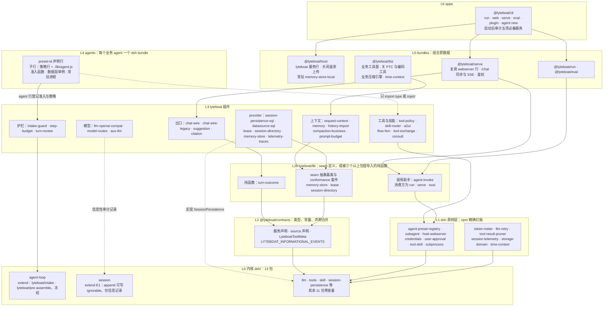
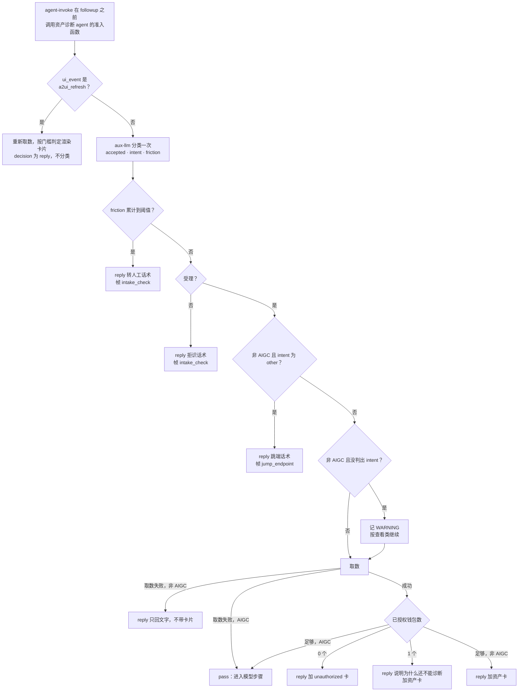
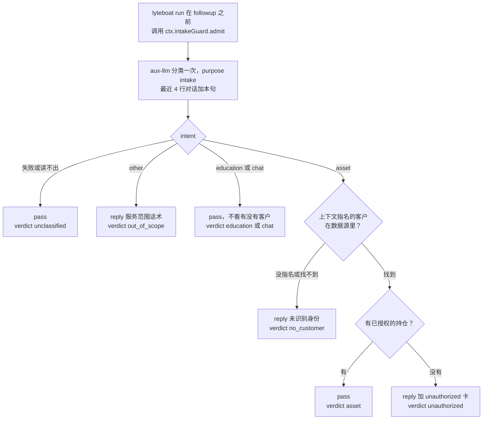
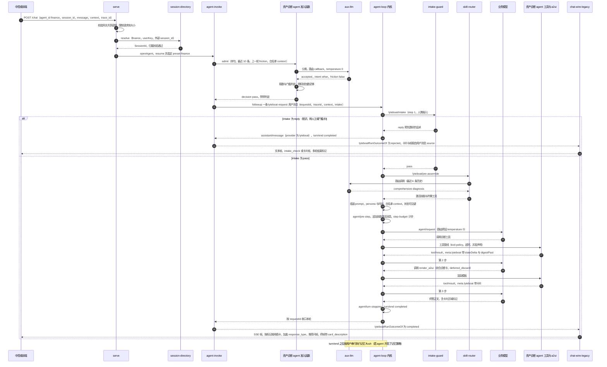

# lyteboat 与参考实现对齐分析：哪些能力要引入，core 怎么重新设计

> 本文只做分析，不改代码。
>
> **描述的状态**
> - 分析写于 lyteboat `3d29a07`，那时还没有 V1。各节的建议、第 4 节的方案对比和第 6 节的阶段 A–E 都保留为当时的分析。
> - 凡是说「lyteboat 现在怎样」的地方，都已对照分支 `c-willis/magical-mccarthy-q2grch` 的 `HEAD = 809e64d`（`refactor: one minimal example agent — finance keeps an overview, a diagnosis, and three concepts; demo removed`）改写：第 0 节开头的状态块、1.1、第 2 节各表的「lyteboat 现状」列、各处标「现状」的段落和句子、第 6 节开头的状态块，以及 7.2 的已拍板项。
> - 覆盖写作之后落地的三个里程碑：V1（金融智能体、敏感词检查）、F1（路由会话重开与续写、关掉遥测导出）、F2（请求上下文、准入前移、旁路调用留痕与 E1、一个结果多张卡与延迟出卡）。内核仍是 13 个包，对应 dsh 0.1.7-rc.1，现在带 3 项登记过的 extend。
> - 示例 agent 现在只有一个最小的金融智能体：809e64d 删掉了 `examples/agents/demo`，把金融智能体收到只剩资产总览、配置诊断和三个概念的投资者教育，用来验证端到端流程，不追求业务深度。凡是现状里提到 V1 金融智能体、后来被这次收窄删掉的东西，都注明了。
>
> **基线**
> - 参考实现的 master 分支；
> - dsh 的 tag `dsh-v0.1.7-rc.1`；
> - lyteboat 发行版蓝图 v7（v8 只更新了内核清单与验收记录，本文引用的 §7、§9 没有变）。
>
> **路径约定**
> - 不带前缀的路径从 lyteboat 仓库根算起，例如 `dsh/core/agent-loop/src/agent.ts`、`lyteboat/plugins/tool-policy/src/state.ts`。
> - `ref:` 指参考实现的 Python 包根目录，例如 `ref:core/runtime/base_agent.py`。`ref 仓库:` 指参考实现的仓库根。
> - `dsh:` 指 dsh 0.1.7-rc.1 上游 monorepo 的根，例如 `dsh:packages/preset/agent-preset-registry/README.md`。lyteboat 内核的 13 个包与上游同名，引用内核源码时写 lyteboat 里的路径 `dsh/...`。
> - 「蓝图 §n」指 lyteboat 发行版蓝图 v7（HTML 格式，没有入仓）。其中 §7 定义变更类别，§9 定义参考实现能力的落点。
>
> **数据说明**
> - 不带前缀的路径，行号都按 `809e64d` 重新核对过；`dsh:` 的行号对应 tag `dsh-v0.1.7-rc.1`；`ref:` 的行号是写作时参考实现的代码。
> - 标「推断」的结论来自读代码，还没有测试证实。
> - 标「估算」的数字会同时给出计算方法。
> - 标「实跑」的输出来自构建好的 CLI（`node lyteboat/apps/cli/lib/bin.js`），模型是 `@lyteboat/testing` 的脚本化模型，`DSH_TELEMETRY_DISABLED=1`，没有用真实 key；金融智能体的几次运行都在 `809e64d` 的构建上重跑过。命令写成从仓库根目录跑；会话 id、surfaceId 这类随机值用 `…` 省略，日志里的模型标识写成 `<model>`。

---

## 0. 结论

**现状（809e64d）。** 下面的结论写于 V1 之前，推荐的方案一没有变。写作之后落地了三个里程碑，都在方案一的范围里，之后示例 agent 又收窄了一次：
- **V1**：`examples/agents/finance`（金融智能体，只用公开知识）在当时的内核上跑通，没有改内核；`scripts/check-sensitive.ts` 进了 `pnpm run lint`。
- **F1**：要点 1 的阻断解除，路由过的会话能重开，`lyteboat run --session-id` 能续写；要点 8 的两个问题都修了。
- **F2**：E1 登记为 `session-append-ignorable`，内核 extend 变成 3 项；`@lyteboat/aux-llm`（旁路调用记成可忽略的 `lyteboat/aux-llm-call`）、`@lyteboat/request-context`、`@lyteboat/intake-guard`（3.1 的准入前移）落地；`@lyteboat/a2ui` 支持一个结果带多张卡、三种出卡模式和卡片标记。
- **示例 agent 收窄**（809e64d）：`examples/agents/demo` 删掉了；金融智能体收成最小版本，只留资产总览、配置诊断（一次结果出两张卡）和三个概念的投资者教育，用来验证端到端流程（见 5.2 的现状、7.2）。V2 从这个最小 agent 起步。
- **还没做**：要点 2 的服务化、要点 3 的模型通路、要点 4 的记忆 seam 与启动审计。要点 7 的 lib 层已拍板推迟（见 7.2）。路线图改由设计文档维护，第 6 节开头给出新的顺序。

dsh 的核心代码已经在 lyteboat 里跑通。参考实现的大部分能力，在 dsh 里都有现成的扩展点可以接住，所以不需要把参考实现的运行器、提示词构建器或压缩策略搬进内核。

推荐的方案叫「dsh 原生薄内核」：
- 内核 13 个包里，11 个与上游零差量。
- 只带 3 项登记过的 extend：现有的 `lyteboat/intake` 和 `lyteboat/pre-assemble`，再加一项新的 `session-append-ignorable`（下称 E1）。E1 只允许写纯信息记录。
- 参考实现的能力分到四个地方落地：lyteboat 插件；少数 lyteboat 自有 seam；一个有严格进入条件的 `lyteboat/lib` 共享层；按 dsh bundle 形式分发的业务 agent。
- 代价是：一部分参考实现语义要改由出口层推导，或者写进迁移说明，再用 eval 验证影响。

要点：

1. **写作时最紧的阻断是「路由过的会话无法重开」**，解决它不需要改内核。skill-router 不再写自有节点 `lyteboat/skill-routed`，改为用一条带来源的持久 user/message 记录激活。这一点有意偏离蓝图 §9 的「路由结果走 E1 ignorable」。原因是 dsh 规定 ignorable 只能用于「丢失后不影响重建」的记录（`dsh/core/session/src/types.ts:501-511`），而当前激活的技能决定了会话重开后的工具面。**现状：** F1 照这个思路解除了阻断，用的是 dsh 自己的 skill-invocation 消息（`source {kind:'skill-invocation', name, form:'instructions'}`），没有另起 lyteboat 的来源。写作时钉住拒读的 routed 用例，现在断言会话能重开（`lyteboat/bundles/run/tests/reopen.composite.ts:109-115`）。
2. **第二个阻断是服务化。** lyteboat 现在只有两种形态：run（一次性任务）和 web（原样的 dsh-web-app）。还缺 `/chat`、多用户、会话归属和多 POD 存储。dsh 的 session-query 自己不做调用方授权（`dsh:packages/session-query/session-query/README.md:150`），所以这些都得由 lyteboat 补，而且都能在内核外做：`@lyteboat/serve` bundle、会话目录 seam、SQL 版 `SessionPersistence` provider。
3. **第三个阻断是模型通路。** dsh-base 里已经挂着 llm-pi-ai（默认休眠），它能接 OpenAI 兼容网关和自托管的 Chat Completions（`dsh:packages/llm/llm-pi-ai/README.md:12,62-65`），但做不到三件事：
   - 按请求签名；
   - 发送参考实现用到的 penalty、top_k、extra_body，因为它只透传 temperature 和 maxTokens（`dsh:packages/llm/llm-pi-ai/src/adapter.ts:380-389`）；
   - 按请求改写 header，因为它只支持静态的 profile headers（同文件 204-209）。

   建议直接在它依赖的 pi-ai 库上写一个薄适配器 `@lyteboat/llm-openai-compat`：用 `onPayload` 加采样字段，用 `fetch` 做签名。三个企业模型网关的专有逻辑放进部署私有包。
4. **llm、tool、skill、session、memory 五项是启动必备能力。** 前四项已经在内核里，由 dsh-base 的行初始化。dsh 的官方包里没有记忆包；社区有 40 多个记忆插件，但各自定义服务名，没有公共 seam（见 3.4）。所以记忆要由 lyteboat 自己提供：定义一个 seam，host bundle 常驻挂载一个本地 provider，lyteboat CLI 在启动后检查这五个服务是否都在，缺一个就启动失败。记忆 seam 因此定为 P0，不再看「生产是否开了记忆」。flush、dream 这些记忆策略由 agent 按需开启。
5. **以下参考实现机制不移植，因为 dsh 更严格，或者已经有等价物：**
   - RunnerCallbacks 这个统一容器；
   - Bootstrap、AppContext 和 ENABLE_* 开关；
   - checkout/flush 与乐观锁；
   - CompactionSegment 的三档视图；
   - 把友好话术写进会话；
   - 单轮工具调用数截断；
   - Studio 整体回写原始会话。
6. **撤回蓝图 §9 的两项 redesign，并确认 tools 的条件 extend 不会触发。** 两项 redesign 是 E3 system-prompt 和 compaction-basic 的自有模块，都改到内核外实现。dsh-llm 的 `purpose` 放宽和 `toolChoice` 新字段，以及发行版必需词表（E1b），都降为候选。
7. **需要新增 `lyteboat/lib` 层**，因为现行分层下有两类东西没有合规位置：
   - seam 的抽象基类：插件之间只能 `import type`（`scripts/check-layers.ts:107-118`），`@lyteboat/contracts` 又不能放运行时行为（`CLAUDE.md:59`）；
   - 被三个以上包复用的纯函数。

   进入条件与 `CLAUDE.md:97` 的「第三次重复再抽取」保持一致。这件事要改 `CLAUDE.md` 第 46、52-64、70、97 行，需要拍板。**现状：** 已拍板推迟，等真正需要共享基类时再定（见 7.2）。F2 新增的三个插件都没有用到它。
8. **读代码时发现两个问题。**
   - (a) **prune 重折（写作时是推断）。** dsh-base 挂载的 tool-result-pruner 会用 `...event.data` 复制出一条 replace 事件（`dsh:packages/compaction/compaction-tool-result-pruner/src/index.ts:165-171`），`meta` 也一起被复制。而写作时 lyteboatState 和 lyteboatCards 两个投影都不检查 `surfaceOp`。后果是旧的 stateDelta 会在新值之后再被折一次，卡片也可能重复或回退到旧内容。
   - (b) **反馈会触发会话上传。** dsh-base 的 session-telemetry-otel 默认是 FEEDBACK_ONLY 模式：用户一做显式反馈（点赞、点踩、文本反馈、编辑、撤回），就把截至该反馈的完整会话前缀（含上下文）上传到 `harness-telemetry.deepseeksvc.com`；平常的对话不触发（`dsh:packages/bundle/base/cordis.patch.yml:188-217`、`dsh:packages/session/session-telemetry-otel/README.md:12,34`）。写作时 lyteboat/host 只关了 session-log-deepseek（`lyteboat/bundles/host/cordis.patch.yml:7-12`），没有覆盖这一行。lyteboat web 自带点赞、点踩（`dsh:packages/bundle/web-app/cordis.patch.yml:50-51,363-364`），在金融场景下有合规风险。

   两个问题原计划放在阶段 A，**F1 都已修复**：
   - 两个投影只折叠 append 的节点（`lyteboat/plugins/tool-policy/src/state.ts:88`、`lyteboat/plugins/a2ui/src/index.ts:143`），各有一条回归测试（`lyteboat/plugins/tool-policy/tests/state.spec.ts:50`、`lyteboat/plugins/a2ui/tests/render-tool.spec.ts:222`）。
   - `@lyteboat/host` 把 session-telemetry-otel 这一行设为 `disabled: true`（`lyteboat/bundles/host/cordis.patch.yml:14-19`），不看 `DSH_TELEMETRY_DISABLED`。`lyteboat config dump --profile run` 打出的这一行带 `disabled: true`（实跑），`lyteboat/apps/cli/tests/dump.e2e.ts:38` 对 run 和 web 两个 profile 都做了断言。

---

## 1. 背景与原则

### 1.1 现状

**内核包。** lyteboat 接管了 13 个 dsh 包（`dsh/kernel.json`）：
- llm、session、system-prompt、tools、skill、agent、agent-loop；
- session-projection、session-persistence、session-persistence-jsonl；
- compaction、compaction-basic；
- agent-loop-testkit。

其余 dsh 包从 npm 原样安装，版本按 `dsh.upstream.json` 精确钉住。

**内核当前的 carry。** 登记了三项 extend（`dsh-compat/contract/extensions.yml`）：`agent-loop-intake` 和 `agent-loop-pre-assemble` 来自提交 92698ff 和 4870926，`session-append-ignorable`（E1）来自 F2 的 c5a553f。拿内核与上游 rc.1 做 diff（`pnpm run dist:delta` 给出同样的数），上游文件里多出以下内容：

`dsh/core/agent-loop/src/agent.ts` 多 85 行：
- preStep 里两个 waterfall 的钩子（276-289 行）；
- `turn()` 里的 reply 分支（339-362 行）；
- `hasSystemNode` 和 `replyStep` 两个方法（423-460 行）；
- 请求序列的判断条件（473-479 行）。

`dsh/core/agent-loop/src/index.ts` 多 3 行导出。另外，`src/lyteboat/step-hooks.ts` 有 64 行，只放类型和事件声明。

`dsh/core/session/src/index.ts` 多 9 行、删 2 行：导入 2 行，导出 2 行（含 1 行注释）；`append` 的签名和取选项两处，各把上游的 1 行换成 2 行（签名那处含 1 行注释）；往事件信封里铺标记 1 行。逻辑放在 `dsh/core/session/src/lyteboat/append-ignorable.ts`（40 行）。

**写作时 M2 已经从参考实现移植的内容：**
- `@lyteboat/tool-policy`：可见性、确认、stateDelta，以及 lyteboatState 投影；
- `@lyteboat/skill-router`：full 和 dynamic 两种模式，沿用参考实现的 LLM 路由；
- `@lyteboat/a2ui`：参考实现的 template 引擎；
- `@lyteboat/history-import`：把外部对话历史导入为会话 seed；
- 示例 agent `examples/agents/demo`（809e64d 删除，见下）。

**之后落地的三个里程碑**（`CHANGELOG.md` 的 V1、F1、F2），以及一次示例 agent 的收窄：
- **V1**：`examples/agents/finance`，金融智能体，只用公开理财知识：四个路由技能、六张卡，会话事实放在 agent 自己的 `financeState` 投影里，上一轮的工具结果在新一轮开始时老化成只留事实的形式。当时没改内核。`scripts/check-sensitive.ts` 用环境变量给的词表扫描所有入仓文件，`pnpm run lint` 的最后一步跑它。这里列的业务部分大多在 809e64d 收窄时删掉了，见本节最后一条。
- **F1**：skill-router 不再写自有节点，`lyteboat:skill` runtime context 也删了；路由到的技能正文作为 dsh 的 skill-invocation 消息进入本步，`lyteboatActiveSkill` 从这类消息和成功的 `skill` 工具调用折叠出来。`lyteboat run --session-id <id>` 续写已存的会话。`@lyteboat/host` 关掉 session-telemetry-otel。lyteboatState 和 lyteboatCards 只折叠 append 的节点。
- **F2**：E1；`@lyteboat/aux-llm`（旁路模型调用，每次记一条可忽略的 `lyteboat/aux-llm-call`，路由调用改走它）；`@lyteboat/request-context`（请求记在人类消息的 `source.lyteboatRequest` 上，`lyteboatRequest` 投影，`lyteboat run --context`）；`@lyteboat/intake-guard`（agent 登记准入函数，`lyteboat run` 在请求进入循环前调用并把判定记到请求上，循环内兜底）；`@lyteboat/a2ui` 的多卡、出卡模式、`[[card:<area>]]` 标记与 `turnParts`；金融智能体改由请求上下文指名客户，并有了自己的准入函数。
- **示例 agent 收窄**（809e64d，`CHANGELOG.md` 的「One minimal example agent」）：`examples/agents/demo` 删掉了，金融智能体是唯一的示例 agent。它只留端到端流程要用的部分：三个路由技能（asset-overview、allocation-diagnosis、investor-education）、三个工具（`asset_overview`、`allocation_diagnosis`、`lookup_knowledge`）、四张卡（资产总览一张；一次诊断结果出诊断和调整方向两张；unauthorized 一张）、三个概念的知识库、进循环前的准入、temperature 0。客户夹具只是年龄加一组持仓，每笔标明是否承担市场风险；诊断规则是风险资产占比对照「100 减年龄」，上下各 10 个百分点。删掉的有：三个资金桶及其目标比例、单桶下钻的技能与它的两张卡、用户上报的外部资产、追问、保险保障、`financeState` 投影、工具结果的老化。框架这边只改了 `lyteboat run --help` 里的示例（原来用 demo）。

### 1.2 术语对照（给熟悉参考实现、刚接触 dsh 的读者）

| 参考实现的说法 | dsh / lyteboat 的对应 | 要点 |
|---|---|---|
| 一次 run：一次用户请求走完 `agent.run()` | 一个 turn：从 `turn/start` 到 `turn/end` | 参考实现的 RunOutcome 对应 dsh `turn/end` 的 reason（`dsh/core/session/src/types.ts:189-232`） |
| run 里的一轮模型调用：`ls.turns`，受 `max_turns=10` 限制（`ref:core/runtime/base_agent.py:144,1052`） | 一个 step：从 `step/start` 到 `step/end` | 最容易混淆：参考实现的 turn 等于 dsh 的 step，参考实现的 max_turns 实际上是步数上限 |
| SessionEntry：messages、可变的 state、meta | session：只追加的事件日志，加上从日志折叠出来的投影 | dsh 没有可变的 meta |
| session.state 与 state_delta | projection（`ctx.sessionProjections`），lyteboat 这边是 lyteboatState | 投影是日志的纯函数 |
| 消息的 metadata | user/message 上的 `source` | `MessageSourceMap` 的键只是声明合并时用的名字，运行时靠 `kind` 区分来源（`dsh/llm/llm/src/message.ts:103-116`） |
| 压缩视图 | surface 加 replace | 日志里的原文一直保留，surface 是模型当前看到的那一面 |
| 8 个 hook | 类型化事件，按派发模式分成 waterfall、serial、emit | 派发模式本身属于公开契约，比如 `agent/pre-step` 是 waterfall，`agent/turn-stopping` 是 serial（`dsh/core/agent/src/runtime-types.ts:320,379-381`） |
| BaseAgent 的子类 | preset：一行 dsh-agent-preset 声明，加上它的子行 | 注册表不扫描目录 |
| Plugin、Lifecycle | Cordis 插件；组合里的一行就是一个 row | 依赖用 `inject` 声明，不靠列表顺序 |
| Protocol 加工厂插槽 | capability seam，由 Definition、Provider、Consumer 三个角色组成 | 缺任何一个角色都不算完整的 seam |
| `app.py` 组合根 | profile 加 bundle patch | 组合就是数据 |

### 1.3 兼容承诺（`dsh-compat/README.md`）

| 闸门 | 证明什么 |
|---|---|
| G1 契约 | 内核构建出的契约与 `dsh-compat/contract/dsh-0.1.7-rc.1` 快照一致，所有差异都已在 `extensions.yml` 登记 |
| G2 上游测试 | 上游为内核包写的测试原样在 lyteboat 源码上通过 |
| G3 跨包测试 | 依赖内核的官方包，在 lyteboat 内核上仍能通过自己的测试 |
| persistence / typert | 持久化 schema 和发布出去的 Typert 文件，与上游生成器的产物一致 |
| G4 日志等价 | 同一个脚本化运行，官方版和 lyteboat 写出的会话日志逐事件相同 |
| G5 社区金丝雀 | 钉版的社区插件在两边行为相同，并且绑定到 lyteboat 内核 |
| G6 会话往返 | 任一方写的会话，另一方都能按写入方的语义续写 |

契约只能以登记的方式增长（`CLAUDE.md:74`）。

### 1.4 内核外优先

`CLAUDE.md:72` 规定了新行为的落点顺序：先考虑 lyteboat 插件，再考虑 seam provider，然后是 lyteboat 自有 seam，最后才轮到内核改动。内核改动算设计决策，设计文档里必须写清两件事：为什么不能放在内核外，以及它属于蓝图 §7 的哪个变更类别。

dsh 目前不接受外部 PR（`dsh:CONTRIBUTING.md:9`）。所以 lyteboat 带进内核的改动很可能要长期携带，每一行 carry 在每次同步时都有成本。

### 1.5 启动必备的五项能力

五项能力缺任何一项，业务 agent 都无法启动。各项的现状和做法如下：

| 能力 | 内核包 / seam | 由谁初始化 | 现状 | 要做的事 |
|---|---|---|---|---|
| llm | `dsh/llm/llm`（内核） | dsh-base 的 `llm`、`llm-deepseek`、`llm-pi-ai` 行（`dsh:packages/bundle/base/cordis.patch.yml:34,524,127`） | 已有 | 新增 `@lyteboat/llm-openai-compat` 行，用于业务模型 |
| tool | `dsh/core/tools`（内核） | `tools` 行（同文件 498 行） | 已有 | `@lyteboat/biz` 收窄工具面 |
| skill | `dsh/skill/skill`（内核） | `skill`、`skill-filesystem` 行（同文件 293、296 行），以及 tool-skill | 已有 | 迁移 SKILL.md 格式 |
| session | `dsh/core/session` 与持久化 seam（内核） | `session-persistence-jsonl` 行（同文件 130 行） | 已有 | 多 POD 场景加 SQL provider |
| memory | dsh 官方没有这个包；社区插件见 3.4 | lyteboat 自有 seam `lyteboatMemory` | **缺** | 抽象基类放在 `lyteboat/lib`；`@lyteboat/host` 常驻挂 `memory-store-local` 这一行；业务 agent 按需打开记忆策略 |

补充两点：
- **CLI 启动审计。** app-boot 的 required 清单是写死在代码里的全局常量，不能靠 profile 扩展（`dsh:packages/boot/app-boot/src/index.ts:737-751`）。所以由 `@lyteboat/cli` 在 `boot()` 之后检查 `llm`、`tools`、`skills`、`sessions`（连同持久化 provider）、`lyteboatMemory` 五个服务是否可用，缺一个就以非零码退出。
- **与参考实现的差别。** 参考实现的记忆由 `ENABLE_MEMORY` 控制，默认关闭（`ref 仓库:.env-sample:62`）。lyteboat 改为「seam 一直存在，策略可以关闭」，这样不同 profile 的启动行为一致。

### 1.6 必须保留的 dsh 最佳实践

1. **模型可见 ⟺ 可从日志重建**（`dsh:AGENTS.md:136`，`CLAUDE.md:79`）。凡是进入模型请求的内容，都必须能从会话日志重建。
2. **读取时 fail-closed。** 日志里出现既没登记、又没标 ignorable 的事件类型，整份会话拒绝读取（`dsh/session/session-persistence/src/storage-contract.ts:75`）。ignorable 只用于纯信息记录（`dsh/core/session/src/types.ts:501-511`）。上游的决策笔记保留了这个字段，但否决了两种做法：一是把外部事件一律当 ignorable，二是按挂载的组合登记事件名（`dsh:.agents/notes/implemented/architecture/2026-08-30-retain-ignorable-external-session-events.md`）。
3. **加插件，不改循环。** 改动 agent-loop 必须同步更新 architecture 文档（`dsh:AGENTS.md:137`）。
4. **能力 seam 的三个角色要齐全**（`dsh:AGENTS.md:138`）。
5. **登记本身就是 effect。** `register()` 要返回 disposer（`dsh:AGENTS.md:131`，`CLAUDE.md:81`）。
6. **组合就是数据。** agent 是一行 preset 声明，注册表不扫描目录；旧的目录格式已经没有代码读取（`dsh:packages/preset/agent-preset/skills/editing-cordis-compositions/SKILL.md:70`，`dsh:.agents/notes/implemented/architecture/2026-09-18-declarative-agent-presets.md`）。
7. **waterfall 的监听者必须调用 `next()`**（`dsh:AGENTS.md:135`，`CLAUDE.md:82`）。
8. **`agent/turn-stopping` 按 serial 模式派发。** 监听者通过 steer 放进 inbox 的数据决定本轮是否继续，与监听者的注册顺序无关（`dsh/core/agent/src/runtime-types.ts:364-381`）。
9. **显式优于隐式**（`dsh:AGENTS.md:140`）。**插件里不硬编码可调参数**（141）。**配置错误大声失败**（142）。
10. **尽量用有人维护的依赖，而不是手写**（`dsh:AGENTS.md:139`）。
11. **失败按错误码路由，不解析错误文本。** 适配器一次调用只尝试一次，重试发生在 step 边界，并写进日志（`dsh:docs/subsystems/llm-streaming.md`）。
12. **投影是日志的纯折叠，没有变化时返回同一个引用**（`CLAUDE.md:83`）。
13. **辅助模型调用也要留痕。** 先例有两个：`session/title-llm-request` 在请求发出之前就写日志（`dsh:packages/session/session-title-llm/src/index.ts:271-276`）；`compaction/summary` 会记录 rawOutput 和 usage。lyteboat 从 F2 起由 `@lyteboat/aux-llm` 做到这一条，但时机不同：调用结束后才追加一条可忽略的 `lyteboat/aux-llm-call`，带回答或失败原因和耗时（`lyteboat/plugins/aux-llm/src/index.ts:131`）；调用方自己中止时什么也不记。
14. **在做决定的操作处执行约束。** 监听顺序、prompt 过滤都不算执行约束（`dsh:packages/AGENTS.md:14`）。**状态只在提交点发布**（15）。**上限作用在完整结果上**（16）。
15. **上游测试从不修改。** lyteboat 自己的测试放在 `tests/lyteboat/` 下（`CLAUDE.md:75`）。

---

## 2. 能力对照总表

**字段说明**
- **lyteboat 现状**：按 `809e64d` 改写，括号里注明由哪个里程碑落地（V1、F1、F2）。其余各列是写作时的判断，没有改。
- **建议**：引入；部分（改形态后引入）；不引入。
- **落点**：内核 extend；dsh 原样（直接用 dsh 包，只做配置）；lyteboat 插件；lyteboat seam；lyteboat lib；bundle；agent 层；不移植。
- **优先级**：P0 阻断迁移或上线；P1 业务迁移需要；P2 运维或体验；P3 可选。
- **工作量**：S、M、L。

### 2.1 运行时循环、回调、护栏、子任务与多 agent

| 参考实现能力 | 参考实现位置 | dsh 对应 | lyteboat 现状 | 建议 | 落点 | 优先级 | 工作量 |
|---|---|---|---|---|---|---|---|
| 8 个 hook 与 CallbackResult | `ref:core/runtime/callbacks.py:37-69,197-222` | 各扩展点都是独立的类型化事件 | 只有两个 lyteboat 钩子 | 不引入容器，写一张映射表 | 开发指南 | P1 | S |
| before_agent 返回 ABORT 拒识，CallbackEvent 写进 hook_effects 并落盘 | `ref:core/runtime/base_agent.py:844-880`；`ref:core/runtime/_runner_helpers.py:172-185`；`ref:core/session/format.py:392-394` | 无；lyteboat/intake 是 lyteboat 自己的 extend | 准入在请求进入循环前执行，判定（决定、标签、回复文字、卡片）记在人类消息的 `source.lyteboatRequest.intake`，reply 不发模型请求，会话能重开；没有帧；循环内兜底的判定不落日志（F2） | 部分：决定、帧、卡片在准入阶段写进用户消息的 source | `@lyteboat/intake-guard` 加 agent-invoke | P0 | M |
| LLM 准入分类（看最近 10 条、正则预判、降级方向因 agent 而异） | 理财 agent 与资产诊断 agent 的准入分类器 | 无 | 骨架已有：intake-guard 加 aux-llm。金融智能体一次旁路调用分四类，看最近 4 行对话，没有正则预判，分类失败就放行（F2）；原来 demo 用的循环内正则门随 demo 一起删了（809e64d） | 引入骨架 | `@lyteboat/intake-guard` | P0 | M |
| 证券 agent 的 `_auth_check`（未登录时 ABORT 出登录卡）和 `_enrich_context` | 证券 agent 的定义文件与工具参数映射 | 无 | 准入函数能按请求上下文直接回复：金融智能体遇到问自己资产的请求，上下文没指名客户或客户不存在时回复一句文字，没有已授权账户时回复 unauthorized 卡（F2）；教育类和闲聊不看客户，一律放行；没有 enrich | 引入：放进准入阶段的 enrich 和 gate | agent 层，经由 intake-guard | P0 | S |
| 交易 agent 的 `_enrich_context` | 交易 agent 的定义文件 | 无 | 无 | 引入 | 同上 | P1 | S |
| context_updates 与画像预取 | 理财 agent 的回调模块；`ref:core/runtime/base_agent.py:830-834` | 带来源的 user/message、runtime context | 请求上下文记在人类消息的 `source.lyteboatRequest.context`，`lyteboatRequest` 投影沿用到下一个带上下文的请求；工具经 `contextOf` 读取，模型看不到；`lyteboat run --context` 传入（F2）。没有画像预取 | 引入 | `@lyteboat/request-context`，外加准入阶段 | P0 | M |
| before_loop_end 的 RETRY（grounding 校验） | `ref:core/runtime/validation.py:442-534` | agent/turn-stopping 加 steer | 无 | 引入 | `@lyteboat/turn-review` | P1 | S |
| 工具返回 STOP，以 tool_stopped 结束 | `ref:core/runtime/base_agent.py:1505-1536` | `exec.concludeTurn()`（`dsh/core/tools/src/index.ts:426-434`） | a2ui 的终态卡（`lyteboat/plugins/a2ui/src/index.ts:336`）和金融智能体的 unauthorized 结果（`examples/agents/finance/src/tools/finance-tool-support.ts:79`，V1）都在用 | 引入，有 3 处语义差异 | tool-policy 提供辅助 | P0 | S |
| 路由 agent 多路 consult 时推迟 STOP（before_tool、after_tool） | 路由 agent 的定义文件 | 同一步里只要有一个结果结束本轮，本轮就结束（`dsh/core/agent-loop/src/tool-calls.ts:37,158`） | 无 | 部分：由 consult 工具自己判断是否 concludeTurn | `@lyteboat/consult` | P2 | S |
| max_turns 与 stopped_by_limit | `ref:core/runtime/base_agent.py:144,1052-1071` | 没有步数上限；有 `cancel(hook, {keepInbox})` | 无 | 引入 | `@lyteboat/step-budget` | P0 | S |
| 单轮最多 5 个调用、每个 30s 超时 | `ref:core/tools/executor.py:55-83` | maxParallelToolCalls、timeout-policy | 无 | 截断不引入，超时默认值引入 | tool-policy 辅助 | P1 | S |
| RunOutcome 作为唯一的结束原因来源 | `ref:core/types.py:55-63` | TurnEndReason | 无 | 引入，做成纯函数 | `@lyteboat/turn-outcome`（lib） | P0 | S |
| on_model_error：友好话术写进会话 | `ref:core/runtime/base_agent.py:1331-1363` | agent/request-error 加 llm-retry | 无 | 部分：话术放出口层，不写日志 | chat-wire | P1 | S |
| AgentsLifecycle、Registry、invoker | `ref:core/runtime/agents_lifecycle.py:43-85`；`ref:core/runtime/invoker.py:13-60` | agent-preset-registry：多个 preset，按会话选择 | 只有 `@lyteboat/run` 读 agent 目录；`--session-id` 按日志里记下的 agent 续写（F1） | 部分 | agent bundle 加 `@lyteboat/agent-invoke`（lib） | P0 | M |
| SpawnSubtasksTool 并行子任务 | `ref:core/subtask/tool.py:61-314` | tool-subagent 已声明可并发（`dsh:packages/subagent/tool-subagent/src/index.ts:471`），子 agent 继承父 preset | 无 | 部分：只缺状态的传入和回传 | 先验证不新增工具的方案 | P2 | S/M |
| consult_sub_agent | 路由 agent 的 consult 工具 | SubagentProvider seam | 无 | 部分 | `@lyteboat/consult` | P2 | L |
| 编排 agent 使用 tool_choice=required | 编排 agent 的定义文件 | LlmCallConfig 里没有这个字段（`dsh/llm/llm/src/call-config.ts:23-30`） | 无 | 部分 | 路由预设，加 turn-stopping 纠偏 | P2 | M |
| app_type 运行期覆盖 | 业务 agent 共用的 app_type 覆盖表；`ref:plugins/api/chat.py:160` | 无 | 无 | 部分 | serve profile 里 chat-wire 行的 Config | P1 | S |

### 2.2 会话、存储与持久化

| 参考实现能力 | 参考实现位置 | dsh 对应 | lyteboat 现状 | 建议 | 落点 | 优先级 | 工作量 |
|---|---|---|---|---|---|---|---|
| checkout/flush、shield、version 乐观锁 | `ref:core/session/manager.py:274-365` | 只追加日志，加 session/flush 和 checkpoint-policy | JSONL | 不引入 | dsh 原样 | P3 | S |
| 跨 POD 运行锁，冲突时返回 409/session_busy | `ref:core/storage/database/sql/session.py:450-526`；`ref:plugins/api/errors.py:16-28` | `open('write')` 独占写；`SessionOwnershipLostError` 已声明，但还没有实现方（`dsh/session/session-persistence/src/errors.ts:51-65`） | JSONL 用 flock | 引入 | `@lyteboat/session-persistence-sql` 加 serve | P0（多 POD 时） | L |
| seq 原子分配、预计算计数 | `ref:core/storage/database/sql/session.py:247-416` | append 要求 seq 连续 | 无 | 部分 | SQL provider 加会话目录读模型 | P1 | M |
| 存储 Protocol：文件和 SQL 两种后端、按 agent 隔离 | `ref:core/storage/protocols/session.py:13-228` | SessionPersistence 抽象 seam（`dsh/session/session-persistence/src/index.ts:135`） | 只有 JSONL | 部分 | 增加第二个 provider | P0 | M |
| Datasource、方言、alembic、DDL 导出、托管密码 | `ref:core/storage/datasource.py`；`ref:core/storage/dialect.py`；`ref:core/storage/database/migrate.py` | credentials seam | 无 | 部分 | `@lyteboat/datasource-sql` | P1 | M |
| (agent_id, session_id) 复合唯一，session_id 由调用方指定 | `ref:core/storage/database/models.py:79-82`；`ref:core/runtime/base_agent.py:570-599` | SessionId 全局唯一 | `lyteboat run --session-id` 只能续写已存在的会话，并核对它记下的 agent 和工作目录；新会话的 id 由 lyteboat 生成（F1） | 引入 | `@lyteboat/session-directory` | P0 | M |
| 会话列表、搜索、摘要 | `ref:core/storage/protocols/session.py:99-219` | session-query 不做调用方授权（README:150）；`listSessions` 返回全量（`src/index.ts:170-176`），只有搜索支持 limit 和 cursor（`src/types.ts:257-262`） | 无 | 部分 | 会话目录读模型；单会话详情用 dsh | P1 | M |
| state 命名空间 user:、temp:、meta: | `ref:plugins/api/chat.py:60-88`；`ref:core/types.py:772-783` | user/message 的 source 可以扩展 | 请求上下文记在 `source.lyteboatRequest`，不进 prompt（F2）；lyteboatState 仍只折叠工具的 delta，并且整份注入 prompt；金融智能体 V1 起把会话事实放在自己的 `financeState` 投影里、不进 prompt，809e64d 收窄时删了这个投影，现在它没有会话状态，工具每次按请求上下文里的客户重新取数 | 引入 | request-context，加 tool-policy 的 fold | P0 | M |
| 外部对话历史合并，按 trace_id 去重 | `ref:core/session/history_strategy.py`；理财 agent 的外部历史合并器 | 日志只追加 | 只能给新会话做 seed | 部分 | history-import 增量模式（以 recall 形式注入） | P1 | M |
| tool_exchange | `ref:core/session/tool_exchange.py` | 无 | 无 | 引入 | `@lyteboat/tool-exchange` | P1 | M |
| 会话删除与保留期（含子任务的临时会话） | `ref:core/subtask/tool.py:313-315`；`ref:plugins/evals/replay_runner.py:345` | 没有删除 API | 无 | 引入 | session-directory 的 purge | P1 | M |
| 异常时整轮丢弃、原始会话整体回写 | `ref:plugins/studio/api/sessions.py:359` | 只追加 | 无 | 不引入 | 不移植 | P3 | S |

### 2.3 记忆、上下文压缩与提示词

| 参考实现能力 | 参考实现位置 | dsh 对应 | lyteboat 现状 | 建议 | 落点 | 优先级 | 工作量 |
|---|---|---|---|---|---|---|---|
| MemoryProvider（11 个成员）与工厂插槽 | `ref:core/protocol/memory_provider.py`；`ref:core/protocol/_active_memory_factory.py` | 官方没有记忆包；社区插件各自定义服务 | 无 | 引入，拆成不超过 7 个方法 | `@lyteboat/memory-store`（lib），host 常驻挂 local provider | **P0（启动必备）** | M |
| 冻结快照，注入 `<memory_context>` | `ref:plugins/memory/manager.py:126-160`；`ref:plugins/memory/prompts.py:35-42` | agent-instructions 的「被遮蔽就重新注入」模式（`dsh:packages/context/agent-instructions/src/index.ts:46-63`） | 无 | 引入 | `@lyteboat/memory` | P1（前提是生产开着记忆） | M |
| 每轮 flush 抽取、dream 整理 | `ref:plugins/memory/extractor.py`；`ref:plugins/memory/dream.py` | 无 | 无 | 引入：两者放进同一个串行队列 | `@lyteboat/memory`，加 lyteboatLease | P1 | M |
| 代码独占的记忆小节（资产诊断 agent 的外部资产） | 资产诊断 agent 的外部资产记忆模块 | 无 | 无 | 引入「受保护标题」 | `@lyteboat/memory` | P1 | S |
| memory_write 工具 | `ref:core/tools/memory.py` | 无 | 无 | 部分，默认关闭 | `@lyteboat/memory` | P3 | S |
| SystemPromptBuilder 分段 | `ref:core/prompt/builder.py`；`ref:core/runtime/base_agent.py:1649-1726` | system-prompt 的 section 与 context、dsh-persona | 只有 persona 行 | 不引入 builder | dsh 原样 | P2 | S |
| 内容生产方各自控制预算 | `ref:core/skills/base.py:195-247`；`ref:plugins/memory/user_profile.py:40-81` | 组装阶段没有预算 | 无 | 引入 | 在各生产方执行；全局只计量（`@lyteboat/prompt-budget`） | P1 | S |
| 非破坏式的三档视图 | `ref:core/session/compaction.py:756-818` | compaction/* 事件加 surface replace | dsh-base 默认 | 不引入 | dsh 原样 | P3 | S |
| 中文四节摘要模板 | `ref:core/session/compaction.py:330-420` | `summarize()` 是唯一的子类钩子 | 英文、面向编码助手的模板 | 引入 | `@lyteboat/compaction-business` | P1 | S |
| 上下文窗口与压缩阈值（参考实现默认 128k，只有 meta_builder 是 64k） | `ref:core/runtime/base_agent.py:212-213`；`ref:core/session/compaction.py:429,466-469`；meta_builder 的 `agent.py:41` | 默认 headroomTokens=65536（`dsh/compaction/compaction-basic/src/config.ts:75`）；窗口太小时抛 TargetPressureConfigError（181-190），只告警一次，之后照常运行（`index.ts:158-176`） | 默认配置 | 引入配置 | `@lyteboat/biz` 的 modelPolicies | P0（条件见 3.5） | S |
| 时态边界 llm_digest_past | `ref:core/runtime/_runner_helpers.py:395-475` | pruner 只在压力下截断 | 框架层没有。金融智能体 V1 起在 agent 层自己做过（新一轮开始时，把更早轮次的工具结果 surface replace 成只留事实的形式），809e64d 收窄时删了：现在更早轮次的工具结果原样留在模型视野里（实跑，见 5.5 的现状） | 部分 | render 文本写成与时态无关，加 LyteboatDigestPruner | P2 | M |
| 身份与时间段 | `ref:core/prompt/builder.py` | persona、time-context、includeHarnessIdentity | `@lyteboat/run` 的默认 persona 仍是 coding agent；金融智能体的 persona 行设了 `complete: true`，system prompt 只有它自己的身份，不带 harness identity（V1）；没有 time-context | 引入 | `@lyteboat/biz` | P1 | S |
| （dsh 自带）agent-instructions | 无 | dsh-base 会把仓库的 CLAUDE.md、AGENTS.md 注入会话（`dsh:packages/bundle/base/cordis.patch.yml:288`） | 默认开，金融智能体也没关：工作目录里有 AGENTS.md 时，它会出现在金融智能体的模型请求里（实跑） | 业务场景关闭 | `@lyteboat/biz` | P1 | S |
| 引用标注与 grounding | `ref:core/citation/hook.py:20-76`；`ref:core/runtime/validation.py:442` | 无 | 无 | 引入 | `@lyteboat/citation`、`@lyteboat/turn-review` | P1 | M |

### 2.4 工具、技能、工作流、MCP 与沙箱

| 参考实现能力 | 参考实现位置 | dsh 对应 | lyteboat 现状 | 建议 | 落点 | 优先级 | 工作量 |
|---|---|---|---|---|---|---|---|
| AgentTool 声明与 parameters_schema_extra | `ref:core/tools/base.py:12-107` | defineTool DSL，只支持 schema 子集，不支持的关键字直接拒绝 | `toolPolicy.register` | 部分 | agent 层改写 | P1 | S |
| 可见性 always/auto（默认 auto） | `ref:core/tools/base.py:53-54` | restrict 的 allow/deny 掩码 | 默认 always | 引入 preset 级默认值 | tool-policy | P1 | S |
| state_delta 按顶层浅覆盖，只有 user:* 进 prompt | `ref:core/runtime/_runner_helpers.py:188-223` | 无 | lyteboatState 仍是深合并，整份 JSON 注入（`lyteboat/plugins/tool-policy/src/state.ts:103-107`）；金融智能体 V1 起改用过自己的投影（按键 replace，只在宿主侧），809e64d 收窄时删了，它现在不写任何状态 | 部分 | tool-policy：按键声明合并语义、声明可见键、加预算 | P1 | S |
| 执行器：并行、超时、降级 | `ref:core/tools/executor.py:55-155` | 默认 exclusive（`dsh/core/tools/src/index.ts:1304`），没有默认超时 | 无 | 部分 | tool-policy 辅助 | P1 | S |
| 入参二次编码纠正 | `ref:core/tools/argument_coercion.py` | 无 | 无 | 部分 | tool-policy 的 normalizeArgs | P2 | S |
| thinking_hint、data_source、output_state_keys | `ref:core/tools/base.py:59-68` | presentCall 的 title | 无 | 引入 | tool-policy 元数据 | P2 | S |
| SKILL.md、full/dynamic 两种模式 | `ref:core/skills/loader.py:78-116`；`ref:core/skills/base.py` | skill-filesystem：名字必须是 kebab-case，不合法的只记 warn 然后丢弃（`dsh:packages/skill/skill-filesystem/src/index.ts:814-839`） | 从 metadata.lyteboat 读 | 引入：转换脚本，加载时核对数量 | agent 层与 skill-router | P0 | S |
| 技能资格过滤（required_os/binaries/env_vars） | `ref:core/skills/base.py:54-84` | 无 | 无 | 不引入：业务技能都没用这些字段 | 不移植 | P3 | S |
| read_reference（按需读 references/） | `ref:core/tools/read_reference.py`；`ref:core/runtime/base_agent.py:535-541` 无条件注册 | tool-skill 的资源指引（`dsh:packages/skill/tool-skill/README.md:154-172`） | 无 | 不引入：参考实现的 agents 下没有任何 references/ 目录 | 不移植 | P3 | S |
| read_skill 与 `<active_skill>`（新激活的替换旧的） | `ref:core/tools/read_skill.py:1-11` | tool-skill 的持久消息 | 已重新设计（F1）：路由到的技能正文作为 dsh 的 skill-invocation 消息进入本步，切换时声明取代了哪个技能，被遮蔽后重新注入；`lyteboatActiveSkill` 从这类消息和成功的 `skill` 调用折叠出来。`lyteboat:skill` 和 `lyteboat/skill-routed` 都删了 | 重新设计 | skill-router | P0 | M |
| LLMSkillRouter | `ref:core/runtime/base_agent.py:216-223` | 无 | 已移植；路由调用经 `ctx.auxLlm` 发出，每次留一条 `lyteboat/aux-llm-call`（F2）；没有 `router:false` | 已有，补 `router:false` | skill-router | P1 | S |
| Workflow 有限状态机 | `ref:core/workflow/engine.py` | dsh 的 workflow 是脚本编排（`dsh:docs/subsystems/workflow.md`） | 无 | 引入 | `@lyteboat/flow-fsm` | P1 | L |
| 内部 RAG 知识库工具 | `ref:core/tools/` 下的内部知识库检索工具（只在 `ref:core/tools/__init__.py:20` 导出，没有 agent 注册它） | 无 | 无 | 不引入：带领域词汇，也没有使用方 | 需要时放 agent 层 | P3 | S |
| MCP | `ref:plugins/mcp` | dsh 的 mcp-client | 未接入 | 部分 | agent bundle 里配 mcp-client 行 | P2 | S |
| 工具级沙箱 | `ref:plugins/sandbox` | 进程级沙箱 | 无 | 暂不引入 | 不移植 | P3 | L |
| 业务 agent 的工具面只含业务工具 | 无 | dsh-base 在全局挂了 bash、fs、web、PTC 等编码工具（`dsh:packages/bundle/base/cordis.patch.yml:267-492`） | 框架层没有收窄。金融智能体用 tool-policy 的 agent 行把 23 个官方工具改成 `auto`，模型只看到路由技能要的工具和 `skill`（实跑：`asset_overview`、`skill`）；runtime-context 快照仍带 `sandbox:policy` 和 `approval:policy` | 引入 | `@lyteboat/biz` | P0 | S |

### 2.5 模型层、可观测性与评测

| 参考实现能力 | 参考实现位置 | dsh 对应 | lyteboat 现状 | 建议 | 落点 | 优先级 | 工作量 |
|---|---|---|---|---|---|---|---|
| Provider 注册表与三个企业模型网关 | `ref:core/llm/providers/__init__.py:37-85`；同目录下网关 A、网关 B、网关 C 的 provider | 通过 registerAdapter 注册适配器；llm-pi-ai 只支持静态 header，不透传采样扩展字段 | 只有 deepseek 和 pi-ai | 引入 | 在 pi-ai 库上写 `@lyteboat/llm-openai-compat`；网关专有逻辑放私有包 | P0 | M |
| 流式解析 reasoning 与 `<think>`、回填 tool_call | `ref:core/llm/caller.py:97-178` | 适配器的职责；pi-ai 有 thinkingFormat | 无 | 引入，并修掉流式不带 usage 的问题 | 同上 | P0 | 含在上一行 |
| 按角色的 LLMRegistry 和 LLM_ROLE 环境变量 | `ref:core/llm/registry.py:24-57`；`ref:core/runtime/base_agent.py:202-211` | 各消费方在自己的 Config 里写路由，不写就回落到 agent 的路由 | skill-router 已经这样做；aux-llm 的调用可以带路由，不带就用 agent 自己的模型（F2） | 部分 | `@lyteboat/model-routes` | P1 | S |
| SamplingConfig 与 extra_body | `ref:core/llm/sampling.py` | LlmCallConfig 只有 6 个字段 | 无 | 部分 | 适配器的路由预设 | P1 | S |
| 错误分类与两层重试 | `ref:core/llm/errors.py`；`ref:core/llm/retry.py` | LlmFailure.code 加 llm-retry | dsh-base 已带 | 不引入 | dsh 原样 | P1 | S |
| OTel 追踪（OpenInference） | `ref:core/observability` | session-telemetry 导出的是 OTel 日志，dsh 本身不产生 span | 上传已关：`@lyteboat/host` 关掉了 session-telemetry-otel 这一行（F1）；没有 span | 引入，并先关掉上传 | host 改配置；`@lyteboat/telemetry-traces` | P0（关上传）/ P1 | S/M |
| @timed 耗时埋点 | `ref:core/observability/timing.py` | session-stats | 未挂载 | 不引入 | dsh 原样 | P2 | S |
| trace_id 贯穿 | `ref:core/observability/request_trace.py` | 无 | `source.lyteboatRequest` 已有（F2），但只有 `requestId`、`context`、`intake` 三个字段，`lyteboat run` 也不填 `requestId`；没有 traceId | 引入 | 写进 `lyteboat-request` 这个 source | P1 | S |
| 每个 run 一行运行指标 | `ref:core/storage/entries.py:121-137` | session-stats 只看单个会话 | 无 | 部分 | serve 写一张运行摘要表 | P2 | M |
| 辅助模型调用（guard、推荐问、路由） | 资产诊断 agent 的定义文件 | 先例是 session/title-llm-request | 已有 `@lyteboat/aux-llm`（F2）：`ctx.auxLlm.generate` 带自己的 deadline，调用结束后追加一条 `ignorable: true` 的 `lyteboat/aux-llm-call`（用途、路由、system、prompt、上限、回答或失败原因、耗时），标记靠内核 extend E1 写入；路由和金融智能体的准入分类都走它；没有重试，推荐问还没有 | 引入 | `@lyteboat/aux-llm` | P1 | M |
| Evals 回放、白盒 grader、种子 | `ref:plugins/evals/replay_runner.py`；`ref:plugins/evals/grader_service.py`；`ref:plugins/evals/seed.py:43-73` | llm-replay、session-snapshot、invariants | 无 | 引入核心部分 | `@lyteboat/eval` bundle | P1 | L |
| callback_event 断言（对比客户端收到的帧） | `ref:plugins/evals/callback_event_grader.py:1-17`；`ref:plugins/evals/replay_event_collector.py:1-19` | 无 | 无 | 引入：grader 读出口层推导出的帧 | `@lyteboat/eval` 加 chat-wire | P1 | S |
| LLM judge、judge 校准、prompt 调优、变体、从会话导入用例 | `ref:plugins/evals/judge_service.py:1-11`；`judge_calibration_store.py`；`tune_service.py:1`；`variant_builder.py`；`session_case_importer.py` | 无 | 无 | 部分：先做核心，这些放后面 | `@lyteboat/eval` 后续阶段 | P3 | L |

### 2.6 对外接口、流式协议与界面能力

| 参考实现能力 | 参考实现位置 | dsh 对应 | lyteboat 现状 | 建议 | 落点 | 优先级 | 工作量 |
|---|---|---|---|---|---|---|---|
| /chat 同步与 SSE，客户端断连即取消 | `ref:plugins/api/chat.py:48-136`；`ref:plugins/api/sse_runner.py:20-115` | host-webserver；session-controller 只面向单一操作者 | 无 | 引入 | `@lyteboat/serve` | P0 | L |
| AG-UI 事件与四种出口协议 | `ref:core/stream/events.py`；`ref:core/stream/output_formatter.py:54-552` | agent/assistant-stream 加 session/event | 无 | 引入 | `@lyteboat/chat-wire`、`@lyteboat/chat-wire-legacy` | P0 | M |
| 企业帧装饰器链 | `ref:core/stream/enterprise_frame_decorators.py` | 无 | 无 | 引入 | chat-wire，装饰器按 agent 登记 | P1 | S |
| 终帧里的 card_description、original_context | `ref:plugins/api/chat.py:32-45,193-212` | 无 | 无 | 引入 | chat-wire-legacy | P0 | 含在上一行 |
| A2UI 的 blocks、template、preset 三种模式 | `ref:core/tools/render_a2ui.py` | presentationMeta | 只有 template | 部分：补 blocks，preset 留在 agent 层 | `@lyteboat/a2ui` | P0 | L |
| 工具直接出卡（a2ui_result） | `ref:core/types.py:396-420` | 无 | 工具可以自己用 `ctx.a2ui.render` 出卡，一张或几张挂在结果的 `meta.lyteboat.cards` 上（F2；金融智能体的 `prepareCard`，`examples/agents/finance/src/tools/finance-tool-support.ts:63-67`，诊断工具一次结果挂两张）；没有 `cardMeta` 辅助方法 | 引入 | `ctx.a2ui.cardMeta` | P1 | S |
| 说卡交错（延迟出卡与卡片标记） | `ref:core/stream/output_composer.py`；`ref:core/stream/card_marker_scanner.py` | 无 | 整轮排版已有（F2）：manifest 的 `emission_mode` 可取 `immediate`、`deferred`、`deferred_discard`；`ctx.a2ui.turnParts` 按 `[[card:<area>]]` 标记把卡排进一轮（`lyteboat/plugins/a2ui/src/turn-parts.ts:35-64`），`lyteboat run` 把每张卡打成一行 `[card <area>]`。流式出口的增量排版要等 chat wire | 引入 | `@lyteboat/a2ui` 内部模块，出口层通过服务方法调用 | P0 | M |
| 业务事件（CustomToolEvent、RunErrorToolEvent） | `ref:core/tools/executor.py:177-208` | 无 | 无 | 引入 | `tool/result.meta.lyteboat.events` | P0 | M |
| 推荐问 | `ref:core/suggestion` | 无 | 无 | 引入 | `@lyteboat/suggestion` | P1 | M |
| 子 agent 的流转发 | `ref:core/stream/relay.py` | 子代理的子会话可以直接寻址 | 无 | 部分 | serve 的事件桥 | P2 | M |
| idempotency_key 与 session_busy | `ref:plugins/api/models.py`；`ref:plugins/api/errors.py` | requestId 去重只在 session-controller 的命令层做（`dsh:packages/api/session-controller/src/commands.ts:603-615`） | 无 | 引入 | agent-invoke 加 serve | P1 | S |
| Studio 管理台 | `ref:plugins/studio` | dsh web 客户端（ui-session、ui-trajectory 等） | lyteboat web 就是 dsh web-app | 部分 | 只读功能先用 dsh web | P2/P3 | L |
| portal 反馈墙（投票、回复、按 token 限流，属于框架内部站点） | `ref:portal/feedback/routes.py:28-30`；`ref:portal/feedback/rate_limit.py` | 没有对应物。dsh 的 message-feedback 是按消息的评分，只写进日志（`dsh:packages/feedback/message-feedback/README.md:96`） | 无 | 不引入：portal 本来就不进 wheel | 不移植 | P3 | S |
| （dsh 自带）按消息评分与 /feedback 命令 | 无 | web-app 挂 message-feedback；dsh-base 挂 command-feedback（`base/cordis.patch.yml:309`） | 默认开；遥测上传已关（F1），保留它的前提已经满足 | 保留，但前提是遥测上传已关闭 | host 加 web 模板 | P0（关上传） | S |

### 2.7 后台任务、定时、通知与主动服务

| 参考实现能力 | 参考实现位置 | dsh 对应 | lyteboat 现状 | 建议 | 落点 | 优先级 | 工作量 |
|---|---|---|---|---|---|---|---|
| @proactive 声明式主动服务 | `ref:plugins/proactive_service/decorator.py:46-70` | 无 | 无 | 引入 | `@lyteboat/proactive`，由 agent 行声明 | P1 | M |
| Cron 触发与多 POD 选主 | `ref:plugins/proactive_service/triggers/cron.py`；`ref:plugins/proactive_service/storage/leader.py` | schedule 只支持会话内的 after/at/every | 无 | 引入 | proactive 加 lyteboatLease | P1/P2 | M |
| PerUser 扫描与频控 | `ref:plugins/proactive_service/scopes/per_user.py:121-175` | 无法枚举用户 | 无 | 部分，同时修掉窗口缺陷 | proactive 加用户目录 | P1 | M |
| 站内信与 SSE 推送 | `ref:plugins/notifications` | 无 | 无 | 引入 | lyteboatNotifications 加 serve 路由 | P1 | M |
| Webhook 触发 | `ref:plugins/proactive_service/triggers/webhook.py` | dsh-webhook：只负责发出，不跟踪结果 | 已安装但没挂载 | 部分 | proactive 的一种触发器 | P3 | M |
| （dsh 自带）goal 自动续轮、jobs | 无 | dsh-base 默认挂载 | 没有收窄 | 业务场景关闭 | `@lyteboat/biz` | P2 | S |

### 2.8 框架组合、生命周期与开发体验

| 参考实现能力 | 参考实现位置 | dsh 对应 | lyteboat 现状 | 建议 | 落点 | 优先级 | 工作量 |
|---|---|---|---|---|---|---|---|
| Lifecycle、Bootstrap、AppContext、ENABLE_* | `ref:core/protocol/bootstrap.py:21-204` | Cordis 的 Service、inject、effect、bundle patch | 已经用 Cordis | 不引入 | dsh 原样 | P0（只需对照） | S |
| 启动必备能力 | `ref:app.py` 组合根 | app-boot 的 required 清单是全局固定的 | 没有记忆 | 引入五项审计 | `@lyteboat/cli` 加 host | P0 | S |
| BaseAgent 的声明式配置 | `ref:core/runtime/base_agent.py:115-373` | preset 声明行 | 目录格式 | 部分：先给映射表，agent-kit 推迟 | agent 层 | P0 | S |
| 工具与回调共享的数据层单例 | 资产诊断 agent、理财 agent 的定义文件 | preset 行在每个修订里只挂载一次 | 金融智能体的 `./lib/agent.js` 在 `apply()` 里建一个客户数据源，工具和准入函数共用（`examples/agents/finance/src/agent.ts:32-50`；V1 建成，F2 起准入函数也用它） | 引入这种模式 | `./lib/agent.js` 作为单行组合根 | P1 | S |
| 常驻子进程（数据接入用的加密 JVM，按探针判断就绪，崩溃后重启） | `ref:core/utils/resident_process.py:1-16`；`ref:core/utils/executable_runner.py`；资产诊断 agent 客户数据接入部分的常驻加密进程封装与 token 模块 | `ctx.subprocess` 负责拉起和终止，服务被 dispose 时会终止所有受管进程；就绪判断和重启由消费方负责（`dsh:packages/subprocess/subprocess/README.md:28-32,98,114`）；dsh-base 的 `subprocess` 行在 `base/cordis.patch.yml:219` | 无 | 引入 | agent 层 provider，建在 `ctx.subprocess` 上 | P1（资产诊断 agent） | M |
| 每个 agent 自己的模型与采样 | 资产诊断 agent 的定义文件 | agent/request | 模型仍用宿主默认的；金融智能体在 `agent/request` 上把 temperature 固定为 0（`examples/agents/finance/src/agent.ts:41`，V1）。按 agent 的业务模型路由有意留在 F2 之外 | 引入 | agent 行在 agent/request 上选路由 | P1 | S |
| CLI 的 init、add-agent、list、enable | `ref:cli/main.py:773-1101` | dsh CLI 的 plugin 子命令 | 只有 run、web、config dump；run 多了 `--session-id`（F1）和 `--context`（F2） | 部分 | `@lyteboat/cli` | P2 | M |
| meta_builder：用对话建 agent | meta_builder 的 agent 目录（按 `ref 仓库:pyproject.toml:67-83` 的配置，它不在 wheel 里） | Creator 模式 | 无 | 部分 | dsh 原样，加一个 lyteboat skill | P3 | M |
| 按约定放置的旁路文件 | `ref:plugins/proactive_service/discovery.py`；`ref:plugins/evals/seed.py:43-73` | 注册表不扫描目录 | 无 | 部分 | agent 行显式声明 | P2 | S |
| （lyteboat 自身）profile 的 bundle 列表必须与模板完全相同 | 无 | plugin-manager 会改写 bundle 列表 | `lyteboat/apps/cli/src/profile-boot.ts:114-128` | 修复 | cli | P0 | S |

---

## 3. 分领域分析

### 3.1 运行时循环、回调与护栏

**参考实现的做法。** 以 BaseAgent 的 `_run_loop` 为核心，外面挂 8 个 hook。回调只返回 PASS、ABORT、OVERRIDE、RETRY 四种声明，具体怎么处理由 runner 按 hook 语义决定。

ABORT 路径做三件事：
- 把入口的 user 消息写入会话，metadata 就是完整的 input_context；
- 把回调事件的类型和完整数据写进 assistant 消息的 `hook_effects`；
- 两者一起落盘（`ref:core/runtime/base_agent.py:855-866`、`ref:core/runtime/_runner_helpers.py:172-185`、`ref:core/session/format.py:392-394`）。

会话列表里的 `aborted_count` 就读这份数据（`ref:core/session/format.py:140-150`；`ref:plugins/studio/api/sessions.py:44-45,133-156`）。PASS 附带的事件（例如 citation_batch）只推流，不落盘。

**dsh 的做法。** 没有统一的回调容器，每个扩展点都是一个类型化事件：
- `agent/pre-step` 是 waterfall，可以拒绝本步，也可以替换进入本步的消息（`dsh/core/agent/src/runtime-types.ts:309-320`）。
- `agent/turn-stopping` 是 serial，本轮即将结束时派发，监听者可以用 steer 让本轮继续。
- 工具调用 `concludeTurn()` 可以结束本轮。
- `cancel(cause, {keepInbox})` 中止本轮时，排队的消息可以保留（`runtime-types.ts:38-45,176-183`）。

**差距。**
1. lyteboat/intake 的 reply 只能带 content blocks（`dsh/core/agent-loop/src/lyteboat/step-hooks.ts`）。reply 分支在 `agent/pre-step` 之前就返回了（`dsh/core/agent-loop/src/agent.ts:284`），所以拒识轮里的判定、卡片、帧都没有地方记。
2. 没有步数上限。
3. 没有对外可用的结束原因。
4. 两边都有 aborted，但含义相反：参考实现的 aborted 表示 before_agent 拒识，dsh 的 aborted 表示用户取消。

**建议：准入前移（admission）。**
1. **准入函数的登记。** `@lyteboat/intake-guard` 发布宿主服务 `lyteboatIntake`，agent 行调用 `register(presetId, gate)` 登记本 agent 的准入函数，返回 disposer。准入函数负责：
   - 解析请求上下文，也就是参考实现的 `_enrich_context`；
   - 预取数据；
   - LLM 分类；
   - 门槛判定，并渲染门槛卡。
2. **在 followup 之前调用。** `@lyteboat/agent-invoke` 先调用准入函数，再把结果写进本条用户消息 source 的 `lyteboatRequest` 字段：
   - `context`：白名单里的请求字段；
   - `intake`：决定、判定、帧类型与数据、卡片。
3. **循环内只读取结果。** lyteboat/intake 的监听者只在 `step === 1`、并且消息是人类输入时，读取 claimed 消息上的 `intake`：结论是 reply 就回复，是 pass 就放行。
4. **结果。** 拒识、登录卡、门槛卡、friction 判定都落在已有信封里，也就是用户消息的 source。模型看不到它，会话能够重开，Studio 统计和 evals 也都有数据可读，而且不需要新增事件，也不需要扩展 `LyteboatIntakeReply`。
5. **回退路径。** 经 session-controller 从 lyteboat web 进来的消息没有预判结果，这时在循环内分类。拒识帧仍然可以从回复文本推导，但卡片和 friction 判定记不下来。lyteboat web 是面向操作者的界面，不是业务渠道，这个降级可以接受。另一种做法是把 `LyteboatIntakeReply` 放宽成允许替换 claimed 消息，大约 3 行内核改动，列入 7.2 待拍板。
6. **步数上限。** 由插件在 `agent/pre-step` 计数，超限时调用 `cancel({kind:'hook', reason:'step-budget'}, {keepInbox:true})`。hook 类型的 cause 会原样写进 turn/end。
7. **结束原因。** 用纯函数 `lyteboatRunOutcomeOf(events, turn)` 从日志折叠出来。内部把「拒识」（rejected）和「取消」（cancelled）分开，只在 wire 层把 rejected 映射回参考实现的 aborted。

**现状（809e64d）。** 建议的 1–5 在 F2 落地，没有改内核，因为判定不需要塞进 reply。和计划相比有这几处不同：
- **登记。** 宿主服务叫 `ctx.intakeGuard`。agent 行在自己的常驻作用域里调用 `register(admission)`，拿回 disposer；取用时沿 agent 的作用域链找最近的一个（`lyteboat/plugins/intake-guard/src/index.ts:83-98`），不以 preset id 为键。准入函数拿到 `{agent, text, context, signal}`，返回 `decision`（`pass` 或 `reply`）、`verdict` 标签、回复文字和卡片；判定的 `by` 由服务填成准入函数的名字（`lyteboat/core/contracts/src/index.ts:162-171`）。
- **调用方。** 没有建 `@lyteboat/agent-invoke`。`lyteboat run` 自己在 `agent.followup` 之前调用 `ctx.intakeGuard.admit`，再用 `ctx.requestContext.message` 把 `{context, intake}` 写进人类消息的 source（`lyteboat/bundles/run/src/index.ts:304-311`）。判定里没有帧的类型和数据，因为出口层还没有。
- **循环内。** intake-guard 在 `lyteboat/intake` 上、`next()` 之后判断，所以在它之后登记的门先做决定。它只管第 1 步，读最后一条 kind 为 `'user'` 的消息：记着 reply，就用它的文字作答，不发模型请求；记着 pass，就放行；没有判定，就当场补做准入，回复一样，但判定和卡片都不落日志（`lyteboat/plugins/intake-guard/src/index.ts:69-75,116-123`）。
- **卡片。** reply 带的卡片由 `@lyteboat/a2ui` 从人类消息的 source 读出来，和工具结果的卡片一起进 `lyteboatCards` 投影和 `turnParts`。

6、7 没做：步数上限归到新顺序的 F3，turn-outcome 没有建。

**例子：证券 agent 的 grounding 重试。** 原实现是证券 agent 在定义文件里挂的 `create_citation_validation_hook`，迁移后由 `@lyteboat/turn-review` 负责：
- 在 `agent/turn-stopping` 上调用 `agent.steer(反馈)`；
- 每个 turn 的重试预算记在 `WeakMap<Agent>` 里；
- lyteboat 自己的回复和已经 concluded 的 turn 不做校验。

dsh 的 hooks-claude-code 就是这样实现 Stop 钩子的，并且注明监听者要自己限制重试次数（`dsh:packages/hooks/hooks-claude-code/src/index.ts:272-284`）。体验上有一处差异：steer 发生在第一版回答已经提交之后，所以用户会先后看到两版回答。

### 3.2 子任务与多 agent

**参考实现的做法。**
- SpawnSubtasksTool 一次调用并行跑多个子任务。子任务继承父会话的 `user:*` 状态，结束后把 state_delta 合并回父会话；会话 id 里带 `:sub:` 标记，用来禁止嵌套（`ref:core/subtask/tool.py:61-314`）。目前只有保险 agent 开启。
- 路由 agent 通过 consult 工具委派给业务 agent。它在定义文件里挂了两个钩子：before_tool 统计本批 consult 的调用次数，after_tool 在多路调用时把 STOP 改回 CONTINUE。效果是：单路调用直接 STOP，多路调用由 LLM 汇总。

**dsh 的做法。**
- 子代理 seam 的默认深度上限是 1，并发上限是 8（`dsh:packages/subagent/subagent/README.md:47,51`）。
- tool-subagent 声明了 `isConcurrencySafe: () => true`（`dsh:packages/subagent/tool-subagent/src/index.ts:471`），所以同一步里的多个子代理调用本来就是并行的。
- 进程内 spawn 出来的子 agent 通过 `applyChildComposition` 继承父 preset 的工具（`dsh:packages/subagent/subagent/src/child-agent.ts:179-213`）。
- 同一步里只要有一个成功结果标了 concludesTurn，本轮就结束（`dsh/core/agent-loop/src/tool-calls.ts:37,158`）。

**建议。**
- **子任务。** 缺的只是 `user:*` 的传入和 state_delta 的回传。先验证两个不新增工具的方案：给 tool-subagent 配一个 provider，或者加一个 `tools/post-execute` 监听。只有当回传没法通过 meta 表达时，才做一个薄工具。默认的 toolFilter 要排除记忆写入工具，与参考实现的 tools_deny 保持一致。
- **consult。** `@lyteboat/consult` 是一个 preset 型的 SubagentProvider，只挂载目标 preset，不调用 `applyChildComposition`，否则子 agent 会拿到 router 自己的组合。是否 concludeTurn 由 consult 工具自己判断：读取所在 assistant 消息里的工具调用，只有它是这一批里唯一的 consult 调用、并且 `stop_after` 允许时，才调用 `concludeTurn()`。这样才能复现参考实现的规则：单路直接结束，多路交给 LLM 汇总。
- **子 agent 的卡片。** 卡片留在子会话里。出口层通过 `subagent/start` 找到子会话，直接读取它的 lyteboatCards。

### 3.3 会话、存储与多实例

**参考实现的做法。**
- 持久层是唯一真相源，每个 turn 做一次 checkout/flush（`ref:core/session/manager.py:274-365`）。
- 跨 POD 互斥有两层：DB 运行锁，加上 version 乐观锁（`ref:core/storage/database/sql/session.py:450-587`）。
- 会话在 (agent_id, session_id) 这对组合内唯一（`ref:core/storage/database/models.py:79-82`）。
- 请求的 context 一律加上 `user:` 前缀后并入 state（`ref:plugins/api/chat.py:60-72`）。

**dsh 的做法。**
- 会话是只追加的事件日志，写句柄由 agent-loop 独占。
- `SessionPersistence` 只定义契约。
- JSONL 后端靠 flock 做互斥，在 NFS 上不可靠。
- SessionHeader 里没有 user 字段（`dsh/core/session/src/types.ts:94-131`）。
- session-query 不做调用方授权，`listSessions` 一次返回全部会话（`dsh:packages/session-query/session-query/README.md:150`、`src/index.ts:170-176`）。

**差距。**
- 没有多 POD 存储，没有用户维度，也没有「外部 session_id 映射到 dsh SessionId」这一层。
- 中控用同一个 session_id 分别调用理财 agent 和资产诊断 agent 时，在 dsh 里会冲突。
- session-query 如果直接暴露给外部，任何调用方都能列出所有会话。

**建议。**
- **`@lyteboat/session-persistence-sql`。** 租约、心跳和 fencing 都在 provider 内部实现；append 要求首个 seq 等于 next_seq，这一条同时起 fencing 作用。
- **`@lyteboat/session-directory`。** 维护 `(agentId, userKey, externalSessionId) → SessionId` 的映射，resume 之前校验归属。SQL 模式下，归属列和会话行在同一个事务里写入。
- **会话列表与搜索。** 一律经过会话目录，按归属过滤。session-query 只在进程内做单会话的精读，不直接暴露。
- **不移植的部分。** 参考实现的乐观锁，以及「先写 meta 再写消息」的双写都不移植。dsh 没有可变的 meta，连续的 seq 本身就是版本号。

**例子：trace_id。** 参考实现的 `temp:trace_id` 名义上是本轮临时值，但 input_context 会整体作为 user 消息的 metadata 落盘（`ref:core/runtime/base_agent.py:830-832`）。按 trace_id 搜会话（`ref:core/session/format.py:99`）、外部对话历史去重（`ref:core/session/history_insert.py:167`）都依赖这一点。迁移时要把 traceId、messageId 显式放进 `lyteboat-request` 这个 source 的持久字段，设计见 4.3。**现状：** F2 建了这个 source（`source.lyteboatRequest`，`lyteboat/core/contracts/src/index.ts:178-184`），字段只有 `requestId`、`context` 和 `intake`，traceId、messageId 还没有专门的字段。

### 3.4 记忆

**参考实现的做法。**
- 每个 (agent, user) 有一份按标题组织的 MEMORY.md（`ref:plugins/memory/manager.py:24-34`）。
- 会话开始时冻结一份截断后的快照，注入 `<memory_context>`，并声明「NOT current user input」（`ref:plugins/memory/prompts.py:35-42`）。
- 每轮结束后用一次 LLM 调用抽取要写回的内容；另外定期做 dream 整理。

**dsh 的做法。** dsh 的官方包里没有长期记忆包。最接近的是 agent-instructions：它把 `$DSH_HOME/AGENTS.md` 和项目里的 AGENTS.md 类文件作为带来源的 user/message 注入，被压缩遮蔽后按原文重新注入（`dsh:packages/context/agent-instructions/src/index.ts:46-63`）；这是人写的静态说明，不会自动学习。session-query 能全文检索历史会话，但 dsh-base 默认不打开它。

**社区插件。** npm 上有 40 多个 dsh 记忆插件（例如 `dsh-memory-vault`、`@max-null/dsh-memory`、`@chenhw7/dsh-memory`、`@openviking/dsh-memory-plugin`），其中 `@zzerx/dsh-plugin-memory` 0.3.1 是 G5 金丝雀之一（`dsh-compat/tests/canaries/canaries.yml:28`），在 lyteboat 内核上原样可用。它们的问题是：各自发布自己的服务名（例如 `ctx.memory`、自定义的 provider 注册表），没有公共 seam；多数按全局或工作区分区，面向编码助手，不按业务用户分区，也不支持多实例存储。所以 lyteboat 仍然要自己定义记忆 seam；合适的社区插件可以包成这个 seam 的一个 provider，不必从头写。

**建议。**
1. **seam 与 provider。** `@lyteboat/memory-store` 作为抽象基类放在 lib，方法不超过 7 个。provider 有 local 和 sql 两种，local 版由 `@lyteboat/host` 常驻挂载，理由见 1.5。
2. **注入。** `@lyteboat/memory` 把快照作为 `plugin:lyteboat-memory` 的 recall 消息注入，并保留参考实现的那句声明。被遮蔽后，用日志里的原文重新注入。
3. **写回。** flush 和 dream 放进同一个按用户串行的队列，dispose 时等队列排空。

**例子：资产诊断 agent 的「外部资产·系统维护」小节。** 这一小节由诊断工具在代码里独占读写。模块注释写明了一个问题：会话末的抽取轮虽然被告知不要动这个标题，模型仍然会去「整理」它（加空格、改成「万」、换成全角括号），所以读取时只好把正则放宽（见参考实现资产诊断 agent 的外部资产记忆模块）。lyteboat 要提供「受保护标题」：flush 和 dream 的输入里不出现这些标题，写回时原样保留。

### 3.5 上下文压缩与提示词

**参考实现的做法。**
- 在 system prompt 里分段拼接（`ref:core/prompt/builder.py:22-103`）。
- 所有 `user:*` 状态都会注入 prompt（`ref:core/runtime/base_agent.py:1672,1714-1715`；`ref:core/prompt/builder.py:189-209`）。
- 压缩不改原文，每轮实时重算三档视图（`ref:core/session/compaction.py:756-818`），默认窗口 128k（`ref:core/runtime/base_agent.py:212-213`）。

**dsh 的做法。**
- system 头保持稳定，动态内容作为 runtime-context 快照追加在历史尾部。
- 压缩的结果写成 `compaction/*` 事件加 surface replace，原文仍留在日志里。
- 默认的摘要指令是英文的编码助手模板（`dsh/compaction/compaction-basic/src/summarizer.ts:32-67`）。

**差距与建议。**

1. **E3 撤回。** 预算的执行放在各内容生产方，也就是做决定的那个操作里（`dsh:packages/AGENTS.md:14`）：
   - skill-router 管技能正文；
   - memory 管快照；
   - tool-policy 管 `lyteboat:state`；
   - request-context 管请求上下文（F2 的 request-context 不把上下文渲染给模型，眼下没有要预算的内容；白名单渲染有意留在 F2 之外）。

   全局的 `@lyteboat/prompt-budget` 监听 `system-prompt/assemble` waterfall，只计量、只告警，不做截断。原因是它要看到最终结果，就得注册在最外层，或者在 `await next()` 之后处理，这依赖监听顺序；按 dsh 的规则，监听顺序不能用来执行约束。dsh 自己也只把注册顺序用在「决定放置位置」上（`dsh:packages/skill/tool-skill/src/index.ts:168-171`）。
2. **中文摘要模板。** 写 `BasicCompactionEngine` 的子类，只覆盖 `summarize()`。
3. **窗口配置。** compaction-basic 的默认 headroom 是 65536（`config.ts:75`）。如果部署用的模型窗口扣掉输出预留后放不下这个 headroom，就会抛 `TargetPressureConfigError`；这个错误每个 target 只告警一次，之后照常运行，主动压缩就这样静默失效了（`config.ts:181-190`、`index.ts:158-176`）。参考实现的业务 agent 默认按 128k 窗口配置，只有 meta_builder 是 64k（它的 `agent.py:41`）。`@lyteboat/biz` 必须按模型写 modelPolicies。这一条暂定 P0，需要核实生产环境 Qwen 路由的实际窗口大小。

**例子：runtime-context 快照膨胀。** 写作时 lyteboat 把 `lyteboat:state` 和 `lyteboat:skill` 拼在同一条 runtime-context 快照里，其中任一项变化，整段快照都会重新追加一次（`dsh/core/agent-loop/src/runtime-context.ts:152-163`）。理财 agent 有 11 个技能，正文合计约 147KB，照那时的方式迁过来，历史会迅速膨胀。要改两处：
- 技能正文改为只在激活时追加一次持久消息；
- `lyteboat:state` 只渲染声明为模型可见的键，并加字节预算。

**现状（809e64d）。** 第一处 F1 已改：`lyteboat:skill` 删掉了，技能正文作为 skill-invocation 消息，只在激活、切换或正文已不在模型视野里时追加（`lyteboat/plugins/skill-router/src/index.ts:389-407`）。第二处没改：`lyteboat:state` 仍把整份 lyteboatState 渲染成一段 runtime context（`lyteboat/plugins/tool-policy/src/index.ts:108-116`）。金融智能体没有用 lyteboatState；V1 里它的会话事实放在自己的 `financeState` 投影里，809e64d 收窄时连这个投影也删了，现在模型只从工具结果的 digest 里看到事实。

### 3.6 工具、技能与工作流

**参考实现的做法。**
- dynamic 模式下，模型只能看到 always 工具，加上当前技能 `required_tools` 里列出的工具。
- Workflow 是一个确定性的有限状态机（`ref:core/workflow/engine.py:121-260`）。

**dsh 的做法。**
- restrict 掩码在执行器里生效：被隐藏的工具不仅模型看不到，调用也会被拒。这比参考实现只在 schema 里省略要严格。
- dsh 的 workflow 是脚本编排，不是状态机。

**差距与建议。**

1. **SKILL.md 格式。** 参考实现的 31 个业务技能大多用下划线名或中文名，而 dsh 要求 kebab-case。用转换脚本迁移：
   - kebab 名从目录名推导。参考实现的技能 id 本来就取自目录名（`ref:core/skills/loader.py:78-79`）。
   - `when_to_use` 拼进 description。参考实现就是这么做的（`ref:core/skills/loader.py:104-116`）。dsh 的 skill 虽然有 `whenToUse` 字段（`dsh/skill/skill/src/index.ts:65`），skill-filesystem 也会读取它，但 tool-skill 的目录不会渲染它（在 `dsh:packages/skill/tool-skill/src` 里搜不到 whenToUse）。如果只映射到 whenToUse，full 模式和目录路径下模型就看不到这段说明。
   - 加载时核对技能数量。
2. **不移植的两项。**
   - 技能资格过滤：业务技能都没有用这些字段。
   - read_reference：参考实现的 agents 下没有任何 references/ 目录。

   另外，`@lyteboat/biz` 关掉 fs 工具之后，tool-skill 给出的「目录型资源指引」就读不到了（`dsh:packages/skill/tool-skill/README.md:154-172`）。以后技能如果带资源，需要提供一个受限的读取工具。
3. **工具面。** `@lyteboat/biz` 关掉编码工具、PTC、workflow、goal、agent-instructions，并按 agent 用 allow 掩码限定工具面。关闭的标准是：这一行给模型注册了非业务工具，或者会把宿主环境信息注入会话。PTC 必须关，因为 PTC 子调度时不计算 presentationMeta（`dsh/core/tools/src/index.ts:1843`），卡片和 stateDelta 会被静默丢掉。
4. **Workflow 移植。** 移植为 `@lyteboat/flow-fsm`，名字避开 dsh 的 workflow。

**现状（809e64d）。** `@lyteboat/biz` 还没有建。金融智能体在自己的组合里收窄工具面：tool-policy 的 agent 行把 23 个官方工具改成 `auto`（`examples/agents/finance/agent.cordis.yml:30-56`），它自己的三个工具也按 `auto` 登记（`examples/agents/finance/src/tools/finance-tools.ts:20-22`），所以模型只看到路由技能要的工具和 `skill`（实跑：路由到 asset-overview 时请求里是 `asset_overview`、`skill`，路由到 allocation-diagnosis、investor-education 时分别是 `allocation_diagnosis`、`lookup_knowledge` 加 `skill`）。这只挡住了工具，挡不住注入：同一个请求仍带 `sandbox:policy`、`approval:policy` 两段 runtime context（其中有工作目录的路径），工作目录里有 AGENTS.md 时，agent-instructions 也会把它放进请求（实跑）。三个技能是按 kebab 名新写的，不是从参考实现转换来的，转换脚本也还没有。

### 3.7 模型层、可观测性与评测

**参考实现的做法。**
- 按角色组织的 LLMRegistry。
- 采样预设带 penalty 和 top_k。资产诊断 agent 在模型配置处的注释写明：temperature 0 在实测中提升 2 到 3 个百分点，复读问题由 presence_penalty 和 repetition_penalty 兜底。
- 三个企业模型网关。网关 A 要按请求做 RSA+HMAC 签名，还要带 scene_id；网关 B 和网关 C 在 transport 层给每个请求注入固定的 trace header，并且 transport 自带 `retries=3`（见两者的 provider 实现）。

**dsh 的做法。**
- LlmRuntime 与 provider 无关。
- 采样参数刻意收窄，只有 temperature、maxTokens、stop。
- `GenerateOptions.purpose` 已经存在，是闭合联合 `'compaction' | 'session-title'`（`dsh/llm/llm/src/types.ts:520-525`）。
- `llm/stream` waterfall 里，`next()` 不带参数，循环构造的请求也是冻结的（`dsh/llm/llm/src/index.ts:61-73`），所以它不能替代「把采样参数交给适配器」。

**建议。**
- **`@lyteboat/llm-openai-compat`。** 直接用 dsh-llm-pi-ai 依赖的 pi-ai 库（`dsh:packages/llm/llm-pi-ai/package.json:44`）：
  - 复用它的 openai-completions 实现和 thinkingFormat；
  - 用 `onPayload` 加 penalty、top_k、seed、extra_body、tool_choice；
  - 用 `fetch` 按请求签名（`@earendil-works/pi-ai/dist/types.d.ts:62,73`）；
  - usage 要在 finish 之前发出，并扣除缓存命中的部分；
  - 三个企业模型网关的专有逻辑都放进部署私有包，按请求扩展登记，底层重试一律关掉。
- **路由而不是 purpose。** 一条路由就是一个采样预设。辅助调用选用具名路由，所以不需要放宽 `purpose`。
- **其他包。**
  - `@lyteboat/model-routes`：发布具名路由；
  - `@lyteboat/aux-llm`：统一旁路调用的 deadline、重试、JSON 容错解析和留痕；
  - `@lyteboat/telemetry-traces`：从 session-telemetry 的 ledger 派生 span。
- **评测。** `@lyteboat/eval` 的 grader 读日志和投影。参考实现的 callback_event 断言对比的是回放时收集到的、客户端实际收到的事件载荷（`ref:plugins/evals/replay_event_collector.py:1-19`）。lyteboat 让 eval bundle 跑同一套 chat-wire 推导，就能得到同样的帧。judge、校准、调优放在后续阶段。

**现状（809e64d）。** `@lyteboat/aux-llm` 在 F2 落地，和计划的差别：
- 有 deadline（每次调用自己的 `timeoutMs`）和留痕，没有重试；JSON 容错解析留给调用方，路由器容忍 json 代码围栏，金融智能体取回答里从第一个 `{` 到最后一个 `}` 的那一段。
- 不传路由就用 agent 自己的模型。记录里的 `purpose` 只是一个字符串，发出的请求不设 dsh-llm 的 `purpose`，与「路由而不是 purpose」一致。
- 在 `maxTokens` 处截断的回答算失败（原因 `max-tokens`，`lyteboat/plugins/aux-llm/src/index.ts:121-123`）；宿主行的 `reasoningEffort` 配置旁路调用请求的推理强度，宿主默认不设。

model-routes、llm-openai-compat、telemetry-traces 和 eval 都还没有。

### 3.8 对外接口与界面

**参考实现的做法。**
- `/chat` 支持同步和 SSE，客户端断连就取消（`ref:plugins/api/sse_runner.py:20-115`）。
- 四种出口协议（`ref:core/stream/output_formatter.py:533`）。
- 企业帧装饰器链。
- 说卡交错。

**dsh 的做法。**
- host-webserver 不带鉴权、TLS 和 origin 策略。
- session-controller 只信任单一操作者（`dsh:packages/client/connection/src/operator-peer.ts:1-25`）。

**建议。**
1. **webserver 行。** serve bundle 插入（或复用）一行 id 为 `webserver` 的 `@deepseek-ai/dsh-host-webserver`，这样它会进入 app-boot 的 required 审计（`dsh:packages/boot/app-boot/src/index.ts:743-751`）。`@lyteboat/serve` 自己的路由用另一个行 id，通过 inject `webServer` 注册。写法参照 webhook-github：用 credentialRef 解析共享密钥，限制 maxBodyBytes，用 `ctx.effect` 注册（`dsh:packages/webhook/webhook-github/src/index.ts:13-59`）。如果某个 profile 同时列了 dsh-web-app，要复用它已有的 `webserver` 行，不能再插一行。
2. **同步模式。** 按本次请求 id 所在轮的 turn/end 返回，不要等 agent 整体空闲。
3. **出口格式。** 格式化器和帧装饰器登记在 `ctx.chatWire` 上，用参考实现生成的 SSE 金样逐帧比对。
4. **说卡交错。** 放在 `@lyteboat/a2ui` 内部实现，出口层通过 `ctx.a2ui` 的服务方法调用，web 客户端通过 a2ui 包的 client 子路径使用。这样不需要为两个消费方新开一个共享包。

**现状（809e64d）。** 1–3 都还没有，归到新顺序的 F3。4 里排整轮的部分在 F2 落地，也确实放在 `@lyteboat/a2ui` 里：纯函数 `composeTurnParts`（`lyteboat/plugins/a2ui/src/turn-parts.ts:35-64`）和服务方法 `ctx.a2ui.turnParts(session, fromSeq)`（`lyteboat/plugins/a2ui/src/index.ts:242-262`）从日志排出一轮。先放 `immediate` 的卡，再放正文，正文里每个 `[[card:<area>]]` 换成这个区域还没出过的延迟卡；本轮以 completed 结束时，正文没放下的 `deferred` 卡跟在正文后面，`deferred_discard` 的卡丢掉。它只读日志，不写新东西。`lyteboat run` 用它打印结果，下面这次运行里脚本化模型的终答是 `您的资产分布如下：\n[[card:asset_overview]]\n想看看配置诊断吗？`（实跑）：

```
$ lyteboat run --agents ./examples/agents --agent finance --context '{"customer":"young-idle-cash"}' "看看我的资产"
您的资产分布如下：
[card asset_overview]
想看看配置诊断吗？
```

stderr 另外打一行 `lyteboat: session session-…`。流式出口要的增量排版和 client 子路径都还没有，a2ui 包的导出只有 `.` 和 `./agent`。

### 3.9 后台任务与主动服务

**参考实现的做法。** 一个 async 函数加一个 `@proactive` 装饰器，就同时声明了触发、扇出和投递（`ref:plugins/proactive_service/decorator.py:46-70`）。

**dsh 的做法。** schedule 只提供会话内的提醒，不支持 Cron，也不做站外通知（`dsh:packages/schedule/schedule/README.md:32,216-221`）。

**建议。** `@lyteboat/proactive` 保留触发、扇出、投递三个维度。另外要修一个频控缺陷（推断）：
- **问题。** last_run 记录的是用户处理完成的时间（`ref:plugins/proactive_service/scopes/per_user.py:168-170`）。当频控窗口正好等于 cron 周期时，下一轮可能把这个用户判在窗口内而跳过。
- **修法。** 改为记录本次 tick 的 fired_at。

现有的两个主动服务都注明是 demo、用的是 mock 数据（参考实现保险 agent 和证券 agent 的主动服务模块），所以定为 P1。

### 3.10 框架组合与开发体验

**参考实现的做法。** 插件之间用 `getattr` 取对方的产物（`ref:plugins/proactive_service/plugin.py:203-213`），业务 agent 只要继承 BaseAgent 就会被注册。

**dsh 的做法。** `inject` 声明依赖，服务可用时才激活；新增 agent 就是插入一行 dsh-agent-preset。

**建议。**
- **agent 包。** 业务 agent 做成 npm 包，`dsh.bundle.patch` 插入 `preset-<id>` 这一行，行下的子行就是现在 `agent.cordis.yml` 的内容。
- **数据层单例。** 放在 `./lib/agent.js` 的 `apply()` 闭包里，生命周期与 preset 修订相同。数据接入用的加密 JVM 这类常驻进程也放在这里，通过 `ctx.subprocess` 拉起，就绪判断和重启逻辑从参考实现的 `resident_process.py` 移植过来。要注意两点：
  - 每换一个 preset 修订就会起一个新 JVM，热更新等于重启；
  - `@lyteboat/biz` 必须保留 `subprocess` 这一行。
- **profile 检查。** `profile-boot` 从「必须与模板完全相同」放宽为「以模板为前缀」（`lyteboat/apps/cli/src/profile-boot.ts:114-128`）。
- **agent-kit。** 等 demo、资产诊断、理财三个 agent 迁完之后再提炼，与 `CLAUDE.md:97` 一致。

**现状（809e64d）。** 金融智能体仍是目录形态（`agent.cordis.yml` 加 `preset.yml`，由 `lyteboat run --agents … --agent finance` 选中），没有做成 bundle 包。数据层单例的写法已经在用：它的 `./lib/agent.js` 在 `apply()` 里建一个客户数据源，工具和准入函数共用（`examples/agents/finance/src/agent.ts:32-50`）；公开仓库里没有客户数据接入，也就没有常驻进程。profile 检查仍要求与模板完全相同（`lyteboat/apps/cli/src/profile-boot.ts:114-128`），agent-kit 没有提炼：demo 在 809e64d 删掉之后，仓库里只剩金融智能体一个 agent，离「三个 agent」的条件更远了。

---

## 4. core 重新设计：三个方案对比

### 4.1 三个方案

- **方案一：dsh 原生薄内核。** 内核尽量贴近上游，只加 E1。参考实现的能力按这个顺序落地：先用 dsh 原样包，不够再写 lyteboat 插件，最后才建 lyteboat 自有 seam。业务 agent 采用 dsh 原生的 bundle 形态。
- **方案二：厚内核。** 在 agent-loop、system-prompt、compaction-basic、session、llm 五个内核包的 `src/lyteboat/` 下，实现参考实现的运行器、上下文槽、模型视图、分段预算、压缩策略和发行版词表。这些功能默认不生效，只有当 lyteboat 的 agent 行声明了 profile 时才启用。
- **方案三：分层混合。** 内核改动与方案一相同，另外在内核和插件之间加一层约 8 个包的 `lyteboat/runtime`，放 agent-kit、抽象 seam 和纯函数库。

### 4.2 对比与评分

| 维度 | 方案一 dsh 原生 | 方案二 厚内核 | 方案三 分层混合 |
|---|---|---|---|
| 内核 extend 数量 | 3 | 9 | 3（另有 3 项候选） |
| 上游文件里的 carry（估算） | 约 103 行（实测 88 行，加 E1 不超过 15 行） | 约 190–220 行（实测 88 行，加方案自己估的 100–130 行） | 约 103 行 |
| 路由会话能否重开 | 能，挂在已有信封上 | 能，但要依赖发行版词表 | 能，挂在已有信封上 |
| 官方 dsh 能否读 lyteboat 写的会话（G6） | 能 | 含发行版词表事件的会话会被拒读 | 能 |
| 对参考实现语义的保真度 | 中高，部分由出口层推导 | 最高 | 高 |
| 同步时的冲突面 | agent.ts 的 preStep、session 的 append | 上游改动最频繁的 9 个文件 | 同方案一 |
| 新增 lyteboat 包数（按各方案自己的清单粗算） | 约 35–40 | 约 15 | 约 40 |
| 主要风险 | 若干参考实现语义降级 | 内核永久分叉 | 过早抽象，变成第二个框架 |

**评分口径。** 每项 1–10 分，是方案评审时的主观判断：
- 兼容性：对 G1–G6 承诺的影响；
- 参考实现保真：迁移后的行为与参考实现一致的程度；
- 同步成本：每次上游同步需要的人工量，越少分越高；
- 简洁度：新增的概念和包数；
- 可测性：能否用现有闸门和组合测试来证明。

| 方案 | 兼容性 | 参考实现保真 | 同步成本 | 简洁度 | 可测性 | 合计 |
|---|---|---|---|---|---|---|
| 方案一 dsh 原生 | 9 | 7 | 9 | 7 | 8 | **40** |
| 方案二 厚内核 | 5 | 9 | 3 | 4 | 6 | 27 |
| 方案三 分层混合 | 9 | 8 | 8 | 5 | 8 | 38 |

**方案二的前提不成立。** 它有三条「必须进内核」的理由，对照源码后都站不住：
- **「插件调用 cancel 会丢掉排队的消息」。** cancel 支持 `keepInbox`（`dsh/core/agent/src/runtime-types.ts:38-45,176-183`）。
- **「只有 loop 知道本步是不是首步」。** `LyteboatStepPayload` 已经带了 turn 和 step（`dsh/core/agent-loop/src/lyteboat/step-hooks.ts:35-42`）。
- **「预算必须最后执行」。** 在做决定的那个操作里执行预算就够了，不需要占据最后的位置（见 3.5）。

还有同步成本的问题。在 dsh-0.1.7-rc.1 的 checkout 上对这两个文件执行 `git log --since=2026-08-01`，`agent.ts` 有 80 个提交（不算合并提交是 56 个），`session/src/index.ts` 有 68 个（不算合并提交是 55 个）。dsh 又不接受外部 PR。方案二的钩子全都落在这些文件上，等于永久分叉。

**现状（809e64d）。** F1、F2 按方案一做完之后，表里方案一那一列可以拿实测对照：路由会话挂在 dsh 自己的 skill-invocation 消息上就能重开（见第 0 节要点 1）；内核 extend 是 3 项；E1 落地后，上游文件里的 carry 实测 97 行，其中 agent-loop 加 88 行，session 加 9 行、删 2 行（`pnpm run dist:delta`）；G1 登记的差异 19 项，0 项失败（`pnpm run contract:check`，实跑）。

### 4.3 推荐方案：方案一，嫁接另外两个方案的工程纪律

**从方案三引入：**
- 纯函数 `lyteboatRunOutcomeOf`；
- 设了进入条件的 `lyteboat/lib` 层；
- seam 使用清单脚本，列出每个 lyteboat 包用到了哪些 dsh 事件和服务；
- compaction-basic 的类型对齐测试；
- 持久化契约套件的副本；
- agent-kit 推迟到有三个 agent 之后再做。

**从方案二引入：**
- 每个内核钩子配一个 inert 测试，证明没有监听者时与上游路径逐事件相同；
- G5b 组合测试；
- 会话词表分三档管理；
- 每个钩子模块标注它锚定的上游函数；
- 状态命名空间的规则写在投影的 fold 里。

**现状（809e64d）。** 这两份清单里只有两项部分落地：
- **会话词表分档。** `CLAUDE.md` 写进了「先用已有信封」和「只有纯信息记录才能标 ignorable」两条规则（`CLAUDE.md:79-80`），COMPAT.md 还没写。
- **inert 测试。** E1 带了一条「不带标记的 append 与上游写出的信封相同」（`dsh/core/session/tests/lyteboat/append-ignorable.spec.ts:28`），agent-loop 的钩子有一条「没有监听者时按上游行为」（`dsh/core/agent-loop/tests/lyteboat/intake.spec.ts:93`），但没有逐事件比对的 inert 测试。

其余各项都没做：turn-outcome、lib 层、seam 使用清单、类型对齐测试、契约套件副本、G5b、状态命名空间的规则。钩子处的注释写了它属于哪项 extension，没有写锚定的上游函数。agent-kit 按计划推迟。

#### 目标架构



**现状（809e64d）。** 图里已经有的方框：
- L6 的 `@lyteboat/cli`，只有 run、web、config 三个命令，没有启动审计；
- L5 的 `@lyteboat/host`（关了遥测上传，没有记忆 provider）和 `@lyteboat/run`；
- L4 的金融智能体，仍是目录形态，它的 `./lib/agent.js` 行登记准入函数和工具；
- L3 的 intake-guard、tool-policy、skill-router、a2ui、request-context、history-import、aux-llm；
- L2 的 contracts；
- L0 的两项 agent-loop extend，以及 session 上的 E1。

其余方框都还没有：biz、serve、eval、lib 层，以及 step-budget、turn-review、chat-wire、memory、model-routes、llm-openai-compat 等插件。

#### 分层说明

| 层 | 目录 | 放什么 | 可以依赖 |
|---|---|---|---|
| L6 | `lyteboat/apps/*` | 进程与启动器 | bundles、plugins、lib、core |
| L5 | `lyteboat/bundles/*` | 组合：只连线，不实现行为 | plugins、lib、core |
| L4 | `examples/agents/*` | 业务 agent 的 bundle 与领域代码 | plugins（源码只允许 import type 或 inject）、lib、core |
| L3 | `lyteboat/plugins/*` | dsh seam 与 lyteboat seam 的 provider，以及策略插件 | plugins（只允许 import type）、lib、core |
| L2b | `lyteboat/lib/*`（新增） | seam 抽象基类、被三个以上包复用的纯函数与调用助手 | lib、core |
| L2 | `lyteboat/core/*` | contracts（只放类型、常量和声明合并）、cordis-compat | core |
| L1 | npm 上的 dsh 包 | 原样使用 | 无 |
| L0 | `dsh/` | 13 个内核包，不依赖任何 lyteboat 包 | 无 |

**lib 的进入条件分两类：**
1. **能力 seam 的 Definition**，也就是抽象基类加 conformance 套件。dsh 的 seam 定义本来就是按值导入的抽象类（`dsh/session/session-persistence/src/index.ts:135`），而 contracts 不能放运行时值。
2. **共享 helper**：必须已经被三个以上的包按值导入，与 `CLAUDE.md:97` 一致。

两类合计不超过 8 个包。据此，首批只进入 turn-outcome（消费方是 serve、eval、run、suggestion）和 agent-invoke（消费方是 run、serve、eval）。说卡交错只有两个消费方，所以留在 `@lyteboat/a2ui` 内部。

**需要修改的文件（跨层改动，按 `CLAUDE.md` 规定需要先确认）：**
- `CLAUDE.md`：
  - 第 46 行（层列表）、第 52-64 行（分层图）加上 lib；
  - 第 57 行把「agents 可以依赖任意 lyteboat 插件」改为「源码只允许 `import type` 或 inject」；
  - 第 70 行「never through a shared module」加上 lib 的例外；
  - 第 97 行写明 lib 是第三次重复之后的去处。
- `scripts/check-layers.ts`：`LAYERS`（19 行）、`RUNTIME`（23 行起）、`DEV_ONLY`（33 行起）加上 lib；`checkPluginImports`（107-118 行）扩展到 examples 层。

新规则只约束源码里的按值导入。agent 包仍然要在 manifest 里声明对插件的运行时依赖，因为 `agent.cordis.yml` 里的行要解析 `@lyteboat/tool-policy/agent` 这类入口；写作时的 demo 就把 `@lyteboat/a2ui`、`@lyteboat/tool-policy` 列在 peerDependencies 里，源码只用了 `import type`（demo 已在 809e64d 删除）。

**现状（809e64d）。** lib 层已拍板推迟（见 7.2），上面列的文件都没改。现在唯一的示例 agent 金融智能体也是这样：源码只用 `import type` 引插件（`examples/agents/finance/src/agent.ts:16-20`、`examples/agents/finance/src/intake/finance-admission.ts:16-19`），把 a2ui、aux-llm、intake-guard、request-context、tool-policy 列在 peerDependencies 里（`examples/agents/finance/package.json`）。

#### 会话词表三档（写进 COMPAT.md 与 CLAUDE.md）

1. **已有信封（默认档）：**
   - 带来源的 user/message，来源包括 `lyteboat-request`、`plugin:lyteboat-skill-activation`、`plugin:lyteboat-memory`、`plugin:lyteboat-history-import`；
   - `tool/result.meta.lyteboat`；
   - 回复消息的 `source.provider='lyteboat'`。
2. **E1 ignorable：** 只允许纯信息记录，即 `lyteboat/route-request`、`lyteboat/aux-llm-request`、`lyteboat/aux-llm-result`。
3. **发行版必需词表（E1b）：** 目前为空。今后要加任何词都需要拍板，而且官方 dsh 会拒读含这类事件的会话。

**现状（809e64d）。** 三档的结构照此落地，具体的词和计划不同：
1. **已有信封。** 人类消息的 `source.lyteboatRequest`（键 `'lyteboat-request'`，F2）；路由到的技能用 dsh 自己的 skill-invocation 消息（F1），没有 `plugin:lyteboat-skill-activation`；`plugin:lyteboat-history-import` 照旧；`tool/result.meta.lyteboat` 带 `cards`（一个结果可以带几张）和 `stateDelta`；reply 的 assistant 消息 source 是 `{kind:'model', provider:'lyteboat', model:<作答者>}`，作答者是准入函数或插件的名字。`plugin:lyteboat-memory` 还没有。另有 `plugin:lyteboat-aux-llm`，它是旁路调用发给模型的那条 prompt 的来源，只出现在旁路请求里，不进会话。
2. **E1 ignorable。** 只有一种记录 `lyteboat/aux-llm-call`，一次调用一条，没有拆成请求和结果两条；路由调用就是其中 `purpose` 为 `skill-router` 的那些。
3. **E1b。** 仍为空。

这几条写进了 `CLAUDE.md:79-80`，COMPAT.md 还没写。

#### `lyteboat-request` 这个 source 怎么设计

- **MessageSourceMap 的键和 kind 是两回事。** 键只是声明合并时用的名字，运行时靠 kind 区分来源。dsh 所有代表人类输入的来源都用 kind `'user'`，因为 tool-skill 只把 `source.kind === 'user'` 的消息当作人类输入（`dsh:packages/skill/tool-skill/src/index.ts:171`），goal 的授权判断也是这样（`dsh:packages/goal/tool-goal/src/authority.ts:76-84`）。session-controller 的 `user-rpc` 也是 kind `'user'`，额外带一个 `rpcId`（`dsh:packages/api/session-controller/src/types.ts:399-402`）。
- **形状。** lyteboat 声明一个键 `'lyteboat-request'`，形状为 `{ kind: 'user'; lyteboatRequest: { requestId, traceId, messageId, context, intake } }`。所有 lyteboat 字段都收在 `lyteboatRequest` 下面，不使用 `rpcId` 这个名字，否则 session-controller 的 `hasPromptRequest`（`commands.ts:603-615`，用 `'rpcId' in source` 判断）会把它误当成 user-rpc。
- **判别需要一个例外。** 由于同为 kind `'user'`，只能用 `'lyteboatRequest' in source` 来区分，而这正是 `CLAUDE.md:92` 禁止的能力探测。dsh 自己的 `hasPromptRequest` 也是这样写的。建议把它登记为例外：只允许出现在 request-context 的一个函数里（例如 `lyteboatRequestOf(source)`）。列入 7.2 待拍板。
- **source 不会发给模型。** 官方适配器只在 replay 时读取 assistant 消息的 source（`dsh:packages/llm/llm-deepseek/src/replay.ts:49`），不会把 user 消息的 source 序列化进请求。`@lyteboat/llm-openai-compat` 的验收要包含同样一条。

**现状（809e64d）。** F2 按这个设计建了 source，有三处要说明：
- **形状。** 键 `'lyteboat-request'`，形状 `{ kind: 'user'; lyteboatRequest: LyteboatRequest }`（`lyteboat/core/contracts/src/index.ts:211`）。`LyteboatRequest` 只有 `requestId`、`context`、`intake` 三个可选字段（同文件 178-184 行），没有 traceId、messageId。`intake` 就是准入判定：`by`、`decision`、`verdict`、`text`、`cards`。
- **判别。** 没有登记能力探测的例外。`lyteboatRequestOf(source)`（`lyteboat/plugins/request-context/src/index.ts:68-74`）先看 kind 是不是 `'user'`，再把 `lyteboatRequest` 字段当数据取出来，用 zod 校验，不合法就当作没有，不用 `'lyteboatRequest' in source`。但它不是唯一的读取点：插件之间只能 `import type`，a2ui 拿不到这个函数，就自己把这个字段当数据读，逐张检查判定里卡片的形状（`cardsOfRequest`，`lyteboat/plugins/a2ui/src/index.ts:122-126`）。
- **source 确实没发给模型。** 用脚本化模型跑金融智能体，所有请求体（主循环、路由、准入分类、标题）里都没有 `lyteboatRequest` 字段，也没有上下文里的客户名（实跑）。

#### 内核改动清单

| 包 | 改动 | 类别 | 状态 | 为什么不能放在内核外 |
|---|---|---|---|---|
| dsh-agent-loop | `lyteboat/intake` 与 `lyteboat/pre-assemble` 两个 waterfall，以及 reply 分支 | extend（已登记） | 保持并冻结；补 inert 测试；标注锚点函数 `Agent#preStep`。现状：F1、F2 都没有动它，inert 测试和锚点标注还没补 | `agent/pre-step` 在 assemble 之后才派发（`dsh/core/agent-loop/src/agent.ts:290-299`），插件在那里既不能「不发模型请求就直接回复」，也无法改变同一步的 prompt |
| dsh-session | `Session.append` 对非 surface 事件接受 `{ignorable:true}`；已知类型或 surface 类型带这个标记时直接抛错 | extend（新增，api-option，登记为 `session-append-ignorable`） | 已提交（F2 的 c5a553f）：逻辑在 `dsh/core/session/src/lyteboat/append-ignorable.ts`，上游文件加 9 行、删 2 行 | 事件信封由 append 在内部拼装（`dsh/core/session/src/index.ts:748-755`），插件碰不到；读路径和 seed 路径本来就接受这个字段，持久化指纹不变（F2-1 的提交说明记下 persistence 闸门 0 处差异） |
| dsh-system-prompt | 不改，撤回 E3 | 无 | 无 | 内核外就够：各生产方自己执行预算，全局插件只计量 |
| dsh-compaction-basic | 不改，撤回自有模块 | 无 | 无 | 内核外就够：`summarize()` 是唯一的子类钩子；pruner 通过服务名获取，可以在组合里替换 |
| dsh-tools | 不改；蓝图 §9 的条件 extend 不触发 | 无 | 无 | PTC 下 presentationMeta 会丢，由 `@lyteboat/biz` 关掉 PTC 来解决 |
| dsh-llm | 不改；两项候选：放宽 `purpose` 的闭合联合、新增 `toolChoice` 字段 | 候选 extend | 阶段 E 按 eval 数据复查 | 改了要重新生成 Typert 文件；`toolChoice` 还会进入 request/header 的持久化；路由预设已经能覆盖大部分需求 |
| dsh-agent-loop（候选） | 放宽 `LyteboatIntakeReply`，允许替换 claimed 消息（约 3 行） | extend（扩展已登记的接口） | 没做：F2 的准入前移不需要它，web 路径记下判定和卡片有意留在 F2 之外 | 只有这样，lyteboat web 路径上的拒识轮才能记下判定和卡片 |
| dsh-session（E1b） | 发行版必需词表 | 候选 extend | 目前没有需求 | 官方 dsh 会拒读含这类事件的会话 |
| dsh-session-persistence | 不改；SQL 作为第二个 provider；契约套件复制一份到 `@lyteboat/testing` | 无 | 阶段 D | seam 是抽象类，provider 在内核外 extends 它即可 |

#### lyteboat 层新包清单

| 包 | 层 | 类型 | 职责 | 阶段 |
|---|---|---|---|---|
| `@lyteboat/turn-outcome` | lib | 纯函数 | `lyteboatRunOutcomeOf`，结果分 completed、tool_stopped、rejected、stopped_by_limit、errored、cancelled | B |
| `@lyteboat/agent-invoke` | lib | 调用助手 | 打开 agent；调用准入函数；按请求 id 提交一轮并收口；从 `@lyteboat/run` 的 `run()`（`lyteboat/bundles/run/src/index.ts:256-324`）提取 | B |
| `@lyteboat/memory-store`、`@lyteboat/lease`、`@lyteboat/session-directory` | lib | 抽象基类加 conformance 套件 | 三个 seam 的定义 | B（memory-store、session-directory），D（lease） |
| `@lyteboat/memory-store-local` | plugins | provider | 基于 storage-domain 的单进程记忆存储，由 host 常驻挂载 | B |
| `@lyteboat/biz`、`@lyteboat/serve`、`@lyteboat/eval` | bundles | 组合 | 业务收紧、对外服务、评测 | A / B / C |
| `@lyteboat/request-context` | plugins | 宿主服务 | `lyteboat-request` 这个 source、白名单渲染、把凭证放进请求作用域的 WeakMap | B |
| `@lyteboat/intake-guard`、`@lyteboat/step-budget`、`@lyteboat/turn-review` | plugins | 护栏 | 准入登记表与循环内读取、步数上限、终答前纠错 | B–C |
| `@lyteboat/aux-llm`、`@lyteboat/model-routes` | plugins | 宿主服务 | 旁路模型调用、具名路由 | B |
| `@lyteboat/llm-openai-compat` | plugins | 适配器 | 基于 pi-ai 库，接 Qwen、vLLM 和企业网关 | B |
| `@lyteboat/chat-wire`、`@lyteboat/chat-wire-legacy` | plugins | 出口 | 协议格式化器、帧装饰器、拒识帧推导 | B |
| `@lyteboat/compaction-business`、`@lyteboat/prompt-budget` | plugins | 替换默认行 / 可选插件 | 中文摘要、digestPast 剪裁；全局只计量（默认关闭） | C |
| `@lyteboat/flow-fsm`、`@lyteboat/tool-exchange`、`@lyteboat/consult` | plugins | 能力 | 状态机、工具间发布订阅、委派 | C–E |
| `@lyteboat/memory`、`@lyteboat/suggestion`、`@lyteboat/citation` | plugins | 能力 | 记忆策略、推荐问、引用 | C |
| `@lyteboat/session-persistence-sql`、`@lyteboat/datasource-sql`、各 seam 的 sql provider、`@lyteboat/telemetry-traces` | plugins | provider | 多实例与观测 | D |
| `@lyteboat/proactive`、通知存储、用户目录 | plugins | 能力与 provider | 主动服务 | E |

**现状（809e64d）。** 这张清单里建了三个，都在 F2，都是宿主服务，由 `@lyteboat/host` 挂载（`lyteboat/bundles/host/cordis.patch.yml:29-39`）：
- `@lyteboat/aux-llm`：见 3.7 的现状。
- `@lyteboat/request-context`：有 `lyteboat-request` 这个 source 和 `lyteboatRequest` 投影。没有白名单渲染（有意留在 F2 之外），也没有放凭证的 WeakMap；模块约定凭证不放进上下文（`lyteboat/plugins/request-context/src/index.ts:11-13`）。
- `@lyteboat/intake-guard`：登记表、进循环前的 `admit`、循环内的读取与兜底，见 3.1 的现状。

其余各行都还没有；lib 那几行随 lib 层一起推迟，`@lyteboat/agent-invoke` 要做的事眼下由 `lyteboat run` 自己做。

**需要改动的现有包**（括号里是 `809e64d` 的现状）：
- `@lyteboat/tool-policy`：修 prune 重折（F1 已修）；按键声明合并语义；声明模型可见的键；加上 `defaultVisibility`、allow 掩码和 register 辅助函数（这几项都没做）。
- `@lyteboat/skill-router`：激活改为写持久消息，删除 `lyteboat/skill-routed`（F1 已做，写的是 dsh 的 skill-invocation 消息）；支持 `router:false`；现有三处 warn 改为直接报错（这两项没做，三处仍是 warn，`lyteboat/plugins/skill-router/src/index.ts:379,394,416`）。
- `@lyteboat/a2ui`：补 blocks 模式和延迟出卡（延迟出卡 F2 已做，blocks 没做）；说卡交错放在包内（F2 已做整轮排版）；提供 `cardMeta` 和 client 子路径（没做）。
- `@lyteboat/history-import`：支持增量合并（没做）。
- `@lyteboat/host`：关闭遥测上传（F1 已做）；常驻挂载记忆 provider（没做）。另外，F2 起 host 多挂了 aux-llm、request-context、intake-guard 三行。
- `@lyteboat/cli`：profile 改为前缀检查；增加五项启动审计；增加 serve、eval 模板（都没做）。

#### 反查：每个 lyteboat 包接手哪些参考实现能力

| lyteboat 包 | 接手的参考实现能力 |
|---|---|
| lyteboat/intake（内核）加 `@lyteboat/intake-guard` | before_agent 的 ABORT、IntakeGuard、auth_check、enrich_context、门槛门 |
| `@lyteboat/turn-outcome` | RunOutcome；chat 终帧里的 outcome；推荐问门控；Studio 的拒识统计 |
| `@lyteboat/step-budget` | max_turns 与 stopped_by_limit |
| `@lyteboat/turn-review` | before_loop_end 的 RETRY |
| tool-policy 加 `concludeTurn` | loop_action=STOP；单工具超时；并行执行；visibility；state_delta；入参纠正 |
| `@lyteboat/request-context` | context_updates；state 的 user: 与 temp: 命名空间；trace_id |
| `@lyteboat/agent-invoke` 加 `@lyteboat/session-directory` | invoker；resolve_session（id 由调用方指定）；按用户归属 |
| `@lyteboat/session-persistence-sql`、`@lyteboat/datasource-sql` | SQL 会话；运行锁；seq 分配；方言；迁移；DDL 导出 |
| `@lyteboat/memory` 加 `@lyteboat/memory-store` | MemoryProvider；冻结快照；flush 与 dream；memory_write |
| `@lyteboat/compaction-business` | LLMSummarizer 的中文模板；过去时 digest |
| `@lyteboat/llm-openai-compat`、`@lyteboat/model-routes`、`@lyteboat/aux-llm` | LLMProvider 与三个网关；LLMRegistry 的角色；SamplingConfig；json_extract |
| `@lyteboat/chat-wire`、`@lyteboat/chat-wire-legacy`、`@lyteboat/serve` | /chat；SSE；AG-UI；四种出口协议；帧装饰器；app_type 覆盖；session_busy；idempotency_key |
| `@lyteboat/a2ui` | render_a2ui 的三种模式；延迟出卡；说卡交错；a2ui_result |
| `@lyteboat/flow-fsm`、`@lyteboat/tool-exchange` | Workflow FSM；tool_exchange |
| `@lyteboat/consult`（加子代理 provider） | consult_sub_agent；SpawnSubtasksTool |
| `@lyteboat/suggestion`、`@lyteboat/citation` | SuggestionGenerator；citation_batch |
| `@lyteboat/telemetry-traces`、`@lyteboat/eval` | OTel 追踪；Evals |
| `@lyteboat/proactive` 加通知存储 | @proactive；notifications 插件 |
| agent 层 | 数据接入用的常驻加密进程；preset 抽取器；分类 prompt；推荐问规则；帧模板 |
| dsh 原样（不移植） | Bootstrap、AppContext；checkout/flush；三档视图；两层重试；@timed；Studio 的只读视图 |

---

## 5. 贯穿例子：把一个资产诊断 agent 迁到推荐架构上

公开仓库里这类 agent 的可运行示例是 `examples/agents/finance`（金融智能体），它是一个只用公开金融知识搭建的简化版，是新写的，不是从参考实现迁过来的：V1 建成，F2 起由请求上下文指名客户，并有了进循环前的准入函数，809e64d 又把它收成最小版本（资产总览、配置诊断、三个概念的投资者教育），只用来验证端到端流程，不追求业务深度。下面 5.2–5.6 仍是迁移参考实现资产诊断 agent 的计划；各小节的「现状」说明金融智能体已经实现了哪些、做法有什么不同。

选参考实现的资产诊断 agent 作例子，是因为它几乎用到了参考实现的所有特殊机制：
- dynamic 技能；
- LLM 准入加六选一门控；
- template 卡片加 DEFERRED_DISCARD；
- 外部对话历史合并；
- 记忆；
- 双轨推荐问；
- 企业帧装饰器；
- app_type 覆盖；
- 数据接入用的常驻加密进程。

### 5.1 资产诊断 agent 在参考实现里的构成

- **身份与声明**（定义文件）：`custom_instructions`；`skill_load_mode = dynamic`；描述上限 600；`business_profile`；`runtime_overrides = APP_TYPE_RUNTIME_OVERRIDES`。
- **模型**：`temperature=0.0`，外加 `suppress_tool_turn_content=True`（定义文件）。
- **单例**：`_provider_registry()` 惰性创建一个 ProviderRegistry，由工具和 before_agent 回调共用，其中包括资产数据网关的取数缓存（定义文件）。
- **客户数据接入**：
  - 资产数据网关的客户端、签名和 token；
  - 标签数据网关的加密，由常驻 JVM 提供 `/encrypt`，以长生命周期单例的形式注入，通信失败时重启一次（`ref:core/utils/resident_process.py:1-16`）。
- **工具**：取数、诊断、组合入口、知识查询，以及 template 模式的 `render_a2ui`。出卡方式是 `DEFERRED_DISCARD`，`unauthorized` 是终态卡（工具包入口）。
- **回调**：`before_agent = [make_a2ui_refresh, make_intake_gate]`（定义文件登记，实现在回调模块）。
  - `make_intake_gate`：guard 分类一次，然后在六个分支里选一个。friction 每轮都计入会话状态，轮号等于「历史里的 USER 条数加 1」。
  - `make_a2ui_refresh`：授权回流时重新取数，原地刷新卡片，然后 ABORT。
- **记忆**：`memory_extraction_rules`；外部资产那个小节由 `DeferredExternalAssetMemoryStore` 在代码里独占读写（定义文件）。
- **历史**：外部历史合并器，外部对话历史按 trace_id 在轮一级去重（定义文件）。
- **推荐问（双轨）**：推荐问生成器，包装了一个 curated 生成器（定义文件）。
  - 诊断轮按确定性规则出 0 到 2 条，由诊断状态决定；
  - 其余轮次从 `suggestions.yaml` 的候选池兜底，用 CALLBACK 角色生成。
- **帧装饰器**：`MultiTurnInfoDecorator(ended_when=intake_rejected)`；AIGC 渠道加盖 `response_type=llm`（定义文件）。

### 5.2 逐项承接

| 参考实现机制 | lyteboat 里由谁承接 | 说明 |
|---|---|---|
| agent_id、agent_name、custom_instructions | `examples/agents/finance` 包里的 `preset-finance` 行，加 dsh-persona 子行 | 关掉 harness identity |
| dynamic 技能、600 字描述上限 | skill-router 的 agent 行设 `mode: dynamic`；tool-skill 的 `catalogDescriptionMaxLength: 600` 挂在 preset 内 | 4 个技能改用 kebab 名，旧 id 保留一张映射表 |
| build_llm 的 temperature 0 和 penalty | agent 行在 agent/request 上选用一个路由预设；penalty 写在适配器的路由配置里 | 日志里只留下路由名 |
| suppress_tool_turn_content | chat-wire 在出口层缓冲带 tool-call 那一步的正文 | 日志里仍是完整的流 |
| ProviderRegistry 单例 | `./lib/agent.js` 的 `apply()` 闭包 | 生命周期与 preset 修订相同 |
| 数据接入用的常驻加密 JVM、资产数据网关 token | agent 层 provider：用 `ctx.subprocess` 拉起 JVM，就绪判断和重启逻辑从参考实现移植，放在闭包里当单例 | preset 的修订一换，JVM 就会重启；`@lyteboat/biz` 必须保留 `subprocess` 行 |
| 取数与诊断工具 | 在闭包里调 `toolPolicy.register` 注册；agent 私有的状态键写成 replace 语义的 stateDelta，只在宿主侧可见 | 查询类工具声明 `isConcurrencySafe` |
| render_a2ui、DEFERRED_DISCARD、unauthorized 终态卡 | `@lyteboat/a2ui` 的 template 模式加 deferred_discard；终态卡调用 `concludeTurn`，并写上 `meta.lyteboat.concluded` | 卡片标记由 a2ui 服务在出口层就地替换 |
| make_intake_gate、准入分类器 | 资产诊断 agent 的准入函数登记到 `lyteboatIntake`，由 agent-invoke 在 followup 之前调用；分类走 aux-llm 的 `callback` 路由 | 见 5.3、5.4 |
| make_a2ui_refresh | 同一个准入函数识别 `ui_event=a2ui_refresh`，不做分类，直接产出 reply 和卡片 | 与参考实现一样，作为一轮写进会话 |
| 外部历史合并器 | `@lyteboat/history-import` 的增量模式：按 trace_id 找出缺失的轮次，以 recall 形式注入 | 只追加到末尾，不在历史中间插入 |
| memory_extraction_rules、外部资产小节 | `@lyteboat/memory` 的 agent 行配置 extractionRules 和 protectedHeadings | 策略由 agent 按需打开 |
| 双轨推荐问 | `@lyteboat/suggestion` 支持两种来源：agent 提供的规则生成器，加上候选池兜底；池兜底走 `callback` 路由 | 只在 enterprise 或 agui 请求时触发，并按 outcome 门控 |
| MultiTurnInfoDecorator、StaticEnvelopeFields | chat-wire 的装饰器按 agent 作用域登记；`ended_when` 改为 outcome 等于 rejected | 业务字段只出现在 agents/ 下 |
| APP_TYPE_RUNTIME_OVERRIDES | 写进 serve profile 里 chat-wire 的部署配置表 | 客户端名只出现在部署配置里 |
| eval_seed_cases.py | 放到 `examples/agents/finance/eval/` 下，作为 `@lyteboat/eval` 的种子 | grader 读日志、投影和推导出的帧 |

**现状（809e64d）。** 金融智能体已经承接了表里的这几项，做法与计划有出入。809e64d 把它收成了最小版本，只留跑通端到端流程要用的部分，下面按收窄后的代码写：
- **身份。** 仍是目录形态的 agent（`agent.cordis.yml` 加 `preset.yml`，显示名「金融智能体」），没有做成 `preset-finance` bundle 行。persona 行设了 `complete: true`，system prompt 只有它自己的身份（`examples/agents/finance/agent.cordis.yml:6-21`）。
- **dynamic 技能。** skill-router 的 agent 行设 `mode: dynamic`、`historyWindow: 6`（同文件 23-28 行）；3 个技能（asset-overview、allocation-diagnosis、investor-education）都是 kebab 名，没有设 600 字的描述上限。V1 的第四个技能（单个资金桶的下钻）在收窄时删了。
- **temperature 0。** 没有路由预设，`agent/request` 监听直接把 temperature 设成 0（`examples/agents/finance/src/agent.ts:41`）。
- **单例。** `apply()` 闭包里建一个客户数据源，工具和准入函数共用（同文件 32-50 行）；公开仓库里没有客户数据接入，所以没有加密进程和 token。客户夹具只有年龄和一组持仓，每笔持仓标明是否承担市场风险，持仓为空就是没有授权任何账户（`examples/agents/finance/src/data/finance-customer.ts`）。
- **工具与状态。** 三个工具（`asset_overview`、`allocation_diagnosis`、`lookup_knowledge`）经 `toolPolicy.register` 按 `auto` 登记，都没有声明 `isConcurrencySafe`。没有 agent 私有的状态：工具每次按请求上下文里的客户重新取数，事实只写在给模型的 digest 里。V1 把 agent 私有的状态写在结果的 `meta.finance.state` 上、由 `financeState` 投影按键 replace 折叠，这个投影在收窄时删了。
- **诊断规则。** 风险资产占比对照「100 减年龄」，上下各 10 个百分点：低于区间偏保守，高于区间偏激进，落在区间里（含两端）算比较合适（`examples/agents/finance/src/capabilities/allocation-diagnosis.ts:37-48`）。四个客户夹具各对一种情形：`young-idle-cash` 偏保守，`midlife-moderate` 正好落在区间下沿、算比较合适，`pre-retiree-risky` 偏激进，`none-authorized` 没有授权任何账户。
- **卡片。** 四张卡：资产总览一张；诊断工具一次结果出两张（诊断、调整方向）；这三张都是 `deferred`，靠正文里的 `[[card:<area>]]` 标记放置。unauthorized 卡的 manifest 没写 `emission_mode`，按默认是 `immediate`，工具出它时调用 `concludeTurn`。卡片挂在结果的 `meta.lyteboat.cards` 上。没有用到 `deferred_discard`，也没有写 `meta.lyteboat.concluded`。V1 的另外两张卡（单桶明细、下一步）随下钻技能一起删了。
- **投资者教育。** 知识库只有资产配置、再平衡、分散投资三个概念（`examples/agents/finance/assets/sample-data/knowledge.json`），`lookup_knowledge` 按名字或别名匹配，找不到就列出这三个主题；不出卡，不读客户数据。
- **准入。** 见 5.3 的现状。
- 刷新（make_a2ui_refresh）、外部历史合并、记忆、推荐问、帧装饰器、app_type 覆盖、eval 种子都还没有。V1 里那些只增加业务深度、不对应表里机制的部分（三个资金桶及其目标比例、用户上报的外部资产、追问、保险保障）也在收窄时删了。

一次实跑（45 岁、风险资产正好占 45% 的客户问配置合不合理；脚本化模型照 digest 的结论和两个标记写终答）：

```
$ lyteboat run --agents ./examples/agents --agent finance --context '{"customer":"midlife-moderate"}' "我的配置合理吗"
您的配置比较合适。
[card allocation_diagnosis]
具体的调整方向见下面这张卡。
[card allocation_plan]
想了解什么是再平衡吗？
```

模型拿到的工具结果头是 `[tool:allocation_diagnosis status=ok verdict=balanced areas=allocation_diagnosis,allocation_plan]`，【事实】里有「风险资产占 45.0%；按「100 减年龄」，45 岁的建议区间是 45%–65%」；这一个 `tool/result` 的 `meta.lyteboat.cards` 带两张 `deferred` 卡，`turnParts` 按标记把它们分别放进正文。

迁移后的包结构（计划）：

```
examples/agents/finance/
  package.json          dsh.bundle.patch 插入 preset-finance 行
  cordis.patch.yml      preset 声明：persona、skill-router/agent、intake-guard/agent、
                        memory/agent、chat-wire 装饰器、./lib/agent.js
  src/agent.ts          单行组合根：ProviderRegistry 与加密进程单例，注册工具与准入函数
  src/capabilities/     取数、诊断、门槛规则、客户数据接入（从 Python 改写的 L4 业务规则）
  skills/               4 个技能，kebab 名，metadata.lyteboat.requiredTools
  a2ui/templates_v2/    模板原样
  suggestions.yaml      推荐问候选池
  eval/                 种子
  tests/*.composite.ts  真实组合测试
```

金融智能体现在的结构（`809e64d`）：

```
examples/agents/finance/
  package.json          @lyteboat/agent-finance；插件列在 peerDependencies
  agent.cordis.yml      persona、skill-router/agent、tool-policy/agent（官方工具改 auto）、./lib/agent.js
  preset.yml            显示名「金融智能体」
  src/agent.ts          单行组合根：客户数据源、技能目录、temperature 0、准入函数、三个工具
  src/intake/           准入函数（finance-admission.ts）
  src/capabilities/     持仓汇总、「100 减年龄」诊断、知识库查找、金额文字（公开理财常识）
  src/data/             客户数据契约与夹具数据源
  src/digest/           给模型的 digest 格式（【事实】【回答要点】【可引导】【不可答】）
  src/tools/            三个工具，以及共用的出卡和 unauthorized 兜底
  skills/               3 个技能，kebab 名
  a2ui/                 4 张卡：asset_overview、allocation_diagnosis、allocation_plan、unauthorized
  fixtures/             4 个客户样例、3 个概念的知识库
  tests/                spec 与 composite
```

### 5.3 准入函数在 lyteboat 里怎么走（各分支对应参考实现资产诊断 agent 的准入回调）



所有 reply 分支的结果（话术、帧、卡片、判定）都写进本条用户消息的 `lyteboatRequest.intake`。循环里的 lyteboat/intake 只负责读取和回复。

**现状（809e64d）。** 这套机制由 `@lyteboat/intake-guard` 加金融智能体的准入函数（`examples/agents/finance/src/intake/finance-admission.ts`）实现。准入函数在 `apply()` 里登记（`examples/agents/finance/src/agent.ts:42`），先分类，只有问到自己资产的请求才去看客户，分支比上图少：



和上图相比：
- 没有 `a2ui_refresh`（授权回流后的刷新）和 friction 两个分支，留到 V2。
- 没有渠道之分（AIGC 与非 AIGC），也就没有跳端分支。也没有取数失败的分支：客户数据来自夹具，上下文没指名客户、或指名的客户在夹具里找不到，都走「未识别身份」这一支（`examples/agents/finance/src/intake/finance-admission.ts:113-115`），`lyteboat run` 正常退出；只有夹具文件本身格式不对时才抛错。
- 教育类和闲聊在分类之后直接放行，不看有没有客户：投资者教育不需要客户数据，也就从不在准入阶段拒识。
- 分类看最近 4 行对话，每行最多 200 字，不是参考实现的最近 10 条；分类失败或回答读不出意图时放行，由 persona 的边界和工具自己的 unauthorized 兜底。
- 判定里只有 `by`、`decision`、`verdict`、`text`、`cards`，没有帧。

一次实跑（没有已授权账户的客户问自己的资产）：

```
$ lyteboat run --agents ./examples/agents --agent finance --context '{"customer":"none-authorized"}' "看看我的资产"
[card unauthorized]
您还没有授权任何账户，授权后我就能帮您看资产了。
```

脚本化模型只收到一次请求，就是准入分类；没有路由调用，也没有主循环请求。会话日志里：
- `lyteboat/aux-llm-call` 带 `ignorable: true`，`purpose` 为 `intake`，`route` 为 `{"provider":"deepseek-official","model":"<model>"}`，`maxTokens` 为 200。它落在本轮的 `turn/start` 之前，因为准入在 followup 之前就跑完了。
- 人类消息的 source 是 `{"kind":"user","lyteboatRequest":{"context":{"customer":"none-authorized"},"intake":{"decision":"reply","verdict":"unauthorized","text":"您还没有授权任何账户，授权后我就能帮您看资产了。","cards":[{"area":"unauthorized","surfaceId":"unauthorized-…","emission":"immediate","payload":{…}}],"by":"finance-admission"}}}`。
- 回复是一条 assistant 消息，source 为 `{"kind":"model","provider":"lyteboat","model":"finance-admission"}`，本轮以 `completed` 结束。

同样用脚本化模型跑的另外几种（都是退出码 0）：
- 不带 `--context` 问「什么是再平衡」：准入判为 `education` 放行，路由到 investor-education，模型调 `lookup_knowledge` 后作答。脚本化模型依次收到分类、路由、主循环、标题、主循环五个请求。
- 不带 `--context`，或者 `--context '{"customer":"nobody"}'`，问「看看我的资产」：得到「暂时没能识别您的身份，请从已登录的入口进来后再试。」，判定是 `no_customer`，只有一次分类请求。
- 带客户说「帮我写一首诗」：得到服务范围的话术「这个问题不在我的服务范围内。我可以帮您看看资产、诊断配置，或者讲讲理财常识。」，判定是 `out_of_scope`，也只有一次分类请求。

### 5.4 friction 计数与准入前移

**参考实现的规则**是「受不受理都计一次」（资产诊断 agent 准入回调的 `_cb` 里先调用 `_bump_friction`）。lyteboat 如果改成在循环里用 `agent/pre-step` 替换消息，会有问题：拒识走的是 reply 分支，在 pre-step 之前就返回了（`dsh/core/agent-loop/src/agent.ts:284`），这样拒识轮的 friction 就会丢。准入前移解决了这个问题，具体做法：

- **跨作用域的取用方式。** 准入函数由 agent 行登记到宿主服务 `lyteboatIntake`，以 preset id 为键，返回 disposer。这和 tool-policy 的 agent 行登记元数据是同一种模式，没有向根 realm 发布服务（`CLAUDE.md:77`）。agent-invoke 从会话头读出 agentPreset，查到对应的准入函数。
- **等价的数据来源。** 轮号等于日志里已有的人类输入条数（带 `lyteboatRequest` 的 user/message）加 1。上一轮的 friction 状态取最近一条 `lyteboatRequest.intake.friction`。两者都由 lyteboatRequest 投影折叠得到，模型看不到。
- **历史窗口。** 准入函数从 agent 的会话日志里取最近 10 条，与参考实现的 guard 取法一致（见理财 agent 的准入分类器）。
- **两条路径。** `lyteboat run`、`lyteboat serve`、eval 都经过 agent-invoke，走同一条路径。只有 lyteboat web 通过 session-controller 进来的消息走循环内回退，此时拒识轮记不下 friction 和卡片。
- **排队语义下的偏差。** 如果采用 inbox 排队而不是 session_busy，判定依据的是入队时的历史。

这一项在阶段 C 验证，另见 7.2。

**现状（809e64d）。** friction 计数和授权回流后的刷新都还没做，留到 V2。准入前移本身已经就位（见 5.3 的现状），上面的做法有几处要按现状改：
- **登记方式。** 准入函数不以 preset id 为键，而是在 agent 行的作用域里登记，取用时沿 agent 的作用域链找最近的一个（见 3.1 的现状）。也没有 agent-invoke，调用方是 `lyteboat run`。
- **数据来源。** `lyteboatRequest` 投影已经记着带请求的人类消息条数（`requests`）和最近一次判定（`intake`）（`lyteboat/plugins/request-context/src/index.ts:76-88`），轮号可以直接从它得出；判定里还没有放 friction 的字段。
- **历史窗口。** 金融智能体的分类只看最近 4 行对话。
- **两条路径。** `lyteboat run` 走准入前移。不先做准入的客户端（lyteboat web 经 session-controller 进来的消息就是这种）在循环内兜底：回复一样，判定和卡片不落日志，这是 F2 有意留下的。serve 和 eval 还没有。

### 5.5 一次请求的时序（AIGC 渠道、已有会话、用户说「帮我诊断一下资产配置」）



**现状（809e64d）。** 图里的 serve、session-directory、agent-invoke、chat-wire-legacy 都还没有，归到新顺序的 F3；记忆也还没有。今天同一类请求走 `lyteboat run`。客户 `young-idle-cash` 问「看看我的资产」，会话日志依次是（实跑）：
1. `lyteboat/aux-llm-call`，`purpose` 为 `intake`，带 `ignorable: true`：准入在 followup 之前跑完；
2. `turn/start`，然后是第二条 `lyteboat/aux-llm-call`，`purpose` 为 `skill-router`：`lyteboat/pre-assemble` 上的路由调用；
3. `step/start`、system 消息，然后是人类消息，source 带 `lyteboatRequest`（`context` 和判定为 pass、`asset` 的 `intake`）；
4. runtime-context 快照（`sandbox:policy`、`approval:policy`），然后是 `asset-overview` 的 skill-invocation 消息，它由 skill-router 在 `agent/pre-step` 接在本步消息后面；再后面是技能目录消息；
5. 模型调用 `asset_overview`，`tool/result` 的 `meta.lyteboat.cards` 带一张 `emission` 为 `deferred` 的卡；
6. 第 2 步的终答，`turn/end`（`completed`）；进程最后用 `ctx.a2ui.turnParts` 排版打印（见 3.8 的现状）。

用 `--session-id` 在同一会话里接着问「诊断一下我的配置」，不带 `--context`（实跑）：

```
$ lyteboat run --agents ./examples/agents --agent finance --session-id session-… "诊断一下我的配置"
您的配置偏保守。
[card allocation_diagnosis]
具体的调整方向见下面这张卡。
[card allocation_plan]
想了解什么是再平衡吗？
```

- 第二轮也是先记一条准入分类，再记一条路由调用。新的人类消息只带 `intake`（判定为 pass、`asset`），没有带上下文。
- 准入判出了 `asset` 而不是回「未识别身份」，诊断工具也读到了客户（模型拿到的结果头是 `[tool:allocation_diagnosis status=ok verdict=cautious areas=allocation_diagnosis,allocation_plan]`，【事实】里是 28 岁、风险资产占 32.0%、建议区间 62%–82%），说明 `lyteboatRequest` 投影沿用了第一轮的上下文。
- 路由从 asset-overview 切到 allocation-diagnosis，新的 skill-invocation 消息先写一句 `Skill "asset-overview" is no longer active; follow the skill below instead.`。
- 第一轮的工具结果没有被替换：日志里没有 surface replace 的 `tool/result`，第二轮的模型请求里第一轮的 `asset_overview` 结果仍是完整的 digest。V1 起，金融智能体会在这一步组装之前把它替换成只留事实的形式，809e64d 删掉了这个老化。

### 5.6 迁移说明里必须写清的行为差异

1. **拒识帧改由出口层推导。** 回复写在 assistant 消息里，帧和卡片写在用户消息的 source 里，两者不再在同一步内原子提交。现状：F2 起回复、判定和卡片就是这样分开记的（见 5.3 的现状），帧的推导要等 F3 的出口层。
2. **兜底话术模型看不到。** 按 `LlmFailure.code` 在出口层映射，不写进会话。参考实现会写进会话（`ref:core/runtime/base_agent.py:1353-1360`）。
3. **终态卡结束本轮后，不再合成 assistant 消息。** 另外，出错的结果不会结束本轮；同一步里的 additionalContexts 可能让本轮继续。
4. **技能切换只追加。** 旧技能的正文会留在历史里，直到被压缩；新的激活消息会声明它已取代旧技能。现状：F1 就是这样做的，切换时注入的 skill-invocation 消息先写一句 `Skill "<旧技能>" is no longer active; follow the skill below instead.`（`lyteboat/plugins/skill-router/src/index.ts:183-190`）。
5. **采样参数在日志里只留下路由名。**
6. **请求上下文按白名单渲染。** 参考实现会把所有 `user:*` 注入 prompt（`ref:core/runtime/base_agent.py:1672`），其中包括 `user:validatedata` 和 `user:signature` 这类凭证（参考实现理财 agent 的回调就从这里读取）；而且 input_context 整体会随 user 消息落盘（`base_agent.py:830-832`）。lyteboat 只渲染白名单里的字段，凭证不写日志、不进 prompt。现状：F2 的 request-context 把调用方给的上下文原样记在人类消息的 `source.lyteboatRequest.context` 上，一个字段也不渲染给模型，工具经 `contextOf` 读取；白名单渲染有意留在 F2 之外。凭证还没有单独的去处，模块约定它们不放进上下文（`lyteboat/plugins/request-context/src/index.ts:11-13`）。
7. **stateDelta 的合并语义变了。** lyteboat 现在是深合并（`lyteboat/plugins/tool-policy/src/state.ts`），改为按键声明，agent 私有的状态键用 replace。和参考实现顶层浅覆盖的差别要逐个键核对。现状：lyteboatState 仍是深合并；金融智能体没有用它，V1 里它自己的 `financeState` 按键 replace，809e64d 收窄时连这个投影一起删了，现在它没有会话状态（见 5.2 的现状）；tool-policy 的状态以后按真实需求重新设计（已拍板，见 7.2）。
8. **旁路调用的审计是可忽略记录。** 路由和准入分类的每次调用写成一条 `lyteboat/aux-llm-call`，带 `ignorable: true`：不认识它的读者直接跳过，重建会话不需要它。写作时计划的「阶段 A 期间路由审计只写 logger」只在 F1 期间出现过（那时路由调用只留一行 debug 日志），F2 有了 E1 之后已经记回会话。
9. **lyteboat web 路径下，拒识轮的 friction 和卡片不落日志。** 现状：不先做准入的客户端进来的消息在循环内兜底，回复一样，判定和卡片都不落日志（F2 有意留下）；friction 还没有，留到 V2。

以上几点都要在同一模型、同一预设下，重跑资产诊断 agent 的 eval 种子来确认影响。新顺序里这件事归 V2：在真实模型上跑参考实现的 eval 语料，对照它的基线。

---

## 6. 路线图（从 D3 开始）

**现状（809e64d）：路线图已经改由设计文档维护，本节不再跟进。** 新的顺序分两条线：验证线 V1 → V2 → V3，平台线 F1 → F6。
- **已完成：**
  - V1：金融智能体，建在当时的内核上，没有改内核。
  - F1：多轮与重开（路由过的会话能重开，`lyteboat run --session-id` 能续写），关掉遥测导出。
  - F2：请求上下文，准入前移，带 E1 的旁路调用留痕，延迟出卡与一个结果多张卡。
  - 示例 agent 收窄（809e64d）：为了验证端到端流程，而不是业务深度，示例 agent 收成一个最小的金融智能体（资产总览、出两张卡的配置诊断、三个概念的投资者教育、进循环前的准入），demo 删掉了。
- **接下来：**
  - V2：回到 agent，从这个最小的金融智能体起步，做 friction 和授权回流后的刷新；在真实模型上跑参考实现的 eval 语料，对照它的基线。
  - F3 对外服务：serve bundle、`/chat` 的同步与 SSE、chat wire、会话目录、推荐问、步数上限。
  - F4 记忆与历史。
  - F5 多实例。
  - F6 评测与上游化。
  - V3：第二个领域 agent。
- **F2 有意没做的：**
  - G6 针对 ignorable 记录的变体（G6 跑在官方的 headless 树上）；
  - 把请求上下文里白名单的部分渲染给模型；
  - 按 agent 的业务模型路由；
  - 在 web 路径上记录准入判定和卡片（循环内兜底什么也不记）；
  - demo agent 保留它循环内的门（demo 在 809e64d 删了，这一项随之不存在）。

下面的阶段 A–E 保留为写作时的分析，已被上面的新顺序取代。每个阶段开头的「现状」注明哪些已经落地、落在哪个里程碑，以及新顺序与它不同的地方。

### 阶段 A：止血、治理与修复，零内核改动（D3 前半段）

**现状（809e64d）。** 一部分在 F1 做了，其余没有排进 F1、F2：
- **已做（F1）：** host 关掉 session-telemetry-otel；skill-router 重新设计（激活写成 dsh 的 skill-invocation 消息，被遮蔽后重新注入，`lyteboat/skill-routed` 和 `lyteboat:skill` 都删了）；路由调用在 F1 期间只留 debug 日志，F2 由 aux-llm 记回会话；lyteboatState 和 lyteboatCards 的 prune 重折修好了。
- **没做：** profile-boot 前缀检查、`@lyteboat/biz`、tool-policy 的 allow 掩码等几项、inert 测试文件、seam 使用清单、COMPAT.md 里的词表分档（CLAUDE.md 已写）、check-layers 收紧 agents。demo 也没有改成 bundle 形态，809e64d 把它删了（见 7.2）。
- **验收：** routed 用例已经反转，F2 之后日志里唯一的 `lyteboat/` 类型是可忽略的 `lyteboat/aux-llm-call`（`lyteboat/bundles/run/tests/reopen.composite.ts:109-115`），`lyteboat run --session-id` 能在这个会话上续一轮（`lyteboat/bundles/run/tests/session.composite.ts:59`），在 lyteboat web 里打开它没有单独的测试。两个投影各有 prune 回归测试（见第 0 节要点 8）。`extensions.yml` 在 F1 时仍是 2 项（F1 的提交说明记下 G4–G6 共 30 项通过），F2 加上 E1 后是 3 项。host 的遥测行由 `lyteboat/apps/cli/tests/dump.e2e.ts:38` 断言为 `disabled: true`。biz 组合测试没有。

**内容**
- host 关闭 session-telemetry-otel 的上传。
- skill-router 重新设计：激活改为持久消息，被遮蔽后重新注入；删除 `lyteboat/skill-routed` 和 `lyteboat:skill`。
- `lyteboat/route-request` 暂时只写 logger。这是有意接受的临时偏离：它违背了 1.6 第 13 条「辅助调用留痕」和 `CLAUDE.md:95`「降级要记进会话日志」，到阶段 B 由 E1 补回。
- 修复 lyteboatState 和 lyteboatCards 的 prune 重折问题。
- profile-boot 改为前缀检查。
- 新增 `@lyteboat/biz`。
- tool-policy：allow 掩码、`defaultVisibility`、声明模型可见的键并加预算、`temp:` 在 turn/end 清除。
- demo 改为 agent bundle 形态。
- 新增 `step-hooks.inert.spec.ts`。
- 新增 seam 使用清单脚本。
- 会话词表三档和差量预算写进 COMPAT.md 与 CLAUDE.md。
- check-layers 收紧 agents 的依赖规则。

**验收**
- `reopen.composite.ts` 里 routed 用例的断言反转：`refusal` 为 undefined，事件类型里不再出现 `lyteboat/` 前缀；lyteboat web 能打开这个会话并续一轮。
- prune 回归测试：先写 x=1，再写 x=2，然后强制 prune 最早的那条 tool/result，lyteboatState.x 仍是 2，卡片不重复也不回退。
- `extensions.yml` 仍然只有 2 项，G1–G6 全绿。
- biz 组合测试断言工具集合完全相等；host 组合测试断言遥测为 DISABLED，在 web 里点一次赞不产生任何上传。

### 阶段 B：E1、lib 层、启动必备能力与服务骨架（D3 后半段）

**现状（809e64d）。** E1 和旁路调用这一半在 F2 做了，服务化那一半归到新顺序的 F3：
- **已做（F2）：** E1 extend，附测试（`dsh/core/session/tests/lyteboat/append-ignorable.spec.ts`、`dsh/session/session-persistence/tests/lyteboat/reopen-ignorable.spec.ts`）；aux-llm，`lyteboat/route-request` 并进统一的 `lyteboat/aux-llm-call`；request-context；intake-guard，而且不止登记表骨架，准入前移和循环内兜底都做了（本属阶段 C）。
- **没做：** lib 层（已拍板推迟）；memory-store-local 与五项启动审计；model-routes；llm-openai-compat；chat-completions 脚本化模型；serve、chat-wire、chat-wire-legacy、AG-UI 事件桥、session-directory、step-budget（归 F3）；G6 的两个变体（ignorable 的那个是 F2 有意不做的）。
- **验收：** G1 只多出 E1 一项，现在登记的差异共 19 项、0 项失败（实跑）。F2-1 的提交说明记下：上游 session 与 persistence 测试 1306 项通过，persistence 闸门 0 处差异。「官方 rc.1 续写含 ignorable 记录的会话」没有做成 G6 变体，现有的证明是 dsh 持久层读日志时跳过带标记的记录（`reopen-ignorable.spec.ts:25`）。本文用 `validateStoredEvents` 对 5.3、5.5 那几次运行在 `809e64d` 上留下的六份日志实跑过一遍：六份都能读；把 `lyteboat/aux-llm-call` 的标记去掉，六份都以「unknown to this harness and not marked ignorable」被拒读（现在每份都至少有一条准入分类的记录）。其余验收依赖还没做的包。

**内容**
- 提交 E1 extend，附 inert 测试。
- 新建 `lyteboat/lib`，首批放入 turn-outcome、agent-invoke、memory-store、session-directory。
- `@lyteboat/memory-store-local` 由 host 常驻挂载；`@lyteboat/cli` 增加五项启动审计。
- 新增 aux-llm、model-routes；`lyteboat/route-request` 改为 ignorable。
- 新增 request-context、intake-guard 的登记表骨架、serve、chat-wire、chat-wire-legacy 和 AG-UI 事件桥。
- 新增 session-directory 的 local provider、step-budget、llm-openai-compat。
- `@lyteboat/testing` 增加 chat-completions 脚本化模型和 invariants。
- G6 增加两个变体。

**验收**
- G1 只多出 `session-append-ignorable` 一项；上游 session 测试原样全绿；persistence 指纹不变。
- 拿掉 `lyteboatMemory` 这一行后，`lyteboat run` 以非零码退出，并写明缺的是哪个服务。
- 含 ignorable 记录的会话，由官方 rc.1 续写一轮，结果与 lyteboat 去掉这些记录后续写的结果相同。
- `/chat` 的 SSE 与参考实现生成的 enterprise 金样逐帧一致，理财 agent 和资产诊断 agent 各至少 3 个场景。
- 同一个请求 id 重试时，返回原来的答案。
- step-budget 超限时，turn/end 为 `aborted{hook, step-budget}`，追发的消息仍留在 inbox。
- 用 Qwen 脚本模型测试，tokenUsage 与脚本给出的 usage 一致，缓存命中部分已扣除；user 消息的 source 不出现在请求体里。

### 阶段 C：业务前置能力，迁移资产诊断 agent 与理财 agent（D4）

**现状（809e64d）。** 新顺序没有迁移参考实现的这两个 agent，公开仓库里是按公开知识新写的金融智能体（已拍板，见 7.2）：
- **已做：** intake-guard 的准入前移与循环内回退（F2）；终态卡结束本轮（a2ui 的终态卡从 M2 起就调用 `concludeTurn`，金融智能体的 unauthorized 结果也用，V1）；a2ui 的延迟出卡和整轮的说卡交错（F2）。
- **没做：** turn-review、flow-fsm、tool-exchange、blocks、suggestion 的双轨、citation、记忆策略、compaction-business、prompt-budget、G5b、SKILL.md 转换器、history-import 增量合并、常驻进程 provider、agent-kit。friction 和授权回流刷新归 V2，推荐问归 F3，记忆与历史归 F4。
- **验收：** friction 用例、同一模型下 eval 通过率对照基线，都归 V2；「G1 仍然只有 3 项」现在成立；lib 没建；其余没做。

**内容**
- intake-guard 的准入前移和循环内回退；turn-review；终态工具改用 `concludeTurn`。
- flow-fsm、tool-exchange；a2ui 补 blocks、延迟出卡和说卡交错；suggestion 支持双轨；citation。
- memory 策略（flush、dream、受保护标题）。
- compaction-business、prompt-budget（只计量）和 G5b。
- SKILL.md 转换器；history-import 增量合并。
- 资产诊断 agent 数据接入用的常驻加密进程 provider。
- 迁移资产诊断 agent 和理财 agent。
- 阶段结束时评估是否提炼 agent-kit。

**验收**
- friction 用例：连续三轮负面输入（其中包含拒识轮），第三轮触发升级；模型请求里看不到计数；会话重开后计数不变。
- Studio 口径的拒识计数，从用户消息的 source 推导，与参考实现的 `aborted_count` 一致。
- blocks 卡片与参考实现金样逐字段一致；说卡交错通过「不泄漏」和「批量与增量结果相同」两条属性测试。
- 同一模型、同一预设下，eval 通过率不低于参考实现的基线。
- 中文长会话触发压缩后，摘要有四节标题，订单号和金额原样保留。
- G1 仍然只有 3 项；lib 不超过 8 个包。

### 阶段 D：多实例与运维

**现状（809e64d）。** 都没做，对应新顺序的 F5（多实例）。

**内容**
- datasource-sql、lease、session-persistence-sql，以及 session-directory 和 memory-store 的 SQL 版。
- telemetry-traces 与运行摘要表。
- 会话删除与保留期，覆盖子代理产生的子会话。
- 写放大的容量估算。

**验收**
- 持久化契约的副本在 sqlite 和 mysql 上都通过。
- 两个进程同时 resume 同一个会话，只有一个拿到写句柄；租约过期后，旧句柄抛 `SessionOwnershipLostError`。
- SQL 会话导出为 JSONL 后，官方 dsh 能打开并续写。
- span 数与日志事件一一对应；脱敏监听器抛错时，这条记录被扣下不发。

### 阶段 E：后台能力、评测与上游化

**现状（809e64d）。** 都没做。评测与上游化对应新顺序的 F6；上游需求清单里的「ignorable 的写入口」就是现在带着的 E1，它的退役条件已经登记在 `extensions.yml`。

**内容**
- proactive、通知存储、用户目录；迁移保险 agent 和证券 agent 的主动服务。
- eval 接入 llm-replay；逐步补上 judge、校准和调优。
- 通过 GitHub Discussions 向上游提需求（dsh 不接受外部 PR）：
  - 组装前就能直接回复的 waterfall；
  - ignorable 的写入口；
  - CJK 的 token 密度配置；
  - PTC 下保留 presentationMeta。
- 复查三个候选：purpose、toolChoice、E1b。

**验收**
- 两个副本下，同一个 cron tick 只投递一次；「窗口等于周期」的边界有测试。
- 录下来的业务会话在 CI 里可以不带 key 回放。
- 上游每提供一项替代能力，就有一次对应的 extend 退役提交。
- 至少一次真实 tag 的同步在差量预算内完成。

---

## 7. 风险与待拍板问题

### 7.1 风险

| 风险 | 影响 | 缓解 |
|---|---|---|
| 一批参考实现语义降级（见 5.6） | 行为偏离参考实现的 eval 基线 | 每迁一个 agent 就重跑 eval 种子，差异写进迁移说明 |
| 目标架构 L1 清单里有 20 个非内核 dsh 包，0.x 阶段会有破坏性变化，不受 G1 保护。先例：0.1.7 删除了 `agent/session-start`，并拆分了 agent-presets（蓝图 §8 E2）；preset 从目录格式改成了声明行（2026-09-18 决策） | 每次同步都要适配 lyteboat 插件 | 用 seam 使用清单自动定位受影响的包；每个插件有组合测试，每个 seam 有 conformance 套件 |
| 依赖了上游不承诺的内部实现：compaction-basic 的 `./src/*`、ToolResultPruner、复制过来的持久化契约套件、session-controller 按 rpcId 去重的写法 | 上游改动时静默失配 | 每次同步都跑类型对齐测试和摘要比对 |
| E1 可能要永久携带（dsh 不接受外部 PR） | 长期的同步成本 | 钩子只挂在单行锚点上；锚点函数被上游改动时，`dist:delta` 标黄。现状：F2 起已经带着，上游文件里加 9 行、删 2 行，退役条件登记在 `extensions.yml` |
| **上游将来可能移除 `ignorable` 字段**：决策笔记写明，一旦有替代机制并完成 cutover，这个字段就可以删除（2026-08-30 笔记的 Decision 第二段） | E1 和「E1 ignorable」这一档词表失去依据 | 只允许纯信息记录使用 ignorable，丢了也不影响重建，所以随时可以退回到只写 logger 或 OTel；跟踪上游的替代机制，届时迁移已有会话。现状：用它的只有 `lyteboat/aux-llm-call` |
| dsh 的信任模型只有单一操作者；session-query 不做授权 | 终端用户鉴权和多租户隔离的责任在 lyteboat | serve 默认要求网关共享密钥或签名；resume 之前校验归属；session-query 不对外暴露 |
| SQL provider 的写放大：checkpoint-policy 在每次模型请求前、每个顶层工具执行前都会 flush | 容量和延迟 | 阶段 D 之前出容量估算；配合 projection-cache |
| prune 重折缺陷（推断） | 上下文压力大时 lyteboatState 回退，卡片重复 | 阶段 A 修复，并加回归测试。现状：F1 已修复，两个投影各有回归测试 |
| `@lyteboat/biz` 关掉了 jobs、goals 等服务，依赖它们的社区插件会一直等待，不会报错 | 这些社区插件在业务 profile 里用不了 | 写进 COMPAT.md；`plugin add` 时比对插件的 inject 清单与 biz 关掉的行，给出提示 |
| G6 对自有 source 的覆盖不足 | 官方 dsh 续写后，lyteboat 的投影可能不一致 | 阶段 B 新增往返变体测试。现状：G6 还没有变体，ignorable 记录那一个是 F2 有意不做的（G6 跑在官方的 headless 树上） |
| 常驻 JVM 随 preset 修订重启 | 热更新期间加密服务短暂不可用 | 生产环境关闭 hmr；把重启纳入就绪探针的超时预算 |
| 迁移的主要工作量仍是把 Python 改写成 TS。五个业务 agent 共约 427 个 py 文件 | 业务迁移的工期 | 本方案只降低框架层的成本；业务按 agent 逐个迁移。现状：公开仓库里的业务 agent 是按公开知识新写的金融智能体（已拍板，见 7.2），809e64d 起还刻意收成了最小版本，参考实现的 agent 一个也没有迁 |

### 7.2 待拍板问题

**已拍板（写作之后；按 `809e64d` 的代码核对）：**
- **业务 agent。** 公开仓库里放一个通用的金融智能体（`examples/agents/finance`，显示名「金融智能体」），只用公开知识，不迁参考实现的业务 agent。
- **demo agent。** 先前定的是暂时保留，也保留它循环内的正则门，不改用准入前移。后来改为暂时删掉：809e64d 删了 `examples/agents/demo`（连同它的冒烟测试和 `lyteboat run --help` 里的示例），需要时再加回来。
- **金融智能体保持最小。** 示例 agent 只用来验证端到端流程，不追求业务深度：资产总览（一张卡）、配置诊断（按「100 减年龄」，一次结果出诊断和调整方向两张卡）、最小的投资者教育（资产配置、再平衡、分散投资三个概念），外加进循环前的准入、请求上下文指名客户、temperature 0 和结束本轮的 unauthorized 卡（809e64d，见 5.2 的现状）。V2 从这个最小 agent 起步。
- **投资者教育在准入阶段从不拒识。** 金融智能体的准入先分类，分类为 education 或 chat 的请求一律放行，不看有没有客户，也不看授权状态（`examples/agents/finance/src/intake/finance-admission.ts:112`）。只有分类为 asset 的请求才去读客户：上下文没指名客户或客户不存在，就回复「未识别身份」（同文件 113-115 行）。所以不带上下文问理财常识照常作答（实跑，见 5.3 的现状）。
- **状态。** 金融智能体不用 lyteboatState；tool-policy 的状态以后按真实需求重新设计。这回答了第 2 题。当时金融智能体的状态是它自己的投影 `financeState`，809e64d 收窄时连投影一起删了，现在它没有会话状态。
- **敏感词。** 词表只从环境变量来（`LYTEBOAT_SENSITIVE_WORDS`，逗号分隔；也可以用 `LYTEBOAT_SENSITIVE_WORDS_FILE` 指向一个文件），`scripts/check-sensitive.ts` 用它扫描所有入仓文件的路径和内容，`pnpm run lint` 的最后一步跑它；没给词表时这一步跳过。
- **`lyteboat/lib` 层。** 继续推迟，等真正需要共享基类时再定。这回答了第 1 题的第三项。

**阶段 A 之前**
1. 是否接受与蓝图 v7 §9 的几处偏差：
   - 路由结果和记忆快照不走 E1；
   - 撤回 E3 和 compaction-basic 的 redesign；
   - 新增 `lyteboat/lib` 层，并修改 `CLAUDE.md` 第 46、52-64、57、70、97 行。

   如果接受，蓝图要同步更新。现状：前两项已经按此实现。路由激活走 dsh 的 skill-invocation 消息，不走 E1，只有路由调用的审计是 E1 记录；E3 和 compaction-basic 的 redesign 都没做，内核只有 3 项 extend；记忆还没有。第三项已拍板推迟（见上）。路线图现在由设计文档维护。
2. lyteboatState 是否默认对模型不可见（与参考实现一致）。这会改变 demo 和现有组合测试的预期。**已拍板**（见上）：金融智能体不用 lyteboatState（V1 用过自己的投影，809e64d 删了，现在没有会话状态）；lyteboatState 眼下仍整份给模型看，以后按真实需求重新设计。demo 已在 809e64d 删除。
3. 技能切换改为只追加是否可以接受，还是必须复现参考实现「新正文替换旧正文」的行为。现状：F1 按只追加实现，切换消息会声明取代了哪个技能（见 5.6 第 4 条）。

**阶段 B 之前**
4. 生产的部署形态：是否多 POD，是否共享文件系统。这决定了 SQL provider 是不是上线的前置条件。
5. `/chat` 是否必须与参考实现的 enterprise、alone、internal 帧逐字节兼容，也就是中控和现有客户端一行都不改。
6. 同一会话的并发请求：沿用参考实现的 session_busy，还是采用 dsh 的 inbox 排队。后者会让准入判定基于入队时的历史。
7. 用户身份由谁认证：网关共享密钥还是请求签名；user_id 从哪里取才可信。
8. **凭证字段清单。** 参考实现的现状是：input_context 整体随 user 消息落盘（`ref:core/runtime/base_agent.py:830-832,855-856`），所有 `user:*` 都注入 prompt（1672、1714-1715 行），理财 agent 的回调从 `user:validatedata` 和 `user:signature` 读取凭证。也就是说，参考实现现在的凭证既落盘，也会进 prompt。需要确认：哪些字段属于凭证；lyteboat 是否只把它们放在请求作用域里，不写日志；validatedata 解析出的非凭证字段（比如 account_type）能否写进 source。现状：request-context 把上下文原样写进日志、不给模型看，模块约定凭证不放进上下文（`lyteboat/plugins/request-context/src/index.ts:11-13`）；清单本身仍待定。
9. 允许 `lyteboatRequestOf(source)` 作为 `CLAUDE.md:92`「禁止能力探测」的唯一登记例外。另一种办法是改用独立的 kind，但那样 tool-skill、goal 等 dsh 消费方就不再把它当作人类输入。现状：F2 没有登记例外，也没有改用独立的 kind。`lyteboatRequestOf` 把这个字段当数据读、用 zod 校验，不做 `in` 探测；a2ui 也用同样的读法取判定里的卡片（见 4.3 的现状）。
10. 采样参数在日志里只留路由名是否可以接受；编排 agent 是否需要 `toolChoice` 这个内核 extend。

**阶段 C 之前**
11. 生产环境是否开启了 `ENABLE_MEMORY` 和 `ENABLE_DREAM`。这决定了哪些 agent 默认打开记忆策略；记忆 seam 本身都会初始化。
12. 记忆的用户键和分区方式：沿用参考实现按 agent 分区，还是跨 agent 共享。
13. 外部对话历史的增量轮次以 recall 文本注入，对 eval 的影响能否接受。
14. 准入前移之外，lyteboat web 路径是否也要记下拒识轮的判定。如果要，就需要放宽 `LyteboatIntakeReply`（约 3 行，属于已登记接口的 extend）。现状：F2 有意不做，web 路径上循环内兜底的判定和卡片不落日志。
15. 路由 agent 和编排 agent 是否在本轮迁移范围内。这决定了 consult、子 agent 流合并、toolChoice 的优先级。

**阶段 D、E 之前**
16. 目标 SQL 选 MySQL 还是 PostgreSQL；TS 侧用什么迁移工具；是否沿用「DDL 账号预置表结构、DML 账号运行」的流程。
17. 存量的参考实现会话切到 lyteboat 后是否要能续聊。要的话，需要一个离线转换工具。
18. 主动服务：两个 demo 是否要保持同等能力；通知投递到哪里。
19. Studio 用什么替代；RBAC 和跨用户看板的时间点。evals 的 judge、调优是否在本轮范围内。
20. MCP 和工具级沙箱：仓库里没有配置，但部署环境按 agent 划分的配置目录（CONFIG_DIR）或 MCP 的数据库表里可能有。先核查部署环境再决定。
